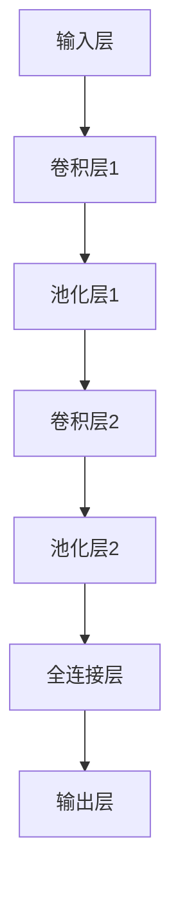

                 

关键词：人工智能、深度学习、卷积神经网络、可视化技术、算法原理、数学模型、项目实践

> 摘要：本文旨在深入探讨人工智能领域中的卷积神经网络（CNN）及其可视化技术。通过对CNN的核心概念、算法原理、数学模型和应用场景的详细解析，以及代码实例和实践分析，本文旨在帮助读者全面了解CNN的强大功能和潜力。

## 1. 背景介绍

人工智能（AI）作为21世纪最具革命性的技术之一，已经深刻影响了多个行业，从医疗健康到金融科技，再到自动驾驶和智能家居。在AI的众多分支中，深度学习（Deep Learning）尤为引人注目。深度学习是一种通过模仿人脑神经网络结构，实现复杂模式识别和学习能力的技术。而卷积神经网络（Convolutional Neural Networks，CNN）作为深度学习中的一种核心算法，以其在图像识别、语音处理和自然语言处理等领域卓越的表现，成为了人工智能研究的重要方向。

### 1.1 卷积神经网络的历史和发展

卷积神经网络起源于20世纪80年代末，由Yann LeCun等研究者提出。CNN的核心思想是利用卷积运算来提取图像中的特征，从而实现高效的图像识别。自提出以来，CNN经历了多个发展阶段，从最初的LeNet模型，到深度残差网络（ResNet）、生成对抗网络（GAN）等，不断推动着AI技术的发展。

### 1.2 卷积神经网络的重要性

CNN在图像识别和计算机视觉领域取得了显著的成果，主要因为其能够自动提取图像中的空间特征，避免了手工特征提取的复杂性和局限性。此外，CNN在自然语言处理、语音识别和医疗诊断等领域也有广泛应用，展示了其强大的通用性和适应性。

## 2. 核心概念与联系

要深入理解CNN，我们首先需要了解其核心概念和原理。以下是CNN中的一些关键概念及其相互关系。

### 2.1 神经元和层

神经元是神经网络的基本组成单位，类似于人脑中的神经元。在CNN中，神经元通常被组织成不同的层，包括输入层、卷积层、池化层、全连接层和输出层。

- **输入层**：接收原始数据，例如图像。
- **卷积层**：应用卷积核（filter）提取图像特征。
- **池化层**：对特征进行下采样，减少参数数量。
- **全连接层**：将特征映射到具体类别或任务。
- **输出层**：生成预测结果。

### 2.2 卷积运算和卷积核

卷积运算是CNN的核心操作，用于提取图像中的局部特征。卷积核是一个小型矩阵，通过在输入图像上滑动，实现特征提取。

$$
\text{卷积运算} = \sum_{i=1}^{n} w_i * x_i
$$

其中，$w_i$表示卷积核的权重，$x_i$表示输入特征。

### 2.3 池化操作

池化操作用于降低特征维度，同时保留最重要的特征信息。常见的池化操作包括最大池化和平均池化。

### 2.4 激活函数

激活函数用于引入非线性特性，使神经网络能够拟合复杂的非线性关系。ReLU（Rectified Linear Unit）是一种常用的激活函数，其形式为：

$$
\text{ReLU}(x) = \max(0, x)
$$

### 2.5 全连接层和输出层

全连接层将卷积层提取的特征映射到具体类别，通常使用softmax函数进行多分类。输出层则生成最终的预测结果。

## 2.6 Mermaid 流程图

下面是CNN的Mermaid流程图表示：



### 2.7 CNN与其他深度学习模型的联系

CNN是深度学习中的一种特殊模型，与其他模型如循环神经网络（RNN）和生成对抗网络（GAN）有着密切的联系。RNN在处理序列数据时具有优势，而GAN则在生成对抗场景中展现了强大的能力。通过结合这些模型，可以构建出更加复杂的深度学习系统，以应对不同的应用场景。

## 3. 核心算法原理 & 具体操作步骤

### 3.1 算法原理概述

CNN通过多个卷积层和池化层的堆叠，实现对图像的层次化特征提取。具体而言，CNN包括以下几个步骤：

1. **前向传播**：输入图像通过卷积层和池化层，逐渐提取出高层次特征。
2. **激活函数**：在每个卷积层后应用激活函数，引入非线性特性。
3. **反向传播**：利用梯度下降算法更新网络权重，优化模型参数。

### 3.2 算法步骤详解

#### 3.2.1 数据预处理

在进行CNN训练前，需要对图像进行预处理，包括归一化、裁剪和增强等操作。这些操作有助于提高模型的训练效果和泛化能力。

#### 3.2.2 前向传播

前向传播过程包括以下几个步骤：

1. **卷积层**：应用卷积核对图像进行特征提取。
2. **激活函数**：对卷积结果应用激活函数。
3. **池化层**：对特征进行下采样。
4. **全连接层**：将特征映射到具体类别。
5. **输出层**：生成预测结果。

#### 3.2.3 反向传播

反向传播过程用于更新网络权重，具体步骤如下：

1. **计算损失函数**：计算预测结果与实际标签之间的差异。
2. **计算梯度**：利用链式法则计算每个权重的梯度。
3. **更新权重**：利用梯度下降算法更新权重。

### 3.3 算法优缺点

#### 优点：

1. **高效的特征提取**：CNN能够自动提取图像中的高层次特征，避免了手工特征提取的复杂性。
2. **强大的泛化能力**：通过大量数据和迭代训练，CNN能够适应不同的图像和数据分布。
3. **广泛的应用场景**：CNN在图像识别、语音识别和自然语言处理等领域取得了显著成果。

#### 缺点：

1. **计算成本高**：CNN需要大量的计算资源和时间进行训练。
2. **参数数量大**：CNN中的参数数量庞大，可能导致过拟合。
3. **对数据依赖性强**：CNN的训练效果高度依赖于数据质量和数量。

### 3.4 算法应用领域

CNN在图像识别、语音识别、自然语言处理和医疗诊断等领域具有广泛应用。以下是一些典型的应用案例：

1. **图像识别**：CNN在ImageNet图像识别挑战中取得了优异成绩，大幅提高了图像识别的准确率。
2. **语音识别**：CNN结合循环神经网络（RNN），在语音识别任务中取得了突破性进展。
3. **自然语言处理**：CNN在文本分类、情感分析和机器翻译等任务中展现了强大的能力。
4. **医疗诊断**：CNN在医学图像分析中，如肿瘤检测、心脏病诊断等方面，提供了高效且准确的解决方案。

## 4. 数学模型和公式 & 详细讲解 & 举例说明

### 4.1 数学模型构建

CNN的数学模型主要由以下几个部分组成：

1. **输入层**：表示为 $X \in \mathbb{R}^{m \times n \times d}$，其中 $m$、$n$ 和 $d$ 分别表示图像的高度、宽度和通道数。
2. **卷积层**：表示为 $C \in \mathbb{R}^{k \times l \times c \times f}$，其中 $k$、$l$、$c$ 和 $f$ 分别表示卷积核的大小、通道数、输入通道数和输出通道数。
3. **激活函数**：通常使用 ReLU 激活函数，表示为 $\text{ReLU}(x) = \max(0, x)$。
4. **池化层**：通常使用最大池化，表示为 $P \in \mathbb{R}^{m' \times n' \times c'}$，其中 $m'$、$n'$ 和 $c'$ 分别表示池化后的高度、宽度和通道数。
5. **全连接层**：表示为 $F \in \mathbb{R}^{k' \times l' \times c''}$，其中 $k'$、$l'$ 和 $c''$ 分别表示全连接层的输出高度、宽度和通道数。
6. **输出层**：表示为 $O \in \mathbb{R}^{m'' \times n''}$，其中 $m''$ 和 $n''$ 分别表示输出层的高度和宽度。

### 4.2 公式推导过程

#### 卷积层

卷积层的输出可以表示为：

$$
Y = \text{ReLU}(\sum_{i=1}^{c} C_i \star X + b)
$$

其中，$C_i \in \mathbb{R}^{k \times l \times c \times f}$ 表示第 $i$ 个卷积核，$\star$ 表示卷积运算，$b \in \mathbb{R}^{c \times 1}$ 表示偏置项。

#### 池化层

池化层的输出可以表示为：

$$
P = \max(Y_{i, j})
$$

其中，$Y \in \mathbb{R}^{m \times n \times c}$ 表示卷积层的输出，$P \in \mathbb{R}^{m' \times n' \times c'}$ 表示池化层的输出。

#### 全连接层

全连接层的输出可以表示为：

$$
O = F \cdot P + b'
$$

其中，$F \in \mathbb{R}^{k' \times l' \times c''}$ 表示全连接层的权重，$b' \in \mathbb{R}^{c'' \times 1}$ 表示偏置项。

#### 输出层

输出层的输出可以表示为：

$$
\text{softmax}(O) = \frac{e^{O}}{\sum_{i=1}^{k''} e^{O_i}}
$$

其中，$O_i$ 表示输出层的第 $i$ 个元素。

### 4.3 案例分析与讲解

#### 案例一：图像分类

假设我们有一个包含10000张图像的图像分类任务，这些图像分为10个类别。我们使用一个简单的CNN模型进行训练，模型结构如下：

1. 输入层：$(32 \times 32 \times 3)$
2. 卷积层1：$(3 \times 3 \times 32 \times 64)$
3. 池化层1：$(2 \times 2)$
4. 卷积层2：$(3 \times 3 \times 64 \times 128)$
5. 池化层2：$(2 \times 2)$
6. 全连接层：$(1024)$
7. 输出层：$(10)$

#### 训练过程

1. **数据预处理**：对图像进行归一化处理，将像素值缩放到[0, 1]范围内。
2. **前向传播**：输入图像通过卷积层和池化层，逐渐提取出特征，最后通过全连接层得到分类结果。
3. **计算损失函数**：使用交叉熵损失函数计算预测结果与实际标签之间的差异。
4. **反向传播**：利用梯度下降算法更新网络权重，优化模型参数。

#### 模型评估

通过在测试集上评估模型性能，计算准确率、召回率和F1值等指标，评估模型的分类能力。

## 5. 项目实践：代码实例和详细解释说明

### 5.1 开发环境搭建

为了实践CNN算法，我们需要搭建一个开发环境。以下是一个基于Python和TensorFlow的简单示例：

1. 安装TensorFlow：

```bash
pip install tensorflow
```

2. 创建一个名为`cnn_example.py`的Python文件。

### 5.2 源代码详细实现

下面是CNN算法的简单实现：

```python
import tensorflow as tf
from tensorflow.keras import layers, models

# 创建模型
model = models.Sequential()

# 添加卷积层
model.add(layers.Conv2D(32, (3, 3), activation='relu', input_shape=(32, 32, 3)))
model.add(layers.MaxPooling2D((2, 2)))

model.add(layers.Conv2D(64, (3, 3), activation='relu'))
model.add(layers.MaxPooling2D((2, 2)))

model.add(layers.Conv2D(128, (3, 3), activation='relu'))
model.add(layers.MaxPooling2D((2, 2)))

# 添加全连接层
model.add(layers.Flatten())
model.add(layers.Dense(1024, activation='relu'))
model.add(layers.Dense(10, activation='softmax'))

# 编译模型
model.compile(optimizer='adam',
              loss='categorical_crossentropy',
              metrics=['accuracy'])

# 打印模型结构
model.summary()
```

### 5.3 代码解读与分析

1. **创建模型**：使用`models.Sequential()`创建一个序列模型。
2. **添加卷积层**：使用`layers.Conv2D()`添加卷积层，指定卷积核大小、激活函数和输入形状。
3. **添加池化层**：使用`layers.MaxPooling2D()`添加池化层，进行特征降维。
4. **添加全连接层**：使用`layers.Flatten()`将特征展平，然后添加全连接层，用于分类。
5. **编译模型**：使用`compile()`编译模型，指定优化器、损失函数和评估指标。

### 5.4 运行结果展示

运行以下代码，使用训练集和测试集进行模型训练和评估：

```python
# 加载训练数据和测试数据
(x_train, y_train), (x_test, y_test) = datasets.cifar10.load_data()

# 数据预处理
x_train = x_train.astype('float32') / 255.0
x_test = x_test.astype('float32') / 255.0

# 将标签转换为one-hot编码
y_train = tf.keras.utils.to_categorical(y_train, 10)
y_test = tf.keras.utils.to_categorical(y_test, 10)

# 训练模型
model.fit(x_train, y_train, batch_size=64, epochs=10, validation_data=(x_test, y_test))

# 评估模型
test_loss, test_acc = model.evaluate(x_test, y_test)
print('Test accuracy:', test_acc)
```

运行结果将显示模型的测试准确率。

## 6. 实际应用场景

卷积神经网络在图像识别、语音识别、自然语言处理和医疗诊断等领域具有广泛的应用。以下是一些具体的实际应用场景：

1. **图像识别**：CNN在ImageNet图像识别挑战中取得了优异成绩，广泛应用于人脸识别、物体识别和图像分类等领域。
2. **语音识别**：CNN结合循环神经网络（RNN），在语音识别任务中取得了突破性进展，应用于智能语音助手、语音翻译和语音搜索等领域。
3. **自然语言处理**：CNN在文本分类、情感分析和机器翻译等任务中展现了强大的能力，应用于社交媒体分析、智能客服和内容推荐等领域。
4. **医疗诊断**：CNN在医学图像分析中，如肿瘤检测、心脏病诊断等方面，提供了高效且准确的解决方案。

## 7. 工具和资源推荐

### 7.1 学习资源推荐

1. 《深度学习》（Goodfellow, Bengio, Courville著）
2. 《Python深度学习》（François Chollet著）
3. 《卷积神经网络与深度学习教程》（李航著）

### 7.2 开发工具推荐

1. TensorFlow
2. PyTorch
3. Keras

### 7.3 相关论文推荐

1. "A Learning Algorithm for Continually Running Fully Recurrent Neural Networks"（Hochreiter and Schmidhuber，1997）
2. "Deep Learning for Computer Vision: A Review"（Pangarkar et al.，2020）
3. "Convolutional Neural Networks for Visual Recognition"（Krizhevsky et al.，2012）

## 8. 总结：未来发展趋势与挑战

### 8.1 研究成果总结

卷积神经网络在图像识别、语音识别和自然语言处理等领域取得了显著成果，展示了其强大的能力和潜力。随着深度学习技术的不断发展，CNN在更多应用场景中取得了突破性进展。

### 8.2 未来发展趋势

1. **模型压缩与优化**：为了提高CNN的实时性能，模型压缩与优化技术将成为研究热点，包括知识蒸馏、剪枝和量化等。
2. **多模态学习**：多模态学习技术将融合不同类型的数据，如图像、语音和文本，实现更加智能和灵活的AI系统。
3. **自适应学习**：自适应学习技术将使CNN能够根据用户需求和场景动态调整模型结构和参数，提高模型的泛化能力和实用性。

### 8.3 面临的挑战

1. **计算资源消耗**：CNN的训练过程需要大量的计算资源和时间，如何高效地训练和部署CNN模型仍是一个挑战。
2. **数据依赖性强**：CNN的训练效果高度依赖于数据质量和数量，如何获取高质量和大规模的数据集仍是一个问题。
3. **模型解释性**：当前CNN模型具有较强的预测能力，但缺乏解释性，如何提高模型的透明度和可解释性是一个重要研究方向。

### 8.4 研究展望

未来，卷积神经网络将在更多领域发挥重要作用，如自动驾驶、机器人技术和智能医疗等。通过结合其他深度学习技术，如生成对抗网络（GAN）和强化学习（RL），CNN将实现更加智能和高效的AI系统。

## 9. 附录：常见问题与解答

### 9.1 什么是卷积神经网络？

卷积神经网络（CNN）是一种深度学习模型，主要用于图像识别和计算机视觉任务。它通过多个卷积层和池化层提取图像特征，实现高效的特征提取和分类。

### 9.2 CNN如何工作？

CNN通过卷积运算提取图像特征，然后通过激活函数引入非线性特性，最后通过全连接层和输出层生成预测结果。在训练过程中，利用反向传播算法优化模型参数。

### 9.3 CNN有哪些应用？

CNN在图像识别、语音识别、自然语言处理和医疗诊断等领域具有广泛应用。例如，在图像识别中，CNN可以用于物体识别、人脸识别和图像分类等。

### 9.4 如何优化CNN模型？

优化CNN模型的方法包括模型压缩、数据增强、正则化技术和激活函数的选择等。通过调整模型结构、优化训练策略和选用合适的算法，可以提高CNN模型的性能。

### 9.5 CNN与深度学习的关系是什么？

CNN是深度学习的一种特殊模型，主要应用于图像识别和计算机视觉任务。深度学习是一种通过模拟人脑神经网络结构实现复杂学习任务的技术，包括CNN、循环神经网络（RNN）和生成对抗网络（GAN）等。

---

作者：禅与计算机程序设计艺术 / Zen and the Art of Computer Programming

