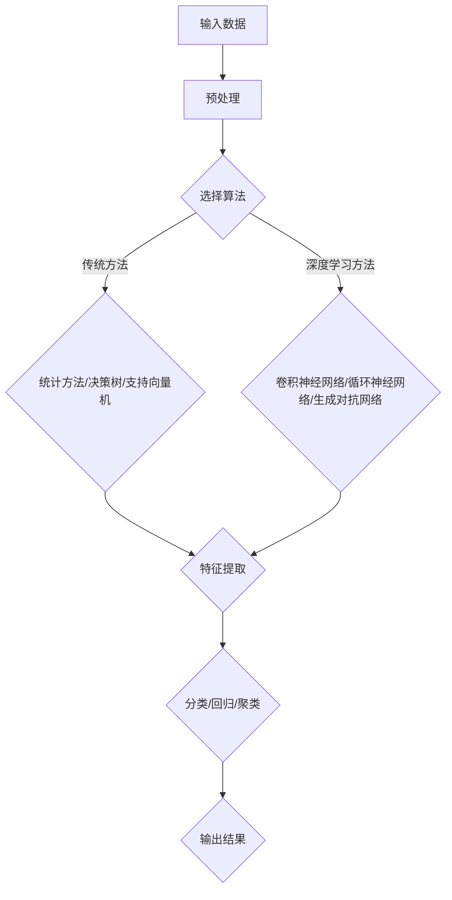
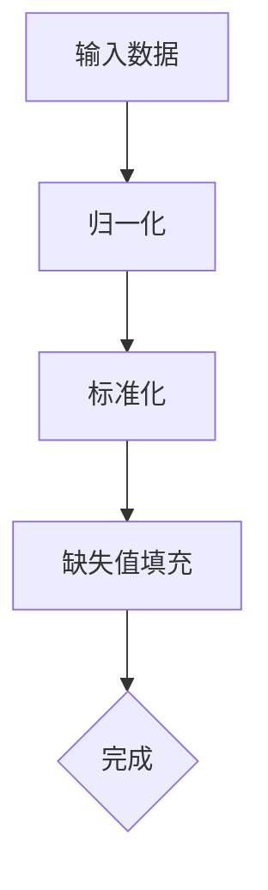
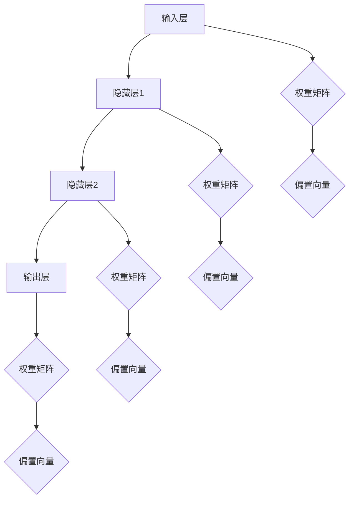
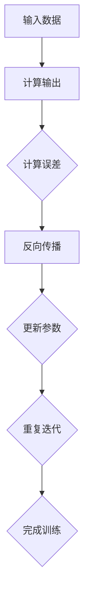
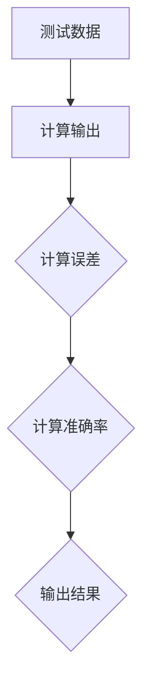
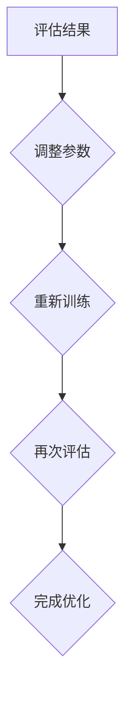

                 

关键词：人工智能，深度学习，模式识别，算法，神经网络，数据分析，机器学习，计算机视觉，自然语言处理。

> 摘要：本文深入探讨了深度学习算法在模式识别领域的应用，分析了其主要原理、实现方法以及实际应用场景。通过对深度学习模型的构建、训练和优化，展示了其在图像识别、语音识别和文本分析等方面的强大能力，为人工智能技术的发展提供了新的思路和方向。

## 1. 背景介绍

模式识别是人工智能领域的一个重要分支，旨在使计算机能够自动识别和理解各种类型的数据。随着大数据和人工智能技术的飞速发展，模式识别在图像识别、语音识别、文本分析等众多领域都取得了显著的成果。然而，传统的模式识别方法在处理复杂和大规模数据时往往表现出较低的性能，难以满足实际应用的需求。

近年来，深度学习作为一种新兴的人工智能技术，以其强大的表示学习和特征提取能力，在模式识别领域取得了突破性进展。深度学习算法通过构建多层神经网络模型，可以自动学习数据中的复杂结构和模式，从而实现高效的模式识别。本文将重点介绍深度学习算法在模式识别中的应用，包括核心概念、算法原理、数学模型以及实际案例等。

## 2. 核心概念与联系

### 2.1 深度学习算法

深度学习（Deep Learning）是一种基于人工神经网络的学习方法，通过构建多层神经网络模型来模拟人脑的学习过程，从而实现对数据的自动学习和特征提取。深度学习算法的核心是神经网络，主要包括输入层、隐藏层和输出层。每一层神经元都会对输入数据进行处理和转换，最终得到输出结果。

### 2.2 模式识别

模式识别（Pattern Recognition）是人工智能领域的一个重要分支，旨在使计算机能够自动识别和理解各种类型的数据。模式识别方法主要包括传统方法和深度学习方法。传统方法主要包括统计方法、决策树、支持向量机等；深度学习方法主要包括卷积神经网络（CNN）、循环神经网络（RNN）和生成对抗网络（GAN）等。

### 2.3 Mermaid 流程图



## 3. 核心算法原理 & 具体操作步骤

### 3.1 算法原理概述

深度学习算法的核心是神经网络，神经网络由大量神经元（节点）组成，每个神经元都可以接收多个输入信号，并产生一个输出信号。神经网络的训练过程就是通过调整每个神经元的权重和偏置，使其能够对输入数据进行正确的分类或回归。

深度学习算法主要包括以下步骤：

1. 数据预处理：对输入数据进行预处理，包括归一化、标准化、缺失值填充等。
2. 模型构建：根据问题需求和数据特征，构建合适的神经网络模型。
3. 模型训练：通过反向传播算法，不断调整模型参数，使模型能够对输入数据进行正确的分类或回归。
4. 模型评估：使用测试数据对模型进行评估，以确定模型的性能。
5. 模型优化：根据评估结果，对模型进行优化，以提高模型的性能。

### 3.2 算法步骤详解

1. 数据预处理：



2. 模型构建：



3. 模型训练：



4. 模型评估：



5. 模型优化：



### 3.3 算法优缺点

优点：

1. 强大的特征提取能力：深度学习算法可以通过多层网络结构自动提取数据中的复杂特征，从而提高识别精度。
2. 高效的计算性能：深度学习算法可以利用GPU等硬件加速，实现大规模数据的快速处理。
3. 广泛的应用领域：深度学习算法在图像识别、语音识别、自然语言处理等众多领域都取得了显著的应用成果。

缺点：

1. 需要大量数据和计算资源：深度学习算法的训练过程需要大量数据和计算资源，对硬件设备的要求较高。
2. 模型解释性较差：深度学习算法的内部结构和机制较为复杂，难以直观地解释模型的决策过程。
3. 过拟合问题：深度学习算法容易过拟合训练数据，导致模型在测试数据上表现不佳。

### 3.4 算法应用领域

1. 图像识别：深度学习算法在图像识别领域取得了显著成果，如人脸识别、图像分类、物体检测等。
2. 语音识别：深度学习算法在语音识别领域也得到了广泛应用，如语音合成、语音识别、语音搜索等。
3. 文本分析：深度学习算法在文本分析领域表现出强大的能力，如情感分析、文本分类、机器翻译等。
4. 计算机视觉：深度学习算法在计算机视觉领域具有广泛的应用，如自动驾驶、无人机导航、虚拟现实等。
5. 医疗诊断：深度学习算法在医疗诊断领域具有巨大潜力，如疾病预测、医学图像分析、药物研发等。

## 4. 数学模型和公式 & 详细讲解 & 举例说明

### 4.1 数学模型构建

深度学习算法的核心是多层神经网络模型，其数学模型可以表示为：

$$
y = f(z)
$$

其中，$y$ 是输出结果，$z$ 是输入特征向量，$f$ 是激活函数。

神经网络的输入层和输出层可以直接使用原始数据，而隐藏层则需要通过特征提取来提取数据中的复杂结构。特征提取可以通过线性变换和激活函数来实现：

$$
z_i = \sum_{j=1}^{n} w_{ij} x_j + b_i
$$

其中，$z_i$ 是隐藏层第 $i$ 个神经元的输入，$w_{ij}$ 是连接输入层和隐藏层的权重，$b_i$ 是隐藏层第 $i$ 个神经元的偏置。

激活函数可以采用多种形式，如 Sigmoid、ReLU、Tanh 等：

$$
f(z) = \frac{1}{1 + e^{-z}} \quad (Sigmoid) \\
f(z) = max(0, z) \quad (ReLU) \\
f(z) = \frac{e^z - e^{-z}}{e^z + e^{-z}} \quad (Tanh)
$$

### 4.2 公式推导过程

以 Sigmoid 激活函数为例，其公式推导如下：

首先，我们定义 Sigmoid 函数为：

$$
f(z) = \frac{1}{1 + e^{-z}}
$$

接下来，我们对 Sigmoid 函数求导：

$$
f'(z) = \frac{d}{dz} \left( \frac{1}{1 + e^{-z}} \right)
$$

使用链式法则求导，得到：

$$
f'(z) = \frac{-e^{-z}}{(1 + e^{-z})^2}
$$

简化后，得到：

$$
f'(z) = \frac{e^{-z}}{(1 + e^{-z})^2}
$$

### 4.3 案例分析与讲解

假设我们有一个简单的二元分类问题，输入特征为 $x_1$ 和 $x_2$，目标为 $y$，即：

$$
y = \begin{cases}
1, & \text{if } y > 0.5 \\
0, & \text{if } y \leq 0.5
\end{cases}
$$

我们可以使用 Sigmoid 激活函数构建一个神经网络模型，其输出为：

$$
z = \frac{1}{1 + e^{-(w_1x_1 + w_2x_2 + b)}}
$$

其中，$w_1$ 和 $w_2$ 是输入层和隐藏层之间的权重，$b$ 是隐藏层神经元的偏置。

假设我们已经得到了一个训练好的模型，其权重和偏置为：

$$
w_1 = 2, \quad w_2 = 3, \quad b = 1
$$

对于输入特征 $x_1 = 1$ 和 $x_2 = 1$，我们可以计算输出：

$$
z = \frac{1}{1 + e^{-(2 \cdot 1 + 3 \cdot 1 + 1)}} = \frac{1}{1 + e^{-6}} \approx 0.999
$$

因为输出接近于 1，我们可以认为这个输入特征属于正类，即 $y = 1$。

同样，对于输入特征 $x_1 = -1$ 和 $x_2 = -1$，我们可以计算输出：

$$
z = \frac{1}{1 + e^{-(2 \cdot (-1) + 3 \cdot (-1) + 1)}} = \frac{1}{1 + e^{6}} \approx 0.001
$$

因为输出接近于 0，我们可以认为这个输入特征属于负类，即 $y = 0$。

通过这个例子，我们可以看到 Sigmoid 激活函数在二元分类问题中的应用。在实际应用中，我们可以通过调整权重和偏置，使模型能够更好地分类不同的输入特征。

## 5. 项目实践：代码实例和详细解释说明

### 5.1 开发环境搭建

为了实现本文中提到的深度学习算法在模式识别中的应用，我们需要搭建一个适合开发的环境。以下是推荐的开发环境和工具：

1. 操作系统：Windows、Linux 或 macOS
2. 编程语言：Python
3. 深度学习框架：TensorFlow 或 PyTorch
4. 数据预处理库：NumPy、Pandas
5. 可视化库：Matplotlib、Seaborn

安装以上工具和库的方法如下：

```bash
# 安装 Python
wget https://www.python.org/ftp/python/3.8.5/Python-3.8.5.tgz
tar zxvf Python-3.8.5.tgz
cd Python-3.8.5
./configure
make
sudo make install

# 安装 TensorFlow
pip install tensorflow

# 安装 PyTorch
pip install torch torchvision

# 安装 NumPy、Pandas、Matplotlib 和 Seaborn
pip install numpy pandas matplotlib seaborn
```

### 5.2 源代码详细实现

以下是一个简单的深度学习算法实现，用于图像分类。我们使用 TensorFlow 框架和 CIFAR-10 数据集进行实验。

```python
import tensorflow as tf
from tensorflow.keras import layers
from tensorflow.keras.datasets import cifar10
import numpy as np

# 加载数据集
(x_train, y_train), (x_test, y_test) = cifar10.load_data()

# 数据预处理
x_train = x_train.astype("float32") / 255.0
x_test = x_test.astype("float32") / 255.0

# 归一化标签
y_train = tf.keras.utils.to_categorical(y_train, 10)
y_test = tf.keras.utils.to_categorical(y_test, 10)

# 构建模型
model = tf.keras.Sequential([
    layers.Conv2D(32, (3, 3), activation="relu", input_shape=(32, 32, 3)),
    layers.MaxPooling2D((2, 2)),
    layers.Conv2D(64, (3, 3), activation="relu"),
    layers.MaxPooling2D((2, 2)),
    layers.Conv2D(64, (3, 3), activation="relu"),
    layers.Flatten(),
    layers.Dense(64, activation="relu"),
    layers.Dense(10, activation="softmax")
])

# 编译模型
model.compile(optimizer="adam", loss="categorical_crossentropy", metrics=["accuracy"])

# 训练模型
model.fit(x_train, y_train, batch_size=64, epochs=10, validation_split=0.2)

# 评估模型
test_loss, test_acc = model.evaluate(x_test, y_test)
print("Test accuracy:", test_acc)
```

### 5.3 代码解读与分析

1. 导入相关库：首先，我们导入了 TensorFlow、Keras 和 NumPy 等库，用于构建和训练深度学习模型。
2. 加载数据集：使用 TensorFlow 的 keras.datasets 模块加载数据集，CIFAR-10 是一个常用的图像分类数据集，包含 10 个类别，每类 6000 张图片。
3. 数据预处理：将图像数据从 [0, 255] 范围缩放到 [0, 1]，并将标签转换为独热编码。
4. 构建模型：使用 Keras 的 Sequential 模式构建一个卷积神经网络模型，包括两个卷积层、一个池化层和一个全连接层。模型结构如下：
   - 输入层：32 个 3x3 卷积核，ReLU 激活函数
   - 池化层：2x2 最大池化
   - 隐藏层：64 个 3x3 卷积核，ReLU 激活函数
   - 池化层：2x2 最大池化
   - 隐藏层：64 个 3x3 卷积核，ReLU 激活函数
   - 输出层：10 个神经元，softmax 激活函数
5. 编译模型：指定优化器为 Adam，损失函数为交叉熵，评估指标为准确率。
6. 训练模型：使用训练数据集进行训练，设置批量大小为 64，训练周期为 10，验证数据集比例为 20%。
7. 评估模型：使用测试数据集对模型进行评估，输出测试准确率。

通过这个示例，我们可以看到如何使用深度学习算法进行图像分类。在实际应用中，我们可以根据具体问题和数据特征，调整模型结构、参数设置和训练策略，以达到更好的效果。

## 6. 实际应用场景

深度学习算法在模式识别领域的应用已经取得了显著的成果，以下是几个典型的实际应用场景：

### 6.1 图像识别

图像识别是深度学习算法最早也是最为成功的应用之一。在图像识别任务中，深度学习算法可以通过卷积神经网络（CNN）自动提取图像中的特征，从而实现图像分类、物体检测和图像分割等任务。

1. 图像分类：例如，Google 的 Inception 模型在 ImageNet 图像分类挑战中取得了显著的成果，将图像分类的准确率提高到了前所未有的水平。
2. 物体检测：例如，Facebook 的 RetinaNet 模型在物体检测任务中表现出强大的性能，广泛应用于自动驾驶、安防监控等领域。
3. 图像分割：例如，MIT 的 DeepLab 模型在图像分割任务中取得了优异的性能，可以用于医疗影像分析、自动驾驶等领域。

### 6.2 语音识别

语音识别是深度学习算法在语音处理领域的应用，旨在将语音信号转换为对应的文本。深度学习算法可以通过循环神经网络（RNN）或卷积神经网络（CNN）实现语音信号的自动特征提取和语义理解。

1. 语音合成：例如，Google 的 WaveNet 模型在语音合成任务中表现出卓越的性能，可以生成自然流畅的语音。
2. 语音识别：例如，百度 AI 的 ASR 模型在语音识别任务中具有很高的准确率，广泛应用于智能客服、智能家居等领域。
3. 语音翻译：例如，谷歌的 Translation 模型可以实现实时语音翻译，广泛应用于跨语言沟通、国际会议等领域。

### 6.3 文本分析

文本分析是深度学习算法在自然语言处理（NLP）领域的应用，旨在对文本数据进行自动分类、情感分析和实体识别等任务。

1. 情感分析：例如，微软的 EmotionalSentiment 模型可以分析社交媒体文本的情感倾向，帮助品牌和企业了解消费者的情感变化。
2. 文本分类：例如，IBM 的 Watson Text Analytics 模型可以对新闻文章、社交媒体文本等进行自动分类，帮助企业和机构快速获取有价值的信息。
3. 实体识别：例如，谷歌的 BERT 模型在实体识别任务中表现出强大的性能，可以识别文本中的命名实体，如人名、地名、组织名等。

### 6.4 其他应用

除了上述领域，深度学习算法在计算机视觉、医疗诊断、金融风控等众多领域也具有广泛的应用前景。

1. 计算机视觉：例如，微软的 Kinect 模型可以实现实时的人体姿态估计，广泛应用于运动分析、游戏互动等领域。
2. 医疗诊断：例如，IBM 的 Watson for Oncology 模型可以帮助医生进行癌症诊断和治疗建议，提高医疗诊断的准确性。
3. 金融风控：例如，蚂蚁金服的深度学习模型可以实现实时风险监控，提高金融系统的安全性。

## 7. 工具和资源推荐

为了更好地学习和应用深度学习算法，以下是几个推荐的工具和资源：

### 7.1 学习资源推荐

1. 《深度学习》（Ian Goodfellow、Yoshua Bengio 和 Aaron Courville 著）：这是一本经典的深度学习教材，全面介绍了深度学习的理论基础和实际应用。
2. 《神经网络与深度学习》（邱锡鹏 著）：这是一本适合初学者的深度学习入门教材，涵盖了深度学习的核心概念和实现方法。
3. Coursera 的《深度学习特化课程》：这是一个由斯坦福大学教授 Andrew Ng 主讲的一系列深度学习课程，内容涵盖了深度学习的理论基础、实践方法和最新进展。

### 7.2 开发工具推荐

1. TensorFlow：一个开源的深度学习框架，适用于构建和训练各种深度学习模型。
2. PyTorch：一个流行的深度学习框架，以其灵活性和动态图计算的优势受到广泛使用。
3. Keras：一个基于 TensorFlow 和 Theano 的深度学习高级 API，提供了简洁和易用的接口，适用于快速原型设计和实验。

### 7.3 相关论文推荐

1. "A Neural Algorithm of Artistic Style"（2015）：这篇文章提出了 GAN（生成对抗网络）的概念，为图像生成和风格迁移提供了新的思路。
2. "Deep Learning for Computer Vision"（2017）：这篇文章回顾了深度学习在计算机视觉领域的应用，分析了深度学习算法在不同任务上的表现。
3. "Natural Language Processing with Deep Learning"（2018）：这篇文章介绍了深度学习在自然语言处理领域的应用，包括文本分类、序列标注和机器翻译等任务。

## 8. 总结：未来发展趋势与挑战

深度学习算法在模式识别领域取得了显著的成果，为人工智能技术的发展提供了新的思路和方向。然而，随着数据规模的扩大和复杂性的增加，深度学习算法也面临着一些挑战和问题。

### 8.1 研究成果总结

1. 模型性能提升：深度学习算法在图像识别、语音识别和自然语言处理等领域的准确率取得了显著提升，推动了人工智能技术的发展。
2. 应用领域扩展：深度学习算法在计算机视觉、医疗诊断、金融风控等众多领域得到了广泛应用，为实际问题的解决提供了有力支持。
3. 开放源代码和工具：随着深度学习技术的普及，越来越多的开源代码和工具被发布，降低了深度学习实现的门槛，促进了技术的传播和交流。

### 8.2 未来发展趋势

1. 模型压缩和优化：为了提高深度学习算法的效率和实用性，模型压缩和优化将成为未来的重要研究方向，包括蒸馏、剪枝、量化等技术。
2. 迁移学习和少样本学习：迁移学习和少样本学习旨在利用已有的知识来提升模型在小样本数据集上的性能，具有广泛的应用前景。
3. 解释性和可解释性：深度学习算法的可解释性和解释性是一个重要的研究方向，旨在提高模型的透明度和可靠性。

### 8.3 面临的挑战

1. 数据隐私和安全：随着深度学习在各个领域的应用，数据隐私和安全问题日益突出，如何保护用户隐私成为亟待解决的问题。
2. 模型解释性和可解释性：深度学习算法的内部结构和机制较为复杂，如何提高模型的解释性和可解释性，使其更加直观和易懂，是一个重要的挑战。
3. 计算资源需求：深度学习算法的训练和推理过程需要大量的计算资源，如何提高算法的效率和降低计算成本，是一个重要的研究问题。

### 8.4 研究展望

未来，深度学习算法在模式识别领域将继续发挥重要作用，不断推动人工智能技术的发展。在解决实际问题的过程中，我们需要关注模型的性能、效率、可解释性和安全性等方面，不断探索新的算法和技术。同时，我们也需要加强国际合作和交流，共同推动人工智能技术的进步。

## 9. 附录：常见问题与解答

### 9.1 如何选择深度学习框架？

选择深度学习框架主要取决于个人需求、项目复杂度和社区支持。以下是几个常用的深度学习框架：

- TensorFlow：适用于大规模分布式训练，具有丰富的 API 和工具。
- PyTorch：具有动态图计算的优势，易于理解和调试。
- Keras：基于 TensorFlow 和 Theano，提供了简洁和易用的接口。
- MXNet：适用于大规模分布式训练，具有灵活的编程接口。

### 9.2 深度学习算法的过拟合问题如何解决？

深度学习算法的过拟合问题可以通过以下方法解决：

- 数据增强：通过旋转、缩放、裁剪等操作，增加训练数据的多样性，降低模型的过拟合风险。
- 正则化：添加正则化项，如 L1 正则化、L2 正则化，限制模型参数的规模，降低模型的复杂度。
- early stopping：在训练过程中，提前停止训练，以防止模型过拟合。
- dropout：在神经网络中引入 dropout 层，随机丢弃一部分神经元，降低模型的过拟合风险。

### 9.3 深度学习算法的训练时间如何优化？

深度学习算法的训练时间可以通过以下方法优化：

- GPU 加速：利用 GPU 的并行计算能力，加快模型的训练速度。
- 梯度下降法优化：选择合适的优化算法，如 Adam、RMSProp，提高训练效率。
- 批量大小调整：合理调整批量大小，提高模型收敛速度。
- 模型压缩：使用模型压缩技术，如蒸馏、剪枝、量化，减少模型参数规模和计算量。

### 9.4 深度学习算法的应用场景有哪些？

深度学习算法的应用场景非常广泛，包括但不限于：

- 图像识别：图像分类、物体检测、图像分割等。
- 语音识别：语音合成、语音识别、语音翻译等。
- 自然语言处理：文本分类、情感分析、序列标注、机器翻译等。
- 计算机视觉：自动驾驶、安防监控、运动分析等。
- 医疗诊断：疾病预测、医学图像分析、药物研发等。
- 金融风控：实时风险监控、信用评估、投资策略等。

### 9.5 深度学习算法的未来发展趋势是什么？

深度学习算法的未来发展趋势包括：

- 模型压缩和优化：为了提高模型的效率和实用性，模型压缩和优化将成为重要研究方向。
- 迁移学习和少样本学习：利用已有知识来提升模型在小样本数据集上的性能，具有广泛的应用前景。
- 解释性和可解释性：提高模型的透明度和可靠性，使其更加直观和易懂。
- 硬件加速：利用新型硬件，如 AI 芯片、TPU 等，加速模型的训练和推理。
- 跨学科融合：与其他领域（如生物医学、社会科学等）的交叉融合，推动深度学习技术的创新和应用。

---

# 结束语

本文深入探讨了深度学习算法在模式识别领域的应用，分析了其核心概念、算法原理、数学模型和实际案例。通过本文的介绍，读者可以了解到深度学习算法在图像识别、语音识别、文本分析等领域的强大能力，以及其在实际应用中的广泛前景。希望本文能为读者在深度学习领域的研究和应用提供有益的参考和启示。

### 作者署名

作者：禅与计算机程序设计艺术 / Zen and the Art of Computer Programming

