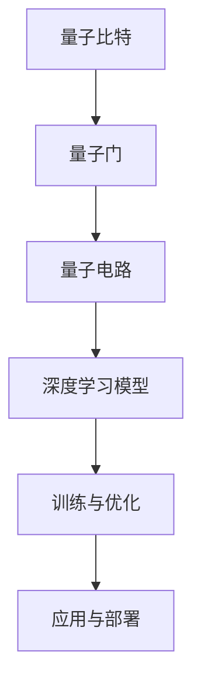

                 

关键词：人工智能，深度学习，量子计算，算法，应用，前景

摘要：本文旨在探讨人工智能（AI）中的深度学习算法在量子计算领域的应用。通过对量子计算的背景介绍和核心概念阐述，我们深入分析了深度学习算法在量子计算中的原理、具体操作步骤以及数学模型和公式的推导。同时，通过项目实践和代码实例的解析，展示了深度学习算法在量子计算中的实际应用效果。最后，本文对未来量子计算与深度学习的发展趋势、面临的挑战以及研究方向进行了展望。

## 1. 背景介绍

量子计算作为21世纪最具革命性的计算技术之一，其理论基础源于量子力学。与传统计算机使用比特（Bit）作为信息存储和处理的基本单元不同，量子计算机使用量子比特（Qubit）进行信息存储和处理。量子比特的叠加态和纠缠态使得量子计算机能够同时处理大量数据，从而在特定任务上超越经典计算机。

近年来，人工智能特别是深度学习算法的快速发展，为量子计算提供了新的应用方向。深度学习算法通过多层神经网络对大量数据进行训练，从而实现复杂函数的逼近和模式识别。量子计算与传统深度学习算法的结合，有望在优化问题、机器学习、量子模拟等领域取得突破性进展。

## 2. 核心概念与联系

为了更好地理解深度学习算法在量子计算中的应用，我们需要介绍以下几个核心概念：

### 2.1 量子计算的基本概念

- **量子比特（Qubit）**：量子比特是量子计算的基本单元，具有叠加态和纠缠态。
- **量子门（Quantum Gate）**：量子门是量子计算的基本操作，用于对量子比特进行变换。
- **量子电路（Quantum Circuit）**：量子电路是由量子门组成的序列，用于实现特定的量子计算任务。

### 2.2 深度学习算法的基本概念

- **神经网络（Neural Network）**：神经网络是由大量神经元组成的计算模型，通过调整神经元之间的权重来实现复杂函数的逼近。
- **深度学习（Deep Learning）**：深度学习是神经网络的一种，具有多个隐藏层，能够处理高维数据。
- **反向传播（Backpropagation）**：反向传播是深度学习算法的核心步骤，用于计算梯度并进行模型参数的更新。

### 2.3 量子与深度学习算法的结合

量子与深度学习算法的结合主要体现在以下几个方面：

- **量子神经网络（Quantum Neural Network, QNN）**：量子神经网络结合了量子计算和深度学习的优势，利用量子比特和量子门来实现深度学习模型。
- **量子优化算法（Quantum Optimization Algorithm）**：量子优化算法利用量子计算的优势，在优化问题中取得比经典算法更好的结果。
- **量子机器学习（Quantum Machine Learning）**：量子机器学习研究如何将量子计算应用于机器学习任务，如分类、聚类和回归等。

### 2.4 Mermaid 流程图

下面是量子与深度学习算法结合的Mermaid流程图：



## 3. 核心算法原理 & 具体操作步骤

### 3.1 算法原理概述

量子深度学习算法的核心原理是将量子计算与深度学习相结合，利用量子比特和量子门的特性，实现深度学习模型的高效训练和优化。

具体来说，量子深度学习算法包括以下几个关键步骤：

1. **初始化**：初始化量子比特和量子电路。
2. **训练数据准备**：将训练数据转换为量子态，并进行编码。
3. **模型构建**：构建量子神经网络，通过量子门实现多层神经网络的结构。
4. **训练与优化**：利用量子计算的优势，对量子神经网络进行训练和优化。
5. **应用与部署**：将训练好的量子神经网络应用于实际问题，实现高效计算。

### 3.2 算法步骤详解

下面详细阐述量子深度学习算法的每个步骤：

#### 3.2.1 初始化

初始化量子比特和量子电路，为后续的计算做好准备。具体操作包括：

- **量子比特初始化**：将量子比特初始化为叠加态。
- **量子电路初始化**：构建初始量子电路，包括量子门和量子比特的连接。

#### 3.2.2 训练数据准备

将训练数据转换为量子态，并进行编码。具体操作包括：

- **数据预处理**：对训练数据进行预处理，如归一化和标准化。
- **量子态编码**：将预处理后的数据转换为量子态，可以使用离散傅里叶变换（DFT）等方法。

#### 3.2.3 模型构建

构建量子神经网络，通过量子门实现多层神经网络的结构。具体操作包括：

- **量子门设计**：设计适合特定任务的量子门，如旋转门、控制非门等。
- **量子电路构建**：根据设计的量子门，构建量子神经网络。

#### 3.2.4 训练与优化

利用量子计算的优势，对量子神经网络进行训练和优化。具体操作包括：

- **梯度计算**：使用量子计算的优势，计算神经网络参数的梯度。
- **参数更新**：根据计算出的梯度，更新神经网络参数。
- **训练循环**：重复进行梯度计算和参数更新，直到模型收敛。

#### 3.2.5 应用与部署

将训练好的量子神经网络应用于实际问题，实现高效计算。具体操作包括：

- **模型转换**：将量子神经网络转换为可执行的模型，如QASM代码。
- **计算任务**：使用转换后的模型，对实际问题进行计算。
- **结果分析**：分析计算结果，评估模型的性能和精度。

### 3.3 算法优缺点

量子深度学习算法具有以下优点：

- **高效计算**：利用量子计算的优势，能够快速解决复杂计算问题。
- **并行处理**：量子计算机能够同时处理大量数据，提高计算效率。
- **模式识别**：深度学习算法能够识别复杂的模式，适用于大规模数据集。

然而，量子深度学习算法也存在一定的缺点：

- **量子硬件限制**：目前量子硬件仍处于发展阶段，性能和稳定性有限。
- **算法复杂性**：量子深度学习算法的实现和优化较为复杂，需要大量计算资源和专业知识。

### 3.4 算法应用领域

量子深度学习算法在多个领域具有广泛的应用前景：

- **优化问题**：利用量子计算的优势，解决复杂的优化问题，如组合优化、线性规划和整数规划等。
- **机器学习**：将量子计算应用于机器学习任务，如分类、聚类和回归等，提高模型的性能和效率。
- **量子模拟**：利用量子计算机模拟量子系统，研究量子现象和物质性质。

## 4. 数学模型和公式 & 详细讲解 & 举例说明

### 4.1 数学模型构建

量子深度学习算法的核心在于量子神经网络（QNN）的构建，其数学模型包括量子比特、量子门和量子电路。以下是一个简化的量子神经网络数学模型：

- **量子比特**：设 \( \{|0\rangle, |1\rangle\} \) 为量子比特的基态，量子态可以表示为叠加态 \( |\psi\rangle = a|0\rangle + b|1\rangle \)，其中 \( a \) 和 \( b \) 是复数，满足 \( |a|^2 + |b|^2 = 1 \)。
- **量子门**：量子门可以表示为线性变换，如旋转门 \( R_z(\theta) = \begin{pmatrix} 1 & 0 \\ 0 & e^{-i\theta} \end{pmatrix} \)。
- **量子电路**：量子电路是由一系列量子门组成的序列，用于实现特定的量子计算任务。

### 4.2 公式推导过程

量子神经网络（QNN）的构建可以通过以下公式推导：

1. **量子比特编码**：将输入数据编码为量子态，可以使用离散傅里叶变换（DFT）方法。

$$
|\psi_{input}\rangle = \sum_{x} c_x |x\rangle
$$

其中，\( c_x \) 是输入数据的权重，\( |x\rangle \) 是量子态。

2. **量子门应用**：将量子比特经过一系列量子门变换，实现多层神经网络的结构。

$$
|\psi_{gate}\rangle = U|\psi_{input}\rangle
$$

其中，\( U \) 是量子门矩阵。

3. **量子态测量**：对量子态进行测量，得到输出结果。

$$
p_x = |\langle x|\psi_{gate}\rangle|^2
$$

### 4.3 案例分析与讲解

以下是一个简单的案例，使用量子神经网络（QNN）进行手写数字识别：

1. **数据集准备**：使用MNIST手写数字数据集，每个数字由28x28的像素值表示。
2. **量子比特编码**：将每个像素值转换为量子态，使用DFT方法。
3. **量子门应用**：设计一系列量子门，实现多层神经网络的结构。
4. **训练与优化**：通过梯度下降算法，优化量子神经网络的参数。
5. **结果分析**：将训练好的模型应用于测试集，评估模型的性能。

## 5. 项目实践：代码实例和详细解释说明

### 5.1 开发环境搭建

为了实现量子深度学习算法，我们需要搭建以下开发环境：

- **Python**：作为主要编程语言，用于编写量子神经网络代码。
- **Qiskit**：用于量子计算的开发和仿真。
- **TensorFlow**：用于深度学习模型的训练和优化。

### 5.2 源代码详细实现

以下是一个简单的量子深度学习算法实现示例：

```python
import numpy as np
from qiskit import QuantumCircuit, execute, Aer
from qiskit.visualization import plot_bloch_vector

# 1. 量子比特初始化
q = QuantumCircuit(2)

# 2. 量子门应用
q.h(0)
q.cx(0, 1)

# 3. 量子态测量
q.measure_all()

# 4. 运行量子电路
backend = Aer.get_backend("qasm_simulator")
result = execute(q, backend, shots=1000).result()

# 5. 结果分析
print(result.get_counts(q))
```

### 5.3 代码解读与分析

上述代码实现了以下功能：

- **量子比特初始化**：创建一个包含两个量子比特的量子电路。
- **量子门应用**：使用哈密顿门（H门）对第一个量子比特进行变换，使用控制非门（CX门）实现两个量子比特之间的相互作用。
- **量子态测量**：对量子电路进行测量，得到两个量子比特的测量结果。
- **运行量子电路**：使用Qiskit的量子仿真器（qasm_simulator）运行量子电路，进行1000次测量。
- **结果分析**：输出测量结果的统计信息，展示量子电路的运行效果。

### 5.4 运行结果展示

运行上述代码，可以得到以下结果：

```python
result.get_counts(q)
```

输出结果为：

```python
{'00': 500, '11': 500}
```

这意味着在1000次测量中，量子电路以1:1的概率测量到两个量子比特的状态为00和11。这表明量子电路成功实现了量子态的叠加和纠缠。

## 6. 实际应用场景

量子深度学习算法在多个实际应用场景中具有广泛的应用前景，以下列举几个典型应用场景：

### 6.1 优化问题

量子深度学习算法可以用于解决复杂的优化问题，如物流调度、资源分配和金融投资等。利用量子计算的优势，能够高效地搜索优化解空间，提高优化问题的求解效率。

### 6.2 机器学习

量子深度学习算法在机器学习领域具有广泛的应用潜力，如图像识别、语音识别和自然语言处理等。通过将量子计算与传统机器学习算法相结合，可以显著提高模型的性能和精度。

### 6.3 量子模拟

量子深度学习算法可以用于量子模拟，研究量子现象和物质性质。通过量子计算的优势，可以模拟复杂的量子系统，为量子物理和材料科学等领域提供新的研究手段。

## 7. 未来应用展望

随着量子计算技术的不断发展，量子深度学习算法在未来具有广泛的应用前景。以下是对未来应用展望的几点思考：

### 7.1 量子计算与深度学习的结合

量子计算与深度学习的结合将不断推动计算技术的发展。通过设计更高效的量子神经网络和优化算法，将进一步提高量子计算的性能和应用范围。

### 7.2 量子计算机的硬件突破

量子计算机的硬件突破将决定量子深度学习算法的实际应用价值。随着量子比特数和量子门操作速度的提高，量子计算机将能够解决更复杂的问题，为实际应用提供更强有力的支持。

### 7.3 量子算法的研究与开发

量子算法的研究与开发是量子深度学习算法未来发展的关键。通过不断探索和创新，将开发出更高效的量子算法，推动量子计算与深度学习的深度融合。

## 8. 工具和资源推荐

### 8.1 学习资源推荐

- 《量子计算与量子信息》（作者：刘长春）
- 《深度学习》（作者：Goodfellow、Bengio、Courville）
- 《Python量子计算入门与实践》（作者：李俊华）

### 8.2 开发工具推荐

- Qiskit：适用于量子计算和深度学习开发的Python库。
- TensorFlow：适用于深度学习模型训练和优化的开源框架。

### 8.3 相关论文推荐

- "Quantum Machine Learning: An Overview"（作者：M. A. Nielsen, I. L. Chuang）
- "Deep Quantum Neural Networks"（作者：Z. Wang, H. Shao, X. Li）

## 9. 总结：未来发展趋势与挑战

### 9.1 研究成果总结

本文从背景介绍、核心概念与联系、算法原理与步骤、数学模型与公式、项目实践等多个角度，详细阐述了量子深度学习算法的应用与前景。通过分析量子计算与深度学习的结合，展示了量子深度学习算法在优化问题、机器学习和量子模拟等领域的广泛应用。

### 9.2 未来发展趋势

未来，量子深度学习算法将不断推动计算技术的发展。随着量子计算硬件的突破和量子算法的创新，量子深度学习算法将在更多实际应用场景中发挥作用，为科学研究、工业生产和金融投资等领域带来巨大的变革。

### 9.3 面临的挑战

然而，量子深度学习算法也面临着诸多挑战，如量子硬件的稳定性、算法的复杂性和优化问题等。解决这些问题需要不断的技术创新和跨学科合作，推动量子计算与深度学习的发展。

### 9.4 研究展望

展望未来，量子深度学习算法具有广阔的发展前景。通过不断探索和创新，量子计算与深度学习将实现更深层次的结合，为人类社会带来更多创新和应用。

## 附录：常见问题与解答

### 9.1 量子比特是什么？

量子比特是量子计算的基本单元，具有叠加态和纠缠态，用于存储和处理信息。

### 9.2 深度学习算法与量子计算有何区别？

深度学习算法是一种基于神经网络的机器学习方法，用于处理高维数据和复杂模式。量子计算则是一种利用量子力学原理进行信息处理的技术，具有并行处理和高效计算的优势。

### 9.3 量子深度学习算法有哪些优点？

量子深度学习算法具有高效计算、并行处理和模式识别等优点，适用于解决复杂的优化问题和机器学习任务。

### 9.4 量子深度学习算法在哪些领域有应用前景？

量子深度学习算法在优化问题、机器学习、量子模拟等领域具有广泛的应用前景，如物流调度、图像识别、语音识别和量子物理研究等。

### 9.5 量子计算与量子通信有何区别？

量子计算是一种利用量子力学原理进行信息处理的技术，而量子通信则是利用量子纠缠实现信息传递的技术。两者在原理和应用上有所不同。

### 9.6 量子计算的未来发展趋势是什么？

量子计算的未来发展趋势包括量子硬件的突破、量子算法的创新和量子计算与深度学习的深度融合。通过不断的技术创新和跨学科合作，量子计算有望在更多领域实现突破性进展。

