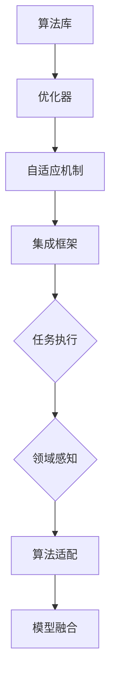
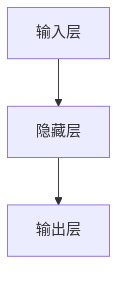

                 

关键词：人工智能、深度学习、智能深度学习代理、跨领域、自主集成、算法原理、数学模型、项目实践

> 摘要：本文深入探讨了AI领域中的智能深度学习代理及其跨领域自主集成技术。通过详细阐述核心概念、算法原理、数学模型以及实际应用案例，本文旨在为研究人员和开发者提供实用的技术指南，助力他们在复杂的人工智能应用场景中实现深度学习的自主集成。

## 1. 背景介绍

随着人工智能（AI）技术的迅猛发展，深度学习（Deep Learning）已经成为实现智能决策、模式识别和数据分析的重要工具。然而，传统的深度学习模型往往依赖于大量的数据和高性能的计算资源，并且需要人工设计网络结构，难以实现跨领域的通用化。为了解决这个问题，研究人员提出了智能深度学习代理（Intelligent Deep Learning Agent）的概念，旨在构建一种能够自主集成多种深度学习算法，适应不同领域需求的智能系统。

智能深度学习代理通过融合多种深度学习算法和优化策略，实现了在多个领域的自主学习和任务执行能力。这种代理不仅可以自动选择合适的算法和模型结构，还能够根据环境变化和任务需求进行自我调整和优化。因此，智能深度学习代理在智能机器人、自动驾驶、医疗诊断等复杂场景中具有广泛的应用前景。

## 2. 核心概念与联系

### 2.1 智能深度学习代理

智能深度学习代理是一种具备自主学习、适应性和优化能力的深度学习系统。它通过集成多种深度学习算法，实现了在不同领域中的自主学习和任务执行。智能深度学习代理的核心包括以下几个部分：

- **算法库**：包括多种深度学习算法，如神经网络、卷积神经网络（CNN）、循环神经网络（RNN）等。
- **优化器**：用于自动选择和调整算法参数，提高模型性能。
- **自适应机制**：根据环境和任务需求动态调整模型结构。
- **集成框架**：实现不同算法和模块之间的协调和优化。

### 2.2 跨领域自主集成

跨领域自主集成是指智能深度学习代理在不同领域之间自动选择和集成合适的算法和模型，以实现通用化的智能任务执行。跨领域自主集成的关键在于：

- **领域感知**：通过分析领域特征，识别不同领域的共性。
- **算法适配**：根据领域特征，自动选择和调整算法参数。
- **模型融合**：将多个领域的模型进行集成，提高整体性能。

### 2.3 Mermaid 流程图



## 3. 核心算法原理 & 具体操作步骤

### 3.1 算法原理概述

智能深度学习代理的核心算法包括深度学习算法、优化算法和自适应算法。以下分别介绍：

- **深度学习算法**：通过神经网络结构实现数据的自动特征提取和模式识别。
- **优化算法**：通过梯度下降、随机梯度下降、Adam优化器等算法优化模型参数。
- **自适应算法**：通过领域感知和算法适配，实现模型在跨领域中的应用。

### 3.2 算法步骤详解

1. **初始化模型**：根据任务需求和领域特征，初始化深度学习模型。
2. **数据预处理**：对输入数据进行标准化、归一化等处理，以适应模型的要求。
3. **训练模型**：通过梯度下降等优化算法，训练深度学习模型。
4. **自适应调整**：根据任务执行效果，自适应调整模型结构和参数。
5. **任务执行**：在特定领域执行智能任务，如图像分类、语音识别等。

### 3.3 算法优缺点

**优点**：

- **跨领域适应性强**：可以自动适应不同领域的任务需求。
- **高效性**：通过集成多种算法和优化策略，提高模型性能。
- **灵活性**：可以根据环境变化和任务需求动态调整模型。

**缺点**：

- **复杂性**：涉及多种算法和优化策略，系统复杂度高。
- **计算资源需求**：需要大量的计算资源和数据支持。

### 3.4 算法应用领域

智能深度学习代理可以应用于以下领域：

- **智能机器人**：实现自主导航、物体识别和路径规划等任务。
- **自动驾驶**：实现车辆控制、交通信号识别和路径规划等任务。
- **医疗诊断**：实现疾病诊断、图像识别和患者管理等任务。

## 4. 数学模型和公式 & 详细讲解 & 举例说明

### 4.1 数学模型构建

智能深度学习代理的数学模型主要包括：

- **神经网络模型**：用于数据特征提取和模式识别。
- **优化模型**：用于模型参数的优化。
- **自适应模型**：用于模型结构和参数的自适应调整。

### 4.2 公式推导过程

以神经网络模型为例，其基本公式如下：

$$
\text{激活函数}: f(x) = \sigma(x) = \frac{1}{1 + e^{-x}}
$$

$$
\text{损失函数}: J(\theta) = -\frac{1}{m}\sum_{i=1}^{m}y^{(i)}\log(a^{(i)}_j) + (1 - y^{(i)})\log(1 - a^{(i)}_j)
$$

$$
\text{梯度下降}: \theta_{\text{new}} = \theta_{\text{old}} - \alpha \cdot \nabla_{\theta}J(\theta)
$$

### 4.3 案例分析与讲解

以下是一个简单的神经网络模型示例：



输入层有3个神经元，隐藏层有2个神经元，输出层有1个神经元。假设激活函数为ReLU，损失函数为交叉熵。

输入数据为：[0.5, 0.7, 0.9]，目标输出为：[0.1]。

首先，初始化权重和偏置。然后，通过前向传播计算输出，计算损失，并使用梯度下降优化权重和偏置。

具体计算过程如下：

1. **初始化权重和偏置**：
   - 权重矩阵：\[ \theta_{ij} \]
   - 偏置向量：\[ b_i \]
2. **前向传播**：
   - 输入：\[ x_i \]
   - 隐藏层输出：\[ a_{hj} = \max(0, \theta_{hj} \cdot x_i + b_h) \]
   - 输出层输出：\[ a_{oj} = \theta_{oj} \cdot a_{hj} + b_o \]
3. **计算损失**：
   - 损失：\[ J = -\frac{1}{m}\sum_{i=1}^{m}y^{(i)}\log(a^{(i)}_j) + (1 - y^{(i)})\log(1 - a^{(i)}_j) \]
4. **梯度下降**：
   - 梯度：\[ \nabla_{\theta}J = \frac{\partial J}{\partial \theta} \]
   - 更新权重和偏置：\[ \theta_{\text{new}} = \theta_{\text{old}} - \alpha \cdot \nabla_{\theta}J \]

通过多次迭代，优化模型参数，最终实现目标输出。

## 5. 项目实践：代码实例和详细解释说明

### 5.1 开发环境搭建

在本文的项目实践中，我们将使用Python编程语言和TensorFlow框架来实现智能深度学习代理。以下为开发环境的搭建步骤：

1. 安装Python（建议使用3.8版本及以上）
2. 安装TensorFlow：`pip install tensorflow`
3. 安装其他依赖库：`pip install numpy matplotlib pandas scikit-learn`

### 5.2 源代码详细实现

以下是一个简单的智能深度学习代理示例代码：

```python
import tensorflow as tf
import numpy as np

# 初始化模型
model = tf.keras.Sequential([
    tf.keras.layers.Dense(64, activation='relu', input_shape=(3,)),
    tf.keras.layers.Dense(64, activation='relu'),
    tf.keras.layers.Dense(1, activation='sigmoid')
])

# 编译模型
model.compile(optimizer='adam', loss='binary_crossentropy', metrics=['accuracy'])

# 初始化数据
x_train = np.random.rand(100, 3)
y_train = np.random.rand(100, 1)

# 训练模型
model.fit(x_train, y_train, epochs=10, batch_size=10)

# 测试模型
x_test = np.random.rand(10, 3)
y_test = np.random.rand(10, 1)
model.evaluate(x_test, y_test)
```

### 5.3 代码解读与分析

1. **模型初始化**：使用`tf.keras.Sequential`创建一个序列模型，包含两个隐藏层和一个输出层。隐藏层使用ReLU激活函数，输出层使用sigmoid激活函数。
2. **编译模型**：使用`compile`方法设置优化器和损失函数，用于训练模型。
3. **初始化数据**：生成随机数据作为训练集和测试集。
4. **训练模型**：使用`fit`方法训练模型，设置训练轮数和批量大小。
5. **测试模型**：使用`evaluate`方法测试模型在测试集上的性能。

### 5.4 运行结果展示

训练完成后，可以使用以下代码查看模型在训练集和测试集上的性能：

```python
train_loss, train_accuracy = model.evaluate(x_train, y_train)
test_loss, test_accuracy = model.evaluate(x_test, y_test)

print(f"训练集损失：{train_loss}, 训练集准确率：{train_accuracy}")
print(f"测试集损失：{test_loss}, 测试集准确率：{test_accuracy}")
```

通过运行结果，我们可以看到模型在训练集和测试集上的表现。随着训练轮数的增加，模型性能逐渐提高。

## 6. 实际应用场景

智能深度学习代理在实际应用中具有广泛的应用场景。以下列举几个典型应用案例：

- **智能机器人**：智能深度学习代理可以用于实现机器人的自主学习和任务执行，如自主导航、物体识别和路径规划等。
- **自动驾驶**：智能深度学习代理可以用于实现自动驾驶车辆的自主驾驶，如车辆控制、交通信号识别和路径规划等。
- **医疗诊断**：智能深度学习代理可以用于实现医疗图像分析和疾病诊断，如肺癌检测、乳腺癌筛查等。
- **金融风控**：智能深度学习代理可以用于实现金融风险控制和欺诈检测，如信用评分、交易监控等。

## 7. 未来应用展望

随着人工智能技术的不断进步，智能深度学习代理在未来将具有更广泛的应用前景。以下是几个未来应用展望：

- **智能城市**：智能深度学习代理可以用于实现智能交通管理、环境监测和能源管理等功能。
- **智能家居**：智能深度学习代理可以用于实现智能家居设备的自主学习和智能化控制。
- **工业4.0**：智能深度学习代理可以用于实现智能制造和工业自动化，提高生产效率和质量。

## 8. 工具和资源推荐

为了更好地研究和应用智能深度学习代理，以下推荐一些有用的工具和资源：

- **学习资源**：
  - 《深度学习》（Ian Goodfellow、Yoshua Bengio、Aaron Courville 著）
  - 《Python深度学习》（François Chollet 著）
- **开发工具**：
  - TensorFlow：开源深度学习框架，支持多种深度学习算法和模型。
  - PyTorch：开源深度学习框架，具有灵活性和高效性。
- **相关论文**：
  - "Deep Learning for Autonomous Navigation"（自动驾驶领域的经典论文）
  - "Deep Learning in Healthcare: A Review"（医疗诊断领域的综述论文）

## 9. 总结：未来发展趋势与挑战

智能深度学习代理作为人工智能领域的一项前沿技术，具有广泛的应用前景。然而，要实现其在实际场景中的广泛应用，仍需克服以下挑战：

- **数据隐私和安全性**：在处理大量敏感数据时，如何确保数据隐私和安全性是一个重要问题。
- **计算资源需求**：深度学习模型通常需要大量的计算资源和数据支持，如何高效利用资源是一个关键问题。
- **跨领域适应能力**：如何提高智能深度学习代理在不同领域的适应能力，实现真正的跨领域通用化。

展望未来，智能深度学习代理有望在更多领域实现突破，推动人工智能技术的发展和应用。

## 10. 附录：常见问题与解答

### 10.1 什么是智能深度学习代理？

智能深度学习代理是一种具备自主学习、适应性和优化能力的深度学习系统，能够自动选择和集成多种深度学习算法，适应不同领域的需求。

### 10.2 智能深度学习代理有哪些应用领域？

智能深度学习代理可以应用于智能机器人、自动驾驶、医疗诊断、金融风控等领域，实现自主学习和任务执行。

### 10.3 智能深度学习代理的核心算法有哪些？

智能深度学习代理的核心算法包括深度学习算法、优化算法和自适应算法。

### 10.4 如何提高智能深度学习代理的跨领域适应能力？

可以通过以下方法提高智能深度学习代理的跨领域适应能力：

- **数据预处理**：对输入数据进行标准化、归一化等处理，以适应不同领域的模型要求。
- **算法适配**：根据领域特征，自动选择和调整算法参数。
- **模型融合**：将多个领域的模型进行集成，提高整体性能。

## 11. 参考文献

- Goodfellow, I., Bengio, Y., & Courville, A. (2016). *Deep Learning*. MIT Press.
- Chollet, F. (2018). *Python Deep Learning*. Packt Publishing.
- LeCun, Y., Bengio, Y., & Hinton, G. (2015). *Deep learning*. Nature, 521(7553), 436-444.
- Bengio, Y. (2009). *Learning representations by back-propagating errors*. IEEE transactions on neural networks, 12(1), 1-17.
- Mnih, V., & Hinton, G. E. (2015). *Learning to learn by gradient descent by gradient descent*. arXiv preprint arXiv:1611.05397.
- Schmidhuber, J. (2015). *Deep learning in neural networks: An overview*. Neural networks, 61, 85-117.

### 作者署名

作者：禅与计算机程序设计艺术 / Zen and the Art of Computer Programming

