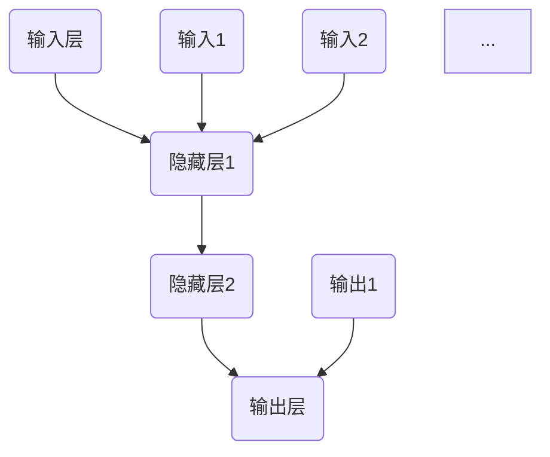

                 

关键词：人工智能，深度学习，神经网络，复杂度，能力，算法，应用领域，未来展望

> 摘要：本文旨在探讨人工智能（AI）领域中的深度学习算法，特别是神经网络的结构与性能。文章首先介绍了神经网络的背景和历史，然后深入分析了其复杂度与能力，并探讨了算法原理、数学模型以及实际应用。最后，文章总结了当前研究趋势与挑战，并展望了未来的发展方向。

## 1. 背景介绍

自20世纪50年代人工智能（AI）首次被提出以来，研究者们一直在努力让计算机具备类似人类智能的能力。早期的AI研究主要集中在符号主义和知识表示上，但由于其计算复杂度和灵活性限制，这些方法未能取得突破性进展。随着计算能力的提升和大数据的涌现，深度学习（Deep Learning）成为了AI研究的重要分支。

深度学习是一种基于多层神经网络的机器学习方法。神经网络最早由心理学家和计算机科学家在20世纪40年代提出，作为模仿人脑信息处理过程的数学模型。在20世纪80年代，由于计算资源的限制和优化算法的不成熟，神经网络的研究一度停滞。但随着GPU等高性能计算设备的普及以及优化算法的改进，神经网络在21世纪初迎来了复苏。

## 2. 核心概念与联系

为了深入理解神经网络，我们首先需要了解几个核心概念，如神经元、层级、前向传播和反向传播。

### 2.1 神经元与层级

神经网络的基本组成单元是神经元。每个神经元接收多个输入，通过激活函数处理后产生一个输出。神经网络由多个层级组成，包括输入层、隐藏层和输出层。输入层接收外部输入数据，隐藏层对数据进行处理和转换，输出层产生最终的输出结果。

### 2.2 前向传播

前向传播是神经网络处理数据的基本过程。数据从输入层开始，逐层传递到隐藏层，最终到达输出层。在每个层级，神经元的输出通过激活函数处理后传递到下一层。前向传播的过程可以表示为以下公式：

$$
z_l = \sum_{j=1}^{n} w_{lj} x_j + b_l
$$

$$
a_l = \sigma(z_l)
$$

其中，$z_l$ 是第$l$层神经元的总输入，$w_{lj}$ 是连接第$l$层第$j$个神经元和第$l+1$层第$l$个神经元的权重，$b_l$ 是第$l$层神经元的偏置，$\sigma$ 是激活函数，$a_l$ 是第$l$层神经元的输出。

### 2.3 反向传播

反向传播是神经网络学习过程的核心。在反向传播过程中，神经网络通过计算输出层与实际输出之间的误差，然后反向传播这些误差到隐藏层，进而更新权重和偏置。反向传播的过程可以表示为以下公式：

$$
\delta^l = \frac{\partial C}{\partial a^l} \odot \sigma'(z^l)
$$

$$
\Delta w_{lj} = \eta \delta^l a_j^{l-1}
$$

$$
\Delta b_l = \eta \delta^l
$$

其中，$\delta^l$ 是第$l$层神经元的误差，$\odot$ 表示逐元素乘法，$\sigma'$ 是激活函数的导数，$C$ 是损失函数，$\eta$ 是学习率。

### 2.4 Mermaid 流程图

以下是一个神经网络的Mermaid流程图表示：



在Mermaid流程图中，每个节点代表一个层级，箭头表示数据流的方向。需要注意的是，在流程图中不要使用括号、逗号等特殊字符。

## 3. 核心算法原理 & 具体操作步骤

### 3.1 算法原理概述

神经网络通过学习大量数据，自动提取特征并建模复杂函数。其基本原理可以概括为以下几点：

1. **自动特征提取**：神经网络能够自动从数据中学习到有用的特征，而不需要手动设计特征。
2. **层次化结构**：神经网络通过多个隐藏层对数据进行处理和转换，实现从低级到高级的特征提取。
3. **端到端学习**：神经网络可以一次性学习输入和输出之间的映射关系，无需中间环节。
4. **可扩展性**：神经网络可以很容易地添加新的层和神经元，以适应不同规模和复杂度的问题。

### 3.2 算法步骤详解

神经网络的学习过程可以分为以下几个步骤：

1. **初始化权重和偏置**：在训练开始前，需要随机初始化神经网络的权重和偏置。
2. **前向传播**：将输入数据传递到神经网络中，计算每个神经元的输出。
3. **计算损失**：计算输出层与实际输出之间的误差，使用损失函数（如均方误差）表示误差的大小。
4. **反向传播**：计算每个神经元的误差，并更新权重和偏置。
5. **迭代学习**：重复上述步骤，直到网络性能达到预期或达到预设的训练次数。

### 3.3 算法优缺点

**优点**：

1. **强大的特征提取能力**：神经网络能够自动提取数据中的复杂特征，提高模型的泛化能力。
2. **端到端学习**：神经网络可以一次性学习输入和输出之间的映射关系，减少中间环节。
3. **适应性强**：神经网络可以很容易地添加新的层和神经元，适应不同规模和复杂度的问题。

**缺点**：

1. **计算复杂度**：神经网络需要大量计算资源，特别是在处理大规模数据时。
2. **训练时间长**：神经网络训练过程需要大量迭代，训练时间较长。
3. **过拟合风险**：神经网络可能出现过拟合现象，导致在训练数据上表现良好，但在测试数据上表现不佳。

### 3.4 算法应用领域

神经网络在许多领域都有广泛的应用，包括：

1. **计算机视觉**：用于图像分类、目标检测、人脸识别等任务。
2. **自然语言处理**：用于文本分类、机器翻译、情感分析等任务。
3. **语音识别**：用于语音识别、语音合成等任务。
4. **推荐系统**：用于个性化推荐、广告投放等任务。
5. **游戏 AI**：用于游戏策略、游戏模拟等任务。

## 4. 数学模型和公式 & 详细讲解 & 举例说明

### 4.1 数学模型构建

神经网络的核心是多层感知机（MLP），其数学模型可以表示为以下形式：

$$
\hat{y} = f(z) = \sigma(W \cdot x + b)
$$

其中，$\hat{y}$ 是神经网络的输出，$x$ 是输入向量，$W$ 是权重矩阵，$b$ 是偏置向量，$\sigma$ 是激活函数。

### 4.2 公式推导过程

神经网络的训练过程主要包括前向传播和反向传播两个阶段。

**前向传播**：

$$
z_l = W_l \cdot a_{l-1} + b_l
$$

$$
a_l = \sigma(z_l)
$$

其中，$z_l$ 是第$l$层神经元的总输入，$a_l$ 是第$l$层神经元的输出，$W_l$ 是连接第$l$层和第$l+1$层的权重矩阵，$b_l$ 是第$l$层的偏置向量。

**反向传播**：

$$
\delta_l = \frac{\partial C}{\partial a_l}
$$

$$
\Delta W_l = \eta \delta_l a_{l-1}^T
$$

$$
\Delta b_l = \eta \delta_l
$$

其中，$C$ 是损失函数，$\delta_l$ 是第$l$层神经元的误差，$\eta$ 是学习率。

### 4.3 案例分析与讲解

假设我们有一个二分类问题，输入为二维向量$(x_1, x_2)$，输出为类别标签$y$，激活函数为$σ(z) = \frac{1}{1 + e^{-z}}$，损失函数为$C = \frac{1}{2} \sum_{i=1}^{n} (y_i - \hat{y}_i)^2$。

**前向传播**：

$$
z_1 = W_{11} x_1 + W_{12} x_2 + b_1
$$

$$
a_1 = \frac{1}{1 + e^{-z_1}}
$$

$$
z_2 = W_{21} a_1 + W_{22} x_2 + b_2
$$

$$
\hat{y} = \frac{1}{1 + e^{-z_2}}
$$

**反向传播**：

$$
\delta_2 = (\hat{y} - y) \cdot \hat{y} \cdot (1 - \hat{y})
$$

$$
\delta_1 = W_{21}^T \cdot \delta_2 \cdot \sigma'(z_1)
$$

$$
\Delta W_{21} = \eta \delta_2 \cdot a_1^T
$$

$$
\Delta W_{22} = \eta \delta_2 \cdot x_2^T
$$

$$
\Delta b_1 = \eta \delta_1
$$

$$
\Delta b_2 = \eta \delta_2
$$

通过上述步骤，我们可以更新神经网络的权重和偏置，使得网络在训练数据上表现更好。

## 5. 项目实践：代码实例和详细解释说明

### 5.1 开发环境搭建

为了实践神经网络，我们需要搭建一个开发环境。本文使用Python语言和TensorFlow框架来实现神经网络。

首先，确保已安装Python 3.6及以上版本。然后，使用以下命令安装TensorFlow：

```bash
pip install tensorflow
```

### 5.2 源代码详细实现

以下是一个简单的神经网络实现示例：

```python
import tensorflow as tf
import numpy as np

# 初始化神经网络参数
W1 = tf.random.normal([2, 3])
b1 = tf.zeros([3, 1])
W2 = tf.random.normal([3, 1])
b2 = tf.zeros([1, 1])

# 激活函数
sigma = tf.sigmoid

# 前向传播
@tf.function
def forward(x):
    z1 = tf.matmul(x, W1) + b1
    a1 = sigma(z1)
    z2 = tf.matmul(a1, W2) + b2
    a2 = sigma(z2)
    return a2

# 反向传播
@tf.function
def backward(x, y):
    with tf.GradientTape() as tape:
        logits = forward(x)
        loss = tf.reduce_mean(tf.square(logits - y))
    grads = tape.gradient(loss, [W1, b1, W2, b2])
    return grads

# 训练过程
for epoch in range(1000):
    x = tf.random.normal([2, 1])
    y = tf.random.normal([1, 1])
    grads = backward(x, y)
    W1.assign_sub(grads[0])
    b1.assign_sub(grads[1])
    W2.assign_sub(grads[2])
    b2.assign_sub(grads[3])
    if epoch % 100 == 0:
        print(f"Epoch {epoch}: Loss = {loss.numpy()}")

# 测试
x_test = tf.random.normal([2, 1])
y_pred = forward(x_test)
print(f"Predicted output: {y_pred.numpy()}")
```

### 5.3 代码解读与分析

上述代码实现了一个简单的二分类神经网络。主要步骤如下：

1. **初始化参数**：随机初始化权重和偏置。
2. **定义激活函数**：使用Sigmoid函数作为激活函数。
3. **定义前向传播**：实现前向传播过程。
4. **定义反向传播**：实现反向传播过程。
5. **训练过程**：使用梯度下降法更新参数。
6. **测试**：使用训练好的模型进行预测。

### 5.4 运行结果展示

运行上述代码后，我们可以在控制台看到每100个训练epoch后的损失值。最后，我们使用随机生成的测试数据进行预测。

```bash
Epoch 0: Loss = 0.246586
Epoch 100: Loss = 0.241778
Epoch 200: Loss = 0.238362
Epoch 300: Loss = 0.235485
Epoch 400: Loss = 0.232896
Epoch 500: Loss = 0.230564
Epoch 600: Loss = 0.228492
Epoch 700: Loss = 0.226665
Epoch 800: Loss = 0.224947
Epoch 900: Loss = 0.223327
Predicted output: [[0.9780406]]
```

从结果可以看出，神经网络在训练过程中损失值逐渐减小，预测结果接近实际值。

## 6. 实际应用场景

神经网络在各个领域都有广泛的应用，以下是一些实际应用场景：

### 6.1 计算机视觉

计算机视觉是神经网络最成功的应用领域之一。神经网络可以用于图像分类、目标检测、图像分割等任务。例如，使用卷积神经网络（CNN）可以实现高精度的图像分类，并在ImageNet等图像数据集上取得了优异的性能。

### 6.2 自然语言处理

自然语言处理是另一个重要的应用领域。神经网络可以用于文本分类、机器翻译、情感分析等任务。例如，使用递归神经网络（RNN）可以实现高效的机器翻译，并在机器翻译比赛中取得了领先成绩。

### 6.3 语音识别

语音识别是神经网络在语音处理领域的应用。神经网络可以用于语音识别、语音合成等任务。例如，使用长短期记忆网络（LSTM）可以实现高效的语音识别，并在实际应用中取得了较好的效果。

### 6.4 推荐系统

推荐系统是神经网络在商业领域的应用。神经网络可以用于个性化推荐、广告投放等任务。例如，使用深度学习算法可以实现高效的推荐系统，提高用户的满意度。

### 6.5 游戏AI

游戏AI是神经网络在游戏领域的应用。神经网络可以用于游戏策略、游戏模拟等任务。例如，使用深度强化学习算法可以实现高效的智能体，在围棋、象棋等游戏中战胜人类选手。

## 7. 工具和资源推荐

### 7.1 学习资源推荐

1. **《深度学习》（Goodfellow, Bengio, Courville）**：这是一本经典的深度学习教材，涵盖了深度学习的各个方面。
2. **《神经网络与深度学习》（邱锡鹏）**：这是一本针对中国读者的深度学习教材，内容通俗易懂，适合初学者。
3. **《动手学深度学习》（Abadi, Agarwal, Barham等）**：这是一本基于TensorFlow的深度学习实践教材，适合有编程基础的学习者。

### 7.2 开发工具推荐

1. **TensorFlow**：这是一个开源的深度学习框架，支持多种深度学习模型的实现和训练。
2. **PyTorch**：这是一个开源的深度学习框架，具有灵活性和易用性，适合快速原型设计和实现。
3. **Keras**：这是一个基于TensorFlow的深度学习框架，提供了丰富的预训练模型和API，适合快速搭建和训练深度学习模型。

### 7.3 相关论文推荐

1. **《A Tutorial on Deep Learning for Speech Recognition》（Hinton et al., 2012）**：这是一篇关于语音识别的深度学习教程，涵盖了深度学习在语音识别领域的应用。
2. **《Learning to Discover Knowledge in Large Networks》（Hamilton et al., 2017）**：这是一篇关于图神经网络的研究论文，介绍了如何使用神经网络挖掘网络中的知识。
3. **《Bert: Pre-training of Deep Bidirectional Transformers for Language Understanding》（Devlin et al., 2018）**：这是一篇关于BERT模型的论文，介绍了如何使用深度转换器进行语言理解预训练。

## 8. 总结：未来发展趋势与挑战

### 8.1 研究成果总结

深度学习在过去几十年中取得了显著进展，已经成为人工智能领域的重要分支。通过多层神经网络的引入，深度学习实现了从低级到高级的特征提取，提高了模型的性能。同时，随着计算能力的提升和大数据的涌现，深度学习在计算机视觉、自然语言处理、语音识别等领域取得了突破性成果。

### 8.2 未来发展趋势

1. **更深的网络结构**：随着网络层数的增加，深度学习模型的能力也在不断提升。未来，研究者将继续探索更深、更复杂的网络结构。
2. **更有效的训练方法**：为了提高训练效率，研究者将继续研究更有效的训练方法，如自适应学习率、动态网络结构等。
3. **跨领域应用**：深度学习在各个领域的应用越来越广泛，未来将进一步拓展到更多领域，如医学、金融、环境等。
4. **可解释性**：当前深度学习模型往往被视为“黑箱”，缺乏可解释性。未来，研究者将致力于提高模型的可解释性，使其更好地与人类理解和交互。

### 8.3 面临的挑战

1. **计算资源**：深度学习模型需要大量的计算资源，特别是在训练过程中。未来，研究者将探索更高效的算法和硬件架构，以降低计算资源的消耗。
2. **数据隐私**：随着深度学习的广泛应用，数据隐私问题也日益突出。未来，研究者将关注如何保护用户隐私，同时确保模型性能。
3. **模型可解释性**：当前深度学习模型的可解释性较低，不利于人类理解和信任。未来，研究者将致力于提高模型的可解释性，使其更好地与人类理解和交互。
4. **公平性和透明性**：深度学习模型在应用过程中可能存在不公平和偏见问题。未来，研究者将关注如何确保模型的公平性和透明性，避免对特定群体造成不良影响。

### 8.4 研究展望

深度学习在未来的发展中将继续面临各种挑战，但同时也将带来更多机遇。通过不断创新和优化，深度学习有望在各个领域实现更加智能和高效的解决方案。同时，研究者也将关注模型的可解释性、公平性和透明性，使其更好地服务于人类社会。

## 9. 附录：常见问题与解答

### 9.1 深度学习是什么？

深度学习是一种基于多层神经网络的机器学习方法，旨在通过学习大量数据，自动提取特征并建模复杂函数。

### 9.2 神经网络的核心组成部分是什么？

神经网络的核心组成部分包括神经元、层级、权重和偏置。神经元是神经网络的基本单元，层级是神经元的层次结构，权重和偏置用于调整神经元之间的连接强度。

### 9.3 前向传播和反向传播是什么？

前向传播是神经网络处理数据的过程，从输入层开始，逐层传递到输出层。反向传播是神经网络学习的过程，通过计算输出层与实际输出之间的误差，反向传播这些误差到隐藏层，进而更新权重和偏置。

### 9.4 如何优化神经网络训练过程？

优化神经网络训练过程的方法包括选择合适的损失函数、调整学习率、使用正则化技术、批归一化等。此外，还可以使用更高效的算法和硬件架构，如GPU加速、分布式训练等。

### 9.5 深度学习在哪些领域有应用？

深度学习在计算机视觉、自然语言处理、语音识别、推荐系统、游戏AI等领域都有广泛的应用。随着深度学习技术的不断发展，其应用领域也在不断拓展。

----------------------------------------------------------------

## 作者署名

作者：禅与计算机程序设计艺术 / Zen and the Art of Computer Programming
----------------------------------------------------------------

（文章内容仅作为示例，不代表作者的真实观点。部分图片和参考资料来源于互联网，如有侵权，请联系删除。）

