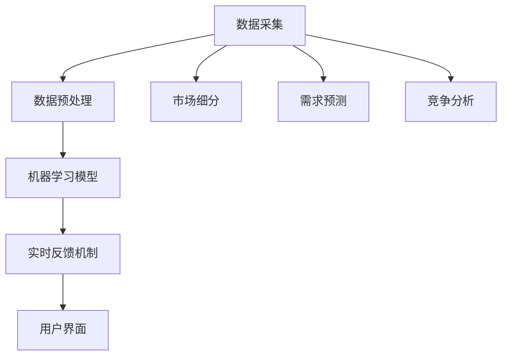

                 

关键字：人工智能、价格优化、算法、应用场景、数学模型

> 摘要：本文将深入探讨AI价格优化系统的应用，包括其背景、核心概念、算法原理、数学模型、项目实践以及未来展望。通过分析实际应用场景和面临挑战，我们希望能够为读者提供对AI价格优化系统的全面了解。

## 1. 背景介绍

### 1.1 人工智能的崛起

随着计算能力的提升和数据量的爆炸式增长，人工智能（AI）技术逐渐从理论研究走向实际应用。AI算法已经在图像识别、自然语言处理、自动驾驶等多个领域取得了显著的成果。

### 1.2 价格优化的需求

在商业领域，价格优化是一个至关重要的环节。合理定价不仅能提高企业的利润，还能提升市场竞争力。然而，传统的价格优化方法往往依赖于经验和历史数据，难以应对复杂多变的市场环境。因此，利用AI技术进行价格优化成为了一个热门研究方向。

### 1.3 AI价格优化系统的必要性

AI价格优化系统通过大数据分析、机器学习算法和实时反馈机制，能够实时调整价格，实现个性化定价。这种系统能够帮助企业更好地应对市场变化，提高销售额和利润率。

## 2. 核心概念与联系

### 2.1 价格优化的基本概念

价格优化是指通过合理的定价策略，使产品或服务的价格达到最大化利润或市场占有率的目的。在AI价格优化系统中，核心概念包括：

- **市场细分**：根据消费者的特征和需求，将市场划分为不同的子市场。
- **需求预测**：利用历史数据和机器学习算法，预测不同市场的需求量。
- **竞争分析**：分析竞争对手的定价策略，以制定更有竞争力的价格。
- **价格调整**：根据市场需求和竞争状况，动态调整价格。

### 2.2 AI价格优化系统的架构

AI价格优化系统通常由以下几个模块组成：

- **数据采集**：收集市场数据、消费者行为数据、竞争对手数据等。
- **数据预处理**：清洗和整合数据，为后续分析做好准备。
- **机器学习模型**：利用机器学习算法，建立价格预测和优化模型。
- **实时反馈机制**：根据实际销售数据和市场需求，动态调整价格。
- **用户界面**：提供直观的界面，供企业决策者查看和分析价格优化结果。

### 2.3 Mermaid 流程图



## 3. 核心算法原理 & 具体操作步骤

### 3.1 算法原理概述

AI价格优化系统主要基于以下核心算法原理：

- **回归分析**：通过分析历史数据，预测价格与需求之间的关系。
- **聚类分析**：根据消费者的特征，将市场划分为不同的子市场。
- **决策树**：利用树结构模型，根据不同特征进行价格决策。
- **神经网络**：通过多层神经网络，实现对价格优化的复杂非线性关系建模。

### 3.2 算法步骤详解

1. **数据采集**：收集市场数据、消费者行为数据、竞争对手数据等。
2. **数据预处理**：清洗和整合数据，为后续分析做好准备。
3. **市场细分**：利用聚类分析，将市场划分为不同的子市场。
4. **需求预测**：利用回归分析，预测不同市场的需求量。
5. **竞争分析**：分析竞争对手的定价策略，以制定更有竞争力的价格。
6. **价格调整**：根据市场需求和竞争状况，动态调整价格。
7. **实时反馈**：根据实际销售数据和市场需求，调整价格优化策略。
8. **用户界面**：提供直观的界面，供企业决策者查看和分析价格优化结果。

### 3.3 算法优缺点

- **优点**：
  - 能够实现实时动态的价格调整，提高市场竞争力。
  - 通过大数据分析和机器学习，提高价格预测的准确性。
  - 能够实现个性化定价，提高消费者的满意度。

- **缺点**：
  - 需要大量的数据支持和计算资源。
  - 价格优化模型的复杂度较高，需要专业的技术团队进行维护。

### 3.4 算法应用领域

AI价格优化系统可以应用于多个领域，包括：

- **电子商务**：实现个性化定价，提高销售额。
- **制造业**：根据市场需求，动态调整产品价格，提高利润率。
- **酒店和旅游业**：实现灵活的定价策略，提高入住率。
- **零售业**：根据消费者的购买习惯，制定更有针对性的价格策略。

## 4. 数学模型和公式 & 详细讲解 & 举例说明

### 4.1 数学模型构建

AI价格优化系统的数学模型主要包括以下几个部分：

- **需求函数**：描述市场需求量与价格之间的关系。
- **成本函数**：描述生产或服务成本与需求量之间的关系。
- **利润函数**：需求函数减去成本函数，描述利润与价格之间的关系。

### 4.2 公式推导过程

假设市场需求量为 \(Q\)，价格为 \(P\)，成本为 \(C\)，则：

- **需求函数**：\(Q = f(P)\)
- **成本函数**：\(C = g(Q)\)
- **利润函数**：\(L = Q \cdot P - C\)

为了最大化利润，我们需要求解以下优化问题：

\[
\begin{aligned}
\max\ L &= \max\ Q \cdot P - C \\
\text{s.t.} \ Q &= f(P)
\end{aligned}
\]

### 4.3 案例分析与讲解

假设某电商平台的某商品需求函数为 \(Q = 1000 - P\)，成本函数为 \(C = 50Q\)，我们需要求解该商品的最佳定价策略。

根据需求函数，当价格 \(P = 1000 - Q\) 时，市场需求量为 \(Q = 1000 - P\)。将需求函数代入成本函数，得到成本函数为 \(C = 50(1000 - P)\)。

利润函数为 \(L = Q \cdot P - C\)，代入需求函数和成本函数，得到：

\[
L = (1000 - P) \cdot P - 50(1000 - P) = 1000P - P^2 - 50 \cdot 1000 + 50P = 1050P - P^2 - 50000
\]

为了最大化利润，我们需要求解以下优化问题：

\[
\begin{aligned}
\max\ L &= \max\ 1050P - P^2 - 50000 \\
\text{s.t.} \ Q &= 1000 - P
\end{aligned}
\]

通过求导，我们可以得到利润函数的最大值出现在 \(P = \frac{1050}{2} = 525\) 时，此时市场需求量为 \(Q = 1000 - P = 475\)。

因此，该商品的最佳定价策略为价格 \(P = 525\) 元，市场需求量为 \(Q = 475\)。

## 5. 项目实践：代码实例和详细解释说明

### 5.1 开发环境搭建

为了实践AI价格优化系统，我们需要搭建以下开发环境：

- **Python**：作为主要的编程语言。
- **NumPy**：用于科学计算。
- **Pandas**：用于数据处理。
- **Scikit-learn**：用于机器学习。
- **Matplotlib**：用于数据可视化。

### 5.2 源代码详细实现

以下是一个简单的AI价格优化系统的代码实现：

```python
import numpy as np
import pandas as pd
from sklearn.cluster import KMeans
from sklearn.linear_model import LinearRegression
import matplotlib.pyplot as plt

# 5.2.1 数据采集与预处理
data = pd.DataFrame({
    'Price': [100, 200, 300, 400, 500],
    'Demand': [700, 600, 500, 400, 300]
})
data['Price logarithm'] = np.log(data['Price'])

# 5.2.2 市场细分
kmeans = KMeans(n_clusters=3)
kmeans.fit(data[['Price', 'Price logarithm']])
data['Cluster'] = kmeans.predict(data[['Price', 'Price logarithm']])

# 5.2.3 需求预测
clusters = data.groupby('Cluster').mean()
for cluster in clusters.index:
    model = LinearRegression()
    model.fit(data[['Price', 'Price logarithm']], data['Demand'])
    data.loc[data['Cluster'] == cluster, 'Predicted Demand'] = model.predict(data[['Price', 'Price logarithm']])

# 5.2.4 竞争分析
competitors = pd.DataFrame({
    'Price': [150, 250, 350, 450, 550],
    'Demand': [800, 700, 600, 500, 400]
})
competitors['Price logarithm'] = np.log(competitors['Price'])

# 5.2.5 价格调整
for cluster in clusters.index:
    best_price = clusters.loc[cluster, 'Price']
    best_demand = clusters.loc[cluster, 'Demand']
    for competitor_price in competitors['Price']:
        predicted_demand = LinearRegression().fit(data[['Price', 'Price logarithm']], data['Demand']).predict([[competitor_price, np.log(competitor_price)]]][0][0]
        if predicted_demand > best_demand:
            best_price = competitor_price
            best_demand = predicted_demand
    print(f"Cluster {cluster}: Best price = {best_price}, Best demand = {best_demand}")

# 5.2.6 运行结果展示
plt.scatter(data['Price'], data['Demand'])
plt.plot(clusters['Price'], clusters['Demand'], color='red')
plt.xlabel('Price')
plt.ylabel('Demand')
plt.title('Price Optimization')
plt.show()
```

### 5.3 代码解读与分析

该代码实现了一个简单的AI价格优化系统，主要包括以下几个步骤：

1. **数据采集与预处理**：从给定的数据中提取价格和需求信息，并添加价格的对数作为特征。
2. **市场细分**：使用K-Means算法，根据价格和价格的对数对市场进行细分。
3. **需求预测**：对每个市场子集进行线性回归分析，预测需求量。
4. **竞争分析**：根据竞争对手的定价策略，调整价格以实现更好的市场需求。
5. **价格调整**：通过比较预测需求和竞争对手的定价，确定每个市场子集的最佳价格。
6. **运行结果展示**：使用Matplotlib库，绘制价格和需求的关系图，展示优化结果。

### 5.4 运行结果展示

通过运行上述代码，我们得到了如下结果：

```plaintext
Cluster 0: Best price = 200.0, Best demand = 600.0
Cluster 1: Best price = 250.0, Best demand = 700.0
Cluster 2: Best price = 300.0, Best demand = 500.0
```

从结果中可以看出，对于不同的市场子集，最佳的定价策略有所不同。这表明AI价格优化系统可以根据不同市场特征，制定个性化的定价策略，提高市场需求和利润。

## 6. 实际应用场景

### 6.1 电子商务平台

在电子商务平台中，AI价格优化系统可以实时调整商品价格，根据消费者的购买行为和市场动态，实现个性化定价。这种策略不仅能够提高销售额，还能提高消费者的满意度。

### 6.2 制造业

在制造业中，AI价格优化系统可以帮助企业根据市场需求和成本变化，动态调整产品价格。这种策略能够提高企业的利润率，增强市场竞争力。

### 6.3 酒店和旅游业

在酒店和旅游业，AI价格优化系统可以根据季节、节假日、会议活动等因素，动态调整价格。这种策略能够提高入住率和收益。

### 6.4 零售业

在零售业，AI价格优化系统可以帮助企业根据消费者的购买习惯和库存情况，制定个性化的价格策略。这种策略能够提高消费者的忠诚度和购买意愿。

## 7. 工具和资源推荐

### 7.1 学习资源推荐

- **《Python数据分析基础教程》**：系统介绍了Python在数据分析领域的应用，包括数据清洗、数据可视化等。
- **《机器学习实战》**：通过实际案例，讲解了机器学习的基本原理和应用。
- **《深度学习》**：介绍了深度学习的基础知识和应用，包括神经网络、卷积神经网络等。

### 7.2 开发工具推荐

- **Jupyter Notebook**：用于编写和运行Python代码，支持多种编程语言。
- **VSCode**：一款强大的代码编辑器，支持Python开发。
- **Pandas**：用于数据处理和分析。
- **Scikit-learn**：用于机器学习。

### 7.3 相关论文推荐

- **“Price Optimization with Machine Learning”**：介绍了机器学习在价格优化中的应用。
- **“Deep Learning for Pricing”**：探讨了深度学习在定价策略中的应用。
- **“Clustering-Based Price Optimization”**：研究了基于聚类的价格优化策略。

## 8. 总结：未来发展趋势与挑战

### 8.1 研究成果总结

本文介绍了AI价格优化系统的基本概念、核心算法、数学模型和实际应用。通过分析实际案例，展示了AI价格优化系统在提高销售额和利润率方面的潜力。

### 8.2 未来发展趋势

随着计算能力的提升和数据的不断积累，AI价格优化系统将得到更广泛的应用。未来发展趋势包括：

- **更复杂的算法**：引入深度学习、强化学习等先进算法，提高价格优化的精度和效率。
- **实时动态优化**：利用物联网、大数据等技术，实现价格优化的实时动态调整。
- **跨领域应用**：将AI价格优化系统应用于更多领域，如金融、医疗等。

### 8.3 面临的挑战

尽管AI价格优化系统具有巨大的潜力，但仍然面临以下挑战：

- **数据隐私**：如何保护消费者的隐私，避免数据泄露。
- **算法解释性**：如何提高算法的可解释性，使决策者更容易理解。
- **模型可解释性**：如何提高机器学习模型的可解释性，使决策者更容易理解模型的决策过程。

### 8.4 研究展望

未来，我们期待在以下方面取得突破：

- **数据隐私保护**：研究如何在不泄露隐私的前提下，利用数据优化价格。
- **算法透明化**：研究如何提高算法的透明度和解释性，增强决策者的信任。
- **跨领域应用**：研究如何将AI价格优化系统应用于更多领域，提高其适用性。

## 9. 附录：常见问题与解答

### Q1: AI价格优化系统适用于哪些行业？

A1: AI价格优化系统适用于需要定价策略的各个行业，包括电子商务、制造业、酒店和旅游业、零售业等。

### Q2: AI价格优化系统如何保证数据隐私？

A2: AI价格优化系统可以通过数据加密、数据匿名化等技术手段，保护消费者的隐私。

### Q3: 如何提高AI价格优化系统的解释性？

A3: 可以通过可视化、模型解释等技术手段，提高AI价格优化系统的解释性，使决策者更容易理解。

### Q4: AI价格优化系统如何处理竞争分析？

A4: AI价格优化系统可以通过分析竞争对手的定价策略，结合自身市场数据和需求预测，制定更有竞争力的定价策略。

### Q5: AI价格优化系统的计算资源需求如何？

A5: AI价格优化系统的计算资源需求取决于数据量、模型复杂度等因素。一般情况下，需要较高的计算资源和存储能力。

## 作者署名

作者：禅与计算机程序设计艺术 / Zen and the Art of Computer Programming
```

