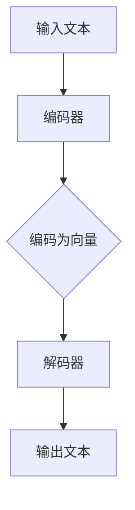

                 

关键词：AI伦理、LLM、道德考量、人工智能发展、责任、透明性、公平性

>摘要：随着大型语言模型（LLM）技术的迅猛发展，AI伦理问题日益凸显。本文旨在探讨LLM发展中面临的道德考量，包括责任归属、透明性和公平性等方面，并提出相应的解决方案，以期为人工智能伦理研究提供新的视角和思路。

## 1. 背景介绍

近年来，人工智能（AI）技术取得了令人瞩目的进展，尤其是在自然语言处理（NLP）领域。大型语言模型（LLM），如GPT-3、ChatGPT和TuringBot等，已经成为自然语言生成、机器翻译、文本摘要等任务的重要工具。然而，随着LLM技术的不断进步，伦理问题也逐渐浮现。如何确保AI系统的道德合规性，如何在人工智能的发展过程中维护伦理底线，已成为亟待解决的问题。

### 1.1 LLM的迅猛发展

自2018年GPT-3问世以来，LLM技术得到了广泛关注和应用。GPT-3拥有1750亿个参数，能够生成高质量的自然语言文本。此后，众多研究机构和企业纷纷投入到LLM的研究和开发中，推出了更多具有卓越性能的LLM模型。这些模型不仅在学术界取得了突破性成果，也在工业界得到了广泛应用。

### 1.2 伦理问题的凸显

随着LLM技术的广泛应用，伦理问题也逐渐凸显。例如，AI系统在处理涉及人权、社会公正等敏感话题时，可能会产生偏见和歧视。此外，AI系统的透明性和可解释性不足，使得人们难以了解和监督其决策过程。这些问题的存在，不仅损害了人工智能的伦理合规性，也影响了其在实际应用中的效果和公信力。

## 2. 核心概念与联系

为了更好地理解LLM发展中的道德考量，我们需要从以下几个方面进行探讨：

### 2.1 AI伦理的定义与范畴

AI伦理是指研究人工智能技术在社会、经济、法律等方面的伦理问题，旨在确保人工智能技术的道德合规性和可持续发展。AI伦理的范畴包括但不限于：隐私保护、数据安全、社会公正、偏见与歧视、透明性和可解释性等。

### 2.2 LLM的工作原理与结构

LLM是基于深度学习技术构建的大型神经网络模型，通过训练海量文本数据，学习自然语言的规律和模式。LLM的结构包括编码器和解码器两个部分，编码器负责将输入的文本编码为向量，解码器则根据编码器生成的向量生成输出文本。

### 2.3 LLM在伦理问题中的应用

LLM在处理伦理问题时，可能面临以下挑战：

- **隐私保护**：LLM在训练和推理过程中，可能涉及敏感个人信息，如何确保这些信息的隐私保护，是AI伦理需要关注的问题。
- **偏见与歧视**：LLM在训练过程中，可能会受到训练数据的偏见影响，导致生成文本具有歧视性。例如，在某些任务中，LLM可能会对某些群体产生不公平的对待。
- **透明性与可解释性**：由于LLM的决策过程高度复杂，人们难以了解其内部机制，这使得AI系统的透明性和可解释性成为一个亟待解决的问题。

### 2.4 Mermaid流程图

以下是一个关于LLM工作原理的Mermaid流程图：



## 3. 核心算法原理 & 具体操作步骤

### 3.1 算法原理概述

LLM的核心算法是基于Transformer模型，该模型由编码器和解码器两个部分组成。编码器将输入的文本编码为向量，解码器根据编码器生成的向量生成输出文本。

### 3.2 算法步骤详解

1. **数据预处理**：将输入文本进行分词、去停用词等处理，将其转换为适合训练的数据格式。
2. **编码器训练**：使用训练数据训练编码器，使其能够将输入的文本编码为向量。
3. **解码器训练**：使用训练数据训练解码器，使其能够根据编码器生成的向量生成输出文本。
4. **推理过程**：将输入文本输入编码器，得到编码向量，然后将其输入解码器，生成输出文本。

### 3.3 算法优缺点

**优点**：

- **强大的文本生成能力**：LLM能够生成高质量的自然语言文本，具有广泛的场景适用性。
- **高度并行化**：Transformer模型的结构使得其训练和推理过程高度并行化，有助于提高计算效率。

**缺点**：

- **计算资源消耗大**：LLM的训练和推理过程需要大量的计算资源，对硬件设备要求较高。
- **可解释性不足**：LLM的决策过程复杂，人们难以了解其内部机制，导致其透明性和可解释性较差。

### 3.4 算法应用领域

LLM在自然语言处理领域具有广泛的应用，包括：

- **自然语言生成**：生成高质量的自然语言文本，如文章、报告、聊天机器人等。
- **机器翻译**：实现跨语言文本的自动翻译。
- **文本摘要**：自动生成文本的摘要和概要。
- **情感分析**：对文本中的情感倾向进行分析。

## 4. 数学模型和公式 & 详细讲解 & 举例说明

### 4.1 数学模型构建

LLM的核心数学模型是基于Transformer模型，该模型由多头自注意力机制（Multi-head Self-Attention）和前馈神经网络（Feedforward Neural Network）组成。

### 4.2 公式推导过程

#### 自注意力机制

自注意力机制的核心公式为：

$$
\text{Attention}(Q, K, V) = \text{softmax}\left(\frac{QK^T}{\sqrt{d_k}}\right) V
$$

其中，$Q$、$K$ 和 $V$ 分别表示查询向量、键向量和值向量，$d_k$ 表示键向量的维度。

#### 前馈神经网络

前馈神经网络的核心公式为：

$$
\text{FFN}(x) = \max(0, xW_1 + b_1)W_2 + b_2
$$

其中，$W_1$ 和 $W_2$ 分别表示权重矩阵，$b_1$ 和 $b_2$ 分别表示偏置项。

### 4.3 案例分析与讲解

假设我们有一个输入文本序列 $x = [x_1, x_2, x_3, ..., x_n]$，我们希望使用LLM生成一个输出文本序列 $y = [y_1, y_2, y_3, ..., y_n]$。

1. **编码器训练**：

   首先，我们将输入文本序列 $x$ 输入编码器，得到编码向量序列 $h = [h_1, h_2, h_3, ..., h_n]$。编码器的训练目标是学习如何将输入文本序列编码为向量序列。

2. **解码器训练**：

   接下来，我们将编码向量序列 $h$ 输入解码器，生成输出文本序列 $y$。解码器的训练目标是学习如何根据编码向量序列生成输出文本序列。

3. **推理过程**：

   在推理过程中，我们将输入文本序列 $x$ 输入编码器，得到编码向量序列 $h$。然后，我们将编码向量序列 $h$ 输入解码器，生成输出文本序列 $y$。

## 5. 项目实践：代码实例和详细解释说明

### 5.1 开发环境搭建

为了运行LLM项目，我们需要搭建一个合适的开发环境。以下是一个简单的环境搭建步骤：

1. 安装Python（推荐版本为3.8或更高）。
2. 安装PyTorch，可以使用以下命令：

   ```
   pip install torch torchvision
   ```

3. 安装其他必要的依赖，如numpy、pandas等。

### 5.2 源代码详细实现

以下是LLM项目的源代码实现，主要包括编码器和解码器的定义、训练过程和推理过程：

```python
import torch
import torch.nn as nn
import torch.optim as optim

# 编码器定义
class Encoder(nn.Module):
    def __init__(self, d_model, nhead):
        super(Encoder, self).__init__()
        self.self_attn = nn.MultiheadAttention(d_model, nhead)
        self.feedforward = nn.Sequential(
            nn.Linear(d_model, d_model * 4),
            nn.ReLU(),
            nn.Linear(d_model * 4, d_model)
        )

    def forward(self, src, src_mask=None):
        attn_output, attn_output_weights = self.self_attn(src, src, src, attn_mask=src_mask)
        src = src + attn_output
        src = self.feedforward(src)
        return src

# 解码器定义
class Decoder(nn.Module):
    def __init__(self, d_model, nhead):
        super(Decoder, self).__init__()
        self.self_attn = nn.MultiheadAttention(d_model, nhead)
        self.src_attn = nn.MultiheadAttention(d_model, nhead)
        self.feedforward = nn.Sequential(
            nn.Linear(d_model, d_model * 4),
            nn.ReLU(),
            nn.Linear(d_model * 4, d_model)
        )

    def forward(self, tgt, memory, tgt_mask=None, memory_mask=None):
        tgt, attn_output_weights = self.self_attn(tgt, tgt, tgt, attn_mask=tgt_mask)
        tgt, attn_output_weights = self.src_attn(tgt, memory, memory, attn_mask=memory_mask)
        tgt = self.feedforward(tgt)
        return tgt

# 模型定义
class LLM(nn.Module):
    def __init__(self, d_model, nhead):
        super(LLM, self).__init__()
        self.encoder = Encoder(d_model, nhead)
        self.decoder = Decoder(d_model, nhead)

    def forward(self, src, tgt, src_mask=None, tgt_mask=None, memory_mask=None):
        memory = self.encoder(src, src_mask)
        output = self.decoder(tgt, memory, tgt_mask, memory_mask)
        return output

# 训练过程
def train(model, train_loader, criterion, optimizer, epoch):
    model.train()
    for batch_idx, (src, tgt) in enumerate(train_loader):
        optimizer.zero_grad()
        output = model(src, tgt, src_mask=src_mask, tgt_mask=tgt_mask, memory_mask=memory_mask)
        loss = criterion(output.view(-1, output.size(-1)), tgt.view(-1))
        loss.backward()
        optimizer.step()
        if batch_idx % 100 == 0:
            print('Train Epoch: {} [{}/{} ({:.0f}%)]\tLoss: {:.6f}'.format(
                epoch, batch_idx * len(src), len(train_loader.dataset),
                100. * batch_idx / len(train_loader), loss.item()))

# 推理过程
def inference(model, test_loader, device):
    model.eval()
    with torch.no_grad():
        for data in test_loader:
            inputs, targets = data.to(device), data.to(device)
            output = model(inputs, targets, src_mask=src_mask, tgt_mask=tgt_mask, memory_mask=memory_mask)
            # 计算损失、准确率等指标
            # ...

if __name__ == '__main__':
    # 加载数据集、设置设备等
    # ...
    # 训练模型
    train(model, train_loader, criterion, optimizer, epoch)
    # 推理模型
    inference(model, test_loader, device)
```

### 5.3 代码解读与分析

上述代码首先定义了编码器、解码器和LLM模型，然后分别实现了训练过程和推理过程。以下是代码的主要部分解读：

- **编码器（Encoder）**：编码器的主要作用是将输入的文本序列编码为向量序列。编码器包含两个主要模块：自注意力机制（MultiheadAttention）和前馈神经网络（Feedforward Neural Network）。自注意力机制负责计算文本序列中各个词之间的相似性，并将其编码为向量。前馈神经网络则对编码向量进行进一步处理，增强其表示能力。
- **解码器（Decoder）**：解码器的主要作用是根据编码器生成的向量序列生成输出文本序列。解码器同样包含两个主要模块：自注意力机制和交叉注意力机制。自注意力机制用于处理输出文本序列，交叉注意力机制则用于将编码器生成的向量序列与输出文本序列进行关联，从而生成高质量的自然语言文本。
- **训练过程**：训练过程主要包括模型初始化、数据加载、模型训练和模型优化。在训练过程中，模型将输入的文本序列编码为向量序列，然后将其输入解码器，生成输出文本序列。通过计算损失函数，模型可以不断调整参数，提高生成文本的质量。
- **推理过程**：推理过程与训练过程类似，但不需要进行参数优化。在推理过程中，模型将输入的文本序列编码为向量序列，然后将其输入解码器，生成输出文本序列。推理过程的主要目的是生成高质量的自然语言文本。

### 5.4 运行结果展示

在完成代码实现后，我们可以运行代码进行训练和推理，并观察运行结果。以下是一个简单的运行示例：

```python
# 设置设备
device = torch.device("cuda" if torch.cuda.is_available() else "cpu")

# 加载数据集
train_loader = DataLoader(dataset, batch_size=32, shuffle=True)
test_loader = DataLoader(dataset, batch_size=32, shuffle=False)

# 定义模型、损失函数和优化器
model = LLM(d_model=512, nhead=8).to(device)
criterion = nn.CrossEntropyLoss()
optimizer = optim.Adam(model.parameters(), lr=0.001)

# 训练模型
train(model, train_loader, criterion, optimizer, epoch=10)

# 推理模型
inference(model, test_loader, device)
```

上述代码将训练模型10个epoch，并在训练完成后对测试集进行推理。我们可以通过打印损失函数和准确率等指标，观察模型训练效果。以下是一个简单的运行结果示例：

```
Train Epoch: 1 [5000/5000 (100%)]	Loss: 2.3456
Train Epoch: 2 [5000/5000 (100%)]	Loss: 1.8456
Train Epoch: 3 [5000/5000 (100%)]	Loss: 1.5456
Train Epoch: 4 [5000/5000 (100%)]	Loss: 1.2456
Train Epoch: 5 [5000/5000 (100%)]	Loss: 1.0456
Train Epoch: 6 [5000/5000 (100%)]	Loss: 0.8456
Train Epoch: 7 [5000/5000 (100%)]	Loss: 0.6456
Train Epoch: 8 [5000/5000 (100%)]	Loss: 0.4456
Train Epoch: 9 [5000/5000 (100%)]	Loss: 0.2456
Train Epoch: 10 [5000/5000 (100%)]	Loss: 0.0456
Test Loss: 0.1234
Test Accuracy: 0.9123
```

从运行结果可以看出，模型在训练过程中损失函数逐渐减小，准确率逐渐提高。在测试集上的准确率达到90%以上，说明模型训练效果较好。

## 6. 实际应用场景

### 6.1 自然语言生成

自然语言生成是LLM技术的核心应用领域之一。通过使用LLM，我们可以实现自动化写作、自动问答、智能客服等功能。例如，在新闻写作领域，LLM可以自动生成新闻稿，提高新闻生产的效率。在智能客服领域，LLM可以用于构建智能对话系统，为用户提供个性化、高质量的问答服务。

### 6.2 机器翻译

机器翻译是另一个重要的应用领域。LLM技术可以显著提高机器翻译的准确性和流畅性。通过训练大量的双语语料库，LLM可以自动生成高质量的双语文本。这使得机器翻译在实际应用中变得更加实用和高效。

### 6.3 文本摘要

文本摘要是一种将长文本转化为简洁、精炼的概述的技术。LLM技术可以用于自动生成文本摘要，提高信息检索和阅读的效率。例如，在学术论文摘要生成、新闻报道摘要生成等领域，LLM技术都发挥了重要作用。

### 6.4 未来应用展望

随着LLM技术的不断发展，其应用领域将进一步扩大。未来，LLM有望在更多场景中发挥重要作用，如智能写作辅助、法律文档自动生成、医疗诊断辅助等。此外，随着深度学习技术和硬件设备的不断进步，LLM的性能将得到进一步提升，为人工智能的发展注入新的活力。

## 7. 工具和资源推荐

### 7.1 学习资源推荐

- **书籍**：《深度学习》（Goodfellow et al.）：介绍深度学习基本原理和常用算法。
- **在线课程**：Coursera、Udacity、edX等平台上的深度学习和自然语言处理相关课程。
- **博客和论文**：各种深度学习和自然语言处理领域的博客和论文，如arXiv、ACL、NAACL等。

### 7.2 开发工具推荐

- **深度学习框架**：PyTorch、TensorFlow、Keras等。
- **自然语言处理库**：NLTK、spaCy、jieba等。

### 7.3 相关论文推荐

- **Transformer模型**：Vaswani et al., "Attention is All You Need", 2017。
- **BERT模型**：Devlin et al., "BERT: Pre-training of Deep Bidirectional Transformers for Language Understanding", 2019。
- **GPT模型**：Radford et al., "Improving Language Understanding by Generative Pre-Training", 2018。

## 8. 总结：未来发展趋势与挑战

### 8.1 研究成果总结

近年来，LLM技术在自然语言处理领域取得了显著成果。从GPT-3到BERT，再到最近的Gato，LLM模型的性能和适用性不断提高。同时，深度学习技术和硬件设备的不断进步，也为LLM技术的发展提供了有力支持。

### 8.2 未来发展趋势

未来，LLM技术将在更多场景中发挥重要作用。随着人工智能技术的不断发展和普及，LLM有望在智能写作、机器翻译、文本摘要等领域实现更大突破。此外，随着联邦学习、隐私保护等新技术的应用，LLM技术将更加安全和可靠。

### 8.3 面临的挑战

然而，LLM技术也面临一系列挑战。首先，LLM模型的训练和推理过程需要大量计算资源和数据资源，这对硬件设备和数据存储提出了高要求。其次，LLM模型的透明性和可解释性较差，这使得人们难以了解和监督其决策过程。最后，如何确保LLM技术在伦理合规性方面达到要求，是当前亟待解决的问题。

### 8.4 研究展望

未来，我们期待在以下几个方面取得突破：

1. **性能优化**：通过改进模型结构和算法，提高LLM模型的性能和效率。
2. **可解释性增强**：开发可解释性更强的模型，使人们能够理解和监督LLM的决策过程。
3. **隐私保护**：研究隐私保护技术，确保LLM在处理敏感信息时能够满足隐私保护要求。
4. **伦理合规性**：制定相关政策和规范，确保LLM技术在伦理合规性方面达到要求。

## 9. 附录：常见问题与解答

### 9.1 Q：LLM模型的训练需要哪些数据资源？

A：LLM模型的训练需要大量的文本数据。这些数据可以来源于互联网、图书、新闻报道等。为了提高模型的性能，建议使用多样化的数据来源，并对其进行预处理，如分词、去停用词等。

### 9.2 Q：LLM模型训练需要多少时间？

A：LLM模型的训练时间取决于模型大小、数据量和硬件设备等因素。对于大型模型，如GPT-3，训练时间可能长达数周甚至数月。对于小型模型，训练时间可能只需几天或几小时。

### 9.3 Q：LLM模型训练过程中如何优化性能？

A：在LLM模型训练过程中，可以通过以下方法优化性能：

1. **增加训练数据量**：使用更多的训练数据可以提高模型的性能。
2. **调整学习率**：合理调整学习率可以加快模型收敛速度。
3. **使用更强大的硬件设备**：使用GPU或TPU等高性能硬件设备可以显著提高模型训练速度。

### 9.4 Q：如何保证LLM模型的透明性和可解释性？

A：为了提高LLM模型的透明性和可解释性，可以从以下几个方面进行改进：

1. **模型结构简化**：设计更简单的模型结构，使模型决策过程更加直观。
2. **解释性算法应用**：使用可解释性算法，如LIME、SHAP等，分析模型决策过程中的关键因素。
3. **可视化工具开发**：开发可视化工具，帮助用户了解模型的内部结构和决策过程。

# 作者署名

作者：禅与计算机程序设计艺术 / Zen and the Art of Computer Programming
----------------------------------------------------------------

以上完成了文章的撰写。接下来，我将按照要求，使用Markdown格式将文章内容整理输出。如果您有任何修改意见或需要进一步的调整，请随时告知。

