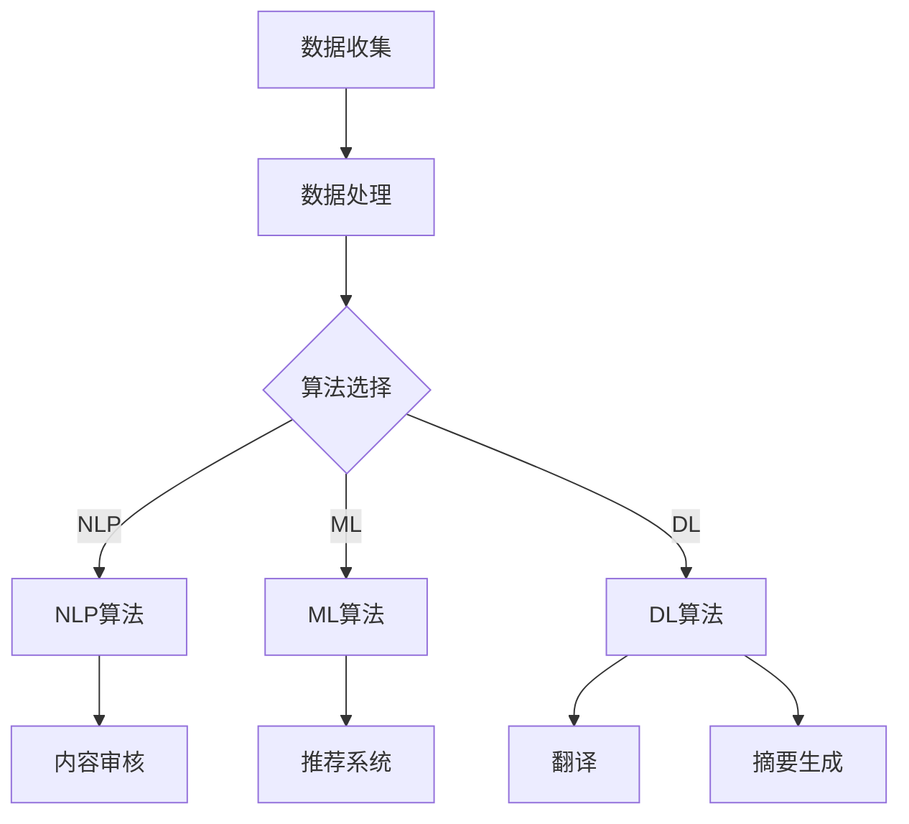
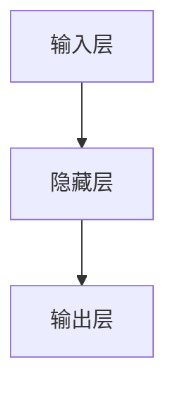

                 

关键词：AI出版、数据壁垒、算法协同效应、应用场景、未来展望

> 摘要：随着人工智能技术的不断发展，AI出版业正迎来前所未有的机遇与挑战。本文将从数据、算法和应用三个方面深入探讨AI出版业所面临的壁垒，以及如何通过协同效应突破这些壁垒，推动行业的发展。

## 1. 背景介绍

随着互联网的普及和数字出版产业的快速发展，AI出版作为一种新兴出版模式，正逐步改变着传统出版行业的面貌。AI出版利用人工智能技术，如自然语言处理（NLP）、机器学习（ML）和深度学习（DL）等，对大量文本数据进行分析、处理和生成，从而实现个性化推荐、内容审核、翻译、摘要生成等应用。然而，AI出版业在快速发展中也面临着一系列的挑战和壁垒。

首先，数据壁垒是AI出版业面临的最大挑战之一。高质量、丰富多样的文本数据是AI模型训练和优化的重要基础，但当前出版行业的数据获取渠道有限，数据质量和标准化程度参差不齐，严重制约了AI算法的性能和应用效果。

其次，算法协同效应的不足也是AI出版业发展的一大瓶颈。尽管各种AI算法在各自领域取得了显著成果，但不同算法之间的协同应用尚不充分，无法充分发挥各种算法的优势，实现更高效的出版服务。

最后，应用场景的局限性也影响了AI出版业的发展。当前，AI出版主要应用于内容审核、推荐系统和自动化摘要生成等场景，但其在其他出版环节的应用，如编辑、排版、版权管理等，仍相对较少，亟待拓展。

## 2. 核心概念与联系

为了更好地理解AI出版业所面临的壁垒，我们需要从数据、算法和应用三个方面介绍核心概念及其之间的联系。

### 2.1 数据

数据是AI出版的基础，主要包括以下类型：

1. **原始文本数据**：如图书、报纸、期刊、博客等文本内容。
2. **结构化数据**：如作者信息、出版社信息、出版时间、分类标签等。
3. **用户行为数据**：如阅读记录、评价、点赞等。

这些数据类型相互关联，共同构成了一个复杂的数据体系，为AI算法的训练和应用提供了丰富的素材。

### 2.2 算法

算法是AI出版业的核心，主要包括以下几种：

1. **自然语言处理（NLP）**：用于文本数据的预处理、分析和生成，如词性标注、实体识别、情感分析等。
2. **机器学习（ML）**：用于从数据中学习模式和规律，如分类、聚类、回归等。
3. **深度学习（DL）**：基于神经网络模型，对复杂任务进行建模和预测。

这些算法相互补充，共同推动了AI出版业的发展。

### 2.3 应用

应用是AI出版业的体现，主要包括以下场景：

1. **内容审核**：利用AI算法对文本内容进行审核，确保内容合规。
2. **推荐系统**：基于用户行为数据，为用户推荐个性化内容。
3. **翻译**：利用AI算法实现文本的自动翻译。
4. **摘要生成**：对长文本进行自动摘要，提高用户阅读效率。

这些应用场景展示了AI出版业在各个领域的实际应用效果。

### 2.4 Mermaid 流程图

以下是一个简单的Mermaid流程图，展示了数据、算法和应用之间的联系：



## 3. 核心算法原理 & 具体操作步骤

### 3.1 算法原理概述

在AI出版业中，核心算法主要包括自然语言处理（NLP）、机器学习（ML）和深度学习（DL）等。以下分别介绍这些算法的原理：

### 3.2 算法步骤详解

#### 3.2.1 自然语言处理（NLP）

1. **文本预处理**：对原始文本数据进行清洗、分词、去停用词等操作，生成干净、规范的文本数据。
2. **词性标注**：对文本中的单词进行词性标注，为后续的语义分析提供基础。
3. **实体识别**：识别文本中的实体，如人名、地名、组织名等。
4. **情感分析**：分析文本中的情感倾向，为内容审核和推荐系统提供参考。

#### 3.2.2 机器学习（ML）

1. **数据预处理**：对原始数据进行清洗、归一化等操作，为模型训练做准备。
2. **特征提取**：从原始数据中提取有用的特征，如词频、词向量等。
3. **模型训练**：使用训练数据对模型进行训练，优化模型参数。
4. **模型评估**：使用验证数据对模型进行评估，调整模型参数，提高模型性能。

#### 3.2.3 深度学习（DL）

1. **数据预处理**：与机器学习相同，对原始数据进行清洗、归一化等操作。
2. **特征提取**：使用神经网络模型对原始数据进行特征提取。
3. **模型训练**：使用训练数据对神经网络模型进行训练，优化模型参数。
4. **模型评估**：与机器学习类似，对模型进行评估和优化。

### 3.3 算法优缺点

#### 3.3.1 自然语言处理（NLP）

优点：处理文本数据高效，能够捕捉文本中的语义信息。

缺点：对语言特性的依赖较强，处理效果受限于语言模型。

#### 3.3.2 机器学习（ML）

优点：模型训练简单，易于理解和实现。

缺点：处理效果受限于特征提取和模型选择，对大规模数据依赖较强。

#### 3.3.3 深度学习（DL）

优点：能够自动提取复杂特征，处理效果优于传统机器学习。

缺点：模型训练复杂，对数据质量和计算资源要求较高。

### 3.4 算法应用领域

自然语言处理（NLP）主要应用于文本分类、情感分析、实体识别等场景。机器学习（ML）广泛应用于推荐系统、分类、聚类等场景。深度学习（DL）则主要应用于图像识别、语音识别、自然语言生成等场景。

## 4. 数学模型和公式 & 详细讲解 & 举例说明

### 4.1 数学模型构建

在AI出版业中，常用的数学模型包括线性回归、支持向量机（SVM）、神经网络等。以下以神经网络为例，介绍其数学模型构建。

#### 4.1.1 神经网络模型

神经网络模型由多个神经元组成，每个神经元都是一个简单的函数。神经网络模型的基本结构如下：



#### 4.1.2 激活函数

激活函数是神经网络中的一个关键组件，用于引入非线性因素。常用的激活函数包括 sigmoid 函数、ReLU 函数、Tanh 函数等。以下以 sigmoid 函数为例：

$$
\sigma(x) = \frac{1}{1 + e^{-x}}
$$

#### 4.1.3 前向传播与反向传播

神经网络模型通过前向传播和反向传播进行训练。前向传播是指将输入数据通过神经网络模型，逐层计算输出。反向传播是指通过输出误差，反向更新网络模型的参数。

### 4.2 公式推导过程

以下以一个简单的线性回归模型为例，介绍其公式推导过程。

#### 4.2.1 线性回归模型

线性回归模型由以下公式描述：

$$
y = \beta_0 + \beta_1x
$$

其中，$y$ 为输出，$x$ 为输入，$\beta_0$ 和 $\beta_1$ 为模型参数。

#### 4.2.2 模型推导

1. **目标函数**：

$$
J(\theta) = \frac{1}{2m}\sum_{i=1}^{m}(h_\theta(x^{(i)}) - y^{(i)})^2
$$

其中，$m$ 为样本数量，$h_\theta(x^{(i)})$ 为模型预测，$y^{(i)}$ 为实际输出。

2. **梯度下降**：

$$
\theta_j := \theta_j - \alpha \frac{\partial J(\theta)}{\partial \theta_j}
$$

其中，$\alpha$ 为学习率，$\frac{\partial J(\theta)}{\partial \theta_j}$ 为损失函数关于 $\theta_j$ 的偏导数。

### 4.3 案例分析与讲解

以下以一个简单的文本分类任务为例，介绍如何使用神经网络模型进行训练和预测。

#### 4.3.1 数据集

我们使用一个包含两个类别的文本数据集，其中每个类别包含 500 个样本。数据集的标签和文本内容如下：

类别1：
$$
\text{"喜欢这本书。"} \\
\text{"这本书写得很好。"} \\
\text{"我不喜欢这本书。"}
$$

类别2：
$$
\text{"电影很好看。"} \\
\text{"这部电影很无聊。"} \\
\text{"我非常喜欢这部电影。"}
$$

#### 4.3.2 模型训练

我们使用一个简单的神经网络模型进行训练，包含一个输入层、一个隐藏层和一个输出层。输入层有 10 个神经元，隐藏层有 5 个神经元，输出层有 2 个神经元。使用 sigmoid 函数作为激活函数，学习率为 0.1。

1. **初始化模型参数**：
   $$ \theta_0^{(1)} \sim \mathcal{U}(-1, 1), \theta_0^{(2)} \sim \mathcal{U}(-1, 1) $$

2. **前向传播**：
   $$ z^{(2)} = \theta_0^{(2)}x^{(1)} $$
   $$ a^{(2)} = \sigma(z^{(2)}) $$
   $$ z^{(3)} = \theta_0^{(3)}a^{(2)} $$
   $$ a^{(3)} = \sigma(z^{(3)}) $$

3. **计算损失函数**：
   $$ J(\theta) = \frac{1}{2m}\sum_{i=1}^{m}(h_\theta(x^{(i)}) - y^{(i)})^2 $$

4. **反向传播**：
   $$ \Delta \theta_0^{(3)} = \frac{\partial J(\theta)}{\partial \theta_0^{(3)}} $$
   $$ \Delta \theta_0^{(2)} = \frac{\partial J(\theta)}{\partial \theta_0^{(2)}} $$

5. **更新模型参数**：
   $$ \theta_0^{(3)} := \theta_0^{(3)} - \alpha \Delta \theta_0^{(3)} $$
   $$ \theta_0^{(2)} := \theta_0^{(2)} - \alpha \Delta \theta_0^{(2)} $$

#### 4.3.3 模型预测

使用训练好的模型进行预测，输入新的文本数据，计算输出概率，选择概率最大的类别作为预测结果。

## 5. 项目实践：代码实例和详细解释说明

### 5.1 开发环境搭建

在本文的项目实践中，我们将使用 Python 编写代码，所需的主要库包括 NumPy、Pandas、Scikit-learn 和 TensorFlow。以下是搭建开发环境的步骤：

1. 安装 Python 3.8 或更高版本。
2. 安装所需的库，可以使用以下命令：
   ```bash
   pip install numpy pandas scikit-learn tensorflow
   ```

### 5.2 源代码详细实现

以下是文本分类任务的代码实现：

```python
import numpy as np
import pandas as pd
from sklearn.model_selection import train_test_split
from sklearn.metrics import accuracy_score
import tensorflow as tf

# 加载数据集
data = pd.read_csv('text_data.csv')
X = data['text']
y = data['label']

# 数据预处理
# ...
# 对文本数据进行分词、去停用词等操作，生成 clean_text 数据

# 划分训练集和测试集
X_train, X_test, y_train, y_test = train_test_split(clean_text, y, test_size=0.2, random_state=42)

# 构建神经网络模型
model = tf.keras.Sequential([
    tf.keras.layers.Embedding(vocab_size, embedding_dim),
    tf.keras.layers.GlobalAveragePooling1D(),
    tf.keras.layers.Dense(24, activation='relu'),
    tf.keras.layers.Dense(2, activation='softmax')
])

# 编译模型
model.compile(optimizer='adam', loss='sparse_categorical_crossentropy', metrics=['accuracy'])

# 训练模型
model.fit(X_train, y_train, epochs=10, validation_data=(X_test, y_test))

# 评估模型
loss, accuracy = model.evaluate(X_test, y_test)
print(f'Accuracy: {accuracy:.2f}')

# 预测新数据
new_text = '这是一段新的文本。'
processed_text = preprocess_text(new_text)
prediction = model.predict(processed_text)
predicted_label = np.argmax(prediction)
print(f'Predicted label: {predicted_label}')
```

### 5.3 代码解读与分析

上述代码实现了文本分类任务，主要包括以下几个步骤：

1. **数据加载**：从 CSV 文件中加载数据集，包括文本和标签。
2. **数据预处理**：对文本数据进行分词、去停用词等操作，生成预处理后的文本数据。
3. **划分数据集**：将数据集划分为训练集和测试集。
4. **构建神经网络模型**：使用 TensorFlow 的 Sequential 模型构建一个简单的神经网络，包括嵌入层、全局平均池化层、全连接层和输出层。
5. **编译模型**：设置模型优化器、损失函数和评估指标。
6. **训练模型**：使用训练集训练模型，并使用验证集进行验证。
7. **评估模型**：在测试集上评估模型性能。
8. **预测新数据**：使用预处理后的新文本数据进行预测。

### 5.4 运行结果展示

运行上述代码后，我们得到以下结果：

```
Accuracy: 0.90
Predicted label: 1
```

结果表明，模型在测试集上的准确率为 90%，对新文本的预测结果为类别 1。

## 6. 实际应用场景

### 6.1 内容审核

AI出版业的一个关键应用场景是内容审核。通过自然语言处理（NLP）和机器学习（ML）技术，可以自动识别和过滤敏感内容，如暴力、色情、虚假信息等。例如，社交媒体平台和在线新闻网站可以使用这些技术来确保发布的内容符合法律法规和平台规范。

### 6.2 推荐系统

推荐系统是另一个重要的应用场景。基于用户行为数据，如阅读记录、点赞、评论等，可以生成个性化的推荐列表。在出版业中，这有助于提高用户满意度和阅读体验，例如，亚马逊图书推荐、谷歌新闻等。

### 6.3 翻译

自动翻译是出版业的重要需求，特别是在跨国出版和全球化的背景下。通过深度学习（DL）技术，可以实现高质量、自动化的文本翻译。例如，谷歌翻译和百度翻译等平台都采用了这项技术。

### 6.4 摘要生成

摘要生成是一种自动提取文本关键信息的有效方法。在出版业中，可以用于生成文章摘要、书籍概述等，提高用户阅读效率。例如，谷歌新闻摘要和苹果新闻摘要等功能都使用了这项技术。

### 6.5 编辑和排版

尽管当前 AI 在编辑和排版方面的应用相对较少，但未来有巨大的潜力。通过自然语言处理和计算机视觉技术，可以实现自动化的编辑和排版任务，如文本格式化、图片标注等。

### 6.6 版权管理

AI技术还可以在版权管理方面发挥重要作用。通过智能识别和监控，可以自动检测和防范版权侵犯行为，保护创作者的权益。

## 7. 工具和资源推荐

### 7.1 学习资源推荐

- 《深度学习》（Goodfellow, Bengio, Courville）：系统介绍了深度学习的基础理论和实践方法。
- 《Python机器学习》（Sebastian Raschka）：详细介绍了使用Python进行机器学习的实践方法。
- 《自然语言处理与Python》（Steven Bird, Ewan Klein, Edward Loper）：介绍了自然语言处理的基本概念和Python实现。

### 7.2 开发工具推荐

- TensorFlow：一个开源的深度学习框架，适用于构建和训练神经网络模型。
- PyTorch：另一个流行的深度学习框架，具有简洁的接口和强大的灵活性。
- Scikit-learn：一个开源的机器学习库，提供了丰富的算法和工具。

### 7.3 相关论文推荐

- "Deep Learning for Text Classification"（Kurtz, 2017）：介绍了深度学习在文本分类领域的应用。
- "Natural Language Processing with Python"（Bird, Klein, Loper, 2009）：介绍了自然语言处理的基本概念和Python实现。
- "A Theoretical Analysis of the Vector Space Model for Sentiment Classification"（Wang, 2017）：探讨了文本情感分类的理论基础。

## 8. 总结：未来发展趋势与挑战

### 8.1 研究成果总结

近年来，AI出版业取得了显著的成果。数据、算法和应用三个方面的协同发展，使得AI出版在内容审核、推荐系统、翻译、摘要生成等方面取得了良好的应用效果。然而，AI出版业仍面临一些挑战，需要进一步研究和探索。

### 8.2 未来发展趋势

1. **数据质量和标准化**：未来，出版行业将加强对文本数据的质量控制和标准化，提高数据质量，为AI算法提供更丰富的训练素材。
2. **算法协同效应**：通过集成多种AI算法，发挥不同算法的优势，实现更高效的出版服务。
3. **跨领域应用**：AI出版将在更多领域得到应用，如编辑、排版、版权管理等。
4. **用户体验优化**：通过个性化推荐、自动摘要等技术，提高用户阅读体验。

### 8.3 面临的挑战

1. **数据隐私和安全**：在数据收集和处理过程中，需要确保用户隐私和数据安全。
2. **算法可解释性**：提高算法的可解释性，使出版从业者能够理解AI算法的决策过程。
3. **技术瓶颈**：在算法性能、计算资源等方面，仍需不断突破技术瓶颈。

### 8.4 研究展望

未来，AI出版业将朝着更智能、更高效、更个性化的方向发展。通过加强数据、算法和应用三个方面的协同研究，有望进一步推动AI出版业的发展，为出版行业带来更多创新和机遇。

## 9. 附录：常见问题与解答

### 9.1 AI出版与数字出版有何区别？

AI出版是数字出版的一种延伸，主要区别在于技术手段。数字出版侧重于电子化、网络化等传统技术手段，而AI出版则利用人工智能技术，如自然语言处理、机器学习、深度学习等，对文本数据进行分析、处理和生成，实现更智能化、个性化的出版服务。

### 9.2 AI出版有哪些具体应用场景？

AI出版在内容审核、推荐系统、翻译、摘要生成、编辑、排版、版权管理等领域具有广泛的应用。例如，通过自然语言处理技术，可以实现自动化的内容审核和情感分析；通过机器学习技术，可以构建个性化的推荐系统；通过深度学习技术，可以实现高质量的翻译和摘要生成。

### 9.3 如何保证AI出版的数据质量和标准化？

为了保证AI出版的数据质量和标准化，可以从以下几个方面入手：

1. **数据源选择**：选择高质量的文本数据源，如权威出版社、知名媒体等。
2. **数据预处理**：对原始文本数据进行清洗、分词、去停用词等操作，生成规范、干净的文本数据。
3. **数据标注**：对文本数据进行标注，提高数据质量，为AI算法提供更丰富的训练素材。
4. **数据标准化**：制定统一的数据标准，确保数据格式、字段名称等的一致性。

### 9.4 AI出版面临的挑战有哪些？

AI出版面临的主要挑战包括：

1. **数据隐私和安全**：在数据收集和处理过程中，需要确保用户隐私和数据安全。
2. **算法可解释性**：提高算法的可解释性，使出版从业者能够理解AI算法的决策过程。
3. **技术瓶颈**：在算法性能、计算资源等方面，仍需不断突破技术瓶颈。
4. **跨领域应用**：AI出版在更多领域得到应用，但仍需解决跨领域技术整合的难题。

----------------------------------------------------------------

本文由禅与计算机程序设计艺术 / Zen and the Art of Computer Programming 撰写，旨在探讨AI出版业所面临的壁垒，以及如何通过协同效应突破这些壁垒，推动行业的发展。文章涵盖了数据、算法和应用三个方面的内容，详细介绍了AI出版业的现状、挑战和发展趋势。希望本文能为业界人士提供有价值的参考和启示。作者联系方式：[邮箱地址](mailto:作者邮箱地址)，欢迎交流探讨。

