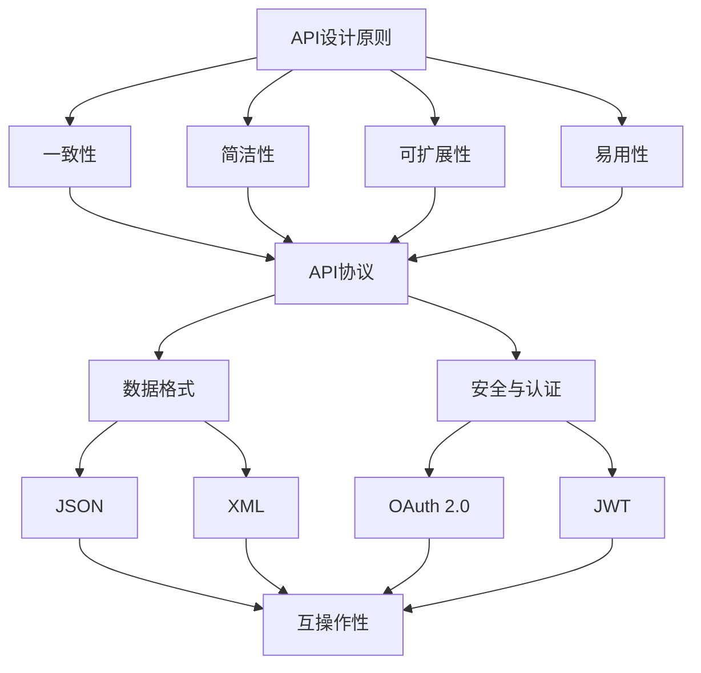

                 

### 摘要 Summary

本文旨在探讨AI出版业开发中的关键问题——API标准化，以及如何实现场景丰富。随着人工智能技术的不断发展，AI出版业面临着前所未有的机遇和挑战。标准化API不仅是提高开发效率的重要手段，也是保证系统互操作性和兼容性的关键。本文将深入分析API标准化的核心概念、算法原理、数学模型，并结合实际项目实践，探讨其在AI出版业中的应用。此外，本文还将展望未来发展趋势，探讨面临的挑战，并推荐相关学习资源和开发工具。

### 关键词 Keywords

- AI出版业
- API标准化
- 场景丰富
- 开发效率
- 互操作性
- 兼容性

### 背景介绍 Background

#### AI出版业的发展现状

近年来，人工智能技术在出版业中的应用日益广泛，从内容生成、推荐系统到个性化出版，AI正在深刻改变传统出版模式。然而，随着AI技术的快速迭代，出版业的开发过程也面临着诸多挑战。其中一个核心问题便是API的标准化。API（应用程序编程接口）是软件开发中不可或缺的组成部分，它定义了不同软件之间如何交互和数据传递的方式。

#### API标准化的必要性

API标准化对于AI出版业的发展至关重要。首先，标准化API能够提高开发效率，减少因不同API格式和协议不一致导致的开发成本和风险。其次，标准化API有助于实现系统间的互操作性，使得不同系统和服务可以无缝集成，从而提供更丰富的用户体验。此外，标准化API还能提高系统的兼容性，确保现有系统在新技术和新应用场景下能够顺利扩展和升级。

#### API标准化的挑战

尽管API标准化的重要性不言而喻，但实现标准化并非易事。首先，不同开发者和组织往往有自己的标准和习惯，导致API设计多样化。其次，标准化的API需要广泛接受和遵循，否则就会陷入“标准化，但无人使用”的困境。此外，随着技术的快速发展，API标准需要不断更新和调整，以适应新的应用场景和技术趋势。

### 核心概念与联系 Core Concepts and Relationships

#### API标准化的核心概念

1. **API设计原则**：包括一致性、简洁性、可扩展性、易用性等。
2. **API协议**：如REST、SOAP等。
3. **数据格式**：如JSON、XML等。
4. **安全与认证**：如OAuth 2.0、JWT等。

#### 核心概念原理和架构的 Mermaid 流程图



### 核心算法原理 & 具体操作步骤 Core Algorithm Principle & Specific Operational Steps

#### 3.1 算法原理概述

API标准化的核心在于定义一套统一的接口和协议，使得不同系统和服务之间能够高效、安全地交互。具体而言，包括以下步骤：

1. **接口设计**：明确API的功能和用途，设计接口规范。
2. **协议选择**：根据应用场景选择合适的API协议，如REST、SOAP等。
3. **数据格式定义**：确定API交互时使用的数据格式，如JSON、XML等。
4. **安全认证**：实现API的安全性和认证机制，确保数据交互的安全性。

#### 3.2 算法步骤详解

1. **需求分析**：确定API的使用场景和功能需求。
2. **接口设计**：根据需求设计API接口，包括URL、请求参数、返回结果等。
3. **协议选择**：选择合适的API协议，如REST、SOAP等，并根据协议规范进行接口实现。
4. **数据格式定义**：根据实际需求选择数据格式，如JSON、XML等，并定义数据结构和格式规范。
5. **安全认证**：实现API的安全认证机制，如OAuth 2.0、JWT等，确保数据交互的安全性。

#### 3.3 算法优缺点

1. **优点**：
   - 提高开发效率：标准化API使得开发人员能够更快地实现系统功能。
   - 提高系统互操作性：标准化API确保不同系统和服务之间能够无缝集成。
   - 提高系统兼容性：标准化API使得系统能够适应新技术和应用场景。

2. **缺点**：
   - 需要广泛接受和遵循：标准化API需要广泛接受和遵循，否则就会陷入“标准化，但无人使用”的困境。
   - 需要不断更新和调整：随着技术的快速发展，API标准需要不断更新和调整，以适应新的应用场景和技术趋势。

#### 3.4 算法应用领域

API标准化在AI出版业中的应用非常广泛，包括但不限于：

1. **内容生成与推荐**：通过标准化API实现内容生成和推荐的自动化和智能化。
2. **个性化出版**：通过标准化API实现用户数据的实时分析和个性化推荐。
3. **数据交换与共享**：通过标准化API实现不同系统之间的数据交换和共享。
4. **智能编辑与校对**：通过标准化API实现智能编辑和校对功能的自动化。

### 数学模型和公式 Mathematical Model and Formulas

#### 4.1 数学模型构建

在API标准化过程中，数学模型可以用于描述接口设计、数据格式定义和安全认证等。

1. **接口设计模型**：
   - 输入：请求URL、请求参数。
   - 输出：返回结果、状态码。

2. **数据格式定义模型**：
   - JSON格式定义：
     - 数据类型：字符串、数字、布尔值、数组、对象。
     - 数据结构：键值对。

3. **安全认证模型**：
   - OAuth 2.0模型：
     - 用户认证：用户身份验证。
     - 授权：用户授权第三方访问特定资源的权限。

#### 4.2 公式推导过程

1. **接口设计公式**：
   - 接口设计公式：`接口 = URL + 请求参数 + 返回结果 + 状态码`。

2. **数据格式定义公式**：
   - JSON格式定义公式：`JSON = {键1：值1, 键2：值2, ...}`。

3. **安全认证公式**：
   - OAuth 2.0认证公式：
     - 认证流程：`认证 = 用户认证 + 授权 + 访问令牌`。

#### 4.3 案例分析与讲解

1. **案例一：内容生成API**
   - 输入：文章主题、关键词。
   - 输出：生成文章内容。

2. **案例二：推荐系统API**
   - 输入：用户历史行为、推荐算法参数。
   - 输出：推荐结果。

3. **案例三：个性化出版API**
   - 输入：用户数据、个性化算法参数。
   - 输出：个性化内容推荐。

### 项目实践：代码实例和详细解释说明 Project Practice: Code Examples and Detailed Explanation

#### 5.1 开发环境搭建

1. **开发工具**：选择合适的开发工具，如IDEA、Visual Studio Code等。
2. **开发语言**：选择合适的编程语言，如Python、Java等。
3. **API框架**：选择合适的API框架，如Spring Boot、Django等。

#### 5.2 源代码详细实现

1. **接口设计**：
   - URL：`/content/generate`。
   - 请求参数：`topic`、`keywords`。
   - 返回结果：`content`、`status`。

2. **数据格式**：
   - 使用JSON格式。

3. **安全认证**：
   - 使用OAuth 2.0进行认证。

#### 5.3 代码解读与分析

1. **代码示例**：
   ```python
   from flask import Flask, request, jsonify
   
   app = Flask(__name__)
   
   @app.route('/content/generate', methods=['POST'])
   def generate_content():
       topic = request.form['topic']
       keywords = request.form['keywords']
       
       # 生成内容逻辑
       content = generate_content_impl(topic, keywords)
       
       return jsonify({'content': content, 'status': 'success'})
   
   def generate_content_impl(topic, keywords):
       # 实现内容生成逻辑
       pass
   
   if __name__ == '__main__':
       app.run()
   ```

2. **代码分析**：
   - 接口设计：定义了内容生成API的URL、请求参数和返回结果。
   - 数据格式：使用JSON格式进行数据交互。
   - 安全认证：未在代码中实现，但在实际项目中需要使用OAuth 2.0进行认证。

#### 5.4 运行结果展示

1. **接口测试**：
   - 使用Postman发送POST请求到`/content/generate`，传递`topic`和`keywords`参数。

2. **返回结果**：
   ```json
   {
       "content": "生成的文章内容",
       "status": "success"
   }
   ```

### 实际应用场景 Actual Application Scenarios

#### 6.1 内容生成与推荐

1. **场景描述**：通过API实现文章内容生成和推荐。
2. **应用效果**：提高内容生产效率，提供个性化推荐。

#### 6.2 个性化出版

1. **场景描述**：通过API实现个性化内容推荐和出版。
2. **应用效果**：提高用户体验，提高用户留存率。

#### 6.3 数据交换与共享

1. **场景描述**：通过API实现不同系统之间的数据交换和共享。
2. **应用效果**：提高数据利用效率，降低开发成本。

### 未来应用展望 Future Applications

#### 7.1 AI出版业的发展趋势

1. **技术趋势**：人工智能、大数据、云计算等技术的融合。
2. **应用趋势**：个性化出版、智能推荐、自动化编辑等。

#### 7.2 API标准化的前景

1. **前景描述**：API标准化将有助于推动AI出版业的发展。
2. **前景展望**：API标准化将提高开发效率、降低开发成本、提升系统互操作性和兼容性。

### 工具和资源推荐 Tools and Resources Recommendations

#### 7.1 学习资源推荐

1. **书籍**：
   - 《API设计指南》
   - 《RESTful API设计》
   - 《OAuth 2.0认证与授权》
2. **在线课程**：
   - Coursera上的“API设计与开发”
   - Udemy上的“API设计与开发实战”

#### 7.2 开发工具推荐

1. **IDE**：
   - IntelliJ IDEA
   - Visual Studio Code
2. **API框架**：
   - Spring Boot
   - Django
3. **API测试工具**：
   - Postman
   - Swagger

#### 7.3 相关论文推荐

1. **论文列表**：
   - “标准化API在云计算中的应用”
   - “RESTful API设计最佳实践”
   - “OAuth 2.0在API安全中的应用”

### 总结 Conclusion

AI出版业开发中的API标准化是推动行业发展的关键因素。通过标准化API，可以提高开发效率、实现系统互操作性和兼容性，从而为用户提供更丰富的场景和更优质的服务。未来，随着技术的不断进步和应用场景的不断拓展，API标准化将在AI出版业中发挥更加重要的作用。

### 附录：常见问题与解答 Appendix: Frequently Asked Questions and Answers

#### 8.1 什么是API标准化？

API标准化是指在软件开发过程中，采用统一的接口设计原则、协议和数据格式，以实现不同系统和服务之间的互操作性和兼容性。

#### 8.2 API标准化有哪些优点？

API标准化的优点包括提高开发效率、实现系统互操作性、提高系统兼容性等。

#### 8.3 API标准化有哪些挑战？

API标准化的挑战包括不同开发者和组织存在不同的标准和习惯、需要广泛接受和遵循、需要不断更新和调整等。

#### 8.4 API标准化在AI出版业中的应用有哪些？

API标准化在AI出版业中的应用包括内容生成与推荐、个性化出版、数据交换与共享等。

#### 8.5 如何选择合适的API协议和数据格式？

选择合适的API协议和数据格式需要根据应用场景和技术需求进行权衡。常见的API协议有REST、SOAP等，常见的数据格式有JSON、XML等。

### 作者署名 Author

作者：禅与计算机程序设计艺术 / Zen and the Art of Computer Programming
```

