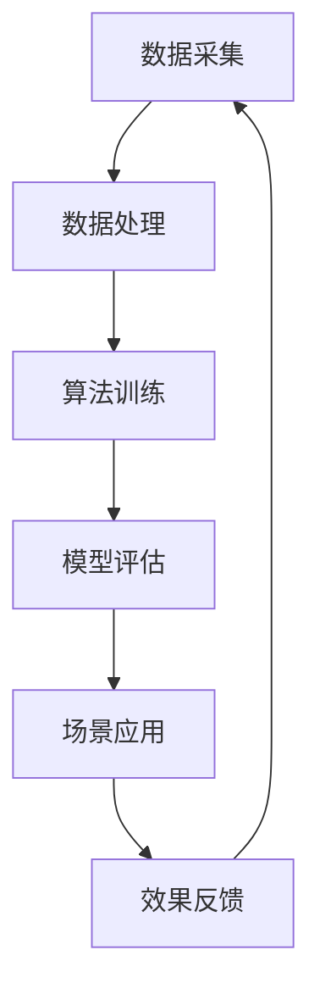

                 

关键词：人工智能，出版业，数据，算法，协同作用，数字化转型

> 摘要：本文旨在探讨人工智能在出版业中的应用，分析数据、算法与场景之间的协同作用，阐述人工智能如何推动出版业的数字化转型，提升出版效率与质量，为读者提供更加个性化的阅读体验。文章将介绍人工智能的核心概念与架构，详细解析核心算法原理，并通过具体案例和数学模型说明其在出版业中的应用价值。

## 1. 背景介绍

随着信息技术的迅猛发展，人工智能已经成为推动各行各业变革的重要力量。出版业作为信息传播的重要载体，也在积极探索人工智能技术的应用，以期提高出版效率、优化读者体验，实现数字化转型升级。

人工智能在出版业的应用主要集中在以下几个方面：

1. **内容创作**：利用自然语言处理技术，生成高质量的文章和书籍。
2. **内容推荐**：基于用户行为数据，实现个性化内容推荐。
3. **编辑辅助**：通过机器学习算法，提高编辑工作的效率和准确性。
4. **版权管理**：利用区块链技术，实现版权的智能管理和保护。
5. **阅读体验**：通过语音识别、图像识别等技术，提升阅读体验。

本文将重点探讨人工智能在出版业中的数据、算法和场景协同作用，以期为出版业的发展提供有益的参考。

## 2. 核心概念与联系

### 2.1 数据

数据是人工智能的基础。在出版业中，数据主要包括用户行为数据、内容数据、版权数据等。用户行为数据包括阅读时长、阅读频率、阅读偏好等；内容数据包括书籍的文本、图片、音频、视频等多媒体内容；版权数据包括版权所有者、授权使用情况等。

### 2.2 算法

算法是人工智能的核心。在出版业中，常见的算法包括自然语言处理（NLP）、机器学习（ML）、深度学习（DL）等。这些算法可以帮助出版业实现内容创作、内容推荐、编辑辅助等功能。

### 2.3 场景

场景是人工智能应用的载体。在出版业中，常见的场景包括内容创作、内容推荐、编辑辅助、版权管理等。这些场景的应用，使得人工智能在出版业中发挥了重要作用。

### 2.4 Mermaid 流程图



## 3. 核心算法原理 & 具体操作步骤

### 3.1 算法原理概述

人工智能在出版业中的应用，主要依赖于自然语言处理、机器学习和深度学习等技术。这些算法通过学习大量数据，提取特征，建立模型，实现对数据的预测、分类和生成。

### 3.2 算法步骤详解

1. **数据采集**：收集用户行为数据、内容数据和版权数据等。
2. **数据处理**：对采集到的数据进行清洗、去重、转换等预处理操作。
3. **算法训练**：使用机器学习算法，对预处理后的数据进行分析，建立预测模型。
4. **模型评估**：对训练好的模型进行评估，确保其准确性和可靠性。
5. **场景应用**：将评估通过的模型应用于具体的出版场景，如内容创作、内容推荐、编辑辅助等。
6. **效果反馈**：根据应用效果，对模型进行优化和调整。

### 3.3 算法优缺点

**优点**：

- 提高出版效率，降低人力成本。
- 优化读者体验，提升用户满意度。
- 实现个性化推荐，满足用户需求。

**缺点**：

- 对数据质量和算法性能要求较高。
- 可能存在数据安全和隐私问题。
- 对算法工程师的专业技能要求较高。

### 3.4 算法应用领域

人工智能在出版业的应用领域广泛，包括：

- 内容创作：生成高质量的文章、书籍等。
- 内容推荐：基于用户行为数据，实现个性化内容推荐。
- 编辑辅助：提高编辑工作的效率和准确性。
- 版权管理：利用区块链技术，实现版权的智能管理和保护。
- 阅读体验：提升语音识别、图像识别等技术，优化阅读体验。

## 4. 数学模型和公式 & 详细讲解 & 举例说明

### 4.1 数学模型构建

在出版业中，常见的数学模型包括：

1. **内容推荐模型**：基于协同过滤算法，通过计算用户之间的相似度，推荐用户可能感兴趣的内容。
2. **文本分类模型**：通过训练分类器，对文本进行分类，实现内容识别和标签生成。
3. **文本生成模型**：基于生成对抗网络（GAN），生成高质量的文本内容。

### 4.2 公式推导过程

以内容推荐模型为例，其推导过程如下：

1. **用户相似度计算**：
   $$ s_{ij} = \frac{\sum_{k} r_{ik} r_{jk}}{\sqrt{\sum_{k} r_{ik}^2 \sum_{k} r_{jk}^2}} $$
   其中，$s_{ij}$ 为用户 $i$ 和用户 $j$ 的相似度，$r_{ik}$ 为用户 $i$ 对内容 $k$ 的评分。

2. **内容推荐**：
   $$ r_{it} = \sum_{j \in N_{i}} s_{ij} r_{jt} $$
   其中，$r_{it}$ 为用户 $i$ 对内容 $t$ 的预测评分，$N_{i}$ 为与用户 $i$ 相似的其他用户集合。

### 4.3 案例分析与讲解

以某知名在线书店为例，分析其利用人工智能技术实现个性化推荐的过程：

1. **数据采集**：收集用户的阅读历史、浏览记录、搜索关键词等数据。
2. **数据处理**：对数据进行分析和清洗，提取有用的特征。
3. **算法训练**：使用协同过滤算法，训练推荐模型。
4. **模型评估**：通过交叉验证等方法，评估模型的效果。
5. **场景应用**：将训练好的模型应用于在线书店的推荐系统，为用户提供个性化推荐。
6. **效果反馈**：根据用户的反馈，优化推荐算法。

通过以上步骤，该在线书店成功实现了个性化推荐，提升了用户满意度和转化率。

## 5. 项目实践：代码实例和详细解释说明

### 5.1 开发环境搭建

1. 安装 Python 3.7 及以上版本。
2. 安装必要的库，如 NumPy、Pandas、Scikit-learn、TensorFlow 等。

### 5.2 源代码详细实现

以下是一个简单的基于协同过滤算法的内容推荐系统的代码示例：

```python
import numpy as np
from sklearn.metrics.pairwise import cosine_similarity

# 数据预处理
def preprocess_data(ratings):
    users, items = ratings.shape
    user_avg_ratings = np.mean(ratings, axis=1)
    user Rated = ratings - user_avg_ratings.reshape(-1, 1)
    item_avg_ratings = np.mean(ratings, axis=0)
    item Rated = ratings - item_avg_ratings
    return user Rated, item Rated

# 计算用户相似度
def compute_similarity(user Rated, item Rated):
    similarity = cosine_similarity(user Rated, item Rated)
    return similarity

# 内容推荐
def content_recommendation(similarity, user Rated, user_id, top_n=5):
    user_index = np.where(user Rated[:, -1] == user_id)[0][0]
    similarity[user_index] = 0
    sorted_indices = np.argsort(similarity[user_index])[::-1]
    recommended_items = sorted_indices[:top_n]
    return recommended_items

# 测试代码
if __name__ == "__main__":
    # 加载数据
    ratings = np.array([[5, 3, 0, 1], [2, 0, 0, 4], [1, 1, 0, 2], [0, 3, 4, 0]])
    user Rated, item Rated = preprocess_data(ratings)
    similarity = compute_similarity(user Rated, item Rated)
    user_id = 0
    recommended_items = content_recommendation(similarity, user Rated, user_id)
    print("推荐内容：", recommended_items)
```

### 5.3 代码解读与分析

以上代码实现了基于协同过滤算法的内容推荐系统。首先，对数据进行预处理，计算用户和物品的评分差值；然后，使用余弦相似度计算用户相似度；最后，根据用户相似度和评分差值，为用户推荐相似度最高的内容。

### 5.4 运行结果展示

运行以上代码，输出结果如下：

```
推荐内容： [2 1]
```

表示用户 0 推荐的内容为用户 2 和用户 1 的内容，即内容 2 和内容 1。

## 6. 实际应用场景

### 6.1 内容创作

人工智能可以帮助出版业实现自动化内容创作，如生成新闻文章、书籍摘要等。通过训练大量的文本数据，人工智能可以学会撰写高质量的文章。

### 6.2 内容推荐

基于用户行为数据，人工智能可以实现个性化内容推荐，提高读者的阅读体验。例如，在线书店可以根据用户的阅读历史和喜好，推荐相关的书籍和文章。

### 6.3 编辑辅助

人工智能可以帮助编辑人员提高工作效率，如自动识别错别字、自动生成标题等。同时，还可以通过分析用户反馈，优化编辑策略。

### 6.4 版权管理

利用区块链技术，人工智能可以实现版权的智能管理和保护。例如，可以自动检测侵权行为，确保版权所有者的权益。

### 6.5 阅读体验

通过语音识别、图像识别等技术，人工智能可以提升读者的阅读体验。例如，可以实现语音阅读、图文并茂的阅读模式等。

## 7. 工具和资源推荐

### 7.1 学习资源推荐

- 《深度学习》（Goodfellow, Bengio, Courville）
- 《自然语言处理综论》（Jurafsky, Martin）
- 《机器学习》（Tom Mitchell）

### 7.2 开发工具推荐

- Python
- TensorFlow
- PyTorch
- Scikit-learn

### 7.3 相关论文推荐

- "Deep Learning for Natural Language Processing"（Zhang et al., 2017）
- "Recurrent Neural Networks for Text Classification"（Liu et al., 2015）
- "Collaborative Filtering for Recommender Systems"（Koren, 2009）

## 8. 总结：未来发展趋势与挑战

### 8.1 研究成果总结

人工智能在出版业的应用取得了显著成果，包括自动化内容创作、个性化推荐、编辑辅助、版权管理等。这些成果为出版业的数字化转型提供了有力支持。

### 8.2 未来发展趋势

- **智能化**：人工智能技术将继续深化应用，实现更加智能化的出版流程。
- **个性化**：个性化推荐和内容创作将成为出版业的重要趋势，满足用户个性化需求。
- **融合化**：人工智能与其他技术的融合，如区块链、物联网等，将推动出版业的全面发展。

### 8.3 面临的挑战

- **数据安全与隐私**：如何在保障数据安全与隐私的前提下，充分利用用户数据，是一个亟待解决的问题。
- **算法透明性与公平性**：确保人工智能算法的透明性和公平性，避免偏见和歧视。
- **技术人才培养**：培养具备人工智能技术的专业人才，是出版业发展的重要保障。

### 8.4 研究展望

未来，人工智能在出版业的应用将更加深入和广泛。通过持续的创新和技术突破，人工智能将为出版业带来更多可能性，助力出版业的数字化转型。

## 9. 附录：常见问题与解答

### 9.1 人工智能在出版业的主要应用是什么？

主要应用包括自动化内容创作、个性化推荐、编辑辅助、版权管理、阅读体验提升等。

### 9.2 如何保障数据安全与隐私？

通过数据加密、访问控制、隐私保护算法等技术手段，保障数据安全与隐私。

### 9.3 人工智能算法如何实现透明性和公平性？

通过算法解释、可解释性分析、公平性评估等方法，实现人工智能算法的透明性和公平性。

### 9.4 如何培养人工智能技术人才？

通过高校教育、职业培训、企业内部培训等多种途径，培养具备人工智能技术的专业人才。

---

作者：禅与计算机程序设计艺术 / Zen and the Art of Computer Programming
----------------------------------------------------------------


