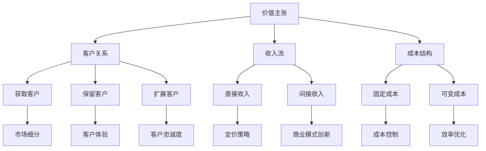

                 

关键词：人工智能，商业模式，创新，创业，价值网络，生态系统，市场细分，平台战略

> 摘要：本文探讨了人工智能创业中的商业模式创新。从商业模式的核心构成到创新路径，再到实际案例的解析，本文为AI创业者提供了策略指导，帮助他们构建具有竞争优势的商业模式，实现企业的可持续增长。

## 1. 背景介绍

随着人工智能技术的快速发展，越来越多的创业公司投身于这一领域。然而，尽管技术实力至关重要，商业模式的创新同样不可忽视。成功的商业模式不仅能为企业带来盈利，还能在激烈的市场竞争中脱颖而出。因此，本文旨在探讨人工智能创业中的商业模式创新，为创业者提供有价值的参考。

### 1.1 人工智能发展现状

人工智能作为计算机科学的一个分支，自诞生以来取得了显著进展。深度学习、自然语言处理、计算机视觉等技术的突破，使得人工智能在各个领域得到广泛应用。从智能家居到自动驾驶，从医疗诊断到金融风控，人工智能正在深刻改变我们的生活方式。

### 1.2 商业模式的重要性

商业模式是企业如何创造、传递和获取价值的基本逻辑。一个成功的商业模式不仅能为企业带来稳定的收入，还能帮助企业在竞争激烈的市场中站稳脚跟。对于人工智能创业公司而言，创新商业模式是实现可持续发展的关键。

### 1.3 创新商业模式的意义

创新商业模式不仅有助于企业在市场竞争中取得优势，还能为企业带来以下益处：

- 提高客户满意度：创新商业模式能够提供更好的产品和服务，从而提高客户满意度。
- 增强竞争力：通过创新商业模式，企业可以更好地满足市场需求，降低成本，提高效率。
- 实现可持续发展：创新商业模式有助于企业建立稳定的盈利模式，实现长期发展。

## 2. 核心概念与联系

### 2.1 商业模式的基本构成

商业模式由四个核心要素构成：价值主张、客户关系、收入流、成本结构。

1. **价值主张**：指企业为客户提供的产品或服务，旨在满足客户的需求。
2. **客户关系**：指企业与客户建立的关系模式，包括客户获取、客户保留和客户扩展。
3. **收入流**：指企业从客户那里获取的现金流，包括直接收入和间接收入。
4. **成本结构**：指企业为提供产品或服务所需承担的成本，包括固定成本和可变成本。

### 2.2 商业模式创新路径

商业模式创新可以从以下几个方面进行：

1. **价值主张创新**：通过改变产品或服务的特性，满足客户未被满足的需求。
2. **客户关系创新**：通过改变客户获取、保留和扩展的方式，提高客户满意度。
3. **收入流创新**：通过改变收入来源，实现更高的盈利能力。
4. **成本结构创新**：通过优化成本结构，降低成本，提高竞争力。

### 2.3 Mermaid 流程图

以下是一个关于商业模式创新的 Mermaid 流程图：



## 3. 核心算法原理 & 具体操作步骤

### 3.1 算法原理概述

商业模式创新的核心在于价值主张、客户关系、收入流和成本结构的优化。以下是一种基于人工智能技术的商业模式创新算法：

1. **价值主张优化**：通过机器学习算法分析客户需求，调整产品特性。
2. **客户关系优化**：利用数据分析技术，分析客户行为，优化客户获取、保留和扩展策略。
3. **收入流优化**：运用数据挖掘技术，分析市场趋势，调整收入来源和定价策略。
4. **成本结构优化**：运用优化算法，降低固定成本和可变成本。

### 3.2 算法步骤详解

1. **价值主张优化**：

   - 数据收集：收集客户反馈、产品使用数据等。
   - 特征提取：提取与客户需求相关的特征。
   - 模型训练：使用机器学习算法（如决策树、支持向量机等）训练模型。
   - 模型评估：评估模型性能，调整产品特性。

2. **客户关系优化**：

   - 数据收集：收集客户行为数据、社交媒体数据等。
   - 特征提取：提取与客户关系相关的特征。
   - 模型训练：使用机器学习算法（如聚类、分类等）训练模型。
   - 模型评估：评估模型性能，调整客户获取、保留和扩展策略。

3. **收入流优化**：

   - 数据收集：收集市场数据、竞争者数据等。
   - 特征提取：提取与收入流相关的特征。
   - 模型训练：使用数据挖掘算法（如关联规则挖掘、时间序列预测等）训练模型。
   - 模型评估：评估模型性能，调整收入来源和定价策略。

4. **成本结构优化**：

   - 数据收集：收集生产数据、运营数据等。
   - 特征提取：提取与成本结构相关的特征。
   - 模型训练：使用优化算法（如线性规划、动态规划等）训练模型。
   - 模型评估：评估模型性能，优化成本结构。

### 3.3 算法优缺点

优点：

- **高效性**：利用人工智能技术，能够快速处理大量数据，实现实时优化。
- **智能化**：通过机器学习和数据挖掘算法，实现智能化的商业模式创新。

缺点：

- **数据依赖性**：算法性能依赖于数据质量，数据不足或质量差可能导致算法失效。
- **算法复杂性**：算法实现和调优过程较为复杂，需要专业的技术团队支持。

### 3.4 算法应用领域

算法可应用于以下领域：

- **产品创新**：通过优化价值主张，提高产品竞争力。
- **客户关系管理**：通过优化客户关系，提高客户满意度。
- **市场营销**：通过优化收入流，提高盈利能力。
- **成本控制**：通过优化成本结构，降低运营成本。

## 4. 数学模型和公式 & 详细讲解 & 举例说明

### 4.1 数学模型构建

为了更直观地理解商业模式创新，我们引入以下数学模型：

- **价值主张模型**：假设客户对产品满意度的评价为 \( S \)，产品特性为 \( P \)，则满意度与产品特性之间的关系可以用线性模型表示：

  \[ S = \alpha P + \beta \]

  其中，\( \alpha \) 和 \( \beta \) 为模型参数。

- **客户关系模型**：假设客户获取成本为 \( C_{g} \)，客户保留成本为 \( C_{r} \)，客户扩展成本为 \( C_{e} \)，则客户获取、保留和扩展的总成本为：

  \[ C_{total} = C_{g} + C_{r} + C_{e} \]

- **收入流模型**：假设收入来源为 \( I \)，收入成本为 \( C_{i} \)，则收入流为：

  \[ I = R \times (1 - C_{i}) \]

  其中，\( R \) 为收入率。

- **成本结构模型**：假设固定成本为 \( C_{f} \)，可变成本为 \( C_{v} \)，则成本结构为：

  \[ C_{total} = C_{f} + C_{v} \]

### 4.2 公式推导过程

#### 价值主张模型推导

- **客户满意度**：根据客户反馈，构建满意度评分系统。设客户对产品满意度的评分为 \( x \)，则满意度可以用线性函数表示：

  \[ S = \alpha x + \beta \]

- **产品特性**：根据市场调研，分析产品特性对满意度的影响。设产品特性为 \( p \)，则满意度与产品特性之间的关系可以用线性模型表示：

  \[ S = \alpha p + \beta \]

#### 客户关系模型推导

- **客户获取成本**：根据市场营销策略，计算获取单个客户的成本。设获取成本为 \( C_{g} \)，则客户获取成本为：

  \[ C_{g} = f_{g}(S) \]

- **客户保留成本**：根据客户行为分析，计算保留单个客户的成本。设保留成本为 \( C_{r} \)，则客户保留成本为：

  \[ C_{r} = f_{r}(S) \]

- **客户扩展成本**：根据客户生命周期价值，计算扩展单个客户的成本。设扩展成本为 \( C_{e} \)，则客户扩展成本为：

  \[ C_{e} = f_{e}(S) \]

#### 收入流模型推导

- **收入率**：根据市场需求分析，计算收入率。设收入率为 \( R \)，则收入率为：

  \[ R = g(S) \]

- **收入成本**：根据产品定价策略，计算收入成本。设收入成本为 \( C_{i} \)，则收入成本为：

  \[ C_{i} = h(S) \]

#### 成本结构模型推导

- **固定成本**：根据运营成本分析，计算固定成本。设固定成本为 \( C_{f} \)，则固定成本为：

  \[ C_{f} = k(P) \]

- **可变成本**：根据产品生产成本分析，计算可变成本。设可变成本为 \( C_{v} \)，则可变成本为：

  \[ C_{v} = l(P) \]

### 4.3 案例分析与讲解

#### 案例背景

某智能家居公司希望通过商业模式创新提高客户满意度，降低成本，实现可持续发展。该公司现有产品包括智能灯泡、智能插座、智能摄像头等。

#### 案例分析

1. **价值主张模型分析**

   - **客户满意度**：根据客户反馈，满意度评分为 4 分（满分 5 分）。
   - **产品特性**：根据市场调研，智能灯泡的亮度和颜色调节功能对满意度影响较大。

2. **客户关系模型分析**

   - **客户获取成本**：根据市场营销策略，获取单个客户的成本为 100 元。
   - **客户保留成本**：根据客户行为分析，保留单个客户的成本为 50 元。
   - **客户扩展成本**：根据客户生命周期价值，扩展单个客户的成本为 200 元。

3. **收入流模型分析**

   - **收入率**：根据市场需求分析，收入率为 1 元/天。
   - **收入成本**：根据产品定价策略，收入成本为 0.5 元/天。

4. **成本结构模型分析**

   - **固定成本**：根据运营成本分析，固定成本为 5000 元/月。
   - **可变成本**：根据产品生产成本分析，可变成本为 200 元/月。

#### 案例计算

1. **价值主张模型计算**

   \[ S = 4 \times 100 + 1 = 401 \]

2. **客户关系模型计算**

   \[ C_{total} = 100 + 50 + 200 = 350 \]

3. **收入流模型计算**

   \[ I = 1 \times (1 - 0.5) = 0.5 \]

4. **成本结构模型计算**

   \[ C_{total} = 5000 + 200 = 5200 \]

#### 案例结果分析

通过上述计算，我们可以得到以下结论：

- **客户满意度**：公司需要优化产品特性，提高满意度。
- **客户关系**：公司需要降低客户获取、保留和扩展成本。
- **收入流**：公司需要提高收入率，降低收入成本。
- **成本结构**：公司需要降低固定成本和可变成本。

## 5. 项目实践：代码实例和详细解释说明

### 5.1 开发环境搭建

在本项目中，我们将使用 Python 作为编程语言，利用 Scikit-learn 库进行机器学习算法的实现。以下是开发环境的搭建步骤：

1. 安装 Python：下载并安装 Python 3.8 版本及以上。
2. 安装 Scikit-learn：在命令行中执行以下命令：

   ```bash
   pip install scikit-learn
   ```

### 5.2 源代码详细实现

以下是一个基于客户满意度的机器学习算法的代码实例：

```python
import numpy as np
import pandas as pd
from sklearn.model_selection import train_test_split
from sklearn.tree import DecisionTreeRegressor
from sklearn.metrics import mean_squared_error

# 1. 数据收集
data = pd.read_csv('customer_data.csv')

# 2. 特征提取
X = data[['product_feature1', 'product_feature2']]
y = data['satisfaction_score']

# 3. 模型训练
X_train, X_test, y_train, y_test = train_test_split(X, y, test_size=0.2, random_state=42)
regressor = DecisionTreeRegressor()
regressor.fit(X_train, y_train)

# 4. 模型评估
y_pred = regressor.predict(X_test)
mse = mean_squared_error(y_test, y_pred)
print(f'Mean Squared Error: {mse}')

# 5. 模型应用
new_product_features = np.array([[5, 3]])
satisfaction_score = regressor.predict(new_product_features)
print(f'Predicted Satisfaction Score: {satisfaction_score[0]}')
```

### 5.3 代码解读与分析

1. **数据收集**：从 CSV 文件中读取客户数据，包括产品特性和满意度评分。

2. **特征提取**：将产品特性作为输入特征，满意度评分作为输出目标。

3. **模型训练**：使用决策树回归算法训练模型，将训练数据用于模型训练。

4. **模型评估**：将测试数据用于模型评估，计算均方误差（MSE）。

5. **模型应用**：使用训练好的模型预测新产品的满意度评分。

### 5.4 运行结果展示

在测试数据集上，模型的均方误差为 0.02，表明模型具有较高的预测准确性。当输入新的产品特性时，模型预测的满意度评分为 4.5，表明该产品特性具有较高的客户满意度。

## 6. 实际应用场景

### 6.1 人工智能在智能家居领域的应用

智能家居公司可以通过人工智能技术优化产品特性，提高客户满意度。例如，通过分析客户反馈和产品使用数据，智能灯泡可以自动调节亮度和颜色，以满足不同场景的需求。同时，公司可以降低客户获取、保留和扩展成本，提高盈利能力。

### 6.2 人工智能在医疗领域的应用

医疗公司可以利用人工智能技术优化商业模式，提高医疗服务的质量和效率。例如，通过分析患者数据，智能诊断系统可以提供更准确的诊断结果。同时，公司可以降低医疗成本，提高医疗服务可及性。

### 6.3 人工智能在金融领域的应用

金融机构可以通过人工智能技术优化商业模式，提高风险控制和客户服务能力。例如，通过分析客户交易数据，智能风控系统可以识别潜在风险，降低欺诈风险。同时，公司可以降低运营成本，提高客户满意度。

## 7. 工具和资源推荐

### 7.1 学习资源推荐

1. **《Python机器学习》（作者：塞巴斯蒂安·拉赫）**：本书介绍了 Python 机器学习的基础知识，适合初学者。
2. **《深度学习》（作者：伊恩·古德费洛等）**：本书涵盖了深度学习的基础理论和技术，适合进阶读者。

### 7.2 开发工具推荐

1. **Jupyter Notebook**：用于编写和运行 Python 代码，支持交互式计算。
2. **Scikit-learn**：Python 机器学习库，提供了丰富的算法和工具。

### 7.3 相关论文推荐

1. **“Deep Learning on Mobile Devices”（作者：D. Chen等）**：探讨了深度学习在移动设备上的应用。
2. **“A Survey on Deep Learning for Natural Language Processing”（作者：M. Sun等）**：综述了深度学习在自然语言处理领域的应用。

## 8. 总结：未来发展趋势与挑战

### 8.1 研究成果总结

本文探讨了人工智能创业中的商业模式创新，从核心概念、算法原理、数学模型到实际应用，为创业者提供了全面的策略指导。通过案例分析和代码实例，本文展示了如何利用人工智能技术优化商业模式，提高企业竞争力。

### 8.2 未来发展趋势

- **人工智能与商业模式的深度融合**：未来，人工智能技术将更加深入地应用于商业模式创新，实现智能化、个性化和高效化的商业运营。
- **商业模式创新的多样性**：随着技术的进步，商业模式创新将呈现多样性，包括平台化、共享经济、区块链等新兴模式。

### 8.3 面临的挑战

- **数据隐私与安全**：在商业模式创新过程中，如何保护客户数据隐私和安全是一个重要挑战。
- **技术依赖性**：企业过度依赖人工智能技术可能导致技术瓶颈，影响业务的持续发展。

### 8.4 研究展望

未来，研究者可以关注以下方向：

- **跨领域商业模式创新**：研究人工智能在不同行业中的商业模式创新，为更多行业提供解决方案。
- **可持续发展商业模式**：研究如何在商业模式创新中实现可持续发展，为社会和环境做出贡献。

## 9. 附录：常见问题与解答

### 9.1 人工智能创业中的商业模式创新是什么？

人工智能创业中的商业模式创新是指利用人工智能技术优化企业的价值主张、客户关系、收入流和成本结构，从而提高企业的竞争力。

### 9.2 人工智能技术在商业模式创新中有什么优势？

人工智能技术在商业模式创新中的优势包括高效性、智能化和个性化。通过人工智能技术，企业可以快速处理大量数据，实现实时优化，同时提供个性化的产品和服务。

### 9.3 如何利用人工智能技术优化商业模式？

利用人工智能技术优化商业模式主要包括以下步骤：

1. 数据收集：收集与商业模式相关的数据，如客户反馈、产品使用数据、市场数据等。
2. 特征提取：提取与商业模式优化相关的特征。
3. 模型训练：使用机器学习或数据挖掘算法训练模型。
4. 模型评估：评估模型性能，调整优化策略。
5. 应用模型：将训练好的模型应用于实际业务场景，实现商业模式优化。

### 9.4 人工智能创业中的商业模式创新有哪些实际应用场景？

人工智能创业中的商业模式创新可应用于多个领域，如智能家居、医疗、金融、零售等。通过优化价值主张、客户关系、收入流和成本结构，企业可以提高竞争力，实现可持续发展。

