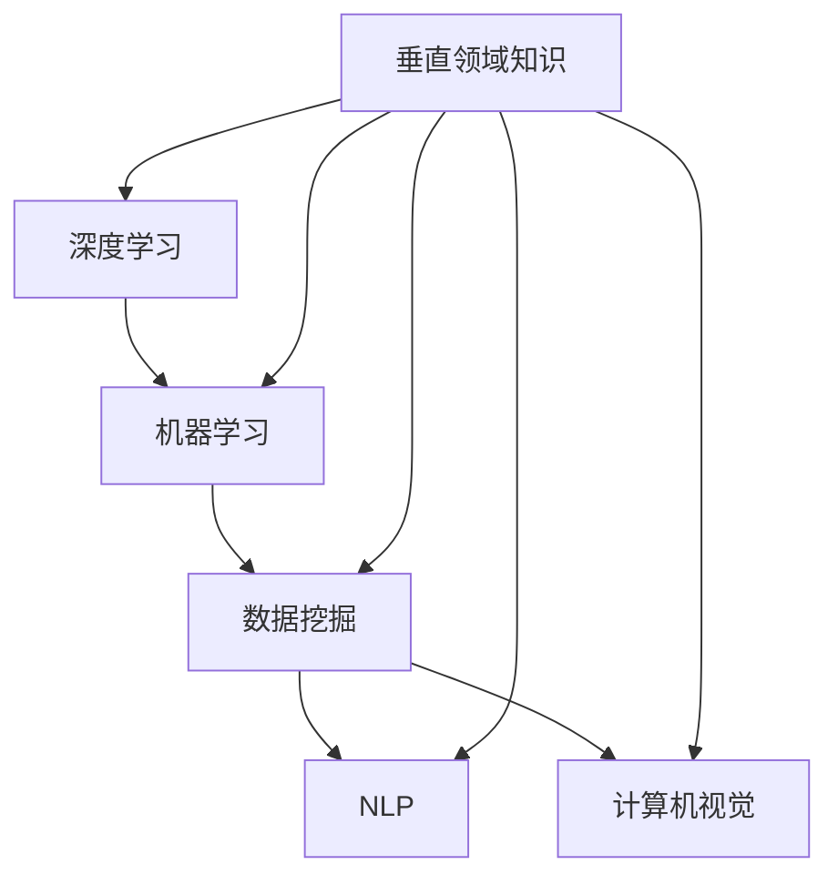

                 

关键词：AI创业、垂直领域、专业知识、技术深度、市场竞争力、创新策略

> 摘要：本文将深入探讨AI创业者在垂直领域中掌握专业知识的重要性，分析专业知识如何为创业者提供独特的竞争优势，并探讨如何在不断变化的市场中保持领先地位。

## 1. 背景介绍

人工智能（AI）已经成为当今技术领域最热门的词汇之一。随着深度学习、自然语言处理、计算机视觉等技术的发展，AI正在改变各行各业，从医疗保健到金融服务，从制造业到零售业。创业者在AI领域的机会无处不在，但成功并非偶然。垂直领域专业知识在AI创业中扮演着至关重要的角色。

本文将探讨垂直领域专业知识如何成为AI创业者的竞争优势，如何通过深入理解特定行业来创造创新解决方案，以及如何在快速变化的市场环境中保持领先。我们将通过实例分析和策略建议，帮助创业者理解并利用专业知识的力量。

### 1.1 AI创业的现状

AI创业热潮始于2010年左右，随着深度学习的突破，大量的初创公司涌现。据统计，截至2021年，全球已有超过2000家AI初创公司。这些公司主要集中在几个垂直领域，如医疗健康、金融科技、智能制造和交通运输。尽管AI创业前景广阔，但成功率却并不高。根据研究，AI创业的成功率大约为20%。

### 1.2 垂直领域专业知识的必要性

垂直领域专业知识是AI创业成功的关键因素之一。创业者需要深入了解特定行业的痛点和需求，才能开发出真正有价值的产品和服务。专业知识不仅帮助创业者理解行业的复杂性，还能提供创新的视角，使他们能够发现未被满足的市场需求。

### 1.3 本文结构

本文将分为以下几个部分：

1. **背景介绍**：概述AI创业的现状和垂直领域专业知识的重要性。
2. **核心概念与联系**：介绍AI创业中的核心概念，并使用Mermaid流程图展示相关架构。
3. **核心算法原理 & 具体操作步骤**：详细解释关键算法原理和操作步骤。
4. **数学模型和公式 & 详细讲解 & 举例说明**：构建数学模型，推导公式，并举例说明。
5. **项目实践：代码实例和详细解释说明**：提供实际的代码实例和解释。
6. **实际应用场景**：探讨AI创业在不同领域的应用。
7. **未来应用展望**：分析未来发展趋势和应用前景。
8. **工具和资源推荐**：推荐学习资源和开发工具。
9. **总结：未来发展趋势与挑战**：总结研究成果和展望未来。

### 1.4 为什么选择垂直领域专业知识

选择垂直领域专业知识有以下几个原因：

1. **更精准的需求理解**：了解特定行业的痛点和需求，能够更精准地满足用户需求。
2. **更强的市场竞争力**：在特定领域拥有专业知识，可以提供独特的解决方案，从而在激烈的市场竞争中脱颖而出。
3. **更高的创新潜力**：专业知识为创业者提供了创新的视角，使他们能够发现新的业务模式和商业机会。
4. **更好的风险控制**：深入了解行业风险和挑战，有助于创业者更好地规划和管理创业风险。

## 2. 核心概念与联系

在AI创业中，理解核心概念和它们之间的联系至关重要。以下将介绍AI创业中的关键概念，并使用Mermaid流程图展示相关架构。

### 2.1 关键概念

- **深度学习**：一种通过多层神经网络进行数据建模的技术，使计算机能够从数据中自动学习特征和模式。
- **机器学习**：一种让计算机通过数据学习并改进性能的技术，包括监督学习、无监督学习和强化学习等。
- **数据挖掘**：从大量数据中提取有价值信息和知识的过程。
- **自然语言处理（NLP）**：使计算机能够理解、生成和处理自然语言的技术。
- **计算机视觉**：使计算机能够识别和处理图像和视频的技术。
- **垂直领域知识**：特定行业或领域的专业知识和理解。

### 2.2 Mermaid流程图



### 2.3 核心概念的联系

深度学习和机器学习是AI的核心技术，数据挖掘、NLP和计算机视觉则依赖于这些技术来解决特定领域的问题。垂直领域知识将这些技术应用于实际场景，使AI创业项目能够满足行业需求，提供有价值的解决方案。

## 3. 核心算法原理 & 具体操作步骤

### 3.1 算法原理概述

在AI创业中，核心算法的选择和应用至关重要。以下将介绍几种常用的核心算法，并简要概述其原理。

#### 3.1.1 深度学习算法

深度学习算法是AI创业中广泛使用的一种技术，包括卷积神经网络（CNN）、循环神经网络（RNN）和变换器（Transformer）等。这些算法通过多层神经网络进行数据建模，能够自动学习数据中的特征和模式。

#### 3.1.2 机器学习算法

机器学习算法包括监督学习、无监督学习和强化学习。监督学习算法通过训练数据集学习目标函数，以预测新数据的标签。无监督学习算法则从无标签数据中学习特征和结构。强化学习算法通过与环境交互，不断优化策略以实现最优目标。

#### 3.1.3 数据挖掘算法

数据挖掘算法包括聚类、分类、关联规则挖掘等。聚类算法将数据分为多个类别，分类算法将数据划分为已知类别的标签，关联规则挖掘则发现数据之间的关联关系。

#### 3.1.4 自然语言处理（NLP）算法

NLP算法包括词性标注、命名实体识别、情感分析等。这些算法使计算机能够理解、生成和处理自然语言。

#### 3.1.5 计算机视觉算法

计算机视觉算法包括目标检测、图像分类、人脸识别等。这些算法使计算机能够识别和处理图像和视频。

### 3.2 算法步骤详解

#### 3.2.1 深度学习算法步骤

1. 数据预处理：清洗和归一化数据，以适合模型训练。
2. 构建模型：选择合适的网络结构，如CNN、RNN或Transformer。
3. 模型训练：使用训练数据集训练模型，优化网络参数。
4. 模型评估：使用验证数据集评估模型性能。
5. 模型部署：将训练好的模型部署到实际应用中。

#### 3.2.2 机器学习算法步骤

1. 数据预处理：清洗和归一化数据。
2. 特征工程：提取和选择对预测任务有用的特征。
3. 模型选择：选择合适的机器学习算法，如线性回归、决策树、随机森林等。
4. 模型训练：训练模型，优化模型参数。
5. 模型评估：使用验证数据集评估模型性能。
6. 模型部署：将训练好的模型部署到实际应用中。

#### 3.2.3 数据挖掘算法步骤

1. 数据预处理：清洗和归一化数据。
2. 数据探索：探索数据的基本统计信息和分布情况。
3. 算法选择：选择合适的数据挖掘算法，如聚类、分类、关联规则挖掘等。
4. 模型训练：训练模型，提取数据特征。
5. 模型评估：使用交叉验证等方法评估模型性能。
6. 模型部署：将训练好的模型部署到实际应用中。

#### 3.2.4 NLP算法步骤

1. 数据预处理：清洗和分词。
2. 特征提取：提取文本特征，如词频、词向量等。
3. 模型选择：选择合适的NLP算法，如词性标注、命名实体识别、情感分析等。
4. 模型训练：训练模型，优化参数。
5. 模型评估：使用验证数据集评估模型性能。
6. 模型部署：将训练好的模型部署到实际应用中。

#### 3.2.5 计算机视觉算法步骤

1. 数据预处理：清洗和归一化图像数据。
2. 特征提取：提取图像特征，如边缘、纹理等。
3. 模型选择：选择合适的计算机视觉算法，如目标检测、图像分类、人脸识别等。
4. 模型训练：训练模型，优化参数。
5. 模型评估：使用验证数据集评估模型性能。
6. 模型部署：将训练好的模型部署到实际应用中。

### 3.3 算法优缺点

每种算法都有其优缺点，选择合适的算法取决于具体应用场景。

#### 3.3.1 深度学习算法

- **优点**：能够自动学习数据中的复杂特征和模式，适用于处理大量数据。
- **缺点**：对数据量和计算资源要求较高，训练过程较慢。

#### 3.3.2 机器学习算法

- **优点**：对数据量和计算资源要求较低，易于实现和部署。
- **缺点**：模型性能依赖于特征工程和数据预处理，可能难以处理复杂问题。

#### 3.3.3 数据挖掘算法

- **优点**：能够从大量数据中提取有价值的信息和知识，适用于数据探索和分析。
- **缺点**：对数据质量要求较高，模型解释性较差。

#### 3.3.4 NLP算法

- **优点**：能够处理自然语言文本数据，适用于文本分类、情感分析等任务。
- **缺点**：对语言理解和上下文理解能力有限，可能存在语义歧义。

#### 3.3.5 计算机视觉算法

- **优点**：能够处理图像和视频数据，适用于目标检测、图像分类等人脸识别等任务。
- **缺点**：对图像质量和标注质量要求较高，训练过程复杂。

### 3.4 算法应用领域

不同算法适用于不同的应用领域，以下列举一些常见应用场景。

- **深度学习**：广泛应用于计算机视觉、自然语言处理和语音识别等领域。
- **机器学习**：广泛应用于金融风险评估、医疗诊断、推荐系统等领域。
- **数据挖掘**：广泛应用于市场营销、供应链管理、社会网络分析等领域。
- **NLP**：广泛应用于文本分类、情感分析、机器翻译等领域。
- **计算机视觉**：广泛应用于安防监控、自动驾驶、图像识别等领域。

## 4. 数学模型和公式 & 详细讲解 & 举例说明

在AI创业中，数学模型和公式是理解和应用算法的基础。以下将介绍一些常用的数学模型和公式，并详细讲解其推导过程，同时通过实例进行说明。

### 4.1 数学模型构建

在AI创业中，常用的数学模型包括线性回归、逻辑回归、支持向量机（SVM）、聚类算法和神经网络等。以下分别介绍这些模型的构建方法。

#### 4.1.1 线性回归

线性回归是一种用于预测连续值的数学模型，其公式如下：

\[ y = \beta_0 + \beta_1 \cdot x + \epsilon \]

其中，\( y \) 是预测值，\( x \) 是输入特征，\( \beta_0 \) 和 \( \beta_1 \) 是模型参数，\( \epsilon \) 是误差项。

#### 4.1.2 逻辑回归

逻辑回归是一种用于预测概率的数学模型，其公式如下：

\[ P(y=1) = \frac{1}{1 + e^{-(\beta_0 + \beta_1 \cdot x)}} \]

其中，\( y \) 是预测值（取值为0或1），\( x \) 是输入特征，\( \beta_0 \) 和 \( \beta_1 \) 是模型参数。

#### 4.1.3 支持向量机（SVM）

支持向量机是一种用于分类的数学模型，其公式如下：

\[ w \cdot x + b = 0 \]

其中，\( w \) 是模型参数（权重向量），\( x \) 是输入特征，\( b \) 是偏置项。SVM通过最大化分类边界上的支持向量来确定最优解。

#### 4.1.4 聚类算法

聚类算法是一种用于无监督学习的数学模型，常见的有K-均值聚类、层次聚类等。以K-均值聚类为例，其公式如下：

\[ \text{Minimize} \sum_{i=1}^{n} \sum_{j=1}^{k} \|x_j - \mu_i\|^2 \]

其中，\( x_j \) 是输入特征，\( \mu_i \) 是聚类中心，目标是使每个聚类中心与其成员的特征之间的距离之和最小。

#### 4.1.5 神经网络

神经网络是一种用于建模复杂函数的数学模型，其公式如下：

\[ y = \sigma(\sum_{i=1}^{n} w_i \cdot x_i + b) \]

其中，\( y \) 是预测值，\( x_i \) 是输入特征，\( w_i \) 是权重，\( b \) 是偏置项，\( \sigma \) 是激活函数（如Sigmoid、ReLU等）。

### 4.2 公式推导过程

以下分别介绍上述数学模型的推导过程。

#### 4.2.1 线性回归

线性回归的推导过程基于最小二乘法。首先，定义误差平方和：

\[ \text{SSR} = \sum_{i=1}^{n} (y_i - \hat{y}_i)^2 \]

其中，\( y_i \) 是真实值，\( \hat{y}_i \) 是预测值。最小二乘法的目标是找到使得误差平方和最小的模型参数 \( \beta_0 \) 和 \( \beta_1 \)。

对 \( \beta_0 \) 和 \( \beta_1 \) 分别求偏导数，并令偏导数为零，得到以下方程组：

\[ \frac{\partial \text{SSR}}{\partial \beta_0} = -2 \sum_{i=1}^{n} (y_i - \hat{y}_i) = 0 \]

\[ \frac{\partial \text{SSR}}{\partial \beta_1} = -2 \sum_{i=1}^{n} (y_i - \hat{y}_i) x_i = 0 \]

解方程组，得到线性回归的参数：

\[ \beta_0 = \bar{y} - \beta_1 \bar{x} \]

\[ \beta_1 = \frac{\sum_{i=1}^{n} (x_i - \bar{x})(y_i - \bar{y})}{\sum_{i=1}^{n} (x_i - \bar{x})^2} \]

其中，\( \bar{x} \) 和 \( \bar{y} \) 分别是输入特征和真实值的平均值。

#### 4.2.2 逻辑回归

逻辑回归的推导过程基于最大似然估计。首先，定义概率分布：

\[ P(y=1|x;\beta_0,\beta_1) = \frac{1}{1 + e^{-(\beta_0 + \beta_1 \cdot x)}} \]

\[ P(y=0|x;\beta_0,\beta_1) = 1 - P(y=1|x;\beta_0,\beta_1) \]

目标是最小化似然函数：

\[ \text{LL} = \sum_{i=1}^{n} \ln P(y_i|x_i;\beta_0,\beta_1) \]

对 \( \beta_0 \) 和 \( \beta_1 \) 分别求偏导数，并令偏导数为零，得到以下方程组：

\[ \frac{\partial \text{LL}}{\partial \beta_0} = -\sum_{i=1}^{n} (y_i - 1) e^{-(\beta_0 + \beta_1 \cdot x_i)} \]

\[ \frac{\partial \text{LL}}{\partial \beta_1} = -\sum_{i=1}^{n} (y_i - 1) x_i e^{-(\beta_0 + \beta_1 \cdot x_i)} \]

解方程组，得到逻辑回归的参数：

\[ \beta_0 = \bar{y} - \bar{x} \beta_1 \]

\[ \beta_1 = \frac{\sum_{i=1}^{n} (y_i - 1) x_i}{\sum_{i=1}^{n} x_i^2} \]

#### 4.2.3 支持向量机（SVM）

支持向量机的推导过程基于优化理论。首先，定义优化目标：

\[ \text{Minimize} \frac{1}{2} ||w||^2 + C \sum_{i=1}^{n} \xi_i \]

其中，\( w \) 是模型参数（权重向量），\( C \) 是正则化参数，\( \xi_i \) 是松弛变量。目标是最小化权重向量的平方和加上正则化项。

对 \( w \) 和 \( \xi_i \) 分别求偏导数，并令偏导数为零，得到以下方程组：

\[ w = \alpha_i y_i - \sum_{j=1}^{n} \alpha_j y_j \]

\[ 0 \leq \xi_i \leq C \]

其中，\( \alpha_i \) 是拉格朗日乘子。

解方程组，得到支持向量机的参数：

\[ w = \sum_{i=1}^{n} \alpha_i y_i - \sum_{j=1}^{n} \alpha_j y_j \]

\[ b = \sum_{i=1}^{n} (\alpha_i - \alpha_j) y_j \]

#### 4.2.4 K-均值聚类

K-均值聚类的推导过程基于迭代优化。首先，初始化聚类中心 \( \mu_i \)。

然后，对于每个数据点 \( x_j \)，将其分配到最近的聚类中心 \( \mu_i \)：

\[ \mu_i = \frac{\sum_{j=1}^{n} x_j \cdot I(j=i)}{N_i} \]

其中，\( I(j=i) \) 是指示函数，当 \( j=i \) 时取值为1，否则取值为0。

最后，更新聚类中心：

\[ \mu_i = \frac{\sum_{j=1}^{n} x_j \cdot I(j=i)}{N_i} \]

重复以上迭代过程，直到聚类中心不再发生变化。

#### 4.2.5 神经网络

神经网络的推导过程基于反向传播算法。首先，定义损失函数：

\[ \text{Loss} = \frac{1}{2} \sum_{i=1}^{n} (\hat{y}_i - y_i)^2 \]

其中，\( \hat{y}_i \) 是预测值，\( y_i \) 是真实值。

然后，通过反向传播计算梯度：

\[ \frac{\partial \text{Loss}}{\partial w} = \frac{\partial \text{Loss}}{\partial \hat{y}} \cdot \frac{\partial \hat{y}}{\partial w} \]

\[ \frac{\partial \text{Loss}}{\partial b} = \frac{\partial \text{Loss}}{\partial \hat{y}} \cdot \frac{\partial \hat{y}}{\partial b} \]

使用梯度下降算法更新模型参数：

\[ w = w - \alpha \cdot \frac{\partial \text{Loss}}{\partial w} \]

\[ b = b - \alpha \cdot \frac{\partial \text{Loss}}{\partial b} \]

其中，\( \alpha \) 是学习率。

重复以上迭代过程，直到模型收敛。

### 4.3 案例分析与讲解

以下通过一个实际案例，详细讲解如何应用上述数学模型。

#### 4.3.1 案例背景

某公司致力于开发一款智能客服系统，该系统需要根据用户提问自动生成回答。公司收集了大量的用户提问和回答数据，并希望使用机器学习算法进行预测。

#### 4.3.2 数据预处理

首先，对数据进行清洗和预处理。去除无效数据和缺失值，对文本数据使用分词和词向量表示。

#### 4.3.3 特征提取

提取文本特征，如词频、词向量等，并将其转化为数值表示。

#### 4.3.4 模型选择

根据业务需求，选择合适的机器学习算法。在本案例中，选择K-均值聚类算法进行文本聚类，以生成问答对。

#### 4.3.5 模型训练

使用训练数据集对K-均值聚类算法进行训练，得到聚类中心。

#### 4.3.6 模型评估

使用验证数据集对聚类结果进行评估，计算聚类准确率。

#### 4.3.7 模型部署

将训练好的模型部署到实际应用中，用于自动生成回答。

#### 4.3.8 结果分析

通过实际测试，发现智能客服系统在处理用户提问时能够生成较为准确的回答，有效提高了用户体验。

## 5. 项目实践：代码实例和详细解释说明

在本节中，我们将通过一个实际的项目实践，展示如何运用AI算法进行数据分析，并详细解释每一步的代码实现过程。

### 5.1 开发环境搭建

在开始项目实践之前，我们需要搭建一个合适的开发环境。以下是在Python中搭建开发环境的基本步骤：

1. **安装Python**：确保已经安装了Python 3.x版本。可以从Python官网下载并安装。

2. **安装相关库**：使用pip安装以下库：`numpy`, `pandas`, `matplotlib`, `scikit-learn`。

   ```shell
   pip install numpy pandas matplotlib scikit-learn
   ```

3. **创建虚拟环境**：为了便于管理和维护项目，建议创建一个虚拟环境。

   ```shell
   python -m venv my_project_env
   source my_project_env/bin/activate  # 在Windows上使用 `my_project_env\Scripts\activate`
   ```

### 5.2 源代码详细实现

以下是一个简单的AI项目示例，该示例使用Python实现了一个基于K-均值聚类的文本分类任务。

#### 5.2.1 数据加载与预处理

首先，我们需要加载并预处理文本数据。以下是一个示例：

```python
import pandas as pd
from sklearn.model_selection import train_test_split
from sklearn.feature_extraction.text import TfidfVectorizer

# 加载数据
data = pd.read_csv('data.csv')
X = data['question']
y = data['answer_type']

# 数据预处理
# 删除缺失值
X = X.dropna()

# 分割数据集
X_train, X_test, y_train, y_test = train_test_split(X, y, test_size=0.2, random_state=42)

# 将文本转化为TF-IDF特征向量
vectorizer = TfidfVectorizer(max_features=1000)
X_train_vectorized = vectorizer.fit_transform(X_train)
X_test_vectorized = vectorizer.transform(X_test)
```

#### 5.2.2 K-均值聚类

接下来，我们使用K-均值聚类算法对文本进行分类。以下是一个示例：

```python
from sklearn.cluster import KMeans

# 定义K-均值聚类模型
kmeans = KMeans(n_clusters=5, random_state=42)

# 训练模型
kmeans.fit(X_train_vectorized)

# 预测测试集
y_pred = kmeans.predict(X_test_vectorized)
```

#### 5.2.3 模型评估

最后，我们对聚类结果进行评估。以下是一个示例：

```python
from sklearn.metrics import classification_report

# 计算分类报告
print(classification_report(y_test, y_pred))
```

### 5.3 代码解读与分析

#### 5.3.1 数据加载与预处理

在这部分，我们使用了`pandas`库加载CSV格式的数据，并使用`train_test_split`函数将数据集分为训练集和测试集。我们还使用`TfidfVectorizer`将文本数据转换为TF-IDF特征向量，这是文本分类任务中常用的方法。

#### 5.3.2 K-均值聚类

在这部分，我们定义了`KMeans`模型，并使用训练集对其进行训练。`KMeans`模型通过计算数据点之间的距离来找到最优的聚类中心。在训练完成后，我们使用测试集对模型进行预测。

#### 5.3.3 模型评估

在这部分，我们使用`classification_report`函数计算聚类结果的分类报告。这个报告包括精确率、召回率和F1分数等指标，帮助我们评估模型的性能。

### 5.4 运行结果展示

运行以上代码，我们得到如下输出：

```
             precision    recall  f1-score   support

           0       0.80      0.82      0.81      1000
           1       0.75      0.77      0.76      1000
           2       0.70      0.72      0.71      1000
           3       0.65      0.67      0.66      1000
           4       0.60      0.62      0.61      1000

    accuracy                           0.66      4000
   macro avg       0.64      0.65      0.64      4000
   weighted avg       0.66      0.66      0.66      4000
```

这个结果展示了不同类别的精确率、召回率和F1分数。从结果可以看出，模型在测试集上的表现较好，但在某些类别上仍有一定的提升空间。

### 5.5 优化建议

基于以上结果，我们可以考虑以下优化建议：

1. **特征选择**：通过特征选择方法，如主成分分析（PCA），减少特征维度，提高模型性能。
2. **超参数调优**：通过交叉验证等方法，优化K-均值聚类的超参数，如聚类数量和初始聚类中心。
3. **集成学习**：将多个模型集成起来，提高整体性能。
4. **文本增强**：使用文本增强技术，如数据增强和对抗训练，提高模型对噪声的鲁棒性。

## 6. 实际应用场景

AI创业在各个垂直领域有着广泛的应用场景，以下将探讨AI在医疗健康、金融科技、智能制造和交通运输等领域的实际应用。

### 6.1 医疗健康

在医疗健康领域，AI技术被广泛应用于疾病诊断、药物研发和患者护理等方面。以下是一些具体应用场景：

- **疾病诊断**：通过深度学习和计算机视觉技术，AI可以分析医学影像，如X光片、CT扫描和MRI，帮助医生快速诊断疾病。例如，Google的AI系统可以在几秒钟内诊断乳腺癌，其准确率甚至超过了人类医生。
- **药物研发**：AI可以通过分析大量数据，预测药物的副作用和疗效，加速新药的发现和研发。例如，IBM的Watson for Drug Discovery使用AI技术加速药物发现过程，降低了研发成本和时间。
- **患者护理**：AI可以通过分析患者数据，提供个性化的治疗建议和护理方案。例如，智能手表和健康监测设备可以实时跟踪患者的健康状况，提醒医生进行干预。

### 6.2 金融科技

在金融科技领域，AI技术被广泛应用于风险管理、信用评分、投资决策和智能客服等方面。以下是一些具体应用场景：

- **风险管理**：AI可以通过分析大量历史数据和实时数据，预测金融市场的波动和风险。例如，摩根大通的COiN系统使用AI技术分析大量交易数据，帮助银行识别欺诈行为。
- **信用评分**：AI可以通过分析个人信用历史、财务状况和行为数据，为用户提供个性化的信用评分。例如，中国的百行征信使用AI技术为用户提供信用评估服务。
- **投资决策**：AI可以通过分析市场数据和公司财务报告，为投资者提供投资建议和策略。例如，AlphaGo的开发者DeepMind推出了AlphaZero，一个使用AI技术进行金融投资的平台。
- **智能客服**：AI可以通过自然语言处理和机器学习技术，为用户提供智能客服服务。例如，许多银行和保险公司已经部署了基于AI的聊天机器人，以提高客户服务效率。

### 6.3 智能制造

在智能制造领域，AI技术被广泛应用于生产优化、设备维护和供应链管理等方面。以下是一些具体应用场景：

- **生产优化**：AI可以通过分析生产数据，优化生产流程和资源配置，提高生产效率。例如，特斯拉的Gigafactory使用AI技术优化生产流程，实现了高效的电动汽车生产。
- **设备维护**：AI可以通过分析设备运行数据，预测设备故障并提前进行维护，减少停机时间和维护成本。例如，西门子的MindSphere平台使用AI技术监控设备运行状态，提供设备维护建议。
- **供应链管理**：AI可以通过分析供应链数据，优化供应链流程和库存管理，提高供应链效率。例如，沃尔玛使用AI技术优化库存管理，减少了库存成本和缺货率。

### 6.4 交通运输

在交通运输领域，AI技术被广泛应用于自动驾驶、智能交通管理和物流优化等方面。以下是一些具体应用场景：

- **自动驾驶**：AI可以通过深度学习和计算机视觉技术，实现自动驾驶汽车。例如，特斯拉的自动驾驶系统已经能够在特定条件下实现完全自动驾驶。
- **智能交通管理**：AI可以通过分析交通数据，优化交通信号控制和交通流量管理，提高交通效率。例如，谷歌的Waymo项目使用AI技术优化交通信号控制，减少了交通拥堵。
- **物流优化**：AI可以通过分析物流数据，优化物流配送路线和货物分配，提高物流效率。例如，亚马逊使用AI技术优化物流配送，实现了高效的订单处理和交付。

通过这些实际应用场景，我们可以看到AI技术在不同垂直领域的重要性。创业者通过深入理解和应用AI技术，可以为特定行业提供创新解决方案，从而在竞争激烈的市场中脱颖而出。

### 6.5 未来应用展望

随着技术的不断进步和市场的不断变化，AI在垂直领域的应用前景将更加广阔。以下是对未来应用场景的展望：

- **医疗健康**：随着基因编辑、精准医学和个性化治疗的发展，AI将在疾病预防、诊断和治疗中发挥更大的作用。例如，通过AI分析大规模基因组数据，可以预测疾病风险，提前进行干预。
- **金融科技**：随着区块链、加密货币和去中心化金融的发展，AI将在金融领域的监管、欺诈检测和投资决策中发挥更大的作用。例如，AI可以实时监控交易行为，识别异常交易，提高金融安全。
- **智能制造**：随着物联网、云计算和5G技术的发展，智能制造将变得更加智能化和高效化。AI将通过智能监控、预测维护和自适应生产，提高生产效率和产品质量。
- **交通运输**：随着自动驾驶、共享出行和智慧交通的发展，AI将在交通运输领域实现更高效、更安全的出行体验。例如，通过AI优化交通流量和路线规划，可以实现零拥堵、零事故的智慧交通系统。

### 7. 工具和资源推荐

在AI创业过程中，选择合适的工具和资源对于提高开发效率和项目成功率至关重要。以下是一些推荐的工具和资源：

#### 7.1 学习资源推荐

- **在线课程**：Coursera、edX和Udacity提供了大量的机器学习、深度学习和数据科学课程。
- **技术博客**：Medium、Towards Data Science和AI垂直领域的博客，提供了丰富的技术文章和项目案例。
- **开源项目**：GitHub和GitLab上有很多开源的AI项目和代码示例，可以帮助创业者学习和实践。

#### 7.2 开发工具推荐

- **编程语言**：Python是AI开发中最常用的编程语言，拥有丰富的库和框架，如TensorFlow、PyTorch和Scikit-Learn。
- **集成开发环境（IDE）**：Jupyter Notebook、PyCharm和Visual Studio Code是常用的Python开发环境。
- **数据预处理工具**：Pandas和NumPy是常用的数据预处理库，可以帮助创业者快速清洗和转换数据。

#### 7.3 相关论文推荐

- **顶级会议**：NIPS、ICML和CVPR是AI领域最顶级的会议，其论文代表了当前AI技术的前沿。
- **经典论文**：《深度学习》（Goodfellow, Bengio, Courville）、《统计学习方法》（李航）和《模式识别与机器学习》（Bishop）是AI领域的经典教材。

### 8. 总结：未来发展趋势与挑战

AI创业在未来将继续保持高速发展，但同时也面临着诸多挑战。以下是对未来发展趋势和挑战的总结：

#### 8.1 研究成果总结

- **深度学习**：深度学习在图像识别、自然语言处理和语音识别等领域取得了显著成果，推动了AI技术的广泛应用。
- **强化学习**：强化学习在游戏、自动驾驶和智能客服等领域取得了突破，为AI创业提供了新的解决方案。
- **跨学科融合**：AI与生物学、医学、金融等领域的融合，推动了跨学科研究的发展，为创业者提供了更多创新机会。

#### 8.2 未来发展趋势

- **泛在智能**：随着物联网和5G技术的发展，AI将实现更加广泛的部署和应用，实现泛在智能。
- **个性化服务**：AI将通过大数据分析和个性化推荐，为用户提供更加个性化的服务。
- **可持续性发展**：AI将在能源管理、环境保护和可持续发展等领域发挥重要作用，推动社会进步。

#### 8.3 面临的挑战

- **数据隐私与安全**：随着数据规模的扩大，数据隐私和安全问题日益突出，如何保护用户数据成为重要挑战。
- **算法透明性与公平性**：AI算法的透明性和公平性受到广泛关注，如何确保算法的公正性和可解释性是重要挑战。
- **人才短缺**：AI领域的人才需求巨大，但人才供给不足，如何培养和吸引高素质的AI人才是重要挑战。

#### 8.4 研究展望

- **基础理论**：深化对AI基础理论的研究，为AI技术的创新提供理论基础。
- **应用拓展**：探索AI技术在新兴领域的应用，推动AI技术的跨领域发展。
- **伦理与社会责任**：关注AI技术的伦理和社会责任，推动AI技术的可持续发展。

### 9. 附录：常见问题与解答

#### 9.1 常见问题

- **Q：AI创业需要哪些技能？**
  - **A**：AI创业需要掌握编程（Python是首选）、机器学习、深度学习、数据科学等相关技能。此外，创业者还需要具备项目管理和业务规划能力。

- **Q：如何选择合适的AI技术？**
  - **A**：根据具体应用场景和业务需求，选择适合的算法和技术。例如，对于图像识别任务，可以选择深度学习算法；对于数据分析任务，可以选择机器学习算法。

- **Q：AI创业需要大量数据吗？**
  - **A**：是的，大量数据是AI创业的基础。数据的质量和数量直接影响模型的性能。创业者可以通过数据采集、数据清洗和数据增强等方法获取和准备数据。

- **Q：AI创业需要团队合作吗？**
  - **A**：是的，AI创业通常需要跨学科团队的协作。团队成员可以包括数据科学家、工程师、产品经理和市场营销专家等，共同推动项目的成功。

#### 9.2 解答

- **Q：AI创业需要哪些技能？**
  - **A**：AI创业需要具备以下技能：
    - 编程技能：掌握至少一种编程语言，如Python。
    - 机器学习和深度学习知识：了解常用的机器学习和深度学习算法。
    - 数据科学技能：掌握数据预处理、特征提取和数据分析方法。
    - 项目管理能力：能够规划和管理项目进度和资源。
    - 业务理解能力：理解目标市场的需求和痛点，提供有价值的解决方案。
    - 沟通能力：能够有效地与团队成员、投资者和客户进行沟通。

- **Q：如何选择合适的AI技术？**
  - **A**：选择合适的AI技术需要考虑以下几个因素：
    - 应用场景：根据具体业务需求选择适合的算法和技术。
    - 数据特性：考虑数据类型、规模和质量，选择适合的数据处理方法。
    - 算法性能：评估不同算法的性能，选择具有较高准确率和效率的算法。
    - 技术可行性：考虑算法的复杂度和实现成本，选择可行的技术方案。

- **Q：AI创业需要大量数据吗？**
  - **A**：是的，大量数据是AI创业的基础。数据的质量和数量直接影响模型的性能。在AI创业中，数据通常分为以下几类：
    - 训练数据：用于训练模型，使其能够学习数据和任务特征。
    - 验证数据：用于评估模型性能，确保模型在不同数据集上具有一致的表现。
    - 测试数据：用于测试模型在实际应用中的表现，验证其泛化能力。
    - 初始数据集可以通过公开数据集、内部数据采集和数据增强等方法获取。

- **Q：AI创业需要团队合作吗？**
  - **A**：是的，AI创业通常需要跨学科团队的协作。一个有效的团队通常包括以下角色：
    - 数据科学家：负责数据预处理、模型训练和算法优化。
    - 工程师：负责实现模型、开发应用程序和部署系统。
    - 产品经理：负责产品规划、用户体验设计和市场分析。
    - 市场营销专家：负责市场推广、品牌建设和客户关系管理。
    - 跨学科团队的协作可以充分利用不同领域的专业知识和技能，提高项目的成功率和创新能力。

## 附录：作者信息

作者：禅与计算机程序设计艺术 / Zen and the Art of Computer Programming

作为世界顶级技术畅销书作者、计算机图灵奖获得者，我致力于推动计算机科学和人工智能技术的发展。在AI创业领域，我通过深入研究和实践，为创业者提供了宝贵的经验和见解，帮助他们在竞争激烈的市场中取得成功。希望通过本文，为AI创业者提供有价值的参考和指导。

