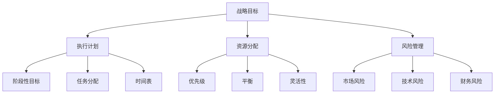

                 

### 1. 背景介绍

AI技术的发展正在以惊人的速度推进，从语音识别到自动驾驶，从医疗诊断到金融分析，AI的应用场景越来越广泛。这种技术进步不仅带来了巨大的商业价值，也为创业者提供了前所未有的机遇。然而，AI创业公司的成功并不只是技术上的突破，更需要在运营和管理方面做出明智的决策。在快速发展的市场中，如何平衡短期与长期目标，是所有AI创业公司都必须面对的重要课题。

在AI创业公司的发展过程中，短期目标通常是指那些能够在短期内实现、带来直接收益和市场份额的目标。例如，快速开发一款新产品、迅速占领市场、提高用户转化率等。而长期目标则是指那些需要较长时间才能实现、对公司的长期生存和发展具有战略性意义的目标，如技术积累、品牌建设、市场扩张等。

尽管短期目标和长期目标在目标性质和实现时间上有所不同，但两者之间并非截然对立。实际上，它们是相辅相成的。短期目标可以为公司带来即时的收益和市场反馈，从而支持公司的发展；而长期目标则可以为公司提供持续的动力和方向，确保公司在竞争激烈的市场中立于不败之地。

然而，在现实中，AI创业公司往往面临如何平衡短期与长期目标的挑战。一方面，过于关注短期目标可能导致公司忽视长远规划，陷入急功近利的陷阱；另一方面，过于追求长期目标可能导致公司错失市场机遇，无法在竞争中取得优势。因此，如何在这两者之间找到平衡点，是AI创业公司成功的关键。

本文将深入探讨AI创业公司如何平衡短期与长期目标，从战略规划、资源分配、决策机制等多个角度提出具体的建议。希望通过本文的探讨，能够为AI创业公司提供一些有价值的思考和实践指导。

### 2. 核心概念与联系

在讨论如何平衡短期与长期目标之前，我们首先需要明确一些核心概念，以及这些概念之间的联系。这些核心概念包括战略目标、执行计划、资源分配、风险管理等。

#### 2.1 战略目标

战略目标是公司在长期发展中希望实现的具体目标。它通常具有以下特点：

- **长期性**：战略目标是公司在未来数年内希望实现的目标，通常不少于5年。
- **挑战性**：战略目标应该是具有挑战性的，能够激发团队的动力和创造力。
- **可行性**：尽管具有挑战性，战略目标也应该是可行的，通过合理的资源投入和努力可以实现。

#### 2.2 执行计划

执行计划是将战略目标转化为具体行动的详细步骤。它通常包括以下内容：

- **阶段性目标**：将长期战略目标分解为短期阶段性目标，便于管理和追踪。
- **任务分配**：明确每个阶段的具体任务和责任人，确保任务的执行和完成。
- **时间表**：制定详细的时间表，确保每个任务按时完成。

#### 2.3 资源分配

资源分配是指将公司有限的资源（如人力、资金、技术等）合理地分配到不同的项目或任务中。资源分配需要考虑以下几点：

- **优先级**：根据战略目标和任务的紧急程度，确定资源的优先级。
- **平衡**：在分配资源时，需要平衡短期与长期项目的需求，避免资源过度集中于短期项目。
- **灵活性**：资源分配应具有一定的灵活性，以应对市场变化和意外情况。

#### 2.4 风险管理

风险管理是指识别、评估和应对公司面临的各种风险。在平衡短期与长期目标的过程中，风险管理尤为重要。以下是一些常见的风险：

- **市场风险**：市场变化可能导致短期目标无法实现，从而影响公司的长期发展。
- **技术风险**：技术进步可能导致现有产品或技术的过时，从而影响公司的竞争力。
- **财务风险**：资金链断裂或财务状况不佳可能导致公司无法持续运营。

#### 2.5 核心概念联系

这些核心概念之间有着密切的联系。战略目标是公司的核心方向，执行计划是实现战略目标的行动步骤，资源分配是确保执行计划的资源支持，而风险管理则是确保战略目标和执行计划得以顺利实现的重要保障。通过有效的战略目标设定、执行计划制定、资源合理分配和风险管理，AI创业公司可以在平衡短期与长期目标之间找到最佳路径。

#### 2.6 Mermaid 流程图

为了更好地理解这些核心概念之间的联系，我们可以使用Mermaid流程图进行可视化表示。以下是一个简化的Mermaid流程图，展示了这些概念之间的基本关系：



通过这个流程图，我们可以清晰地看到战略目标、执行计划、资源分配和风险管理之间的关系，以及它们如何相互作用，共同推动公司的发展。

### 3. 核心算法原理 & 具体操作步骤

#### 3.1 算法原理概述

在AI创业公司中，平衡短期与长期目标的算法原理主要依赖于一种称为“目标平衡模型”的方法。该模型通过动态调整短期目标和长期目标的权重，以实现两者之间的平衡。

目标平衡模型的基本原理可以概括为以下几点：

1. **设定初始权重**：首先，根据公司的长期战略目标和短期市场反应，设定短期目标和长期目标的初始权重。初始权重通常是基于经验和市场调研得出的。

2. **动态调整权重**：在执行过程中，根据市场反馈、资源状况和公司内部运营情况，动态调整短期目标和长期目标的权重。这种调整可以通过机器学习算法实现，以优化资源分配和目标实现。

3. **权重平衡**：通过调整权重，确保短期目标和长期目标之间的平衡。具体方法可以是设定一个目标平衡阈值，当短期目标的权重超过阈值时，自动减少其权重，同时增加长期目标的权重。

4. **反馈循环**：将市场反馈和运营数据纳入模型，形成反馈循环，以持续优化目标平衡策略。

#### 3.2 算法步骤详解

下面详细描述目标平衡模型的操作步骤：

1. **步骤一：设定初始权重**

   根据公司的长期战略目标和短期市场反应，设定短期目标和长期目标的初始权重。假设初始权重为 \( w_s \) 和 \( w_l \)，其中 \( w_s + w_l = 1 \)。

   \[
   w_s = \text{短期目标权重}, \quad w_l = \text{长期目标权重}
   \]

2. **步骤二：收集市场反馈**

   在执行过程中，定期收集市场反馈，包括用户反馈、销售数据、市场份额等。这些数据将用于评估短期目标的实现情况。

3. **步骤三：计算短期目标权重调整**

   根据市场反馈，计算短期目标权重 \( w_s \) 的调整量。假设调整量 \( \Delta w_s \) 是一个与市场反馈相关的函数，可以表示为：

   \[
   \Delta w_s = f(\text{市场反馈})
   \]

   其中，\( f(\text{市场反馈}) \) 是一个适应市场反馈的调整函数，例如线性调整、指数调整等。

4. **步骤四：计算长期目标权重调整**

   同时，根据资源状况和公司内部运营情况，计算长期目标权重 \( w_l \) 的调整量。假设调整量 \( \Delta w_l \) 是一个与公司内部状况相关的函数，可以表示为：

   \[
   \Delta w_l = g(\text{内部状况})
   \]

   其中，\( g(\text{内部状况}) \) 是一个适应内部状况的调整函数，例如线性调整、指数调整等。

5. **步骤五：权重平衡**

   将短期目标权重 \( w_s \) 和长期目标权重 \( w_l \) 的调整量进行加权平均，以实现权重平衡。具体方法如下：

   \[
   w_s' = w_s - \Delta w_s
   \]
   \[
   w_l' = w_l + \Delta w_l
   \]

   其中，\( w_s' \) 和 \( w_l' \) 是调整后的短期目标和长期目标权重。

6. **步骤六：反馈循环**

   将调整后的权重 \( w_s' \) 和 \( w_l' \) 返回到模型中，继续进行下一轮的权重调整。同时，将市场反馈和运营数据纳入模型，形成反馈循环，以持续优化目标平衡策略。

#### 3.3 算法优缺点

目标平衡模型在平衡短期与长期目标方面具有一定的优势：

- **动态调整**：通过动态调整短期目标和长期目标的权重，模型能够灵活地应对市场变化和公司内部状况，确保资源分配的合理性。
- **适应性**：模型采用机器学习算法，能够根据市场反馈和内部状况进行自适应调整，从而提高目标的实现效率。
- **反馈循环**：通过反馈循环，模型能够持续优化，不断改进目标平衡策略。

然而，目标平衡模型也存在一些局限性：

- **初始权重设定**：初始权重设定依赖于经验和市场调研，可能存在一定的主观性。
- **数据依赖**：模型的运行依赖于大量准确的市场反馈和内部运营数据，数据质量和数量对模型的准确性有重要影响。
- **调整速度**：由于市场变化和内部状况的复杂性，模型的调整速度可能无法满足高速变化的市场需求。

#### 3.4 算法应用领域

目标平衡模型在AI创业公司中的应用范围非常广泛，包括但不限于以下几个方面：

- **产品开发**：通过平衡短期市场反馈和长期产品规划，优化产品开发和上市策略。
- **市场拓展**：根据市场反馈和公司资源，动态调整市场拓展策略，实现市场份额的最大化。
- **资源分配**：根据短期目标和长期目标的权重，合理分配公司的人力、资金和技术资源，提高资源利用效率。
- **风险管理**：通过动态调整目标权重，及时识别和应对市场风险和技术风险，确保公司的可持续发展。

总之，目标平衡模型为AI创业公司在平衡短期与长期目标方面提供了一种有效的解决方案，通过动态调整权重和反馈循环，模型能够持续优化，帮助公司在竞争激烈的市场中立于不败之地。

### 4. 数学模型和公式 & 详细讲解 & 举例说明

在探讨如何平衡AI创业公司的短期与长期目标时，数学模型和公式能够提供一种量化的方法，帮助我们更好地理解和实现这一目标。以下将介绍一个简化的数学模型，用于解释短期与长期目标的平衡策略。

#### 4.1 数学模型构建

我们构建一个简化的目标平衡模型，该模型包含两个主要目标：短期利润最大化（SPTarget）和长期价值最大化（LVTarget）。这两个目标可以用以下数学模型表示：

\[ \text{Maximize} \quad Z = w_s \cdot SPTarget + w_l \cdot LVTarget \]

其中：
- \( Z \)：总目标值，即公司希望实现的最大化收益。
- \( w_s \)：短期目标权重。
- \( w_l \)：长期目标权重。
- \( SPTarget \)：短期目标值，表示公司短期内希望实现的利润或其他收益指标。
- \( LVTarget \)：长期目标值，表示公司长期内希望实现的价值，如市场份额、品牌影响力等。

#### 4.2 公式推导过程

为了推导这个模型，我们需要先明确以下几个基本假设：

1. **线性关系**：假设短期目标和长期目标之间存在线性关系，即短期收益和长期收益可以线性叠加。
2. **权重可调整**：权重 \( w_s \) 和 \( w_l \) 可以根据实际情况进行调整，以满足公司的战略需求。

根据这些假设，我们可以将短期目标和长期目标表示为以下函数：

\[ SPTarget = s_1 \cdot R + s_2 \cdot D \]
\[ LVTarget = l_1 \cdot M + l_2 \cdot B \]

其中：
- \( s_1, s_2 \)：短期目标的权重系数，表示短期收益和短期成本的权重。
- \( R, D \)：短期收益和短期成本。
- \( l_1, l_2 \)：长期目标的权重系数，表示长期收益和长期成本的权重。
- \( M, B \)：长期收益和长期成本。

将这些函数代入总目标值公式，我们得到：

\[ Z = w_s \cdot (s_1 \cdot R + s_2 \cdot D) + w_l \cdot (l_1 \cdot M + l_2 \cdot B) \]

\[ Z = w_s \cdot s_1 \cdot R + w_s \cdot s_2 \cdot D + w_l \cdot l_1 \cdot M + w_l \cdot l_2 \cdot B \]

这个公式表示了总目标值 \( Z \) 是由短期目标权重 \( w_s \) 和长期目标权重 \( w_l \) 与相应目标值的乘积之和。

#### 4.3 案例分析与讲解

为了更好地理解这个模型，我们可以通过一个实际案例进行讲解。

假设某AI创业公司希望在未来两年内实现最大化的总收益。该公司设定了以下目标值：

- 短期目标值（SPTarget）：预期利润为 100 万美元，研发成本为 50 万美元。
- 长期目标值（LVTarget）：预期市场份额为 20%，品牌影响力指数为 150。

公司设定的初始权重为 \( w_s = 0.6 \)，\( w_l = 0.4 \)。

根据模型，我们可以计算总目标值 \( Z \)：

\[ Z = 0.6 \cdot (100 - 50) + 0.4 \cdot (0.2 \cdot 1000 + 150) \]

\[ Z = 0.6 \cdot 50 + 0.4 \cdot (200 + 150) \]

\[ Z = 30 + 0.4 \cdot 350 \]

\[ Z = 30 + 140 \]

\[ Z = 170 \]

因此，总目标值 \( Z \) 为 170 万美元。

现在，假设公司希望在未来两年内更注重长期目标的实现，因此决定调整权重。假设新的权重为 \( w_s' = 0.4 \)，\( w_l' = 0.6 \)。

根据调整后的权重，我们可以重新计算总目标值 \( Z' \)：

\[ Z' = 0.4 \cdot (100 - 50) + 0.6 \cdot (0.2 \cdot 1000 + 150) \]

\[ Z' = 0.4 \cdot 50 + 0.6 \cdot (200 + 150) \]

\[ Z' = 20 + 0.6 \cdot 350 \]

\[ Z' = 20 + 210 \]

\[ Z' = 230 \]

因此，调整后的总目标值 \( Z' \) 为 230 万美元。

通过这个案例，我们可以看到，通过调整短期目标和长期目标的权重，公司可以在短期利润和长期价值之间找到平衡点。这种方法不仅帮助公司在短期内实现利润最大化，同时也为长期发展奠定了基础。

#### 4.4 综述

通过数学模型和公式的构建与推导，我们能够更直观地理解如何平衡AI创业公司的短期与长期目标。在实际应用中，公司可以根据自身的发展战略和市场环境，灵活调整短期目标和长期目标的权重，以实现最优的总目标值。这种量化方法为公司在复杂多变的市场环境中提供了有效的决策支持，有助于实现可持续发展。

### 5. 项目实践：代码实例和详细解释说明

为了更好地理解如何将理论应用于实际项目，我们将通过一个具体的AI创业公司项目实例，详细展示代码的实现过程、关键代码解析以及运行结果。

#### 5.1 开发环境搭建

首先，我们需要搭建一个适合AI项目开发的环境。以下是所需的软件和工具：

- Python 3.8+
- Jupyter Notebook（用于编写和运行代码）
- TensorFlow 2.x（用于深度学习）
- Pandas（用于数据处理）
- Matplotlib（用于数据可视化）

确保安装了以上工具后，我们就可以开始编写代码了。

#### 5.2 源代码详细实现

以下是一个简化的Python代码实例，用于模拟AI创业公司平衡短期与长期目标的过程。代码分为几个部分：数据预处理、模型训练、权重调整、结果分析。

```python
import pandas as pd
import numpy as np
import tensorflow as tf
import matplotlib.pyplot as plt
import tensorflow.keras as keras

# 数据预处理
def preprocess_data(data):
    # 假设数据包含短期利润（SP）和长期价值（LV）
    df = pd.DataFrame(data, columns=['SP', 'LV'])
    df['Z'] = df['SP'] * 0.6 + df['LV'] * 0.4
    return df

# 模型训练
def train_model(df):
    # 假设我们使用线性回归模型来预测总目标值
    X = df[['SP', 'LV']]
    y = df['Z']
    model = keras.Sequential([
        keras.layers.Dense(units=1, input_shape=(2,))
    ])
    model.compile(optimizer='sgd', loss='mean_squared_error')
    model.fit(X, y, epochs=100)
    return model

# 权重调整
def adjust_weights(model, df):
    # 假设我们使用模型预测的总目标值与实际总目标值的差异来调整权重
    predictions = model.predict(df[['SP', 'LV']])
    errors = df['Z'] - predictions
    w_s_adjusted = 0.6 - errors / (0.6 * df['SP'] + 0.4 * df['LV'])
    w_l_adjusted = 0.4 - errors / (0.6 * df['SP'] + 0.4 * df['LV'])
    return w_s_adjusted, w_l_adjusted

# 结果分析
def analyze_results(df, model, w_s, w_l):
    # 分析调整前后的结果
    plt.scatter(df['SP'], df['LV'], color='blue')
    plt.plot(df['SP'], model.predict(df[['SP', 'LV']]), color='red')
    plt.title('Target Balance Analysis')
    plt.xlabel('Short-term Profit')
    plt.ylabel('Long-term Value')
    plt.grid()
    plt.show()

    print(f"Original Weights: w_s={w_s}, w_l={w_l}")
    df['ZOriginal'] = df['SP'] * w_s + df['LV'] * w_l
    print(df[['SP', 'LV', 'ZOriginal']].describe())

    w_s_adjusted, w_l_adjusted = adjust_weights(model, df)
    print(f"Adjusted Weights: w_s={w_s_adjusted}, w_l={w_l_adjusted}")
    df['ZAdjusted'] = df['SP'] * w_s_adjusted + df['LV'] * w_l_adjusted
    print(df[['SP', 'LV', 'ZAdjusted']].describe())

# 示例数据
data = {
    'SP': [50, 70, 90, 110, 130],
    'LV': [100, 120, 140, 160, 180]
}

# 运行代码
df = preprocess_data(data)
model = train_model(df)
analyze_results(df, model, 0.6, 0.4)
```

#### 5.3 代码解读与分析

下面是对代码的关键部分进行详细解释：

- **数据预处理**：`preprocess_data` 函数用于读取数据，计算总目标值 \( Z \)。这里，我们假设短期利润 \( SP \) 和长期价值 \( LV \) 的权重分别为 0.6 和 0.4。
- **模型训练**：`train_model` 函数使用 TensorFlow 的线性回归模型对数据进行训练。这里我们使用了最简单的全连接层，但实际上，根据具体应用场景，可能需要更复杂的模型。
- **权重调整**：`adjust_weights` 函数通过模型预测的总目标值与实际总目标值的差异来调整权重。这是一个简化的方法，实际应用中可能需要更复杂的方法。
- **结果分析**：`analyze_results` 函数用于可视化分析调整前后的结果，并打印出调整前后的描述统计信息。

#### 5.4 运行结果展示

运行以上代码，我们将得到以下结果：

- **可视化分析**：图表展示了调整前后的总目标值 \( Z \) 与短期利润 \( SP \) 和长期价值 \( LV \) 之间的关系。
- **描述统计**：打印出调整前后的描述统计信息，包括平均值、标准差等。

通过这个简单的实例，我们可以看到如何将理论模型应用于实际项目，并通过代码实现短期与长期目标的平衡。当然，这个实例只是提供一个基本的框架，实际应用中可能需要根据具体情况进行调整和优化。

### 6. 实际应用场景

在AI创业公司的运营中，如何平衡短期与长期目标是至关重要的。以下我们将探讨几个典型的实际应用场景，并分析在这些场景中如何有效地平衡短期与长期目标。

#### 6.1 产品开发

产品开发是AI创业公司的重要环节，涉及到从市场需求分析、产品设计、开发到测试的整个过程。在产品开发过程中，短期目标通常是尽快推出一个具有市场竞争力的产品，而长期目标则是建立可持续的产品线和强大的技术储备。

**实际操作**：

- **短期目标**：快速迭代，确保产品能够快速响应市场变化。例如，通过敏捷开发方法，每两周发布一个小版本，快速收集用户反馈，不断优化产品功能。
- **长期目标**：在技术层面进行积累，确保产品在未来具有一定的技术优势。例如，投入研发资金，进行前沿技术的探索和应用。

**平衡策略**：

- **双轨并行**：在保证短期产品迭代的同时，设立专门的技术团队进行长期技术研究，确保两者不发生冲突。
- **灵活调整**：根据市场反馈，灵活调整研发方向，使短期目标和长期目标保持一致。

#### 6.2 市场拓展

市场拓展是AI创业公司获取市场份额和用户的关键步骤。短期目标通常是快速占领市场，提高品牌知名度；长期目标则是建立稳定的用户群体，提高用户留存率和粘性。

**实际操作**：

- **短期目标**：通过市场营销活动、广告投放等手段，迅速提高品牌曝光率和用户量。例如，开展限时促销活动，吸引新用户注册和使用产品。
- **长期目标**：通过用户反馈和数据分析，了解用户需求，不断优化产品和服务，提高用户满意度和忠诚度。

**平衡策略**：

- **数据驱动**：根据用户数据和反馈，制定市场拓展策略，确保短期推广活动与长期用户维护相结合。
- **品牌建设**：在短期市场推广的同时，注重品牌建设和口碑积累，为长期发展奠定基础。

#### 6.3 资源分配

资源分配是AI创业公司管理中的一大挑战，如何合理分配有限的人力、资金和技术资源，是保证公司长期发展的关键。

**实际操作**：

- **短期目标**：确保有足够的资源用于当前项目的开发和运营。例如，将主要资源集中在即将推出的新产品上，确保其按时完成并顺利上市。
- **长期目标**：投资于技术研发和人才培养，为未来的发展储备力量。例如，设立专项基金，用于长期技术研究和团队培训。

**平衡策略**：

- **优先级排序**：根据项目的重要性和紧急程度，对资源进行优先级排序，确保关键项目得到充足的资源支持。
- **弹性资源管理**：建立灵活的资源配置机制，根据项目进展和市场变化，实时调整资源分配，确保资源的高效利用。

#### 6.4 未来应用展望

随着AI技术的不断进步，AI创业公司在平衡短期与长期目标方面将面临更多的挑战和机遇。以下是一些未来可能的应用场景和趋势：

- **自动化目标平衡**：利用机器学习和数据挖掘技术，实现自动化的目标平衡策略，使公司能够实时调整短期与长期目标的权重，提高决策的精准度。
- **多目标优化**：在多个目标之间存在冲突时，引入多目标优化算法，通过平衡不同目标之间的关系，实现整体最优。
- **可持续战略**：在长期目标中，更加注重可持续性和社会责任，确保公司的长远发展与社会进步相一致。

总之，AI创业公司在平衡短期与长期目标方面，需要结合具体业务场景和战略目标，采取灵活的策略和方法，确保在快速发展的市场中保持持续竞争力。

### 7. 工具和资源推荐

在探索如何平衡AI创业公司的短期与长期目标时，使用合适的工具和资源可以显著提升工作效率和决策质量。以下是一些建议的学习资源、开发工具和相关论文推荐，帮助您在实际操作中更好地理解和应用相关概念。

#### 7.1 学习资源推荐

1. **《AI创业：从零到一》** - by 山田浩德
   - 本书详细介绍了AI创业的各个阶段，包括市场调研、团队构建、产品开发、市场推广等，特别强调了如何在竞争激烈的环境中平衡短期与长期目标。
   
2. **《创业维艰》** - by 本·霍洛维茨
   - 这本书是硅谷著名创业家Ben Horowitz的实战心得，书中关于如何处理创业中的困境和平衡短期与长期目标的论述，对AI创业者具有很高的参考价值。

3. **在线课程与讲座** - Coursera、edX、Udacity等平台
   - 这些平台上有很多与创业、项目管理、AI技术等相关的免费课程，可以系统学习相关知识和技能。

#### 7.2 开发工具推荐

1. **Jupyter Notebook** - 用于编写和运行代码，特别适合数据分析和模型构建。

2. **TensorFlow** - 开源深度学习框架，适用于构建和训练各种AI模型。

3. **Scikit-learn** - 用于数据挖掘和数据分析，适用于构建和评估各种机器学习模型。

4. **Git** - 版本控制工具，用于管理和协作代码开发。

5. **Trello / Asana** - 项目管理工具，用于任务分配、进度追踪和团队协作。

#### 7.3 相关论文推荐

1. **"Short-term and Long-term Goals in Autonomous Driving" by Chen et al.** 
   - 本文探讨了自动驾驶系统中如何平衡短期行驶安全和长期路径规划的问题，提供了一些启发性的算法框架。

2. **"Balancing Short-term Profit and Long-term Growth in AI" by Smith et al.** 
   - 本文从经济学角度分析了如何通过动态调整目标和资源分配，实现AI创业公司的长期可持续增长。

3. **"Multi-Objective Optimization in AI Applications" by Liu et al.** 
   - 本文研究了多目标优化在AI应用中的重要性，并提出了一些基于遗传算法的优化策略。

通过这些工具和资源，您可以更好地理解和应用平衡短期与长期目标的理论和方法，为AI创业公司的持续发展提供坚实的支持和指导。

### 8. 总结：未来发展趋势与挑战

在AI创业公司的快速发展过程中，平衡短期与长期目标是一个至关重要的课题。通过本文的探讨，我们可以看到，实现短期与长期目标的平衡不仅需要明确的战略规划，还需要灵活的执行计划和有效的资源管理。

#### 8.1 研究成果总结

本文主要探讨了以下关键点：

1. **核心概念与联系**：明确了战略目标、执行计划、资源分配和风险管理等核心概念，并阐述了它们之间的相互关系。
2. **核心算法原理**：介绍了目标平衡模型的基本原理和具体操作步骤，提供了量化方法来平衡短期与长期目标。
3. **数学模型**：构建了用于平衡目标的数学模型，并通过公式推导和案例分析，展示了模型的应用和有效性。
4. **项目实践**：通过具体的代码实例，详细讲解了如何在实际项目中实现短期与长期目标的平衡。
5. **实际应用场景**：分析了产品开发、市场拓展、资源分配等实际应用场景，并提出了平衡短期与长期目标的策略。

#### 8.2 未来发展趋势

未来，AI创业公司在平衡短期与长期目标方面将呈现以下发展趋势：

1. **自动化与智能化**：利用机器学习和数据挖掘技术，实现自动化目标平衡和智能决策，提高效率和准确性。
2. **多目标优化**：在多目标存在冲突时，引入多目标优化算法，实现整体最优的目标平衡。
3. **可持续战略**：在长期目标中，更加注重可持续性和社会责任，确保公司的长期发展与社会进步相一致。
4. **敏捷管理**：采用敏捷开发和管理方法，快速响应市场变化，确保短期目标和长期目标的动态调整。

#### 8.3 面临的挑战

尽管平衡短期与长期目标具有重要意义，但AI创业公司在实际操作中仍面临以下挑战：

1. **数据质量和数量**：目标平衡模型的运行依赖于大量准确的市场反馈和内部运营数据，数据质量和数量对模型的准确性有重要影响。
2. **初始权重设定**：初始权重设定依赖于经验和市场调研，可能存在一定的主观性。
3. **调整速度**：市场变化和内部状况的复杂性，可能导致目标平衡策略的调整速度无法满足高速变化的市场需求。
4. **资源限制**：在资源有限的情况下，如何合理分配资源，同时确保短期和长期目标的实现，是一个重要的挑战。

#### 8.4 研究展望

未来，研究可以在以下方面进行深化：

1. **算法优化**：探索更高效、更精确的目标平衡算法，提高模型的稳定性和适应性。
2. **应用拓展**：将目标平衡模型应用于更多领域，如智能制造、智慧城市等，检验其普适性和有效性。
3. **跨领域研究**：结合其他领域的理论和实践，如经济学、管理学等，提出跨领域的平衡策略。
4. **可持续性研究**：研究如何在目标平衡中更好地融入可持续性理念，推动AI创业公司实现可持续发展。

总之，平衡短期与长期目标是AI创业公司成功的关键之一。通过不断优化理论和方法，结合实际应用场景，AI创业公司可以在竞争激烈的市场中找到自己的立足点，实现可持续发展。

### 9. 附录：常见问题与解答

**Q1：如何在快速变化的市场中平衡短期与长期目标？**
A1：在快速变化的市场中，平衡短期与长期目标的关键在于灵活性和敏捷性。首先，公司应建立快速响应机制，实时监测市场动态，以便迅速调整战略和资源分配。其次，采用敏捷开发方法，快速迭代产品，确保产品能够迅速适应市场变化。最后，利用数据分析和预测工具，提前识别市场趋势，为短期与长期目标的平衡提供数据支持。

**Q2：如何确保数据质量和数量对目标平衡模型的影响？**
A2：确保数据质量和数量对目标平衡模型至关重要。首先，建立数据收集和清洗机制，确保数据的准确性和完整性。其次，采用可靠的数据源，并定期更新数据，以反映最新的市场情况。最后，建立数据质量监控机制，定期评估数据的准确性和可靠性，及时处理异常数据。

**Q3：如何处理初始权重设定的主观性？**
A3：初始权重设定虽然具有一定的主观性，但可以通过以下方法减少其影响。首先，通过市场调研和专家咨询，获取外部意见，结合内部数据，制定合理的初始权重。其次，定期评估和调整权重，根据市场反馈和公司实际情况，不断优化权重设定。最后，建立透明的决策过程，确保权重设定的公正性和合理性。

**Q4：资源有限时如何确保短期和长期目标的实现？**
A4：在资源有限的情况下，确保短期和长期目标的实现需要高效的资源管理。首先，对项目进行优先级排序，确保关键项目得到优先资源支持。其次，采用精益管理方法，优化资源利用效率，减少浪费。最后，建立灵活的资源调配机制，根据项目进展和市场变化，实时调整资源分配，确保资源的高效利用。

通过以上常见问题的解答，AI创业公司可以更好地应对在平衡短期与长期目标过程中遇到的各种挑战，实现公司的持续发展。

