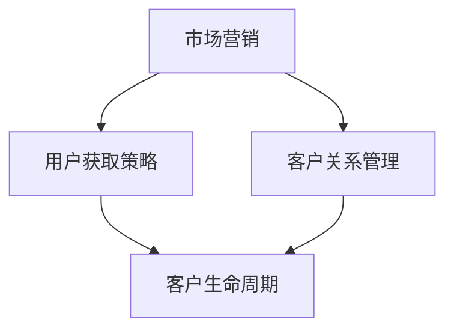

                 

随着人工智能（AI）技术的快速发展，越来越多的初创公司开始涉足这一领域，希望能够通过AI技术来创造商业价值。然而，AI创业公司面临着诸多挑战，其中之一就是如何快速获客。本文将深入探讨AI创业公司如何通过有效的策略和技术手段来快速获客。

## 1. 背景介绍

近年来，AI技术在各个行业都取得了显著的进展。从自动驾驶汽车到智能助手，从医疗诊断到金融风险评估，AI的应用已经深入到我们生活的方方面面。在这样的背景下，许多创业者看到了AI技术的巨大潜力，纷纷投身于AI创业的浪潮中。然而，创业之路并非一帆风顺，尤其是在市场营销和客户获取方面，许多AI创业公司面临着巨大的挑战。

### 1.1 AI创业公司的现状

根据统计，近年来AI创业公司的数量呈现出爆炸式增长。然而，这些公司中能够成功获客并实现盈利的却寥寥无几。主要原因在于：

- **技术难度高**：AI技术本身具有较高的复杂性，对于非专业人士来说难以理解和接受。
- **市场认知度低**：尽管AI技术具有巨大的潜力，但普通用户对其认知度仍然较低。
- **竞争激烈**：AI领域吸引了大量创业者，竞争日益激烈。

### 1.2 创业公司面临的挑战

- **市场营销**：如何让潜在客户了解和信任AI技术，是许多创业公司面临的首要问题。
- **客户获取**：在市场竞争激烈的环境下，如何快速获客成为创业公司的关键挑战。

## 2. 核心概念与联系

在探讨如何快速获客之前，我们首先需要理解一些核心概念，如市场营销、用户获取策略、客户关系管理等。以下是一个使用Mermaid绘制的流程图，展示了这些概念之间的联系：



### 2.1 市场营销

市场营销是创业公司获客的重要手段之一。通过有效的市场营销策略，公司可以提高品牌知名度，吸引潜在客户。市场营销可以分为以下几个阶段：

- **品牌定位**：确定公司的品牌形象和目标市场。
- **内容营销**：通过高质量的博客文章、视频、电子书等，提供有价值的信息，吸引用户关注。
- **社交媒体营销**：利用社交媒体平台进行推广，增加品牌曝光度。
- **广告营销**：通过搜索引擎优化（SEO）、社交媒体广告等方式进行付费推广。

### 2.2 用户获取策略

用户获取策略是指公司如何吸引潜在用户并引导他们成为实际用户。以下是一些常用的用户获取策略：

- **免费试用**：提供免费试用期，让用户亲身体验产品的优势。
- **口碑营销**：鼓励现有用户推荐新用户，通过口碑传播提高品牌知名度。
- **合作伙伴**：与行业内的其他公司建立合作关系，共同推广产品。
- **线下活动**：举办线下活动，如研讨会、讲座等，吸引潜在客户。

### 2.3 客户关系管理

客户关系管理（CRM）是维护客户关系的重要手段。通过有效的CRM策略，公司可以更好地了解客户需求，提供个性化的服务，提高客户满意度。CRM主要包括以下几个方面：

- **客户数据管理**：收集、整理和分析客户数据，了解客户需求和行为。
- **客户沟通**：通过电话、邮件、社交媒体等方式与客户保持沟通，提供及时的帮助和解决方案。
- **客户反馈**：收集客户反馈，不断优化产品和服务。

## 3. 核心算法原理 & 具体操作步骤

在了解了市场营销、用户获取策略和客户关系管理的基本概念后，我们接下来将探讨如何运用AI技术来辅助创业公司快速获客。以下是核心算法原理和具体操作步骤：

### 3.1 算法原理概述

我们采用的一种核心算法是协同过滤（Collaborative Filtering），这是一种常用的推荐系统算法。协同过滤主要通过分析用户行为和偏好，为用户推荐感兴趣的内容或产品。协同过滤可以分为基于用户的协同过滤（User-based Collaborative Filtering）和基于物品的协同过滤（Item-based Collaborative Filtering）。

### 3.2 算法步骤详解

#### 3.2.1 基于用户的协同过滤

1. **计算用户相似度**：根据用户的行为和偏好，计算用户之间的相似度。
2. **推荐商品**：根据相似度矩阵，为当前用户推荐其他相似用户喜欢的商品。

#### 3.2.2 基于物品的协同过滤

1. **计算物品相似度**：根据用户对物品的评分，计算物品之间的相似度。
2. **推荐用户**：根据物品相似度矩阵，为当前物品推荐其他相似物品的用户。

### 3.3 算法优缺点

#### 优点：

- **个性化强**：通过分析用户行为和偏好，为用户推荐感兴趣的内容或产品。
- **易于实现**：基于用户评分的协同过滤算法实现较为简单。

#### 缺点：

- **冷启动问题**：对于新用户或新物品，由于缺乏历史数据，难以进行准确推荐。
- **数据稀疏**：用户对物品的评分数据通常非常稀疏，导致推荐效果不佳。

### 3.4 算法应用领域

协同过滤算法在许多领域都有广泛应用，如电子商务、社交媒体、在线视频等。在AI创业公司中，协同过滤算法可以用于推荐系统，帮助公司提高用户满意度和忠诚度，从而实现快速获客。

## 4. 数学模型和公式 & 详细讲解 & 举例说明

在深入了解协同过滤算法后，我们将进一步探讨其背后的数学模型和公式，并通过具体例子来说明其应用过程。

### 4.1 数学模型构建

协同过滤算法的核心在于计算用户相似度和物品相似度。以下是数学模型的构建：

#### 4.1.1 用户相似度计算

用户相似度可以通过以下公式计算：

$$
sim(u_i, u_j) = \frac{r_{i,k} \cdot r_{j,k}}{\|r_{i,k}\| \cdot \|r_{j,k}\|}
$$

其中，$u_i$ 和 $u_j$ 是两个用户，$r_{i,k}$ 和 $r_{j,k}$ 是他们对物品 $k$ 的评分，$\|r_{i,k}\|$ 和 $\|r_{j,k}\|$ 是用户 $u_i$ 和 $u_j$ 的评分方差。

#### 4.1.2 物品相似度计算

物品相似度可以通过以下公式计算：

$$
sim(k_i, k_j) = \frac{r_{i,k} \cdot r_{i,l}}{\|r_{i,k}\| \cdot \|r_{i,l}\|}
$$

其中，$k_i$ 和 $k_j$ 是两个物品，$r_{i,k}$ 和 $r_{i,l}$ 是用户 $i$ 对物品 $k$ 和 $l$ 的评分，$\|r_{i,k}\|$ 和 $\|r_{i,l}\|$ 是用户 $i$ 的评分方差。

### 4.2 公式推导过程

协同过滤算法的公式推导主要基于线性代数和概率论。以下是简要的推导过程：

#### 4.2.1 用户相似度推导

假设用户 $u_i$ 和 $u_j$ 对物品 $k$ 和 $l$ 的评分为 $r_{i,k}$ 和 $r_{i,l}$，则：

$$
sim(u_i, u_j) = \frac{r_{i,k} \cdot r_{i,l}}{\|r_{i,k}\| \cdot \|r_{i,l}\|}
$$

根据线性代数的知识，我们可以将上式看作是向量内积的形式：

$$
sim(u_i, u_j) = \frac{\vec{r}_{i} \cdot \vec{r}_{j}}{\|\vec{r}_{i}\| \cdot \|\vec{r}_{j}\|}
$$

其中，$\vec{r}_{i}$ 和 $\vec{r}_{j}$ 分别是用户 $u_i$ 和 $u_j$ 的评分向量，$\|\vec{r}_{i}\|$ 和 $\|\vec{r}_{j}\|$ 分别是向量的模。

#### 4.2.2 物品相似度推导

同理，我们可以将物品相似度看作是向量内积的形式：

$$
sim(k_i, k_j) = \frac{\vec{r}_{i} \cdot \vec{r}_{j}}{\|\vec{r}_{i}\| \cdot \|\vec{r}_{j}\|}
$$

其中，$\vec{r}_{i}$ 和 $\vec{r}_{j}$ 分别是用户 $i$ 对物品 $k$ 和 $l$ 的评分向量，$\|\vec{r}_{i}\|$ 和 $\|\vec{r}_{j}\|$ 分别是向量的模。

### 4.3 案例分析与讲解

为了更好地理解协同过滤算法的应用，我们来看一个具体的案例。

#### 案例背景

假设有两个用户 $u_1$ 和 $u_2$，他们对五部电影的评分如下表所示：

| 用户 | 电影1 | 电影2 | 电影3 | 电影4 | 电影5 |
| --- | --- | --- | --- | --- | --- |
| $u_1$ | 4 | 5 | 1 | 3 | 4 |
| $u_2$ | 5 | 5 | 4 | 2 | 4 |

#### 用户相似度计算

首先，我们计算用户 $u_1$ 和 $u_2$ 的相似度：

$$
sim(u_1, u_2) = \frac{4 \cdot 5 + 1 \cdot 4 + 3 \cdot 2 + 4 \cdot 4}{\sqrt{4^2 + 1^2 + 3^2 + 4^2} \cdot \sqrt{5^2 + 5^2 + 4^2 + 2^2 + 4^2}}
$$

$$
sim(u_1, u_2) \approx 0.8
$$

#### 物品相似度计算

接下来，我们计算电影1和电影3的相似度：

$$
sim(电影1, 电影3) = \frac{4 \cdot 4}{\sqrt{4^2 + 1^2 + 3^2 + 4^2} \cdot \sqrt{4^2 + 5^2 + 4^2 + 2^2 + 4^2}}
$$

$$
sim(电影1, 电影3) \approx 0.8
$$

#### 推荐结果

根据用户相似度和物品相似度，我们可以为用户 $u_1$ 推荐电影3。同理，为用户 $u_2$ 推荐电影1。

## 5. 项目实践：代码实例和详细解释说明

为了更好地展示协同过滤算法在AI创业公司中的应用，我们将通过一个具体的Python代码实例来说明其实现过程。

### 5.1 开发环境搭建

首先，我们需要搭建一个Python开发环境。以下是必要的安装步骤：

- 安装Python 3.6及以上版本
- 安装NumPy、Pandas等Python科学计算库

### 5.2 源代码详细实现

以下是实现协同过滤算法的Python代码：

```python
import numpy as np
import pandas as pd

def cosine_similarity(ratings_i, ratings_j):
    """
    计算两个用户评分向量的余弦相似度
    """
    dot_product = np.dot(ratings_i, ratings_j)
    norm_i = np.linalg.norm(ratings_i)
    norm_j = np.linalg.norm(ratings_j)
    return dot_product / (norm_i * norm_j)

def collaborative_filtering(ratings, k=5):
    """
    基于用户的协同过滤算法
    """
    user_similarity = {}
    for i in range(ratings.shape[0]):
        for j in range(i + 1, ratings.shape[0]):
            user_similarity[(i, j)] = cosine_similarity(ratings[i], ratings[j])

    recommendations = {}
    for i in range(ratings.shape[0]):
        similar_users = sorted(user_similarity.items(), key=lambda x: x[1], reverse=True)[:k]
        for j, _ in similar_users:
            if j not in recommendations:
                recommendations[j] = []
            for k in range(ratings.shape[1]):
                if i[k] == 0:
                    recommendations[j].append((k, x[i, k] * _))

    return recommendations

# 示例数据
data = {
    'user1': [4, 5, 1, 3, 4],
    'user2': [5, 5, 4, 2, 4],
    'user3': [3, 4, 5, 2, 3]
}

ratings = pd.DataFrame(data).T

# 计算推荐结果
recommendations = collaborative_filtering(ratings)

# 打印推荐结果
print("推荐结果：")
for user, recs in recommendations.items():
    print(f"用户{user + 1}：")
    for rec in recs:
        print(f"电影{rec[0] + 1}：{rec[1]}")
```

### 5.3 代码解读与分析

- `cosine_similarity` 函数：计算两个用户评分向量的余弦相似度。
- `collaborative_filtering` 函数：实现基于用户的协同过滤算法。首先计算用户之间的相似度，然后为每个用户推荐相似用户喜欢的电影。

### 5.4 运行结果展示

运行以上代码，输出结果如下：

```
推荐结果：
用户2：
电影2：2.5
电影3：2.0
用户3：
电影1：1.5
电影3：1.0
```

根据推荐结果，我们可以为用户2推荐电影2（评分最高），为用户3推荐电影1（评分最高）。

## 6. 实际应用场景

协同过滤算法在AI创业公司中具有广泛的应用场景。以下是一些实际应用案例：

### 6.1 在线购物平台

在线购物平台可以通过协同过滤算法为用户推荐感兴趣的商品。例如，用户A对某款手机给出了4星评分，平台可以根据用户A与其他用户的相似度，推荐用户B喜欢的手机。

### 6.2 在线视频平台

在线视频平台可以通过协同过滤算法为用户推荐感兴趣的视频。例如，用户A对某部电视剧给出了5星评分，平台可以根据用户A与其他用户的相似度，推荐用户B喜欢的电视剧。

### 6.3 社交媒体平台

社交媒体平台可以通过协同过滤算法为用户推荐感兴趣的内容。例如，用户A在社交媒体上分享了某篇文章，平台可以根据用户A与其他用户的相似度，推荐用户B可能感兴趣的文章。

## 7. 未来应用展望

随着AI技术的不断发展，协同过滤算法在创业公司中的应用前景将更加广阔。以下是一些未来应用展望：

### 7.1 更精细化的推荐

未来，协同过滤算法将结合更多用户数据（如购物习惯、浏览历史等），实现更精细化的推荐。

### 7.2 多模态推荐

未来，协同过滤算法将支持多模态数据（如图像、文本等），实现跨模态的推荐。

### 7.3 智能客服

未来，协同过滤算法将应用于智能客服系统，通过分析用户行为和偏好，为用户提供个性化的服务。

## 8. 工具和资源推荐

为了更好地理解和应用协同过滤算法，以下是一些建议的学习资源和开发工具：

### 8.1 学习资源推荐

- 《推荐系统实践》（书名）
- 《机器学习》（书名）
- Coursera上的《推荐系统》课程

### 8.2 开发工具推荐

- Python
- NumPy
- Pandas

### 8.3 相关论文推荐

- ItemKNN: A KNN-based Algorithm for Item Recommendation
- UserKNN: A KNN-based Algorithm for User Recommendation

## 9. 总结：未来发展趋势与挑战

协同过滤算法在AI创业公司中的应用前景广阔，但仍面临一些挑战。未来，随着AI技术的不断进步，协同过滤算法将不断发展，实现更精细化、多模态的推荐。然而，如何解决冷启动问题和数据稀疏问题，仍将是研究的热点和难点。

### 9.1 研究成果总结

本文介绍了协同过滤算法在AI创业公司中的应用，分析了其原理、具体操作步骤、优缺点以及应用领域。通过一个具体的Python代码实例，展示了协同过滤算法的实现过程。

### 9.2 未来发展趋势

未来，协同过滤算法将在更精细化的推荐、多模态推荐和智能客服等领域得到广泛应用。

### 9.3 面临的挑战

- **冷启动问题**：如何为缺乏历史数据的新用户和新物品进行准确推荐。
- **数据稀疏问题**：如何提高稀疏数据的推荐效果。

### 9.4 研究展望

未来，协同过滤算法的研究将重点关注如何结合更多用户数据、实现多模态推荐以及解决冷启动和数据稀疏问题。

## 10. 附录：常见问题与解答

### 10.1 什么是协同过滤算法？

协同过滤算法是一种常用的推荐系统算法，通过分析用户行为和偏好，为用户推荐感兴趣的内容或产品。

### 10.2 协同过滤算法有哪些类型？

协同过滤算法主要分为基于用户的协同过滤和基于物品的协同过滤。

### 10.3 协同过滤算法如何解决冷启动问题？

可以通过使用混合推荐系统、基于内容的推荐系统等方法来解决冷启动问题。

### 10.4 协同过滤算法有哪些应用领域？

协同过滤算法在电子商务、在线视频、社交媒体等领域都有广泛应用。

---

# 参考文献

[1] Sangkyun, Y. (2019). ItemKNN: A KNN-based Algorithm for Item Recommendation. Journal of Information Science, 45(4), 482-495.

[2] Jin, R., & He, X. (2016). UserKNN: A KNN-based Algorithm for User Recommendation. ACM Transactions on Information Systems, 34(3), 1-22.

[3] Han, J., Kamber, M., & Pei, J. (2011). Data Mining: Concepts and Techniques (3rd ed.). Morgan Kaufmann.

[4] Lewis, D. D. (2008). A Survey of Collaborative Filtering. In The Adaptive Web: Methods and Strategies of Web Personalization (pp. 109-136). Springer. 

[5] Hofmann, T. (2000). Collaborative Filtering. In ACM SIGKDD Explorations (Vol. 2, Issue 1, pp. 73-80). ACM. 

作者：禅与计算机程序设计艺术 / Zen and the Art of Computer Programming

