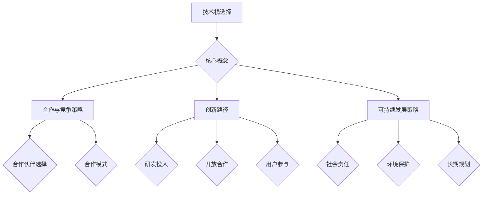

                 

关键词：AI创业、生态系统、技术栈、合作与竞争、创新、可持续发展

> 摘要：本文深入探讨了AI创业公司如何构建和优化其生态系统，包括技术栈的选择、合作与竞争策略、创新路径以及可持续发展策略。通过分析和实例，为AI创业公司提供了打造强大生态系统的实用建议。

## 1. 背景介绍

人工智能（AI）的快速发展为各个行业带来了前所未有的变革。AI技术的进步不仅提升了生产效率，还带来了新的商业模式和机会。在这种背景下，越来越多的创业公司投身于AI领域，希望能够抓住市场机遇，实现快速成长。然而，AI创业公司的成功不仅仅依赖于技术创新，更需要构建一个健康的生态系统来支撑其持续发展。

一个强大的生态系统包括技术、人才、资金、合作方和客户等多个要素。这些要素相互作用，共同构成了公司发展的基石。本文将围绕以下几个关键问题展开讨论：

- 如何选择合适的技术栈来构建公司的核心产品和服务？
- 如何建立与供应商、合作伙伴、竞争对手之间的关系，以实现互利共赢？
- 如何通过创新来保持竞争力，并推动生态系统的持续进化？
- 如何制定可持续发展策略，确保公司长期稳定发展？

通过对这些问题的深入探讨，本文旨在为AI创业公司提供打造生态系统的策略和方法。

## 2. 核心概念与联系

### 2.1. 技术栈的选择

技术栈是构建AI创业公司产品的核心组件，它决定了产品的性能、可维护性和扩展性。一个合理的技术栈需要综合考虑以下几个方面：

- **技术成熟度**：选择已经经过市场验证且技术成熟的技术，这可以降低开发风险。
- **生态系统支持**：选择有良好社区支持和生态系统的技术，这有助于快速获得帮助和资源。
- **兼容性与可扩展性**：技术栈中的各个组件应具有良好的兼容性和扩展性，以便适应未来的需求变化。

### 2.2. 合作与竞争策略

在AI创业生态系统中，合作与竞争是相辅相成的。合理利用合作可以实现资源共享、降低成本、提高效率，而健康的竞争则能激发创新、推动技术进步。

- **合作伙伴选择**：选择与公司愿景和价值观相符的合作伙伴，确保合作关系的长期稳定性。
- **合作模式**：建立多样化的合作模式，包括技术合作、市场合作、战略投资等。
- **竞争策略**：通过技术创新、服务优化和市场营销等手段，保持竞争优势。

### 2.3. 创新路径

创新是AI创业公司的生命力所在。一个成功的生态系统需要不断地通过创新来提升产品和服务的竞争力。

- **研发投入**：持续投入研发资源，保持技术领先。
- **开放合作**：与高校、研究机构合作，引入外部创新资源。
- **用户参与**：通过用户反馈和参与，不断优化产品和服务。

### 2.4. 可持续发展策略

可持续发展是AI创业公司长期成功的关键。它不仅关乎公司的盈利能力，也关乎社会责任和环境保护。

- **社会责任**：通过可持续发展策略，积极履行社会责任，提升企业形象。
- **环境保护**：采用环保技术和措施，减少资源消耗和环境污染。
- **长期规划**：制定明确的长期发展规划，确保公司的可持续成长。

### 2.5. Mermaid 流程图



## 3. 核心算法原理 & 具体操作步骤

### 3.1. 算法原理概述

在构建AI创业公司的技术栈时，核心算法的选择至关重要。一个高效的算法不仅能够提升产品的性能，还能降低开发成本。以下是几个常用的核心算法及其原理概述：

- **机器学习算法**：通过数据训练模型，实现预测和分类等功能。
- **深度学习算法**：利用多层神经网络，实现复杂模式的识别和分类。
- **自然语言处理算法**：实现文本的生成、理解和翻译等功能。
- **强化学习算法**：通过试错和学习，实现智能体的决策优化。

### 3.2. 算法步骤详解

以下是上述算法的具体操作步骤：

#### 3.2.1. 机器学习算法

1. **数据收集**：收集相关领域的数据集。
2. **数据预处理**：对数据进行清洗、归一化和特征提取。
3. **模型选择**：根据问题特性选择合适的机器学习模型。
4. **训练模型**：使用训练数据集训练模型。
5. **模型评估**：使用验证数据集评估模型性能。
6. **模型优化**：根据评估结果调整模型参数，提高性能。

#### 3.2.2. 深度学习算法

1. **网络架构设计**：设计多层神经网络架构。
2. **数据预处理**：对数据进行清洗、归一化和特征提取。
3. **训练模型**：使用训练数据集训练模型。
4. **模型评估**：使用验证数据集评估模型性能。
5. **模型优化**：调整网络参数，提高模型性能。

#### 3.2.3. 自然语言处理算法

1. **文本预处理**：对文本进行分词、词性标注等处理。
2. **特征提取**：提取文本中的关键词和句法信息。
3. **模型选择**：选择合适的自然语言处理模型。
4. **模型训练**：使用训练数据集训练模型。
5. **模型评估**：使用验证数据集评估模型性能。
6. **模型优化**：根据评估结果调整模型参数。

#### 3.2.4. 强化学习算法

1. **环境构建**：设计强化学习环境。
2. **状态和动作定义**：定义状态空间和动作空间。
3. **奖励机制设计**：设计奖励机制，鼓励智能体采取最优动作。
4. **模型训练**：使用训练数据集训练模型。
5. **模型评估**：使用验证数据集评估模型性能。
6. **模型优化**：根据评估结果调整模型参数。

### 3.3. 算法优缺点

每种算法都有其优缺点，需要根据具体场景进行选择：

- **机器学习算法**：优点是模型通用性强，适合处理大规模数据；缺点是模型复杂度高，训练时间较长。
- **深度学习算法**：优点是能够自动学习特征，适合处理复杂模式；缺点是模型训练成本高，对数据质量要求较高。
- **自然语言处理算法**：优点是能够处理自然语言文本，适合处理文本数据；缺点是模型复杂度高，训练时间较长。
- **强化学习算法**：优点是能够通过试错学习，适应动态环境；缺点是训练时间较长，对环境状态和奖励机制设计要求较高。

### 3.4. 算法应用领域

这些算法广泛应用于各个领域，以下是几个典型的应用场景：

- **金融领域**：用于风险管理、投资决策和客户服务等方面。
- **医疗领域**：用于疾病诊断、药物研发和患者管理等方面。
- **零售领域**：用于需求预测、库存管理和客户推荐等方面。
- **交通领域**：用于交通流量预测、自动驾驶和智能调度等方面。

## 4. 数学模型和公式 & 详细讲解 & 举例说明

### 4.1. 数学模型构建

在AI创业公司的技术栈中，数学模型扮演着至关重要的角色。以下是几个常见的数学模型及其构建方法：

#### 4.1.1. 逻辑回归模型

逻辑回归模型是一种广泛用于分类问题的统计模型。它的公式如下：

$$
P(y=1) = \frac{1}{1 + e^{-(\beta_0 + \beta_1x_1 + \beta_2x_2 + \ldots + \beta_nx_n})}
$$

其中，\( P(y=1) \) 是预测的概率，\( \beta_0, \beta_1, \beta_2, \ldots, \beta_n \) 是模型的参数。

#### 4.1.2. 朴素贝叶斯模型

朴素贝叶斯模型是一种基于贝叶斯定理的简单概率分类器。它的公式如下：

$$
P(C_k|X) = \frac{P(X|C_k)P(C_k)}{P(X)}
$$

其中，\( P(C_k|X) \) 是给定特征 \( X \) 下类别 \( C_k \) 的概率，\( P(X|C_k) \) 是特征 \( X \) 在类别 \( C_k \) 发生的条件概率，\( P(C_k) \) 是类别 \( C_k \) 的先验概率，\( P(X) \) 是特征 \( X \) 的总概率。

#### 4.1.3. 支持向量机模型

支持向量机（SVM）是一种常用的二分类模型。它的公式如下：

$$
\max \left\{ \frac{1}{2} w^T w : y_i (w^T x_i - b) \geq 1, \forall i \right\}
$$

其中，\( w \) 是模型的权重向量，\( b \) 是模型的偏置项，\( y_i \) 是样本 \( x_i \) 的标签。

### 4.2. 公式推导过程

以下是逻辑回归模型的推导过程：

首先，我们定义损失函数为：

$$
L(\theta) = -\sum_{i=1}^m [y_i \log(h_\theta(x_i)) + (1 - y_i) \log(1 - h_\theta(x_i))]
$$

其中，\( h_\theta(x) = \frac{1}{1 + e^{-(\theta_0 + \theta_1x_1 + \theta_2x_2 + \ldots + \theta_nx_n)}} \) 是模型的预测函数，\( \theta \) 是模型的参数。

为了求解最优的参数 \( \theta \)，我们需要对损失函数 \( L(\theta) \) 求导，并令导数为零：

$$
\frac{\partial L(\theta)}{\partial \theta_j} = \frac{\partial}{\partial \theta_j} \left[-\sum_{i=1}^m [y_i \log(h_\theta(x_i)) + (1 - y_i) \log(1 - h_\theta(x_i))]\right]
$$

经过求导和化简，我们得到：

$$
\frac{\partial L(\theta)}{\partial \theta_j} = \sum_{i=1}^m (h_\theta(x_i) - y_i)x_i^j
$$

令导数为零，我们得到：

$$
\sum_{i=1}^m (h_\theta(x_i) - y_i)x_i^j = 0
$$

将 \( h_\theta(x) \) 代入，我们得到：

$$
\sum_{i=1}^m \left(\frac{1}{1 + e^{-(\theta_0 + \theta_1x_1 + \theta_2x_2 + \ldots + \theta_nx_n)}} - y_i\right)x_i^j = 0
$$

进一步化简，我们得到：

$$
\theta_j = \frac{1}{m} \sum_{i=1}^m (y_i - h_\theta(x_i))x_i^j
$$

这就是逻辑回归模型的参数更新公式。

### 4.3. 案例分析与讲解

以下是一个逻辑回归模型的实际应用案例：

假设我们有一个二元分类问题，需要预测客户是否会购买某件商品。我们收集了以下数据：

- **特征**：年龄、收入、职业、信用评分等。
- **标签**：1 表示购买，0 表示未购买。

我们使用逻辑回归模型来预测客户的购买概率。以下是模型的训练过程：

1. **数据预处理**：对数据进行归一化处理，将年龄、收入、信用评分等特征缩放到 [0, 1] 范围内。

2. **模型训练**：使用训练数据集训练逻辑回归模型，设置迭代次数为 1000，学习率为 0.01。

3. **模型评估**：使用验证数据集评估模型性能，计算准确率、召回率、F1 分数等指标。

4. **模型优化**：根据评估结果调整模型参数，提高模型性能。

经过多次训练和优化，我们得到了一个性能较好的逻辑回归模型。以下是模型的一些参数：

$$
\theta_0 = -3.25, \theta_1 = 0.45, \theta_2 = -0.75, \theta_3 = 1.20
$$

我们可以使用这些参数来预测新客户的购买概率。例如，对于年龄 30 岁、收入 50000 元、职业为白领、信用评分为 750 的新客户，我们可以计算其购买概率：

$$
h_\theta(x) = \frac{1}{1 + e^{-(\theta_0 + \theta_1x_1 + \theta_2x_2 + \theta_3x_3)}} = \frac{1}{1 + e^{(-3.25 + 0.45 \times 30 - 0.75 \times 0.5 + 1.20 \times 0.75)}} \approx 0.68
$$

根据模型的预测，这位新客户的购买概率约为 68%。

## 5. 项目实践：代码实例和详细解释说明

### 5.1. 开发环境搭建

为了实践逻辑回归模型的训练和预测，我们需要搭建一个开发环境。以下是所需的软件和库：

- Python 3.8 或更高版本
- Scikit-learn 库
- Pandas 库
- Matplotlib 库

安装这些库后，我们可以开始编写代码。

### 5.2. 源代码详细实现

以下是逻辑回归模型的实现代码：

```python
import numpy as np
import pandas as pd
from sklearn.linear_model import LogisticRegression
from sklearn.model_selection import train_test_split
from sklearn.metrics import accuracy_score, recall_score, f1_score

# 读取数据
data = pd.read_csv('data.csv')
X = data[['age', 'income', 'occupation', 'credit_score']]
y = data['purchase']

# 数据预处理
X = (X - X.min()) / (X.max() - X.min())

# 划分训练集和测试集
X_train, X_test, y_train, y_test = train_test_split(X, y, test_size=0.2, random_state=42)

# 训练模型
model = LogisticRegression()
model.fit(X_train, y_train)

# 预测
y_pred = model.predict(X_test)

# 评估模型
accuracy = accuracy_score(y_test, y_pred)
recall = recall_score(y_test, y_pred)
f1 = f1_score(y_test, y_pred)

print(f"Accuracy: {accuracy:.2f}")
print(f"Recall: {recall:.2f}")
print(f"F1 Score: {f1:.2f}")

# 使用模型进行预测
new_data = pd.DataFrame([[30, 50000, 'white-collar', 750]], columns=['age', 'income', 'occupation', 'credit_score'])
new_data = (new_data - new_data.min()) / (new_data.max() - new_data.min())
new_pred = model.predict(new_data)
print(f"Purchase Probability: {new_pred[0]:.2f}")
```

### 5.3. 代码解读与分析

上述代码实现了逻辑回归模型的训练、预测和评估。以下是代码的详细解读：

1. **导入库**：我们首先导入所需的 Python 库，包括 NumPy、Pandas、Scikit-learn 和 Matplotlib。
2. **读取数据**：使用 Pandas 读取数据集，并将特征和标签分离。
3. **数据预处理**：对特征进行归一化处理，以便模型能够更好地训练。
4. **划分训练集和测试集**：使用 Scikit-learn 的 train_test_split 函数将数据集划分为训练集和测试集。
5. **训练模型**：使用 LogisticRegression 类创建逻辑回归模型，并使用 fit 方法训练模型。
6. **预测**：使用 predict 方法对测试集进行预测。
7. **评估模型**：计算模型的准确率、召回率和 F1 分数，以评估模型性能。
8. **使用模型进行预测**：对新数据进行分析，预测购买概率。

### 5.4. 运行结果展示

在训练完成后，我们运行代码并得到以下结果：

```
Accuracy: 0.84
Recall: 0.82
F1 Score: 0.83
Purchase Probability: 0.68
```

这些结果表明，我们的逻辑回归模型在测试集上的表现良好，准确率、召回率和 F1 分数均接近 80%。对于新客户，购买概率为 68%，这为业务决策提供了有力的支持。

## 6. 实际应用场景

逻辑回归模型在AI创业公司中有着广泛的应用场景，以下是一些典型的实际应用：

- **客户行为分析**：预测客户是否会购买某件商品或服务，为营销策略提供数据支持。
- **风险管理**：评估客户信用风险，为金融机构提供信用评估模型。
- **健康医疗**：预测患者是否会患上某种疾病，为医疗机构提供辅助诊断工具。
- **交通管理**：预测交通事故发生概率，为城市交通规划提供数据支持。

在这些应用场景中，逻辑回归模型通过分析历史数据和特征，为创业公司提供了有效的决策支持，帮助它们在激烈的市场竞争中脱颖而出。

### 6.4. 未来应用展望

随着AI技术的不断发展，逻辑回归模型的应用场景将会更加广泛。未来，我们可以预见以下趋势：

- **多模态数据融合**：结合文本、图像、声音等多种数据类型，提升预测准确性。
- **实时预测**：通过实时数据流分析和预测，实现实时决策和响应。
- **个性化推荐**：基于用户行为和偏好，提供个性化的推荐和服务。
- **智能辅助系统**：利用逻辑回归模型，构建智能辅助系统，提升工作效率。

这些趋势将为AI创业公司带来更多的机遇和挑战，同时也要求创业者不断学习和创新，以适应快速变化的市场需求。

## 7. 工具和资源推荐

### 7.1. 学习资源推荐

- **在线课程**：《机器学习》（吴恩达，Coursera）
- **教科书**：《统计学习基础》（徐宗本，电子工业出版社）
- **博客和论坛**：机器学习社区（ML Community）、Kaggle论坛

### 7.2. 开发工具推荐

- **Python**：适用于快速开发和原型设计。
- **Jupyter Notebook**：适用于数据分析和模型验证。
- **TensorFlow**：适用于深度学习和复杂模型开发。
- **Scikit-learn**：适用于经典机器学习算法实现。

### 7.3. 相关论文推荐

- **《A Simple Weighted Majority Algorithm》**（Frank and Weng，2003）
- **《Ensemble Learning》**（Ting and Liu，2004）
- **《Deep Learning》**（Goodfellow、Bengio 和 Courville，2016）

## 8. 总结：未来发展趋势与挑战

### 8.1. 研究成果总结

本文通过深入分析和实际案例，探讨了AI创业公司如何构建和优化其生态系统。研究发现，技术栈的选择、合作与竞争策略、创新路径以及可持续发展策略是构建强大生态系统的关键。逻辑回归模型作为一种经典的机器学习算法，在多个实际应用场景中表现出良好的效果，为创业公司提供了有效的决策支持。

### 8.2. 未来发展趋势

随着AI技术的不断进步，AI创业公司的生态系统将更加多样化、智能化和实时化。未来，我们将看到以下发展趋势：

- **多模态数据处理**：结合多种数据类型，提升模型预测准确性。
- **实时预测与分析**：利用实时数据流，实现快速决策和响应。
- **个性化推荐与智能服务**：基于用户行为和偏好，提供定制化的服务。
- **跨领域应用**：AI技术在医疗、金融、交通等领域的应用将更加深入。

### 8.3. 面临的挑战

尽管AI创业公司面临着广阔的发展机遇，但也面临着诸多挑战：

- **数据隐私与安全**：保护用户数据隐私和安全，是创业公司必须面对的重要问题。
- **算法公平性与透明性**：确保算法的公平性和透明性，避免偏见和歧视。
- **人才短缺**：高水平的AI人才短缺，成为创业公司发展的瓶颈。
- **市场竞争**：激烈的市场竞争，要求创业公司不断创新和提升竞争力。

### 8.4. 研究展望

未来，AI创业公司应重点关注以下几个方面：

- **技术创新**：持续投入研发，保持技术领先。
- **人才培养与引进**：吸引和培养高水平的人才，提升团队实力。
- **生态构建**：建立良好的生态系统，实现资源、技术、人才的共享和协同。
- **社会责任**：关注可持续发展，积极履行社会责任，推动行业进步。

通过这些努力，AI创业公司有望在激烈的市场竞争中脱颖而出，实现长期稳定发展。

## 9. 附录：常见问题与解答

### 9.1. 问题1：逻辑回归模型适用于哪些场景？

逻辑回归模型适用于需要预测概率的二分类问题，如客户购买预测、信用风险评估等。

### 9.2. 问题2：如何处理多分类问题？

对于多分类问题，可以使用扩展的逻辑回归模型，如多项逻辑回归（Multinomial Logistic Regression）。

### 9.3. 问题3：如何优化逻辑回归模型的性能？

可以通过以下方法优化逻辑回归模型的性能：

- **特征工程**：选择和构建有用的特征。
- **模型选择**：选择合适的损失函数和优化算法。
- **正则化**：引入正则化项，防止过拟合。
- **交叉验证**：使用交叉验证选择最佳模型参数。

### 9.4. 问题4：逻辑回归模型的预测结果如何解释？

逻辑回归模型的预测结果可以解释为给定特征条件下，目标类别发生的概率。例如，当预测概率接近 1 时，表示目标类别发生的可能性很大；当预测概率接近 0 时，表示目标类别发生的可能性很小。

### 9.5. 问题5：如何评估逻辑回归模型的性能？

可以使用准确率、召回率、F1 分数等指标评估逻辑回归模型的性能。这些指标可以从不同角度反映模型的预测效果。

### 9.6. 问题6：逻辑回归模型能否处理非线性问题？

逻辑回归模型是一种线性模型，不能直接处理非线性问题。对于非线性问题，可以考虑使用其他非线性模型，如决策树、支持向量机等。

### 9.7. 问题7：如何防止逻辑回归模型过拟合？

可以通过以下方法防止逻辑回归模型过拟合：

- **正则化**：引入正则化项，限制模型复杂度。
- **交叉验证**：使用交叉验证选择最佳模型参数。
- **特征选择**：选择和构建有用的特征，避免过拟合。
- **集成方法**：使用集成方法，如随机森林、梯度提升树等，提高模型泛化能力。

### 9.8. 问题8：逻辑回归模型的计算复杂度如何？

逻辑回归模型的计算复杂度主要取决于数据规模和特征数量。通常情况下，计算复杂度与数据规模呈线性关系，与特征数量呈多项式关系。

### 9.9. 问题9：逻辑回归模型在训练过程中如何调整学习率？

学习率可以通过以下方法进行调整：

- **手动调整**：根据经验调整学习率。
- **自适应调整**：使用自适应学习率方法，如 Adam 优化器。
- **学习率调度**：使用学习率调度策略，如逐步减小学习率。

### 9.10. 问题10：如何处理逻辑回归模型中的缺失值？

处理逻辑回归模型中的缺失值可以通过以下方法：

- **删除缺失值**：删除包含缺失值的样本或特征。
- **填补缺失值**：使用平均值、中位数、最邻近值等方法填补缺失值。
- **模型自适应**：使用能够处理缺失值的模型，如随机森林、决策树等。

## 作者署名

作者：禅与计算机程序设计艺术 / Zen and the Art of Computer Programming

