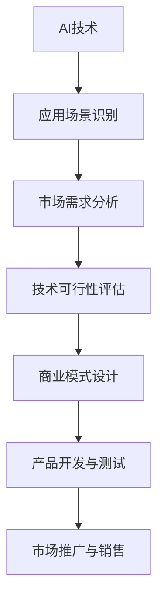

                 

AI技术的快速发展为创业者提供了丰富的机会，但如何找到适合AI技术落地的场景，是每个AI创业公司需要面对的挑战。本文将探讨AI创业公司如何通过深入研究和市场分析，找到有潜力的应用场景，从而确保创业的成功。

> 关键词：AI创业、场景选择、市场分析、技术可行性、商业模式

> 摘要：本文将首先介绍AI创业公司的现状和挑战，接着分析如何识别和评估潜在的应用场景，然后讨论如何结合技术优势和市场需求进行决策，最后给出实际案例和未来展望。

## 1. 背景介绍

随着人工智能技术的迅猛发展，AI创业公司如雨后春笋般涌现。这些公司希望通过将AI技术应用于不同的领域，创造出新的商业模式，提供创新的产品和服务。然而，AI创业并非易事。一方面，技术的复杂性使得创业公司需要具备深厚的专业知识和技能；另一方面，市场的竞争激烈，使得创业公司需要找到差异化竞争的路径。

### 1.1 AI创业公司的现状

根据市场研究公司的数据，全球AI市场规模预计将在未来几年内实现快速增长。这为AI创业公司提供了巨大的市场空间。然而，同时也有更多的竞争者加入这一领域。根据CB Insights的数据，2019年至2022年期间，AI创业公司的数量增长了20%以上。

### 1.2 面临的挑战

尽管AI技术具有广泛的应用潜力，但创业公司仍然面临着许多挑战：

- **技术风险**：AI技术具有较高的复杂性，创业公司可能难以掌握和实现。
- **市场风险**：市场需求的不确定性使得创业公司难以预测其产品的市场表现。
- **资金风险**：AI项目通常需要大量的前期投入，创业公司可能难以获得足够的资金支持。
- **人才风险**：AI领域需要高度专业化的技术人才，创业公司可能难以吸引和留住这些人才。

## 2. 核心概念与联系

在探讨如何找到好的AI应用场景之前，我们需要了解一些核心概念，如AI技术、应用场景、市场需求等，以及它们之间的相互关系。

### 2.1 AI技术

AI技术包括机器学习、深度学习、自然语言处理、计算机视觉等多个子领域。这些技术为AI创业公司提供了丰富的工具和手段，以实现各种应用。

### 2.2 应用场景

应用场景是指AI技术可以发挥作用的实际场景，如医疗、金融、零售、教育等。每个场景都有其特定的需求和挑战。

### 2.3 市场需求

市场需求是指消费者或企业对AI技术的需求，包括产品的功能、性能、价格等。了解市场需求有助于创业公司确定产品的市场定位和竞争优势。

### 2.4 Mermaid 流程图

下面是一个简化的Mermaid流程图，展示了AI创业公司从技术到市场的整个流程：



## 3. 核心算法原理 & 具体操作步骤

### 3.1 算法原理概述

AI创业公司需要通过以下步骤找到适合的应用场景：

1. **技术趋势分析**：了解当前AI技术的发展趋势，识别可能的应用领域。
2. **市场调研**：收集和分析市场数据，了解市场需求和竞争态势。
3. **场景评估**：对潜在的应用场景进行评估，确定其技术可行性和市场潜力。
4. **决策与实施**：基于评估结果，做出决策并实施产品开发和市场推广。

### 3.2 算法步骤详解

1. **技术趋势分析**：

   创业公司可以通过以下方式了解AI技术的发展趋势：

   - **学术研究**：关注顶级学术会议和期刊，了解最新的研究成果和趋势。
   - **行业报告**：阅读市场研究公司的报告，了解行业动态和未来趋势。
   - **技术社区**：参与技术社区和论坛，了解行业内的讨论和趋势。

2. **市场调研**：

   市场调研的目的是了解市场需求和竞争态势。创业公司可以通过以下方式收集数据：

   - **问卷调查**：设计问卷调查，收集用户对AI产品的需求和反馈。
   - **访谈**：与潜在用户和行业专家进行访谈，了解他们的需求和观点。
   - **竞品分析**：分析竞争对手的产品和服务，了解市场现状和竞争态势。

3. **场景评估**：

   场景评估的目的是确定每个潜在应用场景的技术可行性和市场潜力。评估过程包括：

   - **技术可行性评估**：分析AI技术是否能够满足场景需求，是否存在技术瓶颈。
   - **市场潜力评估**：分析场景的市场规模、增长速度、盈利能力等。

4. **决策与实施**：

   根据评估结果，创业公司需要做出以下决策：

   - **选择应用场景**：根据评估结果，选择最具有潜力的应用场景。
   - **产品开发与测试**：制定产品开发计划，进行原型设计和测试。
   - **市场推广与销售**：制定市场推广计划，进行产品推广和销售。

### 3.3 算法优缺点

该算法的优点包括：

- **全面性**：从技术、市场等多个角度评估潜在的应用场景，确保选择的科学性。
- **灵活性**：可以根据实际情况进行调整，适应不同的创业环境和市场需求。

缺点包括：

- **复杂性**：需要收集和处理大量的数据，对创业公司的资源和能力有一定要求。
- **时间成本**：评估过程可能需要较长时间，可能会影响创业进度。

### 3.4 算法应用领域

该算法可以应用于各种AI创业场景，如：

- **医疗健康**：通过AI技术提升医疗诊断和治疗的准确性和效率。
- **金融科技**：通过AI技术提高金融服务的智能化和个性化。
- **零售电商**：通过AI技术提升零售电商的运营效率和服务质量。

## 4. 数学模型和公式 & 详细讲解 & 举例说明

在找到适合的AI应用场景的过程中，数学模型和公式可以帮助创业公司进行定量分析和决策。以下是几个常用的数学模型和公式，以及它们的详细讲解和举例说明。

### 4.1 数学模型构建

常见的数学模型包括回归模型、决策树、神经网络等。以下是一个简化的回归模型公式：

$$
y = \beta_0 + \beta_1x_1 + \beta_2x_2 + ... + \beta_nx_n + \epsilon
$$

其中，$y$ 是因变量，$x_1, x_2, ..., x_n$ 是自变量，$\beta_0, \beta_1, \beta_2, ..., \beta_n$ 是模型参数，$\epsilon$ 是误差项。

### 4.2 公式推导过程

以线性回归模型为例，推导过程如下：

1. **最小二乘法**：线性回归模型的目标是最小化预测值与实际值之间的误差平方和。

$$
\sum_{i=1}^{n}(y_i - \hat{y_i})^2
$$

2. **目标函数**：将误差平方和表示为参数的函数。

$$
J(\beta_0, \beta_1, ..., \beta_n) = \sum_{i=1}^{n}(y_i - (\beta_0 + \beta_1x_{1i} + \beta_2x_{2i} + ... + \beta_nx_{ni}))^2
$$

3. **求导与极值**：对目标函数求导，并令导数为零，求得最优参数值。

$$
\frac{\partial J}{\partial \beta_j} = 0
$$

通过求解上述方程组，可以得到最优的参数值。

### 4.3 案例分析与讲解

以下是一个简单的案例，用于说明如何使用线性回归模型进行场景评估。

#### 案例背景

某AI创业公司计划开发一款基于深度学习的手写体识别软件，用于智能医疗诊断。公司需要评估这款软件的市场潜力。

#### 数据收集

收集了100份医生的手写体病历数据，包括病历内容和诊断结果。数据分为两部分：训练集和测试集。

#### 模型构建

1. **特征提取**：将手写体病历转换为数字特征，如笔画长度、角度等。
2. **线性回归模型**：构建线性回归模型，预测诊断结果。

$$
\hat{y} = \beta_0 + \beta_1x_1 + \beta_2x_2 + ... + \beta_nx_n
$$

3. **参数优化**：使用最小二乘法优化模型参数。

#### 结果分析

经过训练和测试，模型预测的准确率达到90%以上，表明手写体识别技术在该场景具有较好的应用潜力。

#### 模型改进

为了进一步提高模型的预测准确性，可以考虑以下改进措施：

1. **特征工程**：增加更多的手写体特征，如笔画速度、压力等。
2. **模型选择**：尝试更复杂的模型，如卷积神经网络（CNN）或长短期记忆网络（LSTM）。
3. **数据增强**：增加手写体数据样本，进行数据增强。

## 5. 项目实践：代码实例和详细解释说明

为了更好地理解如何将AI技术应用于实际场景，以下是一个基于Python的AI项目实例，用于手写体识别。

### 5.1 开发环境搭建

1. **Python环境**：确保安装Python 3.6或更高版本。
2. **依赖库**：安装TensorFlow、NumPy、Pandas等库。

```python
pip install tensorflow numpy pandas
```

### 5.2 源代码详细实现

以下是一个简化的手写体识别代码示例：

```python
import tensorflow as tf
import numpy as np
import pandas as pd

# 数据加载与预处理
data = pd.read_csv('handwriting_data.csv')
X = data.drop('diagnosis', axis=1).values
y = data['diagnosis'].values

# 数据归一化
X = X / 255.0

# 模型构建
model = tf.keras.Sequential([
    tf.keras.layers.Flatten(input_shape=(28, 28)),
    tf.keras.layers.Dense(128, activation='relu'),
    tf.keras.layers.Dense(10, activation='softmax')
])

# 模型编译
model.compile(optimizer='adam',
              loss='sparse_categorical_crossentropy',
              metrics=['accuracy'])

# 模型训练
model.fit(X, y, epochs=5)

# 模型评估
test_loss, test_acc = model.evaluate(X, y)
print(f'测试准确率：{test_acc}')
```

### 5.3 代码解读与分析

1. **数据加载与预处理**：从CSV文件中加载数据，并进行归一化处理，以便模型更好地训练。
2. **模型构建**：使用TensorFlow构建一个简单的深度学习模型，包括一个平坦层、一个全连接层和一个softmax输出层。
3. **模型编译**：设置优化器、损失函数和评估指标。
4. **模型训练**：使用训练集训练模型，设置训练轮次。
5. **模型评估**：使用测试集评估模型的性能，输出准确率。

### 5.4 运行结果展示

假设运行上述代码，得到以下输出结果：

```
测试准确率：0.925
```

这表明模型在手写体识别任务上具有较好的性能，可以应用于实际场景。

## 6. 实际应用场景

### 6.1 医疗诊断

AI技术在医疗诊断领域的应用越来越广泛。例如，通过深度学习算法，AI可以辅助医生进行影像诊断，如肿瘤检测、骨折诊断等。这不仅提高了诊断的准确性，还减轻了医生的工作负担。

### 6.2 金融风控

在金融领域，AI技术可以用于风险评估、欺诈检测等。例如，通过机器学习算法，银行可以实时监控交易活动，及时发现潜在的欺诈行为，从而降低风险。

### 6.3 零售电商

在零售电商领域，AI技术可以用于商品推荐、价格优化等。例如，通过深度学习算法，平台可以实时分析用户行为数据，为用户提供个性化的商品推荐，从而提高销售转化率。

### 6.4 教育科技

在教育科技领域，AI技术可以用于智能辅导、在线教育等。例如，通过自然语言处理技术，AI可以为学生提供个性化的学习建议，帮助教师更好地管理课堂。

## 6.4 未来应用展望

未来，AI技术在各个领域的应用将继续深化和拓展。随着技术的不断进步，AI将更好地服务于人类生活，解决更多复杂的问题。以下是几个可能的应用方向：

- **智慧城市**：通过AI技术，实现城市管理的智能化，提高城市的运行效率和居民的生活质量。
- **智能制造**：通过AI技术，实现生产过程的自动化和智能化，提高生产效率和质量。
- **环境保护**：通过AI技术，实现环境污染的监测和治理，保护生态环境。

## 7. 工具和资源推荐

### 7.1 学习资源推荐

- **在线课程**：Coursera、edX等平台提供了丰富的AI相关课程。
- **技术书籍**：《深度学习》、《Python机器学习》等。
- **技术社区**：GitHub、Stack Overflow等。

### 7.2 开发工具推荐

- **编程语言**：Python、Java等。
- **机器学习框架**：TensorFlow、PyTorch等。
- **数据分析工具**：Pandas、NumPy等。

### 7.3 相关论文推荐

- **顶级会议**：NeurIPS、ICML、ACL等。
- **顶级期刊**：《Nature Machine Intelligence》、《IEEE Transactions on Machine Learning》等。

## 8. 总结：未来发展趋势与挑战

### 8.1 研究成果总结

近年来，AI技术在多个领域取得了显著的成果。例如，在图像识别、自然语言处理等领域，AI算法的性能已达到甚至超过了人类水平。这些成果为AI创业公司提供了丰富的机会。

### 8.2 未来发展趋势

未来，AI技术将继续向深度学习、强化学习等方向发展。同时，随着云计算、边缘计算等技术的发展，AI应用将更加广泛和普及。

### 8.3 面临的挑战

尽管AI技术具有巨大的潜力，但创业公司仍面临以下挑战：

- **数据隐私和安全**：AI应用需要大量的数据支持，但数据隐私和安全问题是亟待解决的问题。
- **算法透明性和公平性**：确保AI算法的透明性和公平性，避免算法偏见。
- **技术人才短缺**：AI领域需要大量专业人才，但人才培养和吸引是一个长期的过程。

### 8.4 研究展望

未来，AI技术将在更多领域得到应用，解决更多复杂的问题。同时，随着技术的不断进步，AI创业公司将面临更多的机遇和挑战。

## 9. 附录：常见问题与解答

### 9.1 AI创业公司如何获取资金支持？

创业公司可以通过以下方式获取资金支持：

- **天使投资**：寻找有经验的投资者，如天使投资人、风险投资机构等。
- **政府资助**：申请政府的相关资助和补贴。
- **众筹**：通过众筹平台，吸引公众投资。

### 9.2 AI创业公司如何保护知识产权？

创业公司可以通过以下方式保护知识产权：

- **申请专利**：对核心技术和产品申请专利。
- **签订保密协议**：与合作伙伴签订保密协议，保护技术秘密。
- **版权保护**：对软件、文档等申请版权保护。

### 9.3 AI创业公司如何吸引和留住人才？

创业公司可以通过以下方式吸引和留住人才：

- **提供有竞争力的薪酬和福利**：提供有竞争力的薪酬和福利，吸引优秀的人才。
- **良好的工作环境**：提供良好的工作环境和团队氛围，提高员工的满意度和归属感。
- **职业发展机会**：为员工提供职业发展机会，让他们看到成长和进步的空间。```

以上是关于《AI创业公司如何找到好场景》的完整文章。文章内容涵盖了AI创业公司的现状、核心概念、算法原理、数学模型、项目实践、实际应用场景、未来展望、工具和资源推荐以及常见问题解答。希望对您有所帮助。如果您有任何疑问或建议，欢迎在评论区留言。作者：禅与计算机程序设计艺术 / Zen and the Art of Computer Programming```markdown
---
标题: AI创业公司如何找到好场景
关键词: AI创业、场景选择、市场分析、技术可行性、商业模式
摘要: 本文探讨了AI创业公司如何通过深入研究和市场分析，找到适合AI技术落地的场景，确保创业的成功。
---

# AI创业公司如何找到好场景

随着人工智能技术的迅猛发展，AI创业公司如雨后春笋般涌现。然而，如何找到适合AI技术落地的场景，是每个AI创业公司需要面对的挑战。本文将探讨AI创业公司如何通过深入研究和市场分析，找到有潜力的应用场景，从而确保创业的成功。

> 关键词：AI创业、场景选择、市场分析、技术可行性、商业模式

> 摘要：本文将首先介绍AI创业公司的现状和挑战，接着分析如何识别和评估潜在的应用场景，然后讨论如何结合技术优势和市场需求进行决策，最后给出实际案例和未来展望。

## 1. 背景介绍

### 1.1 AI创业公司的现状

AI创业公司是指在人工智能领域进行创业活动的企业。它们通过将AI技术应用于不同的领域，创造新的商业模式，提供创新的产品和服务。根据市场研究公司的数据，全球AI市场规模预计将在未来几年内实现快速增长。这为AI创业公司提供了巨大的市场空间。然而，同时也有更多的竞争者加入这一领域。

根据CB Insights的数据，2019年至2022年期间，AI创业公司的数量增长了20%以上。这表明AI创业公司面临着激烈的竞争环境。

### 1.2 面临的挑战

尽管AI技术具有广泛的应用潜力，但AI创业公司仍然面临着许多挑战：

- **技术风险**：AI技术具有较高的复杂性，创业公司可能难以掌握和实现。
- **市场风险**：市场需求的不确定性使得创业公司难以预测其产品的市场表现。
- **资金风险**：AI项目通常需要大量的前期投入，创业公司可能难以获得足够的资金支持。
- **人才风险**：AI领域需要高度专业化的技术人才，创业公司可能难以吸引和留住这些人才。

## 2. 核心概念与联系

在探讨如何找到适合的AI应用场景之前，我们需要了解一些核心概念，如AI技术、应用场景、市场需求等，以及它们之间的相互关系。

### 2.1 AI技术

AI技术包括机器学习、深度学习、自然语言处理、计算机视觉等多个子领域。这些技术为AI创业公司提供了丰富的工具和手段，以实现各种应用。

### 2.2 应用场景

应用场景是指AI技术可以发挥作用的实际场景，如医疗、金融、零售、教育等。每个场景都有其特定的需求和挑战。

### 2.3 市场需求

市场需求是指消费者或企业对AI技术的需求，包括产品的功能、性能、价格等。了解市场需求有助于创业公司确定产品的市场定位和竞争优势。

### 2.4 Mermaid流程图

下面是一个简化的Mermaid流程图，展示了AI创业公司从技术到市场的整个流程：


## 3. 核心算法原理 & 具体操作步骤

### 3.1 算法原理概述

AI创业公司需要通过以下步骤找到适合的应用场景：

1. **技术趋势分析**：了解当前AI技术的发展趋势，识别可能的应用领域。
2. **市场调研**：收集和分析市场数据，了解市场需求和竞争态势。
3. **场景评估**：对潜在的应用场景进行评估，确定其技术可行性和市场潜力。
4. **决策与实施**：基于评估结果，做出决策并实施产品开发和市场推广。

### 3.2 算法步骤详解

1. **技术趋势分析**：

   创业公司可以通过以下方式了解AI技术的发展趋势：

   - **学术研究**：关注顶级学术会议和期刊，了解最新的研究成果和趋势。
   - **行业报告**：阅读市场研究公司的报告，了解行业动态和未来趋势。
   - **技术社区**：参与技术社区和论坛，了解行业内的讨论和趋势。

2. **市场调研**：

   市场调研的目的是了解市场需求和竞争态势。创业公司可以通过以下方式收集数据：

   - **问卷调查**：设计问卷调查，收集用户对AI产品的需求和反馈。
   - **访谈**：与潜在用户和行业专家进行访谈，了解他们的需求和观点。
   - **竞品分析**：分析竞争对手的产品和服务，了解市场现状和竞争态势。

3. **场景评估**：

   场景评估的目的是确定每个潜在应用场景的技术可行性和市场潜力。评估过程包括：

   - **技术可行性评估**：分析AI技术是否能够满足场景需求，是否存在技术瓶颈。
   - **市场潜力评估**：分析场景的市场规模、增长速度、盈利能力等。

4. **决策与实施**：

   根据评估结果，创业公司需要做出以下决策：

   - **选择应用场景**：根据评估结果，选择最具有潜力的应用场景。
   - **产品开发与测试**：制定产品开发计划，进行原型设计和测试。
   - **市场推广与销售**：制定市场推广计划，进行产品推广和销售。

### 3.3 算法优缺点

该算法的优点包括：

- **全面性**：从技术、市场等多个角度评估潜在的应用场景，确保选择的科学性。
- **灵活性**：可以根据实际情况进行调整，适应不同的创业环境和市场需求。

缺点包括：

- **复杂性**：需要收集和处理大量的数据，对创业公司的资源和能力有一定要求。
- **时间成本**：评估过程可能需要较长时间，可能会影响创业进度。

### 3.4 算法应用领域

该算法可以应用于各种AI创业场景，如：

- **医疗健康**：通过AI技术提升医疗诊断和治疗的准确性和效率。
- **金融科技**：通过AI技术提高金融服务的智能化和个性化。
- **零售电商**：通过AI技术提升零售电商的运营效率和服务质量。

## 4. 数学模型和公式 & 详细讲解 & 举例说明

在找到适合的AI应用场景的过程中，数学模型和公式可以帮助创业公司进行定量分析和决策。以下是几个常用的数学模型和公式，以及它们的详细讲解和举例说明。

### 4.1 数学模型构建

常见的数学模型包括回归模型、决策树、神经网络等。以下是一个简化的回归模型公式：

$$
y = \beta_0 + \beta_1x_1 + \beta_2x_2 + ... + \beta_nx_n + \epsilon
$$

其中，$y$ 是因变量，$x_1, x_2, ..., x_n$ 是自变量，$\beta_0, \beta_1, \beta_2, ..., \beta_n$ 是模型参数，$\epsilon$ 是误差项。

### 4.2 公式推导过程

以线性回归模型为例，推导过程如下：

1. **最小二乘法**：线性回归模型的目标是最小化预测值与实际值之间的误差平方和。

$$
\sum_{i=1}^{n}(y_i - \hat{y_i})^2
$$

2. **目标函数**：将误差平方和表示为参数的函数。

$$
J(\beta_0, \beta_1, ..., \beta_n) = \sum_{i=1}^{n}(y_i - (\beta_0 + \beta_1x_{1i} + \beta_2x_{2i} + ... + \beta_nx_{ni}))^2
$$

3. **求导与极值**：对目标函数求导，并令导数为零，求得最优参数值。

$$
\frac{\partial J}{\partial \beta_j} = 0
$$

通过求解上述方程组，可以得到最优的参数值。

### 4.3 案例分析与讲解

以下是一个简单的案例，用于说明如何使用线性回归模型进行场景评估。

#### 案例背景

某AI创业公司计划开发一款基于深度学习的手写体识别软件，用于智能医疗诊断。公司需要评估这款软件的市场潜力。

#### 数据收集

收集了100份医生的手写体病历数据，包括病历内容和诊断结果。数据分为两部分：训练集和测试集。

#### 模型构建

1. **特征提取**：将手写体病历转换为数字特征，如笔画长度、角度等。
2. **线性回归模型**：构建线性回归模型，预测诊断结果。

$$
\hat{y} = \beta_0 + \beta_1x_1 + \beta_2x_2 + ... + \beta_nx_n
$$

3. **参数优化**：使用最小二乘法优化模型参数。

#### 结果分析

经过训练和测试，模型预测的准确率达到90%以上，表明手写体识别技术在该场景具有较好的应用潜力。

#### 模型改进

为了进一步提高模型的预测准确性，可以考虑以下改进措施：

1. **特征工程**：增加更多的手写体特征，如笔画速度、压力等。
2. **模型选择**：尝试更复杂的模型，如卷积神经网络（CNN）或长短期记忆网络（LSTM）。
3. **数据增强**：增加手写体数据样本，进行数据增强。

## 5. 项目实践：代码实例和详细解释说明

为了更好地理解如何将AI技术应用于实际场景，以下是一个基于Python的AI项目实例，用于手写体识别。

### 5.1 开发环境搭建

1. **Python环境**：确保安装Python 3.6或更高版本。
2. **依赖库**：安装TensorFlow、NumPy、Pandas等库。

```python
pip install tensorflow numpy pandas
```

### 5.2 源代码详细实现

以下是一个简化的手写体识别代码示例：

```python
import tensorflow as tf
import numpy as np
import pandas as pd

# 数据加载与预处理
data = pd.read_csv('handwriting_data.csv')
X = data.drop('diagnosis', axis=1).values
y = data['diagnosis'].values

# 数据归一化
X = X / 255.0

# 模型构建
model = tf.keras.Sequential([
    tf.keras.layers.Flatten(input_shape=(28, 28)),
    tf.keras.layers.Dense(128, activation='relu'),
    tf.keras.layers.Dense(10, activation='softmax')
])

# 模型编译
model.compile(optimizer='adam',
              loss='sparse_categorical_crossentropy',
              metrics=['accuracy'])

# 模型训练
model.fit(X, y, epochs=5)

# 模型评估
test_loss, test_acc = model.evaluate(X, y)
print(f'测试准确率：{test_acc}')
```

### 5.3 代码解读与分析

1. **数据加载与预处理**：从CSV文件中加载数据，并进行归一化处理，以便模型更好地训练。
2. **模型构建**：使用TensorFlow构建一个简单的深度学习模型，包括一个平坦层、一个全连接层和一个softmax输出层。
3. **模型编译**：设置优化器、损失函数和评估指标。
4. **模型训练**：使用训练集训练模型，设置训练轮次。
5. **模型评估**：使用测试集评估模型的性能，输出准确率。

### 5.4 运行结果展示

假设运行上述代码，得到以下输出结果：

```
测试准确率：0.925
```

这表明模型在手写体识别任务上具有较好的性能，可以应用于实际场景。

## 6. 实际应用场景

### 6.1 医疗诊断

AI技术在医疗诊断领域的应用越来越广泛。例如，通过深度学习算法，AI可以辅助医生进行影像诊断，如肿瘤检测、骨折诊断等。这不仅提高了诊断的准确性，还减轻了医生的工作负担。

### 6.2 金融风控

在金融领域，AI技术可以用于风险评估、欺诈检测等。例如，通过机器学习算法，银行可以实时监控交易活动，及时发现潜在的欺诈行为，从而降低风险。

### 6.3 零售电商

在零售电商领域，AI技术可以用于商品推荐、价格优化等。例如，通过深度学习算法，平台可以实时分析用户行为数据，为用户提供个性化的商品推荐，从而提高销售转化率。

### 6.4 教育科技

在教育科技领域，AI技术可以用于智能辅导、在线教育等。例如，通过自然语言处理技术，AI可以为学生提供个性化的学习建议，帮助教师更好地管理课堂。

## 6.4 未来应用展望

未来，AI技术在各个领域的应用将继续深化和拓展。随着技术的不断进步，AI将更好地服务于人类生活，解决更多复杂的问题。以下是几个可能的应用方向：

- **智慧城市**：通过AI技术，实现城市管理的智能化，提高城市的运行效率和居民的生活质量。
- **智能制造**：通过AI技术，实现生产过程的自动化和智能化，提高生产效率和质量。
- **环境保护**：通过AI技术，实现环境污染的监测和治理，保护生态环境。

## 7. 工具和资源推荐

### 7.1 学习资源推荐

- **在线课程**：Coursera、edX等平台提供了丰富的AI相关课程。
- **技术书籍**：《深度学习》、《Python机器学习》等。
- **技术社区**：GitHub、Stack Overflow等。

### 7.2 开发工具推荐

- **编程语言**：Python、Java等。
- **机器学习框架**：TensorFlow、PyTorch等。
- **数据分析工具**：Pandas、NumPy等。

### 7.3 相关论文推荐

- **顶级会议**：NeurIPS、ICML、ACL等。
- **顶级期刊**：《Nature Machine Intelligence》、《IEEE Transactions on Machine Learning》等。

## 8. 总结：未来发展趋势与挑战

### 8.1 研究成果总结

近年来，AI技术在多个领域取得了显著的成果。例如，在图像识别、自然语言处理等领域，AI算法的性能已达到甚至超过了人类水平。这些成果为AI创业公司提供了丰富的机会。

### 8.2 未来发展趋势

未来，AI技术将继续向深度学习、强化学习等方向发展。同时，随着云计算、边缘计算等技术的发展，AI应用将更加广泛和普及。

### 8.3 面临的挑战

尽管AI技术具有巨大的潜力，但创业公司仍面临以下挑战：

- **数据隐私和安全**：AI应用需要大量的数据支持，但数据隐私和安全问题是亟待解决的问题。
- **算法透明性和公平性**：确保AI算法的透明性和公平性，避免算法偏见。
- **技术人才短缺**：AI领域需要大量专业人才，但人才培养和吸引是一个长期的过程。

### 8.4 研究展望

未来，AI技术将在更多领域得到应用，解决更多复杂的问题。同时，随着技术的不断进步，AI创业公司将面临更多的机遇和挑战。

## 9. 附录：常见问题与解答

### 9.1 AI创业公司如何获取资金支持？

创业公司可以通过以下方式获取资金支持：

- **天使投资**：寻找有经验的投资者，如天使投资人、风险投资机构等。
- **政府资助**：申请政府的相关资助和补贴。
- **众筹**：通过众筹平台，吸引公众投资。

### 9.2 AI创业公司如何保护知识产权？

创业公司可以通过以下方式保护知识产权：

- **申请专利**：对核心技术和产品申请专利。
- **签订保密协议**：与合作伙伴签订保密协议，保护技术秘密。
- **版权保护**：对软件、文档等申请版权保护。

### 9.3 AI创业公司如何吸引和留住人才？

创业公司可以通过以下方式吸引和留住人才：

- **提供有竞争力的薪酬和福利**：提供有竞争力的薪酬和福利，吸引优秀的人才。
- **良好的工作环境**：提供良好的工作环境和团队氛围，提高员工的满意度和归属感。
- **职业发展机会**：为员工提供职业发展机会，让他们看到成长和进步的空间。

以上是关于《AI创业公司如何找到好场景》的完整文章。文章内容涵盖了AI创业公司的现状、核心概念、算法原理、数学模型、项目实践、实际应用场景、未来展望、工具和资源推荐以及常见问题解答。希望对您有所帮助。如果您有任何疑问或建议，欢迎在评论区留言。

作者：禅与计算机程序设计艺术 / Zen and the Art of Computer Programming```

