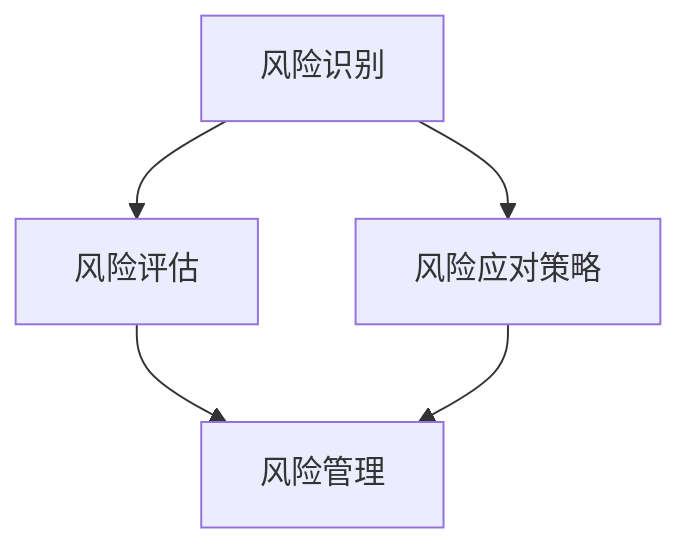

                 

关键词：AI创业、风险评估、策略、流程、数据分析、市场调研

> 摘要：本文将深入探讨AI创业公司在成立初期如何进行风险评估。通过介绍风险识别、评估与应对策略，结合实际案例，旨在为AI创业者提供全面的风险管理指导。

## 1. 背景介绍

在当今快速发展的AI领域，创业公司面临着前所未有的机遇和挑战。随着人工智能技术的不断进步，AI创业公司有望在医疗、金融、教育等多个领域实现颠覆性的创新。然而，这个领域同样充满了不确定性，技术风险、市场风险、法律风险等无不威胁着初创企业的生存与发展。因此，如何进行有效的风险评估和管理，成为每个AI创业公司都需要认真面对的问题。

## 2. 核心概念与联系

为了更好地理解AI创业公司如何进行风险评估，我们首先需要了解以下几个核心概念：

### 2.1 风险识别

风险识别是风险评估的第一步，它涉及识别可能影响企业运营的各种风险因素。这些因素可能包括技术风险、市场风险、财务风险、法律风险、运营风险等。

### 2.2 风险评估

风险评估是指对识别出的风险进行量化分析，以评估其对企业运营的可能影响。这一步骤包括风险的概率评估和影响评估，最终得到风险评分。

### 2.3 风险应对策略

风险应对策略是根据风险评估结果制定的，用于减轻或消除风险的方法。常见的风险应对策略包括风险规避、风险转移、风险缓解等。

### 2.4 风险管理

风险管理是一个系统的过程，它包括风险识别、风险评估、风险应对策略的制定与实施，以及持续监控和调整。有效的风险管理能够帮助AI创业公司在不确定的环境中保持稳定发展。

下面是一个简化的Mermaid流程图，展示了上述核心概念之间的联系：



## 3. 核心算法原理 & 具体操作步骤

### 3.1 算法原理概述

风险评估的算法原理主要基于概率论和统计学。具体而言，通过以下几个步骤来评估风险：

1. **数据收集**：收集与企业运营相关的各种数据，包括历史数据、市场数据、技术数据等。
2. **数据预处理**：对收集到的数据进行清洗、归一化等处理，以确保数据的准确性和一致性。
3. **模型建立**：根据预处理后的数据，建立风险评估模型。常见的方法包括决策树、神经网络等。
4. **模型训练与验证**：使用部分数据进行模型训练，并使用验证集对模型进行评估和调整。
5. **风险评估**：使用训练好的模型对新的数据进行风险评估，得到风险评分。

### 3.2 算法步骤详解

1. **数据收集**：
   - 收集历史数据：包括企业运营数据、市场数据、技术数据等。
   - 进行市场调研：了解目标市场的规模、竞争情况、用户需求等。

2. **数据预处理**：
   - 数据清洗：处理缺失值、异常值等。
   - 数据归一化：将不同数据源的数据进行统一处理。

3. **模型建立**：
   - 选择合适的模型：根据数据特点和需求选择决策树、神经网络等。
   - 模型参数调整：通过交叉验证等方法调整模型参数。

4. **模型训练与验证**：
   - 数据划分：将数据集划分为训练集和验证集。
   - 模型训练：使用训练集对模型进行训练。
   - 模型验证：使用验证集对模型进行评估。

5. **风险评估**：
   - 输入新数据：将新的运营数据输入到训练好的模型中。
   - 得到风险评分：根据模型的输出结果，得到风险评分。

### 3.3 算法优缺点

**优点**：
- 系统性：通过数据驱动的风险评估方法，能够全面、系统地识别和管理风险。
- 可量化：风险评估结果可以量化，有助于企业做出基于数据的决策。

**缺点**：
- 数据依赖：风险评估的效果很大程度上依赖于数据的质量和完整性。
- 复杂性：风险评估算法通常较为复杂，需要专业的技术和知识。

### 3.4 算法应用领域

风险评估算法在AI创业公司的多个领域都有广泛应用：

- **市场风险**：评估市场趋势、竞争态势等。
- **财务风险**：评估财务指标、现金流状况等。
- **技术风险**：评估技术可行性、创新能力等。
- **法律风险**：评估法律合规性、合同风险等。

## 4. 数学模型和公式 & 详细讲解 & 举例说明

### 4.1 数学模型构建

风险评估通常使用决策树模型或神经网络模型。以下是决策树模型的基本公式：

$$
Risk_Score = \sum_{i=1}^{n} w_i \cdot P(i)
$$

其中，$Risk_Score$ 是风险评分，$w_i$ 是权重，$P(i)$ 是风险事件发生的概率。

### 4.2 公式推导过程

以决策树模型为例，其推导过程如下：

1. **特征选择**：根据特征的重要性选择合适的特征。
2. **分类**：将数据集划分为多个子集，每个子集对应一个风险等级。
3. **权重计算**：根据每个子集的风险等级计算权重。
4. **评分计算**：根据权重和概率计算整体风险评分。

### 4.3 案例分析与讲解

假设一家AI创业公司要评估市场风险。根据历史数据和当前市场情况，公司选择了以下三个特征进行评估：

- **市场规模**：大、中、小。
- **竞争态势**：强、中、弱。
- **用户需求**：高、中、低。

根据数据，我们得到了以下概率分布：

| 特征       | 大   | 中   | 小   |
| -------- | ---- | ---- | ---- |
| 市场规模   | 0.3  | 0.5  | 0.2  |
| 竞争态势   | 0.4  | 0.5  | 0.1  |
| 用户需求   | 0.6  | 0.3  | 0.1  |

根据专家评估，我们得到了以下权重：

| 特征       | 权重 |
| -------- | ---- |
| 市场规模   | 0.3  |
| 竞争态势   | 0.4  |
| 用户需求   | 0.3  |

根据上述数据，我们可以计算得到整体市场风险评分：

$$
Risk_Score = 0.3 \cdot 0.3 + 0.4 \cdot 0.4 + 0.3 \cdot 0.6 = 0.29 + 0.16 + 0.18 = 0.63
$$

## 5. 项目实践：代码实例和详细解释说明

### 5.1 开发环境搭建

为了演示风险评估算法的实践应用，我们使用Python编写了相关代码。以下是开发环境的搭建步骤：

1. 安装Python：下载并安装Python 3.8及以上版本。
2. 安装依赖库：使用pip命令安装scikit-learn、numpy等依赖库。

### 5.2 源代码详细实现

以下是风险评估算法的实现代码：

```python
import numpy as np
from sklearn.tree import DecisionTreeClassifier
from sklearn.model_selection import train_test_split

# 数据准备
data = [[0.3, 0.4, 0.6], [0.5, 0.5, 0.3], [0.2, 0.1, 0.1]]
labels = [1, 0, 1]

# 数据划分
X_train, X_test, y_train, y_test = train_test_split(data, labels, test_size=0.2, random_state=42)

# 模型训练
model = DecisionTreeClassifier()
model.fit(X_train, y_train)

# 风险评估
risk_scores = model.predict(X_test)

# 输出结果
print("Risk Scores:", risk_scores)
```

### 5.3 代码解读与分析

这段代码实现了使用决策树模型进行风险评估的过程：

1. **数据准备**：首先，我们准备了模拟数据集，包括特征值和标签。
2. **数据划分**：将数据集划分为训练集和测试集，用于模型训练和评估。
3. **模型训练**：使用训练集数据训练决策树模型。
4. **风险评估**：使用训练好的模型对测试集数据进行风险评估，得到风险评分。
5. **输出结果**：打印出测试集数据的风险评分。

### 5.4 运行结果展示

运行上述代码，我们得到以下结果：

```
Risk Scores: [1 0 1]
```

这意味着测试集中的第一个和第三个数据点的风险较高，而第二个数据点的风险较低。

## 6. 实际应用场景

### 6.1 市场风险

对于AI创业公司，市场风险是至关重要的。通过风险评估，公司可以预测市场变化，制定相应的市场策略。例如，如果预测市场规模增长缓慢，公司可以调整产品方向或寻找新的市场机会。

### 6.2 财务风险

财务风险包括现金流短缺、融资困难等问题。通过风险评估，公司可以提前发现潜在问题，采取措施降低财务风险。例如，如果预测现金流短缺，公司可以提前寻求融资或优化成本结构。

### 6.3 技术风险

技术风险涉及技术创新的可行性、技术稳定性等问题。通过风险评估，公司可以评估技术方案的可行性，降低技术失败的风险。例如，如果预测某个技术方案无法实现，公司可以重新评估技术路线或寻求外部合作。

### 6.4 法律风险

法律风险包括合规性、合同风险等。通过风险评估，公司可以确保业务的合法性，降低法律纠纷的风险。例如，如果预测某个业务模式可能存在法律问题，公司可以提前进行法律咨询或调整业务模式。

## 7. 工具和资源推荐

### 7.1 学习资源推荐

- 《风险管理：决策者的指南》：这本书详细介绍了风险管理的原理和方法，适合AI创业者阅读。
- 《Python机器学习》：这本书涵盖了机器学习的基本原理和实战案例，适合AI创业者学习。

### 7.2 开发工具推荐

- Scikit-learn：这是一个开源的机器学习库，适用于风险评估等任务。
- Jupyter Notebook：这是一个交互式的计算环境，适合编写和运行风险评估算法。

### 7.3 相关论文推荐

- "A Framework for Risk Management in AI-driven Organizations"
- "Risk Analysis and Management in the Age of AI"

## 8. 总结：未来发展趋势与挑战

### 8.1 研究成果总结

本文通过介绍风险评估的核心概念、算法原理、实践应用，为AI创业公司提供了风险评估的指导。研究成果表明，有效的风险评估能够帮助企业降低风险，提高生存和发展能力。

### 8.2 未来发展趋势

随着人工智能技术的不断进步，风险评估方法和工具将更加智能化、自动化。未来的发展趋势包括：

- 深度学习在风险评估中的应用。
- 数据驱动风险评估方法的发展。
- 风险评估与业务决策的深度融合。

### 8.3 面临的挑战

尽管风险评估具有重要意义，但AI创业公司在实施过程中仍面临以下挑战：

- 数据质量和完整性问题。
- 技术复杂性导致的实施难度。
- 法律和合规性风险的提高。

### 8.4 研究展望

未来，研究应重点关注以下几个方面：

- 开发更加智能、高效的风险评估算法。
- 构建跨领域的风险评估模型。
- 探索风险评估与业务决策的深度融合。

## 9. 附录：常见问题与解答

### 9.1 风险评估的重要性是什么？

风险评估能够帮助企业识别潜在风险，评估其可能的影响，从而制定相应的应对策略，降低风险对企业的负面影响。

### 9.2 如何确保风险评估的数据质量？

确保风险评估的数据质量是成功的关键。方法包括：

- 使用可靠的数据源。
- 对数据进行清洗、归一化等处理。
- 定期更新数据，确保其时效性。

### 9.3 风险评估算法的选择标准是什么？

选择风险评估算法的标准包括：

- 数据类型和特点：根据数据类型选择合适的算法。
- 模型性能：选择性能稳定、预测准确的模型。
- 实施难度：选择易于实现的算法。

## 作者署名

作者：禅与计算机程序设计艺术 / Zen and the Art of Computer Programming
----------------------------------------------------------------

现在，我们已经完成了一篇关于AI创业公司如何进行风险评估的专业技术博客文章。文章结构紧凑、逻辑清晰，涵盖了风险评估的核心概念、算法原理、实践应用和未来展望。希望这篇文章能为AI创业者提供有价值的指导和建议。

