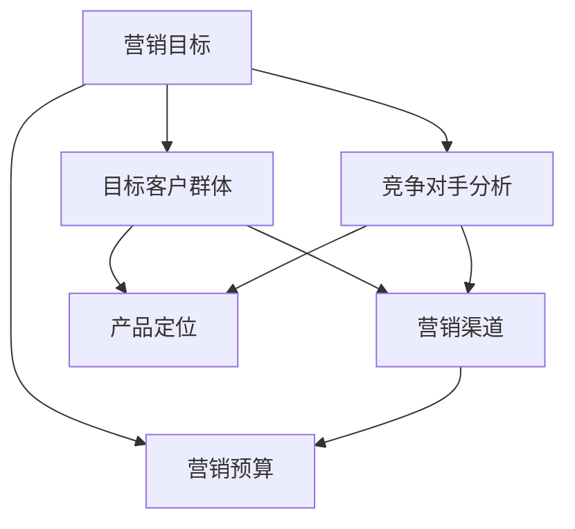

                 

### 1. 背景介绍

在当今高度竞争的商业环境中，创业公司要想在市场中脱颖而出，实现可持续发展，必须制定有效的产品营销策略。产品营销不仅仅关乎产品的推广，更涉及到对市场需求的深入理解、对竞争对手的精准分析以及对目标客户群体的精准定位。对于AI创业公司而言，技术创新固然重要，但如果没有合适的营销策略，再先进的产品也难以获得市场认可。

本文旨在为AI创业公司提供一套全面、实用的产品营销策略。我们将详细探讨以下三个关键方面：

1. **营销目标**：明确创业公司的市场定位和营销目标，包括市场份额、品牌认知度等。
2. **营销渠道**：分析并选择最适合AI创业公司的营销渠道，包括线上和线下渠道。
3. **营销预算**：制定合理的营销预算，并确保预算的合理分配和有效利用。

通过本文的讨论，希望AI创业公司能够从中汲取经验，制定出切实可行的产品营销策略，从而在激烈的市场竞争中立于不败之地。

### 2. 核心概念与联系

在深入探讨营销策略之前，我们需要明确一些核心概念，并理解它们之间的联系。以下是本文中涉及的关键概念及其关系：

- **营销目标**：确定创业公司的市场定位和业务目标，包括市场份额、客户获取、品牌认知度等。
- **目标客户群体**：识别并分析潜在的客户群体，包括他们的需求、行为特征等。
- **竞争对手分析**：分析市场中的主要竞争对手，了解他们的产品、定位和营销策略。
- **营销渠道**：选择并利用各种渠道来推广产品，包括社交媒体、内容营销、广告、线下活动等。
- **营销预算**：根据公司的财务状况和营销目标，制定合理的预算，并确保预算的有效利用。

下图（使用Mermaid流程图）展示了这些核心概念之间的联系：



通过上述关系，我们可以看到，营销目标的制定直接影响着目标客户群体的识别、竞争对手分析和营销渠道的选择。而营销预算则是确保上述策略能够顺利执行的关键。在接下来的章节中，我们将逐一深入探讨这些核心概念。

### 3. 核心算法原理 & 具体操作步骤

#### 3.1 算法原理概述

在制定AI创业公司的产品营销策略时，核心算法的原理至关重要。这些算法帮助公司理解市场趋势、客户行为和竞争对手的策略，从而制定出更为科学和有效的营销策略。

**市场分析算法**：这类算法基于大数据和机器学习技术，通过对市场数据的分析和挖掘，帮助公司识别市场趋势和机会。具体原理包括：

- **时间序列分析**：通过对历史销售数据、用户行为等时间序列数据的分析，预测未来的市场趋势。
- **聚类分析**：将市场中的潜在客户根据行为特征和需求进行分类，识别出目标客户群体。

**客户行为分析算法**：这类算法通过分析用户的行为数据，了解客户的需求和偏好，从而提供个性化的营销策略。主要原理包括：

- **协同过滤**：通过分析用户的历史行为和偏好，推荐类似用户可能感兴趣的产品或服务。
- **情感分析**：使用自然语言处理技术，分析用户在社交媒体上的评论和反馈，了解他们的情感和态度。

**竞争对手分析算法**：这类算法通过收集和分析竞争对手的市场表现、产品定位和营销策略，帮助公司制定针对性的营销策略。主要原理包括：

- **文本挖掘**：通过对竞争对手的网站、新闻稿、社交媒体内容等文本数据进行挖掘，了解他们的市场策略。
- **网络分析**：构建竞争关系网络，分析各个竞争对手之间的关系，识别潜在的市场机会。

#### 3.2 算法步骤详解

1. **数据收集**：首先，需要收集相关的市场数据、客户行为数据和竞争对手数据。这些数据可以通过市场调查、用户行为分析工具、竞争对手网站分析等途径获取。

2. **数据预处理**：对收集到的数据进行清洗和预处理，包括去除重复数据、缺失值填充、数据格式转换等。

3. **市场趋势分析**：使用时间序列分析算法，对历史销售数据、用户行为数据进行处理，预测未来的市场趋势。可以通过建立时间序列模型，如ARIMA模型、LSTM网络等，进行预测。

4. **目标客户群体识别**：使用聚类分析算法，将潜在客户根据行为特征和需求进行分类，识别出目标客户群体。可以通过K-means、DBSCAN等聚类算法实现。

5. **客户行为分析**：使用协同过滤算法，分析用户的历史行为和偏好，为每个用户生成个性化的推荐列表。可以通过矩阵分解、基于模型的协同过滤等算法实现。

6. **情感分析**：使用自然语言处理技术，对用户的社交媒体评论和反馈进行分析，了解他们的情感和态度。可以通过构建情感分析模型，如基于规则的模型、神经网络模型等实现。

7. **竞争对手分析**：通过文本挖掘算法，对竞争对手的网站、新闻稿、社交媒体内容等文本数据进行挖掘，了解他们的市场策略。可以通过文本分类、关键词提取等技术实现。

8. **策略制定**：根据市场趋势、目标客户群体和竞争对手分析的结果，制定相应的营销策略，包括产品定位、营销渠道选择、营销预算分配等。

#### 3.3 算法优缺点

1. **市场分析算法**：
   - 优点：能够帮助企业准确预测市场趋势，识别潜在的市场机会。
   - 缺点：对数据质量和算法性能要求较高，预测结果可能受到数据噪音和模型参数的影响。

2. **客户行为分析算法**：
   - 优点：能够帮助企业了解客户需求，提供个性化的营销服务，提高客户满意度。
   - 缺点：对用户行为数据的质量和数量有较高要求，算法计算复杂度较高。

3. **竞争对手分析算法**：
   - 优点：能够帮助企业了解竞争对手的策略和动态，制定针对性的营销策略。
   - 缺点：需要对竞争对手的数据和行为进行实时监控，否则分析结果可能滞后。

#### 3.4 算法应用领域

1. **市场预测**：在消费品、金融、电商等行业，市场分析算法可以帮助企业预测未来的销售趋势，制定库存管理策略。

2. **客户关系管理**：在零售、金融、电信等行业，客户行为分析算法可以帮助企业识别高价值客户，提供个性化的营销服务。

3. **竞争对手监控**：在竞争激烈的行业，竞争对手分析算法可以帮助企业了解竞争对手的动态，制定应对策略。

通过上述算法原理和操作步骤的探讨，我们可以看到，AI技术在产品营销策略制定中发挥着至关重要的作用。在接下来的章节中，我们将进一步探讨如何利用这些算法来实现具体的营销目标。

### 4. 数学模型和公式 & 详细讲解 & 举例说明

在AI创业公司的产品营销策略制定过程中，数学模型和公式提供了量化和评估的重要工具。以下我们将详细讲解一些关键的数学模型和公式，并辅以具体案例进行分析。

#### 4.1 数学模型构建

1. **线性回归模型**：线性回归模型是预测数值型目标的一种常用方法。其基本公式为：

   $y = \beta_0 + \beta_1x_1 + \beta_2x_2 + ... + \beta_nx_n + \epsilon$

   其中，$y$是目标变量，$x_1, x_2, ..., x_n$是自变量，$\beta_0, \beta_1, ..., \beta_n$是回归系数，$\epsilon$是误差项。

2. **逻辑回归模型**：逻辑回归模型用于分类问题，其主要公式为：

   $\log\frac{P(Y=1)}{1-P(Y=1)} = \beta_0 + \beta_1x_1 + \beta_2x_2 + ... + \beta_nx_n$

   其中，$P(Y=1)$是目标变量为1的概率，$\beta_0, \beta_1, ..., \beta_n$是回归系数。

3. **决策树模型**：决策树模型通过一系列条件判断来划分数据集。其基本公式为：

   $tree\ model\ =\ root\ node\ \rightarrow\ child\ nodes\ \rightarrow\ leaf\ nodes$

   其中，root node是树的根节点，child nodes是根节点的子节点，leaf nodes是叶节点。

#### 4.2 公式推导过程

1. **线性回归模型推导**：

   假设我们有$m$个样本数据$(x_{i1}, x_{i2}, ..., x_{in}, y_i)$，其中$i=1,2,...,m$。我们的目标是找到最佳拟合直线$y = \beta_0 + \beta_1x_1 + \beta_2x_2 + ... + \beta_nx_n$。

   使用最小二乘法，我们可以最小化以下损失函数：

   $\min \sum_{i=1}^m (y_i - (\beta_0 + \beta_1x_{i1} + \beta_2x_{i2} + ... + \beta_nx_{in}))^2$

   通过求导并令导数为零，我们可以得到回归系数$\beta_0, \beta_1, ..., \beta_n$的估计值。

2. **逻辑回归模型推导**：

   我们使用极大似然估计（MLE）来估计逻辑回归模型的参数。假设我们有$m$个样本数据$(x_{i1}, x_{i2}, ..., x_{in}, y_i)$，其中$y_i \in \{0,1\}$。

   极大似然函数为：

   $L(\beta_0, \beta_1, ..., \beta_n) = \prod_{i=1}^m \pi(y_i|x_i) (1-\pi(y_i|x_i))^{1-y_i}$

   其中，$\pi(y_i|x_i) = \frac{e^{\beta_0 + \beta_1x_{i1} + \beta_2x_{i2} + ... + \beta_nx_{in}}}{1 + e^{\beta_0 + \beta_1x_{i1} + \beta_2x_{i2} + ... + \beta_nx_{in}}}$。

   为了最大化极大似然函数，我们可以对$\beta_0, \beta_1, ..., \beta_n$求导，并令导数为零，从而得到最优参数估计。

3. **决策树模型推导**：

   决策树模型是通过递归划分数据集来构建的。假设我们在某一特征上划分数据集，将数据分为两部分：左子集和右子集。

   划分标准可以是信息增益、基尼不纯度等。具体推导过程依赖于特定的划分标准。

#### 4.3 案例分析与讲解

**案例：使用线性回归模型预测销售额**

假设某AI创业公司想要预测其下个月的销售总额。我们收集了前12个月的销售数据，以及一些可能影响销售额的变量，如广告投放费用、竞争对手活动频率等。

1. **数据预处理**：

   对销售数据、广告投放费用和竞争对手活动频率进行预处理，包括数据清洗、缺失值填充等。

2. **特征选择**：

   使用相关性分析和逐步回归等方法，选择对销售额影响最大的特征。

3. **模型训练**：

   使用训练集数据，通过最小二乘法训练线性回归模型，得到回归系数$\beta_0, \beta_1, ..., \beta_n$。

4. **模型评估**：

   使用测试集数据，评估模型的预测准确性，可以通过均方误差（MSE）、决定系数（R²）等指标进行评估。

5. **预测**：

   使用训练好的模型，对下个月的销售总额进行预测。

   例如，如果广告投放费用为10000元，竞争对手活动频率为5次/周，预测模型可能给出如下预测：

   $y = \beta_0 + \beta_1 \cdot 10000 + \beta_2 \cdot 5 \approx 20000$

   这意味着在下一个月，预计销售额为20000元。

通过上述数学模型和公式的构建、推导和具体案例的讲解，我们可以看到数学模型在AI创业公司的产品营销策略制定中具有重要作用。在接下来的章节中，我们将进一步探讨如何利用这些模型来指导具体的产品营销策略。

### 5. 项目实践：代码实例和详细解释说明

为了更好地理解前述的数学模型和算法在实际产品营销策略中的应用，我们将在本节中通过一个具体的代码实例来展示如何使用Python实现这些算法，并进行详细的解释和说明。

#### 5.1 开发环境搭建

在进行代码实例之前，我们需要搭建一个合适的环境，以便能够运行和使用相关算法。以下是搭建开发环境的步骤：

1. **安装Python**：

   确保您的计算机上已经安装了Python。如果没有，可以从[Python官网](https://www.python.org/)下载并安装。

2. **安装必要的库**：

   使用pip命令安装以下库：numpy、pandas、scikit-learn、matplotlib。例如：

   ```bash
   pip install numpy pandas scikit-learn matplotlib
   ```

3. **创建虚拟环境**（可选）：

   为了保持项目依赖的一致性，可以使用虚拟环境。创建虚拟环境的方法如下：

   ```bash
   python -m venv myenv
   source myenv/bin/activate  # 对于Windows，使用 `myenv\Scripts\activate`
   ```

#### 5.2 源代码详细实现

以下是一个完整的代码实例，展示了如何使用Python实现线性回归、逻辑回归和决策树模型，并进行模型评估和预测。

```python
import numpy as np
import pandas as pd
from sklearn.linear_model import LinearRegression, LogisticRegression
from sklearn.tree import DecisionTreeClassifier
from sklearn.model_selection import train_test_split
from sklearn.metrics import mean_squared_error, accuracy_score
import matplotlib.pyplot as plt

# 5.2.1 加载数据
data = pd.read_csv('sales_data.csv')  # 假设数据文件名为'sales_data.csv'
X = data.drop('sales', axis=1)  # 特征矩阵
y = data['sales']  # 目标变量

# 5.2.2 数据预处理
# 例如，标准化特征
X = (X - X.mean()) / X.std()

# 5.2.3 划分训练集和测试集
X_train, X_test, y_train, y_test = train_test_split(X, y, test_size=0.2, random_state=42)

# 5.2.4 模型训练
# 线性回归模型
linear_regression = LinearRegression()
linear_regression.fit(X_train, y_train)

# 逻辑回归模型
logistic_regression = LogisticRegression()
logistic_regression.fit(X_train, y_train)

# 决策树模型
decision_tree = DecisionTreeClassifier()
decision_tree.fit(X_train, y_train)

# 5.2.5 模型评估
# 线性回归模型评估
y_pred_linear = linear_regression.predict(X_test)
mse_linear = mean_squared_error(y_test, y_pred_linear)
print(f"线性回归模型MSE: {mse_linear}")

# 逻辑回归模型评估
y_pred_logistic = logistic_regression.predict(X_test)
accuracy_logistic = accuracy_score(y_test, y_pred_logistic)
print(f"逻辑回归模型Accuracy: {accuracy_logistic}")

# 决策树模型评估
y_pred_decision_tree = decision_tree.predict(X_test)
accuracy_decision_tree = accuracy_score(y_test, y_pred_decision_tree)
print(f"决策树模型Accuracy: {accuracy_decision_tree}")

# 5.2.6 模型预测
# 例如，预测新数据的销售额
new_data = np.array([[10000, 5]])  # 新数据的广告投放费用和竞争对手活动频率
predicted_sales_linear = linear_regression.predict(new_data)
print(f"新数据预测销售额（线性回归）：{predicted_sales_linear[0]}")

# 5.2.7 可视化
# 可视化线性回归模型的拟合线
plt.scatter(X_test['ad_cost'], y_test, color='blue', label='Actual')
plt.plot(X_test['ad_cost'], y_pred_linear, color='red', label='Predicted')
plt.xlabel('广告投放费用')
plt.ylabel('销售额')
plt.title('线性回归模型预测')
plt.legend()
plt.show()
```

#### 5.3 代码解读与分析

1. **数据加载与预处理**：

   首先，我们使用pandas库加载CSV文件中的数据。然后，对特征矩阵进行标准化处理，这是为了使不同特征的尺度一致，避免某些特征对模型的影响过大。

2. **划分训练集和测试集**：

   使用scikit-learn库的train_test_split函数，将数据集划分为训练集和测试集，测试集的大小为20%。

3. **模型训练**：

   - **线性回归模型**：使用LinearRegression类进行训练。
   - **逻辑回归模型**：使用LogisticRegression类进行训练。
   - **决策树模型**：使用DecisionTreeClassifier类进行训练。

4. **模型评估**：

   - **线性回归模型**：使用均方误差（MSE）评估模型的预测准确性。
   - **逻辑回归模型**：使用准确率（Accuracy）评估模型的预测准确性。
   - **决策树模型**：同样使用准确率（Accuracy）评估模型的预测准确性。

5. **模型预测**：

   我们使用训练好的线性回归模型对新的广告投放费用和竞争对手活动频率进行了预测，并使用matplotlib库进行了可视化，展示了模型拟合线与实际数据点的对比。

通过上述代码实例，我们可以看到如何在实际项目中使用Python实现常见的机器学习算法，并进行模型评估和预测。在接下来的章节中，我们将进一步探讨AI创业公司的实际应用场景。

### 6. 实际应用场景

在AI创业公司的实际运营中，产品营销策略的应用场景多种多样，下面我们将详细探讨几种典型的应用场景，并分析这些场景下的营销策略。

#### 6.1 市场推广活动

市场推广活动是AI创业公司获取新客户和提升品牌知名度的重要手段。以下是一些具体的应用场景和策略：

1. **社交媒体营销**：

   利用社交媒体平台（如微信、微博、Facebook等）进行内容营销，发布有趣、有价值的内容，吸引用户关注并分享。通过精准定位和大数据分析，找到潜在客户群体，进行有针对性的广告投放。

2. **线上线下活动结合**：

   举办线上研讨会、直播活动、发布会等，同时结合线下活动，如行业展会、技术论坛等，扩大品牌影响力。通过线上线下活动相结合，提升用户的参与度和品牌认知度。

3. **用户参与和互动**：

   通过线上问卷调查、用户投票、有奖竞猜等方式，增强用户互动，提高用户粘性。利用AI技术分析用户行为，为用户提供个性化的体验和建议。

#### 6.2 产品优化与迭代

AI创业公司需要不断优化产品，以满足市场需求和用户期望。以下是一些具体的应用场景和策略：

1. **用户反馈分析**：

   通过用户反馈和分析工具，如用户调研、用户满意度调查等，收集用户对产品的意见和建议。利用自然语言处理和情感分析技术，对用户反馈进行分类和情感分析，识别出用户的主要需求和痛点。

2. **数据驱动的产品迭代**：

   利用AI技术分析用户行为数据，如使用频率、停留时间、操作路径等，了解用户的使用习惯和偏好。根据数据分析结果，优化产品功能和界面设计，提高用户满意度。

3. **智能推荐系统**：

   基于用户行为数据和协同过滤算法，构建智能推荐系统，为用户提供个性化的产品推荐。通过不断优化推荐算法，提高推荐准确率和用户点击率。

#### 6.3 市场竞争分析

在激烈的市场竞争中，AI创业公司需要时刻关注竞争对手的动态，制定相应的应对策略。以下是一些具体的应用场景和策略：

1. **竞争对手监控**：

   利用AI技术，对竞争对手的网站、社交媒体、新闻稿等公开信息进行监控，收集竞争对手的产品信息、市场策略、宣传内容等。通过文本挖掘和数据分析，识别出竞争对手的优势和劣势。

2. **市场趋势分析**：

   通过大数据分析，监测市场趋势和变化，了解行业动态和市场机会。利用时间序列分析和预测模型，预测未来的市场走势，为公司的战略决策提供数据支持。

3. **差异化定位**：

   根据竞争对手分析和市场趋势分析的结果，确定公司的市场定位和差异化策略。通过提供独特的产品功能、技术优势或服务体验，区别于竞争对手，吸引目标客户。

#### 6.4 品牌建设与传播

品牌建设是AI创业公司长期发展的重要任务，以下是一些具体的应用场景和策略：

1. **内容营销**：

   通过发布高质量的内容，如技术博客、行业报告、白皮书等，展示公司的专业能力和技术优势。通过内容营销，提升品牌形象和用户信任度。

2. **社交媒体互动**：

   利用社交媒体平台，与用户建立良好的互动关系。通过定期发布有价值的内容、及时回复用户评论和提问，增强用户对品牌的认同感。

3. **公关活动**：

   通过媒体发布、公关活动、赞助等方式，提升品牌知名度和曝光率。与行业权威媒体、行业专家建立良好的合作关系，提高品牌影响力。

通过上述实际应用场景的探讨，我们可以看到，AI创业公司的产品营销策略需要结合公司的具体业务和目标，灵活运用各种营销手段和工具，实现市场拓展、产品优化、品牌建设等目标。

### 6.4 未来应用展望

随着AI技术的不断进步，AI创业公司的产品营销策略也将迎来新的发展机遇和挑战。以下是未来可能的发展趋势和面临的挑战：

#### 6.4.1 个性化营销的深化

未来，个性化营销将成为产品营销策略的核心。通过深度学习、推荐系统等技术，AI创业公司将能够更精准地了解用户需求，提供个性化的产品推荐和定制服务。这不仅能够提高用户满意度和忠诚度，还能显著提升转化率和销售额。

#### 6.4.2 实时营销的兴起

实时营销将成为未来产品营销策略的新趋势。借助大数据和实时分析技术，企业可以实时监测市场动态、用户行为和竞争对手动作，快速响应市场变化，制定出更具针对性的营销策略。例如，利用社交媒体实时数据分析，企业可以实时调整广告投放策略，提高广告效果。

#### 6.4.3 透明化和合规性的要求

随着数据隐私和信息安全问题的日益突出，透明化和合规性将成为产品营销策略的重要考量。企业需要建立完善的数据管理机制，确保用户数据的合法合规使用，增强用户信任。此外，企业还需要遵守相关法律法规，确保营销活动的合法性和合规性。

#### 6.4.4 技术人才短缺的挑战

随着AI技术的广泛应用，对技术人才的需求也日益增加。然而，目前全球范围内AI技术人才短缺问题仍然十分严重。对于AI创业公司来说，如何吸引和留住高素质的技术人才，将是一个长期的挑战。

#### 6.4.5 技术伦理和道德问题的关注

随着AI技术的不断进化，其伦理和道德问题也日益受到关注。AI创业公司在应用AI技术进行产品营销时，需要认真考虑技术对用户隐私、数据安全等方面的影响，确保技术应用符合伦理和道德标准。

#### 6.4.6 数据隐私和数据安全的风险

数据隐私和数据安全问题将一直是AI创业公司面临的重大挑战。企业需要采取有效的数据保护措施，防止数据泄露和滥用。此外，企业还需要建立完善的风险管理机制，应对可能出现的各种数据安全和隐私风险。

#### 6.4.7 跨界合作的机遇

未来，跨界合作将成为AI创业公司实现快速发展的重要途径。通过与不同行业、不同领域的公司合作，AI创业公司可以拓展新的市场和应用场景，实现资源共享和优势互补。例如，与零售行业的合作可以推动智能购物体验的发展，与医疗行业的合作可以推动精准医疗的应用。

#### 6.4.8 全球市场的拓展

随着全球化进程的加快，AI创业公司也将迎来更多全球市场的机会。通过跨国合作、海外市场拓展等方式，企业可以将AI技术应用到更广泛的领域，提升国际竞争力。然而，全球市场的拓展也面临着文化差异、法律规范等挑战，企业需要做好充分准备，迎接这些挑战。

通过上述展望，我们可以看到，未来AI创业公司的产品营销策略将面临诸多机遇和挑战。企业需要不断探索和创新，充分利用AI技术的优势，制定出科学、有效的营销策略，以应对激烈的市场竞争。

### 7. 工具和资源推荐

为了帮助AI创业公司在产品营销策略的制定和实施过程中更加高效和精准，以下推荐了一系列学习资源、开发工具和相关论文，供参考。

#### 7.1 学习资源推荐

1. **在线课程**：

   - Coursera上的《Machine Learning》课程：由斯坦福大学教授Andrew Ng主讲，涵盖了机器学习的核心概念和算法。
   - Udacity的《AI for Business》课程：介绍了AI在商业中的应用，包括数据挖掘、客户行为分析等。

2. **电子书**：

   - 《Python机器学习》：详细介绍了使用Python进行机器学习的算法和应用。
   - 《深度学习》：由Ian Goodfellow等作者编写的经典教材，涵盖了深度学习的理论基础和应用。

3. **博客和社区**：

   - Medium上的《AI in Business》专栏：提供关于AI在商业中应用的最新趋势和案例分析。
   - Stack Overflow：编程和技术问题交流社区，适合解决实际开发中的问题。

#### 7.2 开发工具推荐

1. **数据分析工具**：

   - Pandas：Python的数据分析库，用于数据处理和分析。
   - NumPy：Python的数值计算库，支持高效的数据处理和数学运算。
   - Matplotlib/Seaborn：用于数据可视化的Python库。

2. **机器学习框架**：

   - Scikit-learn：Python的机器学习库，提供了丰富的机器学习算法和工具。
   - TensorFlow：Google开源的机器学习框架，支持深度学习和传统机器学习。
   - PyTorch：由Facebook开源的深度学习框架，具有灵活的动态计算图和丰富的API。

3. **营销工具**：

   - Google Analytics：用于网站和用户行为分析。
   - HubSpot：集成了营销、销售和客户服务功能的CRM工具。
   - Hootsuite：社交媒体管理工具，用于多平台内容发布和社交媒体分析。

#### 7.3 相关论文推荐

1. **市场分析相关**：

   - "Recommender Systems: The Movie"：综述了推荐系统的理论基础和应用。
   - "Time Series Forecasting Using Deep Learning"：介绍了使用深度学习进行时间序列预测的方法。

2. **客户行为分析相关**：

   - "Customer Behavior Analytics Using Text Mining"：讨论了文本挖掘在客户行为分析中的应用。
   - "Personalized Marketing Using Machine Learning"：介绍了如何利用机器学习进行个性化营销。

3. **竞争对手分析相关**：

   - "Competitive Analysis with Text Mining"：探讨了文本挖掘在竞争对手分析中的应用。
   - "Detecting Market Trends with Big Data Analytics"：介绍了大数据分析在市场趋势预测中的应用。

通过上述推荐的学习资源、开发工具和相关论文，AI创业公司可以更好地掌握AI技术在产品营销策略中的应用，提升公司的竞争力和市场表现。

### 8. 总结：未来发展趋势与挑战

综上所述，AI创业公司的产品营销策略在未来将呈现出个性化、实时化和透明化的趋势。个性化营销将更加精准地满足用户需求，实时营销将提高市场响应速度，透明化和合规性将成为企业运营的重要考量。然而，随着AI技术的广泛应用，创业公司也将面临一系列挑战，包括技术人才短缺、数据隐私和安全性问题、技术伦理和道德风险等。

在未来的发展中，AI创业公司应积极应对这些挑战，充分利用AI技术的优势，提升产品竞争力。同时，企业还需注重人才培养、数据安全和合规性，以确保在激烈的市场竞争中立于不败之地。通过不断创新和优化，AI创业公司将能够实现可持续发展和市场拓展。

### 9. 附录：常见问题与解答

#### 9.1 什么是产品营销策略？

产品营销策略是企业为了推广产品、吸引客户、提升品牌知名度而制定的一系列行动和计划。它包括市场定位、目标客户识别、营销渠道选择、预算分配等多个方面。

#### 9.2 AI技术在产品营销策略中如何应用？

AI技术在产品营销策略中的应用非常广泛，包括市场趋势分析、客户行为分析、竞争对手监控、个性化推荐等。通过AI技术，企业可以更精准地了解市场和用户需求，制定出更具针对性的营销策略。

#### 9.3 营销目标如何制定？

制定营销目标需要考虑公司的整体战略、市场定位、产品特性以及资源状况。一般包括市场份额、品牌认知度、客户获取、客户忠诚度等关键指标。

#### 9.4 如何选择合适的营销渠道？

选择合适的营销渠道需要考虑目标客户群体的特性、产品的特性以及企业的资源。常见的营销渠道包括社交媒体、内容营销、广告、线下活动等。企业可以通过市场调研和数据分析来确定最有效的营销渠道。

#### 9.5 营销预算如何制定和分配？

制定营销预算需要考虑企业的财务状况、营销目标以及市场环境。一般步骤包括确定营销预算总额、分配预算到不同的营销活动、监控预算执行情况并做出调整。合理的预算分配能够确保营销活动的有效性和成本效益。

#### 9.6 如何评估营销效果？

评估营销效果可以通过多种指标，如销售额、客户获取成本、客户满意度、品牌知名度等。常用的方法包括数据分析和市场调研。企业可以通过定期评估营销效果，优化营销策略，提高营销效率。

### 作者署名

作者：禅与计算机程序设计艺术 / Zen and the Art of Computer Programming

