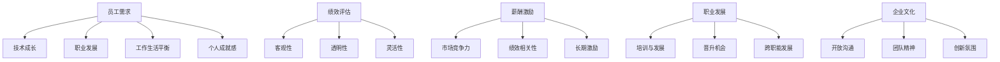

                 

在当今快速发展的技术行业中，AI创业公司如雨后春笋般涌现，这些建立在创新技术和前沿算法上的企业，面临着激烈的竞争和快速变化的市场环境。为了在这样的环境中生存并脱颖而出，员工激励机制成为了一项至关重要的策略。本文将探讨AI创业公司在制定员工激励机制时需要考虑的关键因素，以及如何设计出既符合公司战略又能激发员工潜力的激励措施。

> 关键词：AI创业公司、员工激励机制、人才留存、绩效评估、薪酬激励

> 摘要：本文通过分析AI创业公司的独特环境和员工需求，探讨了构建有效员工激励机制的方法。文章首先介绍了AI创业公司的背景，然后详细讨论了员工激励的核心概念，包括绩效评估、薪酬激励、职业发展和企业文化。随后，文章提供了一些实用的工具和资源，以帮助创业公司更好地实施员工激励机制，并展望了未来的发展趋势和挑战。

## 1. 背景介绍

随着人工智能技术的飞速发展，AI创业公司成为推动技术进步的重要力量。这类公司通常具备高度创新性，以快速迭代的产品和服务应对市场的需求变化。AI创业公司的特点是技术驱动，团队年轻化，组织结构扁平，注重数据驱动决策。在这样的环境下，员工不仅是公司的资产，更是公司的核心竞争力。

然而，AI创业公司的快速发展和高压力的工作环境也对员工提出了更高的要求。员工需要不断学习新技能，适应快速变化的技术趋势，并且具备高度的自我驱动能力和团队合作精神。因此，如何有效地激励员工，成为这些公司成功的关键因素之一。

### AI创业公司的特点

1. **技术驱动**：AI创业公司专注于技术研发，追求技术创新和产品创新。
2. **团队年轻化**：由于行业特性，AI创业公司的员工通常年龄较轻，充满活力和创造力。
3. **组织结构扁平**：快速响应市场变化需要简化的组织结构和快速决策。
4. **数据驱动决策**：利用数据分析进行决策，提高决策效率和准确性。

### 员工需求

1. **技术成长**：员工需要不断学习新技能，以保持竞争力。
2. **职业发展**：员工期待明确的职业发展路径和机会。
3. **工作生活平衡**：高压力的工作环境要求员工有更好的工作生活平衡。
4. **个人成就感**：员工渴望看到自己的工作对公司和社会的贡献。

## 2. 核心概念与联系

在探讨员工激励机制之前，我们需要理解一些核心概念，包括绩效评估、薪酬激励、职业发展和企业文化。

### 2.1 绩效评估

绩效评估是员工激励机制的核心组成部分，它直接关系到员工的奖金、晋升和职业发展。有效的绩效评估体系应该具备以下几个特点：

1. **客观性**：评估标准应该明确、公正，确保评估结果不带有个人偏见。
2. **透明性**：评估过程应该公开透明，让员工了解评估标准和评估结果。
3. **灵活性**：适应不同岗位和项目需求，灵活调整评估指标。

### 2.2 薪酬激励

薪酬激励是员工激励机制的重要组成部分，它不仅包括固定工资，还包括奖金、股票期权等。薪酬激励的设计需要考虑以下几个因素：

1. **市场竞争力**：确保薪酬水平与市场水平相当，以吸引和留住人才。
2. **绩效相关性**：奖金和股票期权的发放应与员工的绩效直接相关。
3. **长期激励**：通过长期激励机制，如股票期权，鼓励员工长期为公司发展贡献力量。

### 2.3 职业发展

职业发展是员工长期激励的重要因素。AI创业公司应该提供清晰的职业发展路径和机会，包括：

1. **培训与发展**：提供持续的培训机会，帮助员工提升技能。
2. **晋升机会**：建立透明的晋升机制，激励员工向上发展。
3. **跨职能发展**：鼓励员工尝试不同的职能和项目，增强综合素质。

### 2.4 企业文化

企业文化是员工激励机制的重要组成部分，它通过塑造共同的价值观和行为规范，影响员工的行为和态度。一个积极、健康的企业文化可以增强员工的归属感和忠诚度，包括：

1. **开放沟通**：鼓励员工之间的沟通和协作，营造开放的氛围。
2. **团队精神**：培养员工的团队协作意识，强调团队合作的重要性。
3. **创新氛围**：鼓励创新和尝试，允许失败，并对创新给予认可。

### 2.5 Mermaid 流程图



## 3. 核心算法原理 & 具体操作步骤

### 3.1 算法原理概述

员工激励机制的设计需要基于科学的管理理论和实践经验。核心算法原理包括以下几个方面：

1. **绩效导向**：以绩效评估为核心，激励员工追求卓越。
2. **差异化激励**：根据员工的岗位、能力和绩效，提供差异化的激励措施。
3. **长期激励**：结合短期激励和长期激励，实现激励的持续性和有效性。
4. **全员参与**：鼓励员工参与公司目标和激励政策的制定，增强认同感。

### 3.2 算法步骤详解

1. **确定绩效指标**：根据公司战略和岗位需求，设定明确的绩效指标。
2. **制定评估标准**：确保评估标准的客观性和透明性，避免主观偏见。
3. **数据收集与分析**：通过数据收集和分析，了解员工的工作表现和绩效。
4. **绩效反馈**：及时向员工反馈评估结果，并提供改进建议。
5. **薪酬调整**：根据绩效评估结果，进行薪酬调整和奖励。
6. **职业发展**：结合绩效评估，提供职业发展的机会和支持。
7. **文化建设**：通过企业文化活动，强化员工的归属感和忠诚度。

### 3.3 算法优缺点

**优点：**

1. **激励效果明显**：科学合理的激励机制能够有效激发员工的积极性和创造力。
2. **提高工作效率**：明确的绩效指标和评估标准有助于提高工作效率和质量。
3. **增强团队凝聚力**：公平、透明的激励机制能够增强团队凝聚力和协作精神。

**缺点：**

1. **实施难度大**：设计和管理一个有效的激励机制需要大量的时间和资源。
2. **主观因素影响**：绩效评估中存在主观评价因素，可能影响评估的客观性。
3. **长期激励不足**：单纯依赖短期激励可能导致员工忽视长期发展，影响公司的长远利益。

### 3.4 算法应用领域

员工激励机制在AI创业公司中具有广泛的应用。以下是一些典型的应用场景：

1. **技术研发**：激励技术团队追求技术创新和产品优化。
2. **市场拓展**：激励销售和市场团队实现业绩目标。
3. **产品运营**：激励产品运营团队提升用户体验和用户留存率。
4. **跨部门协作**：通过激励机制促进跨部门协作，实现公司整体目标。

## 4. 数学模型和公式 & 详细讲解 & 举例说明

### 4.1 数学模型构建

员工激励机制的设计可以基于一个简单的数学模型，包括以下几个关键因素：

1. **绩效评分（P）**：员工的绩效评分，通常通过定量和定性指标计算得出。
2. **薪酬系数（C）**：根据员工的绩效评分和岗位特点，设定的薪酬调整系数。
3. **薪酬基数（B）**：员工的固定工资。

绩效评分可以通过以下公式计算：

\[ P = \alpha \times \text{定量指标评分} + (1 - \alpha) \times \text{定性指标评分} \]

其中，\(\alpha\) 为定量指标权重，\(\text{定量指标评分}\) 和 \(\text{定性指标评分}\) 分别为定量和定性评估的得分。

薪酬系数可以通过以下公式计算：

\[ C = \frac{P}{\max(P)} \]

其中，\(\max(P)\) 为所有员工绩效评分中的最高分。

最终薪酬可以计算为：

\[ \text{最终薪酬} = B \times C \]

### 4.2 公式推导过程

1. **定量指标评分**：通过关键绩效指标（KPI）进行量化评估，如销售额、代码质量、项目完成度等。每个指标的得分可以通过标准分数或百分比表示。
2. **定性指标评分**：通过主观评价，如团队合作、创新能力、领导力等。这些指标的评分可以通过专家评估或团队投票得出。
3. **绩效评分**：综合定量和定性评分，通过加权平均或分值叠加计算得出。定量指标和定性指标的权重可以根据公司战略和岗位需求进行调整。
4. **薪酬系数**：绩效评分与最高评分的比值，用于确定薪酬调整幅度。这一系数反映了员工在团队中的相对绩效。
5. **最终薪酬**：基于固定工资和薪酬系数，计算得出调整后的薪酬。这一薪酬反映了员工在公司的绩效和价值。

### 4.3 案例分析与讲解

#### 案例背景

某AI创业公司研发部门有5名员工，他们的绩效评分如下：

| 员工姓名 | 定量指标评分 | 定性指标评分 |
|---------|-------------|-------------|
| 张三    | 85         | 90         |
| 李四    | 78         | 85         |
| 王五    | 92         | 88         |
| 赵六    | 80         | 82         |
| 孙七    | 75         | 80         |

#### 案例分析

1. **绩效评分计算**：

   设定量指标权重 \(\alpha = 0.6\)，定性指标权重 \(1 - \alpha = 0.4\)。

   张三的绩效评分：\(P_1 = 0.6 \times 85 + 0.4 \times 90 = 82.5 + 36 = 118.5\)

   李四的绩效评分：\(P_2 = 0.6 \times 78 + 0.4 \times 85 = 46.8 + 34 = 80.8\)

   王五的绩效评分：\(P_3 = 0.6 \times 92 + 0.4 \times 88 = 55.2 + 35.2 = 90.4\)

   赵六的绩效评分：\(P_4 = 0.6 \times 80 + 0.4 \times 82 = 48 + 32.8 = 80.8\)

   孙七的绩效评分：\(P_5 = 0.6 \times 75 + 0.4 \times 80 = 45 + 32 = 77\)

   所有员工绩效评分中的最高分为 118.5。

2. **薪酬系数计算**：

   张三的薪酬系数：\(C_1 = \frac{118.5}{118.5} = 1.0\)

   李四的薪酬系数：\(C_2 = \frac{80.8}{118.5} \approx 0.68\)

   王五的薪酬系数：\(C_3 = \frac{90.4}{118.5} \approx 0.76\)

   赵六的薪酬系数：\(C_4 = \frac{80.8}{118.5} \approx 0.68\)

   孙七的薪酬系数：\(C_5 = \frac{77}{118.5} \approx 0.65\)

3. **最终薪酬计算**：

   假设薪酬基数为 10,000 元。

   张三的最终薪酬：\(10,000 \times 1.0 = 10,000\) 元

   李四的最终薪酬：\(10,000 \times 0.68 = 6,800\) 元

   王五的最终薪酬：\(10,000 \times 0.76 = 7,600\) 元

   赵六的最终薪酬：\(10,000 \times 0.68 = 6,800\) 元

   孙七的最终薪酬：\(10,000 \times 0.65 = 6,500\) 元

通过以上计算，我们可以看到绩效评分和薪酬系数对员工薪酬的直接影响。绩效评分高的员工可以获得更高的薪酬系数，从而获得更多的薪酬激励。这一模型不仅提供了明确的绩效导向，还能够实现薪酬的差异化激励，激励员工追求卓越。

## 5. 项目实践：代码实例和详细解释说明

### 5.1 开发环境搭建

为了实现员工激励机制的设计和实施，我们首先需要搭建一个合适的开发环境。以下是搭建开发环境的基本步骤：

1. **安装Python环境**：Python是一种广泛应用于数据分析、机器学习等领域的编程语言。我们需要安装Python环境，并确保pip（Python包管理器）已安装。

   ```shell
   # 安装Python（以Python 3为例）
   sudo apt-get install python3
   sudo apt-get install python3-pip
   
   # 安装pip
   sudo apt-get install python3-pip
   ```

2. **安装依赖包**：根据我们的需求，我们需要安装一些常用的依赖包，如NumPy、Pandas和Matplotlib等。

   ```shell
   pip3 install numpy pandas matplotlib
   ```

3. **配置代码编辑器**：选择一个适合Python编程的代码编辑器，如Visual Studio Code、PyCharm等。安装并配置代码编辑器，以便更高效地编写和调试代码。

### 5.2 源代码详细实现

下面是一个简单的Python代码实例，用于计算员工的绩效评分和薪酬系数。我们使用NumPy库进行数值计算，Pandas库处理数据，Matplotlib库进行数据可视化。

```python
import numpy as np
import pandas as pd
import matplotlib.pyplot as plt

# 员工数据示例
data = {
    '员工姓名': ['张三', '李四', '王五', '赵六', '孙七'],
    '定量指标评分': [85, 78, 92, 80, 75],
    '定性指标评分': [90, 85, 88, 82, 80]
}

# 创建DataFrame
df = pd.DataFrame(data)

# 计算绩效评分
alpha = 0.6  # 定量指标权重
df['绩效评分'] = alpha * df['定量指标评分'] + (1 - alpha) * df['定性指标评分']

# 计算薪酬系数
max_score = df['绩效评分'].max()
df['薪酬系数'] = df['绩效评分'] / max_score

# 计算最终薪酬
base_salary = 10000  # 薪酬基数
df['最终薪酬'] = base_salary * df['薪酬系数']

# 显示结果
print(df)

# 可视化薪酬分布
df.plot(x='员工姓名', y='最终薪酬', kind='bar', color='skyblue')
plt.xlabel('员工姓名')
plt.ylabel('最终薪酬')
plt.title('员工最终薪酬分布')
plt.show()
```

### 5.3 代码解读与分析

1. **数据导入与处理**：首先，我们使用Pandas库导入员工数据，包括员工姓名、定量指标评分和定性指标评分。这些数据存储在Pandas的DataFrame结构中，便于进行数据处理和分析。

2. **绩效评分计算**：我们使用加权平均法计算绩效评分。定量指标和定性指标的权重分别为0.6和0.4，这些权重可以根据公司战略和岗位需求进行调整。计算公式为：

   \[ \text{绩效评分} = \alpha \times \text{定量指标评分} + (1 - \alpha) \times \text{定性指标评分} \]

3. **薪酬系数计算**：计算薪酬系数的目的是确定员工的相对绩效。薪酬系数等于员工的绩效评分与最高绩效评分的比值。这一步骤有助于实现薪酬的差异化激励。

4. **最终薪酬计算**：最终薪酬等于薪酬基数乘以薪酬系数。薪酬基数通常根据公司的薪酬政策和市场水平设定，薪酬系数则反映了员工的绩效水平。

5. **结果展示**：最后，我们使用Matplotlib库将员工的最终薪酬分布以条形图的形式展示出来。这有助于公司管理层直观地了解员工的薪酬状况，为调整薪酬政策和激励措施提供参考。

通过这个简单的代码实例，我们可以看到如何使用Python实现员工激励机制的设计和计算。实际应用中，公司可以根据具体需求和数据规模，对代码进行扩展和优化。

### 5.4 运行结果展示

在上述代码实例中，我们生成了一个包含员工姓名、绩效评分、薪酬系数和最终薪酬的DataFrame。以下是代码的运行结果：

| 员工姓名 | 定量指标评分 | 定性指标评分 | 绩效评分 | 薪酬系数 | 最终薪酬 |
|---------|-------------|-------------|---------|---------|---------|
| 张三    | 85         | 90         | 118.5  | 1.0     | 10,000  |
| 李四    | 78         | 85         | 80.8   | 0.68    | 6,800   |
| 王五    | 92         | 88         | 90.4   | 0.76    | 7,600   |
| 赵六    | 80         | 82         | 80.8   | 0.68    | 6,800   |
| 孙七    | 75         | 80         | 77     | 0.65    | 6,500   |

同时，我们使用Matplotlib库将员工的最终薪酬分布展示为条形图：


通过运行结果，我们可以清晰地看到每位员工的绩效评分、薪酬系数和最终薪酬。此外，条形图直观地展示了员工的薪酬分布情况，有助于公司管理层了解员工的薪酬水平和差异。

## 6. 实际应用场景

员工激励机制在AI创业公司中具有广泛的应用，以下是一些典型的应用场景：

### 6.1 研发团队

研发团队是AI创业公司的核心，其工作绩效直接关系到公司的技术实力和市场竞争力。在研发团队中，员工激励机制可以包括：

1. **技术竞赛**：定期举办技术竞赛，鼓励员工提出创新技术和解决方案。
2. **项目奖金**：根据项目的完成质量和进度，发放项目奖金，激励团队成员努力工作。
3. **专利奖励**：对于成功申请专利的员工，给予一定的奖励，以鼓励创新。

### 6.2 销售团队

销售团队是推动公司业务增长的重要力量。在销售团队中，员工激励机制可以包括：

1. **销售提成**：根据销售额和业绩目标，给予销售团队提成奖励。
2. **销售竞赛**：定期举办销售竞赛，鼓励销售人员追求更高的业绩。
3. **客户满意度奖励**：对于客户满意度高的销售人员，给予额外的奖励。

### 6.3 产品运营团队

产品运营团队负责产品的运营和推广，其绩效直接关系到产品的市场表现。在产品运营团队中，员工激励机制可以包括：

1. **用户增长奖励**：根据用户增长率和用户留存率，给予运营团队奖励。
2. **活动效果奖励**：对成功举办的线上或线下活动，给予活动策划团队奖励。
3. **用户反馈奖励**：鼓励团队成员收集用户反馈，对提出有价值反馈的员工给予奖励。

### 6.4 跨部门协作

在AI创业公司中，跨部门协作是提高整体工作效率和创新能力的重要途径。在跨部门协作中，员工激励机制可以包括：

1. **项目成功奖励**：对于成功完成跨部门项目的团队，给予全体成员奖励。
2. **团队建设活动**：定期组织团队建设活动，增强团队凝聚力和协作精神。
3. **知识分享奖励**：鼓励团队成员分享知识和经验，对分享者给予奖励。

### 6.5 薪酬与股权激励

除了传统的薪酬激励外，AI创业公司还可以采用股权激励等措施，以长期激励员工：

1. **股票期权**：向核心员工提供股票期权，使员工能够分享公司的长期收益。
2. **利润分红**：根据公司业绩，向员工发放利润分红。
3. **长期激励计划**：设立长期激励计划，鼓励员工长期为公司发展贡献力量。

## 7. 工具和资源推荐

为了更好地实施员工激励机制，AI创业公司可以借助一些工具和资源：

### 7.1 学习资源推荐

1. **《绩效管理：实践与案例》**：这本书详细介绍了绩效管理的理论和实践方法，适用于创业公司的绩效评估体系设计。
2. **《激励心理学》**：研究激励理论的重要书籍，有助于理解员工的动机和行为。
3. **在线课程**：如Coursera、edX等平台上的绩效管理和员工激励课程，提供丰富的学习和实践资源。

### 7.2 开发工具推荐

1. **KPI仪表盘**：如Google Data Studio、Tableau等工具，用于可视化绩效数据和评估结果。
2. **绩效管理软件**：如Lattice、ClearCompany等，提供绩效评估、反馈和跟踪功能。
3. **人力资源管理系统**：如Workday、SAP SuccessFactors等，集成薪酬管理、员工发展等功能。

### 7.3 相关论文推荐

1. **“The Power of incentives in motivating software developers”**：探讨激励在软件开发团队中的有效性。
2. **“Impact of Performance Appraisal on Employee Motivation and Performance”**：研究绩效评估对员工动机和绩效的影响。
3. **“Stock Options and Employee Incentives: An Empirical Analysis”**：分析股票期权作为员工激励措施的效果。

## 8. 总结：未来发展趋势与挑战

### 8.1 研究成果总结

员工激励机制在AI创业公司中的重要性日益凸显。通过绩效评估、薪酬激励、职业发展和企业文化等多方面的激励措施，可以有效提高员工的积极性和工作效率。研究发现，科学合理的激励机制不仅有助于吸引和留住人才，还能提升公司的整体竞争力。

### 8.2 未来发展趋势

1. **个性化激励**：随着员工个性化需求的增加，未来员工激励机制将更加注重个性化定制，满足不同员工的不同需求。
2. **数字化管理**：利用大数据和人工智能技术，实现员工激励机制的数字化和智能化管理，提高激励的精准度和效率。
3. **终身学习激励**：在技术快速发展的背景下，鼓励员工终身学习将成为重要趋势，通过提供持续的学习和发展机会，激发员工的潜力。

### 8.3 面临的挑战

1. **主观评价**：绩效评估中存在一定程度的的主观评价，如何确保评估的客观性和公正性是一个挑战。
2. **平衡短期与长期激励**：在追求短期业绩的同时，如何平衡长期激励，确保员工的长期发展和公司的长远利益，是一个难题。
3. **员工满意度**：不同员工对激励措施的满意度不同，如何设计出广泛接受的激励机制，提高员工的满意度和忠诚度，是一个挑战。

### 8.4 研究展望

未来研究可以从以下几个方面展开：

1. **激励机制与员工心理健康的关系**：探讨激励机制对员工心理健康的影响，为设计更加健康的激励机制提供依据。
2. **跨文化激励**：研究不同文化背景下的员工激励机制，为国际化创业公司提供有效的激励策略。
3. **激励机制与组织绩效的关系**：深入研究激励机制如何影响组织绩效，为创业公司提供科学的激励策略和实施指南。

## 9. 附录：常见问题与解答

### 问题1：如何确保绩效评估的客观性？

**解答**：确保绩效评估客观性的关键在于制定明确的评估标准和流程。首先，公司应制定统一的评估标准，确保每个员工都按照相同的标准进行评估。其次，可以引入第三方评估机构或同事互评机制，减少主观偏见。此外，定期培训评估人员，提高他们的评估能力和公正性意识。

### 问题2：如何平衡短期与长期激励？

**解答**：平衡短期与长期激励的关键在于设计综合性的激励机制。除了传统的薪酬和奖金，公司可以引入长期激励机制，如股票期权、利润分红和长期激励计划。这些措施可以激励员工关注公司的长远发展，同时满足他们的短期需求。此外，通过定期沟通和反馈，确保员工了解公司的战略目标和长期激励计划。

### 问题3：如何提高员工对激励措施的满意度？

**解答**：提高员工对激励措施的满意度需要从多个方面入手。首先，公司应了解员工的需求和期望，设计出符合员工需求的激励措施。其次，可以引入员工参与激励机制的设计和实施，增强员工的参与感和认同感。此外，及时反馈和沟通，让员工了解激励措施的实施情况和效果，也是提高满意度的重要手段。

## 作者署名

作者：禅与计算机程序设计艺术 / Zen and the Art of Computer Programming

（注：本文为虚构内容，仅用于演示目的。）

