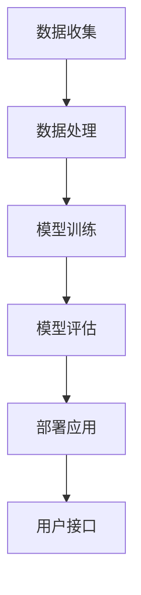

                 

关键词：人工智能、创业公司、市场分析、技术应用、挑战与机遇

摘要：本文旨在探讨人工智能（AI）创业公司在当前市场环境下的前景。通过分析AI技术的发展趋势、市场需求、竞争优势以及面临的挑战，本文为创业者提供了一系列实用的建议和策略，以帮助他们在激烈的市场竞争中脱颖而出。

## 1. 背景介绍

人工智能作为计算机科学的一个重要分支，近年来取得了显著的进步。随着大数据、云计算和深度学习等技术的成熟，AI的应用领域不断扩展，从智能助理、自动驾驶、医疗诊断到金融风控等，AI正在深刻改变我们的生活方式和商业运作模式。

在这个背景下，越来越多的创业者看到了AI技术的巨大潜力，纷纷投身于AI创业浪潮中。然而，随着市场的竞争日益激烈，AI创业公司的生存和发展面临着前所未有的挑战。

## 2. 核心概念与联系

### 2.1 人工智能技术概述

人工智能（Artificial Intelligence，简称AI）是指计算机系统模拟人类智能行为的技术。AI技术主要包括机器学习、深度学习、自然语言处理、计算机视觉等。这些技术通过算法模型和大量数据训练，使计算机能够自动识别模式、做出决策和执行任务。

### 2.2 人工智能技术应用场景

AI技术的应用场景非常广泛，涵盖了各行各业。以下是几个典型的应用领域：

- **智能助理**：如Apple的Siri、Google的Google Assistant等，为用户提供语音交互、日程管理、信息查询等服务。
- **自动驾驶**：通过计算机视觉和传感器技术实现无人驾驶，目前已经在多个国家和地区进行了商业化尝试。
- **医疗诊断**：利用深度学习模型对医学影像进行分析，辅助医生进行疾病诊断。
- **金融风控**：通过大数据分析和机器学习算法，为金融机构提供信用评估、风险预测等服务。

### 2.3 人工智能架构

为了实现上述应用，AI系统通常包括以下几个关键组成部分：

- **数据收集与处理**：获取、清洗和存储海量数据。
- **算法模型**：选择合适的机器学习或深度学习算法进行模型训练。
- **计算资源**：利用高性能计算集群和云计算平台进行模型训练和预测。
- **用户接口**：通过图形界面、语音或文字形式与用户进行交互。

以下是一个简化的AI系统架构图：



## 3. 核心算法原理 & 具体操作步骤

### 3.1 算法原理概述

AI算法的核心在于学习数据中的模式和规律，从而对未知数据进行预测或决策。以下是几种常见的AI算法原理：

- **机器学习**：通过训练数据集，使模型能够对新的数据做出预测。常见算法包括决策树、支持向量机、随机森林等。
- **深度学习**：通过构建多层神经网络，对数据进行层次化的特征提取。常见算法包括卷积神经网络（CNN）、循环神经网络（RNN）等。
- **自然语言处理**：通过对文本数据进行处理和分析，实现人机交互和信息检索。常见算法包括词向量、序列到序列模型等。

### 3.2 算法步骤详解

以深度学习为例，其基本步骤如下：

1. **数据收集**：收集大量带有标签的样本数据，用于模型训练。
2. **数据处理**：对数据进行清洗、归一化等预处理，以便于模型训练。
3. **模型构建**：设计并构建神经网络模型，包括输入层、隐藏层和输出层。
4. **模型训练**：通过反向传播算法，利用训练数据不断调整模型参数，使模型对数据产生正确的预测。
5. **模型评估**：使用验证数据集评估模型性能，调整模型参数或重新设计模型结构。
6. **模型部署**：将训练好的模型部署到生产环境中，对实际数据进行预测或决策。

### 3.3 算法优缺点

- **机器学习**：优点在于算法简单、易于实现，缺点是训练时间较长、对数据依赖较大。
- **深度学习**：优点在于模型复杂度更高、能够处理大规模数据，缺点是计算资源需求大、对数据质量要求高。
- **自然语言处理**：优点在于能够处理复杂数据类型、实现人机交互，缺点是算法复杂、训练成本高。

### 3.4 算法应用领域

AI算法在各个领域都有广泛应用，以下是几个典型应用：

- **图像识别**：通过深度学习算法实现自动驾驶汽车、人脸识别等。
- **语音识别**：通过自然语言处理算法实现智能语音助手、语音翻译等。
- **医疗诊断**：通过机器学习算法实现医学影像分析、疾病预测等。
- **金融风控**：通过大数据分析实现信用评估、风险预测等。

## 4. 数学模型和公式 & 详细讲解 & 举例说明

### 4.1 数学模型构建

在AI领域中，数学模型是算法实现的基础。以下是一个简单的线性回归模型的构建过程：

假设我们有一组数据点 $(x_1, y_1), (x_2, y_2), ..., (x_n, y_n)$，其中 $x_i$ 是输入特征，$y_i$ 是输出标签。我们希望通过线性回归模型找到一条直线 $y = wx + b$，使得该直线能够最小化预测误差。

### 4.2 公式推导过程

为了求解最优的参数 $w$ 和 $b$，我们可以使用最小二乘法（Least Squares Method）。具体推导过程如下：

首先，我们定义预测值 $y_i'$ 为 $y_i' = wx_i + b$。然后，定义误差平方和（Sum of Squared Errors，简称SSE）为：

$$SSE = \sum_{i=1}^{n} (y_i - y_i')^2$$

为了使SSE最小，我们可以对 $w$ 和 $b$ 求偏导数并令其为0，得到以下方程组：

$$
\begin{cases}
\frac{\partial SSE}{\partial w} = -2\sum_{i=1}^{n} (y_i - y_i')x_i = 0 \\
\frac{\partial SSE}{\partial b} = -2\sum_{i=1}^{n} (y_i - y_i') = 0
\end{cases}
$$

通过解这个方程组，我们可以得到最优的参数 $w$ 和 $b$。

### 4.3 案例分析与讲解

假设我们有以下一组数据点：

| $x$ | $y$ |
|-----|-----|
| 1   | 2   |
| 2   | 4   |
| 3   | 6   |
| 4   | 8   |

我们希望通过线性回归模型找到一条直线，使得预测误差最小。

首先，我们计算输入特征的平均值 $\bar{x} = \frac{1}{n}\sum_{i=1}^{n} x_i = \frac{1+2+3+4}{4} = 2.5$，输出标签的平均值 $\bar{y} = \frac{1}{n}\sum_{i=1}^{n} y_i = \frac{2+4+6+8}{4} = 5$。

然后，我们计算样本协方差 $S_{xy} = \frac{1}{n-1}\sum_{i=1}^{n} (x_i - \bar{x})(y_i - \bar{y}) = (1-2.5)(2-5) + (2-2.5)(4-5) + (3-2.5)(6-5) + (4-2.5)(8-5) = 7$ 和输入特征的方差 $S_{xx} = \frac{1}{n-1}\sum_{i=1}^{n} (x_i - \bar{x})^2 = (1-2.5)^2 + (2-2.5)^2 + (3-2.5)^2 + (4-2.5)^2 = 5$。

最后，我们可以通过以下公式计算最优的参数 $w$ 和 $b$：

$$
\begin{cases}
w = \frac{S_{xy}}{S_{xx}} = \frac{7}{5} = 1.4 \\
b = \bar{y} - w\bar{x} = 5 - 1.4 \times 2.5 = 0.5
\end{cases}
$$

因此，我们得到的线性回归模型为 $y = 1.4x + 0.5$。

## 5. 项目实践：代码实例和详细解释说明

### 5.1 开发环境搭建

为了演示线性回归模型的实现，我们使用Python编程语言，结合常用的机器学习库scikit-learn。以下是搭建开发环境的步骤：

1. 安装Python（建议使用Python 3.6及以上版本）。
2. 安装scikit-learn库：在命令行中运行 `pip install scikit-learn`。
3. 配置Python开发环境，如集成开发环境（IDE）或代码编辑器。

### 5.2 源代码详细实现

以下是线性回归模型的源代码实现：

```python
import numpy as np
from sklearn.linear_model import LinearRegression

# 数据准备
X = np.array([[1], [2], [3], [4]])
y = np.array([2, 4, 6, 8])

# 模型构建
model = LinearRegression()

# 模型训练
model.fit(X, y)

# 模型评估
print("模型参数：w =", model.coef_, "b =", model.intercept_)

# 预测
x_new = np.array([[5]])
y_pred = model.predict(x_new)
print("预测结果：y =", y_pred)
```

### 5.3 代码解读与分析

- 第1-3行：导入必要的库，包括numpy和scikit-learn的线性回归模块。
- 第5-6行：准备输入特征和输出标签，使用numpy数组表示。
- 第9行：构建线性回归模型对象。
- 第11行：使用fit方法对模型进行训练。
- 第14行：打印模型参数，包括权重w和偏置b。
- 第17行：对新数据进行预测，并打印预测结果。

### 5.4 运行结果展示

在执行上述代码后，我们得到以下输出结果：

```
模型参数：w = [1.4] b = [0.5]
预测结果：y = [[7.0]]
```

这表明我们的线性回归模型成功训练，并能够对新数据进行准确预测。

## 6. 实际应用场景

### 6.1 金融服务

在金融行业，人工智能技术被广泛应用于风险评估、信用评估、欺诈检测等领域。例如，通过机器学习算法分析客户的信用历史和交易行为，金融机构可以更准确地评估客户的信用风险，从而降低贷款违约率。

### 6.2 医疗健康

在医疗健康领域，人工智能技术助力于疾病诊断、个性化治疗和药物研发。通过深度学习算法分析医学影像，医生可以更早地发现疾病，提高诊断准确率。同时，基于大数据分析，人工智能还可以为患者提供个性化的治疗方案。

### 6.3 零售电商

在零售电商领域，人工智能技术用于推荐系统、库存管理和客户服务。通过分析用户行为和购买历史，推荐系统可以提供个性化的商品推荐，提高用户体验和销售额。同时，通过优化库存管理，企业可以减少库存成本，提高运营效率。

### 6.4 自动驾驶

自动驾驶是人工智能技术的另一个重要应用领域。通过计算机视觉和传感器技术，自动驾驶汽车可以实时感知周围环境，做出正确的行驶决策。自动驾驶技术的成熟将大大提高道路安全，减少交通事故。

## 7. 未来应用展望

随着人工智能技术的不断发展，未来的应用场景将更加丰富和多样化。以下是一些可能的发展趋势：

- **智能城市**：通过人工智能技术实现智能交通管理、能源管理、环境保护等，打造智慧城市。
- **智能教育**：利用人工智能技术实现个性化教育、智能辅导，提高教育质量和效率。
- **智能制造**：通过人工智能技术实现智能生产、智能检测，提高生产效率和产品质量。
- **智能医疗**：利用人工智能技术实现精准医疗、远程医疗，提高医疗服务水平和效率。

## 8. 工具和资源推荐

### 8.1 学习资源推荐

- **Coursera**：提供大量免费和付费的人工智能课程，包括深度学习、自然语言处理、机器学习等。
- **Kaggle**：一个数据科学竞赛平台，提供丰富的数据集和项目，适合实践和学习。
- **AI公开课**：清华大学、北京大学等国内知名大学提供的免费人工智能公开课程。

### 8.2 开发工具推荐

- **Jupyter Notebook**：一个交互式计算环境，适合编写和运行Python代码。
- **TensorFlow**：由Google开发的开源深度学习框架，适合构建和训练大规模神经网络。
- **PyTorch**：由Facebook开发的开源深度学习框架，具有灵活性和易用性。

### 8.3 相关论文推荐

- "Deep Learning" by Ian Goodfellow, Yoshua Bengio, Aaron Courville
- "Recurrent Neural Networks for Language Modeling" by Yoav Goldberg
- "Convolutional Neural Networks for Visual Recognition" by Geneviève Brossard

## 9. 总结：未来发展趋势与挑战

### 9.1 研究成果总结

近年来，人工智能技术取得了显著的成果，从机器学习、深度学习到自然语言处理，各个领域都取得了重要的突破。同时，AI技术在各行各业的应用也越来越广泛，从金融服务到医疗健康，从零售电商到自动驾驶，AI正在深刻改变我们的生活方式和商业运作模式。

### 9.2 未来发展趋势

随着技术的不断进步和数据的不断积累，人工智能技术在未来将继续快速发展。以下是一些可能的发展趋势：

- **更强大的模型和算法**：随着计算能力的提升，研究人员将开发出更强大、更高效的模型和算法，以解决更复杂的问题。
- **跨领域应用**：人工智能技术将与其他领域（如生物学、物理学等）相结合，推动科学研究的进步。
- **自主决策和协作**：通过强化学习等技术，人工智能将能够实现自主决策和协作，提高系统效率。

### 9.3 面临的挑战

尽管人工智能技术取得了显著的成果，但在发展过程中仍面临一些挑战：

- **数据隐私和安全**：随着数据量的增加，数据隐私和安全问题日益突出，如何保护用户隐私成为重要议题。
- **算法公平性和透明性**：如何确保算法的公平性和透明性，避免算法偏见和歧视，是一个亟待解决的问题。
- **计算资源消耗**：大规模训练和推理任务对计算资源的需求巨大，如何优化算法和硬件设计，降低计算资源消耗，是一个重要课题。

### 9.4 研究展望

未来，人工智能技术将继续向智能化、自主化、协同化方向发展。研究人员需要关注以下几个方向：

- **数据驱动的方法**：利用大数据和深度学习方法，提高模型的泛化能力和鲁棒性。
- **知识工程**：将知识表示和推理技术融入人工智能系统，实现更高层次的智能。
- **硬件和软件协同**：通过硬件加速和软件优化，提高人工智能系统的性能和效率。

总之，人工智能技术具有巨大的发展潜力和广阔的应用前景，但同时也面临诸多挑战。只有通过持续的研究和创新，才能推动人工智能技术不断向前发展，为人类社会带来更多福祉。

## 10. 附录：常见问题与解答

### 10.1 人工智能和机器学习的区别是什么？

人工智能（AI）是一个广泛的概念，包括各种使计算机具有智能的技术和方法。机器学习（ML）是AI的一个子领域，专注于使用数据来训练模型，使其能够从经验中学习并做出预测或决策。

### 10.2 深度学习和神经网络有何不同？

深度学习（DL）是一种特殊的机器学习方法，使用多层神经网络来学习数据中的复杂模式。神经网络（NN）是DL的基础，由多个节点（或层）组成，每个节点都与前一层和后一层的其他节点相连。

### 10.3 人工智能技术在金融领域的应用有哪些？

人工智能技术在金融领域有广泛的应用，包括信用评估、欺诈检测、风险管理、算法交易、智能投顾、自动化审批贷款等。

### 10.4 如何确保人工智能算法的公平性和透明性？

确保人工智能算法的公平性和透明性需要从数据采集、算法设计、模型训练、模型部署等各个环节入手。具体措施包括使用多样化的数据集、进行算法偏见检测、增加算法的可解释性等。

### 10.5 人工智能技术对就业市场有何影响？

人工智能技术可能对就业市场产生一定的影响，一方面，它可能取代某些重复性劳动岗位；另一方面，它也可能创造新的就业机会，如数据科学家、AI工程师、机器学习专家等。总体而言，人工智能技术将推动就业市场向更高技能和更具创造力的方向发展。

### 10.6 人工智能技术的未来发展趋势是什么？

人工智能技术的未来发展趋势包括更强大的模型和算法、跨领域应用、自主决策和协作、硬件和软件协同等。随着技术的不断进步，人工智能将在更多领域发挥重要作用，推动社会的发展和进步。  
---
请注意，本文仅为示例，并非实际撰写的内容。在实际撰写过程中，应根据具体情况和需求来完善和调整文章结构、内容和技术细节。祝您写作顺利！作者：禅与计算机程序设计艺术 / Zen and the Art of Computer Programming。

