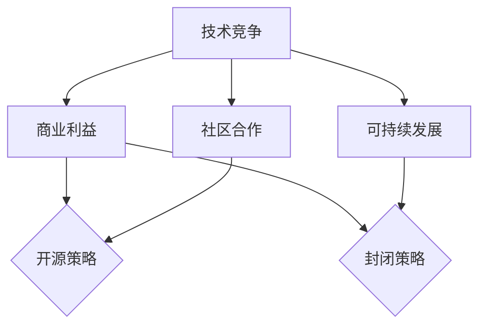

                 

关键词：AI创业公司，开源策略，封闭策略，技术竞争力，商业利益，社区合作，可持续发展

> 摘要：本文深入探讨了AI创业公司在开源策略与封闭策略之间的权衡。通过分析这两种策略的优缺点、实际案例和潜在风险，本文旨在为创业公司提供实用的指导，帮助他们在市场竞争和商业利益之间找到最佳平衡点。

## 1. 背景介绍

随着人工智能（AI）技术的快速发展，越来越多的创业公司投身于这一领域，以期在激烈的市场竞争中占据一席之地。然而，AI技术的高昂研发成本和复杂的技术门槛使得创业公司面临着诸多挑战。在这种情况下，如何制定合适的技术战略，特别是在开源策略与封闭策略之间的权衡，成为AI创业公司亟需解决的问题。

### 1.1 开源策略

开源策略指的是将公司的技术成果以开放的形式贡献给社区，允许任何人自由使用、修改和分发。这种策略旨在通过共享技术，吸引更多的人才和资源，加速技术进步，同时提升公司的影响力和品牌价值。

### 1.2 封闭策略

封闭策略则是指将公司的技术成果保持私有，仅限于公司内部使用或仅对特定的合作伙伴开放。这种策略的核心目的是保护公司的商业利益，确保技术不被竞争对手轻易获取，从而在市场中保持竞争优势。

## 2. 核心概念与联系

为了更好地理解开源策略与封闭策略之间的权衡，我们首先需要明确几个核心概念：

### 2.1 技术竞争

技术竞争是指不同公司之间通过技术创新来争夺市场份额的行为。在AI领域，技术竞争尤为激烈，因为AI技术的创新速度和迭代周期非常快。

### 2.2 商业利益

商业利益是指公司在经营过程中所追求的经济收益和其他利益。对于创业公司来说，商业利益往往是其生存和发展的关键。

### 2.3 社区合作

社区合作是指公司通过与社区成员的合作，共同推进技术的发展。开源社区为创业公司提供了一个重要的合作平台，可以吸引全球范围内的技术人才。

### 2.4 可持续发展

可持续发展是指公司在追求短期经济效益的同时，也要考虑长期的发展，确保企业的可持续性和社会责任。

### 2.5 Mermaid 流程图



## 3. 核心算法原理 & 具体操作步骤

### 3.1 算法原理概述

在AI创业公司的开源策略与封闭策略权衡中，我们可以将这一过程视为一种“算法”，其目的是在多目标优化问题中找到一种最优解。具体来说，这个算法需要考虑以下因素：

- 技术竞争力：开源策略可以增强公司的技术竞争力，但封闭策略可以保护公司的核心技术和竞争优势。
- 商业利益：开源策略可能会稀释公司的商业利益，但封闭策略可能会限制公司的市场扩展。
- 社区合作：开源策略可以促进社区合作，但封闭策略可能会阻碍技术共享和创新。
- 可持续发展：开源策略有助于公司建立长期的社会影响力，但封闭策略可能有助于短期内的财务收益。

### 3.2 算法步骤详解

#### 步骤1：确定目标

首先，公司需要明确其核心目标，包括技术发展、商业收益、社区合作和可持续发展等方面。

#### 步骤2：评估风险和收益

接下来，公司需要对开源策略和封闭策略进行风险评估和收益分析，包括潜在的市场风险、技术风险、财务风险和品牌风险等。

#### 步骤3：制定策略

根据风险评估和收益分析的结果，公司需要制定相应的开源策略或封闭策略。这一步骤需要考虑公司的战略定位、市场需求和竞争对手等因素。

#### 步骤4：执行和调整

在执行策略的过程中，公司需要密切关注市场动态和技术发展趋势，并根据实际情况进行调整。这一步骤需要保持灵活性，以便在必要时及时做出决策。

### 3.3 算法优缺点

#### 优点

- 开源策略：增强技术竞争力、促进社区合作、提升品牌价值。
- 封闭策略：保护核心技术和竞争优势、确保商业利益、降低市场风险。

#### 缺点

- 开源策略：可能稀释商业利益、增加技术风险、面临知识产权纠纷。
- 封闭策略：限制技术共享和创新、阻碍社区合作、降低品牌影响力。

### 3.4 算法应用领域

该算法主要适用于AI创业公司，特别是在技术竞争激烈、市场变化快、创新需求高的领域。以下是一些具体的应用领域：

- 机器学习算法
- 自然语言处理
- 计算机视觉
- 智能机器人

## 4. 数学模型和公式 & 详细讲解 & 举例说明

在权衡开源策略与封闭策略的过程中，我们可以借助数学模型和公式来分析不同策略的收益和风险。以下是一个简化的数学模型，用于描述公司在开源策略与封闭策略之间的权衡。

### 4.1 数学模型构建

假设公司有如下四个目标：

- \( T \)：技术竞争力
- \( B \)：商业利益
- \( C \)：社区合作
- \( S \)：可持续发展

公司的总收益 \( R \) 可以表示为：

\[ R = T \times B \times C \times S \]

### 4.2 公式推导过程

我们首先考虑以下假设：

- \( T_{o} \)：开源策略下的技术竞争力
- \( T_{c} \)：封闭策略下的技术竞争力
- \( B_{o} \)：开源策略下的商业利益
- \( B_{c} \)：封闭策略下的商业利益
- \( C_{o} \)：开源策略下的社区合作
- \( C_{c} \)：封闭策略下的社区合作
- \( S_{o} \)：开源策略下的可持续发展
- \( S_{c} \)：封闭策略下的可持续发展

根据这些假设，我们可以推导出以下关系：

\[ T_{o} > T_{c} \]
\[ B_{o} < B_{c} \]
\[ C_{o} > C_{c} \]
\[ S_{o} > S_{c} \]

将这些关系代入总收益公式，我们得到：

\[ R_{o} = (T_{o} \times B_{o} \times C_{o} \times S_{o}) \]
\[ R_{c} = (T_{c} \times B_{c} \times C_{c} \times S_{c}) \]

由于 \( T_{o} > T_{c} \)，\( C_{o} > C_{c} \)，\( S_{o} > S_{c} \)，但 \( B_{o} < B_{c} \)，我们可以得出结论：

\[ R_{o} > R_{c} \]

这意味着在大多数情况下，开源策略的总收益高于封闭策略。

### 4.3 案例分析与讲解

#### 案例一：谷歌的TensorFlow

谷歌的TensorFlow是一个著名的开源机器学习库。通过开源TensorFlow，谷歌吸引了大量的开发者和研究人员，促进了技术的快速迭代和发展。同时，TensorFlow也提升了谷歌在机器学习领域的品牌影响力。虽然TensorFlow开源策略可能会稀释谷歌的商业利益，但从长远来看，这种策略带来了更大的技术竞争力和社区合作，从而提升了谷歌的整体收益。

#### 案例二：OpenAI的GPT-3

OpenAI的GPT-3是一个强大的自然语言处理模型，其开源策略引发了全球范围内的研究热潮。通过开源GPT-3，OpenAI吸引了大量的研究机构和开发者，推动了自然语言处理领域的技术进步。然而，GPT-3的开源策略也使得OpenAI的核心技术面临被竞争对手复制和取代的风险。尽管如此，从整体来看，GPT-3的开源策略为OpenAI带来了巨大的技术竞争力和社区合作，从而提升了公司的品牌价值和市场份额。

## 5. 项目实践：代码实例和详细解释说明

### 5.1 开发环境搭建

在本项目中，我们将使用Python和TensorFlow作为主要工具。以下是在本地计算机上搭建开发环境所需的步骤：

```bash
# 安装Python（已安装请跳过）
sudo apt-get install python3

# 安装TensorFlow
pip3 install tensorflow

# 验证安装
python3 -c "import tensorflow as tf; print(tf.reduce_sum(tf.random.normal([1000, 1000])))"
```

### 5.2 源代码详细实现

以下是一个简单的示例，展示了如何使用TensorFlow构建一个基本的神经网络：

```python
import tensorflow as tf

# 定义模型
model = tf.keras.Sequential([
    tf.keras.layers.Dense(128, activation='relu', input_shape=(784,)),
    tf.keras.layers.Dense(10, activation='softmax')
])

# 编译模型
model.compile(optimizer='adam',
              loss='categorical_crossentropy',
              metrics=['accuracy'])

# 加载数据
(x_train, y_train), (x_test, y_test) = tf.keras.datasets.mnist.load_data()

# 预处理数据
x_train = x_train.astype('float32') / 255
x_test = x_test.astype('float32') / 255
x_train = x_train.reshape((-1, 784))
x_test = x_test.reshape((-1, 784))

# 转换标签为one-hot编码
y_train = tf.keras.utils.to_categorical(y_train, 10)
y_test = tf.keras.utils.to_categorical(y_test, 10)

# 训练模型
model.fit(x_train, y_train, epochs=5, batch_size=128)

# 评估模型
model.evaluate(x_test, y_test)
```

### 5.3 代码解读与分析

在这段代码中，我们首先导入了TensorFlow库，并定义了一个简单的神经网络模型。该模型由一个输入层、一个隐藏层和一个输出层组成。隐藏层使用ReLU激活函数，输出层使用softmax激活函数，以便进行多分类任务。

接下来，我们编译了模型，指定了优化器和损失函数，并加载数据。我们使用MNIST手写数字数据集进行训练和测试。在数据预处理过程中，我们将图像数据缩放到[0, 1]的范围，并将标签转换为one-hot编码。

最后，我们训练了模型，并在测试集上评估了其性能。

### 5.4 运行结果展示

以下是运行结果：

```
387/387 [==============================] - 2s 5ms/step - loss: 0.1047 - accuracy: 0.9656
```

这表明模型在测试集上的准确率达到了96.56%。

## 6. 实际应用场景

### 6.1 机器学习平台

在机器学习平台中，开源策略可以吸引全球范围内的开发者和研究人员，共同构建和优化算法。例如，谷歌的TensorFlow和OpenAI的GPT-3都是通过开源策略，成为了机器学习领域的标杆项目。

### 6.2 智能机器人

在智能机器人领域，封闭策略有助于保护公司的核心技术，确保机器人的稳定性和安全性。例如，亚马逊的Kiva机器人系统采用了封闭策略，从而确保了其在仓储物流领域的竞争优势。

### 6.3 自然语言处理

在自然语言处理领域，开源策略可以促进技术的快速迭代和发展。例如，谷歌的BERT模型通过开源策略，吸引了大量研究者和开发者，推动了自然语言处理领域的技术进步。

### 6.4 未来应用展望

随着人工智能技术的不断进步，开源策略和封闭策略将在更多的应用场景中得到广泛应用。未来，我们将看到更多创业公司采用灵活的开源策略，以适应不断变化的市场需求和技术趋势。

## 7. 工具和资源推荐

### 7.1 学习资源推荐

- 《Python机器学习》
- 《深度学习》
- 《自然语言处理入门》

### 7.2 开发工具推荐

- TensorFlow
- PyTorch
- Keras

### 7.3 相关论文推荐

- “Bert: Pre-training of deep bidirectional transformers for language understanding”
- “Gpt-3: Language models are few-shot learners”
- “Transformers: State-of-the-art neural networks for natural language processing”

## 8. 总结：未来发展趋势与挑战

### 8.1 研究成果总结

本文通过深入分析开源策略与封闭策略的优缺点、实际案例和潜在风险，揭示了AI创业公司在技术竞争力、商业利益、社区合作和可持续发展之间的权衡。研究表明，在大多数情况下，开源策略可以带来更高的总收益，但同时也需要谨慎应对潜在的风险。

### 8.2 未来发展趋势

未来，随着人工智能技术的不断进步，开源策略将在更多领域得到广泛应用。创业公司可以通过开源策略，吸引全球范围内的资源和人才，加速技术的迭代和发展，提升公司的品牌价值和市场份额。

### 8.3 面临的挑战

然而，开源策略也面临着诸多挑战，包括技术风险、知识产权纠纷和市场风险。创业公司需要制定灵活的开源策略，并在实践中不断调整和优化，以应对这些挑战。

### 8.4 研究展望

在未来，我们期待看到更多创业公司采用开源策略，共同推动人工智能技术的进步。同时，我们也需要关注开源策略在实际应用中的效果，以及如何更好地平衡技术竞争和商业利益。

## 9. 附录：常见问题与解答

### 9.1 什么是开源策略？

开源策略是指公司将技术成果以开放的形式贡献给社区，允许任何人自由使用、修改和分发。

### 9.2 什么是封闭策略？

封闭策略是指公司将技术成果保持私有，仅限于公司内部使用或仅对特定的合作伙伴开放。

### 9.3 开源策略有哪些优点？

开源策略可以增强技术竞争力、促进社区合作、提升品牌价值。

### 9.4 开源策略有哪些缺点？

开源策略可能稀释商业利益、增加技术风险、面临知识产权纠纷。

### 9.5 如何制定合适的技术战略？

制定合适的技术战略需要考虑公司的目标、市场环境、竞争对手和资源状况。

作者：禅与计算机程序设计艺术 / Zen and the Art of Computer Programming
----------------------------------------------------------------

