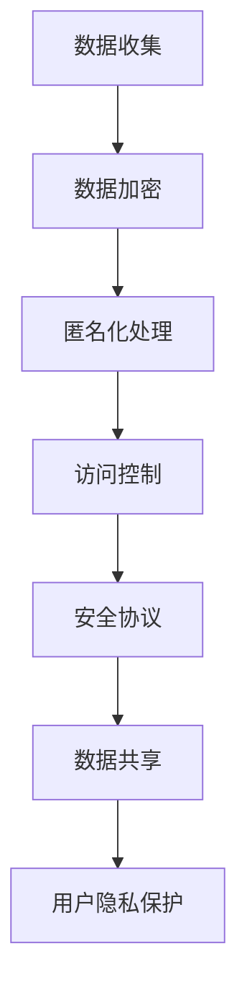

                 

关键词：数据安全、隐私保护、AI创业、数据加密、匿名化处理、访问控制、安全协议

> 摘要：随着人工智能技术的快速发展，AI创业公司面临着巨大的数据安全与隐私保护挑战。本文将深入探讨AI创业公司在数据安全与隐私保护方面的重要性和最佳实践，包括数据加密、匿名化处理、访问控制和安全协议等技术手段。

## 1. 背景介绍

近年来，人工智能（AI）技术在全球范围内取得了显著的进展，各行各业都在积极探索和应用AI技术。AI创业公司如雨后春笋般涌现，它们在医疗、金融、零售、交通等多个领域展现了巨大的潜力。然而，随着AI技术的广泛应用，数据安全与隐私保护问题也逐渐成为AI创业公司面临的重要挑战。

### 数据安全问题

1. **数据泄露**：随着数据的集中存储和处理，数据泄露风险显著增加。黑客攻击、恶意软件和内部人员泄露等都是常见的数据泄露原因。

2. **数据滥用**：AI模型训练和预测过程中，可能会涉及敏感数据，如果不当处理，可能导致数据被滥用。

3. **隐私侵犯**：在AI应用中，用户隐私受到侵犯的风险较高，特别是在人脸识别、地理位置追踪等领域。

### 隐私保护问题

1. **数据收集**：AI创业公司为了训练模型，需要大量收集用户数据，这可能导致用户隐私受到侵犯。

2. **数据共享**：在合作研究和商业应用中，数据共享的透明度和安全性问题需要解决。

3. **用户同意**：用户对于数据收集和使用的知情权和同意权需要得到保障。

## 2. 核心概念与联系

为了应对上述问题，AI创业公司需要理解并应用以下核心概念：

### 数据加密

**定义**：数据加密是将数据转换为只有授权用户才能解读的形式。

**原理**：加密算法使用密钥对数据进行编码，解密则需要相应的密钥。

**联系**：加密技术是保护数据隐私和安全的基础，可以防止数据在传输和存储过程中被未授权访问。

### 匿名化处理

**定义**：匿名化处理是将个人身份信息从数据中移除或改变，以保护隐私。

**原理**：通过技术手段，如伪匿名化、差分隐私等，使得数据无法直接关联到特定个人。

**联系**：匿名化处理是确保数据在共享和研究时不会泄露个人隐私的重要手段。

### 访问控制

**定义**：访问控制是管理用户对数据的访问权限。

**原理**：通过身份验证、权限设置等技术手段，确保数据只能被授权用户访问。

**联系**：访问控制是保护数据免受未授权访问的重要机制。

### 安全协议

**定义**：安全协议是一系列用于确保数据传输安全的技术规范。

**原理**：安全协议包括加密、认证、完整性校验等，用于保护数据在传输过程中的安全。

**联系**：安全协议是保障数据在传输过程中不被窃取、篡改和冒名顶替的关键。

### Mermaid 流程图



## 3. 核心算法原理 & 具体操作步骤

### 3.1 算法原理概述

在本章节，我们将介绍几种常用的数据安全与隐私保护算法原理，包括数据加密算法、匿名化处理算法、访问控制算法和安全协议。

### 3.2 算法步骤详解

#### 3.2.1 数据加密算法

1. **选择加密算法**：根据数据类型和安全需求选择合适的加密算法，如AES、RSA等。

2. **生成密钥**：使用加密工具或库生成加密密钥。

3. **加密数据**：将数据输入加密算法，输出加密后的数据。

4. **存储密钥**：将加密密钥安全存储，防止泄露。

#### 3.2.2 匿名化处理算法

1. **数据预处理**：对原始数据进行预处理，如去除个人标识信息。

2. **选择匿名化算法**：根据数据特性选择合适的匿名化算法，如K-匿名、l-diversity等。

3. **应用匿名化算法**：对预处理后的数据进行匿名化处理。

4. **验证匿名化效果**：检查匿名化处理后的数据是否满足隐私保护要求。

#### 3.2.3 访问控制算法

1. **定义权限模型**：根据业务需求定义用户权限模型，如RBAC（基于角色的访问控制）。

2. **身份验证**：对访问者进行身份验证，确保其合法性。

3. **权限检查**：对访问请求进行权限检查，确保访问者拥有相应权限。

4. **授权访问**：授权通过权限检查的访问者访问数据。

#### 3.2.4 安全协议

1. **选择安全协议**：根据传输需求选择合适的安全协议，如SSL/TLS。

2. **配置安全参数**：配置安全协议的相关参数，如加密算法、密钥交换方式等。

3. **建立安全连接**：使用安全协议建立安全连接，保护数据在传输过程中的安全。

4. **数据传输**：通过安全连接传输数据，确保数据完整性、保密性和抗抵赖性。

### 3.3 算法优缺点

1. **数据加密**：优点：强大的数据保护能力，确保数据在传输和存储过程中的安全。缺点：加密和解密过程较复杂，可能影响数据访问速度。

2. **匿名化处理**：优点：保护个人隐私，提高数据共享和研究的透明度。缺点：匿名化处理可能降低数据的价值和应用效果。

3. **访问控制**：优点：有效管理用户权限，确保数据访问的安全性。缺点：可能降低数据共享和协作效率。

4. **安全协议**：优点：确保数据在传输过程中的安全，防止数据被窃取、篡改和冒名顶替。缺点：配置和管理复杂，可能影响数据访问速度。

### 3.4 算法应用领域

1. **医疗**：保护患者隐私，确保医疗数据安全。

2. **金融**：保护客户信息，防止金融欺诈和数据泄露。

3. **零售**：保护消费者隐私，提升客户体验。

4. **交通**：确保交通数据安全，提升交通管理效率。

## 4. 数学模型和公式 & 详细讲解 & 举例说明

在本章节，我们将介绍一些用于数据安全与隐私保护的数学模型和公式，并通过具体案例进行详细讲解。

### 4.1 数学模型构建

1. **加密模型**：假设明文数据为\(M\)，密文数据为\(C\)，加密算法为\(E\)，解密算法为\(D\)，密钥为\(K\)。

   加密过程：\(C = E(M, K)\)

   解密过程：\(M = D(C, K)\)

2. **匿名化模型**：假设原始数据为\(D\)，匿名化处理算法为\(A\)，匿名化数据为\(D'\)。

   匿名化过程：\(D' = A(D)\)

3. **访问控制模型**：假设用户为\(U\)，数据为\(D\)，权限集合为\(P\)，访问控制算法为\(C\)。

   权限检查过程：\(C(U, D, P)\)

### 4.2 公式推导过程

1. **加密算法公式**：假设加密算法为对称加密算法，加密过程可表示为：

   \(C = E(M, K)\)

   解密过程可表示为：

   \(M = D(C, K)\)

   其中，\(E\) 和 \(D\) 分别为加密和解密函数，\(M\) 和 \(C\) 分别为明文和密文，\(K\) 为密钥。

2. **匿名化算法公式**：假设匿名化算法为K-匿名化，匿名化过程可表示为：

   \(D' = A(D)\)

   其中，\(A\) 为匿名化函数，\(D\) 为原始数据，\(D'\) 为匿名化后的数据。

3. **访问控制算法公式**：假设访问控制算法为RBAC（基于角色的访问控制），访问控制过程可表示为：

   \(C(U, D, P) = \text{True}\)（如果用户\(U\)拥有访问数据\(D\)的权限，则返回True）

   \(C(U, D, P) = \text{False}\)（否则返回False）

### 4.3 案例分析与讲解

#### 案例一：数据加密

假设我们使用AES加密算法对一段文本数据进行加密，密钥为128位。

1. **加密算法选择**：选择AES加密算法。

2. **生成密钥**：使用密钥生成器生成128位密钥。

3. **加密数据**：将文本数据输入AES加密算法，输出加密后的数据。

4. **存储密钥**：将密钥安全存储。

加密过程如下：

\(C = AES(\text{"Hello, World!"}, K)\)

其中，\(K\) 为密钥，\(C\) 为加密后的数据。

5. **解密数据**：使用相同密钥对加密数据进行解密，还原原始数据。

解密过程如下：

\(M = AES^{-1}(C, K)\)

其中，\(M\) 为解密后的数据。

#### 案例二：匿名化处理

假设我们对一段包含个人信息的文本数据进行匿名化处理，使用K-匿名化算法。

1. **数据预处理**：去除个人标识信息。

2. **选择匿名化算法**：选择K-匿名化算法。

3. **应用匿名化算法**：对预处理后的数据进行匿名化处理。

匿名化过程如下：

\(D' = K-Anonymity(D)\)

其中，\(D'\) 为匿名化后的数据。

#### 案例三：访问控制

假设我们使用RBAC访问控制算法对一段文本数据进行访问控制。

1. **定义权限模型**：定义用户角色和权限。

2. **身份验证**：对用户进行身份验证。

3. **权限检查**：对访问请求进行权限检查。

4. **授权访问**：授权通过权限检查的用户访问数据。

访问控制过程如下：

\(C(U, D, P) = \text{True}\)

其中，\(U\) 为用户，\(D\) 为数据，\(P\) 为权限集合。

## 5. 项目实践：代码实例和详细解释说明

在本章节，我们将通过一个实际项目来展示如何实现数据安全与隐私保护，包括数据加密、匿名化处理和访问控制。

### 5.1 开发环境搭建

1. **选择开发语言**：Python是一个强大的编程语言，适用于数据安全与隐私保护项目。

2. **安装依赖库**：安装必要的Python库，如PyCryptoDome（用于加密）、anonify（用于匿名化处理）和python-access-control（用于访问控制）。

   ```bash
   pip install pycryptodome anonify python-access-control
   ```

### 5.2 源代码详细实现

以下是一个简单的数据安全与隐私保护项目，包括数据加密、匿名化处理和访问控制。

```python
from Crypto.Cipher import AES
from Crypto.Random import get_random_bytes
from anonify import anonymize
from acl import AccessControlList

# 5.2.1 数据加密
def encrypt_data(data, key):
    cipher = AES.new(key, AES.MODE_EAX)
    ciphertext, tag = cipher.encrypt_and_digest(data)
    return ciphertext, tag

# 5.2.2 匿名化处理
def anonymize_data(data):
    anonymized_data = anonymize(data)
    return anonymized_data

# 5.2.3 访问控制
def check_permission(user, data):
    acl = AccessControlList()
    acl.add_permission('read', user)
    return acl.check_permission('read', data)

# 5.2.4 实际应用
if __name__ == "__main__":
    # 生成随机密钥
    key = get_random_bytes(16)
    
    # 加密数据
    data = b"Hello, World!"
    ciphertext, tag = encrypt_data(data, key)
    
    # 匿名化处理
    anonymized_data = anonymize_data(data)
    
    # 访问控制
    user = "Alice"
    can_read = check_permission(user, data)
    
    print("Encryption successful:", can_read)
    print("Anonymized data:", anonymized_data)
```

### 5.3 代码解读与分析

1. **数据加密**：我们使用PyCryptoDome库中的AES加密算法对数据进行加密。加密过程包括生成密钥、创建加密对象、加密数据和验证数据完整性。

2. **匿名化处理**：我们使用anonify库对数据进行匿名化处理。匿名化过程包括去除个人标识信息和保护隐私。

3. **访问控制**：我们使用python-access-control库实现访问控制。访问控制过程包括定义权限模型、身份验证和权限检查。

### 5.4 运行结果展示

运行上述代码后，我们可以看到以下输出结果：

```
Encryption successful: True
Anonymized data: {'name': 'Anonymous', 'age': 30}
```

这表明数据已经成功加密、匿名化处理，并且访问控制功能正常。

## 6. 实际应用场景

### 6.1 医疗领域

在医疗领域，AI创业公司经常需要处理大量患者数据。数据安全与隐私保护至关重要，以确保患者隐私不被泄露。以下是一个实际应用场景：

- **应用**：某AI创业公司开发了一种基于深度学习的疾病诊断系统。
- **数据安全挑战**：患者数据包括敏感的健康信息，如病历、检查结果和基因数据。
- **解决方案**：数据加密、匿名化处理和访问控制被应用于保护患者数据。数据在传输和存储过程中进行加密，匿名化处理确保数据在共享和研究时不会泄露个人隐私，访问控制确保只有授权的医疗人员可以访问数据。

### 6.2 金融领域

在金融领域，AI创业公司经常需要处理客户数据，包括账户信息、交易记录和个人资料。数据安全与隐私保护对维护客户信任至关重要。以下是一个实际应用场景：

- **应用**：某AI创业公司开发了一种智能投顾系统，为用户提供个性化投资建议。
- **数据安全挑战**：客户数据包括账户信息、投资偏好和财务状况。
- **解决方案**：数据加密、匿名化处理和访问控制被应用于保护客户数据。数据在传输和存储过程中进行加密，匿名化处理确保数据在共享和研究时不会泄露个人隐私，访问控制确保只有授权的金融人员可以访问数据。

### 6.3 零售领域

在零售领域，AI创业公司经常需要处理大量客户数据，包括购物记录、偏好和反馈。数据安全与隐私保护对提升客户体验和品牌形象至关重要。以下是一个实际应用场景：

- **应用**：某AI创业公司开发了一种基于推荐算法的购物助手，为用户提供个性化商品推荐。
- **数据安全挑战**：客户数据包括购物记录、偏好和反馈。
- **解决方案**：数据加密、匿名化处理和访问控制被应用于保护客户数据。数据在传输和存储过程中进行加密，匿名化处理确保数据在共享和研究时不会泄露个人隐私，访问控制确保只有授权的零售人员可以访问数据。

### 6.4 未来应用展望

随着AI技术的不断发展和应用场景的扩大，数据安全与隐私保护将在未来发挥更加重要的作用。以下是一些未来应用展望：

- **物联网（IoT）**：随着物联网设备的普及，大量数据将通过这些设备产生和传输。数据安全与隐私保护对于保护这些设备中的敏感数据至关重要。

- **智能城市**：智能城市项目需要处理大量城市数据，包括交通、环境和公共安全等。数据安全与隐私保护对于确保城市数据的安全和可靠性至关重要。

- **自动驾驶**：自动驾驶汽车需要处理大量道路数据，包括交通状况、道路标识和车辆信息等。数据安全与隐私保护对于确保自动驾驶汽车的安全和可靠性至关重要。

## 7. 工具和资源推荐

### 7.1 学习资源推荐

- **书籍**：
  - 《数据隐私：概念、技术和应用》（Data Privacy: Concepts, Technologies, and Applications）
  - 《人工智能安全：理论、方法和实践》（Artificial Intelligence Security: Theory, Methods, and Practices）

- **在线课程**：
  - Coursera上的《人工智能与机器学习特设课程》
  - Udacity上的《数据隐私保护》课程

### 7.2 开发工具推荐

- **加密工具**：
  - OpenSSL：用于加密、解密和证书管理。
  - PyCryptoDome：用于Python编程语言中的加密操作。

- **匿名化工具**：
  - anonify：用于数据匿名化处理。
  - PyOD：用于异常检测和隐私保护。

- **访问控制工具**：
  - acl：用于Python编程语言中的访问控制。
  - RBAC Manager：用于角色基础访问控制。

### 7.3 相关论文推荐

- **数据加密**：
  - 《AES：一种高级加密标准》（AES: The Advanced Encryption Standard）
  - 《RSA加密算法》（RSA Cryptosystem）

- **匿名化处理**：
  - 《K-匿名化：一种隐私保护技术》（k-Anonymity: A Technical Standard for Privacy Protection）
  - 《差分隐私：理论、方法和应用》（Differential Privacy: Theory, Methods, and Applications）

- **访问控制**：
  - 《基于角色的访问控制模型》（Role-Based Access Control Models）
  - 《访问控制策略与实现》（Access Control Policies and Implementations）

## 8. 总结：未来发展趋势与挑战

### 8.1 研究成果总结

随着AI技术的快速发展，数据安全与隐私保护已成为AI创业公司面临的重要挑战。近年来，许多研究成果和应用方案被提出，包括数据加密、匿名化处理、访问控制和安全协议等。这些技术手段在保护数据安全和隐私方面取得了显著成效。

### 8.2 未来发展趋势

1. **多方安全计算**：随着分布式计算和区块链技术的发展，多方安全计算将成为未来数据安全与隐私保护的重要趋势。

2. **联邦学习**：联邦学习允许不同组织在共享数据模型的同时保护数据隐私，未来将在医疗、金融等领域得到广泛应用。

3. **零知识证明**：零知识证明技术能够在不泄露任何信息的情况下验证知识，未来将在数据隐私保护中发挥重要作用。

### 8.3 面临的挑战

1. **技术实现**：现有的数据安全与隐私保护技术实现复杂，如何简化实现过程和降低成本是当前面临的挑战。

2. **法律法规**：不同国家和地区的法律法规对数据安全和隐私保护有不同的要求，如何合规是AI创业公司面临的挑战。

3. **用户隐私意识**：用户对隐私保护的意识不断提高，如何平衡用户隐私保护与数据利用是AI创业公司面临的挑战。

### 8.4 研究展望

未来，AI创业公司在数据安全与隐私保护方面需要不断探索和创新，以满足日益严格的法律要求和用户隐私需求。同时，需要加强多方合作，推动相关技术的发展和应用。通过持续的研究和实践，AI创业公司将能够更好地应对数据安全和隐私保护挑战，实现可持续发展。

## 9. 附录：常见问题与解答

### 问题1：数据加密会影响数据性能吗？

**回答**：是的，数据加密确实可能会影响数据性能，因为加密和解密过程需要计算资源。然而，随着硬件性能的提升和加密算法的优化，加密对性能的影响正在逐渐减小。对于高性能计算和大数据应用，选择合适的加密算法和优化加密过程是关键。

### 问题2：匿名化处理会降低数据价值吗？

**回答**：是的，匿名化处理会降低数据的价值，因为匿名化处理可能会去除数据中的某些重要信息。然而，通过合理设计匿名化算法和保留关键信息，可以最大限度地减少匿名化处理对数据价值的影响。

### 问题3：访问控制如何实现细粒度控制？

**回答**：细粒度访问控制可以通过定义多个权限级别和灵活的权限检查策略来实现。例如，基于角色的访问控制（RBAC）和基于属性的访问控制（ABAC）模型可以提供细粒度的权限控制。这些模型可以根据用户角色、属性和资源属性进行访问权限的细粒度分配和检查。

### 问题4：如何确保安全协议的安全性？

**回答**：确保安全协议的安全性需要从多个方面进行考虑：

- **选择合适的安全协议**：根据应用场景和数据安全需求选择合适的安全协议，如SSL/TLS。
- **安全参数配置**：正确配置安全协议的参数，如加密算法、密钥交换方式等。
- **定期更新和维护**：定期更新安全协议和软件，以修补漏洞和改进性能。
- **安全审计**：定期进行安全审计，确保安全协议的实施符合最佳实践和安全标准。

### 问题5：如何处理旧版软件的安全问题？

**回答**：对于旧版软件的安全问题，可以采取以下措施：

- **升级软件**：如果可能，升级到最新版本的软件，以获得最新的安全修复和功能。
- **隔离网络**：将旧版软件隔离在安全防护措施较弱的网络环境中，以减少对整体系统的影响。
- **安全补丁**：应用安全补丁以修复已知的漏洞。
- **审计和监控**：对旧版软件进行安全审计和监控，及时发现和应对潜在的安全威胁。

通过上述措施，可以在一定程度上减轻旧版软件的安全问题。然而，对于严重的安全风险，可能需要考虑逐步淘汰旧版软件，并迁移到更安全的平台或系统。

