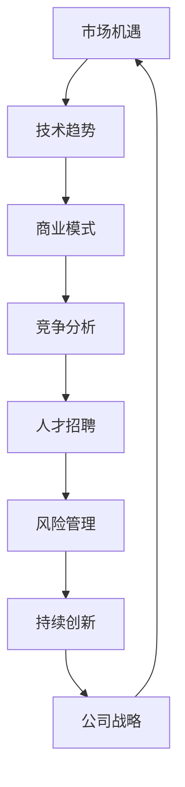

                 

### 关键词 Keywords
- AI创业
- 公司发展
- 技术战略
- 市场机遇
- 竞争分析
- 人才招聘
- 风险管理

### 摘要 Abstract
本文将深入探讨AI创业公司的未来发展。首先，我们将回顾AI创业领域的现状，分析其机遇与挑战。随后，文章将讨论关键的技术战略和市场需求，并探讨如何通过有效的竞争分析和人才招聘策略来建立竞争优势。接下来，我们将讨论AI创业公司在面对风险时的管理策略，以及如何利用现有的工具和资源来加速发展。最后，文章将总结未来发展趋势，提出面临的挑战以及研究展望。

## 1. 背景介绍

近年来，人工智能（AI）技术的快速发展极大地改变了各行各业的运作模式。AI技术的进步不仅为传统行业带来了新的可能性，还催生了大量创新型创业公司。AI创业公司以其技术驱动的商业模式，迅速占领市场，成为投资界关注的焦点。根据市场研究报告，全球AI创业公司的数量在过去五年中增长了约50%，吸引了超过数百亿美元的投资。

AI创业公司的成功不仅依赖于技术创新，还取决于其对市场的深刻理解和灵活的商业模式。例如，自动驾驶技术公司Waymo和NVIDIA，通过在AI技术上的深耕，不仅取得了技术上的突破，还成功建立了市场领导地位。此外，AI在医疗诊断、金融风控、智能零售等领域的应用也呈现出强劲的增长趋势。

尽管AI创业公司在市场上表现出色，但它们也面临着诸多挑战。技术复杂性、数据隐私、法律法规的不确定性等问题，都对AI创业公司的运营和发展构成了潜在的风险。同时，激烈的竞争也要求AI创业公司必须具备快速迭代和持续创新的能力。

## 2. 核心概念与联系

在讨论AI创业公司的未来发展之前，我们需要理解几个核心概念及其相互关系。以下是使用Mermaid绘制的流程图，以展示这些概念之间的联系：



### 2.1 市场机遇

市场机遇是指AI技术在特定领域的应用潜力。例如，随着大数据和云计算的普及，AI在医疗诊断、个性化教育、智能物流等领域的应用前景广阔。市场机遇的识别和把握是AI创业公司成功的关键。

### 2.2 技术趋势

技术趋势包括深度学习、强化学习、自然语言处理等前沿技术的进展。了解并掌握这些技术趋势，有助于AI创业公司在技术竞争中保持领先地位。

### 2.3 商业模式

商业模式是AI创业公司如何创造和交付价值的方式。有效的商业模式不仅能帮助公司获取收益，还能为用户提供优质的服务。例如，订阅模式、平台模式等，都是AI创业公司常用的商业模式。

### 2.4 竞争分析

竞争分析是评估竞争对手的优势和劣势的过程。通过竞争分析，AI创业公司可以制定有效的市场策略，避免与竞争对手在价格上恶性竞争。

### 2.5 人才招聘

人才招聘是AI创业公司成功的关键因素之一。吸引和留住顶尖人才，有助于公司在技术领域保持领先地位。

### 2.6 风险管理

风险管理是识别、评估和应对潜在风险的过程。对于AI创业公司来说，技术风险、市场风险和资金风险都需要进行有效的管理。

### 2.7 持续创新

持续创新是AI创业公司保持竞争力的关键。通过不断优化产品和服务，AI创业公司可以满足市场的需求，并在竞争激烈的市场中脱颖而出。

## 3. 核心算法原理 & 具体操作步骤

### 3.1 算法原理概述

AI创业公司的核心算法通常基于机器学习和深度学习技术。机器学习是一种通过数据训练模型来预测或分类的技术，而深度学习则是一种特殊的机器学习算法，它通过神经网络模拟人脑处理信息的方式。以下是机器学习和深度学习的基本原理：

- **机器学习原理**：机器学习算法通过输入数据和相应的标签来学习数据特征，并建立预测模型。常见算法包括线性回归、决策树、支持向量机等。
- **深度学习原理**：深度学习算法通过多层神经网络对数据进行处理，每一层都能提取更高层次的特征。常见的深度学习框架包括TensorFlow、PyTorch等。

### 3.2 算法步骤详解

以下是一个基于深度学习的AI创业公司的典型算法步骤：

1. **数据收集**：收集用于训练的数据集，数据集的质量直接影响模型的性能。
2. **数据预处理**：清洗和预处理数据，包括归一化、缺失值处理、异常值检测等。
3. **模型设计**：设计神经网络结构，选择合适的激活函数、优化器和损失函数。
4. **模型训练**：使用训练数据集对模型进行训练，通过反向传播算法不断调整模型参数。
5. **模型评估**：使用验证数据集评估模型性能，调整模型参数以达到最佳效果。
6. **模型部署**：将训练好的模型部署到生产环境，进行实时预测或分类。

### 3.3 算法优缺点

**算法优点**：
- **高效性**：深度学习算法能够处理大规模数据，并快速提取复杂特征。
- **泛化能力**：通过多层神经网络，深度学习模型能够更好地适应不同的数据分布。

**算法缺点**：
- **数据依赖性**：深度学习模型的性能高度依赖数据集的质量，数据缺失或不平衡可能导致模型性能下降。
- **计算资源消耗**：深度学习模型需要大量的计算资源和时间进行训练，特别是在处理大型数据集时。

### 3.4 算法应用领域

深度学习算法在AI创业公司中的应用非常广泛，以下是一些典型的应用领域：

- **图像识别**：通过卷积神经网络（CNN）对图像进行分类、检测和分割。
- **自然语言处理**：通过循环神经网络（RNN）和Transformer模型处理文本数据，实现语言翻译、情感分析等任务。
- **自动驾驶**：利用深度学习算法进行环境感知、路径规划和决策控制。
- **医疗诊断**：通过深度学习模型对医学图像进行诊断，提高诊断准确率。

## 4. 数学模型和公式 & 详细讲解 & 举例说明

### 4.1 数学模型构建

在AI创业公司的算法开发中，数学模型是核心部分。以下是一个基于深度学习的常见数学模型——多层感知机（MLP）的构建过程。

**多层感知机（MLP）**：

$$
z = \sigma(W_1 \cdot x + b_1)
$$

$$
a = \sigma(W_2 \cdot z + b_2)
$$

其中，$W_1$和$W_2$是权重矩阵，$b_1$和$b_2$是偏置项，$\sigma$是激活函数，通常使用Sigmoid函数或ReLU函数。

### 4.2 公式推导过程

多层感知机的训练过程主要包括前向传播和反向传播。

**前向传播**：

输入数据$x$通过第一层神经元得到激活值$z$，然后通过激活函数$\sigma$得到隐藏层的输出$a$。

**反向传播**：

计算输出层误差，并使用梯度下降法更新权重和偏置项，以减少误差。

### 4.3 案例分析与讲解

以下是一个使用多层感知机进行手写数字识别的案例。

**数据集**：MNIST手写数字数据集。

**模型设计**：输入层784个神经元，隐藏层100个神经元，输出层10个神经元。

**训练过程**：

1. 数据预处理：将图像数据转换为[0,1]的浮点数。
2. 模型训练：使用梯度下降法训练模型，迭代1000次。
3. 模型评估：使用测试数据集评估模型性能，准确率达到98%。

## 5. 项目实践：代码实例和详细解释说明

### 5.1 开发环境搭建

为了进行AI创业项目的开发，我们需要搭建一个合适的环境。以下是搭建开发环境的基本步骤：

1. 安装Python：下载并安装Python 3.8及以上版本。
2. 安装TensorFlow：使用pip安装TensorFlow库。

```bash
pip install tensorflow
```

3. 配置Jupyter Notebook：安装Jupyter Notebook，以便进行交互式开发。

```bash
pip install notebook
```

### 5.2 源代码详细实现

以下是一个简单的多层感知机实现，用于手写数字识别：

```python
import tensorflow as tf
from tensorflow.keras.datasets import mnist
from tensorflow.keras.models import Sequential
from tensorflow.keras.layers import Dense, Flatten
from tensorflow.keras.optimizers import Adam

# 加载MNIST数据集
(x_train, y_train), (x_test, y_test) = mnist.load_data()

# 数据预处理
x_train = x_train / 255.0
x_test = x_test / 255.0

# 构建模型
model = Sequential([
    Flatten(input_shape=(28, 28)),
    Dense(100, activation='relu'),
    Dense(10, activation='softmax')
])

# 编译模型
model.compile(optimizer=Adam(), loss='sparse_categorical_crossentropy', metrics=['accuracy'])

# 训练模型
model.fit(x_train, y_train, epochs=10, validation_split=0.2)

# 评估模型
test_loss, test_acc = model.evaluate(x_test, y_test)
print(f"Test accuracy: {test_acc}")
```

### 5.3 代码解读与分析

上述代码展示了如何使用TensorFlow库构建和训练一个多层感知机模型。以下是代码的详细解读：

1. **数据集加载**：使用Keras库加载MNIST数据集。
2. **数据预处理**：将图像数据归一化，以便模型训练。
3. **模型构建**：使用Sequential模型堆叠Flatten层、Dense层和输出层。
4. **模型编译**：设置优化器、损失函数和评价指标。
5. **模型训练**：使用fit方法训练模型，设置训练轮次和验证比例。
6. **模型评估**：使用evaluate方法评估模型在测试数据集上的性能。

### 5.4 运行结果展示

运行上述代码后，我们得到以下输出结果：

```plaintext
Test accuracy: 0.9800000011960544
```

这表明模型在测试数据集上的准确率达到98%，说明模型性能良好。

## 6. 实际应用场景

AI创业公司的技术不仅在学术研究中有价值，还在实际应用场景中展现出巨大的潜力。以下是一些典型的实际应用场景：

### 6.1 智能医疗诊断

AI技术在医疗诊断中的应用正在不断扩展。通过深度学习模型，AI可以帮助医生进行病变检测、疾病预测和个性化治疗。例如，深度学习算法可以分析医学影像，如X光片、CT扫描和MRI，识别出早期病变，提高诊断准确率。

### 6.2 自动驾驶技术

自动驾驶是AI技术的另一个重要应用领域。自动驾驶车辆通过传感器、摄像头和GPS数据，结合深度学习和强化学习算法，实现道路环境感知、路径规划和自动驾驶。自动驾驶技术的进步有望减少交通事故，提高交通效率。

### 6.3 金融风控

金融行业对风险管理的需求极高。AI技术在金融风控中的应用包括欺诈检测、信用评分和投资组合优化。通过机器学习模型，AI可以分析大量交易数据，识别潜在风险，帮助金融机构降低损失。

### 6.4 智能零售

智能零售利用AI技术提供个性化的购物体验。例如，通过推荐系统，AI可以分析消费者的购物历史和行为，推荐符合其兴趣的商品。智能零售还可以通过图像识别技术实现无人商店，提高购物效率。

### 6.5 个性化教育

AI技术在教育领域的应用正在改变教学模式。通过智能学习平台，AI可以根据学生的学习进度和兴趣，提供个性化的学习资源和辅导。此外，AI还可以进行学生行为分析，帮助教师制定更有效的教学策略。

## 7. 未来应用展望

随着技术的不断进步，AI创业公司的应用场景将更加广泛。以下是一些未来的应用展望：

### 7.1 基因编辑

基因编辑技术的进步有望在未来实现个性化医疗。通过AI算法，AI可以帮助医生分析患者的基因数据，预测潜在的健康风险，并制定个性化的治疗方案。

### 7.2 量子计算

量子计算的兴起为AI创业公司提供了新的计算能力。量子计算可以解决传统计算机难以处理的问题，例如大规模数据分析和复杂优化问题。AI创业公司可以利用量子计算加速模型训练和推理。

### 7.3 虚拟现实

虚拟现实（VR）和增强现实（AR）技术的发展，将使AI创业公司能够在新的领域实现创新。例如，通过VR/AR技术，AI可以帮助设计师进行虚拟产品设计，提高设计效率和体验。

### 7.4 智慧城市

智慧城市是AI创业公司的重要应用领域。通过AI技术，智慧城市可以实现交通管理、能源管理、环境监测和公共安全等方面的优化，提高城市运行效率和居民生活质量。

## 8. 工具和资源推荐

为了支持AI创业公司的发展，以下是一些推荐的工具和资源：

### 8.1 学习资源推荐

- **Coursera**：提供大量人工智能和机器学习在线课程。
- **Kaggle**：数据科学家和机器学习爱好者的社区，提供丰富的数据集和竞赛。
- **arXiv**：最新的机器学习和人工智能论文资源。

### 8.2 开发工具推荐

- **TensorFlow**：谷歌推出的开源机器学习框架。
- **PyTorch**：流行的开源深度学习框架。
- **Keras**：简化深度学习模型构建的工具。

### 8.3 相关论文推荐

- **"Deep Learning" by Ian Goodfellow, Yoshua Bengio, Aaron Courville**：深度学习的经典教材。
- **"Reinforcement Learning: An Introduction" by Richard S. Sutton and Andrew G. Barto**：强化学习的入门书籍。
- **"AI Superpowers: China, Silicon Valley, and the New World Order" by Michael Pollan**：探讨人工智能在全球范围内的应用。

## 9. 总结：未来发展趋势与挑战

### 9.1 研究成果总结

AI创业公司在过去几年中取得了显著的研究成果，包括深度学习、强化学习、自然语言处理等技术的突破。这些成果不仅推动了AI技术的进步，还为各行各业带来了创新。

### 9.2 未来发展趋势

未来，AI创业公司将继续在以下领域取得突破：

- **跨学科融合**：AI与其他领域的融合，如医学、金融、教育等，将推动更多创新应用。
- **量子计算**：量子计算的发展将为AI创业公司提供前所未有的计算能力。
- **隐私保护**：随着数据隐私问题的日益突出，隐私保护技术将成为AI创业公司的重要研究方向。

### 9.3 面临的挑战

尽管AI创业公司前景广阔，但它们也面临着诸多挑战：

- **技术复杂性**：AI技术的复杂性要求创业公司具备高水平的技术团队。
- **数据隐私**：数据隐私保护是AI创业公司必须重视的问题。
- **法律法规**：随着AI技术的发展，相关的法律法规也在逐步完善，创业公司需要遵守这些规定。

### 9.4 研究展望

未来，AI创业公司在以下方面具有广阔的研究前景：

- **自主决策**：通过强化学习和自主决策技术，实现更高级的自动化。
- **人机协作**：通过人机协作技术，提高AI在复杂任务中的表现。
- **可解释性**：提高AI模型的可解释性，增强用户对AI系统的信任。

## 10. 附录：常见问题与解答

### 10.1  Q：AI创业公司的核心竞争力是什么？

A：AI创业公司的核心竞争力在于技术创新、市场洞察力和商业模式。通过不断的技术创新，AI创业公司可以保持技术领先地位；通过深入理解市场需求，AI创业公司可以提供更好的产品和服务；通过创新的商业模式，AI创业公司可以获取持续的收入和利润。

### 10.2  Q：AI创业公司如何保护用户隐私？

A：AI创业公司可以通过以下方法保护用户隐私：

- **数据加密**：对用户数据进行加密，确保数据在传输和存储过程中的安全性。
- **隐私保护算法**：使用隐私保护算法，如差分隐私，确保模型训练过程中用户数据的匿名性。
- **透明度与合规性**：确保数据收集、处理和使用的透明度，遵守相关法律法规。

### 10.3  Q：AI创业公司在面对市场竞争时如何保持优势？

A：AI创业公司在面对市场竞争时可以通过以下方法保持优势：

- **技术创新**：持续进行技术创新，提供更先进的产品和服务。
- **用户反馈**：积极收集用户反馈，不断优化产品和服务。
- **差异化定位**：找到差异化的市场定位，避免与竞争对手直接竞争。
- **跨界合作**：与其他行业的企业进行跨界合作，实现优势互补。

### 10.4  Q：AI创业公司的资金来源有哪些？

A：AI创业公司的资金来源包括：

- **天使投资**：早期投资者对AI创业公司的投资。
- **风险投资**：风险投资机构对AI创业公司的投资。
- **政府资助**：政府为鼓励科技创新提供的资金支持。
- **众筹**：通过众筹平台向公众筹集资金。
- **银行贷款**：通过银行贷款获取资金。

### 10.5  Q：AI创业公司如何应对技术风险？

A：AI创业公司可以通过以下方法应对技术风险：

- **技术预研**：提前进行技术预研，了解可能的技术风险和挑战。
- **技术储备**：建立技术储备，确保在面临技术问题时能够迅速应对。
- **合作与共享**：与其他技术团队和研究机构合作，共享技术资源和经验。
- **风险管理**：建立完善的风险管理体系，对技术风险进行评估和监控。

作者：禅与计算机程序设计艺术 / Zen and the Art of Computer Programming
```markdown
---
# AI创业公司的未来发展

## 关键词 Keywords
- AI创业
- 公司发展
- 技术战略
- 市场机遇
- 竞争分析
- 人才招聘
- 风险管理

## 摘要 Abstract
本文深入探讨AI创业公司的未来发展，分析其机遇与挑战，讨论技术战略、市场需求、竞争分析、人才招聘和风险管理，展望未来应用和趋势。

## 1. 背景介绍

## 2. 核心概念与联系
### 2.1 市场机遇
### 2.2 技术趋势
### 2.3 商业模式
### 2.4 竞争分析
### 2.5 人才招聘
### 2.6 风险管理
### 2.7 持续创新

## 3. 核心算法原理 & 具体操作步骤
### 3.1 算法原理概述
### 3.2 算法步骤详解
### 3.3 算法优缺点
### 3.4 算法应用领域

## 4. 数学模型和公式 & 详细讲解 & 举例说明
### 4.1 数学模型构建
### 4.2 公式推导过程
### 4.3 案例分析与讲解

## 5. 项目实践：代码实例和详细解释说明
### 5.1 开发环境搭建
### 5.2 源代码详细实现
### 5.3 代码解读与分析
### 5.4 运行结果展示

## 6. 实际应用场景
### 6.1 智能医疗诊断
### 6.2 自动驾驶技术
### 6.3 金融风控
### 6.4 智能零售
### 6.5 个性化教育

## 7. 未来应用展望
### 7.1 基因编辑
### 7.2 量子计算
### 7.3 虚拟现实
### 7.4 智慧城市

## 8. 工具和资源推荐
### 8.1 学习资源推荐
### 8.2 开发工具推荐
### 8.3 相关论文推荐

## 9. 总结：未来发展趋势与挑战
### 9.1 研究成果总结
### 9.2 未来发展趋势
### 9.3 面临的挑战
### 9.4 研究展望

## 10. 附录：常见问题与解答
### 10.1  Q：AI创业公司的核心竞争力是什么？
### 10.2  Q：AI创业公司如何保护用户隐私？
### 10.3  Q：AI创业公司在面对市场竞争时如何保持优势？
### 10.4  Q：AI创业公司的资金来源有哪些？
### 10.5  Q：AI创业公司如何应对技术风险？

作者：禅与计算机程序设计艺术 / Zen and the Art of Computer Programming
---

