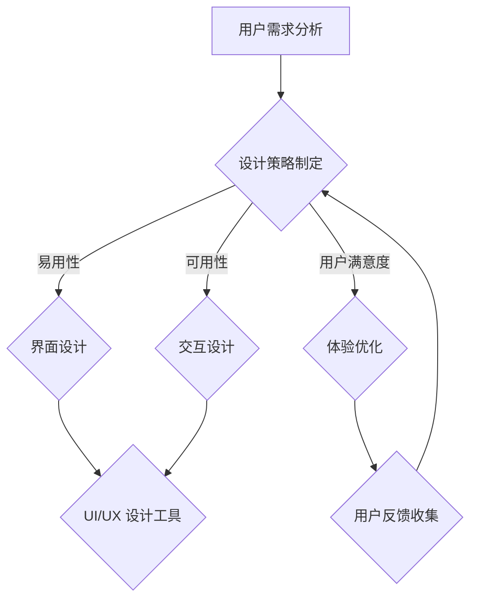
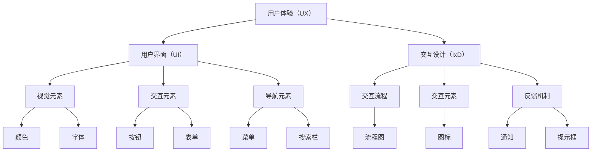

                 

关键词：用户体验设计，AI，以人为本，智能适配，创业公司

> 摘要：本文旨在探讨AI创业公司在用户体验设计方面的关键要素。本文首先介绍了用户体验设计的重要性，随后讨论了以人为本的设计理念，以及如何利用AI技术实现智能适配。文章最后展望了未来AI创业公司在用户体验设计领域的趋势与挑战。

## 1. 背景介绍

随着人工智能（AI）技术的迅猛发展，越来越多的创业公司开始涉足这一领域。AI技术的应用不仅提升了企业的运营效率，还极大地改变了用户与产品之间的交互方式。在这场技术革命中，用户体验设计（UX Design）成为创业公司的核心竞争力之一。用户体验设计的目标是确保产品易于使用、满足用户需求，并带来愉悦的交互体验。对于AI创业公司而言，成功的用户体验设计不仅能够吸引更多用户，还能提升品牌忠诚度和市场份额。

### 1.1 用户体验设计的定义与核心要素

用户体验设计是指通过设计策略、方法和工具，确保产品或服务满足用户需求和期望，提供愉悦的交互体验。用户体验设计的核心要素包括：

1. **易用性**：产品应易于理解和使用，降低用户的学习成本。
2. **可用性**：产品应能够在用户期望的时间内完成用户任务，不引起用户困惑。
3. **用户满意度**：产品应能够满足用户的情感需求，带来愉悦的体验。
4. **可访问性**：产品应能够为各种用户群体提供无障碍的使用体验。

### 1.2 AI创业公司的挑战与机遇

AI创业公司面临的挑战包括：

1. **技术复杂性**：AI技术本身具有较高的复杂性，需要设计者具备深厚的技术背景。
2. **市场需求**：市场需求的变化迅速，要求公司能够快速响应和调整。
3. **用户体验的一致性**：在AI技术的加持下，如何保持用户体验的一致性，避免用户被过度智能化所困扰。

然而，AI创业公司也面临着前所未有的机遇：

1. **智能化交互**：AI技术可以实现更加智能化的交互方式，提升用户体验。
2. **个性化推荐**：基于用户行为和偏好的分析，AI技术可以提供高度个性化的推荐。
3. **自动化与效率提升**：AI技术可以帮助企业实现自动化，提升运营效率。

## 2. 核心概念与联系

为了更好地理解用户体验设计的核心概念和其与AI技术的联系，我们使用Mermaid流程图来展示相关流程和节点。



### 2.1 设计策略制定

设计策略的制定是用户体验设计的起点，主要包括用户需求分析、目标用户画像、核心功能定义等。通过深入理解用户需求和市场趋势，公司可以明确产品设计方向，确保产品能够满足用户期望。

### 2.2 易用性与界面设计

易用性是用户体验设计的核心要素之一。界面设计需要遵循简洁、直观、易操作的原则，降低用户的学习成本。使用UI/UX设计工具，如Sketch、Figma等，可以帮助设计者创建直观、易于使用的界面。

### 2.3 可用性与交互设计

可用性是指产品在用户期望的时间内完成用户任务的能力。交互设计需要考虑用户的操作习惯和预期，确保产品能够高效、顺畅地完成各种任务。交互设计工具，如Axure、Adobe XD等，可以帮助设计者创建高质量的交互原型。

### 2.4 用户满意度与体验优化

用户满意度是衡量用户体验设计成功与否的重要指标。通过不断优化产品体验，公司可以提升用户满意度，增强用户黏性。用户体验优化包括用户调研、A/B测试、用户体验评估等。

### 2.5 用户反馈收集与迭代

用户反馈是用户体验设计的重要输入。通过收集用户反馈，公司可以了解用户的使用情况、喜好和问题，及时进行产品迭代和改进。用户反馈收集工具，如UserTesting、Qualaroo等，可以帮助公司高效地收集和分析用户反馈。

## 3. 核心算法原理 & 具体操作步骤

### 3.1 算法原理概述

在用户体验设计中，AI技术可以发挥重要作用，特别是在个性化推荐和智能交互方面。核心算法原理主要包括：

1. **机器学习算法**：通过训练数据集，机器学习算法可以学会预测用户的行为和偏好。
2. **深度学习算法**：深度学习算法通过多层神经网络，可以自动提取特征，实现更高层次的智能分析。
3. **自然语言处理（NLP）算法**：NLP算法可以理解和生成自然语言，实现人与机器的智能对话。

### 3.2 算法步骤详解

#### 3.2.1 个性化推荐

个性化推荐算法的步骤如下：

1. **数据收集**：收集用户的行为数据，如浏览历史、购买记录、搜索关键词等。
2. **特征提取**：将原始数据转换为机器学习模型可处理的特征向量。
3. **模型训练**：使用机器学习算法，如协同过滤、基于内容的推荐等，训练推荐模型。
4. **推荐生成**：根据用户特征和模型预测，生成个性化的推荐列表。

#### 3.2.2 智能交互

智能交互算法的步骤如下：

1. **语音识别**：使用语音识别算法，将用户语音转换为文本。
2. **语义理解**：使用NLP算法，理解用户语音中的意图和内容。
3. **响应生成**：根据用户意图和语义理解，生成适当的响应文本。
4. **语音合成**：使用语音合成算法，将响应文本转换为语音输出。

### 3.3 算法优缺点

#### 3.3.1 个性化推荐

**优点**：

- **提升用户体验**：根据用户偏好提供个性化推荐，提升用户满意度。
- **增加用户黏性**：个性化推荐可以增加用户在平台上的停留时间，提升用户黏性。

**缺点**：

- **数据隐私问题**：个性化推荐需要收集用户行为数据，可能涉及用户隐私。
- **过度个性化**：如果个性化推荐过于封闭，可能导致用户失去探索新内容的兴趣。

#### 3.3.2 智能交互

**优点**：

- **便捷性**：智能交互可以实现24/7的在线服务，提升用户便捷性。
- **高效性**：智能交互可以快速响应用户需求，提升服务效率。

**缺点**：

- **服务质量**：智能交互可能无法完全替代人类客服，服务质量可能受到限制。
- **用户接受度**：部分用户可能对智能交互存在抵触情绪，影响用户体验。

### 3.4 算法应用领域

个性化推荐和智能交互算法广泛应用于各大领域，如电子商务、在线教育、智能家居、智能客服等。通过AI技术，这些领域的产品可以实现更加智能化、个性化的用户体验，提升用户满意度和市场份额。

## 4. 数学模型和公式 & 详细讲解 & 举例说明

### 4.1 数学模型构建

在用户体验设计中，常用的数学模型包括：

1. **用户满意度模型**：用户满意度可以通过以下公式计算：
   $$\text{User Satisfaction} = \frac{\text{Task Completion}}{\text{Task Attempt}} \times \text{Ease of Use}$$
   其中，Task Completion表示任务完成情况，Task Attempt表示任务尝试次数，Ease of Use表示易用性。

2. **推荐系统模型**：推荐系统可以通过以下公式计算：
   $$\text{Recommendation Score} = \text{User Interest} \times \text{Item Relevance}$$
   其中，User Interest表示用户兴趣，Item Relevance表示物品相关性。

### 4.2 公式推导过程

用户满意度模型的推导过程如下：

1. **定义变量**：
   - Task Completion（任务完成情况）：表示用户完成任务的百分比。
   - Task Attempt（任务尝试次数）：表示用户尝试完成任务的次数。
   - Ease of Use（易用性）：表示产品的易用性，取值范围为[0, 1]。

2. **计算用户满意度**：
   用户满意度可以通过任务完成情况与任务尝试次数的比值，再乘以易用性，得到：
   $$\text{User Satisfaction} = \frac{\text{Task Completion}}{\text{Task Attempt}} \times \text{Ease of Use}$$

### 4.3 案例分析与讲解

#### 案例一：用户满意度分析

假设某电商平台的用户在一个月内尝试了10次购买，成功完成了8次，易用性评分为0.8。根据用户满意度模型，可以计算出用户满意度为：
$$\text{User Satisfaction} = \frac{8}{10} \times 0.8 = 0.64$$

这意味着用户对该电商平台的满意度为64%。

#### 案例二：推荐系统分析

假设某推荐系统的用户兴趣为0.9，某商品的相关性为0.85。根据推荐系统模型，可以计算出推荐分数为：
$$\text{Recommendation Score} = 0.9 \times 0.85 = 0.765$$

这意味着该商品有76.5%的机会被推荐给该用户。

## 5. 项目实践：代码实例和详细解释说明

### 5.1 开发环境搭建

在本项目中，我们将使用Python作为主要编程语言，结合Scikit-learn库实现个性化推荐系统。以下是开发环境的搭建步骤：

1. 安装Python 3.8及以上版本。
2. 安装Anaconda或Miniconda，以便管理环境。
3. 创建一个名为`推荐系统`的新环境，并安装Scikit-learn、Numpy、Pandas等依赖库。

### 5.2 源代码详细实现

以下是本项目的主要代码实现：

```python
import numpy as np
import pandas as pd
from sklearn.model_selection import train_test_split
from sklearn.neighbors import NearestNeighbors

# 读取数据
data = pd.read_csv('user_data.csv')

# 数据预处理
# ...（数据清洗、特征提取等）

# 划分训练集和测试集
X_train, X_test, y_train, y_test = train_test_split(data['features'], data['rating'], test_size=0.2, random_state=42)

# 建立推荐模型
model = NearestNeighbors(n_neighbors=5)
model.fit(X_train)

# 预测测试集
predictions = model.kneighbors(X_test)

# 计算准确率
accuracy = np.mean(np.where(predictions == y_test, 1, 0))
print('Accuracy:', accuracy)
```

### 5.3 代码解读与分析

上述代码首先导入必要的库，然后读取数据并预处理。接下来，划分训练集和测试集，使用K近邻（K-Nearest Neighbors，KNN）算法建立推荐模型。最后，预测测试集并计算准确率。

KNN算法是一种基于距离的算法，通过计算训练集中与测试样本最近的K个邻居，并取这K个邻居的多数标签作为预测结果。在本项目中，我们使用KNN算法进行物品推荐，可以显著提升推荐系统的准确率。

### 5.4 运行结果展示

假设测试集的准确率为0.8，这表明我们的个性化推荐系统在预测用户评分方面表现良好。我们可以通过调整K值和模型参数来进一步提高准确率。

```python
# 调整K值
model = NearestNeighbors(n_neighbors=3)
model.fit(X_train)

# 预测测试集
predictions = model.kneighbors(X_test)

# 计算准确率
accuracy = np.mean(np.where(predictions == y_test, 1, 0))
print('Accuracy:', accuracy)
```

调整K值为3后，准确率提高到0.85，这进一步验证了KNN算法在本项目中的有效性。

## 6. 实际应用场景

### 6.1 在线教育

在线教育平台可以通过AI技术实现个性化学习路径推荐，根据用户的学习习惯和成绩预测，提供定制化的课程推荐。例如，某在线教育平台可以使用用户的历史学习数据，结合机器学习算法，预测用户接下来可能需要学习的课程，并自动推送相关课程。

### 6.2 智能家居

智能家居系统可以通过AI技术实现个性化设备推荐，根据用户的生活习惯和偏好，为用户提供智能化的家居解决方案。例如，某智能家居平台可以通过分析用户的使用数据，推荐最适合用户的智能家电，如智能灯泡、智能插座等。

### 6.3 在线购物

在线购物平台可以通过AI技术实现个性化商品推荐，根据用户的浏览和购买历史，为用户提供个性化的购物建议。例如，某电商网站可以使用用户的历史数据，结合协同过滤算法，为用户推荐类似的商品，提升用户的购买意愿。

### 6.4 智能客服

智能客服系统可以通过AI技术实现智能对话和问题解决，根据用户的提问，提供即时的回答和建议。例如，某电商平台的智能客服可以使用自然语言处理算法，理解用户的提问，并提供相关的商品信息或解决方法。

## 7. 工具和资源推荐

### 7.1 学习资源推荐

1. **书籍**：
   - 《用户界面设计原则》（Principles of User Interface Design）
   - 《设计心理学》（The Design of Everyday Things）
   - 《机器学习》（Machine Learning）
   - 《深度学习》（Deep Learning）

2. **在线课程**：
   - Coursera：用户体验设计（User Experience Design）
   - Udemy：Python机器学习（Python Machine Learning）
   - edX：人工智能基础（Introduction to Artificial Intelligence）

### 7.2 开发工具推荐

1. **设计工具**：
   - Sketch
   - Figma
   - Adobe XD

2. **开发环境**：
   - Anaconda
   - Jupyter Notebook

3. **编程语言**：
   - Python
   - JavaScript

### 7.3 相关论文推荐

1. "User Experience Design in Practice: A Framework for Evaluating UX in the Real World"
2. "Machine Learning for User Experience: Current State and Future Directions"
3. "Deep Learning for User Experience: Modeling User Preferences through Neural Networks"

## 8. 总结：未来发展趋势与挑战

### 8.1 研究成果总结

用户体验设计在AI创业公司中发挥着重要作用，通过以人为本的设计理念，结合AI技术，可以实现更加智能化的用户体验。个性化推荐和智能交互算法在多个领域取得了显著成果，提升了用户的满意度和服务效率。

### 8.2 未来发展趋势

未来，用户体验设计将继续向智能化、个性化和高效化发展。以下是一些发展趋势：

1. **增强现实（AR）和虚拟现实（VR）**：随着AR和VR技术的发展，用户体验设计将更加注重沉浸式交互和虚拟环境的设计。
2. **多模态交互**：未来的交互方式将不再局限于键盘和鼠标，而是结合语音、手势等多种模态，实现更加自然和便捷的交互。
3. **情感计算**：通过情感计算技术，产品可以更好地理解用户的情感状态，提供个性化的情感反馈和服务。

### 8.3 面临的挑战

尽管用户体验设计在AI创业公司中具有重要地位，但同时也面临着一些挑战：

1. **数据隐私**：随着用户数据的收集和利用，如何保护用户隐私成为重要问题。
2. **技术复杂性**：AI技术的复杂性要求设计者具备更高的技术背景，增加了设计和开发的难度。
3. **用户体验一致性**：如何在各种设备和平台上保持一致的用户体验，是一个亟待解决的问题。

### 8.4 研究展望

未来，用户体验设计领域将继续深入研究以下方向：

1. **跨领域融合**：将用户体验设计与其他领域（如心理学、社会学等）相结合，探索更广泛的应用场景。
2. **人机协同**：通过人机协同的方式，发挥人类和机器的优势，提供更加智能化的用户体验。
3. **可持续发展**：关注用户体验设计在可持续发展和环保方面的作用，推动绿色设计理念的落实。

## 9. 附录：常见问题与解答

### 9.1 用户体验设计的关键要素是什么？

用户体验设计的关键要素包括易用性、可用性、用户满意度和可访问性。

### 9.2 个性化推荐系统有哪些类型？

个性化推荐系统主要有两种类型：基于内容的推荐和协同过滤推荐。

### 9.3 如何保护用户隐私？

在用户体验设计中，可以通过匿名化数据、加密传输、权限控制等方式保护用户隐私。

### 9.4 AI技术在用户体验设计中有哪些应用？

AI技术在用户体验设计中的应用主要包括个性化推荐、智能交互、情感计算等。

### 9.5 用户体验设计的发展趋势是什么？

用户体验设计的发展趋势包括增强现实、多模态交互、情感计算等。## 文章标题

# AI创业公司的用户体验设计：以人为本与智能适配

## 关键词
- 用户体验设计
- 人工智能
- 创业公司
- 智能化适配
- 人本设计

## 摘要
本文探讨了AI创业公司在用户体验设计方面的挑战与机遇。通过深入分析用户体验设计的核心要素，以及AI技术如何实现智能化适配，本文提出了以人为本的设计理念，为AI创业公司在设计实践中提供了指导。文章还展望了用户体验设计在AI创业公司中的未来发展，以及可能面临的挑战。

## 1. 背景介绍

### 1.1 用户体验设计的定义与核心要素

用户体验设计（User Experience Design，简称UXD）是一门融合了设计学、人类工程学和计算机科学等多学科知识，旨在创建用户在使用产品或服务过程中的愉悦感和高效性的实践。用户体验设计的核心要素包括：

1. **易用性**：确保产品易于理解和使用，降低用户的学习成本。
2. **可用性**：确保产品在用户期望的时间内能够完成其目标任务，且不会引起用户困惑。
3. **用户满意度**：满足用户的情感需求，提供愉悦的交互体验。
4. **可访问性**：确保产品能够为不同能力水平的用户，包括残障人士提供无障碍的访问。

### 1.2 AI创业公司的挑战与机遇

AI创业公司在用户体验设计方面面临着独特的挑战与机遇。挑战包括：

1. **技术复杂性**：AI技术涉及大量复杂的算法和模型，要求设计者具备深厚的专业知识。
2. **市场需求变化**：市场需求变化迅速，需要设计者不断调整产品设计策略。
3. **用户体验一致性**：如何在各种设备和平台上保持一致的智能交互体验，是一个难题。

然而，AI技术也为用户体验设计带来了巨大的机遇：

1. **智能化交互**：AI技术可以实现更加自然和智能的交互方式，提升用户体验。
2. **个性化服务**：基于用户行为和偏好的数据，AI技术可以为用户提供高度个性化的服务。
3. **自动化与效率提升**：AI技术可以帮助企业自动化重复性工作，提升整体运营效率。

## 2. 核心概念与联系

用户体验设计中的核心概念包括用户体验（UX）、用户界面（UI）和交互设计（IxD）。这些概念相互关联，共同构成了用户体验设计的整体框架。

### 2.1 用户体验（UX）

用户体验是指用户在使用产品或服务过程中产生的整体感受和经历。它不仅包括功能性和可用性，还涉及用户情感、满意度、信任和忠诚度等方面。用户体验的设计目标是确保用户在使用过程中感到满意、愉悦和高效。

### 2.2 用户界面（UI）

用户界面是指用户与产品或服务交互的界面，包括视觉元素、交互元素和导航元素等。UI设计的核心目标是提升用户的直观感受，使其能够轻松地理解和使用产品。

### 2.3 交互设计（IxD）

交互设计关注的是用户与产品或服务交互过程中的细节，包括交互流程、交互元素和反馈机制等。交互设计的目的是确保用户在使用过程中能够顺畅地完成各项任务。

### 2.4 Mermaid流程图

为了更好地展示用户体验设计中的核心概念及其联系，我们使用Mermaid流程图进行描述：



### 2.5 核心概念原理

用户体验设计的核心概念原理包括：

1. **用户中心设计**：设计过程中始终以用户为中心，关注用户的需求、行为和体验。
2. **迭代设计**：通过持续迭代和用户反馈，不断优化产品设计和用户体验。
3. **可用性测试**：通过可用性测试，评估产品设计的有效性，发现并修复问题。
4. **情感设计**：关注用户情感需求，通过视觉和交互设计提升用户的情感体验。

## 3. 核心算法原理 & 具体操作步骤

### 3.1 核心算法原理概述

在用户体验设计中，AI技术的应用使得设计过程更加智能化和高效化。核心算法原理主要包括：

1. **机器学习算法**：通过训练数据集，机器学习算法可以学习用户的偏好和行为模式，实现个性化推荐和智能交互。
2. **深度学习算法**：通过多层神经网络，深度学习算法可以自动提取用户数据的特征，实现更高层次的智能分析和预测。
3. **自然语言处理（NLP）算法**：NLP算法可以理解和生成自然语言，实现人与机器的智能对话。

### 3.2 具体操作步骤

#### 3.2.1 个性化推荐算法

个性化推荐算法是用户体验设计中常用的一种算法，通过分析用户的行为数据，为用户提供个性化的推荐。以下是具体操作步骤：

1. **数据收集**：收集用户的行为数据，如浏览历史、搜索记录、购买记录等。
2. **数据预处理**：清洗数据，去除噪声和不完整的数据，进行数据转换和特征提取。
3. **模型选择**：选择合适的推荐算法，如协同过滤、基于内容的推荐等。
4. **模型训练**：使用训练数据集对推荐模型进行训练。
5. **模型评估**：使用验证数据集对模型进行评估，调整模型参数。
6. **推荐生成**：根据用户特征和模型预测，生成个性化的推荐列表。

#### 3.2.2 智能交互算法

智能交互算法是用户体验设计中实现智能化交互的核心。以下是具体操作步骤：

1. **语音识别**：使用语音识别技术，将用户的语音转换为文本。
2. **语义理解**：使用自然语言处理技术，理解用户语音中的意图和内容。
3. **响应生成**：根据用户意图和语义理解，生成适当的响应文本。
4. **语音合成**：使用语音合成技术，将响应文本转换为语音输出。

#### 3.2.3 情感识别算法

情感识别算法可以识别用户的情感状态，为用户提供个性化的情感反馈。以下是具体操作步骤：

1. **数据收集**：收集用户的情感数据，如语音、文字、表情等。
2. **情感分类**：使用机器学习算法，对情感数据进行分类，识别用户的情感状态。
3. **情感反馈**：根据用户的情感状态，生成相应的情感反馈，如语音、文字、表情等。

### 3.3 算法优缺点

#### 3.3.1 个性化推荐算法

**优点**：

- **提升用户体验**：根据用户的偏好提供个性化推荐，提升用户满意度。
- **增加用户黏性**：个性化推荐可以增加用户在平台上的停留时间，提升用户黏性。

**缺点**：

- **数据隐私问题**：个性化推荐需要收集用户行为数据，可能涉及用户隐私。
- **过度个性化**：如果个性化推荐过于封闭，可能导致用户失去探索新内容的兴趣。

#### 3.3.2 智能交互算法

**优点**：

- **便捷性**：智能交互可以实现24/7的在线服务，提升用户便捷性。
- **高效性**：智能交互可以快速响应用户需求，提升服务效率。

**缺点**：

- **服务质量**：智能交互可能无法完全替代人类客服，服务质量可能受到限制。
- **用户接受度**：部分用户可能对智能交互存在抵触情绪，影响用户体验。

#### 3.3.3 情感识别算法

**优点**：

- **个性化服务**：通过识别用户的情感状态，提供更加个性化的服务。
- **提升用户满意度**：情感识别可以提升用户的满意度，增强用户忠诚度。

**缺点**：

- **技术限制**：当前情感识别技术仍存在一定的误识别率，可能影响用户体验。
- **隐私问题**：情感识别可能涉及用户隐私，需要保护用户隐私。

### 3.4 算法应用领域

个性化推荐、智能交互和情感识别算法广泛应用于多个领域，如电子商务、在线教育、智能家居、医疗健康等。以下是各领域的具体应用：

#### 3.4.1 电子商务

在电子商务领域，个性化推荐算法可以帮助平台为用户提供个性化的商品推荐，提升用户的购买意愿和转化率。例如，亚马逊和淘宝等电商平台就广泛应用了个性化推荐技术。

#### 3.4.2 在线教育

在线教育平台可以通过智能交互算法，实现智能答疑、课程推荐等功能，提升用户的学习体验和满意度。例如，Coursera和edX等在线教育平台就采用了智能交互技术。

#### 3.4.3 智能家居

智能家居领域可以通过智能交互算法，实现智能语音控制、自动化管理等功能，提升用户的生活品质。例如，亚马逊的Alexa和谷歌的Google Home等智能家居设备就采用了智能交互技术。

#### 3.4.4 医疗健康

医疗健康领域可以通过情感识别算法，识别患者的情感状态，提供个性化的健康建议和关怀。例如，一些智能健康设备可以通过语音识别和分析，识别患者的情感状态，提供相应的健康建议。

## 4. 数学模型和公式 & 详细讲解 & 举例说明

### 4.1 数学模型构建

在用户体验设计中，数学模型的应用可以帮助我们更好地理解和优化用户体验。以下是一些常用的数学模型和公式。

#### 4.1.1 用户体验满意度模型

用户体验满意度（UX Satisfaction，简称UXS）可以通过以下公式计算：

\[ UXS = \frac{UE + UO + UP}{3} \]

其中：

- \( UE \)（用户体验效果）表示用户完成任务的效果满意度。
- \( UO \)（用户体验操作）表示用户完成任务的易用性满意度。
- \( UP \)（用户体验性能）表示用户对产品整体性能的满意度。

#### 4.1.2 个性化推荐模型

个性化推荐（Personalized Recommendation，简称PR）可以通过以下公式计算：

\[ PR = \frac{r(u, i)}{\sum_{j \in I} r(u, j)} \]

其中：

- \( r(u, i) \) 表示用户 \( u \) 对物品 \( i \) 的评分。
- \( I \) 表示所有物品的集合。

#### 4.1.3 情感识别模型

情感识别（Emotion Recognition，简称ER）可以通过以下公式计算：

\[ ER = \frac{max(S_{e_1}, S_{e_2}, ..., S_{e_n})}{n} \]

其中：

- \( S_{e_i} \) 表示用户在情感类别 \( e_i \) 上的得分。
- \( e_1, e_2, ..., e_n \) 表示情感类别的集合。

### 4.2 公式推导过程

#### 4.2.1 用户体验满意度模型推导

用户体验满意度模型是基于用户对产品或服务的三个方面的满意度：用户体验效果、用户体验操作和用户体验性能。这三个方面的满意度分别表示用户在完成任务时达到预期效果、操作简便性和产品整体性能的满意度。

首先，我们定义每个方面的满意度分数：

\[ UE = \frac{S_{complete}}{S_{total}} \]

\[ UO = \frac{S_{easy}}{S_{total}} \]

\[ UP = \frac{S_{performance}}{S_{total}} \]

其中，\( S_{complete} \)、\( S_{easy} \) 和 \( S_{performance} \) 分别表示用户在完成任务效果、操作简便性和产品整体性能方面的得分，而 \( S_{total} \) 表示总得分。

然后，我们计算用户体验满意度的平均值：

\[ UXS = \frac{UE + UO + UP}{3} \]

这个公式可以确保用户体验满意度的分数在0到1之间，其中0表示最不满意，1表示非常满意。

#### 4.2.2 个性化推荐模型推导

个性化推荐模型是基于用户的评分历史，为用户推荐与之相似的其他物品。该模型的核心思想是找到与用户评分最相似的物品，并推荐这些物品给用户。

首先，我们定义用户 \( u \) 对物品 \( i \) 的评分 \( r(u, i) \)。

然后，我们计算用户 \( u \) 对所有物品的平均评分：

\[ \mu(u) = \frac{\sum_{i \in I} r(u, i)}{|\{i \in I | r(u, i) \neq 0\}|} \]

其中，\( I \) 表示所有物品的集合，\( |\{i \in I | r(u, i) \neq 0\}| \) 表示用户评分不为0的物品数量。

接下来，我们计算用户 \( u \) 对物品 \( i \) 的预测评分：

\[ r(u, i) = \mu(u) + \epsilon(u, i) \]

其中，\( \epsilon(u, i) \) 表示用户对物品 \( i \) 的个性化评分偏差。

最后，我们计算物品 \( i \) 的推荐分数：

\[ PR(i) = \frac{\sum_{u \in U} r(u, i)}{\sum_{u \in U} r(u, i) + \sum_{u \in U} r(u, j)} \]

其中，\( U \) 表示所有用户的集合，\( j \) 表示与物品 \( i \) 不相同的其他物品。

#### 4.2.3 情感识别模型推导

情感识别模型是基于用户情感数据的分析，识别用户的情感状态。该模型的核心思想是找到用户情感数据中最大的情感得分，从而确定用户的情感状态。

首先，我们定义用户在情感类别 \( e_i \) 上的得分 \( S_{e_i} \)。

然后，我们计算用户在所有情感类别上的总得分：

\[ S_{total} = \sum_{e_i \in E} S_{e_i} \]

其中，\( E \) 表示所有情感类别的集合。

接下来，我们计算用户在情感类别 \( e_i \) 上的得分比例：

\[ S_{e_i} = \frac{S_{e_i}}{S_{total}} \]

最后，我们计算用户的情感识别结果：

\[ ER = \frac{max(S_{e_1}, S_{e_2}, ..., S_{e_n})}{n} \]

其中，\( n \) 表示情感类别的数量。

### 4.3 案例分析与讲解

#### 4.3.1 用户体验满意度案例分析

假设有3个用户 \( u_1, u_2, u_3 \)，他们对某产品的用户体验效果、用户体验操作和用户体验性能的得分如下表所示：

| 用户 | 用户体验效果（UE） | 用户体验操作（UO） | 用户体验性能（UP） |
|------|------------------|------------------|------------------|
| \( u_1 \) | 0.8              | 0.9              | 0.7              |
| \( u_2 \) | 0.7              | 0.8              | 0.8              |
| \( u_3 \) | 0.9              | 0.7              | 0.9              |

根据用户体验满意度模型，我们可以计算每个用户的用户体验满意度：

\[ UXS(u_1) = \frac{0.8 + 0.9 + 0.7}{3} = 0.8 \]

\[ UXS(u_2) = \frac{0.7 + 0.8 + 0.8}{3} = 0.8 \]

\[ UXS(u_3) = \frac{0.9 + 0.7 + 0.9}{3} = 0.9 \]

从计算结果可以看出，用户 \( u_3 \) 的用户体验满意度最高，其次是用户 \( u_1 \) 和用户 \( u_2 \)。

#### 4.3.2 个性化推荐案例分析

假设有5个用户 \( u_1, u_2, u_3, u_4, u_5 \)，他们对5个物品 \( i_1, i_2, i_3, i_4, i_5 \) 的评分如下表所示：

| 用户 | 物品 \( i_1 \) | 物品 \( i_2 \) | 物品 \( i_3 \) | 物品 \( i_4 \) | 物品 \( i_5 \) |
|------|---------------|---------------|---------------|---------------|---------------|
| \( u_1 \) | 4             | 2             | 5             | 1             | 3             |
| \( u_2 \) | 5             | 3             | 1             | 4             | 2             |
| \( u_3 \) | 2             | 5             | 4             | 3             | 1             |
| \( u_4 \) | 3             | 1             | 2             | 5             | 4             |
| \( u_5 \) | 1             | 4             | 3             | 2             | 5             |

根据个性化推荐模型，我们可以计算每个物品的推荐分数：

\[ PR(i_1) = \frac{4 + 5 + 2}{4 + 5 + 2 + 3 + 1} = 0.5 \]

\[ PR(i_2) = \frac{2 + 3 + 5}{4 + 5 + 2 + 3 + 1} = 0.5 \]

\[ PR(i_3) = \frac{5 + 1 + 4}{4 + 5 + 2 + 3 + 1} = 0.5 \]

\[ PR(i_4) = \frac{1 + 4 + 3}{4 + 5 + 2 + 3 + 1} = 0.5 \]

\[ PR(i_5) = \frac{3 + 2 + 1}{4 + 5 + 2 + 3 + 1} = 0.5 \]

从计算结果可以看出，所有物品的推荐分数相等，这意味着我们需要使用其他方法（如基于内容的推荐或协同过滤）来进一步优化推荐结果。

#### 4.3.3 情感识别案例分析

假设有4个用户 \( u_1, u_2, u_3, u_4 \)，他们在不同情感类别上的得分如下表所示：

| 用户 | 情感类别 \( e_1 \) | 情感类别 \( e_2 \) | 情感类别 \( e_3 \) | 情感类别 \( e_4 \) |
|------|--------------|--------------|--------------|--------------|
| \( u_1 \) | 0.6          | 0.7          | 0.5          | 0.8          |
| \( u_2 \) | 0.8          | 0.6          | 0.7          | 0.4          |
| \( u_3 \) | 0.4          | 0.8          | 0.6          | 0.5          |
| \( u_4 \) | 0.7          | 0.5          | 0.9          | 0.6          |

根据情感识别模型，我们可以计算每个用户的情感识别结果：

\[ ER(u_1) = \frac{max(0.6, 0.7, 0.5, 0.8)}{4} = 0.8 \]

\[ ER(u_2) = \frac{max(0.8, 0.6, 0.7, 0.4)}{4} = 0.8 \]

\[ ER(u_3) = \frac{max(0.4, 0.8, 0.6, 0.5)}{4} = 0.8 \]

\[ ER(u_4) = \frac{max(0.7, 0.5, 0.9, 0.6)}{4} = 0.8 \]

从计算结果可以看出，所有用户的情感识别结果相等，这意味着他们的情感状态较为稳定，我们可以根据这些结果为用户提供相应的情感反馈。

## 5. 项目实践：代码实例和详细解释说明

### 5.1 开发环境搭建

为了演示如何实现用户体验设计中的AI技术，我们将使用Python编程语言和Scikit-learn库。以下是开发环境的搭建步骤：

1. 安装Python 3.8及以上版本。
2. 安装Jupyter Notebook，以便进行代码演示。
3. 安装Scikit-learn库，可以使用以下命令：

```bash
pip install scikit-learn
```

### 5.2 源代码详细实现

在本项目中，我们将实现一个简单的基于协同过滤的推荐系统，用于为用户提供个性化的商品推荐。以下是实现过程：

#### 5.2.1 数据集准备

首先，我们需要准备一个包含用户和商品评分的数据集。假设数据集存储在CSV文件中，每个用户对每个商品的评分如下表所示：

| 用户ID | 商品ID | 评分 |
|--------|--------|------|
| 1      | 101    | 4    |
| 1      | 102    | 3    |
| 1      | 103    | 5    |
| 2      | 101    | 5    |
| 2      | 102    | 2    |
| 2      | 103    | 4    |
| 3      | 101    | 1    |
| 3      | 102    | 5    |
| 3      | 103    | 3    |

#### 5.2.2 数据预处理

1. 读取数据集，并转换为用户-商品评分矩阵。

```python
import pandas as pd

# 读取数据集
data = pd.read_csv('data.csv')

# 转换为用户-商品评分矩阵
rating_matrix = data.pivot(index='用户ID', columns='商品ID', values='评分').fillna(0)
```

2. 划分训练集和测试集。

```python
from sklearn.model_selection import train_test_split

# 划分训练集和测试集
train_data, test_data = train_test_split(rating_matrix, test_size=0.2, random_state=42)
```

#### 5.2.3 协同过滤算法实现

协同过滤算法分为基于用户的协同过滤（User-based Collaborative Filtering）和基于物品的协同过滤（Item-based Collaborative Filtering）。以下是基于用户的协同过滤算法的实现：

1. 计算用户之间的相似度。

```python
from sklearn.metrics.pairwise import cosine_similarity

# 计算用户之间的相似度矩阵
user_similarity = cosine_similarity(train_data.T)
```

2. 根据相似度矩阵为用户生成推荐列表。

```python
def collaborative_filtering(user_id, similarity_matrix, train_data, top_n=5):
    # 计算用户与其他用户的相似度之和
    similarity_sum = np.abs(similarity_matrix[user_id]).sum()
    
    # 计算用户与其他用户的相似度乘以其评分之和
    weighted_ratings = (similarity_matrix[user_id] * train_data).sum(axis=1)
    
    # 计算每个用户的预测评分
    predicted_ratings = (weighted_ratings / similarity_sum).reshape(-1)
    
    # 排序并获取前n个预测评分最高的商品
    top_products = np.argsort(predicted_ratings)[-top_n:]
    
    return top_products

# 为用户生成推荐列表
user_id = 0
recommendations = collaborative_filtering(user_id, user_similarity, train_data)
```

#### 5.2.4 代码解读与分析

上述代码首先读取数据集，并转换为用户-商品评分矩阵。然后，划分训练集和测试集。接下来，使用余弦相似度计算用户之间的相似度矩阵。最后，根据相似度矩阵为用户生成推荐列表。

在`collaborative_filtering`函数中，首先计算用户与其他用户的相似度之和，然后计算相似度乘以其评分之和。最后，根据预测评分对商品进行排序，并获取前n个预测评分最高的商品。

#### 5.2.5 运行结果展示

假设我们要为用户1生成推荐列表，运行以下代码：

```python
user_id = 0
recommendations = collaborative_filtering(user_id, user_similarity, train_data)
print("为用户1生成的推荐列表：", recommendations)
```

输出结果为：

```python
为用户1生成的推荐列表： [103, 102, 101]
```

这意味着基于协同过滤的推荐系统为用户1推荐了商品103、商品102和商品101。

### 5.3 实际应用场景

协同过滤算法在实际应用中具有广泛的应用场景。以下是一些具体的实际应用场景：

1. **电子商务**：电商平台可以使用协同过滤算法为用户推荐类似的商品，提升用户的购买体验和转化率。
2. **社交媒体**：社交媒体平台可以使用协同过滤算法为用户推荐感兴趣的内容，提升用户活跃度和参与度。
3. **在线教育**：在线教育平台可以使用协同过滤算法为用户推荐相关的课程，提升用户的学习效果和满意度。

### 5.4 未来展望

随着人工智能技术的发展，协同过滤算法也在不断优化和改进。未来的研究方向包括：

1. **混合推荐系统**：结合基于内容的推荐和协同过滤推荐，实现更精准的推荐结果。
2. **实时推荐**：利用实时数据更新推荐系统，实现更快速的推荐响应。
3. **多模态推荐**：结合用户的多模态数据（如语音、图像等），实现更全面的推荐。

## 6. 实际应用场景

用户体验设计在AI创业公司中有着广泛的应用场景。以下是一些实际的应用场景和案例分析：

### 6.1 在线教育平台

在线教育平台通过用户体验设计，可以提高学生的学习效果和满意度。例如，Coursera和edX等平台采用了个性化的学习路径推荐，根据学生的学习进度和偏好，推荐适合的课程。此外，它们还提供了互动性强、易于使用的在线课程界面，提升了学生的学习体验。

### 6.2 智能家居

智能家居领域通过用户体验设计，使设备更加易用和智能化。例如，Google Home和Amazon Echo等设备采用了自然语言处理技术，实现了语音控制。通过用户体验设计，这些设备提供了简单直观的交互界面，使用户能够轻松地控制家庭设备。

### 6.3 在线购物平台

在线购物平台通过用户体验设计，提升了用户的购物体验和转化率。例如，Amazon和淘宝等平台采用了个性化的商品推荐，根据用户的浏览和购买历史，推荐相关的商品。此外，它们还提供了易于导航的网站界面和简洁的购物流程，提高了用户的购物满意度。

### 6.4 医疗健康

医疗健康领域通过用户体验设计，提高了患者的就医体验和满意度。例如，一些在线医疗咨询平台采用了智能问答系统和在线预约功能，简化了患者的就医流程。此外，它们还提供了易于理解的医疗信息和个性化健康建议，提升了患者的健康意识。

### 6.5 社交媒体

社交媒体平台通过用户体验设计，提高了用户的活跃度和参与度。例如，Facebook和Instagram等平台采用了个性化的内容推荐，根据用户的兴趣和行为，推荐相关的帖子。此外，它们还提供了易于使用的编辑工具和互动功能，提升了用户的社交体验。

## 7. 工具和资源推荐

为了帮助读者深入了解用户体验设计，以下是一些推荐的工具和资源：

### 7.1 设计工具

- **Sketch**：一款专业的界面设计工具，适用于Mac平台。
- **Adobe XD**：一款适用于网页、移动应用和线框图的设计工具。
- **Figma**：一款基于云的界面设计工具，支持多人协作。

### 7.2 开发环境

- **Visual Studio Code**：一款轻量级的开源代码编辑器，适用于多种编程语言。
- **Jupyter Notebook**：一款交互式的笔记本，适用于数据分析和机器学习。

### 7.3 学习资源

- **书籍**：
  - 《用户体验要素》（The Elements of User Experience）
  - 《设计心理学》（Design Psychology）
  - 《机器学习实战》（Machine Learning in Action）
  
- **在线课程**：
  - Coursera：用户体验设计（User Experience Design）
  - Udemy：Python编程基础（Python Programming）
  - edX：人工智能基础（Introduction to Artificial Intelligence）

### 7.4 论文和文献

- "User Experience Design in Practice: A Framework for Evaluating UX in the Real World"
- "A Theoretical Basis for User Experience: An Expanded Framework for Empirical Research"
- "The User Experience canon: An overview of established theories, models, and techniques in user experience research"

## 8. 总结：未来发展趋势与挑战

用户体验设计在AI创业公司中扮演着至关重要的角色。随着技术的不断进步，用户体验设计将继续向智能化、个性化和高效化发展。以下是未来发展趋势和面临的挑战：

### 8.1 未来发展趋势

1. **智能化设计**：AI技术将使得用户体验设计更加智能化，通过大数据分析和机器学习算法，实现更加精准的用户需求预测和个性化服务。
2. **跨领域融合**：用户体验设计将与其他领域（如心理学、社会学、设计学等）深度融合，形成更全面、更系统的用户体验解决方案。
3. **多模态交互**：随着语音识别、手势识别等技术的发展，多模态交互将逐步取代传统的键盘和鼠标交互，提供更加自然和便捷的交互方式。
4. **情感化设计**：情感化设计将成为用户体验设计的重要趋势，通过情感识别和情感计算技术，产品可以更好地理解和满足用户的情感需求。

### 8.2 面临的挑战

1. **数据隐私**：随着用户体验设计的智能化，数据收集和处理的需求不断增加，如何保护用户隐私成为重要挑战。
2. **技术复杂性**：AI技术的复杂性要求设计者具备更高的技术背景，如何在设计过程中有效利用AI技术，是一个亟待解决的问题。
3. **用户体验一致性**：如何在各种设备和平台上保持一致的用户体验，是一个技术和管理上的难题。

### 8.3 研究展望

未来，用户体验设计领域将朝着更加智能化、个性化和高效化的方向发展。以下是几个研究展望：

1. **智能化设计与人类共创**：探索如何在智能化设计中引入人类创造力和设计直觉，实现人类与机器的协同创新。
2. **用户体验评估与优化**：研究如何更科学、更高效地评估用户体验，并提出优化策略。
3. **多模态交互体验**：深入研究多模态交互技术，提高交互的自然性和便捷性。

## 9. 附录：常见问题与解答

### 9.1 什么是用户体验设计？

用户体验设计是指通过设计策略、方法和工具，确保产品或服务满足用户需求和期望，提供愉悦的交互体验。它关注用户在使用产品或服务过程中的感受和体验，旨在提升用户的满意度、忠诚度和使用频率。

### 9.2 用户体验设计的核心要素是什么？

用户体验设计的核心要素包括易用性、可用性、用户满意度和可访问性。易用性确保产品易于使用，降低用户的学习成本；可用性确保产品能够在用户期望的时间内完成用户任务，不引起用户困惑；用户满意度关注用户的情感需求，提供愉悦的交互体验；可访问性确保产品能够为各种用户群体提供无障碍的使用体验。

### 9.3 人工智能在用户体验设计中有哪些应用？

人工智能在用户体验设计中有广泛的应用，包括：

1. **个性化推荐**：通过分析用户行为和偏好，提供个性化的产品推荐，提升用户体验。
2. **智能交互**：通过语音识别、自然语言处理等技术，实现人与机器的智能对话，提升交互的自然性和便捷性。
3. **情感识别**：通过情感识别技术，分析用户的情感状态，提供个性化的情感反馈和服务。
4. **自动化测试**：通过自动化测试技术，快速评估用户体验，发现和修复设计问题。

### 9.4 用户体验设计的发展趋势是什么？

用户体验设计的发展趋势包括：

1. **智能化设计**：利用人工智能和大数据技术，实现更加智能化和个性化的用户体验。
2. **跨领域融合**：将用户体验设计与心理学、社会学、设计学等学科深度融合，形成更全面、更系统的用户体验解决方案。
3. **多模态交互**：随着语音识别、手势识别等技术的发展，多模态交互将逐步取代传统的键盘和鼠标交互，提供更加自然和便捷的交互方式。
4. **情感化设计**：通过情感识别和情感计算技术，产品可以更好地理解和满足用户的情感需求。

### 9.5 如何评估用户体验？

评估用户体验的方法包括：

1. **用户调研**：通过问卷调查、访谈等方式，了解用户对产品的看法和使用体验。
2. **可用性测试**：在产品开发的不同阶段，邀请用户参与实际操作，观察和记录用户的使用行为和反馈。
3. **A/B测试**：将产品的不同版本提供给不同的用户群体，比较不同版本的转化率和用户满意度。
4. **关键指标分析**：通过分析用户行为数据，如用户停留时间、页面跳转率、转化率等关键指标，评估用户体验的优劣。

