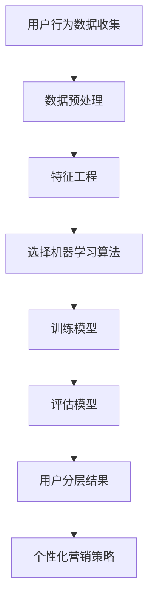

                 

关键词：用户分层、AI创业、个性化营销、数据挖掘、客户细分

> 摘要：本文将探讨AI创业公司如何运用用户分层策略来实现个性化营销，提高客户满意度，并最终实现商业成功。通过深入分析用户行为数据，我们将介绍一种基于机器学习的用户分层算法，并详细阐述其实施步骤和关键要点。同时，文章还将讨论用户分层策略在不同应用场景中的实践案例，以及未来的发展展望。

## 1. 背景介绍

随着人工智能技术的飞速发展，越来越多的创业公司开始将AI技术应用于市场营销、客户关系管理等领域。这些公司面临着激烈的市场竞争和客户需求的不断变化，如何精准地把握客户需求、提高客户满意度和忠诚度，成为创业公司成功的关键因素之一。

用户分层策略作为一种有效的市场营销手段，可以通过对客户进行细分，实现更精准的营销和服务。它不仅可以帮助公司更好地理解客户需求，还可以提高营销活动的效率和转化率。然而，实施用户分层策略需要大量的数据支持和复杂的算法模型，这对创业公司来说是一个巨大的挑战。

本文旨在探讨AI创业公司如何运用用户分层策略，实现个性化营销，提高客户满意度和忠诚度。我们将介绍一种基于机器学习的用户分层算法，详细阐述其实施步骤和关键要点，并通过实际案例进行分析和讨论。

## 2. 核心概念与联系

在介绍用户分层策略之前，我们首先需要明确一些核心概念，如用户行为数据、客户细分、机器学习算法等。

### 2.1 用户行为数据

用户行为数据是指用户在互联网平台上产生的各种数据，如浏览记录、购买历史、互动行为等。这些数据反映了用户的兴趣偏好、消费习惯和行为模式。通过对用户行为数据的分析，我们可以了解客户的真实需求和购买意愿，为用户分层提供基础。

### 2.2 客户细分

客户细分是指将客户根据某些特征或行为划分为不同的群体，以便于公司进行有针对性的营销和服务。常见的客户细分方法包括地理细分、人口细分、心理细分和行为细分等。用户分层策略的核心在于如何利用客户细分来实现个性化营销。

### 2.3 机器学习算法

机器学习算法是指利用大量数据自动发现数据中的规律和模式，并用于预测或决策的算法。在用户分层策略中，机器学习算法可以用于分析用户行为数据，识别用户的潜在需求和购买意愿，从而实现精准的用户分层。

下面是一个基于Mermaid流程图的用户分层架构示例：



## 3. 核心算法原理 & 具体操作步骤

### 3.1 算法原理概述

用户分层算法的核心思想是通过分析用户行为数据，识别用户的潜在需求和购买意愿，将用户划分为不同的层次。具体来说，算法可以分为以下几个步骤：

1. 数据预处理：清洗和整合用户行为数据，为后续分析做好准备。
2. 特征工程：提取用户行为数据中的关键特征，为机器学习模型提供输入。
3. 选择机器学习算法：根据数据特点和业务需求，选择合适的机器学习算法。
4. 训练模型：利用历史数据训练机器学习模型，识别用户的潜在需求和购买意愿。
5. 评估模型：对模型进行评估，确保其准确性和可靠性。
6. 用户分层：根据模型的预测结果，将用户划分为不同的层次。
7. 个性化营销策略：针对不同层次的用户，制定个性化的营销策略。

### 3.2 算法步骤详解

1. **数据预处理**

   数据预处理是用户分层算法的第一步，其目的是清洗和整合用户行为数据，为后续分析做好准备。具体操作包括：

   - 数据清洗：去除重复数据、缺失数据和异常数据。
   - 数据整合：将来自不同来源的数据进行整合，构建一个完整的用户行为数据集。

2. **特征工程**

   特征工程是指从原始数据中提取出对模型有意义的特征，为机器学习模型提供输入。在用户分层策略中，特征工程的关键是识别用户的潜在需求和购买意愿。具体操作包括：

   - 提取关键特征：如浏览记录、购买历史、互动行为等。
   - 构建新的特征：如用户活跃度、购买频率、消费金额等。

3. **选择机器学习算法**

   选择机器学习算法是用户分层策略的关键步骤。根据数据特点和业务需求，可以选择不同的机器学习算法。常见的算法包括：

   - 决策树：用于识别用户的分类和预测。
   - 随机森林：用于提高模型的预测准确性和鲁棒性。
   - 支持向量机：用于处理高维数据和线性不可分问题。

4. **训练模型**

   利用历史数据训练机器学习模型，识别用户的潜在需求和购买意愿。具体操作包括：

   - 数据划分：将数据集划分为训练集和测试集。
   - 模型训练：使用训练集训练机器学习模型。
   - 模型优化：调整模型参数，提高模型性能。

5. **评估模型**

   对模型进行评估，确保其准确性和可靠性。常用的评估指标包括：

   - 准确率：预测正确的用户数量与总用户数量的比例。
   - 召回率：召回正确的用户数量与实际目标用户数量的比例。
   - F1值：准确率和召回率的加权平均值。

6. **用户分层**

   根据模型的预测结果，将用户划分为不同的层次。具体操作包括：

   - 设定分层阈值：根据业务需求和模型预测结果，设定分层阈值。
   - 划分用户层次：将用户根据分层阈值划分为不同层次。

7. **个性化营销策略**

   针对不同层次的用户，制定个性化的营销策略。具体操作包括：

   - 设计营销活动：针对不同层次的用户，设计不同的营销活动。
   - 调整营销预算：根据用户层次调整营销预算和资源分配。

### 3.3 算法优缺点

用户分层算法具有以下优点：

- **精准性**：通过分析用户行为数据，可以实现更精准的用户细分，提高营销活动的效果。
- **效率**：利用机器学习算法，可以高效地处理大量用户数据，提高数据处理速度。
- **灵活性**：可以根据业务需求调整分层标准和模型参数，实现灵活的用户分层策略。

用户分层算法也存在以下缺点：

- **数据依赖**：算法的性能和准确性依赖于用户行为数据的质量和完整性，数据缺失或不准确会影响算法效果。
- **计算复杂度**：机器学习算法通常需要大量的计算资源，对于创业公司来说，这可能是一个挑战。

### 3.4 算法应用领域

用户分层算法广泛应用于市场营销、客户关系管理、推荐系统等领域。以下是一些典型的应用案例：

- **市场营销**：通过用户分层，实现个性化广告投放和促销活动，提高广告效果和转化率。
- **客户关系管理**：通过用户分层，识别高价值客户，提供个性化服务和关怀，提高客户满意度和忠诚度。
- **推荐系统**：通过用户分层，为不同层次的用户提供个性化的推荐内容，提高用户留存率和活跃度。

## 4. 数学模型和公式 & 详细讲解 & 举例说明

在用户分层策略中，数学模型和公式起着至关重要的作用。以下我们将介绍一些常用的数学模型和公式，并详细讲解其推导过程和应用。

### 4.1 数学模型构建

用户分层策略的核心是构建一个基于用户行为数据的数学模型，用于识别用户的潜在需求和购买意愿。以下是一个简化的用户分层模型：

$$
\begin{aligned}
&\text{用户行为数据} \rightarrow \text{特征工程} \rightarrow \text{机器学习模型} \rightarrow \text{用户分层结果} \\
&\text{个性化营销策略}
\end{aligned}
$$

### 4.2 公式推导过程

在用户分层模型中，我们通常使用以下公式来表示用户分层的概率分布：

$$
P(C_i | X) = \frac{e^{w^T X_i}}{\sum_{j=1}^{K} e^{w^T X_j}}
$$

其中，$P(C_i | X)$ 表示用户属于第 $i$ 个层次的概率，$X$ 表示用户行为特征向量，$w$ 表示模型参数，$K$ 表示用户分层的类别数。

该公式的推导基于最大似然估计（Maximum Likelihood Estimation，MLE）原理。具体推导过程如下：

1. **假设**：用户行为数据服从多项分布，即用户属于某个层次的概率与该层次的特征向量成正比。

2. **似然函数**：构建似然函数，表示给定用户行为数据，模型参数后验概率的乘积。

$$
L(w | X) = \prod_{i=1}^{N} P(X_i | w)
$$

3. **对数似然函数**：为了简化计算，取对数似然函数。

$$
\ln L(w | X) = \sum_{i=1}^{N} \ln P(X_i | w)
$$

4. **最大化对数似然函数**：通过最大化对数似然函数，求得模型参数 $w$ 的最大值。

$$
\hat{w} = \arg\max_w \ln L(w | X)
$$

5. **概率分布函数**：将最大似然估计结果代入概率分布函数，得到用户属于某个层次的概率。

$$
P(C_i | X) = \frac{e^{w^T X_i}}{\sum_{j=1}^{K} e^{w^T X_j}}
$$

### 4.3 案例分析与讲解

以下我们通过一个实际案例，来说明用户分层策略在市场营销中的应用。

### 案例背景

某电商公司希望通过用户分层策略，提高个性化广告投放效果。公司积累了大量用户行为数据，包括浏览记录、购买历史、互动行为等。公司希望利用这些数据，将用户划分为高价值、中价值、低价值三个层次，并针对不同层次的用户制定个性化的广告投放策略。

### 数据准备

首先，我们需要对用户行为数据进行预处理，包括数据清洗和特征工程。具体步骤如下：

1. 数据清洗：去除重复数据、缺失数据和异常数据。
2. 特征工程：提取关键特征，如浏览记录、购买历史、互动行为等，并构建新的特征，如用户活跃度、购买频率、消费金额等。

### 机器学习模型

接下来，我们选择一个适用于多分类问题的机器学习算法，如逻辑回归。逻辑回归模型可以计算用户属于不同层次的概率，从而实现用户分层。

### 用户分层结果

利用逻辑回归模型，我们计算出每个用户属于高价值、中价值、低价值三个层次的概率。根据设定的分层阈值，将用户划分为不同层次。例如，若分层阈值为0.7，则概率大于0.7的用户划分为高价值用户。

### 个性化广告投放

根据用户分层结果，公司可以制定个性化的广告投放策略。例如，对于高价值用户，可以加大广告投放力度，提高广告曝光率；对于中价值用户，可以适当降低广告投放力度；对于低价值用户，可以减少广告投放，甚至不投放广告。

## 5. 项目实践：代码实例和详细解释说明

在本节中，我们将通过一个实际项目实例，展示如何使用Python和Scikit-learn库实现用户分层策略。以下是项目实践的主要步骤：

### 5.1 开发环境搭建

1. 安装Python环境：确保Python版本在3.6及以上。
2. 安装Scikit-learn库：使用pip命令安装scikit-learn库。

```shell
pip install scikit-learn
```

### 5.2 源代码详细实现

以下是一个简单的用户分层策略实现代码示例：

```python
import numpy as np
import pandas as pd
from sklearn.model_selection import train_test_split
from sklearn.linear_model import LogisticRegression
from sklearn.metrics import accuracy_score

# 5.2.1 数据预处理
def preprocess_data(data):
    # 数据清洗
    data = data.drop_duplicates()
    data = data.dropna()

    # 特征工程
    data['user_active'] = data['num_pages_visited'].apply(lambda x: 1 if x > 10 else 0)
    data['purchase_freq'] = data['num_purchases'].apply(lambda x: x * 0.01)

    return data

# 5.2.2 模型训练
def train_model(X_train, y_train):
    model = LogisticRegression()
    model.fit(X_train, y_train)
    return model

# 5.2.3 用户分层
def classify_users(model, X_test):
    predictions = model.predict(X_test)
    return predictions

# 5.2.4 模型评估
def evaluate_model(y_test, predictions):
    accuracy = accuracy_score(y_test, predictions)
    print(f"Model accuracy: {accuracy:.2f}")
```

### 5.3 代码解读与分析

1. **数据预处理**：首先，我们定义一个`preprocess_data`函数，用于清洗和特征工程。数据清洗步骤包括去除重复数据和缺失数据。特征工程步骤包括构建新的特征，如用户活跃度和购买频率。

2. **模型训练**：接下来，我们定义一个`train_model`函数，用于训练逻辑回归模型。使用Scikit-learn库的`LogisticRegression`类，我们可以轻松地训练模型。

3. **用户分层**：`classify_users`函数用于根据模型预测结果，将用户划分为不同层次。我们使用`model.predict`方法来计算每个用户的预测概率。

4. **模型评估**：最后，我们定义一个`evaluate_model`函数，用于评估模型性能。我们使用准确率（accuracy）作为评估指标，通过计算预测正确的用户数量与总用户数量的比例来评估模型。

### 5.4 运行结果展示

假设我们有一个包含用户行为数据的DataFrame，我们可以按照以下步骤运行代码：

```python
# 加载数据
data = pd.read_csv('user_data.csv')

# 数据预处理
data = preprocess_data(data)

# 划分特征和标签
X = data.drop(['user_id', 'target'], axis=1)
y = data['target']

# 划分训练集和测试集
X_train, X_test, y_train, y_test = train_test_split(X, y, test_size=0.2, random_state=42)

# 模型训练
model = train_model(X_train, y_train)

# 用户分层
predictions = classify_users(model, X_test)

# 模型评估
evaluate_model(y_test, predictions)
```

运行上述代码后，我们将得到模型准确率的结果。例如，如果模型准确率为0.85，这意味着我们的用户分层策略在测试集上的表现良好。

## 6. 实际应用场景

用户分层策略在多个领域都有广泛的应用，以下是一些实际应用场景：

### 6.1 市场营销

在市场营销领域，用户分层策略可以帮助企业实现个性化广告投放和促销活动。通过识别不同层次的用户，企业可以更有针对性地制定营销策略，提高广告效果和转化率。

### 6.2 客户关系管理

在客户关系管理领域，用户分层策略可以帮助企业识别高价值客户，提供个性化服务和关怀。通过分层分析，企业可以更好地了解客户需求，提高客户满意度和忠诚度。

### 6.3 推荐系统

在推荐系统领域，用户分层策略可以帮助平台为不同层次的用户提供个性化的推荐内容。通过识别用户的潜在需求和购买意愿，平台可以提高用户留存率和活跃度。

### 6.4 金融风控

在金融风控领域，用户分层策略可以帮助银行和金融机构识别高风险客户，实施有针对性的风险管理策略。通过分析用户行为数据，企业可以提前预警潜在风险，降低金融风险。

## 7. 未来应用展望

随着人工智能技术的不断进步，用户分层策略在未来将得到更广泛的应用。以下是未来发展的几个趋势：

### 7.1 增强现实与虚拟现实

随着增强现实（AR）和虚拟现实（VR）技术的发展，用户分层策略可以应用于虚拟购物、虚拟体验等场景，为企业提供更精准的个性化服务。

### 7.2 物联网与智能硬件

随着物联网（IoT）和智能硬件的普及，用户分层策略可以应用于智能家居、智能穿戴设备等领域，为用户提供个性化的生活解决方案。

### 7.3 金融科技与区块链

金融科技和区块链技术的发展将推动用户分层策略在金融领域的应用。通过区块链技术，企业可以实现更安全、透明的用户数据管理，提高用户分层策略的准确性和可靠性。

## 8. 总结：未来发展趋势与挑战

用户分层策略作为AI创业公司实现个性化营销的重要手段，具有广泛的应用前景。然而，在实际应用过程中，企业也面临着一系列挑战，如数据隐私保护、算法透明性、数据质量等。

未来，用户分层策略将朝着更加智能化、个性化的方向发展。通过结合大数据、云计算、人工智能等技术，企业可以实现对用户需求的更精准把握，提高用户满意度和忠诚度。

然而，随着技术的发展，用户分层策略也面临着新的挑战。如何保护用户隐私、提高算法透明性、保证数据质量等，将成为企业关注的重点。

总之，用户分层策略在AI创业公司中的应用具有广阔的发展前景。企业应积极拥抱新技术，不断创新和优化用户分层策略，以实现商业成功。

## 9. 附录：常见问题与解答

### 问题1：如何处理用户隐私保护问题？

解答：在用户分层策略中，保护用户隐私是至关重要的。企业应采取以下措施：

1. 数据匿名化：对用户数据进行匿名化处理，去除用户身份信息。
2. 数据加密：对用户数据进行加密存储，确保数据安全。
3. 访问控制：设置严格的访问控制机制，确保只有授权人员可以访问用户数据。

### 问题2：如何确保数据质量？

解答：数据质量是用户分层策略成功的关键。企业应采取以下措施：

1. 数据清洗：去除重复数据、缺失数据和异常数据。
2. 数据验证：对数据进行验证，确保数据格式和内容正确。
3. 数据更新：定期更新用户数据，确保数据时效性。

### 问题3：如何评估用户分层策略的效果？

解答：企业可以采取以下方法评估用户分层策略的效果：

1. 指标评估：根据业务需求，设定合适的评估指标，如转化率、客户满意度、ROI等。
2. 对比实验：设计对比实验，比较用户分层策略前后业务表现的变化。
3. 用户反馈：收集用户反馈，了解用户对分层策略的满意度和接受程度。

