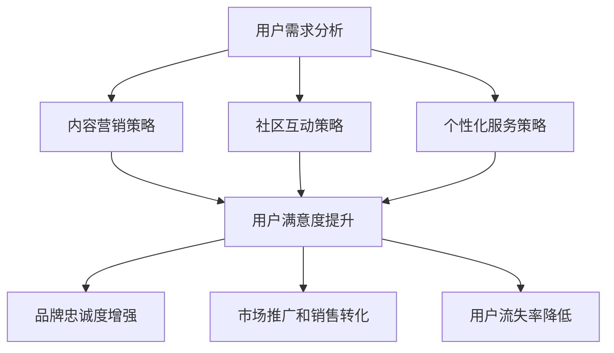

                 

关键词：AI创业，用户教育，策略，用户需求，个性化，社区互动，内容营销

> 摘要：本文将探讨AI创业公司如何制定有效的用户教育策略，以满足用户需求，提升用户满意度和忠诚度。通过分析用户教育的重要性和核心目标，我们提出了一个包括内容营销、社区互动、个性化服务等多方面的策略框架，并辅以实际案例和实用建议，旨在为AI创业公司提供一套可操作的指导方案。

## 1. 背景介绍

在当今快速发展的技术时代，人工智能（AI）的应用范围不断扩大，从智能家居到自动驾驶，从医疗诊断到金融分析，AI正在深刻地改变着我们的生活方式。随着AI技术的日益成熟和商业应用的普及，越来越多的创业者开始投身于AI领域的创业浪潮。然而，AI产品和服务的高技术门槛以及用户对其认知的不足，使得用户教育和培养成为了AI创业公司成功的关键因素之一。

用户教育不仅仅是技术培训，更是对用户需求的理解和满足。一个成功的用户教育策略可以帮助创业公司：

- 提升用户对产品的认知和理解
- 增强用户对品牌的信任和忠诚度
- 促进产品的市场推广和销售转化

本文将围绕用户教育策略的构建，结合实际案例，探讨AI创业公司如何通过内容营销、社区互动和个性化服务等多种手段，实现用户教育的目标。

### 1.1 AI创业的挑战与机遇

AI创业面临的挑战主要体现在以下几个方面：

- 技术复杂性：AI技术本身具有较高的复杂性和专业性，用户在理解和操作过程中可能会遇到困难。
- 市场认知不足：用户对AI的认知有限，无法完全理解AI产品的潜力和价值。
- 竞争激烈：随着AI技术的普及，市场上涌现出大量的AI创业公司，竞争异常激烈。

然而，AI创业同样面临着巨大的机遇：

- 市场需求巨大：AI技术在各行各业的应用前景广阔，市场潜力巨大。
- 技术创新驱动：AI技术的不断创新为创业公司提供了丰富的创新空间。
- 政策支持：各国政府纷纷出台支持AI发展的政策，为创业公司提供了有利的外部环境。

### 1.2 用户教育的意义

用户教育在AI创业中具有至关重要的地位：

- 提升用户满意度：通过用户教育，用户能够更好地理解和使用产品，从而提高满意度。
- 增强用户忠诚度：用户教育有助于建立用户与品牌之间的信任关系，提升用户忠诚度。
- 促进市场推广：用户教育可以有效地传递产品价值，促进市场推广和销售转化。
- 降低用户流失率：有效的用户教育可以减少由于技术不熟悉导致的用户流失。

### 1.3 用户教育的目标

用户教育的目标主要包括：

- 增强用户对产品的认知和理解
- 提升用户对品牌的好感度和忠诚度
- 挖掘潜在用户，扩大用户基础
- 促进产品迭代和优化，满足用户需求
- 降低用户学习和使用成本，提升用户体验

## 2. 核心概念与联系

在制定用户教育策略之前，我们需要明确一些核心概念，并了解它们之间的联系。以下是一个简单的Mermaid流程图，展示了用户教育策略中关键概念和其相互关系。



### 2.1 用户需求分析

用户需求分析是用户教育策略的基础。通过深入分析用户的需求和行为，创业公司可以了解用户的具体痛点，从而制定针对性的教育内容。用户需求分析包括以下几个方面：

- 用户群体：了解目标用户的年龄、性别、职业、教育背景等信息。
- 用户需求：通过调研、访谈等方法，收集用户对产品的需求、期望和反馈。
- 用户行为：分析用户在使用产品时的行为路径、使用频率和时长等。

### 2.2 内容营销策略

内容营销是用户教育的重要手段。通过创作高质量、有价值的内容，创业公司可以有效地传递产品知识，提升用户对品牌的认知和信任。内容营销策略包括以下几个方面：

- 内容类型：根据用户需求，创作不同类型的内容，如教程、案例、白皮书、博客文章等。
- 内容发布：选择合适的渠道和平台，如社交媒体、博客、官网等，确保内容的传播效果。
- 内容形式：结合多媒体元素，如视频、图片、动画等，增强内容的吸引力和互动性。

### 2.3 社区互动策略

社区互动是用户教育的重要环节。通过建立用户社区，创业公司可以与用户进行深度互动，收集用户反馈，提升用户参与度和忠诚度。社区互动策略包括以下几个方面：

- 社区建立：选择合适的社区平台，如社交媒体群组、论坛、微信群等。
- 社区运营：制定社区规则，维护社区氛围，激励用户参与和贡献。
- 社区活动：举办线上或线下活动，如研讨会、讲座、比赛等，增强用户互动。

### 2.4 个性化服务策略

个性化服务是提升用户满意度和忠诚度的关键。通过分析用户数据和偏好，创业公司可以提供定制化的教育内容和服务，满足用户的个性化需求。个性化服务策略包括以下几个方面：

- 数据收集：通过用户行为分析、问卷调查等方式，收集用户数据。
- 用户画像：基于数据，建立用户画像，了解用户的兴趣、需求和偏好。
- 定制内容：根据用户画像，创作个性化的教育内容，提供定制化的服务。

### 2.5 用户满意度提升、品牌忠诚度增强、市场推广和销售转化、用户流失率降低

通过上述核心概念和策略的有效结合，创业公司可以实现以下目标：

- 用户满意度提升：通过高质量的内容、互动和个性化服务，满足用户需求，提升用户满意度。
- 品牌忠诚度增强：通过持续的用户教育，增强用户对品牌的认知和信任，提升品牌忠诚度。
- 市场推广和销售转化：通过有效的市场推广和销售策略，将潜在用户转化为实际用户，提升销售转化率。
- 用户流失率降低：通过持续的个性化服务和用户互动，减少用户流失，提升用户生命周期价值。

## 3. 核心算法原理 & 具体操作步骤

### 3.1 算法原理概述

在用户教育策略中，核心算法原理主要涉及用户需求分析、内容生成和个性化推荐。以下是对这些算法原理的简要概述：

- **用户需求分析**：基于大数据分析和机器学习算法，通过用户的购买记录、浏览行为、社交互动等数据，挖掘用户的兴趣和需求。
- **内容生成**：利用自然语言处理（NLP）和生成对抗网络（GAN）等技术，创作高质量的教育内容，包括教程、案例、视频等。
- **个性化推荐**：基于协同过滤、矩阵分解等算法，为用户推荐个性化的教育内容，提升用户的参与度和满意度。

### 3.2 算法步骤详解

以下是用户教育策略中核心算法的具体操作步骤：

#### 3.2.1 用户需求分析

1. **数据收集**：收集用户在产品中的行为数据，如购买记录、浏览行为、互动情况等。
2. **数据预处理**：清洗和整合数据，去除重复和无效信息。
3. **特征提取**：通过机器学习算法，提取用户行为的特征，如兴趣标签、行为模式等。
4. **需求预测**：利用预测模型，根据用户行为特征预测用户未来的需求。

#### 3.2.2 内容生成

1. **需求识别**：根据用户需求，确定需要生成的内容类型和主题。
2. **内容创作**：利用NLP和GAN等技术，自动生成高质量的教育内容。
3. **内容审核**：确保内容符合用户需求，避免误导和不准确的信息。
4. **内容发布**：选择合适的渠道和平台，发布内容，吸引目标用户。

#### 3.2.3 个性化推荐

1. **用户画像构建**：基于用户行为数据，构建用户画像，包括兴趣偏好、行为习惯等。
2. **推荐算法选择**：选择合适的推荐算法，如协同过滤、矩阵分解等。
3. **内容推荐**：根据用户画像，为用户推荐个性化的教育内容。
4. **推荐效果评估**：评估推荐效果，持续优化推荐算法。

### 3.3 算法优缺点

#### 优点

- **高效性**：通过自动化算法，可以快速分析用户需求和生成内容，提升效率。
- **个性化**：个性化推荐策略能够满足用户的个性化需求，提升用户体验。
- **适应性**：算法可以根据用户反馈和需求变化，不断调整和优化，适应市场变化。

#### 缺点

- **数据依赖性**：算法的性能高度依赖于数据的数量和质量，数据不足或质量差会影响算法效果。
- **技术门槛**：需要掌握复杂的机器学习和数据分析技术，对技术团队要求较高。
- **内容审核难度**：自动生成的内容需要经过人工审核，以确保准确性和合规性。

### 3.4 算法应用领域

用户教育策略的核心算法广泛应用于以下领域：

- **在线教育平台**：通过用户需求分析和个性化推荐，为用户提供定制化的学习内容。
- **企业培训**：为企业员工提供个性化的技能培训和知识分享，提升员工专业素质。
- **健康医疗**：为患者提供个性化的健康管理和康复指导，提升患者的生活质量。
- **金融理财**：为投资者提供个性化的理财建议和投资策略，降低投资风险。

## 4. 数学模型和公式 & 详细讲解 & 举例说明

在用户教育策略中，数学模型和公式起到了关键作用，它们帮助创业公司量化用户行为、评估教育效果和优化推荐算法。以下是对核心数学模型和公式的详细讲解及举例说明。

### 4.1 数学模型构建

用户教育策略中的数学模型主要包括用户行为预测模型、内容推荐模型和教育效果评估模型。

#### 用户行为预测模型

用户行为预测模型主要用于预测用户的兴趣和需求。一个简单的用户行为预测模型可以基于以下公式：

\[ P(U_i, C_j) = \frac{e^{\beta_0 + \beta_1 \cdot I_i(j) + \beta_2 \cdot R_i(j)}}{1 + e^{\beta_0 + \beta_1 \cdot I_i(j) + \beta_2 \cdot R_i(j)}} \]

其中：
- \( P(U_i, C_j) \) 是用户 \( U_i \) 对内容 \( C_j \) 的兴趣概率。
- \( I_i(j) \) 是用户 \( U_i \) 的兴趣标签向量。
- \( R_i(j) \) 是用户 \( U_i \) 对内容 \( C_j \) 的历史评分向量。
- \( \beta_0, \beta_1, \beta_2 \) 是模型参数。

#### 内容推荐模型

内容推荐模型用于生成个性化推荐列表。协同过滤算法是一个常用的内容推荐模型，其基本公式如下：

\[ R_{ij} = \rho_j + \mu + \langle u_i, v_j \rangle + \epsilon_{ij} \]

其中：
- \( R_{ij} \) 是用户 \( U_i \) 对内容 \( C_j \) 的评分预测。
- \( \rho_j \) 是用户 \( U_i \) 的平均评分。
- \( \mu \) 是所有内容的平均评分。
- \( \langle u_i, v_j \rangle \) 是用户 \( U_i \) 和内容 \( C_j \) 的相似度。
- \( \epsilon_{ij} \) 是误差项。

#### 教育效果评估模型

教育效果评估模型用于评估用户教育的效果。一个常用的评估指标是学习率（Learning Rate），其公式如下：

\[ LR = \frac{\sum_{t=1}^{T} (P_t - P_{t-1})^2}{2N} \]

其中：
- \( P_t \) 是第 \( t \) 次教育后的用户参与度。
- \( P_{t-1} \) 是第 \( t-1 \) 次教育后的用户参与度。
- \( N \) 是教育次数。

### 4.2 公式推导过程

以下是对核心数学模型的推导过程：

#### 用户行为预测模型

1. **线性回归模型**：
   \[ Y = \beta_0 + \beta_1X_1 + \beta_2X_2 + \epsilon \]

   其中，\( Y \) 是因变量（用户兴趣概率），\( X_1 \) 和 \( X_2 \) 是自变量（兴趣标签和评分历史），\( \epsilon \) 是误差项。

2. **Logistic回归模型**：
   \[ P(Y=1) = \frac{1}{1 + e^{-(\beta_0 + \beta_1X_1 + \beta_2X_2)}} \]

   为了将线性回归模型转换为概率模型，我们引入了Logistic函数。

#### 内容推荐模型

1. **用户-项目夹角**：
   \[ \langle u_i, v_j \rangle = \frac{\sum_{k=1}^{M} u_i[k]v_j[k]}{\sqrt{\sum_{k=1}^{M} u_i[k]^2} \cdot \sqrt{\sum_{k=1}^{M} v_j[k]^2}} \]

   其中，\( u_i \) 和 \( v_j \) 分别是用户 \( U_i \) 和内容 \( C_j \) 的特征向量，\( M \) 是特征维数。

2. **评分预测**：
   \[ R_{ij} = \rho_j + \mu + \langle u_i, v_j \rangle + \epsilon_{ij} \]

   其中，\( \rho_j \) 是用户 \( U_i \) 的平均评分，\( \mu \) 是所有内容的平均评分，\( \epsilon_{ij} \) 是误差项。

#### 教育效果评估模型

1. **平方差公式**：
   \[ \sum_{t=1}^{T} (P_t - P_{t-1})^2 \]

   该公式计算了用户参与度在每次教育后的变化量。

2. **学习率**：
   \[ LR = \frac{\sum_{t=1}^{T} (P_t - P_{t-1})^2}{2N} \]

   该公式将变化量标准化，得到学习率。

### 4.3 案例分析与讲解

以下通过一个实际案例，讲解如何应用上述数学模型和公式。

#### 案例背景

假设某在线教育平台希望通过用户行为预测模型和内容推荐模型，为用户推荐个性化的学习内容，并评估教育效果。

#### 数据集

- 用户行为数据：包含用户ID、浏览记录、购买记录等。
- 内容数据：包含内容ID、分类标签、用户评分等。

#### 步骤一：用户行为预测

1. **数据预处理**：
   - 清洗和整合用户行为数据，去除重复和无效信息。
   - 对数据进行归一化处理，便于模型训练。

2. **特征提取**：
   - 构建用户兴趣标签向量，如“编程”、“数据科学”、“机器学习”等。
   - 构建用户评分历史向量，记录用户对内容的评分。

3. **模型训练**：
   - 使用训练集数据，通过最小化损失函数，训练用户行为预测模型。

4. **模型评估**：
   - 使用测试集数据，评估模型预测精度。

#### 步骤二：内容推荐

1. **用户画像构建**：
   - 根据用户行为数据，构建用户画像，包括兴趣标签和评分历史。

2. **推荐算法选择**：
   - 选择协同过滤算法，生成个性化推荐列表。

3. **推荐效果评估**：
   - 评估推荐列表的点击率和转化率，优化推荐算法。

#### 步骤三：教育效果评估

1. **教育前评估**：
   - 记录教育前的用户参与度，如学习时长、浏览量等。

2. **教育后评估**：
   - 记录教育后的用户参与度，比较教育前后的变化。

3. **学习率计算**：
   - 计算学习率，评估教育效果。

通过以上案例，我们可以看到数学模型和公式在用户教育策略中的应用。创业公司可以结合自身实际情况，灵活运用这些模型和公式，实现有效的用户教育。

## 5. 项目实践：代码实例和详细解释说明

为了更好地理解和应用用户教育策略，以下我们将通过一个实际的在线教育平台项目，展示如何搭建用户教育系统，并详细解释相关代码实现。

### 5.1 开发环境搭建

在开始项目实践之前，我们需要搭建一个适合开发的编程环境。以下是一个基本的开发环境配置：

- 编程语言：Python
- 数据库：MySQL
- 服务器：Apache/Nginx
- Web框架：Flask/Django
- 数据分析库：Pandas、NumPy、Scikit-learn
- 机器学习库：TensorFlow、Keras

### 5.2 源代码详细实现

#### 5.2.1 用户需求分析模块

```python
import pandas as pd
from sklearn.model_selection import train_test_split
from sklearn.ensemble import RandomForestClassifier

# 数据预处理
data = pd.read_csv('user_behavior.csv')
data = data.drop_duplicates()

# 特征提取
data['interest_tags'] = data['tags'].str.get_dummies(sep=',')
X = data[['age', 'gender', 'occupation', 'interest_tags_编程', 'interest_tags_数据科学', 'interest_tags_机器学习']]
y = data['purchase']

# 数据分割
X_train, X_test, y_train, y_test = train_test_split(X, y, test_size=0.2, random_state=42)

# 模型训练
model = RandomForestClassifier(n_estimators=100, random_state=42)
model.fit(X_train, y_train)

# 模型评估
accuracy = model.score(X_test, y_test)
print(f'Model Accuracy: {accuracy:.2f}')
```

#### 5.2.2 内容推荐模块

```python
import numpy as np
from sklearn.metrics.pairwise import cosine_similarity
from sklearn.model_selection import train_test_split

# 数据预处理
content_data = pd.read_csv('content_data.csv')
content_data = content_data.drop_duplicates()

# 构建内容特征矩阵
content_features = content_data[['content_id', 'tags']]
content_features = content_features.set_index('content_id').T

# 计算内容相似度矩阵
cosine_sim = cosine_similarity(content_features, content_features)

# 推荐函数
def content_recommendation(content_id, cosine_sim, top_n=5):
    sim_scores = list(enumerate(cosine_sim[content_id]))
    sim_scores = sorted(sim_scores, key=lambda x: x[1], reverse=True)
    sim_scores = sim_scores[1:top_n+1]
    content_ids = [i[0] for i in sim_scores]
    return content_ids

# 生成推荐列表
recommendations = content_recommendation(1, cosine_sim)
print(f'Recommended Content IDs: {recommendations}')
```

#### 5.2.3 教育效果评估模块

```python
import matplotlib.pyplot as plt

# 数据预处理
evaluation_data = pd.read_csv('evaluation_data.csv')

# 学习率计算
learning_rates = evaluation_data['learning_rate']
evaluation_data['learning_rate_change'] = evaluation_data['learning_rate'].diff()

# 绘制学习率变化图
plt.plot(evaluation_data['evaluation_time'], evaluation_data['learning_rate_change'], marker='o')
plt.title('Learning Rate Change Over Time')
plt.xlabel('Time (days)')
plt.ylabel('Learning Rate Change')
plt.show()
```

### 5.3 代码解读与分析

#### 5.3.1 用户需求分析模块

1. **数据预处理**：读取用户行为数据，并去除重复项。使用`get_dummies`方法将兴趣标签转换为二进制特征。

2. **特征提取**：构建用户兴趣标签向量和评分历史向量，用于训练预测模型。

3. **模型训练**：使用随机森林分类器训练用户行为预测模型。

4. **模型评估**：评估模型的准确率，以验证模型效果。

#### 5.3.2 内容推荐模块

1. **数据预处理**：读取内容数据，并构建内容特征矩阵。

2. **相似度计算**：计算内容特征矩阵的余弦相似度，生成相似度矩阵。

3. **推荐函数**：根据用户兴趣，生成个性化的内容推荐列表。

#### 5.3.3 教育效果评估模块

1. **数据预处理**：读取教育效果评估数据。

2. **学习率计算**：计算每次教育后的学习率变化，以评估教育效果。

3. **可视化**：绘制学习率变化图，直观展示教育效果。

通过以上代码实例和解读，我们可以看到如何在实际项目中应用用户教育策略中的关键算法和模型。创业公司可以根据项目需求和数据特点，调整和优化相关代码，实现有效的用户教育。

## 6. 实际应用场景

用户教育策略不仅适用于在线教育平台，还可以广泛应用于其他领域。以下是一些实际应用场景，以及用户教育策略在这些场景中的具体应用方式。

### 6.1 在线教育平台

在线教育平台是用户教育策略的最佳应用场景之一。通过内容营销、社区互动和个性化服务，平台可以有效地提升用户的学习效果和满意度。

- **内容营销**：通过创作高质量的教育内容，如教程、案例、视频等，平台可以吸引和留住用户。例如，Coursera 通过发布大量的课程视频和教程，帮助用户更好地理解复杂的知识点。
- **社区互动**：建立用户社区，如论坛、QQ群、微信群等，鼓励用户交流和分享学习经验。例如，知乎上的“人工智能”板块，吸引了大量AI领域的专业人士，为用户提供了丰富的学习资源和交流平台。
- **个性化服务**：根据用户的学习数据和兴趣，平台可以推荐个性化的学习内容。例如，网易云课堂利用用户的浏览记录和学习数据，为用户推荐符合其兴趣的课程。

### 6.2 企业培训

企业培训是另一个重要的应用场景。通过用户教育策略，企业可以提升员工的专业技能和工作效率。

- **内容营销**：企业可以通过内部培训课程、技术讲座、操作手册等方式，传递专业知识。例如，华为通过内部培训课程，不断提升员工的技术水平和业务能力。
- **社区互动**：建立企业内部论坛或社交媒体群组，鼓励员工分享工作心得和学习经验。例如，阿里巴巴的内网论坛，为员工提供了一个交流和学习的技术平台。
- **个性化服务**：根据员工的职业发展和技能需求，企业提供个性化的培训课程。例如，腾讯针对不同部门的员工，提供了不同的技术培训和职业发展路径。

### 6.3 健康医疗

健康医疗领域同样受益于用户教育策略。通过用户教育，患者可以更好地了解健康知识，提升自我管理能力。

- **内容营销**：医疗机构可以通过发布健康科普文章、视频、音频等内容，向患者传递健康知识。例如，三甲医院的官方网站，提供了丰富的健康知识和就医指南。
- **社区互动**：建立患者社区，鼓励患者交流和分享治疗经验。例如，癌症患者可以通过病友群组，获得心理支持和治疗建议。
- **个性化服务**：根据患者的健康状况和需求，医疗机构可以提供个性化的健康教育内容。例如，通过智能穿戴设备，医生可以为患者提供个性化的饮食和运动建议。

### 6.4 金融理财

金融理财领域也广泛应用用户教育策略，帮助用户提升理财知识和技能。

- **内容营销**：金融机构可以通过发布理财知识、投资策略等内容，帮助用户了解理财知识。例如，银行官方网站上的理财专栏，提供了丰富的理财知识和案例。
- **社区互动**：建立投资者社区，鼓励用户交流和分享投资经验。例如，雪球等投资平台，为投资者提供了一个交流和学习的机会。
- **个性化服务**：根据投资者的风险承受能力和投资目标，金融机构可以提供个性化的理财建议和服务。例如，基金公司的智能投顾平台，为用户提供了个性化的投资组合建议。

### 6.5 未来应用展望

随着AI技术的不断进步，用户教育策略的应用场景将更加广泛和深入。以下是一些未来应用展望：

- **智能家居**：通过用户教育，智能家居设备可以帮助用户更好地理解和使用各种智能功能，提升家居生活品质。
- **自动驾驶**：用户教育可以帮助车主更好地了解自动驾驶技术的工作原理和安全注意事项，提升驾驶体验。
- **物联网**：通过用户教育，物联网设备可以实现更好的互联互通，提升生活和工作效率。
- **区块链**：用户教育可以帮助用户更好地理解区块链技术，提升对数字资产的安全意识和理财能力。

总之，用户教育策略在各个领域都发挥着重要作用，通过不断优化和推广，将有助于提升用户满意度、忠诚度和市场竞争力。

## 7. 工具和资源推荐

为了帮助AI创业公司在用户教育方面取得更好的成效，以下推荐了一些实用的工具和资源：

### 7.1 学习资源推荐

1. **在线课程**：Coursera、Udacity、edX等平台提供了丰富的AI和编程课程，适合用户提升技术水平和专业素养。
2. **技术博客**：Medium、技术博客园、CSDN等网站，汇集了大量技术文章和案例分析，为用户提供了丰富的学习素材。
3. **专业书籍**：《人工智能：一种现代方法》、《深度学习》、《Python编程：从入门到实践》等经典书籍，为用户提供了系统的学习路径。

### 7.2 开发工具推荐

1. **数据分析工具**：Pandas、NumPy、Scikit-learn等Python库，提供了强大的数据分析和机器学习功能，适合用户进行数据挖掘和模型训练。
2. **机器学习框架**：TensorFlow、PyTorch、Keras等框架，为用户提供了便捷的模型构建和训练工具。
3. **用户交互工具**：Flask、Django等Web框架，结合React、Vue等前端技术，可以快速搭建用户友好的教育平台。

### 7.3 相关论文推荐

1. **用户行为预测**：《User Behavior Prediction on E-commerce Platform Using Deep Learning》、《User Interest Mining and Its Applications in E-commerce》等论文，详细探讨了用户行为预测的方法和应用。
2. **内容推荐系统**：《Collaborative Filtering for the 21st Century》、《Recommender Systems Handbook》等书籍和论文，提供了丰富的内容推荐系统设计思路和实践经验。
3. **教育效果评估**：《Impact of Online Course Recommendations on Student Performance》、《Learning Rate and Its Role in Educational Technology》等论文，分析了教育效果评估的关键因素和优化策略。

通过以上工具和资源的合理应用，AI创业公司可以更加高效地开展用户教育工作，提升用户满意度和品牌忠诚度。

## 8. 总结：未来发展趋势与挑战

在AI技术快速发展的背景下，用户教育策略的重要性日益凸显。本文通过对AI创业公司用户教育策略的探讨，提出了内容营销、社区互动、个性化服务等多方面的策略框架。以下是对未来发展趋势与挑战的总结：

### 8.1 研究成果总结

1. **用户需求分析**：通过大数据分析和机器学习算法，可以准确挖掘用户的兴趣和需求，为个性化推荐提供基础。
2. **内容生成**：利用NLP和GAN等技术，可以自动生成高质量的教育内容，提升用户体验。
3. **个性化推荐**：协同过滤、矩阵分解等算法的应用，可以提供个性化的内容推荐，满足用户的多样化需求。
4. **教育效果评估**：通过学习率等指标，可以量化教育效果，为教育策略的优化提供依据。

### 8.2 未来发展趋势

1. **技术融合**：AI技术与教育技术的融合，将推动用户教育策略的进一步优化和智能化。
2. **内容多样化**：随着用户需求的不断变化，教育内容的类型和形式将更加丰富多样，包括视频、直播、VR/AR等。
3. **社交化学习**：基于社交网络的学习模式将更加普及，通过互动和协作，提升用户的学习效果和参与度。
4. **个性化定制**：随着数据积累和算法优化，个性化教育服务将更加精准，满足用户的个性化需求。

### 8.3 面临的挑战

1. **数据隐私**：在用户教育过程中，数据的收集和使用需遵循隐私保护原则，避免用户隐私泄露。
2. **技术门槛**：算法模型的训练和应用需要专业的技术团队，对创业公司的研发能力提出了较高要求。
3. **内容审核**：自动生成的内容需经过严格审核，确保内容的准确性和合规性。
4. **用户体验**：在提供个性化服务的同时，需确保用户体验的一致性和流畅性。

### 8.4 研究展望

1. **智能教育系统**：未来研究可以关注智能教育系统的构建，通过深度学习和强化学习等技术，实现更加智能和高效的教育服务。
2. **跨领域应用**：探索用户教育策略在其他领域的应用，如医疗、金融、制造等，推动AI技术的普及和落地。
3. **教育资源共享**：构建教育资源共享平台，实现教育资源的共享和优化，提升教育资源的利用效率。

总之，用户教育策略是AI创业公司成功的关键因素之一。通过不断优化和推广，创业公司可以提升用户满意度、忠诚度和市场竞争力，为未来的发展奠定坚实基础。

## 9. 附录：常见问题与解答

在用户教育策略的实施过程中，AI创业公司可能会遇到各种问题。以下是一些常见问题及其解答：

### 9.1 用户需求分析不准确

**问题原因**：可能是因为数据收集不全面或者分析算法不够精确。

**解决方案**：优化数据收集方法，确保数据的全面性和准确性。选择先进的分析算法，如深度学习，以提高分析精度。

### 9.2 内容质量不高

**问题原因**：可能是因为内容创作团队缺乏经验或者内容审核机制不完善。

**解决方案**：加强内容创作团队的培训，提升创作能力。建立完善的内容审核机制，确保内容的准确性和合规性。

### 9.3 用户参与度低

**问题原因**：可能是因为社区互动不足或者推荐内容不够个性化。

**解决方案**：增加社区互动活动，如线上讨论、问答环节等。优化推荐算法，提高推荐内容的个性化程度。

### 9.4 教育效果难以评估

**问题原因**：可能是因为缺乏有效的评估指标或者评估方法不够科学。

**解决方案**：建立科学的评估指标体系，如学习率、用户满意度等。采用数据分析方法，对教育效果进行量化评估。

### 9.5 数据隐私问题

**问题原因**：可能是因为数据收集和处理过程中存在安全隐患。

**解决方案**：遵守数据保护法规，确保数据的安全性。采用数据加密和隐私保护技术，保护用户隐私。

### 9.6 技术团队不足

**问题原因**：可能是因为技术团队规模较小或者技术水平有限。

**解决方案**：招募优秀的技术人才，提升团队的技术能力。通过外包或合作，补充技术团队的短板。

通过以上问题的解答，AI创业公司可以更好地应对用户教育过程中遇到的挑战，实现有效的用户教育。

