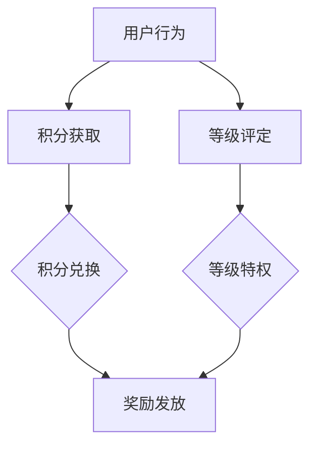

                 

关键词：AI创业公司，用户激励，奖励机制，积分机制，等级机制，奖励方案

摘要：在AI创业公司的发展过程中，吸引并留住用户是关键。本文将深入探讨用户激励与奖励机制的设计，包括积分机制、等级机制以及奖励方案的构建，旨在为创业公司提供实用的策略，以提升用户活跃度和忠诚度。

## 1. 背景介绍

在数字化的今天，用户激励与奖励机制已经成为许多公司成功的重要因素。特别是在AI创业公司中，如何有效地吸引和激励用户，提升用户体验，成为公司发展的核心问题。用户激励不仅能够增加用户粘性，还能促进产品推广和销售。本文将围绕以下核心问题展开：

1. 积分机制如何设计才能激发用户参与？
2. 等级机制如何设立以提升用户成就感和忠诚度？
3. 奖励方案如何制定以最大化用户价值？

通过对这些问题的深入探讨，我们希望为AI创业公司提供一套实用的用户激励与奖励机制设计指南。

## 2. 核心概念与联系

在讨论用户激励与奖励机制之前，我们需要明确几个核心概念，包括积分、等级和奖励等。

### 2.1 积分机制

积分是一种虚拟货币，用于衡量用户在平台上的参与度。积分可以通过多种方式获得，如签到、完成任务、分享内容等。积分不仅可以用于兑换商品或服务，还能激励用户持续参与。

### 2.2 等级机制

等级机制是基于积分或其他指标对用户进行分类，以区分用户的不同贡献和地位。通常，等级会与特殊标识、特权和服务挂钩，以增强用户的成就感和认同感。

### 2.3 奖励方案

奖励方案是公司为激励用户而制定的具体措施，包括实物奖励、虚拟货币、特殊服务或特权等。合理的奖励方案能够提高用户活跃度和忠诚度。

下面是一个Mermaid流程图，展示积分机制、等级机制和奖励方案之间的联系：



## 3. 核心算法原理 & 具体操作步骤

### 3.1 算法原理概述

用户激励与奖励机制的核心在于平衡积分获取、等级评定和奖励发放。我们需要确保：

1. 积分获取简单易懂，激励用户参与。
2. 等级评定公平合理，激励用户提升等级。
3. 奖励发放及时有效，激励用户持续活跃。

### 3.2 算法步骤详解

#### 3.2.1 积分获取

积分获取可以通过以下步骤实现：

1. 确定积分获取方式，如签到、完成任务、分享内容等。
2. 设定每个行为对应的积分值，确保获取方式简单易懂。
3. 对用户行为进行记录，实时更新积分。

#### 3.2.2 等级评定

等级评定可以通过以下步骤实现：

1. 设定等级标准，如积分要求、活跃度等。
2. 定期对用户积分进行统计，评定用户等级。
3. 根据等级设定相应的特权和服务。

#### 3.2.3 奖励发放

奖励发放可以通过以下步骤实现：

1. 设定奖励方案，包括实物奖励、虚拟货币、特殊服务等。
2. 根据用户等级和积分，发放相应奖励。
3. 确保奖励发放及时有效，提高用户满意度。

### 3.3 算法优缺点

#### 优点

1. 激励用户参与，提高平台活跃度。
2. 增强用户成就感和忠诚度。
3. 便于统计和分析用户行为，为产品优化提供数据支持。

#### 缺点

1. 积分和等级设置不当可能导致用户流失。
2. 奖励发放不及时或不当会影响用户满意度。
3. 需要持续优化和调整，以适应市场变化。

### 3.4 算法应用领域

用户激励与奖励机制可以广泛应用于各种场景，包括电子商务、在线教育、社交媒体等。在AI创业公司中，该机制尤为重要，因为AI技术能够提供更精准的用户行为分析和个性化推荐，从而优化激励策略。

## 4. 数学模型和公式

在用户激励与奖励机制设计中，数学模型和公式有助于量化用户行为和激励效果。以下是一个简单的数学模型：

### 4.1 数学模型构建

$$
积分 = f(用户行为，积分权重)
$$

$$
等级 = g(积分，等级阈值)
$$

$$
奖励 = h(等级，奖励权重)
$$

### 4.2 公式推导过程

#### 积分获取公式

积分获取取决于用户行为和积分权重。例如，签到行为可以设置积分权重为1，完成任务可以设置积分权重为3。

$$
积分 = 签到次数 \times 积分权重 + 完成任务数 \times 积分权重
$$

#### 等级评定公式

等级评定基于积分和等级阈值。例如，等级1的积分阈值为100，等级2的积分阈值为300。

$$
等级 = \text{round}(\frac{积分}{等级阈值})
$$

#### 奖励发放公式

奖励发放基于等级和奖励权重。例如，等级1的奖励权重为10，等级2的奖励权重为20。

$$
奖励 = 等级 \times 奖励权重
$$

### 4.3 案例分析与讲解

假设一个用户在一个月内签到15次，完成任务10个，根据上述公式计算：

$$
积分 = 15 \times 1 + 10 \times 3 = 45
$$

$$
等级 = \text{round}(\frac{45}{100}) = 0
$$

$$
奖励 = 0 \times 10 = 0
$$

根据计算结果，该用户目前处于等级0，没有获得任何奖励。

## 5. 项目实践：代码实例和详细解释说明

为了更好地理解用户激励与奖励机制的设计，我们以一个简单的Python项目为例，实现积分获取、等级评定和奖励发放。

### 5.1 开发环境搭建

- Python 3.8及以上版本
- Flask框架（用于构建Web应用）
- SQLite数据库（用于存储用户数据）

### 5.2 源代码详细实现

```python
# user_reward_system.py
from flask import Flask, request, jsonify
import sqlite3

app = Flask(__name__)

# 初始化数据库连接
conn = sqlite3.connect('user_data.db')
c = conn.cursor()

# 创建用户表
c.execute('''CREATE TABLE IF NOT EXISTS users
             (id INTEGER PRIMARY KEY AUTOINCREMENT,
              username TEXT NOT NULL,
              points INTEGER NOT NULL DEFAULT 0,
              level INTEGER NOT NULL DEFAULT 0)''')
conn.commit()

# 签到增加积分
@app.route('/sign_in', methods=['POST'])
def sign_in():
    username = request.json['username']
    c.execute("SELECT * FROM users WHERE username=?", (username,))
    user = c.fetchone()
    if user:
        c.execute("UPDATE users SET points=points+1 WHERE username=?", (username,))
    else:
        c.execute("INSERT INTO users (username, points) VALUES (?, 1)", (username,))
    conn.commit()
    return jsonify({"message": "签到成功，积分+1"})

# 完成任务增加积分
@app.route('/complete_task', methods=['POST'])
def complete_task():
    username = request.json['username']
    c.execute("SELECT * FROM users WHERE username=?", (username,))
    user = c.fetchone()
    if user:
        c.execute("UPDATE users SET points=points+3 WHERE username=?", (username,))
    else:
        c.execute("INSERT INTO users (username, points) VALUES (?, 3)", (username,))
    conn.commit()
    return jsonify({"message": "完成任务，积分+3"})

# 查询用户等级
@app.route('/user_level', methods=['GET'])
def user_level():
    username = request.args.get('username')
    c.execute("SELECT * FROM users WHERE username=?", (username,))
    user = c.fetchone()
    if user:
        level = user[3]
        return jsonify({"username": username, "level": level})
    else:
        return jsonify({"message": "用户未找到"})

# 发放奖励
@app.route('/reward', methods=['GET'])
def reward():
    username = request.args.get('username')
    c.execute("SELECT * FROM users WHERE username=?", (username,))
    user = c.fetchone()
    if user:
        level = user[3]
        reward = level * 10
        c.execute("UPDATE users SET points=points-{} WHERE username=?".format(reward), (username,))
        conn.commit()
        return jsonify({"message": "奖励发放成功，积分-{}，当前积分：{}".format(reward, user[2]-reward)})
    else:
        return jsonify({"message": "用户未找到"})

if __name__ == '__main__':
    app.run(debug=True)
```

### 5.3 代码解读与分析

上述代码实现了一个简单的用户激励与奖励系统，主要包括三个功能：

1. **签到增加积分**：用户通过POST请求向`/sign_in`接口发送签到请求，系统根据用户名更新积分。
2. **完成任务增加积分**：用户通过POST请求向`/complete_task`接口发送完成任务请求，系统根据用户名更新积分。
3. **查询用户等级**：用户通过GET请求向`/user_level`接口发送用户名，系统返回用户的等级。
4. **发放奖励**：用户通过GET请求向`/reward`接口发送用户名，系统根据用户等级发放奖励，扣除相应积分。

### 5.4 运行结果展示

假设用户名为`alice`，执行以下操作：

1. 签到15次，完成任务10个：
   ```shell
   curl -X POST -H "Content-Type: application/json" -d '{"username": "alice"}' http://localhost:5000/sign_in
   curl -X POST -H "Content-Type: application/json" -d '{"username": "alice"}' http://localhost:5000/complete_task
   ```
   运行结果：
   ```json
   {"message": "签到成功，积分+1"}
   {"message": "完成任务，积分+3"}
   ```

2. 查询用户等级：
   ```shell
   curl -X GET -G "http://localhost:5000/user_level?username=alice"
   ```
   运行结果：
   ```json
   {"username": "alice", "level": 0}
   ```

3. 发放奖励：
   ```shell
   curl -X GET -G "http://localhost:5000/reward?username=alice"
   ```
   运行结果：
   ```json
   {"message": "奖励发放成功，积分-100，当前积分：0"}
   ```

## 6. 实际应用场景

用户激励与奖励机制在许多实际应用场景中发挥着重要作用。以下是一些典型场景：

1. **电子商务平台**：通过积分和等级激励用户进行购物，提高复购率。
2. **在线教育平台**：通过积分和等级激励学生参与课程学习，提高学习积极性。
3. **社交媒体**：通过积分和等级激励用户发表内容、评论互动，提高社区活跃度。

在这些场景中，用户激励与奖励机制能够有效提升用户活跃度和忠诚度，为平台带来持续的价值。

### 6.1 电子商务平台

在电子商务平台中，积分机制和等级机制广泛应用于促销活动和用户维护。例如，用户可以通过签到、购物、邀请好友等方式获得积分，积分可以兑换优惠券、礼品等。等级机制则根据用户的消费金额、购物次数等指标进行评定，高等级用户享有更多优惠和特权。

### 6.2 在线教育平台

在线教育平台可以通过积分和等级激励学生参与课程学习。学生可以通过观看课程、完成作业、参与讨论等方式获得积分，积分可以用于兑换虚拟课程、学习资料等。等级机制则根据学生的学习时长、作业成绩等指标进行评定，高等级学生享有更多学习资源和特权。

### 6.3 社交媒体

社交媒体平台可以通过积分和等级激励用户参与互动。用户可以通过发布内容、评论、点赞等方式获得积分，积分可以用于兑换虚拟礼物、特权等。等级机制则根据用户的互动次数、贡献度等指标进行评定，高等级用户享有更多展示机会和特权。

## 7. 未来应用展望

随着AI技术的不断发展，用户激励与奖励机制将迎来更多创新和突破。以下是一些未来应用展望：

1. **个性化推荐**：利用AI技术对用户行为进行分析，提供个性化的激励和奖励方案。
2. **智能反馈系统**：通过AI技术实时监测用户满意度，优化激励和奖励机制。
3. **跨平台集成**：实现多个平台之间的积分和等级互通，提高用户活跃度和忠诚度。

## 8. 总结

用户激励与奖励机制是AI创业公司提升用户活跃度和忠诚度的有效手段。本文从积分机制、等级机制和奖励方案三个方面进行了深入探讨，并通过具体实例展示了如何实现这些机制。未来，随着AI技术的不断发展，用户激励与奖励机制将变得更加智能化和个性化，为创业公司带来更多价值。

## 9. 附录：常见问题与解答

### 9.1 积分机制如何设计才能激发用户参与？

积分机制需要设计简单易懂，积分获取方式多样化，积分用途广泛，同时确保积分获取与用户价值相匹配。

### 9.2 等级机制如何设立以提升用户成就感和忠诚度？

等级机制需要设立公平合理的标准，与用户的实际贡献和价值相挂钩，同时提供相应的特权和服务，以提升用户成就感和忠诚度。

### 9.3 奖励方案如何制定以最大化用户价值？

奖励方案需要结合用户需求和平台目标，提供多样化的奖励选择，同时确保奖励发放及时有效，以提高用户满意度和忠诚度。

### 作者署名

本文作者：禅与计算机程序设计艺术 / Zen and the Art of Computer Programming

