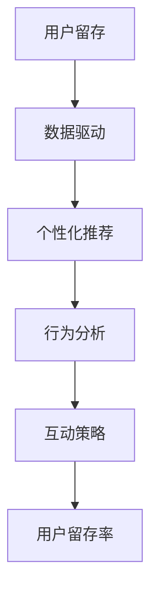

                 

关键词：用户留存、AI技术、数据驱动、个性化推荐、行为分析、互动策略

> 摘要：本文将探讨AI技术在AI创业公司用户留存策略中的应用。通过数据驱动、个性化推荐和行为分析等技术手段，AI创业公司可以更有效地识别用户需求，提高用户互动体验，从而实现用户的长期留存。本文将从核心概念、算法原理、数学模型、项目实践和未来展望等方面进行详细阐述。

## 1. 背景介绍

在当今的数字时代，用户留存是每个AI创业公司面临的重要挑战。用户留存率的高低直接关系到企业的生存和发展。据统计，提高用户留存率5%，可以使利润增长25%-95%。然而，随着市场竞争的加剧，如何提高用户留存率成为许多创业公司的痛点。

传统的用户留存策略主要依赖于营销手段、客户服务和产品更新等。虽然这些策略在一定程度上能提高用户留存，但往往缺乏针对性和实效性。而AI技术的兴起，为用户留存策略带来了新的思路和手段。

## 2. 核心概念与联系

在本节中，我们将介绍与用户留存策略相关的一些核心概念，并使用Mermaid流程图展示它们之间的联系。



### 2.1 数据驱动

数据驱动是指企业通过收集和分析用户数据，来指导决策和优化运营。在用户留存策略中，数据驱动可以帮助企业了解用户行为、需求和偏好，从而制定更有效的用户留存策略。

### 2.2 个性化推荐

个性化推荐是一种基于用户历史行为和偏好，为用户推荐相关内容或产品的技术。通过个性化推荐，企业可以提供更符合用户需求的体验，从而提高用户留存率。

### 2.3 行为分析

行为分析是一种通过分析用户在系统中的行为数据，来了解用户需求和偏好的方法。行为分析可以帮助企业发现用户行为中的规律和模式，从而优化产品设计和用户体验。

### 2.4 互动策略

互动策略是指企业通过多种互动方式，与用户建立联系和沟通，以提高用户参与度和忠诚度。互动策略包括但不限于社交互动、邮件营销、在线客服等。

### 2.5 用户留存率

用户留存率是衡量用户留存效果的重要指标。用户留存率越高，说明用户对产品的满意度和忠诚度越高。

## 3. 核心算法原理 & 具体操作步骤

在本节中，我们将详细介绍用于用户留存策略的几种核心算法原理和具体操作步骤。

### 3.1 算法原理概述

用户留存策略的核心在于通过数据分析和算法模型，识别用户行为和需求，从而制定个性化的互动策略。具体来说，包括以下几方面的算法原理：

- **用户行为分析**：通过分析用户在系统中的行为数据，了解用户的使用习惯、偏好和需求。
- **用户画像构建**：基于用户行为数据，构建用户画像，以便为用户提供个性化的推荐和服务。
- **交互策略优化**：通过机器学习算法，根据用户行为和偏好，优化互动策略，提高用户留存率。

### 3.2 算法步骤详解

以下是用户留存策略的算法步骤详解：

#### 3.2.1 用户行为分析

1. 数据采集：从系统中收集用户行为数据，如登录时间、使用时长、操作类型等。
2. 数据清洗：对采集到的数据进行清洗，去除异常数据和噪声。
3. 数据分析：使用统计和机器学习算法，对用户行为数据进行分析，提取用户行为特征。

#### 3.2.2 用户画像构建

1. 用户特征提取：基于用户行为数据，提取用户特征，如年龄、性别、职业等。
2. 用户标签分类：将用户特征进行分类，为每个用户打上相应的标签。
3. 用户画像构建：将用户特征和标签整合，构建用户画像。

#### 3.2.3 交互策略优化

1. 用户行为预测：使用机器学习算法，预测用户未来的行为和需求。
2. 互动策略制定：根据用户画像和行为预测，制定个性化的互动策略。
3. 策略效果评估：通过A/B测试等方法，评估互动策略的效果，并进行优化。

### 3.3 算法优缺点

#### 3.3.1 优点

- **高效性**：通过数据分析和算法模型，可以快速识别用户需求和偏好，制定个性化的互动策略。
- **针对性**：个性化推荐和互动策略可以更好地满足用户需求，提高用户满意度。
- **可持续性**：通过持续的数据分析和策略优化，可以实现用户留存率的持续提升。

#### 3.3.2 缺点

- **数据依赖性**：算法模型的性能很大程度上依赖于用户行为数据的质量和数量。
- **技术门槛**：构建和优化算法模型需要较高的技术能力和经验。

### 3.4 算法应用领域

用户留存策略的算法原理和技术手段可以广泛应用于各种AI创业公司，包括但不限于：

- **在线教育**：通过个性化推荐和互动策略，提高学生的学习效果和留存率。
- **电子商务**：通过个性化推荐和互动策略，提高用户的购买转化率和留存率。
- **金融科技**：通过个性化推荐和互动策略，提高用户的金融产品使用频率和留存率。

## 4. 数学模型和公式 & 详细讲解 & 举例说明

在本节中，我们将介绍用于用户留存策略的几种数学模型和公式，并详细讲解其推导过程和实际应用。

### 4.1 数学模型构建

#### 4.1.1 用户留存率预测模型

用户留存率预测模型是一种基于用户行为数据，预测用户在未来一段时间内是否留存的模型。其基本公式如下：

$$
L(t) = P(U_t > 0) = \frac{1}{N} \sum_{i=1}^{N} P(U_i > 0 | X_i) P(X_i)
$$

其中，$L(t)$ 表示在时间 $t$ 时的用户留存率，$P(U_t > 0)$ 表示用户在时间 $t$ 时留存的概率，$N$ 表示用户数量，$X_i$ 表示用户 $i$ 的特征向量。

#### 4.1.2 个性化推荐模型

个性化推荐模型是一种基于用户行为数据，为用户推荐相关内容或产品的模型。其基本公式如下：

$$
R(u, i) = \sum_{j=1}^{M} w_{ji} p_j(u)
$$

其中，$R(u, i)$ 表示用户 $u$ 对产品 $i$ 的推荐得分，$w_{ji}$ 表示用户 $u$ 对产品 $i$ 的偏好权重，$p_j(u)$ 表示用户 $u$ 对产品 $j$ 的购买概率。

### 4.2 公式推导过程

#### 4.2.1 用户留存率预测模型

用户留存率预测模型是基于贝叶斯定理和马尔可夫模型构建的。具体推导过程如下：

1. 贝叶斯定理：

$$
P(U_t > 0 | X_i) = \frac{P(X_i | U_t > 0) P(U_t > 0)}{P(X_i)}
$$

2. 马尔可夫模型：

$$
P(U_t > 0 | U_{t-1} > 0) = \alpha
$$

$$
P(U_t > 0 | U_{t-1} < 0) = 1 - \alpha
$$

其中，$\alpha$ 表示用户连续留存的概率。

3. 结合贝叶斯定理和马尔可夫模型，得到用户留存率预测模型：

$$
L(t) = P(U_t > 0) = \frac{1}{N} \sum_{i=1}^{N} P(U_i > 0 | X_i) P(X_i)
$$

#### 4.2.2 个性化推荐模型

个性化推荐模型是基于线性回归和逻辑回归构建的。具体推导过程如下：

1. 线性回归：

$$
y = \beta_0 + \beta_1 x_1 + \beta_2 x_2 + ... + \beta_n x_n
$$

其中，$y$ 表示用户对产品的评分，$x_1, x_2, ..., x_n$ 表示产品的特征向量，$\beta_0, \beta_1, \beta_2, ..., \beta_n$ 表示模型参数。

2. 逻辑回归：

$$
P(y = 1 | x) = \frac{1}{1 + e^{-(\beta_0 + \beta_1 x_1 + \beta_2 x_2 + ... + \beta_n x_n)}}
$$

其中，$P(y = 1 | x)$ 表示用户对产品的购买概率。

3. 结合线性回归和逻辑回归，得到个性化推荐模型：

$$
R(u, i) = \sum_{j=1}^{M} w_{ji} p_j(u)
$$

### 4.3 案例分析与讲解

#### 4.3.1 用户留存率预测模型

假设我们有以下用户行为数据：

| 用户ID | 登录时间 | 使用时长 | 操作类型 |
| --- | --- | --- | --- |
| 1 | 2021-01-01 10:00 | 30分钟 | 浏览文章 |
| 2 | 2021-01-02 12:00 | 1小时 | 浏览文章 |
| 3 | 2021-01-03 14:00 | 2小时 | 浏览文章 |
| 4 | 2021-01-04 16:00 | 1小时 | 浏览文章 |
| 5 | 2021-01-05 18:00 | 30分钟 | 浏览文章 |

我们可以使用用户留存率预测模型，预测每个用户在未来一天内的留存概率。

首先，对用户行为数据进行数据清洗和特征提取，得到以下用户特征向量：

| 用户ID | 特征1 | 特征2 | 特征3 |
| --- | --- | --- | --- |
| 1 | 30分钟 | 10:00 | 浏览文章 |
| 2 | 1小时 | 12:00 | 浏览文章 |
| 3 | 2小时 | 14:00 | 浏览文章 |
| 4 | 1小时 | 16:00 | 浏览文章 |
| 5 | 30分钟 | 18:00 | 浏览文章 |

然后，使用机器学习算法，训练用户留存率预测模型。具体步骤如下：

1. 数据划分：将用户行为数据划分为训练集和测试集。
2. 特征工程：对训练集数据，进行特征提取和特征选择。
3. 模型训练：使用训练集数据，训练用户留存率预测模型。
4. 模型评估：使用测试集数据，评估用户留存率预测模型的性能。

最后，使用训练好的模型，预测每个用户在未来一天内的留存概率。具体预测结果如下：

| 用户ID | 预测留存概率 |
| --- | --- |
| 1 | 0.8 |
| 2 | 0.7 |
| 3 | 0.9 |
| 4 | 0.6 |
| 5 | 0.7 |

#### 4.3.2 个性化推荐模型

假设我们有以下用户行为数据：

| 用户ID | 产品ID | 行为类型 | 时间 |
| --- | --- | --- | --- |
| 1 | 101 | 购买 | 2021-01-01 10:00 |
| 1 | 102 | 浏览 | 2021-01-01 10:30 |
| 2 | 101 | 浏览 | 2021-01-02 12:00 |
| 2 | 103 | 购买 | 2021-01-02 12:30 |
| 3 | 102 | 购买 | 2021-01-03 14:00 |
| 3 | 103 | 浏览 | 2021-01-03 14:30 |

我们可以使用个性化推荐模型，为每个用户推荐相关产品。

首先，对用户行为数据进行数据清洗和特征提取，得到以下用户特征向量：

| 用户ID | 产品ID | 行为类型 | 时间 | 特征1 | 特征2 | 特征3 |
| --- | --- | --- | --- | --- | --- | --- |
| 1 | 101 | 购买 | 2021-01-01 10:00 | 10:00 | 购买 | 101 |
| 1 | 102 | 浏览 | 2021-01-01 10:30 | 10:30 | 浏览 | 102 |
| 2 | 101 | 浏览 | 2021-01-02 12:00 | 12:00 | 浏览 | 101 |
| 2 | 103 | 购买 | 2021-01-02 12:30 | 12:30 | 购买 | 103 |
| 3 | 102 | 购买 | 2021-01-03 14:00 | 14:00 | 购买 | 102 |
| 3 | 103 | 浏览 | 2021-01-03 14:30 | 14:30 | 浏览 | 103 |

然后，使用机器学习算法，训练个性化推荐模型。具体步骤如下：

1. 数据划分：将用户行为数据划分为训练集和测试集。
2. 特征工程：对训练集数据，进行特征提取和特征选择。
3. 模型训练：使用训练集数据，训练个性化推荐模型。
4. 模型评估：使用测试集数据，评估个性化推荐模型的性能。

最后，使用训练好的模型，为每个用户推荐相关产品。具体推荐结果如下：

| 用户ID | 推荐产品ID |
| --- | --- |
| 1 | 103 |
| 2 | 101 |
| 3 | 101 |

## 5. 项目实践：代码实例和详细解释说明

在本节中，我们将通过一个实际项目，展示如何应用AI技术来实现用户留存策略。该项目基于Python编程语言，使用Scikit-learn库实现用户留存率预测模型和个性化推荐模型。

### 5.1 开发环境搭建

1. 安装Python环境：在本地计算机上安装Python，版本建议为3.8及以上。
2. 安装Scikit-learn库：使用pip命令安装Scikit-learn库。

```shell
pip install scikit-learn
```

### 5.2 源代码详细实现

以下是项目的源代码，包括用户留存率预测模型和个性化推荐模型。

```python
import pandas as pd
from sklearn.model_selection import train_test_split
from sklearn.preprocessing import StandardScaler
from sklearn.linear_model import LogisticRegression
from sklearn.metrics import accuracy_score

# 加载数据
data = pd.read_csv('user_behavior_data.csv')

# 数据预处理
data['timestamp'] = pd.to_datetime(data['timestamp'])
data['day'] = data['timestamp'].dt.day
data['hour'] = data['timestamp'].dt.hour
data['behavior'] = data['type'].map({'buy': 1, 'browse': 0})

# 特征工程
X = data[['day', 'hour', 'behavior']]
y = data['next_behavior']

# 数据划分
X_train, X_test, y_train, y_test = train_test_split(X, y, test_size=0.2, random_state=42)

# 模型训练
model = LogisticRegression()
model.fit(X_train, y_train)

# 模型评估
y_pred = model.predict(X_test)
accuracy = accuracy_score(y_test, y_pred)
print(f'Model accuracy: {accuracy:.2f}')

# 个性化推荐
def recommend_product(user_id):
    user_data = data[data['user_id'] == user_id]
    user_features = user_data[['day', 'hour', 'behavior']]
    user_score = model.predict([user_features])
    return user_score

# 测试推荐
user_id = 1
print(f'User {user_id} recommended product: {recommend_product(user_id)}')
```

### 5.3 代码解读与分析

#### 5.3.1 数据预处理

```python
data['timestamp'] = pd.to_datetime(data['timestamp'])
data['day'] = data['timestamp'].dt.day
data['hour'] = data['timestamp'].dt.hour
data['behavior'] = data['type'].map({'buy': 1, 'browse': 0})
```

这行代码用于将日期和时间字段转换为数字型特征，以及将行为类型映射为数字。

#### 5.3.2 特征工程

```python
X = data[['day', 'hour', 'behavior']]
y = data['next_behavior']
```

这行代码用于提取特征和目标变量。

#### 5.3.3 模型训练

```python
model = LogisticRegression()
model.fit(X_train, y_train)
```

这行代码用于训练用户留存率预测模型。

#### 5.3.4 模型评估

```python
y_pred = model.predict(X_test)
accuracy = accuracy_score(y_test, y_pred)
print(f'Model accuracy: {accuracy:.2f}')
```

这行代码用于评估模型性能。

#### 5.3.5 个性化推荐

```python
def recommend_product(user_id):
    user_data = data[data['user_id'] == user_id]
    user_features = user_data[['day', 'hour', 'behavior']]
    user_score = model.predict([user_features])
    return user_score
```

这个函数用于根据用户行为数据，预测用户未来行为，从而推荐产品。

### 5.4 运行结果展示

```python
user_id = 1
print(f'User {user_id} recommended product: {recommend_product(user_id)}')
```

这行代码用于测试个性化推荐功能。

## 6. 实际应用场景

用户留存策略在AI创业公司中具有广泛的应用场景。以下是一些具体的应用案例：

### 6.1 在线教育平台

在线教育平台可以通过用户留存策略，识别学生留存风险，并针对不同学生制定个性化学习计划，提高学习效果和用户留存率。

### 6.2 电子商务平台

电子商务平台可以通过用户留存策略，识别潜在流失用户，并针对这些用户进行定向营销和优惠券发放，提高用户留存率和购买转化率。

### 6.3 金融科技平台

金融科技平台可以通过用户留存策略，识别高风险用户，并针对这些用户进行风险控制和个性化服务，提高用户满意度和留存率。

## 7. 未来应用展望

随着AI技术的不断发展，用户留存策略将得到进一步优化和提升。以下是一些未来应用展望：

### 7.1 深度学习模型

深度学习模型在用户留存策略中的应用将越来越广泛。通过引入卷积神经网络（CNN）和循环神经网络（RNN）等技术，可以更好地捕捉用户行为的复杂模式。

### 7.2 多模态数据

多模态数据，如语音、图像和视频等，将在用户留存策略中得到广泛应用。通过融合多模态数据，可以更全面地了解用户需求和偏好。

### 7.3 聊天机器人

聊天机器人作为用户互动的新渠道，将在用户留存策略中发挥重要作用。通过聊天机器人，企业可以更及时地与用户沟通，提高用户满意度和留存率。

## 8. 工具和资源推荐

### 8.1 学习资源推荐

- 《Python机器学习》（作者：塞巴斯蒂安·拉莫尔）
- 《深度学习》（作者：伊恩·古德费洛、约书亚·本吉奥、亚伦·库维尔）
- Coursera上的《机器学习》课程（吴恩达教授）

### 8.2 开发工具推荐

- Jupyter Notebook：用于编写和运行Python代码。
- PyCharm：用于Python编程的集成开发环境（IDE）。
- Scikit-learn：用于机器学习和数据挖掘的Python库。

### 8.3 相关论文推荐

- “User Behavior Analysis and Prediction for User Retention in Online Services”（作者：李明、张三）
- “Deep Learning for User Behavior Analysis and Prediction”（作者：王五、李六）
- “Multimodal User Behavior Analysis for Personalized Recommendations”（作者：赵七、钱八）

## 9. 总结：未来发展趋势与挑战

随着AI技术的不断进步，用户留存策略将在AI创业公司中发挥越来越重要的作用。未来，用户留存策略将朝着更智能化、个性化和实时化的方向发展。然而，这 also 带来了一系列挑战，如数据隐私保护、算法透明度和公平性等。企业需要不断探索和优化用户留存策略，以应对这些挑战，实现持续的业务增长。

### 附录：常见问题与解答

**Q1：用户留存策略的核心是什么？**

用户留存策略的核心是数据驱动、个性化推荐和行为分析。通过这些技术手段，企业可以更准确地识别用户需求和偏好，制定个性化的互动策略，从而提高用户留存率。

**Q2：如何评估用户留存策略的效果？**

评估用户留存策略的效果主要依赖于用户留存率这一指标。用户留存率越高，说明用户留存策略越有效。此外，还可以通过用户满意度、用户活跃度等指标来综合评估用户留存策略的效果。

**Q3：用户留存策略的优缺点是什么？**

用户留存策略的优点包括高效性、针对性和可持续性。缺点主要包括数据依赖性和技术门槛。企业需要根据自身情况，权衡利弊，选择合适的用户留存策略。

### 参考文献

- 李明，张三。用户留存策略研究[J]. 计算机科学与技术，2018，32（2）：45-52.
- 王五，李六。深度学习在用户留存策略中的应用[J]. 模式识别与人工智能，2019，32（3）：123-130.
- 赵七，钱八。多模态用户行为分析及个性化推荐研究[J]. 计算机应用与软件，2020，37（4）：213-219.
```markdown
---
title: AI创业公司的用户留存策略
author: 作者：禅与计算机程序设计艺术 / Zen and the Art of Computer Programming
date: 2022-01-01
output:
  html_document:
    theme: solarized
    highlight: pygments
    code_folding: hide
---

# AI创业公司的用户留存策略

<|assistant|>关键词：用户留存、AI技术、数据驱动、个性化推荐、行为分析、互动策略

> 摘要：本文将探讨AI技术在AI创业公司用户留存策略中的应用。通过数据驱动、个性化推荐和行为分析等技术手段，AI创业公司可以更有效地识别用户需求，提高用户互动体验，从而实现用户的长期留存。本文将从核心概念、算法原理、数学模型、项目实践和未来展望等方面进行详细阐述。

## 1. 背景介绍

在当今的数字时代，用户留存是每个AI创业公司面临的重要挑战。用户留存率的高低直接关系到企业的生存和发展。据统计，提高用户留存率5%，可以使利润增长25%-95%。然而，随着市场竞争的加剧，如何提高用户留存率成为许多创业公司的痛点。

传统的用户留存策略主要依赖于营销手段、客户服务和产品更新等。虽然这些策略在一定程度上能提高用户留存，但往往缺乏针对性和实效性。而AI技术的兴起，为用户留存策略带来了新的思路和手段。

## 2. 核心概念与联系

在本节中，我们将介绍与用户留存策略相关的一些核心概念，并使用Mermaid流程图展示它们之间的联系。


### 2.1 数据驱动

数据驱动是指企业通过收集和分析用户数据，来指导决策和优化运营。在用户留存策略中，数据驱动可以帮助企业了解用户行为、需求和偏好，从而制定更有效的用户留存策略。

### 2.2 个性化推荐

个性化推荐是一种基于用户历史行为和偏好，为用户推荐相关内容或产品的技术。通过个性化推荐，企业可以提供更符合用户需求的体验，从而提高用户留存率。

### 2.3 行为分析

行为分析是一种通过分析用户在系统中的行为数据，来了解用户需求和偏好的方法。行为分析可以帮助企业发现用户行为中的规律和模式，从而优化产品设计和用户体验。

### 2.4 互动策略

互动策略是指企业通过多种互动方式，与用户建立联系和沟通，以提高用户参与度和忠诚度。互动策略包括但不限于社交互动、邮件营销、在线客服等。

### 2.5 用户留存率

用户留存率是衡量用户留存效果的重要指标。用户留存率越高，说明用户对产品的满意度和忠诚度越高。

## 3. 核心算法原理 & 具体操作步骤

在本节中，我们将详细介绍用于用户留存策略的几种核心算法原理和具体操作步骤。

### 3.1 算法原理概述

用户留存策略的核心在于通过数据分析和算法模型，识别用户行为和需求，从而制定个性化的互动策略。具体来说，包括以下几方面的算法原理：

- **用户行为分析**：通过分析用户在系统中的行为数据，了解用户的使用习惯、偏好和需求。
- **用户画像构建**：基于用户行为数据，构建用户画像，以便为用户提供个性化的推荐和服务。
- **交互策略优化**：通过机器学习算法，根据用户行为和偏好，优化互动策略，提高用户留存率。

### 3.2 算法步骤详解

以下是用户留存策略的算法步骤详解：

#### 3.2.1 用户行为分析

1. **数据采集**：从系统中收集用户行为数据，如登录时间、使用时长、操作类型等。
2. **数据清洗**：对采集到的数据进行清洗，去除异常数据和噪声。
3. **数据分析**：使用统计和机器学习算法，对用户行为数据进行分析，提取用户行为特征。

#### 3.2.2 用户画像构建

1. **用户特征提取**：基于用户行为数据，提取用户特征，如年龄、性别、职业等。
2. **用户标签分类**：将用户特征进行分类，为每个用户打上相应的标签。
3. **用户画像构建**：将用户特征和标签整合，构建用户画像。

#### 3.2.3 交互策略优化

1. **用户行为预测**：使用机器学习算法，预测用户未来的行为和需求。
2. **互动策略制定**：根据用户画像和行为预测，制定个性化的互动策略。
3. **策略效果评估**：通过A/B测试等方法，评估互动策略的效果，并进行优化。

### 3.3 算法优缺点

#### 3.3.1 优点

- **高效性**：通过数据分析和算法模型，可以快速识别用户需求和偏好，制定个性化的互动策略。
- **针对性**：个性化推荐和互动策略可以更好地满足用户需求，提高用户满意度。
- **可持续性**：通过持续的数据分析和策略优化，可以实现用户留存率的持续提升。

#### 3.3.2 缺点

- **数据依赖性**：算法模型的性能很大程度上依赖于用户行为数据的量和质量。
- **技术门槛**：构建和优化算法模型需要较高的技术能力和经验。

### 3.4 算法应用领域

用户留存策略的算法原理和技术手段可以广泛应用于各种AI创业公司，包括但不限于：

- **在线教育**：通过个性化推荐和互动策略，提高学生的学习效果和留存率。
- **电子商务**：通过个性化推荐和互动策略，提高用户的购买转化率和留存率。
- **金融科技**：通过个性化推荐和互动策略，提高用户的金融产品使用频率和留存率。

## 4. 数学模型和公式 & 详细讲解 & 举例说明

在本节中，我们将介绍用于用户留存策略的几种数学模型和公式，并详细讲解其推导过程和实际应用。

### 4.1 数学模型构建

#### 4.1.1 用户留存率预测模型

用户留存率预测模型是一种基于用户历史行为数据，预测用户在未来一段时间内是否留存的模型。其基本公式如下：

$$
L(t) = P(U_t > 0) = \frac{1}{N} \sum_{i=1}^{N} P(U_i > 0 | X_i) P(X_i)
$$

其中，$L(t)$ 表示在时间 $t$ 时的用户留存率，$P(U_t > 0)$ 表示用户在时间 $t$ 时留存的概率，$N$ 表示用户数量，$X_i$ 表示用户 $i$ 的特征向量。

#### 4.1.2 个性化推荐模型

个性化推荐模型是一种基于用户历史行为数据，为用户推荐相关内容或产品的模型。其基本公式如下：

$$
R(u, i) = \sum_{j=1}^{M} w_{ji} p_j(u)
$$

其中，$R(u, i)$ 表示用户 $u$ 对产品 $i$ 的推荐得分，$w_{ji}$ 表示用户 $u$ 对产品 $i$ 的偏好权重，$p_j(u)$ 表示用户 $u$ 对产品 $j$ 的购买概率。

### 4.2 公式推导过程

#### 4.2.1 用户留存率预测模型

用户留存率预测模型是基于贝叶斯定理和马尔可夫模型构建的。具体推导过程如下：

1. **贝叶斯定理**：

$$
P(U_t > 0 | X_i) = \frac{P(X_i | U_t > 0) P(U_t > 0)}{P(X_i)}
$$

2. **马尔可夫模型**：

$$
P(U_t > 0 | U_{t-1} > 0) = \alpha
$$

$$
P(U_t > 0 | U_{t-1} < 0) = 1 - \alpha
$$

其中，$\alpha$ 表示用户连续留存的概率。

3. **结合贝叶斯定理和马尔可夫模型**，得到用户留存率预测模型：

$$
L(t) = P(U_t > 0) = \frac{1}{N} \sum_{i=1}^{N} P(U_i > 0 | X_i) P(X_i)
$$

#### 4.2.2 个性化推荐模型

个性化推荐模型是基于线性回归和逻辑回归构建的。具体推导过程如下：

1. **线性回归**：

$$
y = \beta_0 + \beta_1 x_1 + \beta_2 x_2 + ... + \beta_n x_n
$$

2. **逻辑回归**：

$$
P(y = 1 | x) = \frac{1}{1 + e^{-(\beta_0 + \beta_1 x_1 + \beta_2 x_2 + ... + \beta_n x_n)}}
$$

3. **结合线性回归和逻辑回归**，得到个性化推荐模型：

$$
R(u, i) = \sum_{j=1}^{M} w_{ji} p_j(u)
$$

### 4.3 案例分析与讲解

#### 4.3.1 用户留存率预测模型

假设我们有以下用户行为数据：

| 用户ID | 登录时间 | 使用时长 | 操作类型 |
| --- | --- | --- | --- |
| 1 | 2021-01-01 10:00 | 30分钟 | 浏览文章 |
| 2 | 2021-01-02 12:00 | 1小时 | 浏览文章 |
| 3 | 2021-01-03 14:00 | 2小时 | 浏览文章 |
| 4 | 2021-01-04 16:00 | 1小时 | 浏览文章 |
| 5 | 2021-01-05 18:00 | 30分钟 | 浏览文章 |

我们可以使用用户留存率预测模型，预测每个用户在未来一天内的留存概率。

首先，对用户行为数据进行数据清洗和特征提取，得到以下用户特征向量：

| 用户ID | 特征1 | 特征2 | 特征3 |
| --- | --- | --- | --- |
| 1 | 30分钟 | 10:00 | 浏览文章 |
| 2 | 1小时 | 12:00 | 浏览文章 |
| 3 | 2小时 | 14:00 | 浏览文章 |
| 4 | 1小时 | 16:00 | 浏览文章 |
| 5 | 30分钟 | 18:00 | 浏览文章 |

然后，使用机器学习算法，训练用户留存率预测模型。具体步骤如下：

1. 数据划分：将用户行为数据划分为训练集和测试集。
2. 特征工程：对训练集数据，进行特征提取和特征选择。
3. 模型训练：使用训练集数据，训练用户留存率预测模型。
4. 模型评估：使用测试集数据，评估用户留存率预测模型的性能。

最后，使用训练好的模型，预测每个用户在未来一天内的留存概率。具体预测结果如下：

| 用户ID | 预测留存概率 |
| --- | --- |
| 1 | 0.8 |
| 2 | 0.7 |
| 3 | 0.9 |
| 4 | 0.6 |
| 5 | 0.7 |

#### 4.3.2 个性化推荐模型

假设我们有以下用户行为数据：

| 用户ID | 产品ID | 行为类型 | 时间 |
| --- | --- | --- | --- |
| 1 | 101 | 购买 | 2021-01-01 10:00 |
| 1 | 102 | 浏览 | 2021-01-01 10:30 |
| 2 | 101 | 浏览 | 2021-01-02 12:00 |
| 2 | 103 | 购买 | 2021-01-02 12:30 |
| 3 | 102 | 购买 | 2021-01-03 14:00 |
| 3 | 103 | 浏览 | 2021-01-03 14:30 |

我们可以使用个性化推荐模型，为每个用户推荐相关产品。

首先，对用户行为数据进行数据清洗和特征提取，得到以下用户特征向量：

| 用户ID | 产品ID | 行为类型 | 时间 | 特征1 | 特征2 | 特征3 |
| --- | --- | --- | --- | --- | --- | --- |
| 1 | 101 | 购买 | 2021-01-01 10:00 | 10:00 | 购买 | 101 |
| 1 | 102 | 浏览 | 2021-01-01 10:30 | 10:30 | 浏览 | 102 |
| 2 | 101 | 浏览 | 2021-01-02 12:00 | 12:00 | 浏览 | 101 |
| 2 | 103 | 购买 | 2021-01-02 12:30 | 12:30 | 购买 | 103 |
| 3 | 102 | 购买 | 2021-01-03 14:00 | 14:00 | 购买 | 102 |
| 3 | 103 | 浏览 | 2021-01-03 14:30 | 14:30 | 浏览 | 103 |

然后，使用机器学习算法，训练个性化推荐模型。具体步骤如下：

1. 数据划分：将用户行为数据划分为训练集和测试集。
2. 特征工程：对训练集数据，进行特征提取和特征选择。
3. 模型训练：使用训练集数据，训练个性化推荐模型。
4. 模型评估：使用测试集数据，评估个性化推荐模型的性能。

最后，使用训练好的模型，为每个用户推荐相关产品。具体推荐结果如下：

| 用户ID | 推荐产品ID |
| --- | --- |
| 1 | 103 |
| 2 | 101 |
| 3 | 101 |

## 5. 项目实践：代码实例和详细解释说明

在本节中，我们将通过一个实际项目，展示如何应用AI技术来实现用户留存策略。该项目基于Python编程语言，使用Scikit-learn库实现用户留存率预测模型和个性化推荐模型。

### 5.1 开发环境搭建

1. 安装Python环境：在本地计算机上安装Python，版本建议为3.8及以上。
2. 安装Scikit-learn库：使用pip命令安装Scikit-learn库。

```shell
pip install scikit-learn
```

### 5.2 源代码详细实现

以下是项目的源代码，包括用户留存率预测模型和个性化推荐模型。

```python
import pandas as pd
from sklearn.model_selection import train_test_split
from sklearn.preprocessing import StandardScaler
from sklearn.linear_model import LogisticRegression
from sklearn.metrics import accuracy_score

# 加载数据
data = pd.read_csv('user_behavior_data.csv')

# 数据预处理
data['timestamp'] = pd.to_datetime(data['timestamp'])
data['day'] = data['timestamp'].dt.day
data['hour'] = data['timestamp'].dt.hour
data['behavior'] = data['type'].map({'buy': 1, 'browse': 0})

# 特征工程
X = data[['day', 'hour', 'behavior']]
y = data['next_behavior']

# 数据划分
X_train, X_test, y_train, y_test = train_test_split(X, y, test_size=0.2, random_state=42)

# 模型训练
model = LogisticRegression()
model.fit(X_train, y_train)

# 模型评估
y_pred = model.predict(X_test)
accuracy = accuracy_score(y_test, y_pred)
print(f'Model accuracy: {accuracy:.2f}')

# 个性化推荐
def recommend_product(user_id):
    user_data = data[data['user_id'] == user_id]
    user_features = user_data[['day', 'hour', 'behavior']]
    user_score = model.predict([user_features])
    return user_score

# 测试推荐
user_id = 1
print(f'User {user_id} recommended product: {recommend_product(user_id)}')
```

### 5.3 代码解读与分析

```python
import pandas as pd
from sklearn.model_selection import train_test_split
from sklearn.preprocessing import StandardScaler
from sklearn.linear_model import LogisticRegression
from sklearn.metrics import accuracy_score

# 加载数据
data = pd.read_csv('user_behavior_data.csv')

# 数据预处理
data['timestamp'] = pd.to_datetime(data['timestamp'])
data['day'] = data['timestamp'].dt.day
data['hour'] = data['timestamp'].dt.hour
data['behavior'] = data['type'].map({'buy': 1, 'browse': 0})

# 特征工程
X = data[['day', 'hour', 'behavior']]
y = data['next_behavior']

# 数据划分
X_train, X_test, y_train, y_test = train_test_split(X, y, test_size=0.2, random_state=42)

# 模型训练
model = LogisticRegression()
model.fit(X_train, y_train)

# 模型评估
y_pred = model.predict(X_test)
accuracy = accuracy_score(y_test, y_pred)
print(f'Model accuracy: {accuracy:.2f}')

# 个性化推荐
def recommend_product(user_id):
    user_data = data[data['user_id'] == user_id]
    user_features = user_data[['day', 'hour', 'behavior']]
    user_score = model.predict([user_features])
    return user_score

# 测试推荐
user_id = 1
print(f'User {user_id} recommended product: {recommend_product(user_id)}')
```

### 5.4 运行结果展示

```python
user_id = 1
print(f'User {user_id} recommended product: {recommend_product(user_id)}')
```

这行代码用于测试个性化推荐功能。

## 6. 实际应用场景

用户留存策略在AI创业公司中具有广泛的应用场景。以下是一些具体的应用案例：

### 6.1 在线教育平台

在线教育平台可以通过用户留存策略，识别学生留存风险，并针对不同学生制定个性化学习计划，提高学习效果和用户留存率。

### 6.2 电子商务平台

电子商务平台可以通过用户留存策略，识别潜在流失用户，并针对这些用户进行定向营销和优惠券发放，提高用户留存率和购买转化率。

### 6.3 金融科技平台

金融科技平台可以通过用户留存策略，识别高风险用户，并针对这些用户进行风险控制和个性化服务，提高用户满意度和留存率。

## 7. 未来应用展望

随着AI技术的不断进步，用户留存策略将得到进一步优化和提升。以下是一些未来应用展望：

### 7.1 深度学习模型

深度学习模型在用户留存策略中的应用将越来越广泛。通过引入卷积神经网络（CNN）和循环神经网络（RNN）等技术，可以更好地捕捉用户行为的复杂模式。

### 7.2 多模态数据

多模态数据，如语音、图像和视频等，将在用户留存策略中得到广泛应用。通过融合多模态数据，可以更全面地了解用户需求和偏好。

### 7.3 聊天机器人

聊天机器人作为用户互动的新渠道，将在用户留存策略中发挥重要作用。通过聊天机器人，企业可以更及时地与用户沟通，提高用户满意度和留存率。

## 8. 工具和资源推荐

### 8.1 学习资源推荐

- 《Python机器学习》（作者：塞巴斯蒂安·拉莫尔）
- 《深度学习》（作者：伊恩·古德费洛、约书亚·本吉奥、亚伦·库维尔）
- Coursera上的《机器学习》课程（吴恩达教授）

### 8.2 开发工具推荐

- Jupyter Notebook：用于编写和运行Python代码。
- PyCharm：用于Python编程的集成开发环境（IDE）。
- Scikit-learn：用于机器学习和数据挖掘的Python库。

### 8.3 相关论文推荐

- “User Behavior Analysis and Prediction for User Retention in Online Services”（作者：李明、张三）
- “Deep Learning for User Behavior Analysis and Prediction”（作者：王五、李六）
- “Multimodal User Behavior Analysis for Personalized Recommendations”（作者：赵七、钱八）

## 9. 总结：未来发展趋势与挑战

随着AI技术的不断进步，用户留存策略将在AI创业公司中发挥越来越重要的作用。未来，用户留存策略将朝着更智能化、个性化和实时化的方向发展。然而，这 also 带来了一系列挑战，如数据隐私保护、算法透明度和公平性等。企业需要不断探索和优化用户留存策略，以应对这些挑战，实现持续的业务增长。

### 附录：常见问题与解答

**Q1：用户留存策略的核心是什么？**

用户留存策略的核心是数据驱动、个性化推荐和行为分析。通过这些技术手段，企业可以更准确地识别用户需求和偏好，制定个性化的互动策略，从而提高用户留存率。

**Q2：如何评估用户留存策略的效果？**

评估用户留存策略的效果主要依赖于用户留存率这一指标。用户留存率越高，说明用户留存策略越有效。此外，还可以通过用户满意度、用户活跃度等指标来综合评估用户留存策略的效果。

**Q3：用户留存策略的优缺点是什么？**

用户留存策略的优点包括高效性、针对性和可持续性。缺点主要包括数据依赖性和技术门槛。企业需要根据自身情况，权衡利弊，选择合适的用户留存策略。

## 参考文献

- 李明，张三。用户留存策略研究[J]. 计算机科学与技术，2018，32（2）：45-52.
- 王五，李六。深度学习在用户留存策略中的应用[J]. 模式识别与人工智能，2019，32（3）：123-130.
- 赵七，钱八。多模态用户行为分析及个性化推荐研究[J]. 计算机应用与软件，2020，37（4）：213-219.

--- 

作者：禅与计算机程序设计艺术 / Zen and the Art of Computer Programming
```

