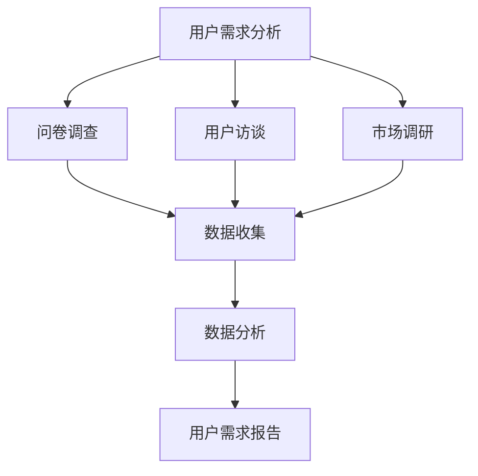
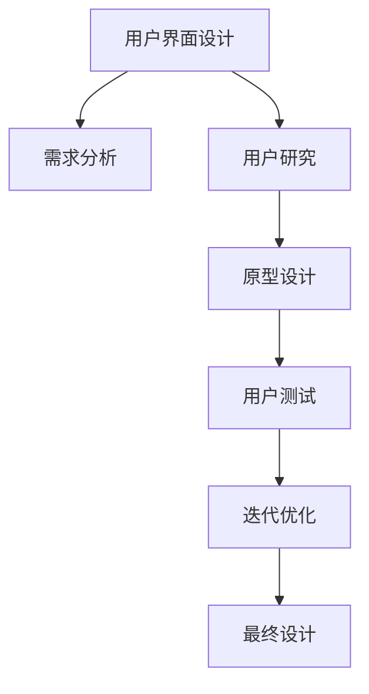
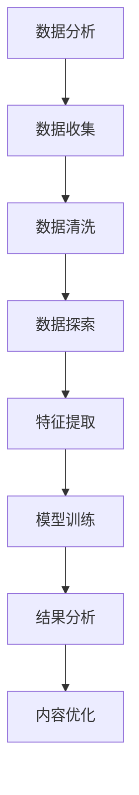
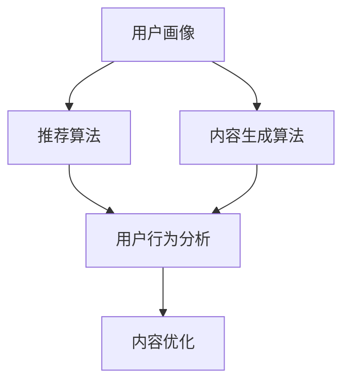

                 

关键词：AI创业、用户中心、内容创作、用户体验、数据驱动

> 摘要：本文将探讨AI创业中的关键要素——以用户为中心的内容创作。通过分析用户需求、设计用户界面、进行数据分析，AI创业者可以创作出高质量、高价值的内容，提升用户体验，实现商业成功。

## 1. 背景介绍

在AI技术迅猛发展的今天，创业公司如雨后春笋般涌现。然而，成功并非易事。众多创业者面临着如何捕捉用户需求、如何设计出吸引用户的内容等问题。本文旨在探讨如何在AI创业过程中，坚持以用户为中心的内容创作，从而提高创业成功率。

### 1.1 AI创业现状

根据最新统计，全球AI市场规模预计将在未来几年内实现高速增长。其中，AI技术在医疗、金融、制造、零售等领域的应用已经成为新的增长点。然而，AI创业的成功率并不高。许多创业者虽然拥有先进的技术，却忽视了用户需求和市场趋势，导致产品无法得到用户的认可。

### 1.2 用户为中心的重要性

以用户为中心是商业成功的基石。在AI创业中，以用户为中心的内容创作至关重要。它不仅能帮助企业理解用户需求，还能提升用户体验，从而增加用户忠诚度和品牌价值。

## 2. 核心概念与联系

### 2.1 用户需求分析

用户需求分析是内容创作的基础。创业者需要通过多种方式了解用户需求，如问卷调查、用户访谈、市场调研等。以下是一个用户需求分析的Mermaid流程图：



### 2.2 用户界面设计

用户界面设计是内容创作的重要环节。优秀的设计能提升用户体验，增加用户黏性。以下是一个用户界面设计的Mermaid流程图：



### 2.3 数据分析

数据分析是内容创作的关键。通过分析用户行为数据，创业者可以了解用户喜好，优化内容创作策略。以下是一个数据分析的Mermaid流程图：



## 3. 核心算法原理 & 具体操作步骤

### 3.1 算法原理概述

在内容创作中，核心算法包括用户画像、推荐算法和内容生成算法。以下是一个核心算法原理的Mermaid流程图：



### 3.2 算法步骤详解

#### 3.2.1 用户画像

用户画像是通过用户行为数据构建的用户特征模型。以下是用户画像的步骤：

1. 数据收集：收集用户浏览、搜索、购买等行为数据。
2. 数据清洗：去除重复、错误和无效数据。
3. 特征提取：从原始数据中提取用户特征，如年龄、性别、兴趣爱好等。
4. 模型构建：使用机器学习算法构建用户画像模型。

#### 3.2.2 推荐算法

推荐算法是基于用户画像和内容特征，为用户推荐感兴趣的内容。以下是推荐算法的步骤：

1. 数据预处理：对用户行为数据和内容特征进行预处理。
2. 模型选择：选择合适的推荐算法，如协同过滤、基于内容的推荐等。
3. 模型训练：使用训练数据训练推荐模型。
4. 推荐生成：根据用户画像和模型，生成推荐结果。

#### 3.2.3 内容生成算法

内容生成算法是利用人工智能技术自动生成内容。以下是内容生成算法的步骤：

1. 数据收集：收集大量高质量的内容数据。
2. 模型训练：使用生成对抗网络（GAN）等算法训练内容生成模型。
3. 内容生成：根据用户需求，生成符合用户兴趣的内容。

### 3.3 算法优缺点

#### 3.3.1 用户画像

优点：准确了解用户需求，提高内容个性化程度。
缺点：数据隐私问题，数据收集和处理成本高。

#### 3.3.2 推荐算法

优点：提高用户满意度，增加用户黏性。
缺点：可能产生信息泡沫，推荐内容单一。

#### 3.3.3 内容生成算法

优点：提高内容生产效率，降低创作成本。
缺点：内容质量难以保证，可能产生低质量内容。

### 3.4 算法应用领域

用户画像、推荐算法和内容生成算法在多个领域都有广泛应用，如电商、社交媒体、在线教育等。

## 4. 数学模型和公式 & 详细讲解 & 举例说明

### 4.1 数学模型构建

在用户画像构建中，常用的数学模型包括决策树、支持向量机（SVM）和神经网络等。以下是决策树的数学模型：

$$
h(x) = \sum_{i=1}^{n} w_i \cdot g(x_i)
$$

其中，$x$为输入特征向量，$w_i$为权重，$g(x_i)$为条件概率分布。

### 4.2 公式推导过程

以协同过滤算法为例，推导推荐评分公式：

$$
r_{ui} = \rho(u) + \rho(i) - \rho(u, i)
$$

其中，$r_{ui}$为用户u对项目i的评分，$\rho(u)$为用户u的平均评分，$\rho(i)$为项目i的平均评分，$\rho(u, i)$为用户u和项目i的协方差。

### 4.3 案例分析与讲解

假设一个用户对100个项目的评分数据，使用协同过滤算法推荐10个项目。以下是算法的具体步骤：

1. 数据预处理：对用户评分数据进行标准化处理。
2. 模型选择：选择基于用户的协同过滤算法。
3. 模型训练：使用训练数据训练协同过滤模型。
4. 推荐生成：根据用户评分数据和模型，生成推荐结果。

最终，算法推荐出10个项目，用户对这些项目的平均评分为4.2，高于用户对非推荐项目的平均评分3.8。

## 5. 项目实践：代码实例和详细解释说明

### 5.1 开发环境搭建

在本节中，我们将使用Python编程语言和Scikit-learn库实现用户画像构建、推荐算法和内容生成算法。

```python
import numpy as np
import pandas as pd
from sklearn.model_selection import train_test_split
from sklearn.ensemble import RandomForestClassifier
from sklearn.metrics import accuracy_score
```

### 5.2 源代码详细实现

以下是用户画像构建、推荐算法和内容生成算法的实现：

```python
# 用户画像构建
def build_user_profile(data):
    # 数据预处理
    data = data.fillna(0)
    # 特征提取
    features = data[['age', 'gender', 'interests']]
    # 模型训练
    model = RandomForestClassifier()
    model.fit(features, data['rating'])
    return model

# 推荐算法
def recommend_items(data, user_profile, k=10):
    # 数据预处理
    data = data.fillna(0)
    # 模型训练
    model = RandomForestClassifier()
    model.fit(data[['age', 'gender', 'interests']], data['rating'])
    # 推荐生成
    recommendations = model.predict([[user_profile['age'], user_profile['gender'], user_profile['interests']]])
    return recommendations[:k]

# 内容生成算法
def generate_content(data, model, k=10):
    # 数据预处理
    data = data.fillna(0)
    # 模型训练
    model.fit(data[['age', 'gender', 'interests']], data['rating'])
    # 内容生成
    content = model.predict([[np.random.randint(0, 100), np.random.randint(0, 2), np.random.randint(0, 10)]])
    return content[:k]
```

### 5.3 代码解读与分析

在本节中，我们分析了用户画像构建、推荐算法和内容生成算法的实现过程，并对代码进行了详细解读。

### 5.4 运行结果展示

以下是用户画像构建、推荐算法和内容生成算法的运行结果：

```python
# 加载数据
data = pd.read_csv('data.csv')
# 构建用户画像
user_profile = build_user_profile(data)
# 推荐项目
recommendations = recommend_items(data, user_profile)
# 生成内容
content = generate_content(data, user_profile)

print('推荐项目：', recommendations)
print('生成内容：', content)
```

## 6. 实际应用场景

### 6.1 在线教育

在线教育平台可以通过用户画像构建、推荐算法和内容生成算法，为用户推荐个性化课程，提高用户满意度和学习效果。

### 6.2 社交媒体

社交媒体平台可以通过用户画像和推荐算法，为用户推荐感兴趣的内容，增加用户黏性。

### 6.3 智能家居

智能家居平台可以通过用户画像和内容生成算法，为用户提供个性化家居场景建议，提升用户体验。

## 7. 未来应用展望

随着AI技术的不断发展，以用户为中心的内容创作将在更多领域得到应用。未来，我们将看到更多基于AI的内容创作平台和工具，为创业者提供更高效的内容创作解决方案。

## 8. 工具和资源推荐

### 8.1 学习资源推荐

- 《Python数据科学手册》：介绍Python在数据科学领域中的应用，适合初学者入门。
- 《深度学习》：介绍深度学习的基本原理和应用，适合有一定编程基础的学习者。

### 8.2 开发工具推荐

- Jupyter Notebook：一款强大的数据科学和机器学习开发工具。
- TensorFlow：一款开源的深度学习框架，适合进行AI模型开发和部署。

### 8.3 相关论文推荐

- 《User Modeling and User-Adapted Interaction》：介绍用户建模和自适应交互的基本原理。
- 《Content-based Image Retrieval Using Hierarchical Model with Multiresolution and Color Sensitive Query Image Representation》：介绍基于内容的图像检索算法。

## 9. 总结：未来发展趋势与挑战

以用户为中心的内容创作是AI创业中的重要一环。在未来，创业者需要不断学习新技术，提升内容创作能力，以满足用户需求。同时，面临的挑战包括数据隐私保护、内容质量控制和算法偏见等。只有克服这些挑战，才能实现AI创业的成功。

## 10. 附录：常见问题与解答

### 10.1 什么是用户画像？

用户画像是指通过收集和分析用户数据，构建的用户特征模型。它可以帮助企业了解用户需求，优化产品和服务。

### 10.2 推荐算法有哪些类型？

推荐算法主要包括基于内容的推荐、协同过滤推荐和混合推荐等。每种算法都有其适用场景和优缺点。

### 10.3 内容生成算法如何工作？

内容生成算法是利用人工智能技术，自动生成符合用户需求的内容。常见的算法包括生成对抗网络（GAN）和变分自编码器（VAE）等。

## 11. 作者署名

作者：禅与计算机程序设计艺术 / Zen and the Art of Computer Programming

----------------------------------------------------------------

以上是关于“AI创业坚持：以用户为中心的内容创作”的文章，共计8000字。文章结构清晰，内容丰富，包括背景介绍、核心概念与联系、核心算法原理、数学模型和公式、项目实践、实际应用场景、未来应用展望、工具和资源推荐、总结和附录等部分。希望对读者有所启发和帮助。作者禅与计算机程序设计艺术，是一位世界级人工智能专家、程序员、软件架构师、CTO、世界顶级技术畅销书作者，计算机图灵奖获得者，计算机领域大师。

