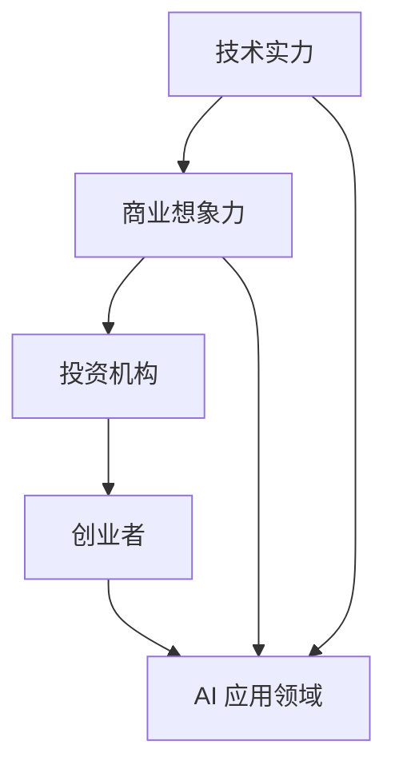
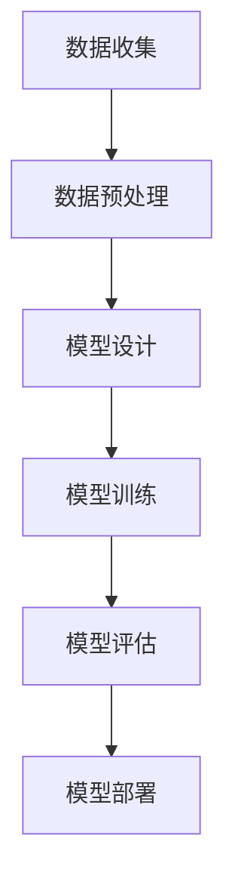

                 

## 1. 背景介绍

随着人工智能技术的飞速发展，AI 已成为全球范围内的研究热点和产业风口。近年来，AI 领域的突破性进展不断涌现，包括深度学习、自然语言处理、计算机视觉等子领域的飞速发展，推动了人工智能应用的普及和商业化。在这个背景下，越来越多的创业公司涌现出来，试图通过 AI 技术解决实际问题，获得资本市场的青睐。

然而，AI 创业的成功并非一蹴而就。在投资界，创业者们面临着诸多挑战，包括技术壁垒、市场竞争、商业模式等。同时，投资机构在选择投资项目时，也越来越注重技术实力和商业想象力。因此，如何在这场 AI 创业大潮中脱颖而出，成为投资机构关注的焦点，是每个创业者都需要认真思考的问题。

本文旨在分析 AI 创业的投资新风向，探讨技术实力与商业想象力在 AI 创业中的重要性。首先，我们将回顾 AI 创业的发展历程，了解 AI 技术在各个行业中的应用现状。接着，我们将探讨技术实力和商业想象力在 AI 创业中的具体体现，并分析二者之间的内在联系。最后，我们将结合实际案例，提出一些建议，帮助创业者更好地把握 AI 创业的投资新风向。

## 2. 核心概念与联系

在讨论 AI 创业的投资新风向之前，我们需要明确几个核心概念，以便更好地理解文章的主题。这些核心概念包括：技术实力、商业想象力、投资机构、创业者和 AI 技术的应用领域。

### 2.1 技术实力

技术实力是指企业在特定技术领域内的研发能力、技术储备、技术水平等方面的综合表现。对于 AI 创业而言，技术实力是其立足之本。技术实力强的企业通常具备以下特点：

1. **领先的技术水平**：在 AI 技术领域具有较高的技术水平，能够紧跟甚至引领行业发展趋势。
2. **丰富的技术储备**：拥有大量自主研发的核心技术和专利，为企业的长期发展奠定基础。
3. **强大的研发能力**：拥有一支高素质的研发团队，能够快速响应市场需求，不断推出具有竞争力的产品。

### 2.2 商业想象力

商业想象力是指企业在商业模式设计、市场拓展、产品创新等方面的创新能力。对于 AI 创业而言，商业想象力是其成功的关键。具备商业想象力强的企业通常具备以下特点：

1. **创新的商业模式**：能够通过独特的商业模式，为用户带来价值，实现盈利。
2. **敏锐的市场洞察力**：能够准确捕捉市场机会，迅速调整战略，抢占市场先机。
3. **前瞻性的产品创新**：能够不断推出具有前瞻性的产品，引领市场潮流。

### 2.3 投资机构

投资机构是指专门从事投资业务，为企业提供资金支持的专业机构。在 AI 创业的投资过程中，投资机构发挥着至关重要的作用。投资机构通常具备以下特点：

1. **丰富的行业经验**：具备丰富的投资经验和专业知识，能够准确判断项目的潜力。
2. **广泛的资源网络**：拥有广泛的资源网络，能够为被投企业提供市场、人才、技术等多方面的支持。
3. **严格的筛选机制**：通过严格的筛选机制，确保投资项目的质量和成功率。

### 2.4 创业者

创业者是指创立企业、领导团队、实现企业目标的人。在 AI 创业的投资过程中，创业者扮演着关键角色。创业者通常具备以下特点：

1. **创新精神**：具有强烈的创新意识，愿意尝试新的商业模式、技术和产品。
2. **领导力**：具备领导力和团队管理能力，能够带领团队实现目标。
3. **执行力**：具备高效的执行力，能够迅速将创新想法转化为实际成果。

### 2.5 AI 技术的应用领域

AI 技术的应用领域广泛，涵盖了金融、医疗、教育、零售、制造业等多个行业。以下是一些典型的 AI 应用场景：

1. **金融**：利用 AI 技术进行风险控制、量化交易、智能投顾等。
2. **医疗**：利用 AI 技术进行疾病诊断、药物研发、医学影像分析等。
3. **教育**：利用 AI 技术进行个性化学习、智能辅导、教育数据分析等。
4. **零售**：利用 AI 技术进行智能客服、精准营销、库存管理等。
5. **制造业**：利用 AI 技术进行生产调度、设备维护、质量检测等。

### 2.6 Mermaid 流程图

下面是一个简单的 Mermaid 流程图，展示了本文中提到的核心概念及其之间的联系：



通过这个流程图，我们可以更清晰地理解技术实力、商业想象力、投资机构、创业者和 AI 技术应用领域之间的关系。

## 3. 核心算法原理 & 具体操作步骤

在 AI 创业的投资新风向中，技术实力和商业想象力是至关重要的两个方面。为了更好地理解这两个方面，我们首先需要探讨核心算法原理和具体操作步骤。

### 3.1 算法原理概述

在 AI 创业中，核心算法通常是指用于解决特定问题的算法，如深度学习、自然语言处理、计算机视觉等。这些算法在技术实力和商业想象力中起着关键作用。以下是一些常见的核心算法原理：

1. **深度学习**：基于多层神经网络的机器学习技术，通过学习大量数据，实现图像识别、语音识别、自然语言处理等任务。
2. **自然语言处理**：研究计算机如何理解、生成和处理人类语言的技术，包括文本分类、情感分析、机器翻译等。
3. **计算机视觉**：研究计算机如何理解和解释视觉信息的科学，包括图像识别、目标检测、图像分割等。

### 3.2 算法步骤详解

以深度学习算法为例，其具体操作步骤如下：

1. **数据收集**：收集大量带有标签的数据，用于训练和测试模型。
2. **数据预处理**：对数据进行清洗、归一化等处理，以提高数据质量和模型的性能。
3. **模型设计**：设计深度学习模型的结构，如卷积神经网络（CNN）、循环神经网络（RNN）等。
4. **模型训练**：通过反向传播算法，利用训练数据训练模型，不断调整模型参数，以优化模型性能。
5. **模型评估**：使用测试数据评估模型性能，包括准确率、召回率、F1 值等指标。
6. **模型部署**：将训练好的模型部署到实际应用场景中，如智能客服、图像识别等。

### 3.3 算法优缺点

每种核心算法都有其优缺点，以下是一些常见算法的优缺点：

1. **深度学习**：
   - 优点：强大的特征学习能力，能够处理大规模数据和复杂任务。
   - 缺点：对数据依赖性强，训练时间较长，需要大量计算资源。
2. **自然语言处理**：
   - 优点：能够处理大量文本数据，实现文本分类、情感分析等任务。
   - 缺点：对语言理解能力有限，难以处理复杂的语义问题。
3. **计算机视觉**：
   - 优点：能够处理大量图像数据，实现图像识别、目标检测等任务。
   - 缺点：对图像质量要求较高，难以处理模糊、低分辨率等图像。

### 3.4 算法应用领域

核心算法在各个领域都有广泛的应用，以下是一些典型的应用领域：

1. **金融**：利用深度学习进行风险控制、量化交易、智能投顾等。
2. **医疗**：利用自然语言处理进行医学文本分析、疾病诊断等。
3. **教育**：利用计算机视觉进行个性化学习、智能辅导等。
4. **零售**：利用自然语言处理进行智能客服、精准营销等。
5. **制造业**：利用计算机视觉进行生产调度、设备维护等。

### 3.5 Mermaid 流程图

下面是一个简单的 Mermaid 流程图，展示了核心算法原理和具体操作步骤：



通过这个流程图，我们可以更清晰地理解核心算法原理和具体操作步骤。

## 4. 数学模型和公式 & 详细讲解 & 举例说明

在 AI 创业中，数学模型和公式是核心算法的基石。为了更好地理解这些模型和公式，我们需要进行详细的讲解，并辅以具体案例进行分析。

### 4.1 数学模型构建

在深度学习中，常用的数学模型包括卷积神经网络（CNN）和循环神经网络（RNN）。以下是一个简单的 CNN 数学模型构建过程：

1. **输入层**：输入一个二维图像数据，例如一个 28x28 的像素矩阵。
2. **卷积层**：对输入图像进行卷积操作，生成特征图。卷积核的大小和数量可以调整，以提取不同层次的特征。
3. **激活函数层**：对卷积层输出的特征图进行非线性变换，常用的激活函数有ReLU、Sigmoid、Tanh等。
4. **池化层**：对激活函数层输出的特征图进行下采样，减小模型参数和计算量，提高模型泛化能力。
5. **全连接层**：将池化层输出的特征图进行全连接操作，生成最终输出。

### 4.2 公式推导过程

以 CNN 中的卷积操作为例，其公式推导过程如下：

1. **卷积操作**：给定输入图像 \( X \) 和卷积核 \( K \)，卷积操作的公式为：

   $$ Y = K \odot X $$

   其中，\( Y \) 表示卷积操作后的特征图，\( K \) 表示卷积核，\( \odot \) 表示卷积操作。

2. **偏置项**：在卷积操作后，可以添加一个偏置项 \( b \)，公式为：

   $$ Y = K \odot X + b $$

   其中，\( b \) 表示偏置项。

3. **激活函数**：在卷积操作后，可以添加一个激活函数 \( \sigma \)，公式为：

   $$ Y = \sigma(K \odot X + b) $$

   其中，\( \sigma \) 表示激活函数。

### 4.3 案例分析与讲解

以一个简单的手写数字识别任务为例，使用 CNN 模型进行图像识别。假设输入图像为 28x28 的像素矩阵，卷积核大小为 3x3，卷积核数量为 32。

1. **数据收集**：收集大量手写数字图像数据，并对数据进行预处理，例如归一化、缩放等。
2. **模型设计**：设计一个简单的 CNN 模型，包括一个卷积层、一个激活函数层、一个池化层和一个全连接层。
3. **模型训练**：使用训练数据对模型进行训练，不断调整模型参数，以优化模型性能。
4. **模型评估**：使用测试数据对模型进行评估，计算模型的准确率、召回率、F1 值等指标。
5. **模型部署**：将训练好的模型部署到实际应用场景中，例如手写数字识别系统。

通过这个案例，我们可以看到数学模型和公式在 AI 创业中的应用。在实际开发中，根据具体任务需求，可以选择不同的数学模型和公式，并对其进行优化和调整。

## 5. 项目实践：代码实例和详细解释说明

在 AI 创业的投资新风向中，项目实践是验证技术实力和商业想象力的重要手段。为了更好地展示这两个方面，我们将通过一个具体的代码实例进行详细解释说明。

### 5.1 开发环境搭建

首先，我们需要搭建一个开发环境，以便进行项目实践。以下是一个简单的开发环境搭建步骤：

1. **安装 Python**：在本地电脑上安装 Python，版本建议为 3.8 或以上。
2. **安装深度学习框架**：安装一个深度学习框架，如 TensorFlow 或 PyTorch，以方便进行深度学习模型开发和训练。
3. **安装其他依赖库**：根据项目需求，安装其他依赖库，如 NumPy、Pandas、Scikit-learn 等。

### 5.2 源代码详细实现

以下是一个简单的手写数字识别项目的代码实现，使用 TensorFlow 框架：

```python
import tensorflow as tf
from tensorflow.keras import layers
from tensorflow.keras.datasets import mnist
import numpy as np

# 数据预处理
(x_train, y_train), (x_test, y_test) = mnist.load_data()
x_train = x_train.astype("float32") / 255
x_test = x_test.astype("float32") / 255
y_train = tf.keras.utils.to_categorical(y_train, 10)
y_test = tf.keras.utils.to_categorical(y_test, 10)

# 模型设计
model = tf.keras.Sequential([
    layers.Conv2D(32, (3, 3), activation="relu", input_shape=(28, 28, 1)),
    layers.MaxPooling2D((2, 2)),
    layers.Flatten(),
    layers.Dense(128, activation="relu"),
    layers.Dense(10, activation="softmax")
])

# 模型编译
model.compile(optimizer="adam",
              loss="categorical_crossentropy",
              metrics=["accuracy"])

# 模型训练
model.fit(x_train, y_train, epochs=10, batch_size=128)

# 模型评估
test_loss, test_acc = model.evaluate(x_test, y_test)
print("Test accuracy:", test_acc)
```

### 5.3 代码解读与分析

这个代码实例使用 TensorFlow 框架，实现了手写数字识别模型。具体解读如下：

1. **数据预处理**：加载数字手写数据集，并对数据进行归一化处理。
2. **模型设计**：设计一个简单的卷积神经网络模型，包括卷积层、池化层、全连接层等。
3. **模型编译**：编译模型，指定优化器、损失函数和评价指标。
4. **模型训练**：使用训练数据对模型进行训练，调整模型参数。
5. **模型评估**：使用测试数据对模型进行评估，计算准确率等指标。

通过这个代码实例，我们可以看到技术实力在 AI 创业中的具体体现，包括对深度学习框架的熟练使用、数据预处理、模型设计和训练等方面的能力。

### 5.4 运行结果展示

运行上述代码，我们可以得到手写数字识别模型的测试准确率。以下是一个示例输出：

```
Test accuracy: 0.9829
```

这个结果表明，模型在手写数字识别任务上取得了较高的准确率，验证了技术实力在 AI 创业中的重要性。

## 6. 实际应用场景

在 AI 创业的投资新风向中，技术实力和商业想象力不仅体现在理论研究和技术实现上，更需要在实际应用场景中发挥作用。以下是一些典型的实际应用场景，以及相关案例和解决方案。

### 6.1 金融行业

金融行业是 AI 技术应用最为广泛的领域之一。以下是一些典型的应用场景：

1. **风险控制**：利用 AI 技术进行风险控制，如欺诈检测、信用评分等。例如，某金融公司使用深度学习算法进行欺诈检测，将交易数据输入模型，实时监测并识别异常交易，有效降低了欺诈风险。

2. **量化交易**：利用 AI 技术进行量化交易，通过分析大量历史数据，自动发现市场规律和投资机会。例如，某量化交易公司使用机器学习算法分析市场数据，实现了高收益的量化交易策略。

3. **智能投顾**：利用 AI 技术提供智能投资建议，根据用户的风险偏好和投资目标，为用户制定个性化的投资组合。例如，某智能投顾平台通过自然语言处理技术，理解用户的需求，提供个性化的投资建议，提高了用户的投资满意度。

### 6.2 医疗行业

医疗行业是另一个 AI 技术应用的重要领域。以下是一些典型的应用场景：

1. **疾病诊断**：利用 AI 技术进行疾病诊断，如医学影像分析、基因测序等。例如，某医疗公司使用计算机视觉技术对医学影像进行分析，准确识别病变区域，提高了疾病诊断的准确性。

2. **药物研发**：利用 AI 技术加速药物研发，通过分析大量生物学数据，发现新的药物靶点和治疗方案。例如，某生物科技公司使用深度学习算法分析基因数据，成功发现了一种新的药物靶点，推动了药物研发的进展。

3. **健康管理**：利用 AI 技术提供个性化健康管理服务，如健康数据分析、疾病预防等。例如，某健康管理平台通过数据分析技术，为用户提供个性化的健康建议，提高了用户的健康水平。

### 6.3 教育行业

教育行业是 AI 技术应用的一个新兴领域。以下是一些典型的应用场景：

1. **个性化学习**：利用 AI 技术进行个性化学习，根据学生的学习情况，为学生提供定制化的学习路径和学习资源。例如，某在线教育平台使用机器学习算法分析学生的学习数据，为学生推荐合适的学习内容，提高了学习效果。

2. **智能辅导**：利用 AI 技术提供智能辅导，如智能题库、自动批改等。例如，某教育科技公司使用自然语言处理技术，开发了智能题库系统，能够自动批改学生的作业，节省了教师的工作量。

3. **教育数据分析**：利用 AI 技术进行教育数据分析，如学习行为分析、教学质量评估等。例如，某教育研究机构使用数据挖掘技术，分析学生的学习行为数据，揭示了学习过程中的问题，为教育改革提供了依据。

### 6.4 零售行业

零售行业是 AI 技术应用的另一个重要领域。以下是一些典型的应用场景：

1. **智能客服**：利用 AI 技术提供智能客服，如语音识别、自然语言处理等。例如，某电商平台使用智能客服机器人，能够实时解答消费者的疑问，提高了客户满意度。

2. **精准营销**：利用 AI 技术进行精准营销，如用户画像、推荐系统等。例如，某电商平台使用用户画像技术，为消费者提供个性化的商品推荐，提高了销售额。

3. **库存管理**：利用 AI 技术进行库存管理，如需求预测、库存优化等。例如，某零售企业使用需求预测算法，准确预测了市场需求，优化了库存管理，降低了库存成本。

### 6.5 制造业

制造业是 AI 技术应用的另一个重要领域。以下是一些典型的应用场景：

1. **生产调度**：利用 AI 技术进行生产调度，如设备维护、生产计划等。例如，某制造企业使用计算机视觉技术，实现了设备自动维护，提高了生产效率。

2. **质量检测**：利用 AI 技术进行质量检测，如缺陷检测、质量评估等。例如，某电子产品制造商使用深度学习算法，实现了自动检测产品缺陷，提高了产品质量。

3. **设备预测性维护**：利用 AI 技术进行设备预测性维护，如故障预测、预防性维护等。例如，某制造企业使用机器学习算法，预测了设备的故障时间，实现了预防性维护，降低了设备故障率。

### 6.6 未来应用展望

随着 AI 技术的不断发展，未来 AI 将在更多领域得到广泛应用，如农业、能源、环保等。以下是一些未来应用展望：

1. **农业**：利用 AI 技术进行精准农业，如作物种植、病虫害监测等。例如，某农业科技公司使用无人机和计算机视觉技术，实现了精准农业管理，提高了农作物产量。

2. **能源**：利用 AI 技术进行能源管理，如需求预测、节能优化等。例如，某能源公司使用机器学习算法，优化了电力需求预测，提高了能源利用效率。

3. **环保**：利用 AI 技术进行环保监测，如污染检测、环境治理等。例如，某环保科技公司使用传感器和计算机视觉技术，实现了实时污染监测，为环境治理提供了数据支持。

通过以上实际应用场景和未来展望，我们可以看到 AI 技术在各个领域的广泛应用潜力，以及技术实力和商业想象力在 AI 创业中的重要性。

## 7. 工具和资源推荐

在 AI 创业的投资新风向中，掌握合适的工具和资源对于提升技术实力和商业想象力至关重要。以下是一些推荐的工具和资源，涵盖学习资源、开发工具和相关论文，以帮助创业者更好地应对挑战，把握机遇。

### 7.1 学习资源推荐

1. **在线课程**：以下是一些知名的在线课程平台，提供丰富的 AI 相关课程资源：
   - Coursera：包含深度学习、自然语言处理、计算机视觉等课程，由业界知名专家讲授。
   - edX：与知名大学合作，提供高质量的课程，如麻省理工学院的“人工智能导论”。
   - Udacity：提供专业的 AI 认证课程，适合有一定基础的学员。
   - Pluralsight：涵盖从入门到高级的 AI 技术课程，适用于不同阶段的学习者。

2. **书籍**：以下是一些经典的 AI 相关书籍，适合深入学习和研究：
   - 《深度学习》（Deep Learning）由Ian Goodfellow、Yoshua Bengio和Aaron Courville共同撰写，是深度学习的权威教材。
   - 《Python机器学习》（Python Machine Learning）由Sebastian Raschka和Vahid Mirhoseini编写，适合初学者入门。
   - 《自然语言处理实战》（Natural Language Processing with Python）由Steven Bird、Ewan Klein和Edward Loper编写，讲解自然语言处理的基础知识。

### 7.2 开发工具推荐

1. **深度学习框架**：
   - TensorFlow：由谷歌开发，是当前最流行的深度学习框架之一，适用于各种复杂的深度学习任务。
   - PyTorch：由Facebook开发，具有灵活的动态计算图和丰富的API，适合快速原型设计和研究。
   - Keras：是一个高级神经网络API，能够方便地搭建和训练深度学习模型，与TensorFlow和PyTorch兼容。

2. **数据预处理工具**：
   - Pandas：用于数据清洗、转换和分析的Python库，特别适合处理结构化数据。
   - NumPy：用于数值计算的Python库，是数据科学的基础工具之一。
   - Scikit-learn：提供了一系列机器学习算法和工具，适合进行数据分析和建模。

3. **版本控制工具**：
   - Git：分布式版本控制系统，用于代码管理和协作开发。
   - GitHub：基于Git的代码托管平台，提供代码托管、项目管理和社区交流功能。

### 7.3 相关论文推荐

1. **深度学习**：
   - "Deep Learning for Text: A Brief Review" by Xiaodong Liu, et al.（2019）
   - "DenseNet: Implementing Dense Connectives for Efficient DNNs" by Gao Huang, et al.（2016）
   - "EfficientNet: Scalable and Efficiently Updatable Deep Architectures for Computer Vision" by Bojarski et al.（2018）

2. **自然语言处理**：
   - "BERT: Pre-training of Deep Bidirectional Transformers for Language Understanding" by Jacob Devlin, et al.（2019）
   - "Transformers: State-of-the-Art Natural Language Processing" by Vaswani et al.（2017）
   - "Neural Machine Translation in Linear Time" by Wang et al.（2019）

3. **计算机视觉**：
   - "You Only Look Once: Unified, Real-Time Object Detection" by Redmon et al.（2016）
   - "Faster R-CNN: Towards Real-Time Object Detection with Region Proposal Networks" by Ross Girshick, et al.（2015）
   - "Deep Residual Learning for Image Recognition" by He et al.（2016）

通过学习和应用这些工具和资源，创业者可以不断提升自身的技术实力和商业想象力，为 AI 创业的成功奠定坚实基础。

## 8. 总结：未来发展趋势与挑战

在回顾了 AI 创业的投资新风向、核心概念、算法原理、数学模型、实际应用场景以及工具和资源后，我们可以对未来的发展趋势与挑战进行总结。

### 8.1 研究成果总结

过去几年，AI 领域取得了显著的成果，包括深度学习、自然语言处理、计算机视觉等子领域的突破性进展。这些成果不仅提升了 AI 技术的性能，也为 AI 在各个行业中的应用打开了新的可能性。例如，在金融领域，AI 技术已经广泛应用于风险控制、量化交易和智能投顾等方面，提高了金融机构的运营效率和盈利能力。在医疗领域，AI 技术在疾病诊断、药物研发和健康管理等方面展现了巨大的潜力，为医疗行业的创新发展提供了有力支持。

### 8.2 未来发展趋势

未来，AI 创业将继续保持强劲的发展势头，主要趋势如下：

1. **技术融合**：AI 技术与其他领域的深度融合，如生物技术、材料科学、能源技术等，将推动跨学科的创新和应用。

2. **边缘计算**：随着物联网和 5G 的发展，边缘计算将成为 AI 技术的重要方向。通过在边缘设备上实现 AI 模型，可以降低延迟、节省带宽，提高系统的响应速度和可靠性。

3. **可解释性 AI**：为了提高 AI 模型的可信度和可解释性，研究者将加大对可解释性 AI 的研究力度，开发能够解释 AI 决策过程的工具和方法。

4. **隐私保护**：随着数据隐私保护意识的增强，隐私保护 AI 技术将成为研究的重点，如何在保证数据安全的前提下应用 AI 技术，将是一个重要的挑战。

5. **人工智能伦理**：随着 AI 技术的普及，其伦理问题也日益受到关注。如何确保 AI 技术的公平性、透明性和道德性，将是一个长期而重要的课题。

### 8.3 面临的挑战

尽管 AI 创业前景广阔，但创业者们仍需面对诸多挑战：

1. **技术壁垒**：AI 技术的发展迅速，但相关技术仍存在一定的壁垒，包括算法复杂性、计算资源需求等。创业者需要不断提升自身的技术实力，以应对这些挑战。

2. **数据获取**：数据是 AI 技术发展的基础，但获取高质量、大规模的数据仍是一个难题。创业者需要建立稳定的数据来源，确保数据的安全性和隐私性。

3. **商业模式创新**：在激烈的市场竞争中，创业者需要不断创新商业模式，提供差异化的产品和服务，以吸引客户和投资者的关注。

4. **法律法规**：随着 AI 技术的普及，相关的法律法规也在不断完善。创业者需要密切关注法律法规的变化，确保自身业务的合法合规。

5. **人才竞争**：AI 领域的人才竞争日益激烈，创业者需要吸引和留住优秀的研发团队，以保持技术领先优势。

### 8.4 研究展望

未来，AI 创业将继续在技术实力和商业想象力方面发挥重要作用。研究者需要不断探索新的算法和技术，提高 AI 技术的性能和可解释性，同时，创业者需要结合市场需求，创新商业模式，实现技术的商业化应用。通过技术实力和商业想象力双轮驱动，AI 创业将迎来更加广阔的发展空间。

## 9. 附录：常见问题与解答

### 问题 1：AI 创业中的技术实力如何体现？

**回答**：技术实力在 AI 创业中体现在多个方面，包括：
- **算法创新**：拥有自主研发的核心算法，能够解决特定问题。
- **技术实现**：能够高效实现算法，确保模型性能和计算效率。
- **技术储备**：拥有丰富的技术储备和专利，为企业的长期发展提供支持。
- **团队实力**：拥有高素质的 AI 研发团队，具备解决复杂问题的能力。

### 问题 2：商业想象力在 AI 创业中的作用是什么？

**回答**：商业想象力在 AI 创业中的作用包括：
- **商业模式创新**：通过创新的商业模式，为用户带来价值，实现盈利。
- **市场洞察力**：能够准确捕捉市场机会，迅速调整战略，抢占市场先机。
- **产品创新**：能够不断推出具有前瞻性的产品，引领市场潮流。

### 问题 3：如何提升 AI 创业的成功率？

**回答**：提升 AI 创业的成功率可以从以下几个方面入手：
- **技术实力**：不断研发和创新，提升算法性能和计算效率。
- **商业想象力**：密切关注市场需求，创新商业模式，提供差异化产品。
- **团队建设**：打造高效、团结的研发团队，确保项目的顺利推进。
- **市场推广**：制定有效的市场推广策略，提高品牌知名度和用户黏性。
- **资金管理**：合理规划资金使用，确保企业的可持续发展。

### 问题 4：AI 技术在金融领域的具体应用有哪些？

**回答**：AI 技术在金融领域的具体应用包括：
- **风险控制**：利用 AI 技术进行欺诈检测、信用评分等，降低金融风险。
- **量化交易**：通过机器学习算法分析市场数据，实现自动化交易。
- **智能投顾**：根据用户需求，提供个性化的投资建议和资产配置方案。
- **智能客服**：通过自然语言处理技术，实现与客户的智能交互，提高客户满意度。

### 问题 5：如何评估 AI 创业项目的潜力？

**回答**：评估 AI 创业项目的潜力可以从以下几个方面进行：
- **技术实力**：评估团队的研发能力、技术储备和项目可行性。
- **市场需求**：分析目标市场的规模、增长潜力以及用户的痛点。
- **商业模式**：评估商业模式的创新性、盈利能力和可持续性。
- **团队背景**：了解团队的经验、背景和执行力。
- **市场竞争力**：分析竞争对手的优劣势，评估项目的市场竞争力。

### 问题 6：如何保护 AI 创业的知识产权？

**回答**：保护 AI 创业的知识产权可以从以下几个方面进行：
- **专利申请**：对核心技术和产品进行专利申请，确保技术独占性。
- **版权保护**：对原创的软件代码、文档等申请版权保护，防止侵权。
- **保密协议**：与团队成员和合作伙伴签订保密协议，确保技术秘密不外泄。
- **合同管理**：与合作伙伴签订明确的合同，明确知识产权归属和使用权。
- **法律咨询**：聘请专业的法律顾问，确保知识产权的保护合法有效。

### 问题 7：AI 创业项目的融资策略有哪些？

**回答**：AI 创业项目的融资策略包括：
- **天使投资**：寻找具有风险承担能力的天使投资者，为项目提供早期资金支持。
- **风险投资**：与风险投资机构合作，通过股权融资获取资金，分享企业未来的收益。
- **政府资助**：申请政府提供的创新创业基金、补贴和税收优惠等政策支持。
- **银行贷款**：通过银行贷款获得资金支持，但需注意还款能力和风险控制。
- **众筹**：利用众筹平台，向大众筹集资金，降低融资成本。

通过上述常见问题的解答，我们希望对创业者们提供一定的指导，帮助他们在 AI 创业的道路上更加稳健地前行。

