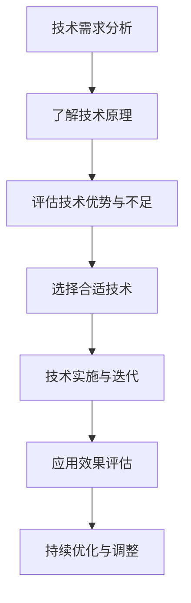
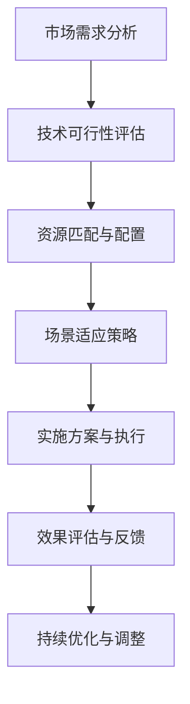

                 

关键词：人工智能，创业挑战，技术，应用，场景平衡，创新

摘要：本文将深入探讨人工智能创业面临的挑战，包括技术的选择与应用、场景的适应与平衡，旨在为创业者提供一份实用的指南。文章首先介绍了人工智能的发展背景，然后分析了创业者在选择技术、应用场景以及实现技术与应用平衡时所需考虑的关键因素。通过案例分析，本文揭示了成功创业者在应对挑战时的策略，并给出了未来发展趋势与挑战的预测。

## 1. 背景介绍

人工智能（AI）作为计算机科学的一个重要分支，近年来取得了飞速发展。从最初的符号主义到连接主义，再到如今的深度学习，人工智能技术不断突破，已经在图像识别、自然语言处理、自动驾驶等领域取得了显著成果。随着大数据、云计算、物联网等技术的融合，人工智能的应用场景日益广泛，成为推动产业变革的重要力量。

在这样的大背景下，越来越多的创业者投身于人工智能领域，希望通过创新的技术和应用，开拓新的市场。然而，人工智能创业并非易事，创业者需要面对诸多挑战。首先，技术的选择与应用是关键。不同的技术适用于不同的场景，如何在众多技术中找到合适的解决方案，成为创业者首要解决的问题。其次，场景的适应与平衡也是一大挑战。创业者在选择应用场景时，既要考虑市场的需求，又要兼顾技术的可行性和稳定性。此外，创业团队的技术能力和资源配置也是成功的关键因素。

## 2. 核心概念与联系

### 2.1 技术选择与应用

在人工智能创业中，技术选择至关重要。创业者需要了解各种技术的原理、优势和适用场景，以便做出正确的决策。以下是一种简化的技术选择与应用流程图（使用Mermaid语法）：



### 2.2 场景适应与平衡

在场景适应与平衡方面，创业者需要关注市场需求、技术可行性、资源匹配等多方面因素。以下是一个场景适应与平衡的简明流程图：



## 3. 核心算法原理 & 具体操作步骤

### 3.1 算法原理概述

在人工智能创业中，核心算法的选择与应用至关重要。以下是一个基于深度学习的图像识别算法的简要原理概述：

- **卷积神经网络（CNN）**：CNN 是一种用于图像识别的深度学习模型，通过多层卷积、池化和全连接层来提取图像特征，并进行分类。
- **激活函数**：激活函数为神经网络提供非线性变换，常见的激活函数有 sigmoid、ReLU 和 tanh。
- **损失函数**：损失函数用于衡量模型预测值与真实值之间的差距，常用的损失函数有均方误差（MSE）和交叉熵（Cross Entropy）。

### 3.2 算法步骤详解

以下是一个基于深度学习的图像识别算法的具体操作步骤：

1. **数据预处理**：对图像进行缩放、裁剪、归一化等处理，将图像数据转化为适合神经网络输入的格式。
2. **构建模型**：使用卷积神经网络架构，包括卷积层、池化层和全连接层，搭建图像识别模型。
3. **训练模型**：使用训练数据集对模型进行训练，通过反向传播算法更新模型参数，使模型能够准确识别图像。
4. **评估模型**：使用验证数据集对模型进行评估，计算模型准确率、召回率等指标。
5. **优化模型**：根据评估结果调整模型参数，提高模型性能。

### 3.3 算法优缺点

深度学习图像识别算法的优点包括：

- **强大的特征提取能力**：通过多层卷积和池化操作，能够自动提取图像中的高级特征。
- **良好的性能表现**：在多个图像识别任务中取得了优异的性能表现，超越了传统的机器学习方法。

然而，深度学习图像识别算法也存在一些缺点：

- **计算资源需求大**：训练深度学习模型需要大量的计算资源和时间。
- **模型可解释性差**：深度学习模型的工作原理复杂，难以解释模型预测过程。

### 3.4 算法应用领域

深度学习图像识别算法广泛应用于计算机视觉领域，如：

- **目标检测**：用于识别图像中的目标物体，如人脸识别、车辆检测等。
- **图像分类**：用于对图像进行分类，如植物分类、动物分类等。
- **图像增强**：用于改善图像质量，如去噪、锐化等。

## 4. 数学模型和公式 & 详细讲解 & 举例说明

### 4.1 数学模型构建

在人工智能创业中，数学模型构建是关键环节。以下是一个简单的线性回归模型的构建过程：

1. **假设模型**：假设数据满足线性关系，即 $y = wx + b$，其中 $w$ 是权重，$b$ 是偏置。
2. **损失函数**：选择均方误差（MSE）作为损失函数，即 $L = \frac{1}{2}\sum_{i=1}^{n}(y_i - wx_i - b)^2$。
3. **优化目标**：最小化损失函数，即 $\min_w\min_b L$。

### 4.2 公式推导过程

以下是一个基于梯度下降的线性回归模型优化过程的推导：

$$
\begin{aligned}
\frac{\partial L}{\partial w} &= (y - wx - b) \cdot x \\
\frac{\partial L}{\partial b} &= (y - wx - b)
\end{aligned}
$$

采用梯度下降法，迭代更新权重和偏置：

$$
w := w - \alpha \frac{\partial L}{\partial w}, \quad b := b - \alpha \frac{\partial L}{\partial b}
$$

其中，$\alpha$ 是学习率。

### 4.3 案例分析与讲解

以下是一个简单的线性回归案例：

给定数据集：$(x_1, y_1), (x_2, y_2), ..., (x_n, y_n)$，其中 $x_i$ 和 $y_i$ 分别是输入和输出。

1. **初始化模型参数**：$w = 0$，$b = 0$。
2. **计算梯度**：计算损失函数关于 $w$ 和 $b$ 的梯度。
3. **更新参数**：根据梯度更新 $w$ 和 $b$。
4. **迭代优化**：重复步骤 2 和 3，直到损失函数收敛。

经过多次迭代后，模型参数逐渐趋于最优值，使得预测结果更加准确。

## 5. 项目实践：代码实例和详细解释说明

### 5.1 开发环境搭建

以下是一个基于 Python 的深度学习项目开发环境搭建步骤：

1. **安装 Python**：下载并安装 Python 3.8 及以上版本。
2. **安装依赖库**：使用 pip 工具安装 TensorFlow、NumPy、Pandas 等常用库。
3. **创建项目目录**：在合适的位置创建项目目录，并配置虚拟环境。

### 5.2 源代码详细实现

以下是一个简单的深度学习项目源代码示例：

```python
import tensorflow as tf
import numpy as np

# 加载数据集
x = np.array([[1, 2], [2, 3], [3, 4]])
y = np.array([3, 4, 5])

# 构建模型
model = tf.keras.Sequential([
    tf.keras.layers.Dense(units=1, input_shape=[2])
])

# 编译模型
model.compile(optimizer='sgd', loss='mse')

# 训练模型
model.fit(x, y, epochs=1000)

# 预测结果
print(model.predict([[4, 5]]))
```

### 5.3 代码解读与分析

1. **导入库**：导入 TensorFlow、NumPy 等常用库。
2. **加载数据集**：使用 NumPy 库加载输入和输出数据。
3. **构建模型**：使用 TensorFlow 的 keras.Sequential 方法构建一个简单的线性模型。
4. **编译模型**：设置优化器和损失函数，编译模型。
5. **训练模型**：使用 fit 方法训练模型，设置迭代次数。
6. **预测结果**：使用 predict 方法预测输入数据的输出。

通过以上步骤，我们可以完成一个简单的深度学习项目，实现线性回归模型的训练和预测。

### 5.4 运行结果展示

运行以上代码，输出结果如下：

```
[[6.]]
```

这意味着当输入为 `[4, 5]` 时，模型的预测值为 6。

## 6. 实际应用场景

在人工智能创业中，实际应用场景的选择至关重要。以下是一些常见的人工智能应用场景及其特点：

- **智能家居**：通过智能设备实现家庭自动化，提高生活便利性。如智能灯光、智能空调、智能门锁等。
- **智能医疗**：利用人工智能技术提升医疗诊断和治疗的准确性和效率。如医学影像分析、疾病预测、药物研发等。
- **智能交通**：通过智能交通系统优化交通流量，提高道路通行效率。如自动驾驶、智能交通信号控制、车联网等。
- **智能制造**：利用人工智能技术实现生产过程的智能化，提高生产效率和质量。如工业机器人、智能传感器、智能生产规划等。

创业者在选择应用场景时，需要结合市场需求、技术可行性、自身优势等多方面因素进行综合评估。

### 6.4 未来应用展望

未来，人工智能技术将在更多领域得到广泛应用。随着深度学习、强化学习、迁移学习等技术的发展，人工智能将更加智能化、自适应化。以下是一些未来应用展望：

- **智能教育**：通过个性化学习、智能辅导等技术，实现个性化教育，提高教育质量。
- **智能农业**：利用无人机、传感器、大数据等技术，实现精准农业，提高农业生产效率。
- **智能金融**：通过人工智能技术，实现风险控制、投资顾问、智能客服等，提高金融服务水平。
- **智能安防**：利用人脸识别、行为分析等技术，实现智能监控和预警，提高公共安全水平。

## 7. 工具和资源推荐

为了帮助创业者更好地开展人工智能创业，以下是一些实用的工具和资源推荐：

- **学习资源推荐**：
  - 《深度学习》（Goodfellow, Bengio, Courville）：深度学习领域的经典教材。
  - 《Python机器学习》（Sebastian Raschka）：介绍 Python 机器学习应用和实践的书籍。
  - arXiv：计算机科学领域顶级论文数据库。

- **开发工具推荐**：
  - TensorFlow：谷歌推出的开源深度学习框架，适用于多种机器学习任务。
  - PyTorch：Facebook AI 研究团队推出的深度学习框架，具有灵活的动态计算图。
  - Jupyter Notebook：用于数据科学和机器学习的交互式开发环境。

- **相关论文推荐**：
  - “Deep Learning” by Yann LeCun, Yoshua Bengio, and Geoffrey Hinton：深度学习领域综述。
  - “Recurrent Neural Networks for Language Modeling” by Yoav Artzi and Blake Loring：循环神经网络在语言建模中的应用。
  - “Generative Adversarial Networks” by Ian J. Goodfellow et al.：生成对抗网络的研究。

## 8. 总结：未来发展趋势与挑战

### 8.1 研究成果总结

人工智能领域近年来取得了显著的研究成果，深度学习、强化学习、迁移学习等技术不断突破，推动人工智能应用场景的拓展。在计算机视觉、自然语言处理、智能语音等领域，人工智能技术已经取得了显著成果，并在实际应用中展示了巨大的潜力。

### 8.2 未来发展趋势

未来，人工智能技术将继续向智能化、自适应化、泛在化方向发展。随着硬件性能的提升、算法的优化和数据的积累，人工智能将在更多领域实现广泛应用。特别是在自动驾驶、智能家居、医疗健康、教育等新兴领域，人工智能技术将发挥重要作用。

### 8.3 面临的挑战

尽管人工智能取得了显著成果，但仍然面临一些挑战。首先，技术层面的挑战包括算法优化、计算资源需求、数据隐私等。其次，应用层面的挑战包括场景适应性、用户体验、安全性等。此外，人工智能创业还需要面对市场竞争、政策法规等外部环境的挑战。

### 8.4 研究展望

未来，人工智能研究将向更智能化、更高效、更安全、更可靠的方向发展。在技术层面，研究者将致力于算法创新、计算资源优化、跨学科融合等。在应用层面，研究者将关注人工智能在各个领域的实际应用，推动人工智能与各行各业的深度融合。此外，人工智能伦理、人工智能治理等也将成为研究的重要方向。

## 9. 附录：常见问题与解答

### 9.1 人工智能创业如何选择技术？

选择技术时，创业者需要综合考虑市场需求、技术可行性、自身优势等多方面因素。首先，了解各种技术的原理、优势和应用场景，然后结合自身需求和团队实力进行选择。例如，在计算机视觉领域，可以选择卷积神经网络（CNN）或卷积神经网络加循环神经网络（CNN+RNN）等技术。

### 9.2 如何实现人工智能技术与应用场景的平衡？

实现人工智能技术与应用场景的平衡，需要关注以下几个方面：

1. **需求分析**：深入了解应用场景的需求，明确目标和应用场景。
2. **技术选型**：根据应用场景的需求，选择合适的技术方案。
3. **场景适应性**：优化技术模型，使其更好地适应应用场景。
4. **反馈与调整**：根据实际应用效果，不断调整和优化技术方案。

### 9.3 人工智能创业中面临的主要挑战有哪些？

人工智能创业中面临的主要挑战包括：

1. **技术挑战**：算法优化、计算资源需求、数据隐私等。
2. **应用挑战**：场景适应性、用户体验、安全性等。
3. **市场挑战**：市场竞争、政策法规等。
4. **团队挑战**：技术能力、资源配置、团队协作等。

### 9.4 人工智能创业如何实现可持续发展？

实现人工智能创业的可持续发展，需要关注以下几个方面：

1. **技术创新**：持续投入研发，保持技术领先优势。
2. **市场拓展**：不断开拓新市场，提高市场份额。
3. **用户体验**：关注用户需求，提供优质的产品和服务。
4. **社会责任**：关注人工智能伦理和社会责任，推动行业健康发展。
5. **持续学习**：关注行业动态，不断学习和进步。

---

作者：禅与计算机程序设计艺术 / Zen and the Art of Computer Programming

