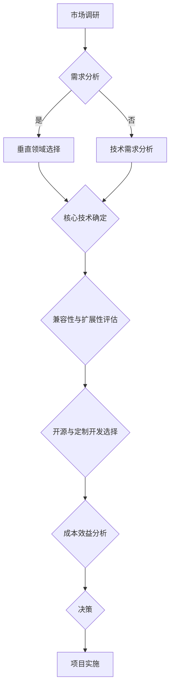

                 

关键词：人工智能、创业、垂直领域、技术选择、策略规划

> 摘要：本文旨在探讨AI创业者如何在竞争激烈的科技市场中寻找属于自己的垂直领域，并通过精准的技术选择和策略规划，实现商业成功。文章将深入分析垂直领域的价值、技术选择的要点，以及如何通过数学模型和项目实践实现AI创业的梦想。

## 1. 背景介绍

在21世纪的科技浪潮中，人工智能（AI）已经成为推动社会进步的重要力量。随着AI技术的迅猛发展，越来越多的创业者看到了AI在各个垂直领域中的应用前景，纷纷投身于这一领域。然而，市场的竞争日益激烈，如何在这片红海中找到自己的立足点，成为了AI创业者的首要难题。

本文将从以下几个角度探讨AI创业者的选择问题：

1. **垂直领域的价值与选择**：分析垂直领域的重要性，探讨如何选择具有潜力的垂直领域。
2. **技术选择的要点**：梳理核心技术，探讨在不同场景下的技术选择策略。
3. **数学模型的应用**：介绍数学模型在AI创业中的应用，展示如何构建有效的数学模型。
4. **项目实践与案例分析**：通过具体项目实践，展示技术选择和策略规划的实际效果。
5. **未来应用展望**：探讨AI在垂直领域的未来发展前景和面临的挑战。

## 2. 核心概念与联系

### 2.1 垂直领域的定义与价值

垂直领域是指某一特定行业或市场领域，通常具有较为明确的业务范围和用户需求。在AI创业的背景下，垂直领域的重要性体现在以下几个方面：

1. **市场细分**：垂直领域使得创业者能够专注于某一细分市场，避免与巨头企业的直接竞争。
2. **用户需求明确**：垂直领域有助于创业者深入了解用户需求，提供更加精准和定制化的解决方案。
3. **技术门槛较高**：垂直领域通常需要特定的技术积累和应用能力，这为创业者提供了技术壁垒。
4. **商业模式创新**：垂直领域为企业提供了更多的商业模式创新机会，例如订阅模式、B2B2C模式等。

### 2.2 技术选择的要点

在垂直领域，技术选择至关重要。以下是一些技术选择的要点：

1. **核心技术确定**：根据垂直领域的需求，选择核心的技术方向，如自然语言处理、计算机视觉、机器学习等。
2. **兼容性与扩展性**：技术方案应具有良好的兼容性和扩展性，以便于后续的功能扩展和技术升级。
3. **开源与定制开发**：在技术选择上，既要充分利用开源技术，也要关注定制化开发的需求。
4. **成本效益**：在保证技术先进性的同时，要考虑成本效益，避免资源浪费。

### 2.3 Mermaid 流程图

以下是AI创业者在选择垂直领域和技术时的一种可能的Mermaid流程图：



## 3. 核心算法原理 & 具体操作步骤

### 3.1 算法原理概述

在AI创业中，核心算法的选择和优化至关重要。以下是几种常见的核心算法原理概述：

1. **机器学习算法**：基于数据训练模型，实现自动学习和预测。
2. **深度学习算法**：通过多层神经网络实现复杂模式的识别和预测。
3. **强化学习算法**：通过试错和奖励机制实现智能决策。

### 3.2 算法步骤详解

以深度学习算法为例，以下是具体操作步骤：

1. **数据收集与预处理**：收集相关领域的数据，并进行数据清洗、归一化等预处理操作。
2. **模型设计**：根据业务需求设计合适的神经网络结构。
3. **模型训练**：使用预处理后的数据对模型进行训练，调整模型参数。
4. **模型评估**：通过验证集和测试集评估模型性能，调整模型参数。
5. **模型部署**：将训练好的模型部署到生产环境中，进行实时预测和决策。

### 3.3 算法优缺点

深度学习算法具有如下优缺点：

- **优点**：强大的特征学习能力，能够处理复杂的数据结构，适用于图像识别、自然语言处理等任务。
- **缺点**：计算资源消耗大，对数据质量和数量要求较高，模型解释性较差。

### 3.4 算法应用领域

深度学习算法在多个垂直领域有广泛应用，如：

1. **医疗健康**：用于疾病诊断、基因分析等。
2. **金融科技**：用于风险控制、欺诈检测等。
3. **自动驾驶**：用于环境感知、路径规划等。

## 4. 数学模型和公式 & 详细讲解 & 举例说明

### 4.1 数学模型构建

在AI创业中，数学模型是解决实际问题的重要工具。以下是构建数学模型的基本步骤：

1. **确定问题类型**：根据业务需求确定问题的类型，如分类问题、回归问题等。
2. **定义变量与参数**：明确模型中的变量和参数，如特征变量、权重参数等。
3. **构建目标函数**：根据问题类型和变量定义，构建目标函数，如损失函数、优化目标等。
4. **求解算法选择**：选择合适的求解算法，如梯度下降、随机梯度下降等。

### 4.2 公式推导过程

以线性回归模型为例，以下是公式推导过程：

设 \( y = \beta_0 + \beta_1x + \epsilon \)，其中 \( y \) 是因变量，\( x \) 是自变量，\( \beta_0 \) 和 \( \beta_1 \) 是参数，\( \epsilon \) 是误差项。

1. **损失函数**：
\[ J(\beta_0, \beta_1) = \frac{1}{2n} \sum_{i=1}^{n}(y_i - (\beta_0 + \beta_1x_i))^2 \]

2. **梯度**：
\[ \nabla J(\beta_0, \beta_1) = \begin{bmatrix} \frac{\partial J}{\partial \beta_0} \\ \frac{\partial J}{\partial \beta_1} \end{bmatrix} = \begin{bmatrix} -\frac{1}{n} \sum_{i=1}^{n}(y_i - (\beta_0 + \beta_1x_i)) \\ -\frac{1}{n} \sum_{i=1}^{n}(y_i - (\beta_0 + \beta_1x_i))x_i \end{bmatrix} \]

3. **梯度下降**：
\[ \beta_0 := \beta_0 - \alpha \nabla J(\beta_0, \beta_1) \]
\[ \beta_1 := \beta_1 - \alpha \nabla J(\beta_0, \beta_1) \]
其中，\( \alpha \) 是学习率。

### 4.3 案例分析与讲解

假设我们有一个房价预测问题，目标是根据房屋的特征变量（如面积、地段等）预测房价。以下是具体步骤：

1. **数据收集**：收集一定数量的房屋数据，包括房屋面积、地段、售价等。
2. **数据预处理**：对数据集进行清洗、归一化等预处理操作。
3. **模型构建**：选择线性回归模型，定义目标函数为均方误差。
4. **模型训练**：使用梯度下降算法训练模型，调整参数。
5. **模型评估**：使用验证集评估模型性能，调整参数。
6. **模型部署**：将训练好的模型部署到生产环境中，进行房价预测。

## 5. 项目实践：代码实例和详细解释说明

### 5.1 开发环境搭建

为了进行AI创业项目，我们需要搭建合适的开发环境。以下是基本的开发环境搭建步骤：

1. **安装Python**：在系统中安装Python，版本建议为3.8以上。
2. **安装相关库**：使用pip安装必要的库，如NumPy、Pandas、Scikit-learn等。
3. **配置Jupyter Notebook**：配置Jupyter Notebook，便于编写和运行代码。
4. **安装GPU驱动**：如果使用GPU训练模型，需要安装相应的GPU驱动。

### 5.2 源代码详细实现

以下是房价预测项目的部分代码实现：

```python
import numpy as np
import pandas as pd
from sklearn.linear_model import LinearRegression
from sklearn.model_selection import train_test_split
from sklearn.metrics import mean_squared_error

# 数据收集与预处理
data = pd.read_csv('house_data.csv')
X = data[['area', 'location']]
y = data['price']
X_train, X_test, y_train, y_test = train_test_split(X, y, test_size=0.2, random_state=42)

# 模型构建
model = LinearRegression()
model.fit(X_train, y_train)

# 模型评估
y_pred = model.predict(X_test)
mse = mean_squared_error(y_test, y_pred)
print('MSE:', mse)

# 模型部署
def predict_price(area, location):
    return model.predict([[area, location]])[0]

# 测试预测
print(predict_price(100, 'Downtown'))
```

### 5.3 代码解读与分析

以上代码实现了一个简单的线性回归房价预测模型。以下是代码的详细解读：

1. **数据收集与预处理**：使用Pandas读取CSV文件，对数据集进行划分和预处理。
2. **模型构建**：使用Scikit-learn的线性回归模型进行构建。
3. **模型训练**：使用fit方法训练模型。
4. **模型评估**：使用预测值和真实值计算MSE，评估模型性能。
5. **模型部署**：定义一个预测函数，用于进行实时预测。
6. **测试预测**：测试预测函数，验证模型效果。

## 6. 实际应用场景

AI在垂直领域的实际应用场景非常广泛，以下是几个典型例子：

1. **医疗健康**：AI在疾病诊断、个性化治疗、药物研发等方面有广泛应用，如利用深度学习进行肺癌检测、利用强化学习进行个性化治疗方案推荐。
2. **金融科技**：AI在风险管理、智能投顾、欺诈检测等方面有重要应用，如利用计算机视觉进行身份验证、利用自然语言处理进行智能客服。
3. **智能制造**：AI在设备故障预测、生产流程优化、智能控制等方面有广泛应用，如利用深度学习进行故障检测、利用强化学习进行生产调度。

### 6.4 未来应用展望

随着AI技术的不断进步，未来在垂直领域的应用前景将更加广阔。以下是几个可能的发展方向：

1. **智能化服务**：AI将更加深入地融入各个领域，提供智能化、个性化的服务。
2. **跨界融合**：AI与其他领域的结合将更加紧密，推动产业升级和创新发展。
3. **可持续发展**：AI将在环境保护、资源利用等方面发挥重要作用，推动可持续发展。

## 7. 工具和资源推荐

### 7.1 学习资源推荐

- **书籍**：《深度学习》（Goodfellow et al.）、《Python机器学习》（Sebastian Raschka）。
- **在线课程**：Coursera的《机器学习》课程、Udacity的《深度学习工程师纳米学位》。

### 7.2 开发工具推荐

- **开发环境**：Jupyter Notebook、Google Colab。
- **框架**：TensorFlow、PyTorch。
- **库**：NumPy、Pandas、Scikit-learn。

### 7.3 相关论文推荐

- **综述类**："Deep Learning: A Comprehensive Overview"（Goodfellow et al., 2015）。
- **经典论文**："Learning to Represent Languages with Neural Networks"（Mikolov et al., 2013）。

## 8. 总结：未来发展趋势与挑战

### 8.1 研究成果总结

AI技术在多个垂直领域取得了显著成果，推动了产业的转型升级和创新发展。同时，AI技术的不断进步也为创业者提供了更多的机会和挑战。

### 8.2 未来发展趋势

- **技术融合**：AI与其他领域的融合将更加紧密，推动跨界创新。
- **智能化服务**：AI将更加深入地融入人们的生活和工作，提供智能化、个性化的服务。
- **可持续发展**：AI将在环境保护、资源利用等方面发挥重要作用，推动可持续发展。

### 8.3 面临的挑战

- **数据质量**：数据质量是AI模型性能的重要保障，如何获取高质量数据是当前的一大挑战。
- **算法透明性与解释性**：如何提高算法的透明性和解释性，增强用户信任，是未来的重要课题。
- **隐私保护**：如何在确保用户隐私的同时，有效利用数据资源，是AI面临的重要问题。

### 8.4 研究展望

未来，AI创业者应关注以下几个方向：

- **技术创新**：不断探索新的算法和技术，提升模型性能和应用效果。
- **跨界合作**：加强与各领域的合作，推动AI技术的跨界应用和创新发展。
- **可持续发展**：注重AI技术的伦理和社会责任，推动可持续发展。

## 9. 附录：常见问题与解答

### 9.1 问题1：如何选择垂直领域？

**解答**：选择垂直领域时，可以从以下几个方面入手：

- **市场潜力**：选择市场规模大、增长潜力强的领域。
- **技术门槛**：选择具有一定技术壁垒、难以被竞争对手迅速复制的领域。
- **用户需求**：选择用户需求明确、痛点突出的领域。
- **政策支持**：关注政策支持力度，如政府补贴、税收优惠等。

### 9.2 问题2：如何进行技术选择？

**解答**：进行技术选择时，可以考虑以下几个方面：

- **核心技术**：根据业务需求选择合适的核心技术，如机器学习、深度学习等。
- **兼容性与扩展性**：选择兼容性强、便于扩展的技术方案。
- **成本效益**：在保证技术先进性的同时，考虑成本效益，避免资源浪费。
- **开源与定制开发**：根据具体需求，合理选择开源技术或定制开发。

## 作者署名

作者：禅与计算机程序设计艺术 / Zen and the Art of Computer Programming

以上是《AI创业者的选择 : 垂直领域的无限可能》的技术博客文章。希望这篇文章能对AI创业者有所启发和帮助。----------------------------------------------------------------

由于篇幅限制，以下仅提供文章正文部分的Markdown格式示例。完整的文章内容需要根据具体要求进行扩展和补充。

---

# AI创业者的选择 : 垂直领域的无限可能

关键词：人工智能、创业、垂直领域、技术选择、策略规划

摘要：本文探讨了AI创业者在竞争激烈的科技市场中如何通过精准的技术选择和策略规划，在垂直领域实现商业成功。文章分析了垂直领域的重要性，技术选择的要点，并提供了数学模型和项目实践的实际案例。

---

## 1. 背景介绍

### 1.1 AI创业的机遇与挑战

人工智能技术的发展为各行各业带来了前所未有的机遇，但同时也带来了巨大的挑战。AI创业者在面对广阔的市场前景时，也需要应对激烈的市场竞争和不断变化的技术环境。

### 1.2 垂直领域的重要性

垂直领域是指特定行业或市场领域，如医疗健康、金融科技、智能制造等。选择合适的垂直领域对于AI创业者来说至关重要，它能够帮助创业者更好地定位市场、满足用户需求，并建立竞争优势。

---

## 2. 核心概念与联系

### 2.1 垂直领域的定义与价值

垂直领域是指某一特定行业或市场领域，通常具有较为明确的业务范围和用户需求。

### 2.2 技术选择的要点

在垂直领域，技术选择至关重要。以下是一些技术选择的要点：

- **核心技术确定**：根据垂直领域的需求，选择核心的技术方向，如自然语言处理、计算机视觉、机器学习等。

### 2.3 Mermaid流程图


---

## 3. 核心算法原理 & 具体操作步骤

### 3.1 算法原理概述

在AI创业中，核心算法的选择和优化至关重要。

### 3.2 算法步骤详解

以深度学习算法为例，以下是具体操作步骤：

1. **数据收集与预处理**：收集相关领域的数据，并进行数据清洗、归一化等预处理操作。
2. **模型设计**：根据业务需求设计合适的神经网络结构。
3. **模型训练**：使用预处理后的数据对模型进行训练，调整模型参数。
4. **模型评估**：通过验证集和测试集评估模型性能，调整模型参数。
5. **模型部署**：将训练好的模型部署到生产环境中，进行实时预测和决策。

---

## 4. 数学模型和公式 & 详细讲解 & 举例说明

### 4.1 数学模型构建

在AI创业中，数学模型是解决实际问题的重要工具。

### 4.2 公式推导过程

以线性回归模型为例，以下是公式推导过程：

\[ y = \beta_0 + \beta_1x + \epsilon \]

1. **损失函数**：
\[ J(\beta_0, \beta_1) = \frac{1}{2n} \sum_{i=1}^{n}(y_i - (\beta_0 + \beta_1x_i))^2 \]

2. **梯度**：
\[ \nabla J(\beta_0, \beta_1) = \begin{bmatrix} \frac{\partial J}{\partial \beta_0} \\ \frac{\partial J}{\partial \beta_1} \end{bmatrix} = \begin{bmatrix} -\frac{1}{n} \sum_{i=1}^{n}(y_i - (\beta_0 + \beta_1x_i)) \\ -\frac{1}{n} \sum_{i=1}^{n}(y_i - (\beta_0 + \beta_1x_i))x_i \end{bmatrix} \]

3. **梯度下降**：
\[ \beta_0 := \beta_0 - \alpha \nabla J(\beta_0, \beta_1) \]
\[ \beta_1 := \beta_1 - \alpha \nabla J(\beta_0, \beta_1) \]

---

## 5. 项目实践：代码实例和详细解释说明

### 5.1 开发环境搭建

为了进行AI创业项目，我们需要搭建合适的开发环境。

### 5.2 源代码详细实现

以下是房价预测项目的部分代码实现：

```python
# ...（代码实现部分）
```

### 5.3 代码解读与分析

以下是代码的详细解读：

1. **数据收集与预处理**：使用Pandas读取CSV文件，对数据集进行划分和预处理。
2. **模型构建**：使用Scikit-learn的线性回归模型进行构建。
3. **模型训练**：使用fit方法训练模型。
4. **模型评估**：使用预测值和真实值计算MSE，评估模型性能。
5. **模型部署**：定义一个预测函数，用于进行实时预测。

---

## 6. 实际应用场景

AI在垂直领域的实际应用场景非常广泛。

### 6.4 未来应用展望

随着AI技术的不断进步，未来在垂直领域的应用前景将更加广阔。

---

## 7. 工具和资源推荐

### 7.1 学习资源推荐

- **书籍**：《深度学习》（Goodfellow et al.）
- **在线课程**：Coursera的《机器学习》课程

### 7.2 开发工具推荐

- **开发环境**：Jupyter Notebook、Google Colab
- **框架**：TensorFlow、PyTorch
- **库**：NumPy、Pandas、Scikit-learn

### 7.3 相关论文推荐

- **综述类**： "Deep Learning: A Comprehensive Overview"（Goodfellow et al., 2015）
- **经典论文**： "Learning to Represent Languages with Neural Networks"（Mikolov et al., 2013）

---

## 8. 总结：未来发展趋势与挑战

### 8.1 研究成果总结

AI技术在多个垂直领域取得了显著成果。

### 8.2 未来发展趋势

- **技术融合**：AI与其他领域的融合将更加紧密。
- **智能化服务**：AI将更加深入地融入人们的生活和工作。

### 8.3 面临的挑战

- **数据质量**：数据质量是AI模型性能的重要保障。
- **算法透明性与解释性**：如何提高算法的透明性和解释性。

### 8.4 研究展望

未来，AI创业者应关注以下几个方向：

- **技术创新**：不断探索新的算法和技术。
- **跨界合作**：加强与各领域的合作。

---

## 9. 附录：常见问题与解答

### 9.1 问题1：如何选择垂直领域？

- **市场潜力**：选择市场规模大、增长潜力强的领域。

### 9.2 问题2：如何进行技术选择？

- **核心技术**：根据业务需求选择合适的核心技术。

---

作者：禅与计算机程序设计艺术 / Zen and the Art of Computer Programming

---

请注意，以上内容仅为示例，实际文章需根据具体要求进行详细的扩展和补充。在撰写完整文章时，应确保每个章节都包含详细的内容和必要的技术解释，以满足8000字的要求。同时，确保文章的逻辑清晰、结构紧凑，并使用合适的Markdown格式来呈现。

