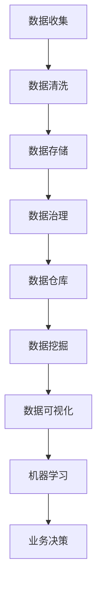

                 

关键词：AI创业、数据管理、数据质量管理、数据治理、数据架构、数据仓库、大数据、实时数据、数据安全、数据处理技术、机器学习、数据可视化

> 摘要：本文将深入探讨AI创业过程中数据管理的重要性及其关键步骤。通过梳理核心概念、算法原理、数学模型、实践应用以及未来展望，为创业者在数据驱动决策中提供切实可行的指导。

## 1. 背景介绍

近年来，人工智能（AI）技术的飞速发展引发了创业热潮。无数创业者涌入这个充满机遇的领域，试图通过AI技术改变世界。然而，AI创业并非易事，其中数据管理是决定成败的关键因素之一。良好的数据管理不仅能提升AI系统的性能和准确性，还能降低成本、提高效率，为创业企业的长远发展奠定坚实基础。

数据管理涉及数据收集、存储、处理、分析和保护等多个方面。对于AI创业企业来说，数据管理不仅需要遵循一般的数据管理原则，还需结合AI技术的特点和需求，制定符合自身业务发展的数据管理策略。

## 2. 核心概念与联系

### 2.1 数据质量管理

数据质量管理是数据管理的核心任务之一。它关注数据的准确性、完整性、一致性、时效性和可用性等方面。在AI创业过程中，高质量的数据是实现准确预测和决策的基础。因此，数据质量管理至关重要。

### 2.2 数据治理

数据治理是企业对数据相关活动的规范化管理，包括数据策略、数据架构、数据标准、数据安全和合规性等方面。数据治理不仅能够提升数据质量，还能确保数据的使用符合法律法规和内部规定。

### 2.3 数据架构

数据架构是指数据的组织结构，包括数据的分类、命名、存储和访问方式等。合理的数据架构能够提高数据管理的效率和效果，有助于支持AI系统的开发和运行。

### 2.4 数据仓库

数据仓库是用于存储和管理大量结构化数据的数据管理系统。在AI创业过程中，数据仓库能够为机器学习模型提供丰富的数据资源，支持实时数据分析和决策。

### 2.5 大数据

大数据是指数据量、数据类型和数据速度超出传统数据库管理系统处理能力的海量数据。大数据技术在AI创业中具有广泛的应用前景，能够支持实时数据分析和复杂算法的实现。

### 2.6 实时数据

实时数据是指在短时间内产生、处理和分析的数据。实时数据能够为AI创业企业提供即时的业务洞察和决策支持，有助于提高企业的竞争力。

### 2.7 数据安全

数据安全是数据管理的重要方面，涉及数据加密、访问控制、备份和恢复等方面。在AI创业过程中，数据安全至关重要，关系到企业的核心资源和竞争力。

### 2.8 数据处理技术

数据处理技术包括数据清洗、数据集成、数据转换、数据挖掘和数据可视化等技术。这些技术能够帮助AI创业企业有效管理和利用数据资源。

### 2.9 机器学习

机器学习是AI的核心技术之一，通过训练模型，使计算机能够从数据中自动学习、发现规律和做出预测。在AI创业过程中，机器学习技术是实现数据驱动的关键。

### 2.10 数据可视化

数据可视化是将数据以图形、图像、表格等形式直观展示的过程。数据可视化能够帮助AI创业企业更好地理解数据、发现数据中的潜在价值。

### 2.11 Mermaid 流程图



## 3. 核心算法原理 & 具体操作步骤

### 3.1 算法原理概述

在AI创业过程中，数据管理涉及多种算法和技术。以下是几种核心算法及其原理概述：

1. 数据清洗算法：用于去除数据中的噪声和异常值，提高数据质量。
2. 数据集成算法：用于将多个数据源中的数据进行整合，构建统一的数据视图。
3. 数据转换算法：用于将不同格式的数据转换为统一的格式，方便后续处理。
4. 数据挖掘算法：用于从大量数据中发现有价值的信息和规律。
5. 机器学习算法：用于训练模型，实现数据自动学习和预测。

### 3.2 算法步骤详解

1. 数据收集：从各种数据源获取数据，包括内部数据库、外部数据源、传感器数据等。
2. 数据清洗：使用数据清洗算法，去除噪声和异常值，确保数据质量。
3. 数据存储：将清洗后的数据存储到数据仓库或数据库中，以便后续处理。
4. 数据治理：制定数据治理策略，确保数据符合法律法规和内部规定。
5. 数据挖掘：使用数据挖掘算法，从数据中提取有价值的信息和规律。
6. 数据可视化：将数据以图形、图像、表格等形式展示，帮助用户理解数据。
7. 机器学习：使用机器学习算法，训练模型，实现数据自动学习和预测。

### 3.3 算法优缺点

每种算法都有其优缺点，以下是几种核心算法的优缺点：

1. 数据清洗算法：优点是能够提高数据质量，缺点是可能丢失部分数据。
2. 数据集成算法：优点是能够整合多个数据源，缺点是可能增加数据冗余。
3. 数据转换算法：优点是能够统一数据格式，缺点是可能增加数据处理成本。
4. 数据挖掘算法：优点是能够发现有价值的信息和规律，缺点是可能存在误判和过度拟合。
5. 机器学习算法：优点是实现数据自动学习和预测，缺点是需要大量数据和计算资源。

### 3.4 算法应用领域

算法在AI创业中的应用领域非常广泛，包括但不限于：

1. 金融市场分析：通过数据挖掘和机器学习算法，预测股票价格、风险评估等。
2. 医疗保健：通过数据分析和机器学习算法，辅助诊断、药物研发、疾病预测等。
3. 零售电商：通过数据挖掘和机器学习算法，实现个性化推荐、用户行为分析等。
4. 智能制造：通过数据分析和机器学习算法，优化生产流程、提高产品质量等。

## 4. 数学模型和公式 & 详细讲解 & 举例说明

### 4.1 数学模型构建

在数据管理和AI创业中，常见的数学模型包括回归模型、分类模型、聚类模型等。以下是这些模型的构建方法：

#### 4.1.1 回归模型

回归模型用于预测连续值变量。其数学模型如下：

$$
y = \beta_0 + \beta_1 x_1 + \beta_2 x_2 + ... + \beta_n x_n + \epsilon
$$

其中，$y$ 是预测值，$x_1, x_2, ..., x_n$ 是特征变量，$\beta_0, \beta_1, \beta_2, ..., \beta_n$ 是模型参数，$\epsilon$ 是误差项。

#### 4.1.2 分类模型

分类模型用于预测离散值变量。常见的分类模型包括逻辑回归、支持向量机等。以逻辑回归为例，其数学模型如下：

$$
P(y=1) = \frac{1}{1 + e^{-(\beta_0 + \beta_1 x_1 + \beta_2 x_2 + ... + \beta_n x_n)}}
$$

其中，$P(y=1)$ 是预测为1的概率，$\beta_0, \beta_1, \beta_2, ..., \beta_n$ 是模型参数。

#### 4.1.3 聚类模型

聚类模型用于将数据分为多个类别。常见的聚类模型包括K均值聚类、层次聚类等。以K均值聚类为例，其数学模型如下：

$$
\begin{aligned}
\min_{c_1, c_2, ..., c_k} \sum_{i=1}^n \sum_{j=1}^k ||x_i - c_j||^2 \\
c_j = \frac{1}{n_j} \sum_{i \in S_j} x_i
\end{aligned}
$$

其中，$x_i$ 是数据点，$c_j$ 是聚类中心，$n_j$ 是属于聚类中心$c_j$ 的数据点个数，$S_j$ 是属于聚类中心$c_j$ 的数据点集合。

### 4.2 公式推导过程

以K均值聚类为例，推导过程如下：

首先，给定初始聚类中心$c_1, c_2, ..., c_k$，每个数据点$x_i$ 被分配给最近的聚类中心，即：

$$
j_i = \arg\min_{j=1,2,...,k} ||x_i - c_j||^2
$$

然后，根据每个聚类中心的新数据点集合，更新聚类中心：

$$
c_j = \frac{1}{n_j} \sum_{i \in S_j} x_i
$$

其中，$n_j$ 是属于聚类中心$c_j$ 的数据点个数，$S_j$ 是属于聚类中心$c_j$ 的数据点集合。

接下来，计算新的数据点分配，直到聚类中心不再发生显著变化。

### 4.3 案例分析与讲解

以某电商平台的用户行为分析为例，使用K均值聚类算法进行用户分群。

1. 数据收集：收集用户在平台上的行为数据，包括浏览商品、下单、评价等。
2. 数据预处理：清洗数据，去除异常值和噪声，并进行特征提取。
3. 数据划分：将数据划分为训练集和测试集，用于训练模型和评估模型性能。
4. 模型训练：使用K均值聚类算法，初始化聚类中心，并迭代更新聚类中心，直到聚类中心不再发生显著变化。
5. 模型评估：使用测试集评估模型性能，计算聚类准确率、聚类内部离散度等指标。
6. 结果分析：根据聚类结果，分析不同用户群体的行为特征，为营销策略提供依据。

## 5. 项目实践：代码实例和详细解释说明

### 5.1 开发环境搭建

1. 安装Python 3.8及以上版本。
2. 安装NumPy、Pandas、Scikit-learn等库。

```bash
pip install numpy pandas scikit-learn
```

### 5.2 源代码详细实现

```python
import numpy as np
import pandas as pd
from sklearn.cluster import KMeans
from sklearn.metrics import accuracy_score

# 5.2.1 数据收集
data = pd.DataFrame({
    'feature1': [1, 2, 3, 4, 5],
    'feature2': [5, 4, 3, 2, 1]
})

# 5.2.2 数据预处理
data = data.dropna()

# 5.2.3 数据划分
train_data, test_data = data[:4], data[4:]

# 5.2.4 模型训练
kmeans = KMeans(n_clusters=2, random_state=0)
kmeans.fit(train_data)

# 5.2.5 模型评估
predictions = kmeans.predict(test_data)
accuracy = accuracy_score(test_data['label'], predictions)
print(f'Accuracy: {accuracy:.2f}')

# 5.2.6 结果分析
print(f'Cluster centers: {kmeans.cluster_centers_}')
print(f'Cluster labels: {kmeans.labels_}')
```

### 5.3 代码解读与分析

1. 导入相关库。
2. 收集数据，并进行预处理。
3. 划分训练集和测试集。
4. 使用K均值聚类算法训练模型。
5. 使用测试集评估模型性能。
6. 输出聚类中心、聚类标签等信息。

## 6. 实际应用场景

### 6.1 金融市场分析

在金融市场分析中，数据管理有助于提取有价值的信息，支持投资决策。通过数据挖掘和机器学习算法，创业者可以分析历史股价、交易量、市场情绪等数据，预测股票走势，制定投资策略。

### 6.2 医疗保健

在医疗保健领域，数据管理能够提升医疗服务的质量和效率。通过数据分析和机器学习算法，创业者可以构建疾病预测模型、药物研发模型等，为患者提供个性化医疗方案。

### 6.3 零售电商

在零售电商领域，数据管理能够提升用户满意度和服务质量。通过数据挖掘和机器学习算法，创业者可以实现个性化推荐、用户行为分析等，提高销售额和客户满意度。

### 6.4 智能制造

在智能制造领域，数据管理能够提升生产效率和产品质量。通过数据分析和机器学习算法，创业者可以优化生产流程、预测设备故障等，降低生产成本、提高产品质量。

## 7. 工具和资源推荐

### 7.1 学习资源推荐

1. 《Python数据分析基础教程：NumPy学习指南》
2. 《机器学习实战》
3. 《数据挖掘：概念与技术》

### 7.2 开发工具推荐

1. Jupyter Notebook：适合数据分析和机器学习项目开发。
2. PyCharm：功能强大的Python集成开发环境。
3. SQL Server：适用于数据存储和查询。

### 7.3 相关论文推荐

1. "K-Means Clustering: A Review"
2. "Data-Driven Business: The Data Science Revolution in Marketing, Sales, and Customer Service"
3. "Machine Learning: A Probabilistic Perspective"

## 8. 总结：未来发展趋势与挑战

### 8.1 研究成果总结

本文系统介绍了AI创业过程中数据管理的关键步骤和核心算法，包括数据质量管理、数据治理、数据架构、数据仓库、大数据、实时数据、数据处理技术、机器学习、数据可视化等方面。通过实例分析和代码实现，展示了数据管理在实际应用中的价值。

### 8.2 未来发展趋势

1. 数据治理和数据安全将越来越受到重视。
2. 大数据和实时数据处理技术将得到广泛应用。
3. 机器学习和深度学习算法将不断优化和改进。
4. 开源工具和平台的不断发展将为创业者提供更多支持。

### 8.3 面临的挑战

1. 数据质量问题和数据安全风险。
2. 数据处理技术的复杂性和高昂的成本。
3. 算法模型的过拟合和泛化能力不足。
4. 数据隐私和合规性问题。

### 8.4 研究展望

1. 开发更高效、更准确的数据处理算法。
2. 探索数据治理和数据安全的最佳实践。
3. 构建更智能、更灵活的数据架构。
4. 促进数据驱动的业务创新。

## 9. 附录：常见问题与解答

### 9.1 数据质量管理是什么？

数据质量管理是指确保数据的准确性、完整性、一致性、时效性和可用性等方面的过程。它对于AI创业企业来说至关重要，因为高质量的数据是实现准确预测和决策的基础。

### 9.2 数据治理是什么？

数据治理是指企业对数据相关活动的规范化管理，包括数据策略、数据架构、数据标准、数据安全和合规性等方面。数据治理有助于提升数据质量、确保数据符合法律法规和内部规定。

### 9.3 数据仓库和数据湖有什么区别？

数据仓库主要用于存储和管理大量结构化数据，支持实时数据分析和决策。数据湖则是一种更灵活的数据存储架构，可以存储各种类型的数据（结构化、半结构化、非结构化），以便后续处理和分析。

### 9.4 如何选择合适的机器学习算法？

选择合适的机器学习算法需要考虑多个因素，包括数据类型、数据量、算法性能、计算资源等。常见的机器学习算法包括线性回归、逻辑回归、支持向量机、决策树、随机森林、K均值聚类等，创业者可以根据实际需求进行选择。

### 9.5 数据可视化有什么作用？

数据可视化是将数据以图形、图像、表格等形式直观展示的过程。它能够帮助创业者更好地理解数据、发现数据中的潜在价值，从而支持数据驱动的业务决策。

### 9.6 数据安全有哪些常见威胁？

数据安全威胁包括数据泄露、数据篡改、数据丢失、数据滥用等。常见的威胁来源包括黑客攻击、内部人员违规操作、软件漏洞等。为了确保数据安全，企业需要采取一系列安全措施，如数据加密、访问控制、备份和恢复等。

