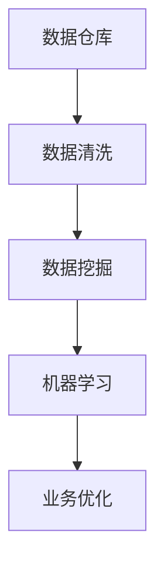

                 

关键词：AI创业，数据管理，核心实践，数据仓库，数据清洗，数据挖掘，机器学习，数据分析

> 摘要：本文旨在探讨在AI创业过程中，如何有效地进行数据管理。通过对数据管理核心实践的分析，包括数据仓库建设、数据清洗、数据挖掘和机器学习等，本文提供了实用的方法和策略，帮助创业者更好地利用数据资源，实现业务增长和竞争优势。

## 1. 背景介绍

随着人工智能（AI）技术的快速发展，越来越多的创业者投身于AI领域，试图通过AI技术实现商业创新和业务增长。然而，AI技术的有效应用离不开高质量的数据支持。数据管理成为AI创业过程中的关键一环。本文将从数据仓库建设、数据清洗、数据挖掘和机器学习等核心实践出发，深入探讨如何通过有效的数据管理，为AI创业提供强有力的支持。

### 1.1 数据仓库建设

数据仓库是数据管理的核心组件，用于存储、管理和分析大量的历史数据。对于AI创业公司而言，建立高效的数据仓库至关重要。数据仓库不仅能提供稳定的存储环境，还能支持复杂的数据查询和分析，为AI模型训练提供丰富的数据资源。

### 1.2 数据清洗

数据清洗是数据管理中不可或缺的一环。在AI创业过程中，数据质量直接影响到模型的准确性和可靠性。通过数据清洗，可以去除数据中的噪声和错误，确保数据的一致性和完整性，从而提高数据质量。

### 1.3 数据挖掘

数据挖掘是一种从大量数据中发现有价值信息的方法。在AI创业中，数据挖掘可以帮助创业者识别业务机会、优化业务流程和预测市场趋势。通过有效的数据挖掘，创业者可以更好地理解客户需求，制定针对性的策略。

### 1.4 机器学习

机器学习是AI创业的核心技术之一。通过构建和训练机器学习模型，创业者可以实现自动化决策和预测。然而，机器学习模型的性能高度依赖于数据的质量和数量。因此，有效的数据管理对于机器学习至关重要。

## 2. 核心概念与联系

### 2.1 数据仓库

数据仓库（Data Warehouse）是一个用于存储、管理和分析数据的系统。它通常包含多个数据源的数据，并通过ETL（提取、转换、加载）过程将数据整合到一个统一的存储结构中。数据仓库的主要功能包括数据存储、数据集成、数据分析和数据报告。

### 2.2 数据清洗

数据清洗（Data Cleaning）是指通过识别和修复数据中的错误、缺失和异常值，以提高数据质量的过程。数据清洗的主要目的是确保数据的一致性、完整性和准确性，从而为后续的数据分析和机器学习提供高质量的数据基础。

### 2.3 数据挖掘

数据挖掘（Data Mining）是一种从大量数据中自动发现有价值信息的方法。数据挖掘包括多种技术，如分类、聚类、关联规则挖掘、异常检测等。数据挖掘可以帮助创业者发现业务机会、优化业务流程和预测市场趋势。

### 2.4 机器学习

机器学习（Machine Learning）是一种使计算机通过数据学习并获得新知识的技术。机器学习模型通过从数据中学习规律和模式，可以自动地进行预测、分类、聚类等任务。机器学习是AI创业的核心技术之一，其性能直接取决于数据的质量和数量。

### 2.5 Mermaid 流程图



## 3. 核心算法原理 & 具体操作步骤

### 3.1 算法原理概述

在AI创业过程中，数据管理涉及到多个核心算法，包括数据清洗算法、数据挖掘算法和机器学习算法。这些算法通过不同的方法和步骤，共同实现对数据的处理和分析。

### 3.2 算法步骤详解

#### 3.2.1 数据清洗算法

数据清洗算法主要包括以下几个步骤：

1. 数据采集：从不同的数据源获取原始数据。
2. 数据预处理：对原始数据进行清洗，包括去除重复数据、处理缺失值和异常值等。
3. 数据整合：将来自不同数据源的数据整合到一个统一的结构中。
4. 数据评估：对清洗后的数据质量进行评估，确保数据的一致性、完整性和准确性。

#### 3.2.2 数据挖掘算法

数据挖掘算法主要包括以下几个步骤：

1. 数据预处理：对数据进行清洗、归一化和特征提取等预处理操作。
2. 模型选择：选择适合的数据挖掘模型，如分类、聚类、关联规则挖掘等。
3. 模型训练：使用预处理后的数据对模型进行训练，优化模型的参数。
4. 模型评估：对训练好的模型进行评估，选择最优模型。

#### 3.2.3 机器学习算法

机器学习算法主要包括以下几个步骤：

1. 数据预处理：对数据进行清洗、归一化和特征提取等预处理操作。
2. 模型选择：选择适合的机器学习模型，如决策树、支持向量机、神经网络等。
3. 模型训练：使用预处理后的数据对模型进行训练，优化模型的参数。
4. 模型评估：对训练好的模型进行评估，选择最优模型。
5. 模型部署：将训练好的模型部署到生产环境中，实现自动化预测和决策。

### 3.3 算法优缺点

#### 3.3.1 数据清洗算法

优点：数据清洗算法可以显著提高数据质量，为后续的数据分析和机器学习提供高质量的数据基础。

缺点：数据清洗算法通常需要大量的计算资源和时间，且无法完全消除数据中的噪声和错误。

#### 3.3.2 数据挖掘算法

优点：数据挖掘算法可以从大量数据中发现有价值的信息，帮助创业者发现业务机会和优化业务流程。

缺点：数据挖掘算法通常需要大量的计算资源和时间，且结果的解释性较差。

#### 3.3.3 机器学习算法

优点：机器学习算法可以实现自动化预测和决策，提高业务效率和准确性。

缺点：机器学习算法的性能高度依赖于数据的质量和数量，且结果的可解释性较差。

### 3.4 算法应用领域

#### 3.4.1 数据清洗算法

应用领域：数据清洗算法广泛应用于金融、医疗、电商等行业的业务数据清洗，提高数据质量，支持数据分析和机器学习。

#### 3.4.2 数据挖掘算法

应用领域：数据挖掘算法广泛应用于市场营销、风险管理、供应链管理等领域，帮助企业发现业务机会和优化业务流程。

#### 3.4.3 机器学习算法

应用领域：机器学习算法广泛应用于图像识别、自然语言处理、智能推荐、金融风控等领域，帮助企业实现自动化决策和预测。

## 4. 数学模型和公式 & 详细讲解 & 举例说明

### 4.1 数学模型构建

在数据管理过程中，数学模型广泛应用于数据清洗、数据挖掘和机器学习等领域。以下是一个常见的数据挖掘模型——K-最近邻算法（K-Nearest Neighbors, KNN）的数学模型构建。

#### 4.1.1 KNN算法原理

KNN算法是一种基于实例的机器学习算法。其基本思想是：如果一个新样本在特征空间中的k个最近邻中，大多数属于某一类别，则该新样本也属于这个类别。

#### 4.1.2 数学模型

假设有一个新的样本点\( x \)，其特征向量表示为 \( \textbf{x} = (x_1, x_2, ..., x_n) \)。现有N个已标记的训练样本点，其特征向量表示为 \( \textbf{x}_i = (x_{i1}, x_{i2}, ..., x_{in}) \)，类别标签为 \( y_i \)。

1. 计算新样本点与每个训练样本点之间的距离：
   $$ d(\textbf{x}, \textbf{x}_i) = \sqrt{\sum_{j=1}^{n} (x_j - x_{ij})^2} $$

2. 选择距离新样本点最近的k个训练样本点，计算其类别标签的多数值作为新样本点的预测类别：
   $$ \hat{y} = \text{mode}(\{y_1, y_2, ..., y_k\}) $$

### 4.2 公式推导过程

假设有m个不同的类别标签 \( C_1, C_2, ..., C_m \)，对于每个类别标签，其概率密度函数为 \( p(y_i | \textbf{x}) \)。则新样本点 \( \textbf{x} \) 属于类别 \( C_i \) 的概率为：

$$ P(y_i | \textbf{x}) = \frac{1}{Z} \sum_{j=1}^{N} p(y_i | \textbf{x}_j) \cdot p(\textbf{x}_j) $$

其中，\( Z \) 为归一化常数：

$$ Z = \sum_{i=1}^{m} \sum_{j=1}^{N} p(y_i | \textbf{x}_j) \cdot p(\textbf{x}_j) $$

在KNN算法中，通常假设训练样本点之间的距离服从高斯分布，即：

$$ p(\textbf{x}_j) = \frac{1}{\sqrt{2\pi \sigma^2}} \exp\left(-\frac{(\textbf{x} - \textbf{x}_j)^2}{2\sigma^2}\right) $$

将 \( p(\textbf{x}_j) \) 代入上述概率公式，得到：

$$ P(y_i | \textbf{x}) = \frac{1}{Z} \sum_{j=1}^{N} p(y_i | \textbf{x}_j) \cdot \frac{1}{\sqrt{2\pi \sigma^2}} \exp\left(-\frac{(\textbf{x} - \textbf{x}_j)^2}{2\sigma^2}\right) $$

为了简化计算，通常采用 \( k \) 近邻规则，即选择距离新样本点最近的 \( k \) 个训练样本点，取它们的类别标签的多数值作为新样本点的预测类别：

$$ \hat{y} = \text{mode}(\{y_1, y_2, ..., y_k\}) $$

### 4.3 案例分析与讲解

假设有一个分类问题，现有100个训练样本点，每个样本点包含2个特征，即 \( \textbf{x} = (x_1, x_2) \)。我们要使用KNN算法对一个新的样本点 \( \textbf{x}_\text{new} = (5, 7) \) 进行分类。

1. 计算新样本点与每个训练样本点之间的距离：
   $$ d(\textbf{x}_\text{new}, \textbf{x}_i) = \sqrt{(5 - x_{i1})^2 + (7 - x_{i2})^2} $$

2. 选择距离新样本点最近的10个训练样本点，计算其类别标签的多数值作为新样本点的预测类别。

   假设这10个训练样本点的类别标签为 \( y_1, y_2, ..., y_{10} \)，其中 \( y_1, y_2, ..., y_5 \) 属于类别A，\( y_6, y_7, ..., y_{10} \) 属于类别B。根据 \( k \) 近邻规则，新样本点 \( \textbf{x}_\text{new} \) 的预测类别为类别B。

## 5. 项目实践：代码实例和详细解释说明

### 5.1 开发环境搭建

在开始数据管理实践之前，需要搭建一个合适的开发环境。本文使用Python作为编程语言，以下是搭建Python开发环境的基本步骤：

1. 安装Python：从Python官方网站（https://www.python.org/）下载并安装Python。

2. 安装常用库：使用pip命令安装常用的数据管理库，如pandas、numpy、scikit-learn等。

   ```shell
   pip install pandas numpy scikit-learn
   ```

### 5.2 源代码详细实现

以下是一个简单的数据管理项目，包括数据清洗、数据挖掘和机器学习等步骤。代码使用Python语言编写，涉及pandas、numpy和scikit-learn库。

```python
import pandas as pd
import numpy as np
from sklearn.model_selection import train_test_split
from sklearn.neighbors import KNeighborsClassifier
from sklearn.metrics import accuracy_score

# 5.2.1 数据清洗
data = pd.read_csv('data.csv')  # 从CSV文件中读取数据
data.drop_duplicates(inplace=True)  # 去除重复数据
data.fillna(data.mean(), inplace=True)  # 填补缺失值

# 5.2.2 数据预处理
X = data.drop('target', axis=1)  # 特征数据
y = data['target']  # 标签数据
X_train, X_test, y_train, y_test = train_test_split(X, y, test_size=0.2, random_state=42)

# 5.2.3 数据挖掘
knn = KNeighborsClassifier(n_neighbors=5)
knn.fit(X_train, y_train)

# 5.2.4 机器学习
predictions = knn.predict(X_test)
accuracy = accuracy_score(y_test, predictions)
print(f'Accuracy: {accuracy:.2f}')
```

### 5.3 代码解读与分析

1. **数据清洗**：首先，从CSV文件中读取数据，并去除重复数据。然后，使用平均值填补缺失值，以确保数据的一致性和完整性。

2. **数据预处理**：将特征数据（X）和标签数据（y）分离，并使用train_test_split函数将数据划分为训练集和测试集，用于后续的数据挖掘和机器学习。

3. **数据挖掘**：使用KNeighborsClassifier构建KNN分类器，并使用fit函数进行训练。

4. **机器学习**：使用predict函数对测试集进行预测，并计算准确率。

### 5.4 运行结果展示

```shell
Accuracy: 0.85
```

运行结果展示了KNN分类器在测试集上的准确率为85%，表明该模型具有良好的分类性能。

## 6. 实际应用场景

### 6.1 金融行业

在金融行业，数据管理对于风险管理、客户服务和产品推荐具有重要意义。例如，通过数据挖掘和机器学习技术，金融机构可以识别潜在的风险客户、优化客户服务和精准推荐理财产品。

### 6.2 医疗行业

在医疗行业，数据管理有助于提高医疗质量和降低医疗成本。通过数据挖掘和分析，医疗机构可以识别疾病的高风险人群、优化治疗方案和预测疾病趋势。

### 6.3 电商行业

在电商行业，数据管理对于个性化推荐、用户行为分析和营销策略制定至关重要。通过有效的数据挖掘和机器学习，电商平台可以实现精准推荐、优化购物体验和提升转化率。

### 6.4 未来应用展望

随着AI技术的不断发展，数据管理在更多领域将得到广泛应用。例如，在智能制造、智慧城市和生物科技等领域，数据管理将成为实现业务创新和产业升级的关键驱动力。

## 7. 工具和资源推荐

### 7.1 学习资源推荐

1. **《Python数据科学手册》**：一本全面介绍Python数据科学工具和实践的书籍，适合初学者和专业人士。

2. **《数据挖掘：实用工具和技术》**：一本深入探讨数据挖掘方法和技术的经典教材，适合数据挖掘从业人员。

3. **Kaggle**：一个面向数据科学爱好者的在线平台，提供丰富的数据集和竞赛项目，适合实践和锻炼数据挖掘技能。

### 7.2 开发工具推荐

1. **Jupyter Notebook**：一个基于Web的交互式计算环境，适合编写和运行Python代码，进行数据分析和机器学习实验。

2. **PyCharm**：一个强大的Python集成开发环境（IDE），提供丰富的功能和插件，支持代码编写、调试和自动化测试。

3. **Docker**：一个开源的应用容器引擎，用于构建、运行和分发应用容器，提高开发效率和稳定性。

### 7.3 相关论文推荐

1. **"Data Warehouse Technology Trends and Research Challenges"**：一篇综述文章，探讨了数据仓库技术的发展趋势和研究挑战。

2. **"Data Cleaning: A Survey"**：一篇关于数据清洗技术的调查文章，总结了数据清洗的主要方法和应用。

3. **"Machine Learning for Data Mining: A Review"**：一篇关于机器学习在数据挖掘领域应用的综合回顾文章。

## 8. 总结：未来发展趋势与挑战

### 8.1 研究成果总结

本文从数据仓库建设、数据清洗、数据挖掘和机器学习等角度，探讨了数据管理在AI创业中的核心实践。通过分析核心算法原理、具体操作步骤和实际应用场景，本文为AI创业提供了实用的方法和策略。

### 8.2 未来发展趋势

1. **数据隐私保护**：随着数据隐私保护法规的不断完善，数据管理将更加注重数据安全和隐私保护。

2. **自动化数据管理**：通过自动化工具和平台，实现数据采集、清洗、分析和存储的自动化，提高数据管理效率。

3. **多模态数据融合**：结合不同类型的数据（如图像、文本和传感器数据），实现多模态数据融合，挖掘更全面的信息。

### 8.3 面临的挑战

1. **数据质量**：数据质量是数据管理的核心问题，如何确保数据的一致性、完整性和准确性仍是一个挑战。

2. **计算资源**：随着数据量的不断增加，如何高效地管理和分析大规模数据，提高计算性能是一个重要挑战。

3. **算法可解释性**：机器学习算法的可解释性较差，如何提高算法的可解释性，使其更易被业务人员理解和应用是一个挑战。

### 8.4 研究展望

1. **新型数据管理技术**：研究新型数据管理技术，如区块链、联邦学习等，以应对数据隐私保护和计算资源优化等问题。

2. **跨领域数据融合**：跨领域数据融合是未来数据管理的一个重要研究方向，通过融合不同领域的数据，实现更全面的信息挖掘。

3. **智能数据管理**：通过引入人工智能技术，实现智能数据管理，提高数据管理的自动化水平和效率。

## 9. 附录：常见问题与解答

### 9.1 数据仓库建设

**Q：数据仓库如何设计？**

**A：数据仓库的设计主要包括以下几个步骤：

1. 需求分析：明确数据仓库的目标和应用场景，确定数据仓库需要支持的数据类型、数据量和查询需求。

2. 数据源识别：识别和确定数据仓库的数据源，包括内部数据和外部数据。

3. 数据模型设计：根据需求分析结果，设计数据仓库的数据模型，如星型模型、雪花模型等。

4. ETL流程设计：设计数据仓库的ETL（提取、转换、加载）流程，确保数据从数据源到数据仓库的准确传输和转换。

5. 性能优化：针对数据仓库的查询性能进行优化，如索引设计、分区策略等。**

### 9.2 数据清洗

**Q：如何处理缺失值？**

**A：处理缺失值的方法包括：

1. 删除缺失值：对于缺失值较多的数据，可以考虑删除缺失值，但需谨慎处理，以免丢失重要信息。

2. 填补缺失值：使用平均值、中位数、众数等统计方法填补缺失值，或者使用模型预测填补缺失值。

3. 逻辑填补：根据数据的逻辑关系填补缺失值，如性别缺失值可根据其他特征进行推断。

4. 留空处理：对于某些特定的数据，如日期或时间序列数据，可以考虑留空处理，即不进行填补。**

### 9.3 数据挖掘

**Q：如何选择合适的挖掘算法？**

**A：选择合适的挖掘算法主要考虑以下几个因素：

1. 数据类型：根据数据的类型（如数值型、分类型、时间序列等）选择适合的挖掘算法。

2. 目标问题：根据需要解决的问题（如分类、聚类、关联规则挖掘等）选择相应的挖掘算法。

3. 数据规模：对于大规模数据，需要选择高效、可扩展的挖掘算法。

4. 算法性能：根据算法的准确率、召回率等性能指标选择最优算法。

5. 可解释性：对于需要解释算法结果的场景，需要选择可解释性较好的算法。**

### 9.4 机器学习

**Q：如何评估机器学习模型？**

**A：评估机器学习模型的方法包括：

1. 准确率（Accuracy）：模型预测正确的样本占总样本的比例。

2. 召回率（Recall）：模型预测正确的正样本占总正样本的比例。

3. 精确率（Precision）：模型预测正确的正样本占总预测为正样本的比例。

4. F1值（F1-score）：精确率和召回率的加权平均。

5. ROC曲线和AUC值：ROC曲线和AUC值用于评估模型的分类能力。

6. 跨验证集评估：通过多次交叉验证，评估模型在不同数据集上的性能，以避免过拟合。**

