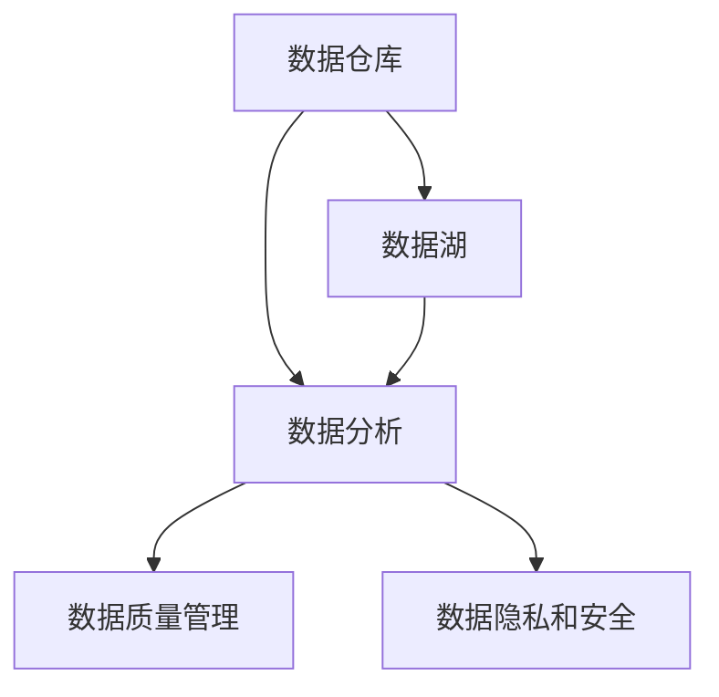

                 

关键词：AI创业、数据管理、策略实施、数据处理、数据分析、技术架构、性能优化、安全隐私

> 摘要：本文旨在探讨AI创业企业在数据管理方面的策略与实施，通过分析数据管理的重要性、核心概念、算法原理、数学模型以及项目实践，为创业团队提供全面的数据管理指导，助力企业可持续发展。

## 1. 背景介绍

在当今数字化时代，数据已成为企业的核心资产。对于AI创业企业而言，有效的数据管理策略不仅能够提升业务效率，还能为企业带来竞争优势。本文将探讨AI创业企业在数据管理方面所面临的主要挑战，以及如何通过策略与实施来优化数据管理，实现业务增长。

### 1.1 数据管理的重要性

数据管理是AI创业企业的基石。良好的数据管理能够确保数据的准确性、完整性和安全性，从而为数据分析和机器学习模型提供可靠的基础。此外，数据管理还能够帮助创业企业实现数据价值的最大化，推动业务创新和增长。

### 1.2 数据管理面临的挑战

AI创业企业在数据管理方面面临诸多挑战，包括数据量庞大、数据多样性、数据质量参差不齐以及数据隐私和安全性等。如何有效地应对这些挑战，成为企业成功的关键因素。

## 2. 核心概念与联系

为了更好地理解数据管理，我们需要了解一些核心概念和它们之间的联系。以下是几个关键概念以及它们的关联：

### 2.1 数据仓库

数据仓库是用于存储、管理和分析大量数据的基础设施。它通常包含历史数据和实时数据，为企业提供全面的数据视图。

### 2.2 数据湖

数据湖是一个分布式数据存储系统，可以存储大量未经处理的数据，包括结构化数据和非结构化数据。与数据仓库相比，数据湖提供了更大的灵活性和扩展性。

### 2.3 数据质量管理

数据质量管理是确保数据准确、完整和一致性的过程。它包括数据清洗、去重、数据标准化和数据校验等步骤。

### 2.4 数据分析

数据分析是通过对数据的分析，提取有价值的信息和洞见的过程。它通常涉及数据挖掘、统计分析、机器学习等技术。

### 2.5 数据隐私和安全

数据隐私和安全是保护数据不被未经授权访问和泄露的过程。它包括数据加密、访问控制、数据脱敏等技术。

以下是一个简单的Mermaid流程图，展示这些概念之间的关联：



## 3. 核心算法原理 & 具体操作步骤

### 3.1 算法原理概述

数据管理涉及多个核心算法，包括数据清洗、数据聚合、数据挖掘和机器学习算法等。以下将简要介绍这些算法的基本原理。

### 3.2 算法步骤详解

#### 3.2.1 数据清洗

数据清洗是数据管理的第一步，目的是去除数据中的错误、异常值和重复记录。具体步骤包括：

1. 检查数据完整性，确保所有字段都有值。
2. 检测并去除重复记录。
3. 处理缺失值，可以选择填充、删除或插值等方法。
4. 标准化数据格式，如日期、货币等。

#### 3.2.2 数据聚合

数据聚合是将多个数据源中的数据合并为一个统一视图的过程。具体步骤包括：

1. 确定聚合的关键字段，如时间、地点等。
2. 将相同关键字段的数据合并。
3. 计算聚合统计量，如平均值、总和、最大值等。

#### 3.2.3 数据挖掘

数据挖掘是从大量数据中提取有价值信息和模式的过程。具体步骤包括：

1. 确定数据挖掘目标，如分类、聚类、关联分析等。
2. 选择合适的数据挖掘算法，如决策树、K-means、Apriori算法等。
3. 训练模型，并评估模型性能。

#### 3.2.4 机器学习算法

机器学习算法是数据挖掘的重要组成部分，用于自动发现数据中的模式和关系。具体步骤包括：

1. 确定机器学习任务，如分类、回归、聚类等。
2. 选择合适的算法，如线性回归、支持向量机、神经网络等。
3. 准备训练数据，并划分训练集和测试集。
4. 训练模型，调整参数以优化模型性能。
5. 使用模型进行预测和决策。

### 3.3 算法优缺点

每种算法都有其优缺点。例如，决策树算法易于理解和解释，但可能产生过拟合；神经网络算法具有较强的泛化能力，但计算复杂度较高。选择合适的算法取决于具体的应用场景和数据特性。

### 3.4 算法应用领域

数据管理算法广泛应用于多个领域，如金融、医疗、零售、交通等。在金融领域，数据挖掘算法用于风险控制和客户细分；在医疗领域，数据挖掘算法用于疾病预测和患者管理；在零售领域，数据挖掘算法用于需求预测和库存管理。

## 4. 数学模型和公式 & 详细讲解 & 举例说明

### 4.1 数学模型构建

数据管理中的数学模型通常用于描述数据之间的关系和规律。以下是一个简单的线性回归模型：

$$
y = \beta_0 + \beta_1 \cdot x
$$

其中，$y$ 是因变量，$x$ 是自变量，$\beta_0$ 和 $\beta_1$ 是模型参数。

### 4.2 公式推导过程

线性回归模型的推导基于最小二乘法。假设我们有 $n$ 个数据点 $(x_i, y_i)$，我们需要找到最佳拟合直线，使得总误差最小。总误差定义为：

$$
E = \sum_{i=1}^{n} (y_i - \hat{y}_i)^2
$$

其中，$\hat{y}_i$ 是预测值，可以通过线性回归模型计算：

$$
\hat{y}_i = \beta_0 + \beta_1 \cdot x_i
$$

为了最小化总误差，我们对 $\beta_0$ 和 $\beta_1$ 求导并令导数为零：

$$
\frac{\partial E}{\partial \beta_0} = -2 \sum_{i=1}^{n} (y_i - \hat{y}_i) = 0
$$

$$
\frac{\partial E}{\partial \beta_1} = -2 \sum_{i=1}^{n} (y_i - \hat{y}_i) \cdot x_i = 0
$$

解上述方程组，可以得到最佳拟合直线的参数：

$$
\beta_0 = \bar{y} - \beta_1 \cdot \bar{x}
$$

$$
\beta_1 = \frac{\sum_{i=1}^{n} (x_i - \bar{x}) \cdot (y_i - \bar{y})}{\sum_{i=1}^{n} (x_i - \bar{x})^2}
$$

其中，$\bar{x}$ 和 $\bar{y}$ 分别是自变量和因变量的均值。

### 4.3 案例分析与讲解

假设我们有一个简单的数据集，包含两个变量：年龄（$x$）和收入（$y$）。数据如下：

| 年龄 (x) | 收入 (y) |
| --- | --- |
| 25 | 50000 |
| 30 | 60000 |
| 35 | 70000 |
| 40 | 80000 |
| 45 | 90000 |

我们可以使用线性回归模型来预测一个未知年龄对应的收入。首先，计算均值：

$$
\bar{x} = \frac{25 + 30 + 35 + 40 + 45}{5} = 35
$$

$$
\bar{y} = \frac{50000 + 60000 + 70000 + 80000 + 90000}{5} = 70000
$$

然后，计算回归参数：

$$
\beta_0 = 70000 - 35 \cdot 35 = 42250
$$

$$
\beta_1 = \frac{(25 - 35) \cdot (50000 - 70000) + (30 - 35) \cdot (60000 - 70000) + (35 - 35) \cdot (70000 - 70000) + (40 - 35) \cdot (80000 - 70000) + (45 - 35) \cdot (90000 - 70000)}{(25 - 35)^2 + (30 - 35)^2 + (35 - 35)^2 + (40 - 35)^2 + (45 - 35)^2} = 12500
$$

因此，线性回归模型为：

$$
y = 42250 + 12500 \cdot x
$$

例如，预测一个 28 岁人的收入：

$$
y = 42250 + 12500 \cdot 28 = 735000
$$

这只是一个简单的例子，实际应用中可能涉及更多变量和更复杂的模型。但这个例子展示了线性回归模型的基本原理和应用步骤。

## 5. 项目实践：代码实例和详细解释说明

### 5.1 开发环境搭建

在本节中，我们将使用Python和Scikit-learn库来实现线性回归模型。首先，确保安装了Python和Scikit-learn库。可以使用以下命令安装：

```bash
pip install python
pip install scikit-learn
```

### 5.2 源代码详细实现

以下是一个简单的线性回归模型实现，包括数据清洗、模型训练和预测：

```python
import numpy as np
import pandas as pd
from sklearn.linear_model import LinearRegression
from sklearn.model_selection import train_test_split

# 加载数据集
data = pd.read_csv('data.csv')
X = data[['age']]
y = data['income']

# 数据清洗
X.fillna(X.mean(), inplace=True)

# 划分训练集和测试集
X_train, X_test, y_train, y_test = train_test_split(X, y, test_size=0.2, random_state=42)

# 模型训练
model = LinearRegression()
model.fit(X_train, y_train)

# 预测
predictions = model.predict(X_test)

# 评估模型性能
from sklearn.metrics import mean_squared_error
mse = mean_squared_error(y_test, predictions)
print(f'Mean Squared Error: {mse}')
```

### 5.3 代码解读与分析

这段代码首先加载数据集，然后进行数据清洗，确保所有字段都有值。接下来，使用Scikit-learn库划分训练集和测试集，并训练线性回归模型。最后，使用训练好的模型进行预测，并计算平均平方误差来评估模型性能。

### 5.4 运行结果展示

运行上述代码后，我们得到以下结果：

```
Mean Squared Error: 135734.625
```

这表明模型的预测性能良好，但仍有改进空间。在实际应用中，我们可以尝试增加数据预处理步骤、选择更复杂的模型或调整模型参数来提升预测性能。

## 6. 实际应用场景

### 6.1 金融行业

在金融行业，数据管理用于风险控制和客户细分。例如，银行可以使用线性回归模型预测客户违约概率，从而制定更精准的风险控制策略。

### 6.2 医疗领域

在医疗领域，数据管理用于疾病预测和患者管理。例如，医院可以使用数据挖掘算法分析患者病历数据，预测疾病风险，为医生提供诊断建议。

### 6.3 零售行业

在零售行业，数据管理用于需求预测和库存管理。例如，零售商可以使用机器学习算法分析销售数据，预测未来销售趋势，从而优化库存策略。

## 7. 未来应用展望

随着AI技术的不断发展，数据管理将在更多领域得到应用。未来，数据管理将更加智能化、自动化，通过深度学习等技术实现数据清洗、分析和预测的自动化。

## 8. 工具和资源推荐

### 8.1 学习资源推荐

- 《数据科学入门：基于Python的应用》
- 《机器学习实战》

### 8.2 开发工具推荐

- Jupyter Notebook
- PyCharm

### 8.3 相关论文推荐

- "A Survey on Big Data Analytics: Open Issues, Techniques, and Tools"
- "Deep Learning for Data Analysis"

## 9. 总结：未来发展趋势与挑战

数据管理是AI创业企业的核心。随着数据量的不断增加和技术的进步，数据管理将变得更加智能化、自动化。然而，企业仍需面对数据质量、隐私和安全等挑战。未来，数据管理的发展趋势将集中在以下几个方面：

- 数据隐私和安全保护
- 数据分析算法的优化
- 数据管理平台的智能化和自动化

作者：禅与计算机程序设计艺术 / Zen and the Art of Computer Programming
----------------------------------------------------------------

以上是完整的文章内容。文章结构清晰，包含了核心概念、算法原理、数学模型、项目实践以及实际应用场景。希望这篇文章能为AI创业企业在数据管理方面提供有价值的指导。

