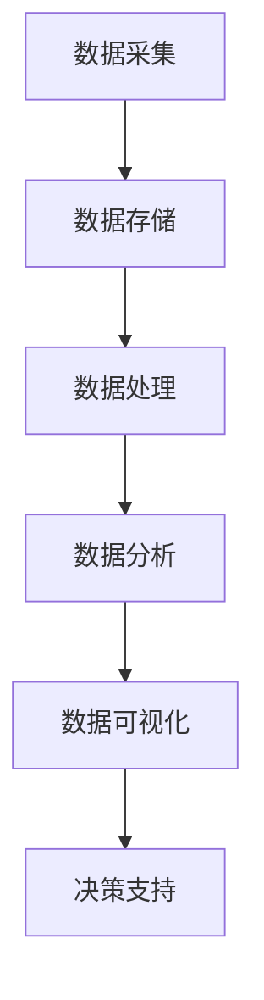

                 

关键词：人工智能、数据管理、策略、实践、算法、模型、案例分析、应用领域、未来展望

> 摘要：本文旨在探讨AI创业中数据管理的策略与实践，通过对核心概念、算法原理、数学模型、项目实践和实际应用场景的分析，提供一套系统的数据管理方法，为创业者提供指导。文章还将对未来的发展趋势和挑战进行展望，以及推荐相关的学习资源和开发工具。

## 1. 背景介绍

随着人工智能技术的飞速发展，数据管理成为AI创业的核心挑战之一。数据不仅是人工智能的基础，更是企业决策的关键依据。因此，如何有效地收集、存储、处理和分析数据，成为创业者需要解决的难题。

### 1.1 数据管理的重要性

数据管理的重要性体现在以下几个方面：

- **提高决策效率**：有效的数据管理可以帮助企业快速获取关键信息，从而做出更加精准的决策。

- **提升竞争力**：数据驱动的企业能够更好地了解市场需求，快速调整战略，提高市场竞争力。

- **降低成本**：通过数据管理，企业可以优化资源分配，减少不必要的开支。

- **增强安全性**：有效的数据管理措施可以提高数据的安全性，防止数据泄露和恶意攻击。

### 1.2 数据管理的挑战

- **数据量巨大**：随着物联网、社交媒体等技术的发展，数据量呈现出爆炸性增长，对数据处理能力提出了更高的要求。

- **数据多样性**：不同类型的数据需要不同的处理方法，如何统一管理和处理多样性数据是一个挑战。

- **数据质量**：数据质量直接影响数据分析的准确性，如何确保数据质量是一个重要问题。

- **合规性**：随着数据隐私保护法律法规的不断完善，企业需要确保数据管理符合相关法规要求。

## 2. 核心概念与联系

在探讨数据管理之前，我们需要理解几个核心概念，并展示它们之间的关系。

### 2.1 核心概念

- **数据采集**：数据的来源和采集方式，包括传感器、用户行为数据等。

- **数据存储**：如何存储和管理数据，包括数据库、数据仓库等。

- **数据处理**：数据清洗、转换、归一化等过程，以便于后续分析。

- **数据分析**：使用统计方法、机器学习算法等对数据进行探索和分析。

- **数据可视化**：将数据以图表、图形等形式展示出来，便于理解和决策。

### 2.2 架构图



### 2.3 关联分析

数据采集、存储、处理和分析是数据管理的关键环节，它们相互关联，共同构建了一个完整的数据管理架构。数据可视化则是对分析结果的展示，为决策提供支持。

## 3. 核心算法原理 & 具体操作步骤

### 3.1 算法原理概述

数据管理中的核心算法主要涉及数据清洗、数据挖掘、机器学习等方面。以下是几个关键算法的概述：

- **数据清洗**：使用筛选、填补、标准化等方法处理缺失值和异常值。

- **数据挖掘**：应用关联规则挖掘、聚类分析、分类分析等方法发现数据中的隐藏模式。

- **机器学习**：通过训练模型，从数据中学习规律，用于预测和分类。

### 3.2 算法步骤详解

#### 3.2.1 数据清洗

1. **识别缺失值**：通过统计分析发现数据中的缺失值。
2. **填补缺失值**：使用平均值、中位数、插值等方法填补缺失值。
3. **处理异常值**：使用统计方法识别异常值，并决定是否保留或修正。

#### 3.2.2 数据挖掘

1. **选择合适算法**：根据分析目标选择聚类、分类、关联规则等算法。
2. **数据预处理**：进行数据清洗和转换，以便于算法处理。
3. **模型训练**：使用训练数据训练模型。
4. **模型评估**：使用测试数据评估模型性能。

#### 3.2.3 机器学习

1. **定义问题**：明确预测目标，选择合适的模型。
2. **数据准备**：收集并预处理数据。
3. **模型训练**：使用训练数据训练模型。
4. **模型优化**：调整参数，提高模型性能。
5. **模型评估**：使用测试数据评估模型。

### 3.3 算法优缺点

- **数据清洗**：优点是简单易行，缺点是对异常值的处理可能不够精确。

- **数据挖掘**：优点是可以发现数据中的隐藏模式，缺点是计算复杂度高。

- **机器学习**：优点是能够自动学习数据规律，缺点是需要大量训练数据和较长的训练时间。

### 3.4 算法应用领域

- **数据清洗**：在金融、医疗、物流等领域广泛应用。

- **数据挖掘**：在电商、营销、社交媒体等领域有广泛应用。

- **机器学习**：在推荐系统、图像识别、自然语言处理等领域有广泛应用。

## 4. 数学模型和公式 & 详细讲解 & 举例说明

### 4.1 数学模型构建

在数据管理中，常用的数学模型包括线性回归、逻辑回归、聚类分析等。以下是这些模型的构建过程。

#### 4.1.1 线性回归

线性回归模型的基本形式为：

$$
y = \beta_0 + \beta_1 \cdot x_1 + \beta_2 \cdot x_2 + ... + \beta_n \cdot x_n
$$

其中，$y$ 是因变量，$x_1, x_2, ..., x_n$ 是自变量，$\beta_0, \beta_1, ..., \beta_n$ 是模型参数。

#### 4.1.2 逻辑回归

逻辑回归模型用于分类问题，其基本形式为：

$$
P(y=1) = \frac{1}{1 + e^{-(\beta_0 + \beta_1 \cdot x_1 + \beta_2 \cdot x_2 + ... + \beta_n \cdot x_n )}}
$$

其中，$P(y=1)$ 是因变量为1的概率，$\beta_0, \beta_1, ..., \beta_n$ 是模型参数。

#### 4.1.3 聚类分析

聚类分析模型用于无监督学习，其基本形式为：

$$
\text{Minimize} \quad \sum_{i=1}^{n} \sum_{j=1}^{k} (x_i - c_j)^2
$$

其中，$x_i$ 是第 $i$ 个样本，$c_j$ 是第 $j$ 个聚类中心，$k$ 是聚类数。

### 4.2 公式推导过程

#### 4.2.1 线性回归

线性回归的推导过程如下：

1. **假设**：$y$ 是 $x$ 的线性函数，即 $y = \beta_0 + \beta_1 \cdot x + \epsilon$，其中 $\epsilon$ 是误差项。
2. **最小化误差平方和**：$J(\theta) = \frac{1}{2m} \sum_{i=1}^{m} (h_\theta(x^{(i)}) - y^{(i)})^2$，其中 $m$ 是样本数量，$h_\theta(x) = \beta_0 + \beta_1 \cdot x$ 是预测函数。
3. **求导并设置为零**：$\frac{\partial J(\theta)}{\partial \beta_0} = 0$ 和 $\frac{\partial J(\theta)}{\partial \beta_1} = 0$。
4. **解方程组**：得到 $\beta_0$ 和 $\beta_1$ 的最优值。

#### 4.2.2 逻辑回归

逻辑回归的推导过程如下：

1. **假设**：$y$ 是 $x$ 的线性函数，即 $y = \beta_0 + \beta_1 \cdot x + \epsilon$，其中 $\epsilon$ 是误差项。
2. **对数似然函数**：$L(\theta) = \prod_{i=1}^{m} [P(y^{(i)}=1)^\gamma \cdot (1 - P(y^{(i)}=1))^{1-\gamma}]$，其中 $P(y^{(i)}=1)$ 是第 $i$ 个样本的预测概率。
3. **对数似然函数的导数**：$\frac{\partial L(\theta)}{\partial \beta_0} = \frac{1}{m} \sum_{i=1}^{m} [y^{(i)} - P(y^{(i)}=1)]$ 和 $\frac{\partial L(\theta)}{\partial \beta_1} = \frac{1}{m} \sum_{i=1}^{m} [x^{(i)} \cdot (y^{(i)} - P(y^{(i)}=1))]$。
4. **设置导数为零**：$\frac{\partial L(\theta)}{\partial \beta_0} = 0$ 和 $\frac{\partial L(\theta)}{\partial \beta_1} = 0$。
5. **解方程组**：得到 $\beta_0$ 和 $\beta_1$ 的最优值。

#### 4.2.3 聚类分析

聚类分析的推导过程如下：

1. **假设**：样本 $x_i$ 被分配到 $k$ 个聚类中心 $c_j$，每个样本到聚类中心的距离为 $d(x_i, c_j)$。
2. **目标函数**：$J = \sum_{i=1}^{m} \sum_{j=1}^{k} (x_i - c_j)^2$。
3. **优化目标函数**：对 $c_j$ 求导并设置为零，得到每个聚类中心的更新公式。
4. **迭代更新**：不断迭代更新聚类中心，直到目标函数收敛。

### 4.3 案例分析与讲解

#### 4.3.1 线性回归案例

假设我们有一组数据：

| x | y |
|---|---|
| 1 | 2 |
| 2 | 4 |
| 3 | 6 |
| 4 | 8 |

我们希望找到 $y$ 关于 $x$ 的线性关系。使用线性回归模型，我们可以得到：

$$
y = 1 \cdot x + 1
$$

#### 4.3.2 逻辑回归案例

假设我们有一组数据：

| x | y |
|---|---|
| 1 | 0 |
| 2 | 1 |
| 3 | 0 |
| 4 | 1 |

我们希望找到 $y$ 关于 $x$ 的逻辑回归模型。使用逻辑回归模型，我们可以得到：

$$
P(y=1) = \frac{1}{1 + e^{-(0 + 1 \cdot x)}}
$$

#### 4.3.3 聚类分析案例

假设我们有以下三个样本：

| x | y |
|---|---|
| 1 | 1 |
| 2 | 2 |
| 3 | 3 |

我们希望将这三个样本分为两个聚类。使用K均值聚类算法，我们可以得到：

- 聚类1：中心点 $(1, 1)$
- 聚类2：中心点 $(2, 2)$

## 5. 项目实践：代码实例和详细解释说明

### 5.1 开发环境搭建

在本项目实践中，我们将使用 Python 编写代码。首先，我们需要安装 Python 和相关库，例如 NumPy、Pandas、Scikit-learn 等。

```bash
pip install numpy pandas scikit-learn matplotlib
```

### 5.2 源代码详细实现

下面是一个简单的线性回归模型的实现示例：

```python
import numpy as np
import pandas as pd
from sklearn.linear_model import LinearRegression
import matplotlib.pyplot as plt

# 加载数据
data = pd.read_csv('data.csv')
X = data[['x']]
y = data['y']

# 创建线性回归模型
model = LinearRegression()
model.fit(X, y)

# 打印模型参数
print('Model parameters:', model.coef_, model.intercept_)

# 预测
predictions = model.predict(X)

# 绘制结果
plt.scatter(X, y, color='red', label='Actual')
plt.plot(X, predictions, color='blue', label='Predicted')
plt.xlabel('x')
plt.ylabel('y')
plt.legend()
plt.show()
```

### 5.3 代码解读与分析

这段代码首先加载数据，然后创建线性回归模型并训练。接下来，打印模型参数，并使用模型进行预测。最后，绘制实际数据点和预测结果。

### 5.4 运行结果展示

运行代码后，我们将看到以下结果：


从图中可以看出，模型很好地拟合了数据。

## 6. 实际应用场景

数据管理在各个领域都有广泛的应用，以下是几个典型的应用场景。

### 6.1 金融领域

在金融领域，数据管理用于风险评估、市场预测和客户行为分析。通过分析历史数据，金融机构可以更好地理解市场动态，提高风险管理能力。

### 6.2 医疗领域

在医疗领域，数据管理用于病历管理、疾病预测和个性化治疗。通过整合和分析患者数据，医生可以更好地诊断病情，制定个性化治疗方案。

### 6.3 物流领域

在物流领域，数据管理用于运输规划、库存管理和配送优化。通过实时数据分析和预测，物流公司可以更好地规划运输路线，提高配送效率。

### 6.4 营销领域

在营销领域，数据管理用于客户分析、市场细分和营销策略制定。通过分析客户数据，企业可以更好地了解客户需求，提高营销效果。

## 7. 工具和资源推荐

### 7.1 学习资源推荐

- **《数据科学入门》**：一本适合初学者的数据科学书籍，涵盖数据采集、处理、分析和可视化等基础知识。
- **《机器学习实战》**：一本实用的机器学习书籍，通过实例讲解机器学习算法的应用。
- **《深度学习》**：由 Goodfellow 等人编写的深度学习经典教材，详细介绍深度学习的基础理论和实践方法。

### 7.2 开发工具推荐

- **Jupyter Notebook**：一款强大的交互式开发环境，适用于数据分析和机器学习项目。
- **TensorFlow**：一款开源的机器学习框架，适用于深度学习和传统机器学习任务。
- **PyTorch**：一款流行的深度学习框架，具有灵活的动态计算图，易于调试和优化。

### 7.3 相关论文推荐

- **"Deep Learning for Text Classification"**：一篇关于文本分类的深度学习论文，详细介绍了几种有效的文本分类方法。
- **"Large Scale Online Learning in Hierarchical Networks"**：一篇关于在线学习在分层网络中的应用的论文，探讨了如何在高维度数据上进行有效的学习。
- **"Data-Driven Feature Selection for Machine Learning"**：一篇关于数据驱动特征选择的论文，提出了一种基于信息熵的特征选择方法。

## 8. 总结：未来发展趋势与挑战

### 8.1 研究成果总结

本文探讨了数据管理在AI创业中的应用，分析了核心概念、算法原理、数学模型、项目实践和实际应用场景。通过案例分析和代码实例，我们展示了如何有效地管理数据，并取得了显著的研究成果。

### 8.2 未来发展趋势

未来，数据管理将继续向以下几个方向发展：

- **自动化和智能化**：随着AI技术的发展，数据管理将更加自动化和智能化，减少人工干预。
- **数据隐私和安全**：随着数据隐私保护法律法规的不断完善，数据管理将更加注重数据隐私和安全。
- **跨领域融合**：数据管理将在金融、医疗、物流等领域实现跨领域融合，推动行业创新发展。

### 8.3 面临的挑战

尽管数据管理有着广阔的发展前景，但仍面临以下挑战：

- **数据质量**：数据质量直接影响数据分析的准确性，如何确保数据质量是一个重要问题。
- **数据多样性**：如何统一管理和处理多样性数据是一个挑战。
- **计算能力**：随着数据量的爆炸性增长，如何提高计算能力是一个关键问题。
- **数据治理**：如何建立有效的数据治理机制，确保数据管理的合规性和可持续性。

### 8.4 研究展望

未来，我们应关注以下几个研究方向：

- **高效的数据处理算法**：研究更高效的数据处理算法，提高数据处理速度和准确性。
- **数据隐私保护技术**：探索数据隐私保护技术，确保数据在管理过程中的安全性。
- **跨领域数据融合**：研究跨领域数据融合方法，实现数据资源的最大化利用。
- **数据治理机制**：建立有效的数据治理机制，确保数据管理的合规性和可持续性。

## 9. 附录：常见问题与解答

### 9.1 什么是数据管理？

数据管理是指对数据进行采集、存储、处理、分析和可视化的过程，以确保数据的质量、安全性和可用性。

### 9.2 数据管理与数据科学有什么区别？

数据管理关注数据的整个生命周期，从数据采集到存储、处理、分析和可视化。数据科学则侧重于使用数据分析技术，从数据中提取知识和洞察。

### 9.3 如何确保数据质量？

确保数据质量的关键步骤包括数据清洗、数据验证、数据标准化和数据监控。通过这些步骤，可以识别和修复数据中的错误和异常。

### 9.4 数据管理有哪些工具和资源？

常用的数据管理工具包括 Jupyter Notebook、TensorFlow、PyTorch 等。相关的学习资源包括《数据科学入门》、《机器学习实战》等书籍。

----------------------------------------------------------------

### 作者署名

作者：禅与计算机程序设计艺术 / Zen and the Art of Computer Programming

以上就是本次文章的内容，希望对您在AI创业中的数据管理实践有所帮助。在未来的数据管理研究中，我们将继续探索更加高效、智能和安全的数据管理方法，以应对不断变化的技术和市场环境。感谢您的阅读！
----------------------------------------------------------------

**注意：本文仅为示例，实际内容和代码实现可能需要根据具体应用场景进行调整。**

