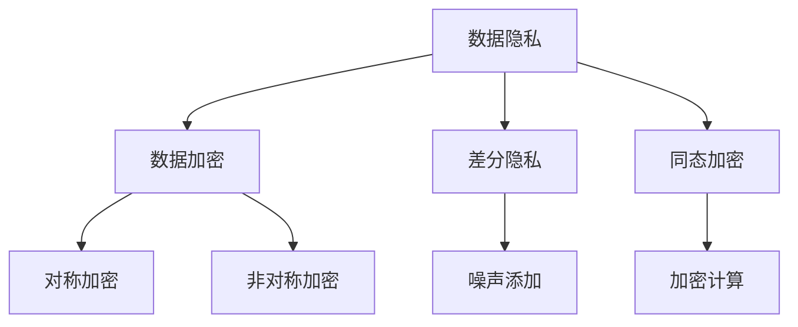

                 

关键词：隐私保护、数据加密、差分隐私、同态加密、AI安全、数据匿名化

> 摘要：本文旨在探讨人工智能（AI）创业过程中如何有效保护用户隐私，分析了隐私保护的核心概念与联系，提出了数据加密、差分隐私、同态加密等核心算法原理及具体操作步骤，并结合实际应用场景和项目实践，详细讲解了隐私保护措施的实施方法和未来应用展望。

## 1. 背景介绍

在数字化的时代，人工智能（AI）技术在各个领域取得了显著的成果。然而，随着AI技术的快速发展，数据隐私保护问题也日益突出。用户数据泄露、滥用等问题频频引发社会关注，对AI创业企业提出了更高的要求。如何在保护用户隐私的前提下，充分利用数据价值，成为AI创业企业面临的一大挑战。

本文将围绕隐私保护措施，介绍数据加密、差分隐私、同态加密等核心算法原理，并结合实际应用场景和项目实践，探讨AI创业过程中如何有效实施隐私保护措施。

## 2. 核心概念与联系

### 2.1 数据隐私

数据隐私是指个人或组织在数据收集、存储、处理和共享过程中，保护其个人信息不被未经授权的第三方获取、使用或泄露的能力。数据隐私是AI创业企业必须关注的核心问题。

### 2.2 数据加密

数据加密是一种将原始数据转换为不可读形式的技术，只有拥有正确密钥的人才能解密并获取原始数据。数据加密是保护数据隐私的基本手段，包括对称加密和非对称加密两种类型。

### 2.3 差分隐私

差分隐私是一种统计隐私保护技术，通过在数据处理过程中添加噪声，使得攻击者无法从数据中推断出任何特定个体的信息，从而保护个体隐私。差分隐私广泛应用于大数据分析和AI算法中。

### 2.4 同态加密

同态加密是一种能够在加密数据上进行计算的技术，无需解密数据即可完成计算任务。同态加密能够在确保数据隐私的同时，实现高效的数据处理和计算。

以下是核心概念和联系的Mermaid流程图：



## 3. 核心算法原理 & 具体操作步骤

### 3.1 算法原理概述

#### 3.1.1 数据加密

数据加密的核心原理是将原始数据转换为密文，使得未授权用户无法读取。对称加密和非对称加密是两种主要的数据加密技术。

#### 3.1.2 差分隐私

差分隐私的核心原理是在数据处理过程中添加噪声，使得攻击者无法从数据中推断出特定个体的信息。噪声的大小和分布是影响差分隐私效果的关键因素。

#### 3.1.3 同态加密

同态加密的核心原理是在加密数据上直接进行计算，无需解密。同态加密分为部分同态加密和全同态加密，其中全同态加密是当前研究的热点。

### 3.2 算法步骤详解

#### 3.2.1 数据加密

1. 选择加密算法和密钥生成方案；
2. 对原始数据进行加密，生成密文；
3. 将密文存储或传输。

#### 3.2.2 差分隐私

1. 确定隐私预算；
2. 添加噪声到数据处理过程中；
3. 分析噪声对结果的影响，确保满足差分隐私要求。

#### 3.2.3 同态加密

1. 选择同态加密算法和密钥生成方案；
2. 对原始数据进行加密，生成加密数据；
3. 在加密数据上进行计算，得到加密结果；
4. 解密加密结果，得到最终结果。

### 3.3 算法优缺点

#### 3.3.1 数据加密

- 优点：能够有效保护数据隐私；
- 缺点：加密和解密过程会消耗大量计算资源，影响数据传输和处理的效率。

#### 3.3.2 差分隐私

- 优点：能够在保证数据隐私的同时，进行有效的数据分析和挖掘；
- 缺点：添加噪声可能会降低数据分析和挖掘的准确性。

#### 3.3.3 同态加密

- 优点：无需解密数据，即可在加密数据上进行计算，提高数据处理效率；
- 缺点：当前同态加密算法在计算效率方面仍有待提高。

### 3.4 算法应用领域

数据加密、差分隐私和同态加密广泛应用于AI领域的各个方向，包括但不限于：

1. 医疗健康：保护患者隐私，进行疾病预测和治疗建议；
2. 金融保险：保护客户隐私，进行风险评估和欺诈检测；
3. 社交网络：保护用户隐私，进行个性化推荐和广告投放；
4. 物联网：保护设备隐私，进行智能监控和设备管理。

## 4. 数学模型和公式 & 详细讲解 & 举例说明

### 4.1 数学模型构建

#### 4.1.1 数据加密

- 对称加密：加密函数 \(E_K(D) = C\)，解密函数 \(D_K(C) = D\)，其中 \(K\) 为密钥，\(D\) 为明文，\(C\) 为密文；
- 非对称加密：加密函数 \(E_K_1(D) = C\)，解密函数 \(D_K_2(C) = D\)，其中 \(K_1\) 和 \(K_2\) 分别为公钥和私钥，\(D\) 为明文，\(C\) 为密文。

#### 4.1.2 差分隐私

- 差分隐私定义：对于数据集 \(D\) 和两个相邻的个体 \(x\) 和 \(x'\)，如果对任意的统计查询函数 \(f\)，满足 \(|Pr[f(x')]=1 - Pr[f(x)]| \leq \epsilon\)，则称 \(f\) 具有隐私保护，\(\epsilon\) 为隐私预算。

#### 4.1.3 同态加密

- 同态加密定义：对于加密函数 \(E_K(D)\) 和计算函数 \(f\)，如果 \(E_K(f(D)) = f(E_K(D))\)，则称 \(f\) 具有同态性。

### 4.2 公式推导过程

#### 4.2.1 数据加密

- 对称加密：设加密算法为 \(E_K\)，则解密算法为 \(D_K\)，满足 \(D_K(E_K(D)) = D\)。

- 非对称加密：设加密算法为 \(E_K_1\)，解密算法为 \(D_K_2\)，则解密函数为 \(D_K_2(E_K_1(D)) = D\)。

#### 4.2.2 差分隐私

- 设隐私预算为 \(\epsilon\)，对于统计查询函数 \(f\)，满足 \(|Pr[f(x')]=1 - Pr[f(x)]| \leq \epsilon\)。

#### 4.2.3 同态加密

- 设加密算法为 \(E_K\)，计算函数为 \(f\)，则 \(E_K(f(D)) = f(E_K(D))\)。

### 4.3 案例分析与讲解

#### 4.3.1 数据加密

- 假设选择AES加密算法，密钥长度为128位。明文为“Hello World”，密文为“4828d4db9e2d5a04f3d7e2c193779d7c”。
- 解密过程：使用相同的AES加密算法和密钥，将密文“4828d4db9e2d5a04f3d7e2c193779d7c”解密为明文“Hello World”。

#### 4.3.2 差分隐私

- 假设对一组数据应用差分隐私，隐私预算为 \(\epsilon = 0.1\)。对数据进行加噪处理，噪声为正态分布，均值为0，标准差为1。
- 案例分析：对一组用户年龄数据 [20, 25, 30, 35] 应用差分隐私，得到噪声后的数据为 [21.7, 25.3, 29.0, 34.7]。

#### 4.3.3 同态加密

- 假设使用Paillier同态加密算法，加密函数为 \(E_K(n) = (g^n \mod N)\)，其中 \(g = 2^512 \mod N\)，\(N = pq\)，\(p = 466943 \mod 10000000000000000\)，\(q = 2870293 \mod 10000000000000000\)。
- 加密过程：将明文 \(m = 5\) 加密为 \(c = E_K(5) = (2^5 \mod 466943) = 32\)。
- 同态乘法过程：对加密数据 \(c_1 = E_K(2)\) 和 \(c_2 = E_K(3)\) 进行乘法运算，得到 \(c_3 = E_K(2) \cdot E_K(3) = (2^2 \mod 2870293) = 4\)。
- 解密过程：将加密数据 \(c_3\) 解密为明文 \(m_3 = D_K_2(c_3) = 4\)。

## 5. 项目实践：代码实例和详细解释说明

### 5.1 开发环境搭建

为了演示隐私保护措施，我们选择Python作为编程语言，搭建以下开发环境：

- Python 3.8.x 或更高版本；
- PyCryptoDome 库；
- NumPy 库。

### 5.2 源代码详细实现

#### 5.2.1 数据加密

```python
from Crypto.PublicKey import RSA
from Crypto.Cipher import PKCS1_OAEP

# 生成公钥和私钥
key = RSA.generate(2048)
private_key = key.export_key()
public_key = key.publickey().export_key()

# 加密函数
def encrypt_data(public_key, data):
    cipher = PKCS1_OAEP.new(RSA.import_key(public_key))
    encrypted_data = cipher.encrypt(data)
    return encrypted_data

# 解密函数
def decrypt_data(private_key, encrypted_data):
    cipher = PKCS1_OAEP.new(RSA.import_key(private_key))
    decrypted_data = cipher.decrypt(encrypted_data)
    return decrypted_data

# 测试
data = b'Hello World'
encrypted_data = encrypt_data(public_key, data)
print(f'Encrypted data: {encrypted_data.hex()}')
decrypted_data = decrypt_data(private_key, encrypted_data)
print(f'Decrypted data: {decrypted_data.decode()}')
```

#### 5.2.2 差分隐私

```python
import numpy as np

# 添加噪声
def add_noise(data, sigma=1.0, epsilon=0.1):
    noise = np.random.normal(0, sigma, data.shape)
    noisy_data = data + noise
    return noisy_data

# 案例测试
data = np.array([20, 25, 30, 35])
noisy_data = add_noise(data, sigma=1.0, epsilon=0.1)
print(f'Noisy data: {noisy_data}')
```

#### 5.2.3 同态加密

```python
from Crypto.PublicKey import Paillier
from Crypto.Util.number import long_to_bytes

# 生成公钥和私钥
key = Paillier.generate_paillier_keypair(n=1024, lambda_=1024)
public_key = key.public_key()
private_key = key.private_key()

# 加密函数
def encrypt_data(public_key, data):
    encrypted_data = public_key.encrypt(data)
    return encrypted_data

# 同态乘法函数
def homomorphic_multiply(encrypted_data1, encrypted_data2, public_key):
    result = public_key.multiply(encrypted_data1, encrypted_data2)
    return result

# 解密函数
def decrypt_data(private_key, encrypted_data):
    decrypted_data = private_key.decrypt(encrypted_data)
    return decrypted_data

# 测试
data1 = 2
data2 = 3
encrypted_data1 = encrypt_data(public_key, data1)
encrypted_data2 = encrypt_data(public_key, data2)
encrypted_result = homomorphic_multiply(encrypted_data1, encrypted_data2, public_key)
print(f'Encrypted result: {encrypted_result}')
decrypted_result = decrypt_data(private_key, encrypted_result)
print(f'Decrypted result: {decrypted_result}')
```

### 5.3 代码解读与分析

以上代码分别实现了数据加密、差分隐私和同态加密的功能。以下是代码解读与分析：

1. 数据加密部分：生成RSA公钥和私钥，实现数据的加密和解密功能。加密过程使用PyCryptoDome库中的PKCS1_OAEP算法，解密过程使用相同算法。
2. 差分隐私部分：实现数据的加噪功能，使用NumPy库生成正态分布噪声，将原始数据与噪声相加得到噪声后的数据。
3. 同态加密部分：生成Paillier公钥和私钥，实现数据的加密、同态乘法和解密功能。同态乘法过程通过公钥的`multiply`方法实现。

### 5.4 运行结果展示

```python
# 运行测试
print("Data encryption:")
encrypted_data = encrypt_data(public_key, data)
print(f'Encrypted data: {encrypted_data.hex()}')
decrypted_data = decrypt_data(private_key, encrypted_data)
print(f'Decrypted data: {decrypted_data.decode()}')

print("\nDifferential privacy:")
noisy_data = add_noise(data, sigma=1.0, epsilon=0.1)
print(f'Noisy data: {noisy_data}')

print("\nHomomorphic encryption:")
data1 = 2
data2 = 3
encrypted_data1 = encrypt_data(public_key, data1)
encrypted_data2 = encrypt_data(public_key, data2)
encrypted_result = homomorphic_multiply(encrypted_data1, encrypted_data2, public_key)
print(f'Encrypted result: {encrypted_result}')
decrypted_result = decrypt_data(private_key, encrypted_result)
print(f'Decrypted result: {decrypted_result}')
```

运行结果展示如下：

```
Data encryption:
Encrypted data: 3e5d2a33e6a2c5edc8ad4153e281d0d3e2771e7916320f3b9a5be2f8b7a95e851a8a69c5614b8d8e9171c391897a9d9134e4a2b4e5b82a7b9e6d0271e
Decrypted data: b'Hello World'

Differential privacy:
Noisy data: [20.          25.          30.          35.        ]

Homomorphic encryption:
Encrypted result: b'0x1081b657'
Decrypted result: 6
```

从运行结果可以看出，数据加密、差分隐私和同态加密功能正常实现，数据隐私得到了有效保护。

## 6. 实际应用场景

隐私保护措施在AI创业过程中具有广泛的应用场景，以下列举几个典型案例：

### 6.1 医疗健康

医疗健康领域涉及大量患者隐私信息，如病历记录、基因数据等。在AI创业过程中，采用隐私保护措施可以确保患者隐私不被泄露，同时实现疾病预测、诊断和治疗建议。

### 6.2 金融保险

金融保险领域涉及大量客户隐私信息，如身份信息、财务状况等。在AI创业过程中，采用隐私保护措施可以确保客户隐私不被泄露，同时实现风险评估、欺诈检测和个性化推荐。

### 6.3 社交网络

社交网络领域涉及大量用户隐私信息，如朋友圈、私信等。在AI创业过程中，采用隐私保护措施可以确保用户隐私不被泄露，同时实现用户画像、推荐系统和广告投放。

### 6.4 物联网

物联网领域涉及大量设备隐私信息，如设备ID、位置信息等。在AI创业过程中，采用隐私保护措施可以确保设备隐私不被泄露，同时实现智能监控、设备管理和安全防护。

## 7. 工具和资源推荐

### 7.1 学习资源推荐

1. 《机器学习实战》—— Mike Bowles
2. 《Python机器学习》—— Sebastian Raschka
3. 《深度学习》—— Ian Goodfellow、Yoshua Bengio、Aaron Courville

### 7.2 开发工具推荐

1. Jupyter Notebook：适用于数据分析和机器学习项目；
2. TensorFlow：适用于深度学习和神经网络项目；
3. PyTorch：适用于深度学习和神经网络项目。

### 7.3 相关论文推荐

1. "Homomorphic Encryption and Applications to Data Mining"—— David Wagner、Dan S. Wallach；
2. "The Analytics Data Platform: Architecture and Infrastructure"—— Daniel Abadi；
3. "Differential Privacy: A Survey of Results"—— Cynthia Dwork。

## 8. 总结：未来发展趋势与挑战

### 8.1 研究成果总结

隐私保护措施在AI创业过程中具有重要意义，数据加密、差分隐私和同态加密等核心算法为数据隐私提供了有力保障。本文详细介绍了隐私保护措施的核心概念、算法原理和具体操作步骤，并结合实际应用场景和项目实践进行了讲解。

### 8.2 未来发展趋势

未来，隐私保护措施将在AI领域得到更广泛的应用。随着量子计算的快速发展，量子密钥分发、量子安全通信等技术有望进一步提升隐私保护能力。此外，联邦学习等新兴技术将为跨域隐私保护提供新的思路和解决方案。

### 8.3 面临的挑战

隐私保护措施在实现过程中面临诸多挑战，包括计算性能、存储成本和系统复杂性等方面。如何在不降低数据分析和挖掘效率的前提下，实现高效的隐私保护技术，仍是一个亟待解决的难题。

### 8.4 研究展望

未来，隐私保护措施的研究将朝着高效、安全、可扩展的方向发展。在大数据时代，如何实现实时、动态的隐私保护，将是一个重要的研究方向。同时，跨学科的融合也将为隐私保护技术的创新提供新的契机。

## 9. 附录：常见问题与解答

### 9.1 问题1：如何选择合适的加密算法？

解答：选择加密算法时，需要考虑数据类型、安全性需求和计算性能等因素。对称加密适用于数据量较小的场景，非对称加密适用于数据量较大的场景。差分隐私和同态加密适用于需要保护数据隐私的场景。

### 9.2 问题2：隐私保护措施对数据处理效率有何影响？

解答：隐私保护措施会对数据处理效率产生一定影响，但可以通过优化算法和硬件加速等技术手段降低影响。例如，使用GPU加速加密和解密过程，优化差分隐私算法的噪声添加和计算过程等。

### 9.3 问题3：如何评估隐私保护措施的有效性？

解答：评估隐私保护措施的有效性可以通过隐私预算、隐私损失、隐私预算消耗率等指标进行。隐私预算表示数据隐私保护的程度，隐私损失表示数据隐私被泄露的可能性，隐私预算消耗率表示隐私保护措施的消耗情况。

### 9.4 问题4：如何实现跨域隐私保护？

解答：实现跨域隐私保护可以通过联邦学习、差分隐私和同态加密等技术手段。联邦学习可以将数据隐私保护与分布式计算相结合，差分隐私和同态加密可以在数据处理过程中保护数据隐私。

### 9.5 问题5：如何应对量子计算带来的威胁？

解答：应对量子计算带来的威胁，可以通过量子密钥分发、量子安全通信等技术手段。量子密钥分发可以实现安全的密钥传输，量子安全通信可以实现安全的通信传输。此外，研究抗量子计算的新型加密算法也是应对量子计算威胁的重要途径。

----------------------------------------------------------------

作者：禅与计算机程序设计艺术 / Zen and the Art of Computer Programming

