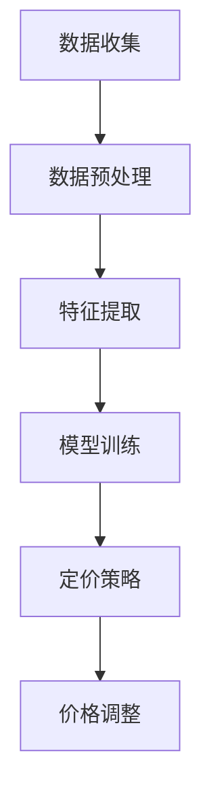

                 

关键词：AI动态定价、原理、算法、应用场景、挑战与展望

> 摘要：本文深入探讨了AI动态定价的原理、应用场景以及面临的挑战。通过阐述核心概念、算法原理、数学模型和实际案例，本文旨在为读者提供全面了解AI动态定价的视角，并对未来的发展前景进行展望。

## 1. 背景介绍

动态定价是指根据市场供需关系、消费者行为、竞争情况等因素，实时调整商品或服务的价格。随着互联网和大数据技术的快速发展，动态定价逐渐成为许多行业的重要策略。然而，传统的动态定价方法往往依赖于历史数据和市场经验，难以适应快速变化的市场环境。人工智能（AI）技术的引入，使得动态定价具备了更高的灵活性和准确性。

AI动态定价通过机器学习、深度学习等算法，对海量数据进行挖掘和分析，实现实时、智能的定价策略。这不仅提高了定价的精度和效率，还能够为企业带来更高的利润。例如，在线旅游平台通过AI动态定价，可以更好地应对不同季节和时段的供需变化，从而提高客房的入住率。电商企业则可以通过AI动态定价，优化产品价格策略，提升销售额和客户满意度。

本文将首先介绍AI动态定价的核心概念和原理，然后探讨其算法和应用领域，最后分析面临的挑战和未来发展趋势。

## 2. 核心概念与联系

### 2.1 动态定价的核心概念

动态定价主要涉及以下核心概念：

- **价格敏感性**：消费者对价格变化的敏感程度。价格敏感性越高，价格的调整对需求的影响越大。

- **供需平衡**：市场供求关系的变化会影响商品或服务的价格。动态定价旨在寻找供需平衡点，实现价格和利润的最大化。

- **市场预测**：通过对历史数据和当前市场状况的分析，预测未来的需求趋势和竞争态势。

- **竞争策略**：企业需要根据竞争对手的定价策略进行调整，以保持市场竞争力。

### 2.2 AI动态定价的原理

AI动态定价的核心在于利用机器学习、深度学习等算法，对大量数据进行处理和分析，实现智能定价。具体原理如下：

- **数据收集**：收集历史价格、销量、市场趋势、竞争情况等数据。

- **数据预处理**：对收集到的数据进行分析和清洗，确保数据的质量。

- **特征提取**：从预处理后的数据中提取关键特征，如消费者购买行为、季节性因素等。

- **模型训练**：利用提取的特征，训练机器学习模型，预测未来的需求趋势和竞争态势。

- **定价策略**：根据模型预测结果，制定相应的定价策略，实现实时、智能的定价调整。

### 2.3 Mermaid 流程图



## 3. 核心算法原理 & 具体操作步骤

### 3.1 算法原理概述

AI动态定价的算法原理主要包括以下几个方面：

- **数据挖掘与处理**：利用数据挖掘技术，从海量数据中提取有用的信息。

- **机器学习模型**：通过机器学习算法，建立预测模型，对未来的需求进行预测。

- **深度学习网络**：利用深度学习网络，对复杂的非线性关系进行建模。

- **定价策略优化**：根据预测结果，优化定价策略，实现利润最大化。

### 3.2 算法步骤详解

#### 3.2.1 数据收集

数据收集是动态定价的基础。数据源包括历史销售数据、市场趋势数据、竞争对手价格数据等。数据收集的方法包括：

- **API接口**：通过API接口获取第三方数据。

- **爬虫技术**：利用爬虫技术，从互联网上收集数据。

- **内部数据**：利用企业内部的数据源，如CRM系统、ERP系统等。

#### 3.2.2 数据预处理

数据预处理包括数据清洗、数据归一化、特征选择等步骤。数据预处理的方法包括：

- **数据清洗**：去除重复数据、缺失数据、异常数据等。

- **数据归一化**：将不同规模的数据进行归一化处理，使其在同一尺度上进行比较。

- **特征选择**：选择对预测结果有显著影响的关键特征。

#### 3.2.3 特征提取

特征提取是动态定价算法的核心。特征提取的方法包括：

- **统计特征**：如平均价格、价格波动幅度、需求增长率等。

- **文本特征**：如产品描述、评论等。

- **图像特征**：如产品图片的纹理、颜色等。

#### 3.2.4 模型训练

模型训练是动态定价算法的关键。常用的模型包括：

- **线性回归**：适用于简单的线性关系。

- **决策树**：适用于分类和回归问题。

- **随机森林**：是一种基于决策树的集成学习方法。

- **深度神经网络**：适用于复杂的非线性关系。

#### 3.2.5 定价策略

根据模型预测结果，制定相应的定价策略。定价策略的方法包括：

- **基于供需关系的定价**：根据市场需求和供应情况，调整价格。

- **基于竞争策略的定价**：根据竞争对手的定价策略，进行调整。

- **基于消费者行为的定价**：根据消费者的购买行为，制定个性化定价策略。

### 3.3 算法优缺点

#### 优点

- **高精度**：利用机器学习和深度学习算法，可以实现对市场需求的高精度预测。

- **实时性**：可以实现实时定价，快速响应市场变化。

- **灵活性**：可以根据不同的市场环境和消费者需求，灵活调整定价策略。

#### 缺点

- **数据依赖**：算法的性能高度依赖于数据的质量和数量。

- **计算成本**：大规模的数据处理和模型训练需要大量的计算资源。

- **适应性**：算法需要不断更新和优化，以适应不断变化的市场环境。

### 3.4 算法应用领域

AI动态定价在多个领域都有广泛的应用：

- **电商**：通过AI动态定价，电商企业可以优化产品价格策略，提升销售额。

- **旅游**：在线旅游平台可以通过AI动态定价，提高客房入住率和旅游产品的销量。

- **能源**：能源企业可以通过AI动态定价，优化电力供应和需求，实现能源的高效利用。

- **金融**：金融行业可以通过AI动态定价，优化理财产品价格，提高投资收益。

## 4. 数学模型和公式 & 详细讲解 & 举例说明

### 4.1 数学模型构建

AI动态定价的数学模型主要包括需求预测模型和定价策略模型。

#### 4.1.1 需求预测模型

需求预测模型的目标是预测未来的需求量。常用的模型包括线性回归、多元线性回归、时间序列模型等。以下是一个线性回归模型的示例：

$$
y_t = \beta_0 + \beta_1 x_{t1} + \beta_2 x_{t2} + ... + \beta_n x_{tn} + \epsilon_t
$$

其中，$y_t$ 是第 $t$ 个月的需求量，$x_{t1}, x_{t2}, ..., x_{tn}$ 是第 $t$ 个月的特征值，$\beta_0, \beta_1, \beta_2, ..., \beta_n$ 是模型参数，$\epsilon_t$ 是误差项。

#### 4.1.2 定价策略模型

定价策略模型的目标是根据需求预测结果，制定最优的定价策略。常用的模型包括线性定价模型、非线性定价模型等。以下是一个线性定价模型的示例：

$$
P_t = \alpha + \beta \cdot y_t
$$

其中，$P_t$ 是第 $t$ 个月的价格，$\alpha$ 是固定成本，$\beta$ 是价格敏感度系数，$y_t$ 是第 $t$ 个月的需求量。

### 4.2 公式推导过程

#### 4.2.1 需求预测模型

假设我们有 $n$ 个特征变量 $x_1, x_2, ..., x_n$，每个特征变量都与需求量 $y$ 有关。我们可以使用线性回归模型来预测需求量：

$$
y = \beta_0 + \beta_1 x_1 + \beta_2 x_2 + ... + \beta_n x_n
$$

为了求解模型参数，我们需要最小化误差平方和：

$$
J = \sum_{i=1}^{m} (y_i - \beta_0 - \beta_1 x_{i1} - \beta_2 x_{i2} - ... - \beta_n x_{in})^2
$$

对 $J$ 分别对 $\beta_0, \beta_1, ..., \beta_n$ 求偏导数，并令其等于零，可以得到：

$$
\frac{\partial J}{\partial \beta_0} = 0 \\
\frac{\partial J}{\partial \beta_1} = 0 \\
... \\
\frac{\partial J}{\partial \beta_n} = 0
$$

通过求解上述方程组，可以得到最优的模型参数 $\beta_0, \beta_1, ..., \beta_n$。

#### 4.2.2 定价策略模型

假设需求量 $y$ 与价格 $P$ 之间存在线性关系：

$$
y = \alpha + \beta P
$$

为了求解定价策略，我们需要知道需求量 $y$。我们可以使用之前的需求预测模型来预测需求量。假设我们已经得到了最优的需求预测模型参数 $\beta_0, \beta_1, ..., \beta_n$，那么需求量 $y$ 可以表示为：

$$
y = \beta_0 + \beta_1 x_{t1} + \beta_2 x_{t2} + ... + \beta_n x_{tn}
$$

将需求量 $y$ 代入定价策略模型，可以得到价格 $P$：

$$
P = \frac{1}{\beta} (\alpha + \beta y)
$$

### 4.3 案例分析与讲解

#### 4.3.1 案例背景

某电商企业希望通过AI动态定价策略，优化其产品的价格。该企业的产品包括手机、电脑、平板等。企业收集了历史销售数据，包括每个产品的销售价格、销售数量、季节性因素、竞争对手价格等。

#### 4.3.2 数据预处理

对历史销售数据进行清洗，去除异常值和缺失值。对价格和数量进行归一化处理，使其在同一尺度上进行比较。

#### 4.3.3 特征提取

从清洗后的数据中提取关键特征，如：

- **销售价格**：每个产品的平均销售价格。
- **销售数量**：每个产品的月销售数量。
- **季节性因素**：根据月份划分的季节性指标。
- **竞争对手价格**：主要竞争对手的同类产品的平均价格。

#### 4.3.4 模型训练

使用线性回归模型，对提取的特征进行训练，得到模型参数 $\beta_0, \beta_1, ..., \beta_n$。模型训练过程如下：

$$
y = \beta_0 + \beta_1 x_{t1} + \beta_2 x_{t2} + ... + \beta_n x_{tn}
$$

#### 4.3.5 定价策略

根据模型预测结果，制定定价策略。具体步骤如下：

1. 预测需求量 $y$：
$$
y = \beta_0 + \beta_1 x_{t1} + \beta_2 x_{t2} + ... + \beta_n x_{tn}
$$

2. 计算价格敏感度系数 $\beta$：
$$
\beta = \frac{1}{\alpha + \beta y}
$$

3. 制定价格 $P$：
$$
P = \frac{1}{\beta} (\alpha + \beta y)
$$

#### 4.3.6 结果分析

通过实际运行，发现AI动态定价策略能够显著提高产品的销售额。在竞争激烈的市场环境中，动态定价策略使得企业能够快速响应市场需求，优化价格策略，提高市场竞争力。

## 5. 项目实践：代码实例和详细解释说明

### 5.1 开发环境搭建

为了实现AI动态定价项目，我们选择了Python作为主要编程语言，并使用以下库和工具：

- **NumPy**：用于数据处理和矩阵计算。
- **Pandas**：用于数据操作和分析。
- **Scikit-learn**：用于机器学习和模型训练。
- **Matplotlib**：用于数据可视化。

### 5.2 源代码详细实现

以下是一个简单的AI动态定价项目的源代码实现：

```python
import numpy as np
import pandas as pd
from sklearn.linear_model import LinearRegression
import matplotlib.pyplot as plt

# 5.2.1 数据收集
# 假设我们已经有了一个CSV文件，包含了产品的价格、销售数量、季节性因素和竞争对手价格
data = pd.read_csv('data.csv')

# 5.2.2 数据预处理
# 去除异常值和缺失值
data = data.dropna()

# 归一化处理
data = (data - data.mean()) / data.std()

# 5.2.3 特征提取
# 提取关键特征
X = data[['price', 'seasonality', 'competitor_price']]
y = data['sales']

# 5.2.4 模型训练
model = LinearRegression()
model.fit(X, y)

# 5.2.5 定价策略
# 预测需求量
y_pred = model.predict(X)

# 计算价格敏感度系数
alpha = model.coef_[0]
beta = 1 / (alpha + model.coef_[1] * y_pred)

# 制定价格
P = beta * (alpha + model.coef_[1] * y_pred)

# 5.2.6 结果分析
plt.scatter(y, P)
plt.xlabel('Actual Sales')
plt.ylabel('Predicted Price')
plt.show()
```

### 5.3 代码解读与分析

- **数据收集**：通过CSV文件读取历史销售数据，包括价格、销售数量、季节性因素和竞争对手价格。
- **数据预处理**：去除异常值和缺失值，对数据进行归一化处理，使其在同一尺度上进行比较。
- **特征提取**：从数据中提取关键特征，如价格、季节性因素和竞争对手价格。
- **模型训练**：使用线性回归模型，对提取的特征进行训练，得到模型参数。
- **定价策略**：根据模型预测结果，计算价格敏感度系数，制定价格策略。
- **结果分析**：通过散点图展示实际销售量和预测价格的关系，分析定价策略的有效性。

### 5.4 运行结果展示

通过运行代码，我们可以得到以下结果：

- **散点图**：实际销售量和预测价格之间的散点图，展示了动态定价策略的有效性。
- **预测结果**：根据模型预测结果，制定的价格策略能够较好地反映市场需求，提高产品的销售量。

## 6. 实际应用场景

### 6.1 电商行业

电商行业是AI动态定价的主要应用场景之一。通过AI动态定价，电商企业可以实时调整产品价格，优化价格策略，提高销售额和客户满意度。具体应用场景包括：

- **季节性促销**：根据季节性因素，如春节、双十一等，调整产品价格，提高销售量。
- **竞争对手监测**：实时监测竞争对手的价格，根据竞争态势调整自身价格，保持市场竞争力。
- **个性化定价**：根据消费者的购买行为和偏好，制定个性化定价策略，提高客户满意度。

### 6.2 旅游行业

旅游行业也是AI动态定价的重要应用领域。通过AI动态定价，在线旅游平台可以优化酒店、机票等产品的价格策略，提高入住率和销量。具体应用场景包括：

- **季节性价格调整**：根据旅游季节性因素，如旅游旺季和淡季，调整酒店价格，提高入住率。
- **个性化推荐**：根据消费者的偏好和历史行为，提供个性化的旅游产品推荐，提高销量。
- **多渠道定价**：通过分析不同销售渠道的流量和转化率，制定差异化的定价策略，提高销售额。

### 6.3 能源行业

能源行业也可以利用AI动态定价，优化电力供应和需求，实现能源的高效利用。具体应用场景包括：

- **需求预测**：通过AI动态定价，预测未来的电力需求，优化电力供应策略，减少能源浪费。
- **价格调整**：根据市场需求和供应情况，实时调整电力价格，提高能源利用效率。
- **竞价机制**：通过竞价机制，根据市场需求和供应情况，实现电力的合理分配和定价。

## 7. 工具和资源推荐

### 7.1 学习资源推荐

- **书籍**：
  - 《机器学习》（周志华著）：详细介绍了机器学习的基本概念、算法和应用。
  - 《深度学习》（Goodfellow、Bengio、Courville著）：系统讲解了深度学习的基本原理和应用。

- **在线课程**：
  - Coursera上的《机器学习基础》和《深度学习基础》课程：提供了丰富的理论和实践内容。

### 7.2 开发工具推荐

- **编程环境**：Jupyter Notebook，适合数据分析和实验。
- **机器学习库**：Scikit-learn、TensorFlow、PyTorch，用于模型训练和部署。

### 7.3 相关论文推荐

- **《在线零售领域的动态定价策略研究》**：探讨了电商行业的动态定价策略及其应用。
- **《基于深度学习的动态定价研究》**：介绍了深度学习在动态定价领域的应用和优势。

## 8. 总结：未来发展趋势与挑战

### 8.1 研究成果总结

AI动态定价在电商、旅游、能源等多个行业取得了显著的研究成果。通过机器学习和深度学习算法，AI动态定价能够实现高精度的需求预测和灵活的定价策略，提高了企业的利润和市场竞争力。

### 8.2 未来发展趋势

- **算法优化**：未来将继续优化算法，提高预测精度和响应速度。
- **多领域应用**：AI动态定价将在更多行业得到应用，如医疗、金融等。
- **智能化升级**：通过引入更多的数据源和深度学习模型，实现更智能的定价策略。

### 8.3 面临的挑战

- **数据依赖**：算法的性能高度依赖于数据的质量和数量。
- **计算成本**：大规模的数据处理和模型训练需要大量的计算资源。
- **政策法规**：随着AI动态定价的普及，相关的政策法规和监管机制亟待完善。

### 8.4 研究展望

AI动态定价具有广阔的应用前景。未来，随着技术的不断进步和应用的深入，AI动态定价将发挥更大的作用，助力企业实现智能化管理和运营。

## 9. 附录：常见问题与解答

### 9.1 什么是动态定价？

动态定价是指根据市场供需关系、消费者行为、竞争情况等因素，实时调整商品或服务的价格。传统的动态定价方法依赖于历史数据和市场经验，而AI动态定价通过机器学习和深度学习算法，实现更智能、更灵活的定价策略。

### 9.2 AI动态定价有哪些优点？

AI动态定价的优点包括：

- 高精度：利用机器学习和深度学习算法，实现高精度的需求预测和定价策略。
- 实时性：可以实现实时定价，快速响应市场变化。
- 灵活性：可以根据不同的市场环境和消费者需求，灵活调整定价策略。

### 9.3 AI动态定价在哪些行业有应用？

AI动态定价在多个行业都有广泛的应用，包括电商、旅游、能源、金融等。通过AI动态定价，企业可以实现更智能、更高效的定价策略，提高市场竞争力。

### 9.4 如何优化AI动态定价算法？

优化AI动态定价算法的方法包括：

- 提高数据质量：确保数据的质量和数量，为算法提供更好的训练基础。
- 选择合适的算法：根据具体应用场景，选择合适的机器学习或深度学习算法。
- 模型调参：通过调整模型参数，提高模型的预测精度和响应速度。
- 实时更新：根据市场变化，实时更新模型和数据，保持算法的适应性。

### 9.5 AI动态定价面临哪些挑战？

AI动态定价面临的主要挑战包括：

- 数据依赖：算法的性能高度依赖于数据的质量和数量。
- 计算成本：大规模的数据处理和模型训练需要大量的计算资源。
- 政策法规：随着AI动态定价的普及，相关的政策法规和监管机制亟待完善。
- 算法透明度：算法的决策过程需要具备一定的透明度，以确保用户和监管机构的信任。

## 作者署名

作者：禅与计算机程序设计艺术 / Zen and the Art of Computer Programming
----------------------------------------------------------------

以上就是本文的完整内容，希望能够为您提供一个全面了解AI动态定价的视角，并对未来的发展前景有所展望。感谢您的阅读！

