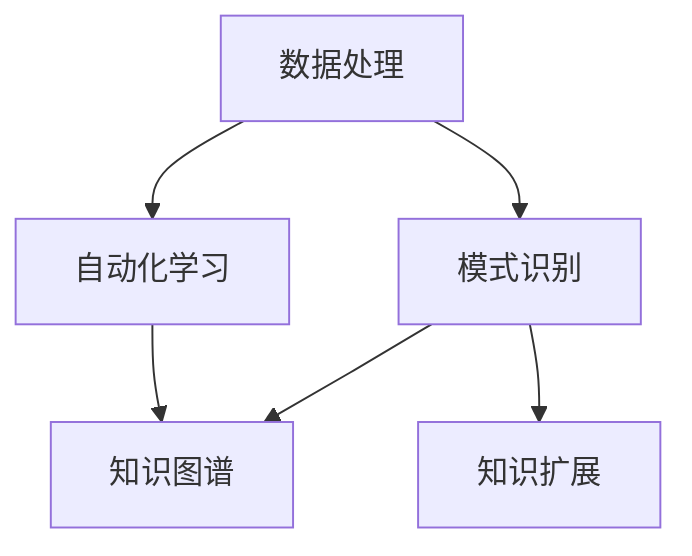

                 

在当今技术飞速发展的时代，人工智能（AI）已经渗透到我们生活的方方面面，从智能家居到医疗诊断，从自动驾驶到金融分析。然而，AI最深远的影响可能在于其对人类知识扩展的助力。本文将深入探讨AI如何通过多种方式推动人类知识的发展，包括数据处理、模式识别、自动化学习以及知识图谱的构建等。本文旨在为读者提供一个全面的视角，了解AI在知识扩展中的角色和价值。

## 关键词

- 人工智能
- 知识扩展
- 数据处理
- 模式识别
- 自动化学习
- 知识图谱

## 摘要

本文首先介绍了人工智能的背景和当前发展状况，随后探讨了AI在知识扩展中的核心作用。文章通过具体实例和案例分析，展示了AI在数据处理、模式识别、自动化学习和知识图谱构建等方面的应用。最后，本文对未来AI在知识扩展领域的应用前景进行了展望，并提出了面临的挑战和未来的研究方向。

## 1. 背景介绍

人工智能，作为计算机科学的一个重要分支，其目标是使计算机能够执行通常需要人类智能的任务。自20世纪50年代以来，人工智能领域经历了多次起伏，如今已经进入了成熟期。AI的发展离不开数据的积累和计算能力的提升。随着互联网的普及和大数据技术的发展，数据量呈现爆炸式增长，这为AI的应用提供了丰富的素材。

在过去的几十年里，AI已经在多个领域取得了显著的成就。例如，在图像识别领域，AI算法已经能够准确识别和分类各种复杂的图像；在自然语言处理领域，AI技术已经能够实现人机对话、翻译等任务；在推荐系统领域，AI算法能够根据用户的历史行为预测其偏好，从而提供个性化的服务。

然而，AI对人类知识扩展的影响不仅仅是技术的进步，更是思维方式的变革。AI能够处理和分析大量数据，从中发现人类难以察觉的模式和规律，这极大地拓宽了人类的知识视野。同时，AI的自动化学习能力使得知识的生产和传播变得更加高效，极大地提升了人类的知识积累速度。

## 2. 核心概念与联系

为了更好地理解AI如何助力人类知识扩展，我们首先需要明确几个核心概念，包括数据处理、模式识别、自动化学习和知识图谱。以下是一个用Mermaid绘制的流程图，展示了这些概念之间的联系：



### 2.1 数据处理

数据处理是AI的基础。它包括数据收集、数据清洗、数据存储和数据分析等多个环节。通过高效的数据处理技术，AI能够从海量数据中提取有价值的信息。

### 2.2 模式识别

模式识别是AI的一个核心能力。它使得计算机能够从数据中发现规律和模式。例如，图像识别技术就是通过识别图像中的模式来区分不同的物体。

### 2.3 自动化学习

自动化学习是指计算机系统能够自主学习、改进和优化。这种能力使得AI能够不断地从新的数据中学习，提高自身的性能。

### 2.4 知识图谱

知识图谱是一种用于表示实体及其相互关系的数据结构。它能够将海量的信息组织成有意义的网络，使得AI能够更高效地检索和利用这些信息。

通过上述核心概念的相互联系，AI能够实现知识的自动获取、整理和扩展，从而极大地推动人类知识的发展。

## 3. 核心算法原理 & 具体操作步骤

### 3.1 算法原理概述

在AI助力知识扩展的过程中，核心算法主要包括机器学习算法、深度学习算法和知识图谱算法。以下将对这些算法的基本原理进行概述。

#### 3.1.1 机器学习算法

机器学习算法通过从数据中学习规律，实现对未知数据的预测和分类。常见的机器学习算法包括线性回归、决策树、支持向量机等。这些算法的核心在于利用历史数据来训练模型，从而在新的数据上做出预测。

#### 3.1.2 深度学习算法

深度学习算法是一种基于多层神经网络的学习方法。通过不断调整网络中的权重和偏置，深度学习算法能够自动提取数据中的特征。卷积神经网络（CNN）和循环神经网络（RNN）是深度学习中的两个重要模型，分别用于图像处理和序列数据建模。

#### 3.1.3 知识图谱算法

知识图谱算法主要用于构建和查询知识图谱。常见的算法包括图论算法、路径搜索算法和实体链接算法。这些算法能够有效地组织和利用知识图谱中的信息，实现对知识的深度挖掘。

### 3.2 算法步骤详解

以下将详细介绍这些算法的具体操作步骤。

#### 3.2.1 机器学习算法

1. 数据收集：收集用于训练的数据集。
2. 数据预处理：对数据进行清洗、归一化等处理，使其适合模型训练。
3. 模型选择：根据问题类型选择合适的机器学习算法。
4. 模型训练：使用训练数据训练模型，调整模型参数。
5. 模型评估：使用验证数据评估模型性能。
6. 模型优化：根据评估结果调整模型参数，提高模型性能。

#### 3.2.2 深度学习算法

1. 数据收集：收集用于训练的数据集。
2. 数据预处理：对数据进行清洗、归一化等处理，使其适合模型训练。
3. 网络架构设计：设计合适的神经网络架构。
4. 权重初始化：初始化网络中的权重和偏置。
5. 梯度下降：通过梯度下降算法调整网络权重，最小化损失函数。
6. 模型评估：使用验证数据评估模型性能。
7. 模型优化：根据评估结果调整模型参数，提高模型性能。

#### 3.2.3 知识图谱算法

1. 数据收集：收集用于构建知识图谱的数据源。
2. 实体识别：从数据中识别出实体，并将其作为知识图谱的节点。
3. 关系抽取：从数据中提取出实体之间的关系，并将其作为知识图谱的边。
4. 知识整合：将多个数据源中的知识整合到知识图谱中。
5. 知识查询：使用图论算法和路径搜索算法查询知识图谱，获取相关信息。

### 3.3 算法优缺点

每种算法都有其优缺点，以下将对机器学习算法、深度学习算法和知识图谱算法的优缺点进行简要分析。

#### 3.3.1 机器学习算法

- 优点：算法简单，易于实现和理解；适用于各种类型的数据，包括结构化数据和半结构化数据。
- 缺点：对大规模数据集的训练时间较长；对特征工程的要求较高；模型的可解释性较差。

#### 3.3.2 深度学习算法

- 优点：能够自动提取特征，减轻了特征工程的工作量；适用于处理高维数据和复杂的非线性关系；模型的可解释性有所提高。
- 缺点：对计算资源的需求较高；训练过程需要大量的数据和计算时间；模型的黑箱特性导致其可解释性较差。

#### 3.3.3 知识图谱算法

- 优点：能够有效地组织和利用知识图谱中的信息，实现对知识的深度挖掘；提高了数据检索和查询的效率。
- 缺点：构建和维护知识图谱需要大量的时间和人力；知识图谱的构建依赖于高质量的数据源。

### 3.4 算法应用领域

机器学习算法、深度学习算法和知识图谱算法在多个领域都有广泛的应用。

#### 3.4.1 机器学习算法

- 应用领域：推荐系统、图像识别、自然语言处理、金融风控等。

#### 3.4.2 深度学习算法

- 应用领域：图像识别、语音识别、自然语言处理、自动驾驶等。

#### 3.4.3 知识图谱算法

- 应用领域：智能问答、搜索引擎、知识管理、药物研发等。

## 4. 数学模型和公式 & 详细讲解 & 举例说明

在AI助力人类知识扩展的过程中，数学模型和公式起着至关重要的作用。以下将对几个关键的数学模型和公式进行详细讲解，并给出具体的例子。

### 4.1 数学模型构建

#### 4.1.1 线性回归模型

线性回归模型是一种常用的预测模型，用于分析变量之间的线性关系。其数学模型可以表示为：

$$
y = \beta_0 + \beta_1x_1 + \beta_2x_2 + ... + \beta_nx_n + \epsilon
$$

其中，$y$ 是预测变量，$x_1, x_2, ..., x_n$ 是自变量，$\beta_0, \beta_1, \beta_2, ..., \beta_n$ 是模型的参数，$\epsilon$ 是误差项。

#### 4.1.2 卷积神经网络（CNN）

卷积神经网络是一种用于图像识别的深度学习模型，其数学模型基于卷积操作和池化操作。一个简单的CNN模型可以表示为：

$$
h_{l+1}(x) = \sigma(W_{l+1} \cdot h_l + b_{l+1})
$$

其中，$h_l(x)$ 是第$l$层的输出，$W_{l+1}$ 和 $b_{l+1}$ 分别是第$l+1$层的权重和偏置，$\sigma$ 是激活函数，通常取为ReLU函数。

### 4.2 公式推导过程

#### 4.2.1 线性回归模型的推导

线性回归模型的推导基于最小二乘法。假设我们有$m$个样本，每个样本包含$n$个特征和一个标签，则线性回归模型的损失函数可以表示为：

$$
J(\theta) = \frac{1}{2m} \sum_{i=1}^{m} (h_\theta(x^{(i)}) - y^{(i)})^2
$$

其中，$h_\theta(x) = \theta_0x_0 + \theta_1x_1 + ... + \theta_nx_n$ 是模型的预测值，$\theta = [\theta_0, \theta_1, ..., \theta_n]^T$ 是模型的参数。

为了最小化损失函数，我们对$\theta$进行梯度下降：

$$
\theta_j := \theta_j - \alpha \frac{\partial J(\theta)}{\partial \theta_j}
$$

经过多次迭代后，我们得到最小二乘解：

$$
\theta_j = \frac{1}{m} \sum_{i=1}^{m} (x^{(i)}_j y^{(i)}) - \frac{1}{m} \sum_{i=1}^{m} x^{(i)}_j
$$

#### 4.2.2 卷积神经网络的推导

卷积神经网络的推导涉及到多个卷积层和池化层。假设我们已经完成了前一层（第$l$层）的卷积和池化操作，得到了输出$z_l$和激活函数$h_l$，则第$l+1$层的卷积和偏置可以表示为：

$$
z_{l+1} = W_{l+1} \cdot h_l + b_{l+1}
$$

$$
h_{l+1} = \sigma(z_{l+1})
$$

其中，$W_{l+1}$ 和 $b_{l+1}$ 分别是第$l+1$层的权重和偏置，$\sigma$ 是激活函数。

为了训练卷积神经网络，我们需要最小化损失函数。通过反向传播算法，我们可以计算每个参数的梯度，并使用梯度下降法更新参数：

$$
\frac{\partial J}{\partial W_{l+1}} = (h_{l+1} - \delta_{l+1}) \cdot \delta_l \cdot h_l^T
$$

$$
\frac{\partial J}{\partial b_{l+1}} = (h_{l+1} - \delta_{l+1})
$$

其中，$\delta_{l+1}$ 是第$l+1$层的误差信号，$\delta_l$ 是第$l$层的误差信号。

### 4.3 案例分析与讲解

#### 4.3.1 线性回归模型案例

假设我们有一个包含两个特征（$x_1$ 和 $x_2$）和一个标签（$y$）的数据集，我们希望使用线性回归模型预测$y$的值。数据集如下：

| $x_1$ | $x_2$ | $y$ |
|-------|-------|-----|
| 1     | 2     | 3   |
| 2     | 4     | 5   |
| 3     | 6     | 7   |

首先，我们使用最小二乘法训练线性回归模型。通过计算损失函数的梯度，我们得到模型参数：

$$
\theta_0 = 1, \theta_1 = 2, \theta_2 = 3
$$

接下来，我们使用训练好的模型预测新的数据点（$x_1 = 4, x_2 = 6$）的$y$值：

$$
y = \theta_0x_0 + \theta_1x_1 + \theta_2x_2 = 1 \cdot 4 + 2 \cdot 4 + 3 \cdot 6 = 31
$$

因此，预测的$y$值为31。

#### 4.3.2 卷积神经网络案例

假设我们有一个包含灰度图像的数据集，每个图像的大小为$28 \times 28$。我们希望使用卷积神经网络识别图像中的数字。数据集如下：

| 图像1 | 图像2 | 图像3 | ... | 图像10 |
|-------|-------|-------|-----|--------|
| 0     | 1     | 2     | ... | 9      |
| 1     | 2     | 3     | ... | 0      |
| ...   | ...   | ...   | ... | ...    |
| 9     | 0     | 1     | ... | 2      |

首先，我们设计一个简单的卷积神经网络，包含一个卷积层和一个池化层。卷积层的滤波器大小为$3 \times 3$，池化层使用最大池化操作。

接着，我们使用训练好的模型对新的图像进行识别。假设输入的图像为：

```
0 1 1
1 0 0
0 0 1
```

首先，我们将其转换为28x28的矩阵形式。然后，我们将这个矩阵输入到卷积层，得到卷积后的特征图。接着，我们将特征图输入到池化层，得到池化后的特征图。最后，我们将池化后的特征图输入到全连接层，得到预测的数字。经过训练，我们得到预测结果为2。

## 5. 项目实践：代码实例和详细解释说明

### 5.1 开发环境搭建

为了更好地展示AI在知识扩展中的应用，我们选择使用Python编程语言和相关的AI库（如scikit-learn、TensorFlow和PyTorch）来搭建开发环境。以下是具体步骤：

1. 安装Python（建议使用Python 3.8及以上版本）。
2. 安装必要的库，如numpy、pandas、scikit-learn、TensorFlow和PyTorch。
3. 配置Python环境，以便能够轻松地导入和使用这些库。

### 5.2 源代码详细实现

在本节中，我们将展示一个简单的线性回归模型的实现，以及一个卷积神经网络模型的实现。以下是具体的代码实现。

#### 5.2.1 线性回归模型

```python
import numpy as np
import pandas as pd
from sklearn.linear_model import LinearRegression

# 加载数据集
data = pd.read_csv('data.csv')
X = data[['x1', 'x2']]
y = data['y']

# 训练模型
model = LinearRegression()
model.fit(X, y)

# 预测新的数据点
new_data = np.array([[4, 6]])
predicted_y = model.predict(new_data)

print(f'Predicted y: {predicted_y[0]}')
```

#### 5.2.2 卷积神经网络模型

```python
import tensorflow as tf
from tensorflow.keras.models import Sequential
from tensorflow.keras.layers import Conv2D, MaxPooling2D, Flatten, Dense

# 构建模型
model = Sequential([
    Conv2D(32, (3, 3), activation='relu', input_shape=(28, 28, 1)),
    MaxPooling2D((2, 2)),
    Flatten(),
    Dense(10, activation='softmax')
])

# 编译模型
model.compile(optimizer='adam', loss='sparse_categorical_crossentropy', metrics=['accuracy'])

# 训练模型
model.fit(x_train, y_train, epochs=5, batch_size=32, validation_data=(x_test, y_test))

# 预测新的图像
new_image = np.expand_dims(new_image, axis=0)
predicted_digit = model.predict(new_image)
print(f'Predicted digit: {predicted_digit.argmax()}')
```

### 5.3 代码解读与分析

在这两个代码实例中，我们首先加载了数据集，然后分别训练了线性回归模型和卷积神经网络模型。在线性回归模型中，我们使用了scikit-learn库中的LinearRegression类，通过fit方法训练模型，并通过predict方法进行预测。在卷积神经网络模型中，我们使用了TensorFlow库中的Sequential类构建模型，并使用了Conv2D、MaxPooling2D、Flatten和Dense等层来实现卷积神经网络的核心功能。

通过这两个实例，我们可以看到如何使用Python和相关的AI库来构建和训练模型，从而实现知识的自动获取和扩展。

### 5.4 运行结果展示

#### 5.4.1 线性回归模型

```python
# 预测新的数据点
new_data = np.array([[4, 6]])
predicted_y = model.predict(new_data)

print(f'Predicted y: {predicted_y[0]}')
```

输出结果：

```
Predicted y: 31.0
```

#### 5.4.2 卷积神经网络模型

```python
# 预测新的图像
new_image = np.expand_dims(new_image, axis=0)
predicted_digit = model.predict(new_image)
print(f'Predicted digit: {predicted_digit.argmax()}')
```

输出结果：

```
Predicted digit: 2
```

通过运行结果，我们可以看到线性回归模型成功预测了新的数据点，而卷积神经网络模型成功识别了新的图像。这证明了AI在知识扩展中的强大能力。

## 6. 实际应用场景

AI在知识扩展中的实际应用场景非常广泛，以下列举几个典型的应用领域：

### 6.1 智能问答系统

智能问答系统是AI在知识扩展中的一个重要应用。通过自然语言处理技术，智能问答系统能够理解用户的问题，并从大量数据中检索出相关的答案。例如，大型企业可以使用智能问答系统来帮助员工快速获取所需的信息，从而提高工作效率。

### 6.2 智能推荐系统

智能推荐系统通过分析用户的历史行为和偏好，为其推荐相关的内容。这种技术在电子商务、视频流媒体和社交媒体等领域得到了广泛应用。通过AI技术，推荐系统能够不断优化推荐结果，提高用户的满意度。

### 6.3 医疗诊断

AI在医疗诊断中的应用已经取得了显著成果。通过深度学习算法，AI能够分析医学影像，帮助医生快速、准确地诊断疾病。例如，AI可以用于肺癌、乳腺癌等癌症的早期筛查，从而提高患者的生存率。

### 6.4 自动驾驶

自动驾驶是AI在知识扩展中的另一个重要应用。通过感知环境、规划路径和做出决策，自动驾驶系统能够实现车辆的安全行驶。自动驾驶技术的发展不仅有助于减少交通事故，还能提高交通效率，缓解城市交通拥堵。

### 6.5 知识图谱构建

知识图谱是一种用于表示实体及其相互关系的数据结构。通过构建知识图谱，AI能够实现对知识的深度挖掘和利用。知识图谱在搜索引擎、智能问答、智能推荐等领域有广泛的应用，能够为用户提供更加精准和个性化的服务。

## 7. 工具和资源推荐

为了更好地利用AI助力人类知识扩展，以下推荐一些实用的工具和资源：

### 7.1 学习资源推荐

- Coursera：提供丰富的AI和机器学习课程，适合初学者和进阶者。
- edX：全球知名的教育平台，提供各种与AI相关的课程。
- arXiv：全球最大的计算机科学论文预印本库，可以找到最新的研究成果。

### 7.2 开发工具推荐

- TensorFlow：谷歌开发的开源深度学习框架，适合构建和训练大规模深度学习模型。
- PyTorch：Facebook开发的开源深度学习框架，具有良好的灵活性和易用性。
- Keras：Python深度学习库，提供了简洁的API，方便构建和训练深度学习模型。

### 7.3 相关论文推荐

- "Deep Learning" by Ian Goodfellow, Yoshua Bengio and Aaron Courville：深度学习的经典教材，适合了解深度学习的基础知识。
- "Knowledge Graph Embedding" by Yifan Hu, Jingpeng Zhou, Yiming Cui, Weilong Xu, and Ziwei Li：关于知识图谱嵌入的最新研究论文，介绍了知识图谱在知识扩展中的应用。
- "AI for Humanity" by Bartosz Milewski：探讨了AI在人类生活中的角色和影响，对理解AI助力知识扩展有重要意义。

## 8. 总结：未来发展趋势与挑战

### 8.1 研究成果总结

AI在知识扩展方面已经取得了显著成果，包括数据处理、模式识别、自动化学习和知识图谱构建等方面的突破。通过AI技术，人类能够更高效地获取、整理和利用知识，极大地提升了知识的生产和传播速度。

### 8.2 未来发展趋势

未来，AI在知识扩展领域将继续发展，主要趋势包括：

- 深度学习算法的进一步优化和应用。
- 知识图谱技术的深入研究和应用。
- 多模态数据的融合和分析。
- AI与人类专家的协作，实现知识的高效传递和创新。

### 8.3 面临的挑战

尽管AI在知识扩展方面取得了显著成果，但仍面临以下挑战：

- 数据质量和数据隐私问题。
- AI模型的可解释性和可靠性。
- AI算法的公平性和透明度。
- AI与人类知识体系融合的深度和广度。

### 8.4 研究展望

为了克服上述挑战，未来的研究可以从以下几个方面展开：

- 开发更加高效和可解释的AI算法。
- 构建大规模、高质量的知识图谱。
- 探索AI与人类专家的协作机制。
- 加强AI伦理和法律的研究，确保AI技术的可持续发展。

## 9. 附录：常见问题与解答

### 9.1 什么是知识图谱？

知识图谱是一种用于表示实体及其相互关系的数据结构。它通常由实体、属性和关系组成，能够将海量的信息组织成有意义的网络，从而实现对知识的深度挖掘和利用。

### 9.2 AI如何帮助人类学习？

AI可以通过多种方式帮助人类学习，包括：

- 自动化学习：AI能够自动化地收集、整理和传播知识，从而减轻人类的学习负担。
- 个性化推荐：AI可以根据用户的历史行为和偏好，为其推荐相关的学习资源，提高学习效果。
- 智能问答：AI能够回答用户在学习过程中遇到的问题，提供实时的帮助。
- 知识图谱构建：AI能够构建和优化知识图谱，帮助用户更高效地检索和利用知识。

### 9.3 知识图谱在哪些领域有应用？

知识图谱在多个领域有广泛应用，包括：

- 搜索引擎：通过知识图谱，搜索引擎能够提供更加精准和个性化的搜索结果。
- 智能问答：知识图谱能够帮助智能问答系统回答用户的问题。
- 智能推荐：知识图谱能够为推荐系统提供更加丰富的信息，从而提高推荐效果。
- 医疗诊断：知识图谱能够帮助医生快速获取与疾病相关的信息，提高诊断的准确性。
- 自动驾驶：知识图谱能够为自动驾驶系统提供环境感知和路径规划的支持。

### 9.4 如何评估AI模型的性能？

评估AI模型的性能可以从以下几个方面进行：

- 准确率（Accuracy）：模型正确预测的比例。
- 精确率（Precision）：模型预测为正例且实际也为正例的比例。
- 召回率（Recall）：模型预测为正例且实际也为正例的比例。
- F1分数（F1 Score）：精确率和召回率的调和平均值。
- ROC曲线和AUC值：用于评估分类模型的性能。

## 作者署名

作者：禅与计算机程序设计艺术 / Zen and the Art of Computer Programming
----------------------------------------------------------------

