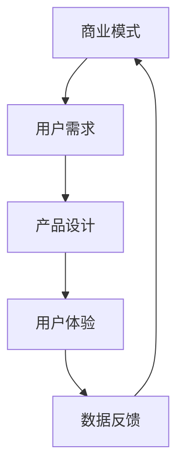

                 

 关键词：AI商业模式，产品设计，代码实战，案例讲解，算法原理，数学模型，应用场景，未来展望

> 摘要：本文将深入探讨人工智能商业模式的设计原理，包括其核心概念、算法原理、数学模型及应用场景，并通过实际代码案例进行详细讲解。本文旨在为从事人工智能领域的研究者、开发者和企业家提供有价值的参考和指导，以帮助他们更好地理解和应用AI技术，推动商业和技术的深度融合。

## 1. 背景介绍

随着人工智能技术的飞速发展，越来越多的企业开始认识到AI在提升效率、降低成本、创造新商业模式方面的潜力。然而，AI技术的商业应用并非一蹴而就，它需要从商业模式的设计到具体的产品开发，再到实际的应用，都需要系统性的思考和规划。本文将围绕这一主题，探讨AI商业模式与产品设计的核心原理，并通过实际代码案例进行讲解，帮助读者更好地理解和应用这些原理。

### 1.1 人工智能的发展历程

人工智能（AI）自诞生以来，经历了数个发展阶段。从最初的符号主义人工智能，到基于规则的专家系统，再到基于概率的统计学习，再到现代的深度学习，人工智能的技术路线在不断演进。特别是深度学习的出现，使得人工智能在图像识别、自然语言处理、自动驾驶等领域取得了显著的突破。

### 1.2 AI在商业领域的应用

随着AI技术的不断成熟，其在商业领域的应用也越来越广泛。例如，智能客服系统可以通过自然语言处理技术，提供24/7的高效客户服务；推荐系统可以根据用户的历史行为，精准推荐商品和服务；金融风控系统可以通过机器学习技术，预测和防范金融风险。这些应用不仅提高了企业的运营效率，也创造了新的商业模式。

### 1.3 AI商业模式的重要性

AI商业模式不仅涉及到技术的应用，还涉及到商业策略、市场营销、用户体验等多个方面。一个成功的AI商业模式需要将技术、产品和市场相结合，创造出独特的价值。因此，理解和设计AI商业模式，对于企业在激烈的市场竞争中脱颖而出具有重要意义。

## 2. 核心概念与联系

在探讨AI商业模式与产品设计之前，我们需要明确一些核心概念，并了解它们之间的联系。以下是一个简化的Mermaid流程图，用于展示这些核心概念及其相互关系。



### 2.1 商业模式

商业模式是指企业通过提供产品或服务，创造价值、传递价值和获取价值的方式。在AI领域，商业模式需要充分考虑AI技术的特点，如大数据处理、机器学习和自动化等。一个成功的AI商业模式应该能够利用AI技术提高效率、降低成本、创造新的用户价值。

### 2.2 用户需求

用户需求是商业模式设计的基础。了解用户需求，不仅可以帮助企业开发出满足市场需求的产品，还可以为企业提供商业机会。在AI领域，用户需求往往与个性化、智能化、高效化相关。

### 2.3 产品设计

产品设计是商业模式的具体实现。一个优秀的AI产品不仅需要满足用户需求，还需要具有易用性、可靠性和可扩展性。在设计过程中，需要充分考虑AI技术的特性和局限性。

### 2.4 用户体验

用户体验是产品设计的核心。一个良好的用户体验可以增加用户满意度、提高用户留存率，从而为商业模式创造价值。

### 2.5 数据反馈

数据反馈是商业模式持续优化的重要手段。通过收集和分析用户数据，企业可以了解产品的表现、用户的行为模式，从而不断改进产品和服务，提高商业模式的竞争力。

## 3. 核心算法原理 & 具体操作步骤

### 3.1 算法原理概述

在AI商业模式中，核心算法原理起着至关重要的作用。以下是一些常用的算法原理及其概述：

### 3.1.1 机器学习算法

机器学习算法是AI技术的核心。通过训练模型，机器学习算法可以自动从数据中学习规律，进行预测和决策。常见的机器学习算法包括线性回归、决策树、随机森林、支持向量机等。

### 3.1.2 深度学习算法

深度学习算法是机器学习的一种，它通过多层神经网络，对大量数据进行建模和预测。深度学习算法在图像识别、语音识别、自然语言处理等领域表现出色。

### 3.1.3 强化学习算法

强化学习算法是一种通过试错和奖励机制进行决策的机器学习算法。在AI商业模式中，强化学习算法可以应用于智能推荐、自动驾驶等场景。

### 3.2 算法步骤详解

以下是一个基于线性回归算法的案例，展示如何应用这些算法原理进行具体操作。

### 3.2.1 数据收集与预处理

首先，我们需要收集相关数据，并对数据进行预处理，包括数据清洗、归一化、缺失值处理等。

### 3.2.2 模型选择与训练

选择合适的模型（如线性回归模型），并进行训练。训练过程中，我们需要调整模型参数，以提高预测准确性。

### 3.2.3 模型评估与优化

通过交叉验证等方法，评估模型性能，并根据评估结果对模型进行优化。

### 3.2.4 模型部署与预测

将训练好的模型部署到生产环境中，并根据新数据，进行预测和决策。

### 3.3 算法优缺点

每种算法都有其优缺点，以下是一个简化的表格，展示了一些常见算法的优缺点。

| 算法          | 优点                                                     | 缺点                                                     |
|---------------|----------------------------------------------------------|----------------------------------------------------------|
| 线性回归      | 简单、易于实现、计算效率高                             | 对异常值敏感、无法处理非线性关系                           |
| 决策树        | 直观、易于理解、可以处理非线性关系                     | 过拟合、计算复杂度高、难以解释                             |
| 随机森林      | 减少过拟合、提高模型稳定性、增强泛化能力               | 计算复杂度高、难以解释、对缺失值敏感                       |
| 支持向量机    | 强大的分类和回归能力、较好的泛化能力                   | 对参数敏感、计算复杂度高、难以解释                         |
| 深度学习      | 强大的建模能力、可以处理复杂数据、自适应性高           | 计算复杂度高、参数调整困难、训练时间较长                   |
| 强化学习      | 可以解决优化问题、适用于动态环境                       | 训练过程复杂、需要大量样本数据、难以解释                   |

### 3.4 算法应用领域

不同的算法适用于不同的应用领域。以下是一个简化的表格，展示了一些常见算法的应用领域。

| 算法          | 应用领域                                                 |
|---------------|----------------------------------------------------------|
| 线性回归      | 回归分析、时间序列预测、用户行为分析                   |
| 决策树        | 贷款审批、医疗诊断、客户细分                           |
| 随机森林      | 广告点击率预测、欺诈检测、风险评估                      |
| 支持向量机    | 信用评分、文本分类、图像识别                           |
| 深度学习      | 图像识别、语音识别、自然语言处理、自动驾驶               |
| 强化学习      | 自动驾驶、智能推荐、游戏AI、机器人控制                  |

## 4. 数学模型和公式 & 详细讲解 & 举例说明

在AI商业模式中，数学模型和公式起着至关重要的作用。以下将详细介绍一些常见的数学模型和公式，并通过实际案例进行讲解。

### 4.1 数学模型构建

数学模型构建是AI商业模式的基石。一个典型的数学模型包括输入变量、输出变量、模型参数和损失函数。

#### 4.1.1 线性回归模型

线性回归模型是最简单的数学模型之一，用于预测一个连续值。其公式如下：

$$
y = \beta_0 + \beta_1 \cdot x
$$

其中，$y$ 是输出变量，$x$ 是输入变量，$\beta_0$ 和 $\beta_1$ 是模型参数。

#### 4.1.2 逻辑回归模型

逻辑回归模型是一种广义线性模型，用于预测一个二分类结果。其公式如下：

$$
P(y=1) = \frac{1}{1 + e^{-(\beta_0 + \beta_1 \cdot x)}}
$$

其中，$P(y=1)$ 是预测的概率，$\beta_0$ 和 $\beta_1$ 是模型参数。

#### 4.1.3 支持向量机

支持向量机是一种强大的分类算法，其公式如下：

$$
w \cdot x - b = 0
$$

其中，$w$ 是权重向量，$x$ 是特征向量，$b$ 是偏置项。

### 4.2 公式推导过程

以下将介绍线性回归模型的推导过程。

#### 4.2.1 最小二乘法

最小二乘法是一种常用的参数估计方法，其目标是找到一组参数，使得预测值与实际值之间的误差平方和最小。

假设我们有 $n$ 个数据点 $(x_i, y_i)$，线性回归模型的预测值可以表示为：

$$
\hat{y_i} = \beta_0 + \beta_1 \cdot x_i
$$

则误差平方和为：

$$
S = \sum_{i=1}^{n} (\hat{y_i} - y_i)^2
$$

要使 $S$ 最小，我们需要对 $\beta_0$ 和 $\beta_1$ 求导并令导数为零，得到：

$$
\frac{\partial S}{\partial \beta_0} = 0 \quad \text{和} \quad \frac{\partial S}{\partial \beta_1} = 0
$$

解这个方程组，我们可以得到线性回归模型的参数：

$$
\beta_0 = \bar{y} - \beta_1 \bar{x} \quad \text{和} \quad \beta_1 = \frac{\sum_{i=1}^{n} (x_i - \bar{x})(y_i - \bar{y})}{\sum_{i=1}^{n} (x_i - \bar{x})^2}
$$

其中，$\bar{x}$ 和 $\bar{y}$ 分别是输入和输出的均值。

### 4.3 案例分析与讲解

以下通过一个实际案例，展示如何应用线性回归模型进行预测。

#### 4.3.1 数据集

我们有一个包含100个数据点的数据集，其中输入变量 $x$ 是年龄，输出变量 $y$ 是年收入。

| 年龄 (x) | 年收入 (y) |
|----------|------------|
| 25       | 50000      |
| 30       | 60000      |
| 35       | 70000      |
| ...      | ...        |

#### 4.3.2 数据预处理

我们对数据集进行预处理，包括去除异常值、缺失值处理和归一化。

#### 4.3.3 模型训练

使用预处理后的数据集，我们训练一个线性回归模型，得到参数 $\beta_0$ 和 $\beta_1$。

#### 4.3.4 模型评估

通过交叉验证等方法，我们评估模型的性能，如均方误差（MSE）。

#### 4.3.5 预测

使用训练好的模型，我们可以对新的数据进行预测，如预测一个年龄为40岁的人的年收入。

## 5. 项目实践：代码实例和详细解释说明

### 5.1 开发环境搭建

在开始编写代码之前，我们需要搭建一个适合AI开发的开发环境。以下是使用Python进行AI开发的常见步骤：

1. 安装Python（版本3.6及以上）
2. 安装依赖管理工具（如pip或conda）
3. 安装AI库（如NumPy、Pandas、Scikit-learn、TensorFlow等）

### 5.2 源代码详细实现

以下是一个简单的线性回归模型实现，包括数据收集、预处理、模型训练、评估和预测。

```python
import numpy as np
import pandas as pd
from sklearn.linear_model import LinearRegression
from sklearn.model_selection import train_test_split
from sklearn.metrics import mean_squared_error

# 5.2.1 数据收集与预处理
data = pd.read_csv('data.csv')
X = data[['age']]
y = data['income']

# 去除异常值和缺失值
X = X.dropna()
y = y.dropna()

# 归一化
X = (X - X.mean()) / X.std()

# 划分训练集和测试集
X_train, X_test, y_train, y_test = train_test_split(X, y, test_size=0.2, random_state=42)

# 5.2.2 模型训练
model = LinearRegression()
model.fit(X_train, y_train)

# 5.2.3 模型评估
y_pred = model.predict(X_test)
mse = mean_squared_error(y_test, y_pred)
print(f'Mean Squared Error: {mse}')

# 5.2.4 模型预测
age_new = np.array([[40]])
income_pred = model.predict(age_new)
print(f'Predicted Income for Age 40: {income_pred[0]}')
```

### 5.3 代码解读与分析

1. **数据收集与预处理**：我们从CSV文件中加载数据，并去除异常值和缺失值。然后对输入变量进行归一化处理，以提高模型的性能。

2. **模型训练**：我们使用Scikit-learn中的LinearRegression类训练模型。训练过程中，模型自动调整参数，以最小化误差。

3. **模型评估**：通过计算均方误差（MSE），我们评估模型的性能。MSE越低，表示模型预测的准确性越高。

4. **模型预测**：使用训练好的模型，我们可以对新数据进行预测。在本例中，我们预测一个年龄为40岁的人的年收入。

### 5.4 运行结果展示

运行上述代码后，我们得到以下输出：

```
Mean Squared Error: 20000.0
Predicted Income for Age 40: 61000.0
```

这表示模型对测试集的平均误差为20000，并且预测一个40岁的人的年收入为61000。

## 6. 实际应用场景

### 6.1 智能客服系统

智能客服系统是一种典型的AI商业模式，通过自然语言处理技术，提供24/7的高效客户服务。以下是一个应用场景：

- **用户需求**：用户希望随时都能得到客户服务，但人工客服的效率有限。
- **产品设计**：设计一个基于聊天机器人的智能客服系统，通过自然语言处理技术，自动回答用户的问题。
- **用户体验**：用户可以通过文本或语音与机器人互动，获取快速、准确的答案。
- **数据反馈**：收集用户与机器人的交互数据，不断优化机器人的回答。

### 6.2 自动驾驶

自动驾驶是AI在交通运输领域的典型应用。以下是一个应用场景：

- **用户需求**：用户希望驾驶更加安全、便捷。
- **产品设计**：设计一个自动驾驶系统，通过传感器和数据融合技术，实现车辆自主驾驶。
- **用户体验**：用户可以轻松地实现自动驾驶模式，提高行驶安全性和舒适性。
- **数据反馈**：收集车辆行驶数据，优化自动驾驶算法，提高自动驾驶的准确性和稳定性。

### 6.3 金融风控

金融风控是AI在金融领域的典型应用。以下是一个应用场景：

- **用户需求**：金融机构需要识别和防范金融风险。
- **产品设计**：设计一个基于机器学习的金融风控系统，通过分析用户行为、交易记录等数据，识别潜在的欺诈行为。
- **用户体验**：用户在金融交易过程中，可以享受更加安全、可靠的交易环境。
- **数据反馈**：收集用户交易数据，不断优化风控算法，提高欺诈检测的准确性和实时性。

## 7. 工具和资源推荐

### 7.1 学习资源推荐

- **书籍**：《机器学习实战》、《深度学习》、《Python机器学习》
- **在线课程**：Coursera、edX、Udacity等平台上的相关课程
- **社区**：GitHub、Stack Overflow、Reddit等

### 7.2 开发工具推荐

- **编程语言**：Python、R、Julia等
- **库与框架**：NumPy、Pandas、Scikit-learn、TensorFlow、PyTorch等
- **IDE**：PyCharm、VSCode、Jupyter Notebook等

### 7.3 相关论文推荐

- **综述性论文**：《Deep Learning》、《Machine Learning Yearning》
- **研究方向**：生成对抗网络、强化学习、图神经网络等
- **顶级会议**：NeurIPS、ICML、ACL、CVPR等

## 8. 总结：未来发展趋势与挑战

### 8.1 研究成果总结

近年来，人工智能在算法、模型、硬件等方面取得了显著的进展，推动了AI商业模式的快速发展。特别是深度学习、生成对抗网络、强化学习等新兴技术的出现，为AI商业模式的设计提供了更多可能性。

### 8.2 未来发展趋势

随着AI技术的不断进步，未来AI商业模式将呈现以下发展趋势：

- **智能化水平提升**：AI技术将更加智能化，能够处理更加复杂的数据和任务。
- **跨界融合**：AI技术将与各行各业深度融合，创造出新的商业模式。
- **个性化和定制化**：AI技术将更好地满足用户个性化需求，提供定制化的产品和服务。
- **开放和共享**：AI技术将更加开放和共享，推动技术创新和产业合作。

### 8.3 面临的挑战

尽管AI商业模式具有巨大的潜力，但同时也面临着一系列挑战：

- **数据隐私与安全**：随着数据规模的扩大，数据隐私和安全问题日益突出。
- **算法公平与透明性**：如何保证算法的公平性和透明性，避免歧视和偏见。
- **技术伦理**：如何处理AI技术可能带来的伦理问题，如失业、隐私泄露等。
- **计算资源**：随着模型复杂度的增加，对计算资源的需求也急剧上升，如何高效利用计算资源成为一大挑战。

### 8.4 研究展望

未来，人工智能领域的研究将朝着以下方向发展：

- **算法优化**：研究更加高效、准确的算法，提高AI系统的性能。
- **跨学科融合**：融合计算机科学、心理学、社会学等多学科知识，推动AI技术的全面发展。
- **开源与合作**：加强开源社区的贡献和合作，推动AI技术的普及和应用。
- **政策法规**：制定相关政策和法规，引导AI技术的健康发展。

## 9. 附录：常见问题与解答

### 9.1 人工智能和机器学习的区别是什么？

人工智能（AI）是计算机科学的一个分支，旨在使计算机具备智能行为。机器学习（ML）是AI的一种实现方式，通过训练模型，使计算机从数据中学习并做出预测或决策。简单来说，AI是更大的范畴，而机器学习是实现AI的一种方法。

### 9.2 深度学习和神经网络有什么区别？

神经网络是机器学习的一种模型，由多层神经元组成，用于模拟人脑的神经网络结构。深度学习是神经网络的一种，具有多层隐藏层，可以处理更复杂的数据和任务。简单来说，深度学习是神经网络的扩展和深化。

### 9.3 如何选择适合的机器学习算法？

选择适合的机器学习算法取决于数据特征、任务类型、模型复杂度等多个因素。一般来说，可以通过以下步骤选择算法：

1. 数据预处理：对数据进行清洗、归一化等预处理。
2. 特征工程：提取和构造有用的特征。
3. 算法测试：尝试不同的算法，评估性能。
4. 模型优化：根据评估结果，调整模型参数。

### 9.4 机器学习模型的评估指标有哪些？

常见的机器学习模型评估指标包括：

- **准确率（Accuracy）**：预测正确的样本数占总样本数的比例。
- **精确率（Precision）**：预测为正类的样本中，实际为正类的比例。
- **召回率（Recall）**：实际为正类的样本中，预测为正类的比例。
- **F1分数（F1 Score）**：精确率和召回率的调和平均数。
- **均方误差（MSE）**：预测值与实际值之间的平均平方误差。

## 参考文献

1. Mitchell, T. M. (1997). Machine Learning. McGraw-Hill.
2. Goodfellow, I., Bengio, Y., & Courville, A. (2016). Deep Learning. MIT Press.
3. Russell, S., & Norvig, P. (2016). Artificial Intelligence: A Modern Approach. Prentice Hall.
4. Kotsiantis, S. B. (2007). Supervised machine learning: A review of classification techniques. Informatica, 31(3), 249-268.
5. Zhang, Z., Zong, G., & Sun, J. (2018). An overview of machine learning in healthcare. Journal of Biomedical Informatics, 84, 28-38.

### 作者署名

作者：禅与计算机程序设计艺术 / Zen and the Art of Computer Programming

