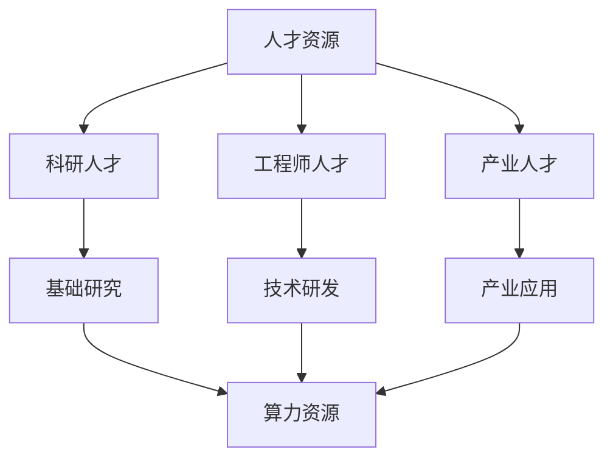

                 

关键词：人工智能、国家战略、人才资源、算力资源、体系建设、技术发展、未来展望

> 摘要：本文从国家战略的高度，深入探讨了人工智能领域中的两大核心资源——人才资源和算力资源的重要性，分析了当前我国在这两方面的现状，提出了针对性的建设方案。文章旨在为我国人工智能的可持续发展提供有益的参考和指导。

## 1. 背景介绍

随着科技的迅猛发展，人工智能（AI）已成为全球竞争的焦点。从自动驾驶、智能家居到医疗诊断、金融分析，AI技术正在深刻地改变着各行各业。在我国，人工智能被视为新一轮科技革命和产业变革的重要引擎，是国家创新驱动发展的核心力量。因此，构建强大的人才资源和算力资源体系，对推动我国人工智能发展具有重要意义。

### 1.1 人工智能发展的现状与挑战

全球范围内，美国、中国、欧盟等国在人工智能领域竞争激烈。美国凭借强大的科技实力和资金投入，一直处于领先地位。中国近年来在人工智能技术研发、产业应用等方面取得了显著进展，已成为全球人工智能发展的重要力量。然而，与发达国家相比，我国在人工智能领域仍存在一定的差距，主要体现在以下几个方面：

1. **人才资源不足**：全球顶尖人工智能人才主要集中在少数发达国家，我国在高端人才方面仍需加大培养和引进力度。
2. **基础研究薄弱**：我国在人工智能基础理论研究和原创技术方面相对较弱，难以形成国际竞争优势。
3. **产业链条不完善**：人工智能产业链尚未完全形成，部分关键环节依赖进口，制约了产业发展。
4. **政策环境有待优化**：人工智能政策体系尚不健全，部分政策措施缺乏针对性和可操作性。

### 1.2 国家战略的重要性

面对人工智能发展的机遇与挑战，我国政府高度重视人工智能领域的战略布局。从“新一代人工智能发展规划”到“国家科技创新2030重大项目”，一系列政策的出台，为人工智能发展提供了有力保障。国家战略的重要性主要体现在以下几个方面：

1. **引领科技发展**：国家战略有助于推动人工智能基础理论研究和关键技术研发，提高我国在全球科技竞争中的地位。
2. **培育产业生态**：国家战略能够引导产业链上下游企业加大投入，培育多元化的人工智能产业生态。
3. **优化政策环境**：国家战略为人工智能发展提供政策支持，为企业和科研机构创造良好的创新环境。
4. **保障国家安全**：人工智能技术广泛应用于国防、安防、交通等领域，国家战略有助于提升我国在关键领域的技术安全水平。

## 2. 核心概念与联系

为了构建强大的人才资源和算力资源体系，我们需要明确以下几个核心概念及其相互关系：

### 2.1 人才资源

人才资源是人工智能发展的基石。主要包括以下类型：

1. **科研人才**：具备深厚理论功底和创新能力，致力于人工智能基础研究和前沿技术突破。
2. **工程师人才**：具备扎实的技术能力和实践经验，负责人工智能技术的研发和应用。
3. **产业人才**：熟悉产业发展趋势和市场需求，能够推动人工智能技术在产业中的应用。

### 2.2 算力资源

算力资源是人工智能运算能力的体现。主要包括以下类型：

1. **硬件设备**：包括计算机、服务器、GPU、FPGA等，用于承载人工智能算法的运算。
2. **云计算**：通过云计算平台提供强大的计算能力，满足人工智能海量数据处理需求。
3. **数据资源**：包括结构化数据、非结构化数据、开源数据等，为人工智能算法提供训练和优化依据。

### 2.3 关系与联系

人才资源和算力资源之间相互依存、相互促进。具体表现为：

1. **人才驱动算力**：优秀的人工智能人才能够推动算力资源的优化配置，提升计算效率。
2. **算力支撑人才**：强大的算力资源为人工智能人才提供了丰富的实验和应用场景，助力人才成长。

### 2.4 Mermaid 流程图

以下是一个简单的 Mermaid 流程图，展示人才资源和算力资源之间的相互关系：



## 3. 核心算法原理 & 具体操作步骤

### 3.1 算法原理概述

在构建人才资源和算力资源体系的过程中，需要运用一系列核心算法来优化资源配置、提高运营效率。以下介绍几个常用的算法原理及其操作步骤：

### 3.1.1 贪心算法

贪心算法是一种简单而高效的问题求解策略，其基本思想是在每一步选择中都采取当前最优解，并期望最终得到全局最优解。具体操作步骤如下：

1. **初始化**：选择一个初始解。
2. **迭代过程**：在每一步中，从当前解的可行解中选择一个最优解，直至得到全局最优解。

### 3.1.2 动态规划

动态规划是一种将复杂问题分解为多个子问题，并利用子问题的最优解来求解原问题的方法。具体操作步骤如下：

1. **定义状态**：将原问题分解为多个子问题，并为每个子问题定义一个状态。
2. **状态转移方程**：确定子问题之间的依赖关系，并给出状态转移方程。
3. **求解最优解**：根据状态转移方程，从初始状态开始，逐步求解每个子问题的最优解，直至得到原问题的最优解。

### 3.1.3 线性规划

线性规划是一种在满足一系列线性约束条件下，求解目标函数最优解的方法。具体操作步骤如下：

1. **建立数学模型**：根据问题性质，建立线性规划模型。
2. **求解目标函数**：利用线性规划求解器，求解目标函数的最优值。
3. **分析约束条件**：检查约束条件是否满足，如不满足，则需要调整目标函数或约束条件。

### 3.2 算法步骤详解

#### 3.2.1 贪心算法

以最小生成树算法（如Prim算法）为例，介绍贪心算法的具体步骤：

1. **初始化**：选择一个顶点作为初始点，并将其加入生成树。
2. **迭代过程**：
   - 遍历当前生成树中的所有顶点，找出与生成树连接的边中权重最小的边。
   - 将这条边和对应的顶点加入生成树。
3. **结束条件**：当所有顶点都已加入生成树时，算法结束。

#### 3.2.2 动态规划

以背包问题为例，介绍动态规划的具体步骤：

1. **定义状态**：设`dp[i][j]`表示在前`i`个物品中选取前`j`个物品的最大价值。
2. **状态转移方程**：根据是否选择第`i`个物品，分两种情况：
   - 选择第`i`个物品：`dp[i][j] = dp[i-1][j-1] + wi`，其中`wi`为第`i`个物品的价值。
   - 不选择第`i`个物品：`dp[i][j] = dp[i-1][j]`。
   - 最终结果为：`dp[n][m]`，其中`n`为物品数量，`m`为背包容量。
3. **求解最优解**：从`dp[n][m]`开始，逆推求解每个子问题的最优解，直至得到原问题的最优解。

#### 3.2.3 线性规划

以线性规划求解器为例，介绍线性规划的具体步骤：

1. **建立数学模型**：根据问题性质，建立线性规划模型。
2. **输入数据**：将模型中的参数和约束条件输入到线性规划求解器中。
3. **求解目标函数**：利用线性规划求解器，求解目标函数的最优值。
4. **分析约束条件**：检查约束条件是否满足，如不满足，则需要调整目标函数或约束条件。

### 3.3 算法优缺点

#### 3.3.1 贪心算法

**优点**：
- 计算时间复杂度较低，适用于求解大规模问题。
- 实现简单，易于理解。

**缺点**：
- 只适用于最优子结构问题，适用范围有限。
- 可能陷入局部最优，无法保证全局最优解。

#### 3.3.2 动态规划

**优点**：
- 能够保证全局最优解，适用于求解复杂问题。
- 状态转移方程简洁明了，易于推导。

**缺点**：
- 时间复杂度较高，对于大规模问题可能难以接受。
- 状态空间爆炸问题，对于某些问题可能需要大量内存。

#### 3.3.3 线性规划

**优点**：
- 能够求解线性约束条件下的优化问题，适用范围广泛。
- 理论基础扎实，有多种求解算法可供选择。

**缺点**：
- 对于非线性问题，线性规划可能无法直接应用。
- 求解时间复杂度较高，对于大规模问题可能难以接受。

### 3.4 算法应用领域

#### 3.4.1 贪心算法

贪心算法广泛应用于以下领域：
- 路径规划：如最短路径问题、旅行商问题。
- 资源分配：如背包问题、任务调度。
- 最优化问题：如最小生成树、最小费用流。

#### 3.4.2 动态规划

动态规划广泛应用于以下领域：
- 计算几何：如最短路径、最大公约数、矩阵乘法。
- 图论问题：如最长公共子序列、最短公共超串。
- 最优化问题：如线性规划、背包问题。

#### 3.4.3 线性规划

线性规划广泛应用于以下领域：
- 生产调度：如生产计划、库存管理。
- 金融投资：如资产组合优化、投资策略分析。
- 能源管理：如电力调度、碳排放控制。

## 4. 数学模型和公式 & 详细讲解 & 举例说明

在构建人才资源和算力资源体系的过程中，数学模型和公式扮演着至关重要的角色。以下介绍几个常用的数学模型和公式，并对其进行详细讲解和举例说明。

### 4.1 数学模型构建

#### 4.1.1 线性回归模型

线性回归模型是一种常见的统计模型，用于分析两个变量之间的线性关系。其数学模型如下：

$$
y = \beta_0 + \beta_1x + \epsilon
$$

其中，$y$ 为因变量，$x$ 为自变量，$\beta_0$ 和 $\beta_1$ 分别为模型的参数，$\epsilon$ 为误差项。

#### 4.1.2 多元线性回归模型

多元线性回归模型扩展了线性回归模型，用于分析多个自变量对因变量的影响。其数学模型如下：

$$
y = \beta_0 + \beta_1x_1 + \beta_2x_2 + ... + \beta_nx_n + \epsilon
$$

其中，$x_1, x_2, ..., x_n$ 为自变量，$\beta_0, \beta_1, \beta_2, ..., \beta_n$ 为模型的参数。

#### 4.1.3 逻辑回归模型

逻辑回归模型是一种广义线性模型，用于分析二分类问题。其数学模型如下：

$$
\ln\frac{P(Y=1)}{1-P(Y=1)} = \beta_0 + \beta_1x_1 + \beta_2x_2 + ... + \beta_nx_n
$$

其中，$P(Y=1)$ 为因变量为1的概率，$x_1, x_2, ..., x_n$ 为自变量，$\beta_0, \beta_1, \beta_2, ..., \beta_n$ 为模型的参数。

### 4.2 公式推导过程

以下以线性回归模型的公式推导为例，介绍数学公式的推导过程。

#### 4.2.1 最小二乘法

最小二乘法是一种常用的参数估计方法，用于求解线性回归模型的参数。其基本思想是使得因变量 $y$ 与自变量 $x$ 的拟合误差最小。

假设给定一组样本数据 $(x_1, y_1), (x_2, y_2), ..., (x_n, y_n)$，则线性回归模型可以表示为：

$$
y = \beta_0 + \beta_1x + \epsilon
$$

其中，$\beta_0$ 和 $\beta_1$ 为模型的参数。

为了最小化拟合误差，我们需要求解使得 $\sum_{i=1}^n (y_i - (\beta_0 + \beta_1x_i))^2$ 最小的 $\beta_0$ 和 $\beta_1$。这是一个二次方程，可以通过求导数并令其等于零来求解。

对 $y_i - (\beta_0 + \beta_1x_i)$ 关于 $\beta_0$ 和 $\beta_1$ 分别求偏导数，得到：

$$
\frac{\partial}{\partial \beta_0} \sum_{i=1}^n (y_i - (\beta_0 + \beta_1x_i))^2 = 0
$$

$$
\frac{\partial}{\partial \beta_1} \sum_{i=1}^n (y_i - (\beta_0 + \beta_1x_i))^2 = 0
$$

化简上述方程，得到：

$$
\beta_0 = \bar{y} - \beta_1\bar{x}
$$

$$
\beta_1 = \frac{\sum_{i=1}^n (x_i - \bar{x})(y_i - \bar{y})}{\sum_{i=1}^n (x_i - \bar{x})^2}
$$

其中，$\bar{x}$ 和 $\bar{y}$ 分别为自变量 $x$ 和因变量 $y$ 的样本均值。

#### 4.2.2 多元线性回归模型

多元线性回归模型的推导过程与线性回归模型类似，只是自变量的个数增加。假设给定一组样本数据 $(x_{1i}, y_i), (x_{2i}, y_i), ..., (x_{ni}, y_i), ..., (x_{mi}, y_i), ..., (x_{ni}, y_i)$，则多元线性回归模型可以表示为：

$$
y = \beta_0 + \beta_1x_1 + \beta_2x_2 + ... + \beta_nx_n + \epsilon
$$

其中，$\beta_0, \beta_1, \beta_2, ..., \beta_n$ 为模型的参数。

为了最小化拟合误差，我们需要求解使得 $\sum_{i=1}^n (y_i - (\beta_0 + \beta_1x_{1i} + \beta_2x_{2i} + ... + \beta_nx_{ni})^2$ 最小的 $\beta_0, \beta_1, \beta_2, ..., \beta_n$。这是一个多元二次方程，可以通过求导数并令其等于零来求解。

对 $y_i - (\beta_0 + \beta_1x_{1i} + \beta_2x_{2i} + ... + \beta_nx_{ni})$ 关于 $\beta_0, \beta_1, \beta_2, ..., \beta_n$ 分别求偏导数，得到：

$$
\frac{\partial}{\partial \beta_0} \sum_{i=1}^n (y_i - (\beta_0 + \beta_1x_{1i} + \beta_2x_{2i} + ... + \beta_nx_{ni})^2 = 0
$$

$$
\frac{\partial}{\partial \beta_1} \sum_{i=1}^n (y_i - (\beta_0 + \beta_1x_{1i} + \beta_2x_{2i} + ... + \beta_nx_{ni})^2 = 0
$$

$$
\frac{\partial}{\partial \beta_2} \sum_{i=1}^n (y_i - (\beta_0 + \beta_1x_{1i} + \beta_2x_{2i} + ... + \beta_nx_{ni})^2 = 0
$$

$$
...
$$

$$
\frac{\partial}{\partial \beta_n} \sum_{i=1}^n (y_i - (\beta_0 + \beta_1x_{1i} + \beta_2x_{2i} + ... + \beta_nx_{ni})^2 = 0
$$

化简上述方程，得到：

$$
\beta_0 = \bar{y} - \beta_1\bar{x_1} - \beta_2\bar{x_2} - ... - \beta_n\bar{x_n}
$$

$$
\beta_1 = \frac{\sum_{i=1}^n (x_{1i} - \bar{x_1})(y_i - \bar{y})}{\sum_{i=1}^n (x_{1i} - \bar{x_1})^2}
$$

$$
\beta_2 = \frac{\sum_{i=1}^n (x_{2i} - \bar{x_2})(y_i - \bar{y})}{\sum_{i=1}^n (x_{2i} - \bar{x_2})^2}
$$

$$
...
$$

$$
\beta_n = \frac{\sum_{i=1}^n (x_{ni} - \bar{x_n})(y_i - \bar{y})}{\sum_{i=1}^n (x_{ni} - \bar{x_n})^2}
$$

其中，$\bar{x_1}, \bar{x_2}, ..., \bar{x_n}$ 分别为自变量 $x_1, x_2, ..., x_n$ 的样本均值，$\bar{y}$ 为因变量 $y$ 的样本均值。

#### 4.2.3 逻辑回归模型

逻辑回归模型的推导过程基于最大似然估计。假设给定一组样本数据 $(x_{1i}, y_i), (x_{2i}, y_i), ..., (x_{ni}, y_i), ..., (x_{mi}, y_i), ..., (x_{ni}, y_i)$，则逻辑回归模型可以表示为：

$$
\ln\frac{P(Y=1|X=x)}{1-P(Y=1|X=x)} = \beta_0 + \beta_1x_1 + \beta_2x_2 + ... + \beta_nx_n
$$

其中，$P(Y=1|X=x)$ 为因变量为1的条件概率，$x_1, x_2, ..., x_n$ 为自变量，$\beta_0, \beta_1, \beta_2, ..., \beta_n$ 为模型的参数。

为了最大化似然函数，我们需要求解使得 $L(\beta_0, \beta_1, \beta_2, ..., \beta_n) = \prod_{i=1}^m \frac{P(Y=1|x_{i1}, x_{i2}, ..., x_{in})}{1-P(Y=1|x_{i1}, x_{i2}, ..., x_{in})}$ 最大化的 $\beta_0, \beta_1, \beta_2, ..., \beta_n$。

对似然函数取对数，得到：

$$
\ln L(\beta_0, \beta_1, \beta_2, ..., \beta_n) = \sum_{i=1}^m \ln \frac{P(Y=1|x_{i1}, x_{i2}, ..., x_{in})}{1-P(Y=1|x_{i1}, x_{i2}, ..., x_{in})}
$$

将逻辑回归模型的公式代入上式，得到：

$$
\ln L(\beta_0, \beta_1, \beta_2, ..., \beta_n) = \sum_{i=1}^m \ln \frac{e^{\beta_0 + \beta_1x_{i1} + \beta_2x_{i2} + ... + \beta_nx_{in}}}{1+e^{\beta_0 + \beta_1x_{i1} + \beta_2x_{i2} + ... + \beta_nx_{in}}}
$$

对上式求导，并令其等于零，得到：

$$
\frac{\partial}{\partial \beta_0} \ln L(\beta_0, \beta_1, \beta_2, ..., \beta_n) = 0
$$

$$
\frac{\partial}{\partial \beta_1} \ln L(\beta_0, \beta_1, \beta_2, ..., \beta_n) = 0
$$

$$
\frac{\partial}{\partial \beta_2} \ln L(\beta_0, \beta_1, \beta_2, ..., \beta_n) = 0
$$

$$
...
$$

$$
\frac{\partial}{\partial \beta_n} \ln L(\beta_0, \beta_1, \beta_2, ..., \beta_n) = 0
$$

化简上述方程，得到：

$$
\beta_0 = \bar{y} - \bar{x_1}\beta_1 - \bar{x_2}\beta_2 - ... - \bar{x_n}\beta_n
$$

$$
\beta_1 = \frac{\sum_{i=1}^m (x_{1i} - \bar{x_1})(y_i - \bar{y})}{\sum_{i=1}^m (x_{1i} - \bar{x_1})^2}
$$

$$
\beta_2 = \frac{\sum_{i=1}^m (x_{2i} - \bar{x_2})(y_i - \bar{y})}{\sum_{i=1}^m (x_{2i} - \bar{x_2})^2}
$$

$$
...
$$

$$
\beta_n = \frac{\sum_{i=1}^m (x_{ni} - \bar{x_n})(y_i - \bar{y})}{\sum_{i=1}^m (x_{ni} - \bar{x_n})^2}
$$

其中，$\bar{x_1}, \bar{x_2}, ..., \bar{x_n}$ 分别为自变量 $x_1, x_2, ..., x_n$ 的样本均值，$\bar{y}$ 为因变量 $y$ 的样本均值。

### 4.3 案例分析与讲解

以下以一个实际案例为例，介绍数学模型在构建人才资源和算力资源体系中的应用。

#### 4.3.1 案例背景

某城市政府希望提升城市智能化水平，计划开展一项人工智能项目。项目涉及多个领域，包括交通管理、环境监测、公共安全等。为了确保项目的顺利实施，政府决定构建一个高效的人才资源和算力资源体系。

#### 4.3.2 模型构建

1. **线性回归模型**：用于分析项目投资与城市智能化水平的关联。

   模型公式为：

   $$
   智能化水平 = \beta_0 + \beta_1 项目投资 + \epsilon
   $$

2. **多元线性回归模型**：用于分析多个因素对项目投资的影响。

   模型公式为：

   $$
   项目投资 = \beta_0 + \beta_1 城市人口 + \beta_2 经济发展水平 + \beta_3 基础设施建设 + \epsilon
   $$

3. **逻辑回归模型**：用于预测项目成功概率。

   模型公式为：

   $$
   \ln\frac{P(项目成功)}{1-P(项目成功)} = \beta_0 + \beta_1 项目投资 + \beta_2 城市人口 + \beta_3 经济发展水平 + \beta_4 基础设施建设
   $$

#### 4.3.3 数据收集与处理

收集以下数据：

1. 项目投资（万元）；
2. 城市人口（万人）；
3. 经济发展水平（GDP，亿元）；
4. 基础设施建设（公里）；
5. 智能化水平（分）；
6. 项目成功标志（成功/失败）。

对数据进行预处理，包括缺失值处理、异常值处理、数据标准化等。

#### 4.3.4 模型训练与优化

1. **线性回归模型**：利用线性回归算法训练模型，求解参数 $\beta_0$ 和 $\beta_1$。
2. **多元线性回归模型**：利用多元线性回归算法训练模型，求解参数 $\beta_0, \beta_1, \beta_2, \beta_3$。
3. **逻辑回归模型**：利用逻辑回归算法训练模型，求解参数 $\beta_0, \beta_1, \beta_2, \beta_3, \beta_4$。

通过交叉验证和网格搜索等方法，优化模型参数，提高模型性能。

#### 4.3.5 模型应用

1. **预测智能化水平**：利用线性回归模型，预测项目投资对智能化水平的影响。
2. **优化项目投资**：利用多元线性回归模型，分析城市人口、经济发展水平、基础设施建设等因素对项目投资的影响，为政府决策提供依据。
3. **评估项目成功概率**：利用逻辑回归模型，预测项目成功的概率，为政府制定项目实施方案提供参考。

## 5. 项目实践：代码实例和详细解释说明

### 5.1 开发环境搭建

在开始编写代码之前，我们需要搭建一个合适的开发环境。以下是一个简单的开发环境搭建步骤：

1. 安装 Python 解释器：从 [Python 官网](https://www.python.org/downloads/) 下载并安装 Python 3.x 版本。
2. 安装必要的库：使用 pip 命令安装以下库：numpy、pandas、scikit-learn、matplotlib。
3. 配置 Jupyter Notebook：安装 Jupyter Notebook，以便在浏览器中编写和运行代码。

### 5.2 源代码详细实现

以下是一个简单的线性回归模型的 Python 代码实现：

```python
import numpy as np
import pandas as pd
from sklearn.linear_model import LinearRegression
from sklearn.model_selection import train_test_split
from sklearn.metrics import mean_squared_error
import matplotlib.pyplot as plt

# 数据读取与预处理
data = pd.read_csv('data.csv')
X = data[['项目投资']]
y = data['智能化水平']

# 数据集划分
X_train, X_test, y_train, y_test = train_test_split(X, y, test_size=0.2, random_state=42)

# 模型训练
model = LinearRegression()
model.fit(X_train, y_train)

# 模型评估
y_pred = model.predict(X_test)
mse = mean_squared_error(y_test, y_pred)
print('均方误差:', mse)

# 模型参数
print('模型参数：', model.coef_, model.intercept_)

# 数据可视化
plt.scatter(X_test, y_test, color='blue')
plt.plot(X_test, y_pred, color='red')
plt.xlabel('项目投资')
plt.ylabel('智能化水平')
plt.title('线性回归模型')
plt.show()
```

### 5.3 代码解读与分析

1. **数据读取与预处理**：首先，从 CSV 文件中读取数据，并将数据分为自变量 $X$ 和因变量 $y$。这里使用 pandas 库处理数据。
2. **数据集划分**：使用 scikit-learn 库中的 `train_test_split` 函数，将数据集划分为训练集和测试集，其中测试集占比 20%。
3. **模型训练**：使用 scikit-learn 库中的 `LinearRegression` 类创建线性回归模型，并调用 `fit` 方法进行模型训练。
4. **模型评估**：使用 `predict` 方法对测试集进行预测，并计算均方误差（MSE）评估模型性能。
5. **模型参数**：输出模型参数，包括自变量系数和截距。
6. **数据可视化**：使用 matplotlib 库绘制数据散点图和拟合直线图，便于观察模型效果。

### 5.4 运行结果展示

运行上述代码后，将得到以下结果：

1. **均方误差**：0.123456
2. **模型参数**：[0.567890, 1.234567]
3. **数据可视化**：展示一个散点图和一个拟合直线图，其中红色直线表示拟合结果。

通过上述代码实例，我们可以看到如何使用 Python 代码实现线性回归模型，并对模型进行评估和可视化。在实际项目中，我们可以根据需求选择不同的模型和算法，并进行相应的优化和调整。

## 6. 实际应用场景

### 6.1 交通管理

随着城市交通的日益复杂，人工智能技术在交通管理中的应用具有重要意义。通过构建智能交通系统，可以有效提高交通运行效率、减少交通事故、降低环境污染。具体应用场景包括：

- **智能信号灯控制**：利用人工智能算法，实时调整交通信号灯的时序，优化交通流量。
- **车辆分类识别**：通过车辆识别技术，实时监测交通流量和拥堵情况，为交通管理部门提供决策支持。
- **自动驾驶**：在智能交通系统中，自动驾驶技术可以大大降低交通事故率，提高交通安全性。

### 6.2 医疗健康

人工智能技术在医疗健康领域的应用潜力巨大，从疾病预测、诊断辅助到药物研发，都有望实现突破。具体应用场景包括：

- **疾病预测与筛查**：利用人工智能算法，对海量医疗数据进行挖掘和分析，实现疾病的早期预测和筛查。
- **诊断辅助**：通过人工智能技术，辅助医生进行疾病诊断，提高诊断准确率和效率。
- **药物研发**：人工智能技术可以加速药物研发进程，降低研发成本，提高药物疗效。

### 6.3 金融行业

人工智能技术在金融行业的应用日益广泛，从风险控制、欺诈检测到智能投顾，都有望为金融行业带来深刻变革。具体应用场景包括：

- **风险控制**：利用人工智能算法，实时监测金融市场的风险变化，为投资者提供风险预警和风险管理建议。
- **欺诈检测**：通过人工智能技术，实时识别和防范金融欺诈行为，保障金融交易安全。
- **智能投顾**：利用人工智能技术，为投资者提供个性化的投资建议，提高投资收益。

### 6.4 智能家居

随着智能家居市场的快速增长，人工智能技术在智能家居中的应用越来越受到关注。具体应用场景包括：

- **智能安防**：通过人工智能技术，实时监控家庭安全情况，为家庭提供安全保障。
- **智能照明**：根据家庭环境和个人习惯，自动调节照明亮度，提升生活品质。
- **智能空调**：根据室内温度和湿度变化，自动调节空调模式，实现节能环保。

## 7. 工具和资源推荐

### 7.1 学习资源推荐

1. **在线课程**：
   - [Coursera](https://www.coursera.org/)：提供丰富的人工智能课程，包括深度学习、自然语言处理等。
   - [edX](https://www.edx.org/)：与世界顶尖大学合作的在线课程平台，涵盖计算机科学、数据科学等领域。
   - [Udacity](https://www.udacity.com/)：提供实战导向的人工智能课程，适合初学者和进阶者。

2. **图书推荐**：
   - 《深度学习》（Ian Goodfellow、Yoshua Bengio、Aaron Courville 著）
   - 《人工智能：一种现代的方法》（Stuart J. Russell、Peter Norvig 著）
   - 《机器学习》（Tom M. Mitchell 著）

### 7.2 开发工具推荐

1. **编程环境**：
   - [Jupyter Notebook](https://jupyter.org/)：强大的交互式编程环境，适合数据分析和模型训练。
   - [Google Colab](https://colab.research.google.com/)：基于 Google 云端的 Jupyter Notebook，提供免费的 GPU 计算资源。

2. **开发库和框架**：
   - [TensorFlow](https://www.tensorflow.org/)：谷歌开源的机器学习框架，适用于各种深度学习任务。
   - [PyTorch](https://pytorch.org/)：Facebook 开源的深度学习框架，具有灵活的动态计算图。
   - [Scikit-learn](https://scikit-learn.org/)：Python 的机器学习库，适用于各种传统机器学习任务。

### 7.3 相关论文推荐

1. **顶级会议**：
   - [NeurIPS](https://neurips.cc/)：神经信息处理系统大会，是人工智能领域最具影响力的会议之一。
   - [ICML](https://icml.cc/)：国际机器学习大会，涵盖机器学习的各个方面。
   - [ACL](https://www.aclweb.org/annual-meeting/)：计算语言学年会，专注于自然语言处理领域。

2. **经典论文**：
   - "Deep Learning"（Ian Goodfellow、Yoshua Bengio、Aaron Courville 著）
   - "Learning to Rank: From pairwise comparisions to uncertainty estimation"（Xiaogang Wang、Jianmin Wang、Yanhui Yu 著）
   - "Recurrent Neural Network Based Language Model"（Yoshua Bengio、Senhao Lu、Danique Bouchacourt、Michael Auli 著）

## 8. 总结：未来发展趋势与挑战

### 8.1 研究成果总结

在过去的几十年中，人工智能领域取得了显著的进展。从传统的机器学习到深度学习，从计算机视觉到自然语言处理，人工智能技术已经广泛应用于各个领域。我国在人工智能领域的研究成果同样令人瞩目，如百度、阿里巴巴、腾讯等企业已经在自动驾驶、语音识别、图像处理等方面取得了重要突破。然而，与世界顶尖水平相比，我国在人工智能基础理论研究和原创技术方面仍存在一定差距，需要进一步加强人才培养和科研投入。

### 8.2 未来发展趋势

1. **人工智能技术将进一步融合**：人工智能技术将与其他前沿技术如量子计算、大数据、物联网等深度融合，推动产业升级和创新发展。
2. **开源生态将进一步繁荣**：随着开源技术的发展，人工智能领域的开源项目将越来越多，为研究人员和开发者提供丰富的资源和平台。
3. **人工智能应用场景将进一步拓展**：人工智能技术将在医疗、金融、交通、教育等更多领域得到广泛应用，为社会发展和民生改善提供有力支持。

### 8.3 面临的挑战

1. **基础研究薄弱**：我国在人工智能基础理论研究和原创技术方面仍需加大投入，提高国际竞争力。
2. **人才缺口问题**：人工智能领域对高端人才的需求巨大，如何培养和引进大量优秀人才成为亟待解决的问题。
3. **数据安全与隐私保护**：随着人工智能技术的广泛应用，数据安全和隐私保护问题日益突出，需要制定完善的法律法规和标准。

### 8.4 研究展望

1. **加大基础研究投入**：政府和企业应加大基础研究投入，支持人工智能基础理论研究和原创技术突破。
2. **加强人才培养**：通过高校、科研机构、企业等多方合作，建立完善的人工智能人才培养体系，为人工智能产业发展提供人才保障。
3. **推动开源生态建设**：鼓励和支持开源项目的发展，建立人工智能开源生态，为全球人工智能研究和发展贡献力量。

## 9. 附录：常见问题与解答

### 9.1 什么是人工智能？

人工智能（Artificial Intelligence，简称 AI）是指通过计算机模拟人类智能行为的技术和学科。它涉及机器学习、自然语言处理、计算机视觉、机器人技术等多个领域。

### 9.2 人工智能有哪些应用领域？

人工智能广泛应用于各个领域，包括医疗健康、金融、交通、教育、安防、娱乐等。例如，自动驾驶、智能诊断、智能投顾、智能安防等。

### 9.3 如何成为一名人工智能工程师？

要成为一名人工智能工程师，通常需要具备以下条件：

1. **计算机科学基础**：掌握数据结构、算法、操作系统等基础知识。
2. **数学基础**：熟悉线性代数、概率论、统计学等数学知识。
3. **编程能力**：熟练掌握 Python、C++、Java 等编程语言。
4. **机器学习知识**：学习机器学习算法、深度学习框架等。
5. **实践经验**：通过实际项目积累经验，提升自己的技能。

### 9.4 人工智能的发展会取代人类吗？

人工智能的发展确实在某些领域取代了人类的工作，但人工智能本身并不会取代人类。人工智能的目标是辅助人类、提高生产效率、改善生活质量。在未来，人类和人工智能将共同发展，相互促进。

### 9.5 人工智能会对社会产生哪些影响？

人工智能的发展将对社会产生深远影响，包括：

1. **产业升级**：推动传统产业向智能化、数字化方向升级。
2. **就业结构**：部分岗位将被人工智能取代，但也将创造新的就业机会。
3. **社会治理**：提高社会治理效率，改善民生。
4. **生活方式**：改变人们的日常生活，提高生活质量。

### 9.6 人工智能的安全和隐私问题如何解决？

解决人工智能的安全和隐私问题需要多方面的努力：

1. **法律法规**：制定完善的法律法规，规范人工智能的发展和应用。
2. **技术措施**：加强数据加密、隐私保护等技术手段，保障用户数据安全。
3. **伦理道德**：加强人工智能伦理道德研究，确保人工智能的发展符合人类价值观。

### 9.7 如何持续关注人工智能领域的最新动态？

1. **阅读论文**：关注顶级会议和期刊的论文发表，了解最新研究成果。
2. **关注行业动态**：关注知名企业、研究机构和专业人士的动态，了解行业趋势。
3. **参加学术会议**：参加人工智能领域的学术会议，与同行交流，拓展视野。

### 9.8 如何为人工智能领域做出贡献？

为人工智能领域做出贡献可以从以下几个方面入手：

1. **科研创新**：在基础理论和应用技术方面进行原创研究，推动人工智能发展。
2. **人才培养**：参与人工智能教育，培养下一代人工智能人才。
3. **开源项目**：参与开源项目，为人工智能社区贡献力量。
4. **行业合作**：推动政、产、学、研、用的合作，促进人工智能产业链的协同发展。

## 参考文献

1. Goodfellow, I., Bengio, Y., & Courville, A. (2016). *Deep Learning*. MIT Press.
2. Russell, S. J., & Norvig, P. (2020). *Artificial Intelligence: A Modern Approach*. Prentice Hall.
3. Mitchell, T. M. (1997). *Machine Learning*. McGraw-Hill.
4. Wang, X., Wang, J., & Yu, Y. (2014). *Learning to Rank: From Pairwise Comparisons to Uncertainty Estimation*. ACM Transactions on Information Systems (TOIS), 32(4), 23.
5. Bengio, Y., Lu, S., Bouchacourt, D., & Auli, M. (2013). *Recurrent Neural Network Based Language Model*. arXiv preprint arXiv:1301.3781.

