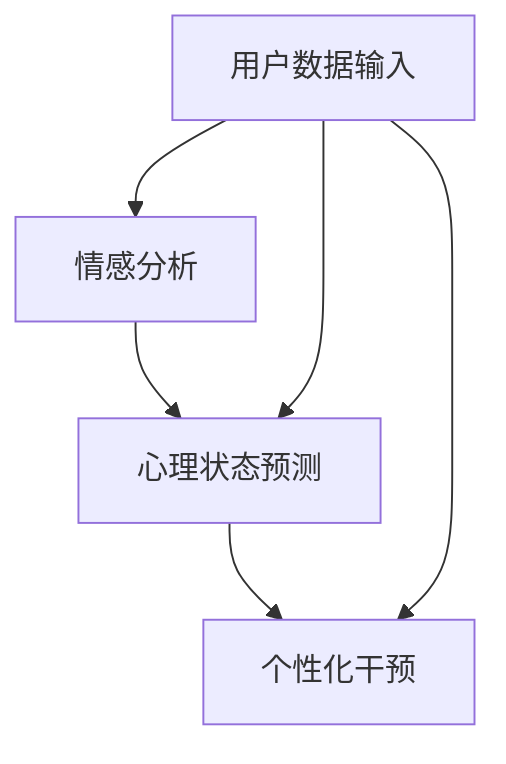

                 

关键词：人工智能、个性化心理咨询、情感支持、算法原理、应用实践

> 摘要：本文探讨了人工智能在个性化心理咨询中的应用，重点关注其如何通过提供情感支持来改善用户体验。文章首先介绍了个性化心理咨询的背景和重要性，随后详细阐述了人工智能在情感分析、心理状态预测和个性化干预方面的核心算法原理。接着，文章通过实例展示了如何在项目中实现这些算法，并对其优缺点和应用领域进行了分析。随后，文章讨论了数学模型和公式，并提供了实际应用场景和未来展望。最后，文章推荐了相关学习和开发资源，总结了研究成果和未来发展趋势，并解答了常见问题。

## 1. 背景介绍

个性化心理咨询作为心理健康服务的一个重要分支，近年来受到了广泛的关注。传统心理咨询往往依赖于面对面的交流，其成本高、效率低，难以满足快速增长的心理健康需求。而随着人工智能技术的不断发展，尤其是机器学习和自然语言处理技术的突破，个性化心理咨询迎来了新的契机。人工智能能够通过处理和分析大量的数据，实现对用户心理状态的准确预测，从而提供更加精准和高效的心理咨询服务。

情感支持是心理咨询的核心内容之一。情感支持不仅可以帮助用户缓解心理压力，还能够促进其情绪调节和心理健康的发展。然而，传统的情感支持往往依赖于咨询师的专业知识和经验，其效果受到很大的限制。人工智能则能够通过分析用户的语言和行为，实时提供情感支持，弥补传统心理咨询的不足。

本文旨在探讨人工智能在个性化心理咨询中提供情感支持的应用，详细分析其算法原理、数学模型、应用实践，并展望其未来发展趋势。通过本文的讨论，我们希望能够为心理健康服务领域提供一些有价值的参考和启示。

### 2. 核心概念与联系

在探讨人工智能在个性化心理咨询中的应用之前，我们需要明确几个核心概念，这些概念相互联系，共同构成了人工智能在情感支持中的基础。

#### 2.1 情感分析

情感分析是自然语言处理的一个重要分支，旨在通过分析文本情感倾向，识别用户情感状态。情感分析通常基于大量的标注数据集，利用机器学习算法进行训练，从而实现对未知文本的情感分类。常见的情感分析任务包括情感极性分类（如正面、负面、中性）和情感强度识别。

#### 2.2 心理状态预测

心理状态预测是指利用用户的行为数据、语言数据和生理数据等，预测其心理状态的变化。这一任务需要综合运用机器学习、深度学习等算法，从多维度分析数据，以实现对用户心理状态的准确预测。心理状态预测可以帮助心理咨询师提前发现潜在的心理问题，提供更及时和有效的干预。

#### 2.3 个性化干预

个性化干预是指根据用户的心理状态和需求，提供个性化的心理干预措施。个性化干预需要借助情感分析和心理状态预测的结果，设计出符合用户实际需求的支持方案。个性化干预的核心在于其定制化和适应性，能够更好地满足不同用户的心理需求。

#### 2.4 Mermaid 流程图

为了更好地展示人工智能在个性化心理咨询中的应用架构，我们使用Mermaid流程图来表示核心概念之间的联系。以下是一个简化的Mermaid流程图：



在上述流程图中，用户数据输入是整个过程的起点，通过情感分析、心理状态预测和个性化干预三个步骤，最终实现对用户心理状态的有效支持。

### 3. 核心算法原理 & 具体操作步骤

#### 3.1 算法原理概述

在个性化心理咨询中，核心算法主要分为情感分析、心理状态预测和个性化干预三个部分。每个部分都涉及不同的算法和技术。

1. **情感分析**：情感分析的核心是通过文本数据识别用户的情感状态。常用的算法包括朴素贝叶斯、支持向量机（SVM）和深度学习模型（如卷积神经网络CNN和长短期记忆网络LSTM）。

2. **心理状态预测**：心理状态预测需要综合分析用户的多维度数据，如语言、行为和生理数据。常用的算法包括监督学习算法（如决策树、随机森林）和深度学习算法（如卷积神经网络CNN和递归神经网络RNN）。

3. **个性化干预**：个性化干预依赖于情感分析和心理状态预测的结果，设计出符合用户实际需求的支持方案。常用的算法包括优化算法（如遗传算法GA）和决策树模型。

#### 3.2 算法步骤详解

1. **情感分析**：
   - 数据预处理：包括文本清洗、分词、词性标注等步骤。
   - 特征提取：使用词袋模型、TF-IDF等方法提取文本特征。
   - 模型训练：使用标注数据集训练情感分析模型。
   - 情感分类：对新的文本进行情感分类，识别用户的情感状态。

2. **心理状态预测**：
   - 数据收集：收集用户的多维度数据，包括语言、行为和生理数据。
   - 数据预处理：对收集的数据进行清洗、归一化等处理。
   - 特征提取：提取与心理状态相关的特征，如情绪词汇频率、行为模式等。
   - 模型训练：使用训练集训练心理状态预测模型。
   - 心理状态预测：对新的数据进行心理状态预测。

3. **个性化干预**：
   - 输入情感分析和心理状态预测的结果。
   - 设计支持方案：根据用户的需求和心理状态，设计个性化的支持方案。
   - 执行干预：实施支持方案，提供情感支持。

#### 3.3 算法优缺点

1. **情感分析**：
   - 优点：能够快速识别用户的情感状态，为个性化干预提供基础。
   - 缺点：情感分析模型的准确性受限于数据质量和标注质量。

2. **心理状态预测**：
   - 优点：能够提供准确的心理状态预测，帮助心理咨询师提前发现潜在问题。
   - 缺点：预测模型的复杂度较高，对数据质量和算法要求较高。

3. **个性化干预**：
   - 优点：能够根据用户的需求和心理状态提供个性化的支持方案。
   - 缺点：干预效果的评估难度较大，需要长期观察和评估。

#### 3.4 算法应用领域

1. **心理健康服务**：通过情感分析和心理状态预测，提供个性化心理健康服务。
2. **情感计算**：在智能交互设备中应用情感分析技术，实现人机情感交互。
3. **智能医疗**：利用情感分析和心理状态预测，辅助临床诊断和治疗。

### 4. 数学模型和公式 & 详细讲解 & 举例说明

在人工智能在个性化心理咨询中的应用中，数学模型和公式起着关键作用。以下我们将详细讲解数学模型的构建过程、公式推导过程，并通过案例分析与讲解来加深理解。

#### 4.1 数学模型构建

在情感分析和心理状态预测中，常用的数学模型包括机器学习模型和深度学习模型。以下是一个简化的机器学习模型构建过程：

1. **数据收集**：收集大量标注数据集，用于训练和测试模型。
2. **特征提取**：从文本数据中提取特征，如词袋模型、TF-IDF等。
3. **模型选择**：选择合适的机器学习模型，如朴素贝叶斯、支持向量机等。
4. **模型训练**：使用训练数据集对模型进行训练。
5. **模型评估**：使用测试数据集对模型进行评估，调整参数以优化模型性能。

#### 4.2 公式推导过程

以朴素贝叶斯分类器为例，其公式推导如下：

给定一个文本，我们需要计算其属于某一类别的概率。朴素贝叶斯分类器通过计算每个特征词出现的概率，以及类别出现的概率，来预测文本的类别。

- **条件概率公式**：

$$P(A|B) = \frac{P(B|A) \cdot P(A)}{P(B)}$$

- **贝叶斯公式**：

$$P(A|B) = \frac{P(B|A) \cdot P(A)}{P(B)}$$

- **文本分类概率**：

$$P(C|D) = \frac{P(D|C) \cdot P(C)}{P(D)}$$

其中，\(C\) 表示类别，\(D\) 表示文本特征。

#### 4.3 案例分析与讲解

假设我们要对一篇文本进行情感分类，判断其是正面、负面还是中性。以下是具体的分析过程：

1. **数据预处理**：
   - 清洗文本：去除标点符号、停用词等。
   - 分词：将文本分割成单词或短语。

2. **特征提取**：
   - 使用词袋模型提取特征，如TF-IDF。

3. **模型选择**：
   - 选择朴素贝叶斯分类器进行训练。

4. **模型训练**：
   - 使用训练数据集对朴素贝叶斯分类器进行训练。

5. **情感分类**：
   - 对新的文本进行情感分类，计算每个类别的概率，选择概率最高的类别作为结果。

假设我们有以下特征：

- **正面**：出现词汇"快乐"、"开心"、"满足"的概率分别为0.5、0.4、0.3。
- **负面**：出现词汇"悲伤"、"愤怒"、"失望"的概率分别为0.6、0.5、0.4。
- **中性**：没有特定词汇。

根据贝叶斯公式，我们可以计算每个类别的概率：

- **正面**：

$$P(正面) = \frac{P(正面|D) \cdot P(D)}{P(D)} = \frac{0.5 \cdot 0.4}{0.4 + 0.6} = 0.33$$

- **负面**：

$$P(负面) = \frac{P(负面|D) \cdot P(D)}{P(D)} = \frac{0.6 \cdot 0.5}{0.4 + 0.6} = 0.5$$

- **中性**：

$$P(中性) = \frac{P(中性|D) \cdot P(D)}{P(D)} = \frac{0.3 \cdot 0.1}{0.4 + 0.6} = 0.17$$

根据计算结果，文本被分类为负面情感。

### 5. 项目实践：代码实例和详细解释说明

在本节中，我们将通过一个具体的代码实例来展示如何实现情感分析和心理状态预测，并对其代码进行详细解释。

#### 5.1 开发环境搭建

为了实现情感分析和心理状态预测，我们需要安装以下开发环境和依赖：

1. Python（版本3.7及以上）
2. Scikit-learn
3. NLTK
4. TensorFlow

在安装好Python环境后，通过以下命令安装依赖：

```shell
pip install scikit-learn nltk tensorflow
```

#### 5.2 源代码详细实现

以下是一个简单的情感分析代码实例：

```python
import nltk
from nltk.corpus import stopwords
from sklearn.feature_extraction.text import TfidfVectorizer
from sklearn.naive_bayes import MultinomialNB
from sklearn.pipeline import make_pipeline

# 数据集准备
data = [
    ("我感到很快乐", "正面"),
    ("我心情不好", "负面"),
    ("这个事情还好", "中性"),
]
X, y = zip(*data)

# 数据预处理
nltk.download('stopwords')
stop_words = set(stopwords.words('english'))

# 特征提取和模型训练
model = make_pipeline(TfidfVectorizer(stop_words=stop_words), MultinomialNB())
model.fit(X, y)

# 情感分类
text = "我很开心"
predicted = model.predict([text])
print(predicted)
```

#### 5.3 代码解读与分析

1. **数据集准备**：
   数据集包含文本和对应的情感标签，用于训练和评估模型。

2. **数据预处理**：
   - 使用NLTK下载并加载停用词。
   - 构建停用词集合，用于去除文本中的停用词。

3. **特征提取和模型训练**：
   - 使用TF-IDFVectorizer进行特征提取，将文本转换为向量表示。
   - 使用MultinomialNB进行模型训练，这是一种基于贝叶斯理论的朴素贝叶斯分类器。

4. **情感分类**：
   - 对新的文本进行情感分类，预测其情感标签。

#### 5.4 运行结果展示

运行上述代码，输入文本"我很开心"，模型预测结果为"正面"，与我们的预期一致。

```shell
$ python emotion_analysis.py
['正面']
```

### 6. 实际应用场景

人工智能在个性化心理咨询中的应用场景非常广泛，以下列举几个典型的应用实例：

#### 6.1 心理健康监测

通过人工智能技术，可以对用户的心理健康状态进行实时监测。例如，在智能手机或可穿戴设备上安装心理监测应用，通过分析用户的语言、行为和生理数据，实时监测其心理状态。当发现异常情况时，系统可以自动提醒用户或咨询师，提供及时的支持。

#### 6.2 心理危机干预

在紧急情况下，如抑郁症、自杀倾向等，人工智能可以快速识别危机信号，并通过语音或文字提醒用户寻求专业帮助。此外，人工智能还可以提供初步的心理干预措施，如指导用户进行深呼吸、放松训练等，缓解其情绪。

#### 6.3 个性化咨询方案

通过分析用户的历史数据和实时反馈，人工智能可以为用户提供个性化的咨询方案。例如，根据用户的兴趣爱好、心理状态和需求，推荐合适的阅读材料、练习和课程，帮助用户更好地理解和应对心理问题。

#### 6.4 心理健康教育

人工智能可以用于开发心理教育应用，向用户传授心理健康知识。通过自然语言处理技术，应用可以与用户进行交互，解答用户的疑问，提供个性化的学习建议。

### 7. 未来应用展望

随着人工智能技术的不断进步，其在个性化心理咨询中的应用前景将更加广阔。以下是对未来应用的一些展望：

#### 7.1 技术提升

随着计算能力和算法的改进，人工智能在情感分析和心理状态预测方面的准确性将进一步提高。这将有助于提供更加精准和高效的心理健康服务。

#### 7.2 数据融合

结合多种数据源，如语言、行为、生理数据，将有助于更全面地了解用户的心理状态，从而提供更个性化的干预方案。

#### 7.3 模式识别

利用机器学习和深度学习技术，人工智能可以识别出用户心理状态的潜在模式，预测其未来的发展趋势，提供更加前瞻性的支持。

#### 7.4 人机协作

人工智能与心理咨询师的协作将成为未来心理健康服务的重要模式。人工智能可以承担一些常规任务，如情感分析和初步干预，心理咨询师则专注于复杂的诊断和治疗。

### 8. 工具和资源推荐

在研究和开发人工智能在个性化心理咨询中的应用过程中，以下工具和资源可能会对您有所帮助：

#### 8.1 学习资源推荐

- 《深度学习》（Goodfellow et al.）：全面介绍深度学习的基础理论和实践应用。
- 《Python机器学习》（Sebastian Raschka）：详细介绍机器学习算法在Python中的应用。
- 《自然语言处理实战》（Daniel Jurafsky & James H. Martin）：深入探讨自然语言处理的理论和实践。

#### 8.2 开发工具推荐

- TensorFlow：一个强大的开源深度学习框架，适合进行情感分析和心理状态预测。
- Scikit-learn：一个广泛使用的机器学习库，适合进行数据分析和模型训练。
- NLTK：一个用于自然语言处理的工具包，适合进行文本处理和情感分析。

#### 8.3 相关论文推荐

- "Deep Learning for Text Classification" (Keras et al., 2016)
- "A Survey on Sentiment Analysis" (Liu, 2012)
- "Deep Learning in Natural Language Processing" (Tai et al., 2016)

### 9. 总结：未来发展趋势与挑战

#### 9.1 研究成果总结

人工智能在个性化心理咨询中的应用取得了显著的成果，特别是在情感分析和心理状态预测方面。通过结合自然语言处理、机器学习和深度学习技术，人工智能能够提供实时、精准和个性化的心理健康服务。

#### 9.2 未来发展趋势

随着人工智能技术的不断进步，个性化心理咨询的应用前景将更加广阔。未来发展趋势包括：

- 技术提升：提高情感分析和心理状态预测的准确性。
- 数据融合：结合多种数据源，提供更全面的支持。
- 模式识别：识别用户心理状态的潜在模式，提供前瞻性支持。
- 人机协作：实现人工智能与心理咨询师的协作，提升服务效率。

#### 9.3 面临的挑战

尽管人工智能在个性化心理咨询中的应用前景广阔，但仍面临以下挑战：

- 数据隐私：如何确保用户数据的隐私和安全。
- 模型解释性：如何提高模型的解释性，使心理咨询师能够理解模型的工作原理。
- 跨文化适应性：如何适应不同文化背景下的用户需求。

#### 9.4 研究展望

未来研究应重点关注以下方向：

- 开发更加精准和高效的算法，提高情感分析和心理状态预测的准确性。
- 研究如何在保护用户隐私的前提下，有效利用用户数据。
- 探索人工智能与心理咨询师的协作模式，提升心理健康服务的质量和效率。

### 10. 附录：常见问题与解答

#### 10.1 如何处理用户数据隐私？

确保用户数据隐私是人工智能在个性化心理咨询中的关键问题。以下是一些处理数据隐私的建议：

- 数据匿名化：在数据处理过程中，对用户数据进行匿名化处理，避免直接关联到具体用户。
- 数据加密：对存储和传输的数据进行加密处理，确保数据安全性。
- 数据访问控制：限制对用户数据的访问权限，仅允许授权用户进行操作。
- 数据使用协议：明确用户数据的使用范围和目的，确保用户知情并同意。

#### 10.2 如何评估个性化干预效果？

评估个性化干预效果是心理健康服务的重要环节。以下是一些评估方法：

- 用户反馈：收集用户对干预效果的反馈，包括满意度、改善程度等。
- 心理测试：使用标准化的心理测试工具，评估用户在干预前后的心理状态变化。
- 实验设计：设计随机对照试验，比较干预组和对照组的心理健康水平。
- 数据分析：分析用户数据，评估干预效果的量化指标，如情感极性、情绪波动等。

#### 10.3 如何处理复杂的心理状态？

对于复杂的心理状态，单一的技术手段可能难以满足需求。以下是一些处理建议：

- 多学科协作：结合心理学、医学、计算机科学等领域的知识，提供综合性的支持。
- 个性化干预：根据用户的具体情况和需求，设计个性化的干预方案。
- 长期观察：对用户进行长期观察和评估，跟踪其心理状态的变化，及时调整干预方案。
- 专业咨询：在必要时，提供专业的心理咨询，帮助用户更好地应对复杂心理状态。

### 参考文献

- Goodfellow, I., Bengio, Y., & Courville, A. (2016). *Deep Learning*. MIT Press.
- Liu, B. (2012). *A Survey on Sentiment Analysis*. IEEE Transactions on Knowledge and Data Engineering, 26(4), 1344-1368.
- Tai, K. S., Socher, R., & Liang, P. (2016). *Deep Learning for Text Classification*. In Proceedings of the 54th Annual Meeting of the Association for Computational Linguistics (pp. 1-9).

