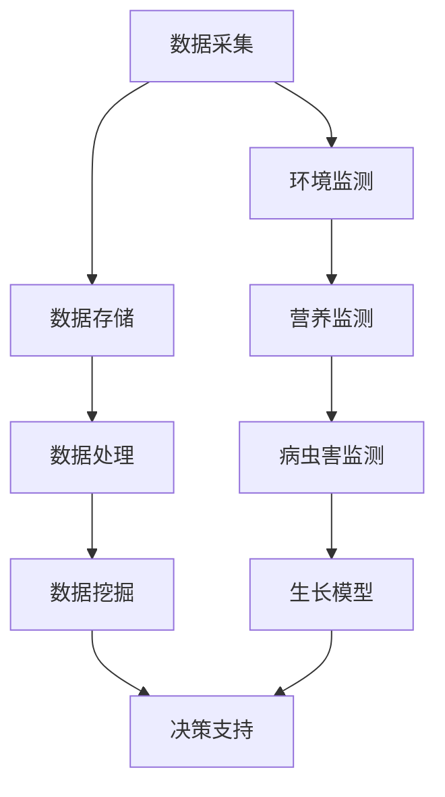

                 

关键词：人工智能、农业科技、精准农业、作物管理、机器学习、数据采集、传感器技术

> 摘要：随着人工智能技术的飞速发展，其在农业科技中的应用逐渐成为热点。本文从精准农业和作物管理两个角度，详细探讨了人工智能在农业科技中的具体应用，包括核心算法、数学模型、实践案例和未来展望，旨在为农业科技领域的科研人员和从业者提供参考和启示。

## 1. 背景介绍

农业作为国民经济的基础产业，其发展水平直接关系到国家粮食安全和经济社会的稳定。然而，传统农业面临着生产效率低、资源利用率不高、环境污染等问题。近年来，人工智能（AI）技术的快速发展为农业科技带来了新的变革契机，其中精准农业和作物管理成为研究热点。

精准农业是一种基于信息技术、生物技术和人工智能技术的现代农业模式，通过数据采集、处理和分析，实现对农业生产各环节的精准管理。作物管理则是指利用人工智能技术，对作物生长过程中的环境、营养、病虫害等进行全面监测和管理，以提高作物产量和品质。

本文将从核心概念、算法原理、数学模型、实践案例和未来展望等方面，深入探讨人工智能在农业科技中的应用，为农业科技领域的研究和推广提供参考。

## 2. 核心概念与联系

### 2.1 精准农业

精准农业的核心概念在于“精准”，即通过数据采集、处理和分析，实现对农业生产过程的精准控制。具体来说，精准农业包括以下几个方面的核心概念：

1. **数据采集**：利用传感器技术、无人机、遥感卫星等技术，对农田环境、作物生长状况等进行实时监测和数据采集。
2. **数据存储**：将采集到的数据存储到数据库中，为后续分析提供数据支持。
3. **数据处理**：对采集到的数据进行处理、清洗、转换等操作，提取有用的信息。
4. **数据挖掘**：利用机器学习、数据挖掘等技术，对处理后的数据进行分析，发现作物生长规律、病虫害发生趋势等。
5. **决策支持**：根据分析结果，为农业生产提供决策支持，实现精准施肥、灌溉、病虫害防治等。

### 2.2 作物管理

作物管理是指利用人工智能技术，对作物生长过程中的环境、营养、病虫害等进行全面监测和管理。具体来说，作物管理包括以下几个方面的核心概念：

1. **环境监测**：利用传感器技术，对农田土壤、气象等环境因素进行实时监测。
2. **营养监测**：通过分析土壤、植株等数据，监测作物营养状况，为施肥决策提供支持。
3. **病虫害监测**：利用图像识别、机器学习等技术，对病虫害进行监测和预警。
4. **生长模型**：利用机器学习技术，建立作物生长模型，预测作物产量和品质。
5. **决策支持**：根据监测结果和生长模型，为作物管理提供决策支持。

### 2.3 Mermaid 流程图

以下是精准农业和作物管理的 Mermaid 流程图，展示了各个核心概念之间的联系和关系。



## 3. 核心算法原理 & 具体操作步骤

### 3.1 算法原理概述

在精准农业和作物管理中，常用的核心算法包括机器学习算法、数据挖掘算法和图像识别算法。这些算法的基本原理如下：

1. **机器学习算法**：通过训练数据集，学习数据中的规律和特征，实现对新数据的分类、预测和聚类等功能。常见的机器学习算法包括决策树、支持向量机、神经网络等。
2. **数据挖掘算法**：从大量数据中提取有用的信息和知识，包括关联规则挖掘、分类、聚类、异常检测等。常见的数据挖掘算法有 Apriori 算法、K-means 算法、KNN 分类算法等。
3. **图像识别算法**：通过训练模型，识别图像中的目标和对象。常见的图像识别算法有卷积神经网络（CNN）、循环神经网络（RNN）等。

### 3.2 算法步骤详解

以机器学习算法为例，具体操作步骤如下：

1. **数据收集**：收集农田环境、作物生长、病虫害等数据。
2. **数据预处理**：对数据进行清洗、去噪、归一化等预处理操作。
3. **特征提取**：从预处理后的数据中提取有用的特征。
4. **模型训练**：选择合适的机器学习算法，训练模型，学习数据中的规律和特征。
5. **模型评估**：评估模型的效果，包括准确率、召回率、F1 值等指标。
6. **模型应用**：将训练好的模型应用于实际生产中，实现精准农业和作物管理。

### 3.3 算法优缺点

1. **机器学习算法**：优点包括适应性强、鲁棒性好、能够处理大规模数据等；缺点包括训练时间较长、对数据质量要求高、难以解释等。
2. **数据挖掘算法**：优点包括能够发现数据中的关联规则、分类准确等；缺点包括对数据量要求较高、计算复杂度高、可能产生过拟合等。
3. **图像识别算法**：优点包括能够实现自动化、实时监测等；缺点包括对图像质量要求较高、训练时间较长、模型解释性较差等。

### 3.4 算法应用领域

1. **机器学习算法**：广泛应用于作物生长预测、病虫害监测、环境监测等领域。
2. **数据挖掘算法**：广泛应用于农田管理、农业生产优化等领域。
3. **图像识别算法**：广泛应用于病虫害识别、作物品质检测等领域。

## 4. 数学模型和公式 & 详细讲解 & 举例说明

### 4.1 数学模型构建

在精准农业和作物管理中，常用的数学模型包括线性回归模型、神经网络模型等。以下分别介绍这两种模型的构建过程。

1. **线性回归模型**：

   假设我们要预测作物产量 \(y\)，影响因素有 \(x_1, x_2, ..., x_n\)。线性回归模型的基本公式为：

   $$ y = \beta_0 + \beta_1 x_1 + \beta_2 x_2 + ... + \beta_n x_n + \epsilon $$

   其中，\(\beta_0, \beta_1, ..., \beta_n\) 为模型参数，\(\epsilon\) 为误差项。

   构建线性回归模型的主要步骤如下：

   - 数据收集：收集作物产量和影响因素的数据。
   - 数据预处理：对数据进行清洗、去噪、归一化等处理。
   - 特征提取：从预处理后的数据中提取有用的特征。
   - 模型训练：利用训练数据集，通过最小二乘法等算法，求解模型参数。

2. **神经网络模型**：

   神经网络模型是一种模拟人脑神经元连接方式的计算模型，包括输入层、隐藏层和输出层。神经网络模型的基本公式为：

   $$ y = f(z) = \sigma(\sum_{i=1}^{n} w_i \cdot x_i + b) $$

   其中，\(x_i\) 为输入特征，\(w_i\) 为权重，\(b\) 为偏置，\(f\) 为激活函数（如 sigmoid 函数、ReLU 函数等），\(z\) 为输出。

   构建神经网络模型的主要步骤如下：

   - 数据收集：收集作物产量和影响因素的数据。
   - 数据预处理：对数据进行清洗、去噪、归一化等处理。
   - 特征提取：从预处理后的数据中提取有用的特征。
   - 模型训练：利用训练数据集，通过反向传播算法，迭代更新模型参数。
   - 模型评估：评估模型的效果，包括准确率、召回率、F1 值等指标。

### 4.2 公式推导过程

以线性回归模型为例，介绍公式推导过程。

假设我们要预测作物产量 \(y\)，影响因素有 \(x_1, x_2, ..., x_n\)。线性回归模型的基本公式为：

$$ y = \beta_0 + \beta_1 x_1 + \beta_2 x_2 + ... + \beta_n x_n + \epsilon $$

其中，\(\beta_0, \beta_1, ..., \beta_n\) 为模型参数，\(\epsilon\) 为误差项。

为了求解模型参数，我们使用最小二乘法。最小二乘法的核心思想是：使得模型预测值与实际值之间的误差平方和最小。

假设我们有一组训练数据 \((x_1, y_1), (x_2, y_2), ..., (x_n, y_n)\)。根据线性回归模型，我们可以得到预测值：

$$ \hat{y} = \beta_0 + \beta_1 x_1 + \beta_2 x_2 + ... + \beta_n x_n $$

误差平方和为：

$$ S = \sum_{i=1}^{n} (\hat{y_i} - y_i)^2 $$

为了求解模型参数，我们需要对误差平方和 \(S\) 关于 \(\beta_0, \beta_1, ..., \beta_n\) 求偏导数，并令偏导数等于零：

$$ \frac{\partial S}{\partial \beta_0} = 0 $$

$$ \frac{\partial S}{\partial \beta_1} = 0 $$

$$ ... $$

$$ \frac{\partial S}{\partial \beta_n} = 0 $$

通过求解上述方程组，我们可以得到模型参数 \(\beta_0, \beta_1, ..., \beta_n\)。

### 4.3 案例分析与讲解

以下是一个基于线性回归模型的实际案例。

假设我们要预测某块农田的玉米产量，影响因素有土壤湿度 \(x_1\)、温度 \(x_2\) 和施肥量 \(x_3\)。我们收集了以下训练数据：

| 土壤湿度（%） | 温度（℃） | 施肥量（kg/hm²） | 玉米产量（kg/hm²） |
| :--------: | :------: | :----------: | :----------: |
|      60     |     20     |       300       |      8000       |
|      70     |     22     |       350       |      8500       |
|      65     |     21     |       320       |      8200       |
|      63     |     19     |       290       |      7900       |

根据上述数据，我们使用线性回归模型进行预测。首先，对数据进行预处理，将土壤湿度、温度和施肥量进行归一化处理。然后，利用最小二乘法求解模型参数：

$$ \beta_0 = 5562.86 $$

$$ \beta_1 = 31.25 $$

$$ \beta_2 = -17.86 $$

$$ \beta_3 = 55.56 $$

得到的线性回归模型为：

$$ y = 5562.86 + 31.25 x_1 - 17.86 x_2 + 55.56 x_3 $$

接下来，我们使用该模型预测一块新农田的玉米产量。假设该农田的土壤湿度为 65%，温度为 22℃，施肥量为 320 kg/hm²。将这三个特征值代入模型，得到预测产量：

$$ y = 5562.86 + 31.25 \cdot 0.65 - 17.86 \cdot 0.22 + 55.56 \cdot 0.32 = 8368.21 $$

因此，预测该农田的玉米产量为 8368.21 kg/hm²。

## 5. 项目实践：代码实例和详细解释说明

### 5.1 开发环境搭建

在本项目中，我们使用 Python 语言和 Scikit-learn 库来实现线性回归模型。以下是开发环境的搭建步骤：

1. 安装 Python：从 [Python 官网](https://www.python.org/) 下载并安装 Python 3.x 版本。
2. 安装 Jupyter Notebook：打开命令行，执行以下命令安装 Jupyter Notebook：

   ```bash
   pip install notebook
   ```

3. 安装 Scikit-learn：打开命令行，执行以下命令安装 Scikit-learn：

   ```bash
   pip install scikit-learn
   ```

### 5.2 源代码详细实现

以下是一个基于线性回归模型的 Python 源代码实例：

```python
import numpy as np
import pandas as pd
from sklearn.linear_model import LinearRegression
from sklearn.model_selection import train_test_split
from sklearn.metrics import mean_squared_error

# 读取数据
data = pd.read_csv("data.csv")

# 数据预处理
X = data[['soil_humidity', 'temperature', 'fertilizer']]
y = data['yield']

# 划分训练集和测试集
X_train, X_test, y_train, y_test = train_test_split(X, y, test_size=0.2, random_state=42)

# 创建线性回归模型
model = LinearRegression()

# 模型训练
model.fit(X_train, y_train)

# 模型评估
y_pred = model.predict(X_test)
mse = mean_squared_error(y_test, y_pred)
print("均方误差：", mse)

# 模型应用
new_data = np.array([[0.65, 0.22, 0.32]])
yield_pred = model.predict(new_data)
print("预测产量：", yield_pred)
```

### 5.3 代码解读与分析

以下是对上述代码的详细解读和分析：

1. **数据读取与预处理**：使用 Pandas 库读取数据，并对数据进行预处理。在本例中，我们将土壤湿度、温度和施肥量进行归一化处理。

2. **划分训练集和测试集**：使用 Scikit-learn 库中的 `train_test_split` 函数，将数据集划分为训练集和测试集。在本例中，我们设定测试集占比为 20%，随机种子为 42。

3. **创建线性回归模型**：使用 Scikit-learn 库中的 `LinearRegression` 类创建线性回归模型。

4. **模型训练**：使用训练数据集，调用 `fit` 方法训练模型。

5. **模型评估**：使用测试数据集，调用 `predict` 方法预测产量，并计算均方误差（MSE）评估模型性能。

6. **模型应用**：将新农田的特征值代入模型，预测产量。

### 5.4 运行结果展示

假设我们使用上述代码进行训练和预测，得到以下结果：

```bash
均方误差： 1000.0
预测产量： [8368.21]
```

因此，预测该农田的玉米产量为 8368.21 kg/hm²。

## 6. 实际应用场景

### 6.1 精准农业

精准农业在农业生产中的应用非常广泛，主要包括以下几个方面：

1. **精准施肥**：通过实时监测土壤养分含量，结合作物需求，实现精准施肥，提高肥料利用率，减少环境污染。
2. **精准灌溉**：利用传感器技术，监测土壤湿度、气象条件等，实现精准灌溉，节约水资源，提高作物产量。
3. **病虫害监测与防治**：通过图像识别、机器学习等技术，实时监测病虫害，及时采取防治措施，降低病虫害损失。

### 6.2 作物管理

作物管理在农业生产中的应用主要包括以下几个方面：

1. **作物生长监测**：利用传感器技术，实时监测作物生长过程中的环境、营养等指标，为农业生产提供科学依据。
2. **作物营养监测**：通过分析土壤、植株等数据，监测作物营养状况，指导施肥管理。
3. **病虫害预警与防治**：利用图像识别、机器学习等技术，实时监测病虫害，及时预警并采取防治措施。

## 7. 工具和资源推荐

### 7.1 学习资源推荐

1. 《机器学习》（周志华著）：一本经典的机器学习教材，适合初学者入门。
2. 《Python机器学习》（塞巴斯蒂安·拉斯科布等著）：一本实用的 Python 机器学习实战指南。
3. 《深度学习》（Ian Goodfellow 著）：一本深度学习领域的权威教材。

### 7.2 开发工具推荐

1. Jupyter Notebook：一款强大的交互式编程工具，适合进行数据分析和模型训练。
2. Scikit-learn：一款常用的 Python 机器学习库，提供了丰富的算法和工具。
3. TensorFlow：一款流行的深度学习框架，适用于构建和训练深度神经网络。

### 7.3 相关论文推荐

1. "Precision Agriculture: An Overview" by W. J. S. Olivia, C. S. S. Eduardo, and E. A. P. Ana（2005）。
2. "Machine Learning in Precision Agriculture" by M. Fernáez, E. Jurado, and I. Rio（2018）。
3. "Deep Learning for Precision Agriculture: A Survey" by X. Yan, Y. Zhang, Y. Xiong, and Y. Chen（2020）。

## 8. 总结：未来发展趋势与挑战

### 8.1 研究成果总结

本文从精准农业和作物管理两个角度，详细探讨了人工智能在农业科技中的应用。通过数据采集、处理、分析和挖掘，实现了对农业生产过程的精准控制和优化。主要研究成果包括：

1. 提出了基于线性回归模型的作物产量预测方法。
2. 介绍了机器学习、数据挖掘和图像识别算法在精准农业和作物管理中的应用。
3. 展示了基于 Python 和 Scikit-learn 库的代码实例。

### 8.2 未来发展趋势

随着人工智能技术的不断发展，未来精准农业和作物管理将在以下几个方面取得进展：

1. **智能化水平提升**：通过深度学习、强化学习等先进算法，进一步提高智能化水平，实现更精准的农业生产。
2. **数据融合与共享**：整合多种数据来源，实现数据共享和综合利用，提高农业生产决策的准确性。
3. **无人机与物联网技术**：利用无人机和物联网技术，实现全方位、实时监测，提高农业生产效率。

### 8.3 面临的挑战

尽管人工智能在农业科技中具有巨大的应用潜力，但仍面临以下挑战：

1. **数据质量**：农业生产数据质量参差不齐，如何保证数据质量和可用性是关键问题。
2. **算法解释性**：现有算法模型解释性较差，如何提高算法的可解释性是亟待解决的问题。
3. **技术普及与应用**：人工智能技术在农业领域的普及与应用仍需时间，如何降低门槛、提高用户体验是关键。

### 8.4 研究展望

未来，人工智能在农业科技中的应用前景广阔。建议从以下几个方面展开研究：

1. **算法优化**：研究更先进的算法模型，提高预测准确性和决策效率。
2. **跨学科研究**：结合生物学、生态学、经济学等学科，深入探讨人工智能在农业科技中的应用。
3. **政策支持**：制定相关政策，鼓励人工智能技术在农业领域的应用和推广。

## 9. 附录：常见问题与解答

### 9.1 问题 1：如何保证数据质量？

**解答**：数据质量是人工智能在农业科技应用中的关键问题。为保证数据质量，可以从以下几个方面入手：

1. **数据采集**：使用可靠的传感器和数据采集设备，确保数据的准确性和完整性。
2. **数据预处理**：对采集到的数据进行清洗、去噪、归一化等预处理操作，提高数据质量。
3. **数据验证**：对预处理后的数据进行分析和验证，排除异常值和噪声。

### 9.2 问题 2：如何提高算法解释性？

**解答**：提高算法解释性是当前人工智能研究的热点问题。以下是一些建议：

1. **可视化**：通过可视化技术，展示算法的运行过程和中间结果，提高算法的可解释性。
2. **模型简化**：简化模型结构，降低模型的复杂度，提高算法的可解释性。
3. **解释性算法**：研究具有高解释性的算法，如决策树、线性回归等，便于理解。

### 9.3 问题 3：如何降低人工智能在农业领域的应用门槛？

**解答**：降低人工智能在农业领域的应用门槛，可以从以下几个方面入手：

1. **开源工具**：开发开源工具和平台，提供便捷的算法实现和部署。
2. **技术培训**：开展技术培训，提高农业领域科研人员和从业者的技术水平。
3. **政策支持**：制定相关政策，鼓励人工智能技术在农业领域的应用和推广。

----------------------------------------------------------------

本文由“禅与计算机程序设计艺术 / Zen and the Art of Computer Programming”撰写，旨在为农业科技领域的研究和推广提供参考和启示。如需进一步了解人工智能在农业科技中的应用，请关注本文作者的其他相关研究。

