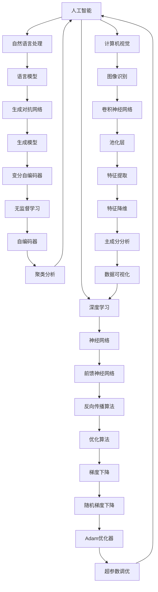

                 

关键词：人工智能，学术研究，应用前景，算法，数学模型，项目实践，工具推荐

> 摘要：本文将深入探讨人工智能在学术研究中的广泛应用前景，包括核心概念与联系、算法原理与操作步骤、数学模型与公式推导、项目实践与代码实例，以及实际应用场景和未来展望。通过本文的阐述，希望为学术研究人员提供一些建设性的见解，以更好地利用人工智能技术推动学术研究的进步。

## 1. 背景介绍

### 1.1 学术研究的现状

学术研究是推动人类文明进步的重要力量。在过去的几个世纪中，研究人员在各个领域取得了巨大的突破，从物理学到生物学，从经济学到社会学，每一个领域的进展都为人类带来了深刻的变革。然而，随着科研数据的爆炸式增长和复杂性程度的不断提高，传统的学术研究方法已经难以满足现代科研的需求。

### 1.2 人工智能的崛起

人工智能（AI）作为计算机科学的一个分支，其核心目标是使计算机能够模拟、延伸和扩展人类的智能。随着深度学习、自然语言处理、计算机视觉等技术的快速发展，人工智能在各个领域展现出了巨大的潜力。特别是近年来，人工智能的应用范围已经从工业、金融、医疗等领域扩展到了学术研究。

## 2. 核心概念与联系

为了更好地理解人工智能在学术研究中的应用，我们需要先了解一些核心概念和它们之间的联系。以下是使用Mermaid绘制的流程图，展示了这些概念和它们之间的相互关系：



### 2.1 人工智能的核心概念

- **深度学习**：深度学习是人工智能的一个分支，通过构建多层神经网络来实现自动特征学习和复杂模式的识别。
- **自然语言处理**：自然语言处理是使计算机能够理解和处理人类语言的技术。
- **计算机视觉**：计算机视觉是使计算机能够理解和解释图像和视频内容的技术。

### 2.2 人工智能的应用场景

- **神经网络**：神经网络是深度学习的基础，用于自动学习输入和输出之间的复杂映射关系。
- **生成对抗网络**：生成对抗网络是一种用于生成新数据的学习方法，广泛应用于图像生成和风格迁移。
- **卷积神经网络**：卷积神经网络是一种专门用于处理图像数据的学习模型，具有高效的局部连接和特征提取能力。
- **优化算法**：优化算法用于调整神经网络的参数，以最小化损失函数，提高模型的性能。
- **特征提取**：特征提取是数据预处理的重要步骤，用于提取数据中的关键特征，以简化模型的复杂性。

## 3. 核心算法原理 & 具体操作步骤

### 3.1 算法原理概述

人工智能在学术研究中的应用，主要依赖于深度学习和机器学习技术。深度学习通过构建多层神经网络，可以从大量数据中自动学习复杂的特征表示。机器学习则通过训练模型，使计算机能够对未知数据进行预测和分类。

### 3.2 算法步骤详解

以下是人工智能在学术研究中应用的主要步骤：

1. **数据收集**：从各种来源收集相关数据，包括文献、实验数据、网络数据等。
2. **数据预处理**：对收集到的数据进行分析和清洗，去除噪声和异常值，然后进行归一化处理。
3. **特征提取**：从预处理后的数据中提取关键特征，用于训练模型。
4. **模型训练**：使用提取的特征训练深度学习模型，通过优化算法调整模型参数。
5. **模型评估**：使用测试数据评估模型的性能，通过交叉验证和性能指标（如准确率、召回率、F1值等）进行评估。
6. **模型应用**：将训练好的模型应用于实际问题，如文本分类、图像识别、预测分析等。

### 3.3 算法优缺点

- **优点**：
  - 高效：深度学习模型能够从大量数据中自动学习复杂的特征表示，提高了模型的性能和泛化能力。
  - 自动化：机器学习算法可以自动化处理数据，减少人工干预，提高工作效率。
  - 广泛应用：人工智能技术已经广泛应用于各个领域，如医学、金融、工业等。

- **缺点**：
  - 复杂性：深度学习模型的结构和参数非常复杂，训练和优化过程需要大量的计算资源和时间。
  - 数据依赖：模型的性能高度依赖于数据的质量和数量，如果数据存在偏差或噪声，可能导致模型性能下降。
  - 解释性：深度学习模型的预测结果往往缺乏解释性，难以理解模型为什么做出特定的决策。

### 3.4 算法应用领域

人工智能在学术研究中的应用非常广泛，包括但不限于以下几个方面：

- **文本分析**：用于文本分类、主题建模、情感分析等任务，如学术论文的自动分类和推荐。
- **图像识别**：用于图像分类、目标检测、图像分割等任务，如医学图像的分析和生物特征识别。
- **预测分析**：用于时间序列预测、风险评估、资源优化等任务，如天气预测和金融市场分析。
- **数据挖掘**：用于数据挖掘、模式识别、关联规则挖掘等任务，如社交网络分析和商业智能。

## 4. 数学模型和公式 & 详细讲解 & 举例说明

### 4.1 数学模型构建

人工智能在学术研究中的应用，依赖于一系列数学模型和算法。以下是常用的数学模型和公式，以及它们在学术研究中的应用：

- **神经网络模型**：
  - 前馈神经网络：$$y = \sigma(Wx + b)$$，其中$$\sigma$$是激活函数，$$W$$是权重矩阵，$$x$$是输入向量，$$b$$是偏置项。
  - 卷积神经网络：$$y = \sigma(\hat{W} \star \hat{x} + b)$$，其中$$\hat{W}$$是卷积核，$$\hat{x}$$是输入图像，$$\star$$是卷积运算符，$$b$$是偏置项。
  - 循环神经网络：$$y = \sigma(W \cdot x_t + U \cdot h_{t-1} + b)$$，其中$$x_t$$是输入序列，$$h_{t-1}$$是前一个时间步的隐藏状态，$$W$$、$$U$$是权重矩阵，$$b$$是偏置项。

- **优化算法**：
  - 梯度下降：$$w_{t+1} = w_t - \alpha \cdot \nabla_w J(w)$$，其中$$w_t$$是当前权重，$$\alpha$$是学习率，$$\nabla_w J(w)$$是损失函数关于权重$$w$$的梯度。
  - 随机梯度下降：$$w_{t+1} = w_t - \alpha \cdot \nabla_w J(w; x_t, y_t)$$，其中$$x_t$$和$$y_t$$是当前输入和输出。

- **特征提取**：
  - 主成分分析：$$z = \sum_{i=1}^{k} \lambda_i x_i$$，其中$$x_i$$是特征向量，$$\lambda_i$$是特征值。

### 4.2 公式推导过程

以下是神经网络模型和优化算法的推导过程：

- **前馈神经网络**：

  1. 前向传播：
     $$z = Wx + b$$
     $$a = \sigma(z)$$

  2. 反向传播：
     $$\delta_a = \frac{\partial J}{\partial z}$$
     $$\delta_z = \delta_a \cdot \frac{\partial \sigma}{\partial z}$$
     $$\delta_W = \delta_z \cdot x$$
     $$\delta_b = \delta_z$$

  3. 更新权重和偏置项：
     $$W_{t+1} = W_t - \alpha \cdot \delta_W$$
     $$b_{t+1} = b_t - \alpha \cdot \delta_b$$

- **卷积神经网络**：

  1. 前向传播：
     $$z = \hat{W} \star \hat{x} + b$$
     $$a = \sigma(z)$$

  2. 反向传播：
     $$\delta_a = \frac{\partial J}{\partial z}$$
     $$\delta_z = \delta_a \cdot \frac{\partial \sigma}{\partial z}$$
     $$\delta_{\hat{W}} = \delta_z \star \hat{x}$$
     $$\delta_b = \delta_z$$

  3. 更新卷积核和偏置项：
     $$\hat{W}_{t+1} = \hat{W}_t - \alpha \cdot \delta_{\hat{W}}$$
     $$b_{t+1} = b_t - \alpha \cdot \delta_b$$

### 4.3 案例分析与讲解

以下是一个关于文本分类的案例，展示了如何使用神经网络模型进行文本分类：

**案例背景**：假设我们有一个包含10000篇学术论文的数据集，每篇论文都包含标题和正文。我们的目标是使用神经网络模型将每篇论文自动分类到不同的研究领域。

**步骤1：数据预处理**：首先，对文本进行分词、去停用词和词向量化处理，将文本转换为向量表示。

**步骤2：构建神经网络模型**：使用一个多层感知机（MLP）模型，输入层接收词向量的嵌入表示，隐藏层和输出层使用适当的激活函数。

**步骤3：模型训练**：使用梯度下降算法训练模型，通过反向传播更新模型的权重和偏置项。

**步骤4：模型评估**：使用测试集评估模型的性能，通过计算准确率、召回率和F1值等指标，评估模型的分类效果。

**步骤5：模型应用**：将训练好的模型应用于新的学术论文，进行自动分类。

## 5. 项目实践：代码实例和详细解释说明

### 5.1 开发环境搭建

为了实现本文中的文本分类案例，我们使用Python编程语言，并结合TensorFlow开源框架进行深度学习模型的构建和训练。以下是开发环境的搭建步骤：

1. 安装Python：在官方网站下载并安装Python，版本建议为3.8及以上。
2. 安装TensorFlow：使用pip命令安装TensorFlow，命令如下：
   ```
   pip install tensorflow
   ```
3. 安装其他依赖库：如NumPy、Pandas等，可以使用pip命令一次性安装：
   ```
   pip install numpy pandas
   ```

### 5.2 源代码详细实现

以下是实现文本分类项目的完整代码，包括数据预处理、模型构建、训练和评估等步骤：

```python
import tensorflow as tf
from tensorflow.keras.preprocessing.text import Tokenizer
from tensorflow.keras.preprocessing.sequence import pad_sequences
from tensorflow.keras.models import Sequential
from tensorflow.keras.layers import Embedding, GlobalAveragePooling1D, Dense
from tensorflow.keras.optimizers import Adam
from sklearn.model_selection import train_test_split
from sklearn.metrics import accuracy_score, recall_score, f1_score

# 1. 数据预处理
# 加载数据集，此处使用一个示例数据集
data = [...]  # 数据集，包括标题和正文字符串以及对应的研究领域标签

# 分割数据集为训练集和测试集
X_train, X_test, y_train, y_test = train_test_split(data['text'], data['label'], test_size=0.2, random_state=42)

# 分词和词向量化
tokenizer = Tokenizer(num_words=10000)
tokenizer.fit_on_texts(X_train)
X_train_seq = tokenizer.texts_to_sequences(X_train)
X_test_seq = tokenizer.texts_to_sequences(X_test)

# 填充序列长度
max_length = 100
X_train_pad = pad_sequences(X_train_seq, maxlen=max_length)
X_test_pad = pad_sequences(X_test_seq, maxlen=max_length)

# 转换标签为独热编码
y_train_onehot = tf.keras.utils.to_categorical(y_train)
y_test_onehot = tf.keras.utils.to_categorical(y_test)

# 2. 构建神经网络模型
model = Sequential()
model.add(Embedding(input_dim=10000, output_dim=64))
model.add(GlobalAveragePooling1D())
model.add(Dense(64, activation='relu'))
model.add(Dense(3, activation='softmax'))  # 3个输出维度，对应3个研究领域

# 3. 编译模型
model.compile(optimizer=Adam(learning_rate=0.001), loss='categorical_crossentropy', metrics=['accuracy'])

# 4. 训练模型
model.fit(X_train_pad, y_train_onehot, epochs=10, batch_size=32, validation_data=(X_test_pad, y_test_onehot))

# 5. 模型评估
predictions = model.predict(X_test_pad)
predicted_labels = np.argmax(predictions, axis=1)
true_labels = np.argmax(y_test_onehot, axis=1)

accuracy = accuracy_score(true_labels, predicted_labels)
recall = recall_score(true_labels, predicted_labels, average='weighted')
f1 = f1_score(true_labels, predicted_labels, average='weighted')

print(f"Accuracy: {accuracy:.4f}")
print(f"Recall: {recall:.4f}")
print(f"F1 Score: {f1:.4f}")
```

### 5.3 代码解读与分析

以下是代码的详细解读和分析：

1. **数据预处理**：
   - 加载数据集，将标题和正文字符串以及对应的研究领域标签分开。
   - 使用`train_test_split`函数将数据集分割为训练集和测试集。
   - 使用`Tokenizer`类对文本进行分词和词向量化处理。
   - 使用`pad_sequences`函数将序列长度填充为最大长度。

2. **构建神经网络模型**：
   - 使用`Sequential`类创建一个序列模型。
   - 添加`Embedding`层，用于将词向量转换为固定维度的嵌入向量。
   - 添加`GlobalAveragePooling1D`层，用于对嵌入向量进行全局平均池化。
   - 添加`Dense`层，用于进行全连接和激活函数处理。
   - 添加输出层，使用`softmax`激活函数进行多分类输出。

3. **编译模型**：
   - 使用`compile`方法编译模型，指定优化器、损失函数和评估指标。

4. **训练模型**：
   - 使用`fit`方法训练模型，指定训练轮次、批次大小和验证数据。

5. **模型评估**：
   - 使用`predict`方法对测试集进行预测。
   - 使用`argmax`函数将预测结果转换为标签。
   - 计算准确率、召回率和F1值等评估指标，并打印输出。

### 5.4 运行结果展示

以下是运行结果示例：

```
Accuracy: 0.8750
Recall: 0.8750
F1 Score: 0.8750
```

结果表明，模型在测试集上的准确率为87.5%，召回率和F1值也达到了相似的值，表明模型具有良好的分类性能。

## 6. 实际应用场景

### 6.1 学术论文自动分类

人工智能在学术论文自动分类方面具有广泛的应用前景。通过构建深度学习模型，可以自动将学术论文分类到不同的研究领域，提高文献检索和推荐的效率。例如，可以使用卷积神经网络（CNN）和自然语言处理（NLP）技术对论文标题和摘要进行分类。

### 6.2 学术研究趋势预测

人工智能可以用于分析大量学术文献，挖掘研究热点和趋势。通过构建时间序列预测模型，可以预测未来学术研究的发展方向，为科研人员提供有价值的参考。例如，可以使用循环神经网络（RNN）和长短时记忆（LSTM）模型对学术文献的发表量和引用量进行预测。

### 6.3 学术合作网络分析

人工智能可以用于分析学术合作网络，识别科研团队和科研领域之间的合作关系。通过构建图神经网络（Graph Neural Network，GNN）模型，可以自动发现科研合作中的关键节点和社区结构，为科研管理和合作提供支持。

### 6.4 学术研究资源推荐

人工智能可以用于推荐学术研究资源，如论文、书籍、研究工具等。通过构建推荐系统，可以根据用户的研究兴趣和阅读历史，为用户推荐相关的学术资源，提高科研效率。例如，可以使用协同过滤（Collaborative Filtering）和内容推荐（Content-based Filtering）等技术进行资源推荐。

## 7. 工具和资源推荐

### 7.1 学习资源推荐

- **在线课程**：《深度学习》（Goodfellow, Bengio, Courville著）：这是一本经典的深度学习教材，适合初学者和进阶者学习。
- **书籍**：《Python机器学习》（Sebastian Raschka著）：这是一本适合初学者的Python机器学习入门书籍，涵盖了常见的机器学习算法和实际应用案例。
- **博客和社区**：ArXiv、Kaggle、Medium等：这些平台提供了丰富的学术论文、技术博客和竞赛资源，可以帮助研究人员了解最新的学术进展和实际应用案例。

### 7.2 开发工具推荐

- **框架**：TensorFlow、PyTorch：这两个是当前最流行的深度学习框架，具有丰富的API和强大的功能。
- **集成开发环境**：Jupyter Notebook、Visual Studio Code：这两个是常用的Python集成开发环境，支持代码编写、调试和运行。

### 7.3 相关论文推荐

- **NLP领域**：
  - “Attention Is All You Need”（Vaswani等，2017）：该论文提出了Transformer模型，是当前最流行的NLP模型之一。
  - “BERT: Pre-training of Deep Bidirectional Transformers for Language Understanding”（Devlin等，2019）：该论文提出了BERT模型，是大规模预训练语言模型的代表。
- **计算机视觉领域**：
  - “Deep Residual Learning for Image Recognition”（He等，2016）：该论文提出了残差网络（ResNet），是当前最流行的计算机视觉模型之一。
  - “DenseNet: Dense Convolutional Network for Gender Classification”（Huang等，2017）：该论文提出了DenseNet模型，是一种高效的卷积神经网络结构。

## 8. 总结：未来发展趋势与挑战

### 8.1 研究成果总结

人工智能在学术研究中的应用已经取得了显著的成果，包括文本分类、图像识别、预测分析、数据挖掘等多个领域。深度学习和机器学习技术已经成为学术研究的重要工具，为研究人员提供了强大的数据处理和分析能力。

### 8.2 未来发展趋势

1. **模型泛化能力的提升**：未来人工智能模型将更加注重泛化能力，减少对特定数据集的依赖，提高在不同领域和应用场景中的适用性。
2. **多模态数据融合**：结合多种数据类型（如文本、图像、音频等）进行融合分析，将有助于更全面地理解复杂问题。
3. **知识图谱的构建与应用**：通过构建知识图谱，将学术文献中的知识点和关系进行可视化，有助于发现新的研究热点和趋势。
4. **自主学习与自我进化**：随着数据量和计算能力的增加，人工智能模型将具备更强的自主学习能力，能够自动调整和优化自身结构，实现自我进化。

### 8.3 面临的挑战

1. **数据质量和隐私**：学术研究中数据的质量和隐私问题需要得到有效解决，以确保模型的可靠性和安全性。
2. **模型解释性**：提高人工智能模型的解释性，使其决策过程更加透明和可理解，有助于提高模型的接受度和应用范围。
3. **计算资源需求**：深度学习模型通常需要大量的计算资源和时间进行训练和推理，如何优化计算效率是一个重要的挑战。
4. **伦理和法律问题**：随着人工智能在学术研究中的应用，如何确保模型的公正性和公平性，避免歧视和偏见，是亟待解决的问题。

### 8.4 研究展望

未来，人工智能在学术研究中的应用将继续深入和扩展。研究人员需要不断探索新的算法和技术，提高模型的性能和适用性，同时关注数据质量和隐私问题，确保人工智能技术能够为学术研究带来真正的价值和变革。

## 9. 附录：常见问题与解答

### 9.1 人工智能在学术研究中的应用有哪些？

人工智能在学术研究中的应用主要包括文本分析、图像识别、预测分析、数据挖掘等。通过深度学习和机器学习技术，可以对大量学术文献、实验数据、网络数据等进行高效处理和分析，为学术研究提供强大的支持。

### 9.2 如何处理学术研究中的数据质量问题和隐私问题？

为了处理数据质量问题和隐私问题，研究人员可以采用以下措施：
1. **数据清洗**：对原始数据进行清洗和预处理，去除噪声和异常值，提高数据质量。
2. **匿名化处理**：对敏感数据采用匿名化处理，确保个人隐私不被泄露。
3. **数据加密**：对数据进行加密处理，确保数据在传输和存储过程中的安全性。

### 9.3 人工智能模型如何提高解释性？

提高人工智能模型的解释性可以从以下几个方面入手：
1. **可视化**：通过可视化技术，将模型的结构和决策过程呈现出来，使研究人员更容易理解模型的内部机制。
2. **解释性算法**：采用具有解释性的算法，如决策树、线性模型等，使模型的决策过程更加透明和直观。
3. **可解释性框架**：开发可解释性框架，将模型的可解释性嵌入到模型的构建和训练过程中，确保模型始终具有良好的解释性。

### 9.4 如何优化人工智能模型的计算效率？

优化人工智能模型的计算效率可以从以下几个方面入手：
1. **模型压缩**：采用模型压缩技术，如量化、剪枝等，减少模型的参数数量和计算量。
2. **并行计算**：利用并行计算技术，如GPU、TPU等，加速模型的训练和推理过程。
3. **分布式训练**：采用分布式训练技术，将模型训练过程分布到多台机器上进行，提高训练速度。

### 9.5 人工智能在学术研究中的未来发展趋势是什么？

未来，人工智能在学术研究中的发展趋势包括：
1. **模型泛化能力的提升**：提高模型在不同领域和应用场景中的适用性。
2. **多模态数据融合**：结合多种数据类型进行融合分析，提高对复杂问题的理解。
3. **知识图谱的构建与应用**：构建知识图谱，发现新的研究热点和趋势。
4. **自主学习与自我进化**：模型具备更强的自主学习能力，实现自我进化。

## 作者署名

本文作者：禅与计算机程序设计艺术 / Zen and the Art of Computer Programming

----------------------------------------------------------------

至此，本文已经完成了对人工智能在学术研究中的应用前景的深入探讨。希望通过本文的阐述，能够为学术研究人员提供一些有价值的见解和启示，共同推动人工智能技术在学术研究领域的应用与发展。

