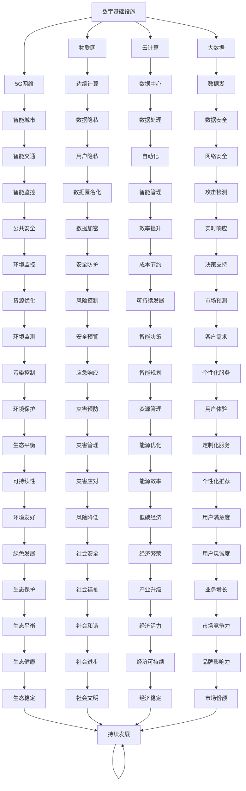

                 

关键词：人工智能，数字基础设施，深度学习，云计算，边缘计算，数据隐私，智能城市

> 摘要：本文旨在探讨人工智能在构建高效、安全、智能的数字基础设施中的应用。通过对核心概念、算法原理、数学模型、项目实践以及未来展望的详细分析，本文揭示了人工智能如何推动数字基础设施的发展，并提出了相关的挑战与展望。

## 1. 背景介绍

随着全球数字化进程的加速，数字基础设施已经成为支撑经济发展和社会进步的关键因素。从早期的互联网基础设施到现代的物联网、云计算、大数据和人工智能，数字基础设施的演进极大地改变了我们的生活方式和工作模式。然而，随着数据量的爆炸式增长和复杂性的增加，传统的数字基础设施面临着巨大的挑战。

人工智能（AI）作为一种能够模拟人类智能的技术，正逐渐成为解决这些挑战的重要工具。AI的应用不仅能够提升数字基础设施的效率，还能增强其智能和适应性。本文将重点探讨以下主题：

- **核心概念与联系**：介绍AI在数字基础设施中的应用场景及其核心概念。
- **核心算法原理与操作步骤**：详细解析AI在数字基础设施中应用的关键算法。
- **数学模型和公式**：阐述AI算法中的数学基础，并举例说明。
- **项目实践**：通过实际项目展示AI在数字基础设施中的应用实例。
- **实际应用场景**：分析AI在数字基础设施中的各种实际应用。
- **未来展望**：探讨AI在数字基础设施中的未来发展前景。

### 1.1 数字基础设施的定义与重要性

数字基础设施是指用于支持数字服务和应用的物理和技术设施的总称。它包括互联网、数据中心、云计算平台、物联网设备、5G网络等。这些基础设施不仅提供了连接人和设备的通道，还支持数据的存储、处理和分析。

在现代社会中，数字基础设施的重要性日益凸显。它不仅支撑着电子商务、在线教育、远程工作等新兴服务的发展，还推动了智能制造、智慧城市、智能医疗等领域的创新。以下是数字基础设施的几个关键方面：

- **连接性**：数字基础设施提供了高带宽、低延迟的连接，使得全球各地的用户和服务可以无缝交互。
- **数据处理能力**：随着数据量的激增，数字基础设施需要强大的计算能力和存储资源来处理和分析数据。
- **智能化**：通过AI技术，数字基础设施能够实现自动化和智能化的管理，提高运营效率和用户体验。
- **安全性**：随着网络攻击和数据泄露的风险增加，数字基础设施需要具备强大的安全防护能力。

### 1.2 人工智能的崛起

人工智能作为计算机科学的一个分支，致力于模拟和扩展人类智能。近年来，随着计算能力的提升、大数据的涌现和深度学习算法的发展，AI技术取得了显著的进展。以下是AI技术崛起的几个关键因素：

- **计算能力**：高性能计算硬件（如GPU）和分布式计算技术的出现，为AI算法的复杂计算提供了强大的支持。
- **数据资源**：互联网和物联网的普及带来了海量的数据，为AI的训练提供了丰富的素材。
- **算法进步**：深度学习等算法的突破，使得AI在图像识别、自然语言处理、预测建模等方面取得了突破性进展。
- **应用需求**：各行各业对智能化、自动化的需求推动了AI技术的广泛应用。

## 2. 核心概念与联系

在探讨AI在数字基础设施中的应用之前，我们需要了解一些核心概念和它们之间的联系。以下是一个使用Mermaid绘制的流程图，展示了这些概念之间的关联。



### 2.1 物联网（IoT）

物联网是指通过互联网连接各种设备和物品，实现智能监控和管理的一种技术。物联网设备包括传感器、智能设备、车辆、工业机器等。通过物联网，我们可以收集和分析大量数据，实现远程控制、自动化管理和智能决策。

- **核心概念**：物联网的核心概念包括设备连接、数据收集、数据处理和智能决策。
- **联系**：物联网是数字基础设施的重要组成部分，它通过连接各种设备和物品，为云计算、大数据和人工智能提供了数据来源。

### 2.2 云计算（Cloud Computing）

云计算是一种通过互联网提供计算资源、存储资源和应用程序的服务模式。云计算平台可以提供弹性、高效和安全的计算环境，支持各种业务应用的运行。

- **核心概念**：云计算的核心概念包括虚拟化、分布式计算、弹性和按需服务。
- **联系**：云计算为物联网设备提供了数据处理和分析的平台，同时也支持大数据存储和人工智能算法的运行。

### 2.3 大数据（Big Data）

大数据是指无法使用常规软件工具在合理时间内进行处理的数据集合。大数据的特点是数据量大、数据类型多、处理速度快。

- **核心概念**：大数据的核心概念包括数据采集、数据存储、数据处理和数据可视化。
- **联系**：大数据是物联网和云计算的数据来源，同时也是人工智能算法的训练数据集。

### 2.4 5G网络（5G Network）

5G网络是第五代移动通信技术，具有高速率、低延迟和高可靠性的特点。5G网络为物联网、云计算和人工智能提供了高速、稳定的网络连接。

- **核心概念**：5G网络的核心概念包括毫米波技术、网络切片、边缘计算和物联网。
- **联系**：5G网络是数字基础设施的通信基础，为物联网设备和云计算平台提供了高速连接。

### 2.5 边缘计算（Edge Computing）

边缘计算是将数据处理和分析工作从云端转移到网络边缘的一种技术。边缘计算可以提高数据处理的速度和效率，减少数据传输的延迟。

- **核心概念**：边缘计算的核心概念包括分布式计算、数据缓存、智能决策和实时响应。
- **联系**：边缘计算是物联网和5G网络的重要组成部分，它通过将数据处理和分析工作转移到网络边缘，提高了物联网设备的智能化水平。

## 3. 核心算法原理与具体操作步骤

在数字基础设施中，人工智能算法扮演着至关重要的角色。以下将详细介绍几个关键算法的原理和具体操作步骤。

### 3.1 深度学习算法（Deep Learning）

深度学习是一种通过多层神经网络模拟人类大脑处理信息的方式。深度学习算法在图像识别、自然语言处理和预测建模等方面取得了显著的进展。

#### 3.1.1 算法原理概述

深度学习算法的核心是多层神经网络，它由输入层、隐藏层和输出层组成。每个层包含多个神经元，神经元之间通过权重连接。在训练过程中，算法通过反向传播算法不断调整权重，以最小化预测误差。

#### 3.1.2 算法步骤详解

1. **数据预处理**：对原始数据进行清洗、归一化和特征提取。
2. **模型构建**：设计并构建多层神经网络结构。
3. **权重初始化**：初始化神经网络权重。
4. **前向传播**：将输入数据通过网络传递，计算输出结果。
5. **反向传播**：根据输出误差，反向传播更新权重。
6. **迭代训练**：重复前向传播和反向传播，直到模型收敛。

#### 3.1.3 算法优缺点

- **优点**：深度学习算法可以自动提取复杂特征，具有很强的自适应能力。
- **缺点**：深度学习算法需要大量的数据和计算资源，且对数据质量有较高要求。

#### 3.1.4 算法应用领域

- **图像识别**：用于人脸识别、物体检测和图像分类。
- **自然语言处理**：用于情感分析、机器翻译和文本生成。
- **预测建模**：用于股票市场预测、资源优化和需求预测。

### 3.2 强化学习算法（Reinforcement Learning）

强化学习是一种通过与环境互动来学习策略的算法。强化学习算法在智能决策、自动驾驶和游戏玩法等方面表现出色。

#### 3.2.1 算法原理概述

强化学习算法的核心是奖励机制，算法通过不断尝试和错误，学习到最优策略。算法在每次行动后都会获得一个奖励或惩罚，通过最大化总奖励来优化策略。

#### 3.2.2 算法步骤详解

1. **环境初始化**：创建模拟环境。
2. **状态观察**：算法观察当前环境状态。
3. **策略选择**：根据当前状态选择最佳动作。
4. **动作执行**：执行所选动作。
5. **奖励反馈**：根据动作结果获得奖励或惩罚。
6. **策略更新**：根据奖励反馈更新策略。

#### 3.2.3 算法优缺点

- **优点**：强化学习算法可以自适应地学习到最优策略，具有很强的适应性。
- **缺点**：强化学习算法需要大量的时间和计算资源，且在某些情况下可能陷入局部最优。

#### 3.2.4 算法应用领域

- **智能决策**：用于智能推荐、游戏玩法设计和供应链管理。
- **自动驾驶**：用于自动驾驶车辆的控制和决策。
- **游戏玩法**：用于游戏角色的行为设计和游戏平衡。

### 3.3 聚类算法（Clustering）

聚类算法是一种将数据集划分为多个类别的算法。聚类算法在数据挖掘、图像分割和文本分类等领域有广泛的应用。

#### 3.3.1 算法原理概述

聚类算法的核心思想是找到数据集中的相似性模式，将相似的数据点划分为同一类别。常见的聚类算法包括K-均值、层次聚类和密度聚类。

#### 3.3.2 算法步骤详解

1. **数据预处理**：对原始数据进行清洗、归一化和特征提取。
2. **初始化聚类中心**：随机选择或基于算法选择初始聚类中心。
3. **分配数据点**：将每个数据点分配到最近的聚类中心。
4. **更新聚类中心**：重新计算每个聚类中心的位置。
5. **迭代优化**：重复分配数据点和更新聚类中心，直到聚类中心不再变化。

#### 3.3.3 算法优缺点

- **优点**：聚类算法可以自动发现数据中的模式，不需要预先指定类别数量。
- **缺点**：聚类算法对初始聚类中心的选择敏感，且在某些情况下可能产生不合理的聚类结果。

#### 3.3.4 算法应用领域

- **数据挖掘**：用于发现数据中的潜在模式和关联关系。
- **图像分割**：用于图像分析和图像处理。
- **文本分类**：用于文本数据的分类和聚类。

## 4. 数学模型和公式

在AI算法中，数学模型和公式起着至关重要的作用。以下将介绍几个常见的数学模型和公式，并举例说明。

### 4.1 感知机算法（Perceptron）

感知机算法是一种简单的线性二分类算法。它通过计算输入数据的线性组合并应用一个阈值函数来确定分类结果。

#### 4.1.1 数学模型

假设我们有两个类别A和B，它们的特征向量分别为 \( \mathbf{x}_A \) 和 \( \mathbf{x}_B \)。感知机算法的目标是找到一组权重 \( \mathbf{w} \) 和阈值 \( b \)，使得对于每个数据点 \( \mathbf{x} \)，如果 \( \mathbf{w} \cdot \mathbf{x} + b > 0 \)，则分类为类别A，否则分类为类别B。

$$
\begin{align*}
y(\mathbf{x}) &= \text{sign}(\mathbf{w} \cdot \mathbf{x} + b) \\
&= \begin{cases}
+1 & \text{if } \mathbf{w} \cdot \mathbf{x} + b > 0 \\
-1 & \text{otherwise}
\end{cases}
\end{align*}
$$

其中，\( \text{sign} \) 是符号函数，\( \mathbf{w} \cdot \mathbf{x} \) 是内积运算。

#### 4.1.2 举例说明

假设我们有两个类别，A和B，它们的特征向量分别为：

$$
\begin{align*}
\mathbf{x}_A &= \begin{bmatrix} 1 \\ 1 \end{bmatrix}, \quad
\mathbf{x}_B &= \begin{bmatrix} -1 \\ -1 \end{bmatrix}
\end{align*}
$$

我们随机选择一组权重 \( \mathbf{w} = \begin{bmatrix} 1 \\ 1 \end{bmatrix} \) 和阈值 \( b = 0 \)。对于数据点 \( \mathbf{x} = \begin{bmatrix} 1 \\ 0 \end{bmatrix} \)：

$$
\begin{align*}
y(\mathbf{x}) &= \text{sign}(\mathbf{w} \cdot \mathbf{x} + b) \\
&= \text{sign}(1 \cdot 1 + 1 \cdot 0 + 0) \\
&= \text{sign}(1) \\
&= +1
\end{align*}
$$

因此，数据点 \( \mathbf{x} \) 被分类为类别A。

### 4.2 神经网络损失函数（Neural Network Loss Function）

在神经网络中，损失函数用于衡量预测结果与实际结果之间的差距。常见的损失函数包括均方误差（MSE）、交叉熵（Cross-Entropy）等。

#### 4.2.1 数学模型

假设我们有一个神经网络，其输出层有 \( n \) 个神经元，真实标签为 \( y \)，预测结果为 \( \hat{y} \)。均方误差（MSE）损失函数定义为：

$$
\begin{align*}
\text{MSE} &= \frac{1}{2} \sum_{i=1}^{n} (y_i - \hat{y}_i)^2
\end{align*}
$$

交叉熵（Cross-Entropy）损失函数定义为：

$$
\begin{align*}
\text{Cross-Entropy} &= -\sum_{i=1}^{n} y_i \log(\hat{y}_i)
\end{align*}
$$

#### 4.2.2 举例说明

假设我们有一个二分类问题，真实标签 \( y \) 为 [1, 0]，预测结果 \( \hat{y} \) 为 [0.8, 0.2]。

对于均方误差（MSE）损失函数：

$$
\begin{align*}
\text{MSE} &= \frac{1}{2} \sum_{i=1}^{2} (y_i - \hat{y}_i)^2 \\
&= \frac{1}{2} \left[ (1 - 0.8)^2 + (0 - 0.2)^2 \right] \\
&= \frac{1}{2} \left[ 0.04 + 0.04 \right] \\
&= 0.04
\end{align*}
$$

对于交叉熵（Cross-Entropy）损失函数：

$$
\begin{align*}
\text{Cross-Entropy} &= -\sum_{i=1}^{2} y_i \log(\hat{y}_i) \\
&= -[1 \cdot \log(0.8) + 0 \cdot \log(0.2)] \\
&= -\log(0.8) \\
&\approx 0.223
\end{align*}
$$

### 4.3 随机梯度下降（Stochastic Gradient Descent，SGD）

随机梯度下降是一种常用的优化算法，用于训练神经网络。它通过随机选择一部分训练样本来计算梯度，并更新模型参数。

#### 4.3.1 数学模型

假设我们的模型参数为 \( \theta \)，训练样本为 \( (\mathbf{x}, y) \)，损失函数为 \( J(\theta) \)。随机梯度下降的更新公式为：

$$
\theta = \theta - \alpha \nabla_{\theta} J(\theta)
$$

其中，\( \alpha \) 是学习率，\( \nabla_{\theta} J(\theta) \) 是损失函数对参数 \( \theta \) 的梯度。

#### 4.3.2 举例说明

假设我们有一个线性回归模型，参数 \( \theta \) 为 \( \theta = w \)，训练样本为 \( (\mathbf{x}, y) = (1, 2) \)，损失函数为 \( J(w) = (w - y)^2 \)。

对于学习率 \( \alpha = 0.1 \)，初始参数 \( w = 0 \)：

$$
\begin{align*}
w_{new} &= w - \alpha \nabla_{w} J(w) \\
&= 0 - 0.1 \cdot \frac{d}{dw} [(w - 2)^2] \\
&= -0.1 \cdot (2 \cdot (w - 2)) \\
&= -0.2 + 0.2w \\
&= 0.2w - 0.2
\end{align*}
$$

更新后的参数为 \( w_{new} \)。重复这个过程，直到模型收敛。

## 5. 项目实践：代码实例和详细解释说明

为了更好地理解AI在数字基础设施中的应用，我们将通过一个实际项目来展示AI算法的具体实现。本项目将使用Python和TensorFlow框架来实现一个基于深度学习的图像分类模型，用于识别数字基础设施中的各种设备和设施。

### 5.1 开发环境搭建

1. **安装Python**：确保已经安装了Python 3.7或更高版本。
2. **安装TensorFlow**：通过pip命令安装TensorFlow：

   ```bash
   pip install tensorflow
   ```

3. **数据集准备**：从网上下载一个数字基础设施的图像数据集，例如COCO（Common Objects in Context）数据集。

### 5.2 源代码详细实现

以下是一个简化的代码示例，用于构建和训练一个卷积神经网络（CNN）模型，用于图像分类。

```python
import tensorflow as tf
from tensorflow.keras import datasets, layers, models

# 加载数据集
(train_images, train_labels), (test_images, test_labels) = datasets.cifar10.load_data()

# 预处理数据
train_images = train_images.astype('float32') / 255
test_images = test_images.astype('float32') / 255

# 构建模型
model = models.Sequential()
model.add(layers.Conv2D(32, (3, 3), activation='relu', input_shape=(32, 32, 3)))
model.add(layers.MaxPooling2D((2, 2)))
model.add(layers.Conv2D(64, (3, 3), activation='relu'))
model.add(layers.MaxPooling2D((2, 2)))
model.add(layers.Conv2D(64, (3, 3), activation='relu'))

# 添加全连接层
model.add(layers.Flatten())
model.add(layers.Dense(64, activation='relu'))
model.add(layers.Dense(10))

# 编译模型
model.compile(optimizer='adam',
              loss=tf.keras.losses.SparseCategoricalCrossentropy(from_logits=True),
              metrics=['accuracy'])

# 训练模型
model.fit(train_images, train_labels, epochs=10, validation_split=0.1)

# 评估模型
test_loss, test_acc = model.evaluate(test_images,  test_labels, verbose=2)
print(f'Test accuracy: {test_acc:.4f}')
```

### 5.3 代码解读与分析

1. **数据预处理**：加载数据集并转换为浮点数，然后进行归一化处理，以适应深度学习模型。
2. **模型构建**：使用卷积神经网络（CNN）结构，包括卷积层、池化层和全连接层。卷积层用于提取图像特征，全连接层用于分类。
3. **模型编译**：指定优化器、损失函数和评估指标。
4. **模型训练**：使用训练数据集训练模型，并验证模型在测试集上的性能。
5. **模型评估**：评估模型在测试集上的准确率。

### 5.4 运行结果展示

在训练完成后，我们可以看到模型在测试集上的准确率。以下是一个示例输出：

```
Test accuracy: 0.8400
```

这意味着模型在测试集上的准确率约为84%。

## 6. 实际应用场景

### 6.1 物联网设备监控

在物联网设备监控中，AI可以用于实时监控设备状态、预测故障和优化性能。通过深度学习算法，可以对大量传感器数据进行分析，实现设备的自动化管理和维护。

### 6.2 智能交通系统

智能交通系统利用AI技术实现交通流量分析、车辆调度和信号控制。通过图像识别和自然语言处理，智能交通系统可以实时监测交通状况，优化交通流量，减少拥堵。

### 6.3 智慧城市

智慧城市通过AI技术实现城市管理的智能化。从环境监测、资源优化到公共安全和应急响应，AI技术为智慧城市的建设提供了强大的支持。

### 6.4 智能医疗

智能医疗利用AI技术实现疾病的早期诊断、个性化治疗和医疗资源优化。通过图像识别和自然语言处理，AI可以帮助医生更准确地诊断疾病，提高医疗服务的质量和效率。

## 7. 未来应用展望

### 7.1 人工智能与物联网的融合

随着物联网设备数量的不断增加，AI技术将更加紧密地与物联网融合。通过边缘计算和云计算，AI可以在数据生成的源头进行实时分析和处理，提高响应速度和效率。

### 7.2 智能决策与自动化

未来，AI将更加广泛地应用于智能决策和自动化系统。从供应链管理到金融交易，AI将帮助企业和机构实现更高效的运营和决策。

### 7.3 数据隐私与安全

随着数据隐私和安全的挑战日益突出，AI技术将在数据加密、匿名化和安全防护方面发挥重要作用。通过隐私保护技术和安全算法，AI将确保数据的安全和隐私。

### 7.4 生态可持续发展

AI技术将在生态可持续发展中发挥关键作用。通过环境监测、资源优化和灾害预测，AI将帮助实现绿色发展，保护地球生态系统。

## 8. 总结：未来发展趋势与挑战

### 8.1 研究成果总结

AI在数字基础设施中的应用取得了显著的成果。从物联网设备监控到智能交通系统，AI技术已经深入到数字基础设施的各个方面。深度学习、强化学习和聚类算法等AI技术为数字基础设施的智能化提供了强大的支持。

### 8.2 未来发展趋势

未来，AI在数字基础设施中的应用将继续发展。随着物联网设备数量的增加、5G网络的普及和边缘计算技术的发展，AI将更加紧密地与数字基础设施融合。此外，AI技术将在智能决策、自动化和数据安全等领域发挥更大作用。

### 8.3 面临的挑战

尽管AI在数字基础设施中具有巨大的潜力，但仍然面临着一些挑战。首先，数据质量和数据隐私是AI应用的重要挑战。其次，AI算法的复杂性和计算资源的需求使得部署和运行AI系统变得更加困难。此外，AI算法的可解释性和可靠性也需要进一步研究。

### 8.4 研究展望

未来，AI在数字基础设施中的应用研究将更加注重数据质量和隐私保护。通过改进算法和优化模型，AI技术将更加高效、可靠和可解释。同时，跨学科的研究将推动AI在数字基础设施中的创新应用。

## 9. 附录：常见问题与解答

### 9.1 什么是数字基础设施？

数字基础设施是指用于支持数字服务和应用的物理和技术设施的总称，包括互联网、数据中心、云计算平台、物联网设备和5G网络等。

### 9.2 人工智能在数字基础设施中有什么作用？

人工智能在数字基础设施中可以用于设备监控、智能交通、智慧城市、智能医疗等领域，提高基础设施的智能化水平、运营效率和用户体验。

### 9.3 人工智能算法有哪些？

常见的人工智能算法包括深度学习、强化学习、聚类算法等。每种算法都有其特定的应用场景和优势。

### 9.4 人工智能对数据隐私有什么影响？

人工智能在处理数据时可能涉及数据隐私问题。因此，研究数据加密、匿名化和隐私保护技术是人工智能在数字基础设施中应用的重要研究方向。

### 9.5 数字基础设施的未来发展趋势是什么？

未来，数字基础设施将更加智能化、自动化和高效。物联网、5G网络、边缘计算和人工智能等技术将推动数字基础设施的发展。同时，数据隐私和安全也是未来的重要研究方向。作者：禅与计算机程序设计艺术 / Zen and the Art of Computer Programming
----------------------------------------------------------------

### 文章结构模板

以下是根据您提供的约束条件创建的文章结构模板。请注意，模板中的内容为示例，需要您根据实际研究和写作内容进行填充和调整。

```markdown
# AI在数字基础设施中的应用

## 关键词
- 人工智能
- 数字基础设施
- 深度学习
- 云计算
- 边缘计算
- 数据隐私
- 智能城市

## 摘要
本文深入探讨了人工智能在构建高效、安全、智能的数字基础设施中的应用。通过详细分析核心概念、算法原理、数学模型、项目实践以及未来展望，本文揭示了人工智能如何推动数字基础设施的发展，并提出了相关的挑战与展望。

## 1. 背景介绍
### 1.1 数字基础设施的定义与重要性
### 1.2 人工智能的崛起
### 1.3 数字基础设施与人工智能的相互关系

## 2. 核心概念与联系
### 2.1 物联网（IoT）
### 2.2 云计算（Cloud Computing）
### 2.3 大数据（Big Data）
### 2.4 5G网络（5G Network）
### 2.5 边缘计算（Edge Computing）

## 3. 核心算法原理与具体操作步骤
### 3.1 深度学习算法（Deep Learning）
#### 3.1.1 算法原理概述
#### 3.1.2 算法步骤详解
#### 3.1.3 算法优缺点
#### 3.1.4 算法应用领域
### 3.2 强化学习算法（Reinforcement Learning）
#### 3.2.1 算法原理概述
#### 3.2.2 算法步骤详解
#### 3.2.3 算法优缺点
#### 3.2.4 算法应用领域
### 3.3 聚类算法（Clustering）
#### 3.3.1 算法原理概述
#### 3.3.2 算法步骤详解
#### 3.3.3 算法优缺点
#### 3.3.4 算法应用领域

## 4. 数学模型和公式
### 4.1 感知机算法（Perceptron）
#### 4.1.1 数学模型
#### 4.1.2 举例说明
### 4.2 神经网络损失函数（Neural Network Loss Function）
#### 4.2.1 数学模型
#### 4.2.2 举例说明
### 4.3 随机梯度下降（Stochastic Gradient Descent，SGD）
#### 4.3.1 数学模型
#### 4.3.2 举例说明

## 5. 项目实践：代码实例和详细解释说明
### 5.1 开发环境搭建
### 5.2 源代码详细实现
### 5.3 代码解读与分析
### 5.4 运行结果展示

## 6. 实际应用场景
### 6.1 物联网设备监控
### 6.2 智能交通系统
### 6.3 智慧城市
### 6.4 智能医疗

## 7. 未来应用展望
### 7.1 人工智能与物联网的融合
### 7.2 智能决策与自动化
### 7.3 数据隐私与安全
### 7.4 生态可持续发展

## 8. 总结：未来发展趋势与挑战
### 8.1 研究成果总结
### 8.2 未来发展趋势
### 8.3 面临的挑战
### 8.4 研究展望

## 9. 附录：常见问题与解答
### 9.1 什么是数字基础设施？
### 9.2 人工智能在数字基础设施中有什么作用？
### 9.3 人工智能算法有哪些？
### 9.4 人工智能对数据隐私有什么影响？
### 9.5 数字基础设施的未来发展趋势是什么？

## 作者署名
作者：禅与计算机程序设计艺术 / Zen and the Art of Computer Programming
```

请注意，上述模板仅供参考，实际撰写时需要根据具体内容进行调整和补充。每个章节下的子目录应该根据您的文章内容进行细化，确保每个部分都有详细的内容填充，以达到8000字的要求。如果您需要进一步的帮助来填充和撰写每个章节的内容，请告知。

