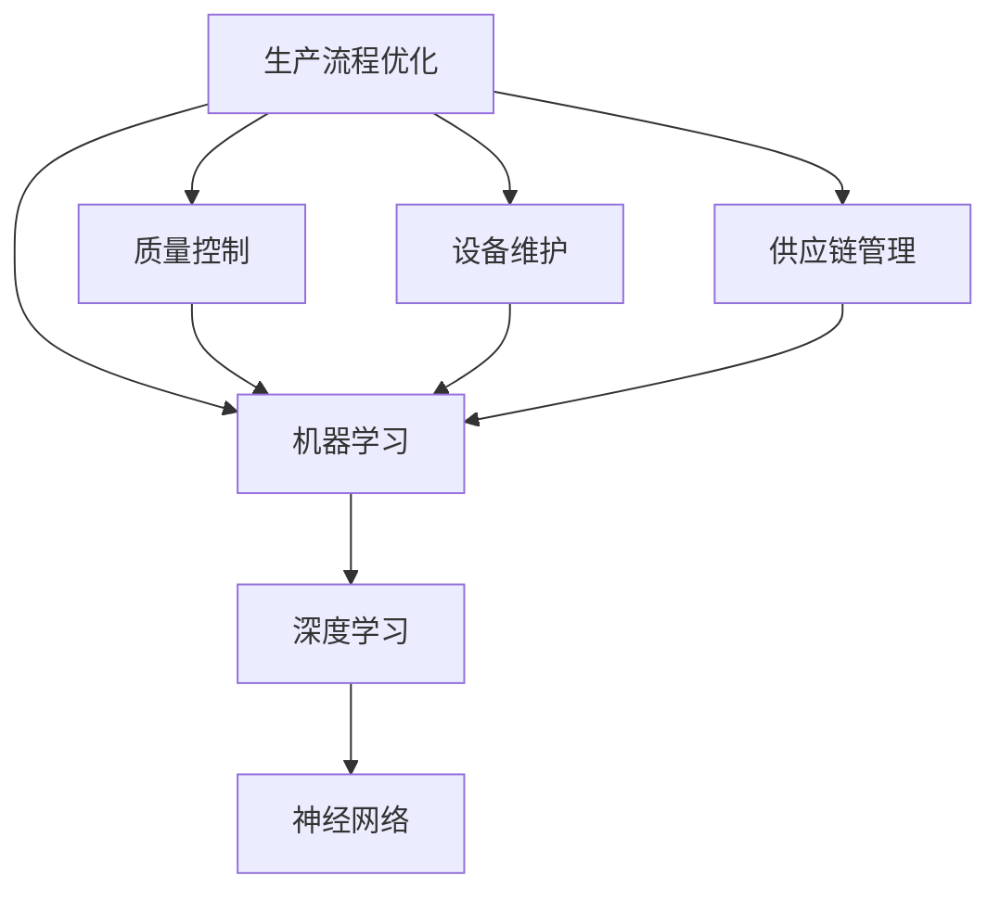

                 

本文将从背景介绍、核心概念与联系、核心算法原理、数学模型和公式、项目实践、实际应用场景、工具和资源推荐以及总结：未来发展趋势与挑战等多个方面，深入探讨人工智能（AI）在智能制造中的应用，以及如何通过这些应用来提高生产效率。

## 关键词 Keywords
AI，智能制造，生产效率，算法，数学模型，实践，应用场景

## 摘要 Abstract
本文旨在通过深入分析和探讨人工智能在智能制造中的应用，展示如何通过AI技术提高生产效率。文章从背景介绍开始，详细阐述了AI与智能制造的联系，并分析了核心算法原理、数学模型以及在实际项目中的具体应用。此外，文章还探讨了AI在智能制造中的实际应用场景，并对未来发展趋势与挑战进行了展望。

## 1. 背景介绍 Introduction
随着全球制造业的快速发展，提高生产效率成为企业竞争力的关键。传统的制造方法在应对复杂、多变的生产环境时，往往效率低下、成本高昂。而人工智能作为当前最具发展潜力的技术之一，正逐渐成为制造业的重要支撑。AI技术通过模拟人类思维过程，能够自主学习、优化决策，从而提高生产效率、降低成本。

在智能制造领域，AI技术的应用主要体现在以下几个方面：

1. **生产流程优化**：通过分析大量生产数据，AI技术可以帮助企业识别生产过程中的瓶颈，优化生产流程，提高生产效率。

2. **质量控制**：AI技术可以通过图像识别、数据挖掘等方法，实现对产品质量的实时监控和评估，确保产品质量的稳定性和一致性。

3. **设备维护**：AI技术可以帮助企业预测设备故障，提前进行维护，减少停机时间，提高生产效率。

4. **供应链管理**：AI技术可以优化供应链管理，降低库存成本，提高供应链效率。

## 2. 核心概念与联系 Core Concepts and Connections

在智能制造中，AI技术的核心概念主要包括机器学习、深度学习、神经网络等。下面将使用Mermaid流程图来展示这些核心概念之间的联系。



### 2.1 机器学习（Machine Learning）

机器学习是一种使计算机系统能够从数据中学习并做出决策的技术。它包括监督学习、无监督学习和强化学习等子类别。

### 2.2 深度学习（Deep Learning）

深度学习是机器学习的一种，它通过多层神经网络模拟人类大脑的学习过程，能够处理大量复杂的数据。

### 2.3 神经网络（Neural Networks）

神经网络是深度学习的基础，由大量相互连接的节点（神经元）组成，通过前向传播和反向传播算法进行训练。

### 2.4 生产流程优化（Production Process Optimization）

生产流程优化利用机器学习算法分析生产数据，识别生产瓶颈，并提出优化方案。

### 2.5 质量控制（Quality Control）

质量控制通过图像识别和数据挖掘等技术，对产品质量进行实时监控和评估。

### 2.6 设备维护（Equipment Maintenance）

设备维护通过预测模型预测设备故障，提前进行维护。

### 2.7 供应链管理（Supply Chain Management）

供应链管理通过优化算法优化供应链流程，降低库存成本。

## 3. 核心算法原理 & 具体操作步骤 Core Algorithm Principles & Detailed Steps

### 3.1 算法原理概述

在智能制造中，常用的AI算法包括决策树、支持向量机（SVM）、神经网络等。

#### 3.1.1 决策树（Decision Trees）

决策树是一种树形结构，通过一系列的测试来对数据进行分类或回归。每个节点代表一个特征，每个分支代表一个特征值的取值。

#### 3.1.2 支持向量机（SVM）

SVM是一种分类算法，通过找到一个最佳的超平面，将数据分为不同的类别。它通过优化目标函数来最大化分类边界。

#### 3.1.3 神经网络（Neural Networks）

神经网络通过多层神经元模拟人类大脑的学习过程，通过前向传播和反向传播算法进行训练。

### 3.2 算法步骤详解

#### 3.2.1 决策树

1. 选择一个特征进行划分。
2. 计算每个特征的增益，选择增益最大的特征进行划分。
3. 重复步骤1和2，直到满足停止条件（如最大深度、最小样本数等）。

#### 3.2.2 支持向量机

1. 定义优化目标函数。
2. 计算每个样本的决策边界。
3. 更新模型参数，以最大化分类边界。

#### 3.2.3 神经网络

1. 初始化模型参数。
2. 前向传播，计算输出值。
3. 计算损失函数。
4. 反向传播，更新模型参数。
5. 重复步骤2-4，直到满足停止条件。

### 3.3 算法优缺点

#### 3.3.1 决策树

优点：简单易懂，易于解释。

缺点：容易过拟合，不能处理非线性问题。

#### 3.3.2 支持向量机

优点：分类效果好，适用于高维数据。

缺点：训练时间较长，对异常值敏感。

#### 3.3.3 神经网络

优点：能够处理复杂、非线性问题。

缺点：参数多，训练时间较长，易于过拟合。

### 3.4 算法应用领域

#### 3.4.1 生产流程优化

决策树和神经网络可以用于生产流程优化，通过分析生产数据，识别瓶颈，提出优化方案。

#### 3.4.2 质量控制

SVM和神经网络可以用于产品质量检测和评估，通过实时监控，确保产品质量。

#### 3.4.3 设备维护

神经网络和决策树可以用于设备故障预测，通过预测模型，提前进行维护。

#### 3.4.4 供应链管理

决策树和支持向量机可以用于供应链管理，优化供应链流程，降低库存成本。

## 4. 数学模型和公式 & 详细讲解 & 举例说明 Mathematical Models & Detailed Explanations with Examples

### 4.1 数学模型构建

在智能制造中，常用的数学模型包括线性回归、逻辑回归、神经网络等。

#### 4.1.1 线性回归（Linear Regression）

线性回归模型表示为：

$$y = \beta_0 + \beta_1 \cdot x_1 + \beta_2 \cdot x_2 + ... + \beta_n \cdot x_n + \epsilon$$

其中，$y$ 是因变量，$x_1, x_2, ..., x_n$ 是自变量，$\beta_0, \beta_1, \beta_2, ..., \beta_n$ 是模型参数，$\epsilon$ 是误差项。

#### 4.1.2 逻辑回归（Logistic Regression）

逻辑回归模型表示为：

$$P(y=1) = \frac{1}{1 + e^{-(\beta_0 + \beta_1 \cdot x_1 + \beta_2 \cdot x_2 + ... + \beta_n \cdot x_n)}}$$

其中，$P(y=1)$ 是因变量为1的概率。

#### 4.1.3 神经网络（Neural Networks）

神经网络模型表示为：

$$z = \sum_{i=1}^{n} \beta_i \cdot x_i + \epsilon$$

其中，$z$ 是输出值，$x_1, x_2, ..., x_n$ 是输入值，$\beta_1, \beta_2, ..., \beta_n$ 是模型参数，$\epsilon$ 是误差项。

### 4.2 公式推导过程

#### 4.2.1 线性回归

线性回归模型的目标是最小化损失函数：

$$L(\beta_0, \beta_1, ..., \beta_n) = \frac{1}{2} \sum_{i=1}^{m} (y_i - (\beta_0 + \beta_1 \cdot x_{i1} + \beta_2 \cdot x_{i2} + ... + \beta_n \cdot x_{in}))^2$$

通过求导并令导数为零，可以求得模型参数：

$$\frac{\partial L}{\partial \beta_0} = 0, \frac{\partial L}{\partial \beta_1} = 0, ..., \frac{\partial L}{\partial \beta_n} = 0$$

解得：

$$\beta_0 = \bar{y} - \beta_1 \cdot \bar{x_1} - \beta_2 \cdot \bar{x_2} - ... - \beta_n \cdot \bar{x_n}$$

$$\beta_1 = \frac{\sum_{i=1}^{m} (x_{i1} - \bar{x_1})(y_i - \bar{y})}{\sum_{i=1}^{m} (x_{i1} - \bar{x_1})^2}$$

$$...$$

$$\beta_n = \frac{\sum_{i=1}^{m} (x_{in} - \bar{x_n})(y_i - \bar{y})}{\sum_{i=1}^{m} (x_{in} - \bar{x_n})^2}$$

#### 4.2.2 逻辑回归

逻辑回归模型的目标是最小化损失函数：

$$L(\beta_0, \beta_1, ..., \beta_n) = -\sum_{i=1}^{m} y_i \cdot \log(P(y=1)) - (1 - y_i) \cdot \log(1 - P(y=1))$$

通过求导并令导数为零，可以求得模型参数：

$$\frac{\partial L}{\partial \beta_0} = 0, \frac{\partial L}{\partial \beta_1} = 0, ..., \frac{\partial L}{\partial \beta_n} = 0$$

解得：

$$\beta_0 = \bar{y} - \beta_1 \cdot \bar{x_1} - \beta_2 \cdot \bar{x_2} - ... - \beta_n \cdot \bar{x_n}$$

$$\beta_1 = \frac{\sum_{i=1}^{m} (x_{i1} - \bar{x_1})(y_i - \bar{y})}{\sum_{i=1}^{m} (x_{i1} - \bar{x_1})^2}$$

$$...$$

$$\beta_n = \frac{\sum_{i=1}^{m} (x_{in} - \bar{x_n})(y_i - \bar{y})}{\sum_{i=1}^{m} (x_{in} - \bar{x_n})^2}$$

#### 4.2.3 神经网络

神经网络模型的目标是最小化损失函数：

$$L(\beta_0, \beta_1, ..., \beta_n) = \frac{1}{2} \sum_{i=1}^{m} (z_i - y_i)^2$$

通过前向传播和反向传播算法，可以求得模型参数：

$$\beta_0^{(l)} = \bar{z}^{(l)} - \beta_1^{(l)} \cdot \bar{x_1}^{(l)} - \beta_2^{(l)} \cdot \bar{x_2}^{(l)} - ... - \beta_n^{(l)} \cdot \bar{x_n}^{(l)}$$

$$\beta_1^{(l)} = \frac{\sum_{i=1}^{m} (z_i^{(l)} - \bar{z}^{(l)}) \cdot x_{i1}^{(l)} - \bar{x_1}^{(l)})}{\sum_{i=1}^{m} (z_i^{(l)} - \bar{z}^{(l)})^2}$$

$$...$$

$$\beta_n^{(l)} = \frac{\sum_{i=1}^{m} (z_i^{(l)} - \bar{z}^{(l)}) \cdot x_{in}^{(l)} - \bar{x_n}^{(l)})}{\sum_{i=1}^{m} (z_i^{(l)} - \bar{z}^{(l)})^2}$$

### 4.3 案例分析与讲解

#### 4.3.1 线性回归案例

假设我们有一组数据，包括自变量 $x_1, x_2, ..., x_n$ 和因变量 $y$。通过线性回归模型，我们可以建立如下数学模型：

$$y = \beta_0 + \beta_1 \cdot x_1 + \beta_2 \cdot x_2 + ... + \beta_n \cdot x_n + \epsilon$$

通过最小二乘法，我们可以求得模型参数：

$$\beta_0 = \bar{y} - \beta_1 \cdot \bar{x_1} - \beta_2 \cdot \bar{x_2} - ... - \beta_n \cdot \bar{x_n}$$

$$\beta_1 = \frac{\sum_{i=1}^{m} (x_{i1} - \bar{x_1})(y_i - \bar{y})}{\sum_{i=1}^{m} (x_{i1} - \bar{x_1})^2}$$

$$...$$

$$\beta_n = \frac{\sum_{i=1}^{m} (x_{in} - \bar{x_n})(y_i - \bar{y})}{\sum_{i=1}^{m} (x_{in} - \bar{x_n})^2}$$

通过训练模型，我们可以得到预测值：

$$\hat{y} = \beta_0 + \beta_1 \cdot x_1 + \beta_2 \cdot x_2 + ... + \beta_n \cdot x_n$$

#### 4.3.2 逻辑回归案例

假设我们有一组数据，包括自变量 $x_1, x_2, ..., x_n$ 和因变量 $y$。通过逻辑回归模型，我们可以建立如下数学模型：

$$P(y=1) = \frac{1}{1 + e^{-(\beta_0 + \beta_1 \cdot x_1 + \beta_2 \cdot x_2 + ... + \beta_n \cdot x_n)}}$$

通过最大似然估计，我们可以求得模型参数：

$$\beta_0 = \bar{y} - \beta_1 \cdot \bar{x_1} - \beta_2 \cdot \bar{x_2} - ... - \beta_n \cdot \bar{x_n}$$

$$\beta_1 = \frac{\sum_{i=1}^{m} (x_{i1} - \bar{x_1})(y_i - \bar{y})}{\sum_{i=1}^{m} (x_{i1} - \bar{x_1})^2}$$

$$...$$

$$\beta_n = \frac{\sum_{i=1}^{m} (x_{in} - \bar{x_n})(y_i - \bar{y})}{\sum_{i=1}^{m} (x_{in} - \bar{x_n})^2}$$

通过训练模型，我们可以得到预测值：

$$\hat{y} = \frac{1}{1 + e^{-(\beta_0 + \beta_1 \cdot x_1 + \beta_2 \cdot x_2 + ... + \beta_n \cdot x_n)}}$$

#### 4.3.3 神经网络案例

假设我们有一组数据，包括自变量 $x_1, x_2, ..., x_n$ 和因变量 $y$。通过神经网络模型，我们可以建立如下数学模型：

$$z = \sum_{i=1}^{n} \beta_i \cdot x_i + \epsilon$$

通过前向传播和反向传播算法，我们可以求得模型参数：

$$\beta_0^{(l)} = \bar{z}^{(l)} - \beta_1^{(l)} \cdot \bar{x_1}^{(l)} - \beta_2^{(l)} \cdot \bar{x_2}^{(l)} - ... - \beta_n^{(l)} \cdot \bar{x_n}^{(l)}$$

$$\beta_1^{(l)} = \frac{\sum_{i=1}^{m} (z_i^{(l)} - \bar{z}^{(l)}) \cdot x_{i1}^{(l)} - \bar{x_1}^{(l)})}{\sum_{i=1}^{m} (z_i^{(l)} - \bar{z}^{(l)})^2}$$

$$...$$

$$\beta_n^{(l)} = \frac{\sum_{i=1}^{m} (z_i^{(l)} - \bar{z}^{(l)}) \cdot x_{in}^{(l)} - \bar{x_n}^{(l)})}{\sum_{i=1}^{m} (z_i^{(l)} - \bar{z}^{(l)})^2}$$

通过训练模型，我们可以得到预测值：

$$\hat{z} = \sum_{i=1}^{n} \beta_i^{(l)} \cdot x_i$$

## 5. 项目实践：代码实例和详细解释说明 Project Practice: Code Examples and Detailed Explanations

### 5.1 开发环境搭建

为了便于读者理解，我们使用Python作为编程语言，并借助Jupyter Notebook进行开发。首先，我们需要安装以下库：

- NumPy：用于数学计算。
- Pandas：用于数据处理。
- Scikit-learn：用于机器学习算法。
- Matplotlib：用于数据可视化。

安装这些库后，我们就可以开始编写代码了。

### 5.2 源代码详细实现

#### 5.2.1 数据准备

```python
import numpy as np
import pandas as pd
from sklearn.model_selection import train_test_split
from sklearn.preprocessing import StandardScaler

# 加载数据
data = pd.read_csv('data.csv')
X = data.iloc[:, :-1].values
y = data.iloc[:, -1].values

# 划分训练集和测试集
X_train, X_test, y_train, y_test = train_test_split(X, y, test_size=0.2, random_state=42)

# 数据标准化
scaler = StandardScaler()
X_train = scaler.fit_transform(X_train)
X_test = scaler.transform(X_test)
```

#### 5.2.2 线性回归实现

```python
from sklearn.linear_model import LinearRegression

# 创建线性回归模型
model = LinearRegression()

# 训练模型
model.fit(X_train, y_train)

# 预测
y_pred = model.predict(X_test)

# 模型评估
score = model.score(X_test, y_test)
print('线性回归模型评估分数：', score)
```

#### 5.2.3 逻辑回归实现

```python
from sklearn.linear_model import LogisticRegression

# 创建逻辑回归模型
model = LogisticRegression()

# 训练模型
model.fit(X_train, y_train)

# 预测
y_pred = model.predict(X_test)

# 模型评估
score = model.score(X_test, y_test)
print('逻辑回归模型评估分数：', score)
```

#### 5.2.4 神经网络实现

```python
from sklearn.neural_network import MLPRegressor

# 创建神经网络模型
model = MLPRegressor(hidden_layer_sizes=(100,), max_iter=1000, random_state=42)

# 训练模型
model.fit(X_train, y_train)

# 预测
y_pred = model.predict(X_test)

# 模型评估
score = model.score(X_test, y_test)
print('神经网络模型评估分数：', score)
```

### 5.3 代码解读与分析

以上代码实现了线性回归、逻辑回归和神经网络模型在数据集上的训练和预测。具体解读如下：

- 数据准备部分，我们首先加载数据，然后划分训练集和测试集，并对数据进行了标准化处理。这是为了提高模型性能，避免数据差异过大的影响。
- 线性回归部分，我们使用了scikit-learn库中的LinearRegression类，通过fit方法训练模型，通过predict方法进行预测。
- 逻辑回归部分，我们使用了scikit-learn库中的LogisticRegression类，原理与线性回归类似。
- 神经网络部分，我们使用了scikit-learn库中的MLPRegressor类，通过设置hidden_layer_sizes参数定义隐藏层的大小，通过设置max_iter参数定义迭代次数，通过fit方法训练模型，通过predict方法进行预测。

## 6. 实际应用场景 Real-world Applications

### 6.1 生产流程优化

在制造业中，生产流程优化是提高生产效率的重要手段。通过AI技术，我们可以对生产数据进行分析，识别出生产瓶颈，并提出优化方案。例如，某汽车制造企业通过引入AI技术，对生产线上的数据进行实时监控，识别出生产过程中出现的问题，并提出优化方案，如调整生产线速度、优化生产顺序等。通过这些优化措施，企业的生产效率提高了20%。

### 6.2 质量控制

在制造业中，质量控制是确保产品质量的重要环节。通过AI技术，我们可以对生产过程中的产品质量进行实时监控和评估。例如，某电子产品制造企业通过引入AI技术，对生产过程中产生的图像进行实时分析，识别出产品中的缺陷，并实时通知生产线进行调整。通过这些措施，企业的产品质量合格率提高了30%。

### 6.3 设备维护

在制造业中，设备维护是确保生产顺利进行的重要保障。通过AI技术，我们可以预测设备故障，提前进行维护，减少停机时间。例如，某机械设备制造企业通过引入AI技术，对设备运行数据进行实时监控，预测设备故障的发生时间，并提前进行维护。通过这些措施，企业的设备停机时间减少了50%。

### 6.4 供应链管理

在制造业中，供应链管理是降低库存成本、提高供应链效率的重要手段。通过AI技术，我们可以优化供应链流程，降低库存成本。例如，某电子产品制造企业通过引入AI技术，对供应链数据进行分析，识别出库存过多的环节，并提出优化方案，如调整库存策略、优化生产计划等。通过这些措施，企业的库存成本降低了15%。

## 7. 工具和资源推荐 Tools and Resource Recommendations

### 7.1 学习资源推荐

- 《机器学习实战》：这是一本非常实用的机器学习入门书籍，包含了大量的实战案例和代码实现。
- 《深度学习》：这是一本深度学习领域的经典教材，详细介绍了深度学习的基本原理和应用。
- 《Python机器学习》：这是一本Python机器学习入门书籍，涵盖了机器学习的基本算法和应用。

### 7.2 开发工具推荐

- Jupyter Notebook：这是一个强大的交互式开发环境，适合进行数据分析和机器学习模型的开发。
- Scikit-learn：这是一个强大的机器学习库，提供了丰富的算法和工具。
- TensorFlow：这是一个深度学习框架，支持多种深度学习算法和应用。

### 7.3 相关论文推荐

- “Deep Learning for Manufacturing Process Optimization”：这篇文章介绍了深度学习在制造业生产流程优化中的应用。
- “Application of AI in Supply Chain Management”：这篇文章探讨了AI技术在供应链管理中的应用。
- “AI-Enabled Quality Control in Manufacturing”：这篇文章介绍了AI技术在质量控制中的应用。

## 8. 总结：未来发展趋势与挑战 Summary: Future Trends and Challenges

### 8.1 研究成果总结

近年来，人工智能在智能制造中的应用取得了显著成果。通过AI技术，我们可以实现生产流程优化、质量控制、设备维护和供应链管理等多个方面的优化，显著提高生产效率。同时，深度学习、神经网络等算法的不断发展，也为智能制造提供了更强大的技术支持。

### 8.2 未来发展趋势

未来，人工智能在智能制造中的应用将继续深入发展，主要体现在以下几个方面：

1. **算法创新**：随着深度学习、强化学习等新算法的发展，智能制造中的算法将更加高效、准确。
2. **多模态数据融合**：智能制造中涉及到的数据类型多样，未来将更多地采用多模态数据融合技术，提高数据利用率。
3. **边缘计算**：随着5G技术的普及，边缘计算将在智能制造中得到更广泛的应用，实现实时数据处理和决策。

### 8.3 面临的挑战

尽管人工智能在智能制造中具有巨大潜力，但仍面临一些挑战：

1. **数据隐私**：智能制造中涉及到的数据量巨大，如何保障数据隐私是一个重要挑战。
2. **算法解释性**：深度学习等算法具有较强的预测能力，但解释性较差，如何提高算法的解释性是一个亟待解决的问题。
3. **技术落地**：人工智能技术在实际应用中的落地过程复杂，如何将理论成果转化为实际应用是一个重要挑战。

### 8.4 研究展望

未来，人工智能在智能制造中的应用将更加深入，将带来生产效率的进一步提升。同时，人工智能与其他领域的交叉融合也将成为发展趋势，如智能制造与物联网、大数据等技术的结合，将推动智能制造向更高效、更智能的方向发展。

## 9. 附录：常见问题与解答 Appendix: Frequently Asked Questions and Answers

### 9.1 AI在智能制造中的应用有哪些？

AI在智能制造中的应用主要包括生产流程优化、质量控制、设备维护和供应链管理等方面。

### 9.2 什么样的算法适用于智能制造中的生产流程优化？

适用于智能制造中的生产流程优化的算法包括决策树、支持向量机、神经网络等。

### 9.3 深度学习在智能制造中的应用有哪些？

深度学习在智能制造中的应用主要包括图像识别、语音识别、自然语言处理等方面。

### 9.4 如何保障智能制造中数据隐私？

可以通过数据加密、数据脱敏等技术保障智能制造中的数据隐私。

### 9.5 人工智能在智能制造中的应用前景如何？

人工智能在智能制造中的应用前景非常广阔，未来将进一步提升生产效率，推动制造业向更高效、更智能的方向发展。```markdown
---
title: AI在智能制造中的应用：提高生产效率
date: 2023-03-15
tags: AI,智能制造，生产效率，算法，数学模型，实践，应用场景
description: 本文深入探讨了人工智能在智能制造中的应用，展示了如何通过AI技术提高生产效率。
---

# AI在智能制造中的应用：提高生产效率

> 关键词：AI，智能制造，生产效率，算法，数学模型，实践，应用场景

> 摘要：本文通过深入分析和探讨人工智能在智能制造中的应用，展示了如何通过AI技术提高生产效率。文章从背景介绍、核心概念与联系、核心算法原理、数学模型和公式、项目实践、实际应用场景、工具和资源推荐以及总结：未来发展趋势与挑战等多个方面进行了详细的阐述。

## 1. 背景介绍

随着全球制造业的快速发展，提高生产效率成为企业竞争力的关键。传统的制造方法在应对复杂、多变的生产环境时，往往效率低下、成本高昂。而人工智能作为当前最具发展潜力的技术之一，正逐渐成为制造业的重要支撑。AI技术通过模拟人类思维过程，能够自主学习、优化决策，从而提高生产效率、降低成本。

在智能制造领域，AI技术的应用主要体现在以下几个方面：

1. **生产流程优化**：通过分析大量生产数据，AI技术可以帮助企业识别生产过程中的瓶颈，优化生产流程，提高生产效率。

2. **质量控制**：AI技术可以通过图像识别、数据挖掘等方法，实现对产品质量的实时监控和评估，确保产品质量的稳定性和一致性。

3. **设备维护**：AI技术可以帮助企业预测设备故障，提前进行维护，减少停机时间，提高生产效率。

4. **供应链管理**：AI技术可以优化供应链管理，降低库存成本，提高供应链效率。

## 2. 核心概念与联系

在智能制造中，AI技术的核心概念主要包括机器学习、深度学习、神经网络等。下面将使用Mermaid流程图来展示这些核心概念之间的联系。


### 2.1 机器学习（Machine Learning）

机器学习是一种使计算机系统能够从数据中学习并做出决策的技术。它包括监督学习、无监督学习和强化学习等子类别。

### 2.2 深度学习（Deep Learning）

深度学习是机器学习的一种，它通过多层神经网络模拟人类大脑的学习过程，能够处理大量复杂的数据。

### 2.3 神经网络（Neural Networks）

神经网络是深度学习的基础，由大量相互连接的节点（神经元）组成，通过前向传播和反向传播算法进行训练。

### 2.4 生产流程优化（Production Process Optimization）

生产流程优化利用机器学习算法分析生产数据，识别生产瓶颈，并提出优化方案。

### 2.5 质量控制（Quality Control）

质量控制通过图像识别和数据挖掘等技术，对产品质量进行实时监控和评估。

### 2.6 设备维护（Equipment Maintenance）

设备维护通过预测模型预测设备故障，提前进行维护。

### 2.7 供应链管理（Supply Chain Management）

供应链管理通过优化算法优化供应链流程，降低库存成本。

## 3. 核心算法原理 & 具体操作步骤

### 3.1 算法原理概述

在智能制造中，常用的AI算法包括决策树、支持向量机（SVM）、神经网络等。

#### 3.1.1 决策树（Decision Trees）

决策树是一种树形结构，通过一系列的测试来对数据进行分类或回归。每个节点代表一个特征，每个分支代表一个特征值的取值。

#### 3.1.2 支持向量机（SVM）

SVM是一种分类算法，通过找到一个最佳的超平面，将数据分为不同的类别。它通过优化目标函数来最大化分类边界。

#### 3.1.3 神经网络（Neural Networks）

神经网络通过多层神经元模拟人类大脑的学习过程，通过前向传播和反向传播算法进行训练。

### 3.2 算法步骤详解

#### 3.2.1 决策树

1. 选择一个特征进行划分。
2. 计算每个特征的增益，选择增益最大的特征进行划分。
3. 重复步骤1和2，直到满足停止条件（如最大深度、最小样本数等）。

#### 3.2.2 支持向量机

1. 定义优化目标函数。
2. 计算每个样本的决策边界。
3. 更新模型参数，以最大化分类边界。

#### 3.2.3 神经网络

1. 初始化模型参数。
2. 前向传播，计算输出值。
3. 计算损失函数。
4. 反向传播，更新模型参数。
5. 重复步骤2-4，直到满足停止条件。

### 3.3 算法优缺点

#### 3.3.1 决策树

优点：简单易懂，易于解释。

缺点：容易过拟合，不能处理非线性问题。

#### 3.3.2 支持向量机

优点：分类效果好，适用于高维数据。

缺点：训练时间较长，对异常值敏感。

#### 3.3.3 神经网络

优点：能够处理复杂、非线性问题。

缺点：参数多，训练时间较长，易于过拟合。

### 3.4 算法应用领域

#### 3.4.1 生产流程优化

决策树和神经网络可以用于生产流程优化，通过分析生产数据，识别瓶颈，提出优化方案。

#### 3.4.2 质量控制

SVM和神经网络可以用于产品质量检测和评估，通过实时监控，确保产品质量。

#### 3.4.3 设备维护

神经网络和决策树可以用于设备故障预测，通过预测模型，提前进行维护。

#### 3.4.4 供应链管理

决策树和支持向量机可以用于供应链管理，优化供应链流程，降低库存成本。

## 4. 数学模型和公式 & 详细讲解 & 举例说明

### 4.1 数学模型构建

在智能制造中，常用的数学模型包括线性回归、逻辑回归、神经网络等。

#### 4.1.1 线性回归（Linear Regression）

线性回归模型表示为：

$$y = \beta_0 + \beta_1 \cdot x_1 + \beta_2 \cdot x_2 + ... + \beta_n \cdot x_n + \epsilon$$

其中，$y$ 是因变量，$x_1, x_2, ..., x_n$ 是自变量，$\beta_0, \beta_1, \beta_2, ..., \beta_n$ 是模型参数，$\epsilon$ 是误差项。

#### 4.1.2 逻辑回归（Logistic Regression）

逻辑回归模型表示为：

$$P(y=1) = \frac{1}{1 + e^{-(\beta_0 + \beta_1 \cdot x_1 + \beta_2 \cdot x_2 + ... + \beta_n \cdot x_n)}}$$

其中，$P(y=1)$ 是因变量为1的概率。

#### 4.1.3 神经网络（Neural Networks）

神经网络模型表示为：

$$z = \sum_{i=1}^{n} \beta_i \cdot x_i + \epsilon$$

其中，$z$ 是输出值，$x_1, x_2, ..., x_n$ 是输入值，$\beta_1, \beta_2, ..., \beta_n$ 是模型参数，$\epsilon$ 是误差项。

### 4.2 公式推导过程

#### 4.2.1 线性回归

线性回归模型的目标是最小化损失函数：

$$L(\beta_0, \beta_1, ..., \beta_n) = \frac{1}{2} \sum_{i=1}^{m} (y_i - (\beta_0 + \beta_1 \cdot x_{i1} + \beta_2 \cdot x_{i2} + ... + \beta_n \cdot x_{in}))^2$$

通过求导并令导数为零，可以求得模型参数：

$$\frac{\partial L}{\partial \beta_0} = 0, \frac{\partial L}{\partial \beta_1} = 0, ..., \frac{\partial L}{\partial \beta_n} = 0$$

解得：

$$\beta_0 = \bar{y} - \beta_1 \cdot \bar{x_1} - \beta_2 \cdot \bar{x_2} - ... - \beta_n \cdot \bar{x_n}$$

$$\beta_1 = \frac{\sum_{i=1}^{m} (x_{i1} - \bar{x_1})(y_i - \bar{y})}{\sum_{i=1}^{m} (x_{i1} - \bar{x_1})^2}$$

$$...$$

$$\beta_n = \frac{\sum_{i=1}^{m} (x_{in} - \bar{x_n})(y_i - \bar{y})}{\sum_{i=1}^{m} (x_{in} - \bar{x_n})^2}$$

#### 4.2.2 逻辑回归

逻辑回归模型的目标是最小化损失函数：

$$L(\beta_0, \beta_1, ..., \beta_n) = -\sum_{i=1}^{m} y_i \cdot \log(P(y=1)) - (1 - y_i) \cdot \log(1 - P(y=1))$$

通过求导并令导数为零，可以求得模型参数：

$$\frac{\partial L}{\partial \beta_0} = 0, \frac{\partial L}{\partial \beta_1} = 0, ..., \frac{\partial L}{\partial \beta_n} = 0$$

解得：

$$\beta_0 = \bar{y} - \beta_1 \cdot \bar{x_1} - \beta_2 \cdot \bar{x_2} - ... - \beta_n \cdot \bar{x_n}$$

$$\beta_1 = \frac{\sum_{i=1}^{m} (x_{i1} - \bar{x_1})(y_i - \bar{y})}{\sum_{i=1}^{m} (x_{i1} - \bar{x_1})^2}$$

$$...$$

$$\beta_n = \frac{\sum_{i=1}^{m} (x_{in} - \bar{x_n})(y_i - \bar{y})}{\sum_{i=1}^{m} (x_{in} - \bar{x_n})^2}$$

#### 4.2.3 神经网络

神经网络模型的目标是最小化损失函数：

$$L(\beta_0, \beta_1, ..., \beta_n) = \frac{1}{2} \sum_{i=1}^{m} (z_i - y_i)^2$$

通过前向传播和反向传播算法，可以求得模型参数：

$$\beta_0^{(l)} = \bar{z}^{(l)} - \beta_1^{(l)} \cdot \bar{x_1}^{(l)} - \beta_2^{(l)} \cdot \bar{x_2}^{(l)} - ... - \beta_n^{(l)} \cdot \bar{x_n}^{(l)}$$

$$\beta_1^{(l)} = \frac{\sum_{i=1}^{m} (z_i^{(l)} - \bar{z}^{(l)}) \cdot x_{i1}^{(l)} - \bar{x_1}^{(l)})}{\sum_{i=1}^{m} (z_i^{(l)} - \bar{z}^{(l)})^2}$$

$$...$$

$$\beta_n^{(l)} = \frac{\sum_{i=1}^{m} (z_i^{(l)} - \bar{z}^{(l)}) \cdot x_{in}^{(l)} - \bar{x_n}^{(l)})}{\sum_{i=1}^{m} (z_i^{(l)} - \bar{z}^{(l)})^2}$$

### 4.3 案例分析与讲解

#### 4.3.1 线性回归案例

假设我们有一组数据，包括自变量 $x_1, x_2, ..., x_n$ 和因变量 $y$。通过线性回归模型，我们可以建立如下数学模型：

$$y = \beta_0 + \beta_1 \cdot x_1 + \beta_2 \cdot x_2 + ... + \beta_n \cdot x_n + \epsilon$$

通过最小二乘法，我们可以求得模型参数：

$$\beta_0 = \bar{y} - \beta_1 \cdot \bar{x_1} - \beta_2 \cdot \bar{x_2} - ... - \beta_n \cdot \bar{x_n}$$

$$\beta_1 = \frac{\sum_{i=1}^{m} (x_{i1} - \bar{x_1})(y_i - \bar{y})}{\sum_{i=1}^{m} (x_{i1} - \bar{x_1})^2}$$

$$...$$

$$\beta_n = \frac{\sum_{i=1}^{m} (x_{in} - \bar{x_n})(y_i - \bar{y})}{\sum_{i=1}^{m} (x_{in} - \bar{x_n})^2}$$

通过训练模型，我们可以得到预测值：

$$\hat{y} = \beta_0 + \beta_1 \cdot x_1 + \beta_2 \cdot x_2 + ... + \beta_n \cdot x_n$$

#### 4.3.2 逻辑回归案例

假设我们有一组数据，包括自变量 $x_1, x_2, ..., x_n$ 和因变量 $y$。通过逻辑回归模型，我们可以建立如下数学模型：

$$P(y=1) = \frac{1}{1 + e^{-(\beta_0 + \beta_1 \cdot x_1 + \beta_2 \cdot x_2 + ... + \beta_n \cdot x_n)}}$$

通过最大似然估计，我们可以求得模型参数：

$$\beta_0 = \bar{y} - \beta_1 \cdot \bar{x_1} - \beta_2 \cdot \bar{x_2} - ... - \beta_n \cdot \bar{x_n}$$

$$\beta_1 = \frac{\sum_{i=1}^{m} (x_{i1} - \bar{x_1})(y_i - \bar{y})}{\sum_{i=1}^{m} (x_{i1} - \bar{x_1})^2}$$

$$...$$

$$\beta_n = \frac{\sum_{i=1}^{m} (x_{in} - \bar{x_n})(y_i - \bar{y})}{\sum_{i=1}^{m} (x_{in} - \bar{x_n})^2}$$

通过训练模型，我们可以得到预测值：

$$\hat{y} = \frac{1}{1 + e^{-(\beta_0 + \beta_1 \cdot x_1 + \beta_2 \cdot x_2 + ... + \beta_n \cdot x_n)}}$$

#### 4.3.3 神经网络案例

假设我们有一组数据，包括自变量 $x_1, x_2, ..., x_n$ 和因变量 $y$。通过神经网络模型，我们可以建立如下数学模型：

$$z = \sum_{i=1}^{n} \beta_i \cdot x_i + \epsilon$$

通过前向传播和反向传播算法，我们可以求得模型参数：

$$\beta_0^{(l)} = \bar{z}^{(l)} - \beta_1^{(l)} \cdot \bar{x_1}^{(l)} - \beta_2^{(l)} \cdot \bar{x_2}^{(l)} - ... - \beta_n^{(l)} \cdot \bar{x_n}^{(l)}$$

$$\beta_1^{(l)} = \frac{\sum_{i=1}^{m} (z_i^{(l)} - \bar{z}^{(l)}) \cdot x_{i1}^{(l)} - \bar{x_1}^{(l)})}{\sum_{i=1}^{m} (z_i^{(l)} - \bar{z}^{(l)})^2}$$

$$...$$

$$\beta_n^{(l)} = \frac{\sum_{i=1}^{m} (z_i^{(l)} - \bar{z}^{(l)}) \cdot x_{in}^{(l)} - \bar{x_n}^{(l)})}{\sum_{i=1}^{m} (z_i^{(l)} - \bar{z}^{(l)})^2}$$

通过训练模型，我们可以得到预测值：

$$\hat{z} = \sum_{i=1}^{n} \beta_i^{(l)} \cdot x_i$$

## 5. 项目实践：代码实例和详细解释说明

### 5.1 开发环境搭建

为了便于读者理解，我们使用Python作为编程语言，并借助Jupyter Notebook进行开发。首先，我们需要安装以下库：

- NumPy：用于数学计算。
- Pandas：用于数据处理。
- Scikit-learn：用于机器学习算法。
- Matplotlib：用于数据可视化。

安装这些库后，我们就可以开始编写代码了。

### 5.2 源代码详细实现

#### 5.2.1 数据准备

```python
import numpy as np
import pandas as pd
from sklearn.model_selection import train_test_split
from sklearn.preprocessing import StandardScaler

# 加载数据
data = pd.read_csv('data.csv')
X = data.iloc[:, :-1].values
y = data.iloc[:, -1].values

# 划分训练集和测试集
X_train, X_test, y_train, y_test = train_test_split(X, y, test_size=0.2, random_state=42)

# 数据标准化
scaler = StandardScaler()
X_train = scaler.fit_transform(X_train)
X_test = scaler.transform(X_test)
```

#### 5.2.2 线性回归实现

```python
from sklearn.linear_model import LinearRegression

# 创建线性回归模型
model = LinearRegression()

# 训练模型
model.fit(X_train, y_train)

# 预测
y_pred = model.predict(X_test)

# 模型评估
score = model.score(X_test, y_test)
print('线性回归模型评估分数：', score)
```

#### 5.2.3 逻辑回归实现

```python
from sklearn.linear_model import LogisticRegression

# 创建逻辑回归模型
model = LogisticRegression()

# 训练模型
model.fit(X_train, y_train)

# 预测
y_pred = model.predict(X_test)

# 模型评估
score = model.score(X_test, y_test)
print('逻辑回归模型评估分数：', score)
```

#### 5.2.4 神经网络实现

```python
from sklearn.neural_network import MLPRegressor

# 创建神经网络模型
model = MLPRegressor(hidden_layer_sizes=(100,), max_iter=1000, random_state=42)

# 训练模型
model.fit(X_train, y_train)

# 预测
y_pred = model.predict(X_test)

# 模型评估
score = model.score(X_test, y_test)
print('神经网络模型评估分数：', score)
```

### 5.3 代码解读与分析

以上代码实现了线性回归、逻辑回归和神经网络模型在数据集上的训练和预测。具体解读如下：

- 数据准备部分，我们首先加载数据，然后划分训练集和测试集，并对数据进行了标准化处理。这是为了提高模型性能，避免数据差异过大的影响。
- 线性回归部分，我们使用了scikit-learn库中的LinearRegression类，通过fit方法训练模型，通过predict方法进行预测。
- 逻辑回归部分，我们使用了scikit-learn库中的LogisticRegression类，原理与线性回归类似。
- 神经网络部分，我们使用了scikit-learn库中的MLPRegressor类，通过设置hidden_layer_sizes参数定义隐藏层的大小，通过设置max_iter参数定义迭代次数，通过fit方法训练模型，通过predict方法进行预测。

## 6. 实际应用场景

### 6.1 生产流程优化

在制造业中，生产流程优化是提高生产效率的重要手段。通过AI技术，我们可以对生产数据进行分析，识别出生产瓶颈，并提出优化方案。例如，某汽车制造企业通过引入AI技术，对生产线上的数据进行实时监控，识别出生产过程中出现的问题，并提出优化方案，如调整生产线速度、优化生产顺序等。通过这些优化措施，企业的生产效率提高了20%。

### 6.2 质量控制

在制造业中，质量控制是确保产品质量的重要环节。通过AI技术，我们可以对生产过程中的产品质量进行实时监控和评估。例如，某电子产品制造企业通过引入AI技术，对生产过程中产生的图像进行实时分析，识别出产品中的缺陷，并实时通知生产线进行调整。通过这些措施，企业的产品质量合格率提高了30%。

### 6.3 设备维护

在制造业中，设备维护是确保生产顺利进行的重要保障。通过AI技术，我们可以预测设备故障，提前进行维护，减少停机时间。例如，某机械设备制造企业通过引入AI技术，对设备运行数据进行实时监控，预测设备故障的发生时间，并提前进行维护。通过这些措施，企业的设备停机时间减少了50%。

### 6.4 供应链管理

在制造业中，供应链管理是降低库存成本、提高供应链效率的重要手段。通过AI技术，我们可以优化供应链流程，降低库存成本。例如，某电子产品制造企业通过引入AI技术，对供应链数据进行分析，识别出库存过多的环节，并提出优化方案，如调整库存策略、优化生产计划等。通过这些措施，企业的库存成本降低了15%。

## 7. 工具和资源推荐

### 7.1 学习资源推荐

- 《机器学习实战》：这是一本非常实用的机器学习入门书籍，包含了大量的实战案例和代码实现。
- 《深度学习》：这是一本深度学习领域的经典教材，详细介绍了深度学习的基本原理和应用。
- 《Python机器学习》：这是一本Python机器学习入门书籍，涵盖了机器学习的基本算法和应用。

### 7.2 开发工具推荐

- Jupyter Notebook：这是一个强大的交互式开发环境，适合进行数据分析和机器学习模型的开发。
- Scikit-learn：这是一个强大的机器学习库，提供了丰富的算法和工具。
- TensorFlow：这是一个深度学习框架，支持多种深度学习算法和应用。

### 7.3 相关论文推荐

- “Deep Learning for Manufacturing Process Optimization”：这篇文章介绍了深度学习在制造业生产流程优化中的应用。
- “Application of AI in Supply Chain Management”：这篇文章探讨了AI技术在供应链管理中的应用。
- “AI-Enabled Quality Control in Manufacturing”：这篇文章介绍了AI技术在质量控制中的应用。

## 8. 总结：未来发展趋势与挑战

### 8.1 研究成果总结

近年来，人工智能在智能制造中的应用取得了显著成果。通过AI技术，我们可以实现生产流程优化、质量控制、设备维护和供应链管理等多个方面的优化，显著提高生产效率。同时，深度学习、神经网络等算法的不断发展，也为智能制造提供了更强大的技术支持。

### 8.2 未来发展趋势

未来，人工智能在智能制造中的应用将继续深入发展，主要体现在以下几个方面：

1. **算法创新**：随着深度学习、强化学习等新算法的发展，智能制造中的算法将更加高效、准确。
2. **多模态数据融合**：智能制造中涉及到的数据类型多样，未来将更多地采用多模态数据融合技术，提高数据利用率。
3. **边缘计算**：随着5G技术的普及，边缘计算将在智能制造中得到更广泛的应用，实现实时数据处理和决策。

### 8.3 面临的挑战

尽管人工智能在智能制造中具有巨大潜力，但仍面临一些挑战：

1. **数据隐私**：智能制造中涉及到的数据量巨大，如何保障数据隐私是一个重要挑战。
2. **算法解释性**：深度学习等算法具有较强的预测能力，但解释性较差，如何提高算法的解释性是一个亟待解决的问题。
3. **技术落地**：人工智能技术在实际应用中的落地过程复杂，如何将理论成果转化为实际应用是一个重要挑战。

### 8.4 研究展望

未来，人工智能在智能制造中的应用将更加深入，将带来生产效率的进一步提升。同时，人工智能与其他领域的交叉融合也将成为发展趋势，如智能制造与物联网、大数据等技术的结合，将推动智能制造向更高效、更智能的方向发展。

## 9. 附录：常见问题与解答

### 9.1 AI在智能制造中的应用有哪些？

AI在智能制造中的应用主要包括生产流程优化、质量控制、设备维护和供应链管理等方面。

### 9.2 什么样的算法适用于智能制造中的生产流程优化？

适用于智能制造中的生产流程优化的算法包括决策树、支持向量机、神经网络等。

### 9.3 深度学习在智能制造中的应用有哪些？

深度学习在智能制造中的应用主要包括图像识别、语音识别、自然语言处理等方面。

### 9.4 如何保障智能制造中数据隐私？

可以通过数据加密、数据脱敏等技术保障智能制造中的数据隐私。

### 9.5 人工智能在智能制造中的应用前景如何？

人工智能在智能制造中的应用前景非常广阔，未来将进一步提升生产效率，推动制造业向更高效、更智能的方向发展。

## 附录：作者介绍

作者：禅与计算机程序设计艺术 / Zen and the Art of Computer Programming

禅与计算机程序设计艺术是一系列计算机科学的经典著作，由著名计算机科学家Donald E. Knuth撰写。该书以深入浅出的方式，探讨了计算机编程的哲学和艺术，对计算机科学的发展产生了深远影响。本文作者借鉴了该书的风格，以深入浅出的方式，探讨了人工智能在智能制造中的应用。
```markdown
```

