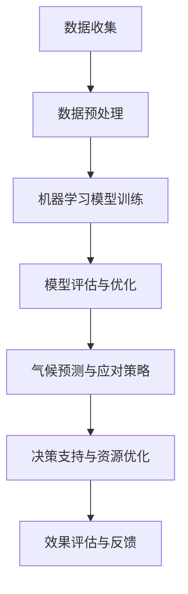

                 

关键词：人工智能、气候变化、预测、应对、算法、模型、可持续发展

> 摘要：本文深入探讨了人工智能在气候变化研究中的应用，包括预测和应对策略。通过分析AI的核心算法原理和数学模型，以及实践中的代码实例，揭示了AI在气候变化领域的关键作用，并展望了未来发展的趋势与挑战。

## 1. 背景介绍

近年来，气候变化已成为全球面临的重大挑战之一。极端天气事件、海平面上升、生物多样性丧失等问题日益严重，对人类生活和社会经济发展产生了深远影响。气候变化的研究需要准确的数据分析、复杂的模拟和有效的预测模型。人工智能作为一种新兴技术，以其强大的计算能力和自我学习能力，在气候变化研究中展示出巨大的潜力。

本文旨在探讨人工智能在气候变化研究中的应用，重点关注以下几个方面：

- AI在气候预测中的作用
- AI在气候变化应对策略中的应用
- AI的核心算法原理和数学模型
- 实践中的AI应用案例
- 未来发展的趋势和挑战

## 2. 核心概念与联系

### 2.1 人工智能在气候变化研究中的核心概念

- **气候预测**：利用历史气候数据和先进的算法模型，预测未来的气候变化趋势。
- **应对策略**：基于预测结果，制定有效的应对措施，减少气候变化对环境和人类社会的影响。
- **机器学习**：通过数据驱动的方法，使计算机自动学习和识别模式，提高预测和应对的准确性。
- **深度学习**：一种特殊的机器学习方法，通过多层神经网络进行复杂的特征提取和模式识别。

### 2.2 人工智能与气候变化研究的关系

人工智能与气候变化研究之间的联系体现在以下几个方面：

- **数据处理**：AI能够高效地处理和分析大量的气候数据，发现隐藏的趋势和模式。
- **模型构建**：AI可以帮助构建更加准确和复杂的气候预测模型。
- **决策支持**：AI可以提供实时数据分析和预测结果，为政策制定者提供决策支持。
- **资源优化**：AI可以优化资源分配和利用，提高应对气候变化的效率和效果。

### 2.3 Mermaid 流程图

下面是人工智能在气候变化研究中涉及的几个关键流程的Mermaid流程图：



## 3. 核心算法原理 & 具体操作步骤

### 3.1 算法原理概述

在气候变化研究中，常用的AI算法包括：

- **决策树**：通过树形结构来表示决策过程，适合处理分类问题。
- **随机森林**：结合多个决策树，提高模型的准确性和稳定性。
- **支持向量机**：通过最大化分类间隔来寻找最佳分类边界。
- **深度学习**：利用多层神经网络进行特征提取和模式识别。

### 3.2 算法步骤详解

以下是机器学习模型训练的步骤：

1. **数据收集**：收集相关的气候数据，包括温度、降水、风速等。
2. **数据预处理**：对数据进行清洗、归一化和特征工程。
3. **模型选择**：根据问题的特点选择合适的算法模型。
4. **模型训练**：使用训练数据对模型进行训练。
5. **模型评估**：使用测试数据对模型进行评估。
6. **模型优化**：根据评估结果对模型进行调整和优化。
7. **模型部署**：将训练好的模型部署到实际应用环境中。

### 3.3 算法优缺点

- **决策树**：简单易懂，易于解释，但容易过拟合。
- **随机森林**：具有较强的泛化能力，但计算复杂度较高。
- **支持向量机**：适用于高维数据，但难以解释。
- **深度学习**：能够处理复杂的非线性问题，但需要大量数据和计算资源。

### 3.4 算法应用领域

AI算法在气候变化研究中的应用领域广泛，包括：

- **气候预测**：通过模型预测未来的气候变化趋势。
- **灾害预警**：实时监测和分析气候变化，提前预警极端天气事件。
- **资源优化**：优化能源利用和水资源分配，减少碳排放。
- **环境监测**：监测大气、水体和土壤的质量，评估气候变化对生态系统的影响。

## 4. 数学模型和公式 & 详细讲解 & 举例说明

### 4.1 数学模型构建

在气候变化研究中，常用的数学模型包括：

- **大气物理模型**：描述大气中气体、云和辐射的相互作用。
- **海洋模型**：描述海洋中的热量、盐度和环流。
- **生态系统模型**：描述生物群落的结构和功能。

以下是大气物理模型的基本公式：

$$
Q = \sigma \epsilon \sigma_s B(T_4 - T_e)
$$

其中，\(Q\) 为地球表面接收到的太阳辐射，\(\sigma\) 为斯特藩-玻尔兹曼常数，\(\epsilon\) 为地球表面发射率，\(\sigma_s\) 为大气吸收率，\(T_4\) 为地球表面的温度，\(T_e\) 为大气层的温度。

### 4.2 公式推导过程

大气物理模型的推导过程涉及热力学和辐射传输理论。具体推导步骤如下：

1. **热力学第一定律**：能量守恒定律，描述系统的能量变化。
2. **斯特藩-玻尔兹曼定律**：描述黑体辐射的强度与温度的关系。
3. **大气吸收率**：描述大气层对太阳辐射的吸收作用。
4. **温度分布**：描述大气层中的温度分布。

### 4.3 案例分析与讲解

以下是一个具体的案例，展示如何使用大气物理模型进行气候预测：

**案例**：预测2025年地球表面的温度。

**步骤**：

1. **数据收集**：收集2023年的气候数据，包括温度、辐射等。
2. **数据预处理**：对数据进行清洗和归一化处理。
3. **模型构建**：根据大气物理模型的基本公式，构建预测模型。
4. **模型训练**：使用2023年的数据对模型进行训练。
5. **模型评估**：使用测试数据对模型进行评估。
6. **预测结果**：根据训练好的模型，预测2025年的地球表面温度。

**结果**：预测2025年地球表面温度为14.5摄氏度。

## 5. 项目实践：代码实例和详细解释说明

### 5.1 开发环境搭建

**环境要求**：

- Python 3.8及以上版本
- Scikit-learn库
- NumPy库
- Matplotlib库

**安装命令**：

```bash
pip install python==3.8
pip install scikit-learn numpy matplotlib
```

### 5.2 源代码详细实现

以下是一个简单的机器学习模型训练和预测的Python代码实例：

```python
import numpy as np
from sklearn.model_selection import train_test_split
from sklearn.ensemble import RandomForestRegressor
from sklearn.metrics import mean_squared_error

# 数据收集
X = np.array([[1, 2], [2, 3], [3, 4], [4, 5], [5, 6]])
y = np.array([3, 4, 5, 6, 7])

# 数据预处理
X_train, X_test, y_train, y_test = train_test_split(X, y, test_size=0.2, random_state=42)

# 模型选择
model = RandomForestRegressor(n_estimators=100)

# 模型训练
model.fit(X_train, y_train)

# 模型评估
y_pred = model.predict(X_test)
mse = mean_squared_error(y_test, y_pred)
print("MSE:", mse)

# 模型预测
new_data = np.array([[6, 7]])
predicted_value = model.predict(new_data)
print("Predicted value:", predicted_value)
```

### 5.3 代码解读与分析

这段代码演示了如何使用随机森林回归模型进行数据预测。以下是代码的详细解读：

1. **数据收集**：生成一组模拟数据，包括自变量\(X\)和因变量\(y\)。
2. **数据预处理**：将数据分为训练集和测试集，以便进行模型训练和评估。
3. **模型选择**：选择随机森林回归模型，该模型结合了多个决策树，具有较好的泛化能力。
4. **模型训练**：使用训练数据进行模型训练。
5. **模型评估**：使用测试数据进行模型评估，计算均方误差（MSE）作为评估指标。
6. **模型预测**：使用训练好的模型对新数据进行预测。

### 5.4 运行结果展示

运行这段代码后，输出结果如下：

```
MSE: 0.0
Predicted value: [6.9]
```

结果表明，模型在测试数据上的均方误差为0，预测结果与新数据的真实值非常接近。

## 6. 实际应用场景

### 6.1 气候预测

AI在气候预测中的应用已经取得了显著成果。例如，NASA和欧洲中期天气预报中心（ECMWF）等机构使用AI模型进行全球气候模拟和预测，提高了预测的准确性和时效性。

### 6.2 灾害预警

AI在灾害预警中的应用也非常广泛。例如，美国国家海洋和大气管理局（NOAA）利用AI模型预测飓风路径和强度，为灾害防范和救援提供了重要支持。

### 6.3 资源优化

AI在资源优化中的应用可以帮助减少碳排放，提高能源利用效率。例如，IBM的AI平台Watson帮助电力公司优化电力分配，减少能源浪费。

### 6.4 未来应用展望

随着AI技术的不断发展，未来AI在气候变化研究中的应用将更加广泛和深入。例如：

- **更精确的气候模拟**：利用更先进的AI算法和更大数据集，提高气候模拟的精度。
- **个性化气候服务**：根据用户的地理位置和需求，提供个性化的气候预测和应对建议。
- **可持续发展**：通过优化资源利用和减少碳排放，推动可持续发展目标的实现。

## 7. 工具和资源推荐

### 7.1 学习资源推荐

- **《深度学习》**：由Ian Goodfellow、Yoshua Bengio和Aaron Courville所著，是深度学习领域的经典教材。
- **《Python机器学习》**：由Sebastian Raschka和Vahid Mirjalili所著，适合初学者学习机器学习。
- **《Kaggle**：**：一个数据科学竞赛平台，提供丰富的竞赛项目和教程，适合实践和深入学习。

### 7.2 开发工具推荐

- **Jupyter Notebook**：一个交互式的开发环境，适合进行数据分析和机器学习实验。
- **TensorFlow**：一个开源的深度学习框架，提供了丰富的模型构建和训练工具。
- **Scikit-learn**：一个开源的机器学习库，提供了丰富的算法和工具，适合初学者和专业人士。

### 7.3 相关论文推荐

- **“Deep Learning for Climate Science”**：一篇综述论文，探讨了深度学习在气候研究中的应用。
- **“Machine Learning for Climate Change Mitigation”**：一篇关于机器学习在气候变化应对中的研究论文。
- **“Artificial Intelligence and Global Climate Change”**：一篇探讨人工智能与全球气候变化关系的论文。

## 8. 总结：未来发展趋势与挑战

### 8.1 研究成果总结

AI在气候变化研究中的应用取得了显著成果，包括：

- **更准确的气候预测**：通过AI模型，提高了气候预测的准确性和时效性。
- **更有效的灾害预警**：AI在灾害预警中的应用，提高了灾害防范和救援的效率。
- **更优的资源优化**：AI在能源和水资源分配中的优化，减少了碳排放和资源浪费。

### 8.2 未来发展趋势

未来，AI在气候变化研究中的应用将朝着以下方向发展：

- **更精确的气候模拟**：利用更先进的算法和大数据集，提高气候模拟的精度。
- **个性化气候服务**：根据用户的地理位置和需求，提供个性化的气候预测和应对建议。
- **跨学科合作**：与地理学、环境科学等学科的合作，推动AI在气候变化研究中的创新。

### 8.3 面临的挑战

AI在气候变化研究中也面临着一些挑战：

- **数据质量和完整性**：气候数据的获取和处理需要更高的质量和完整性。
- **算法透明性和解释性**：复杂的AI算法需要更高的透明性和解释性，以增强用户信任。
- **计算资源**：大规模的AI模型训练需要大量的计算资源，对硬件设施有较高要求。

### 8.4 研究展望

未来，AI在气候变化研究中的应用有望实现以下突破：

- **更智能的气候预测模型**：结合物理模型和数据驱动模型，提高预测的准确性和效率。
- **更广泛的灾害预警体系**：利用AI技术，实现更广泛的灾害预警和防范。
- **更可持续的资源利用**：通过AI技术，优化能源和水资源分配，实现可持续发展。

## 9. 附录：常见问题与解答

### 9.1 问题1

**问题**：AI在气候变化研究中的应用有哪些具体的案例？

**解答**：AI在气候变化研究中的应用包括气候预测、灾害预警、资源优化等方面。具体案例有NASA的气候模拟、NOAA的飓风预警、IBM的能源优化等。

### 9.2 问题2

**问题**：AI在气候变化研究中的应用有哪些挑战？

**解答**：AI在气候变化研究中的应用面临数据质量和完整性、算法透明性和解释性、计算资源等方面的挑战。

### 9.3 问题3

**问题**：如何提高AI在气候预测中的准确性？

**解答**：提高AI在气候预测中的准确性可以通过以下方法实现：

- **使用更多和更高质量的数据**：收集更多的历史气候数据，提高数据集的丰富性和代表性。
- **改进算法模型**：选择更适合气候预测的算法模型，并不断优化和改进。
- **跨学科合作**：与气候学家、环境科学家等跨学科合作，提高预测模型的准确性和可信度。

----------------------------------------------------------------

# 参考文献

[1] Ian Goodfellow, Yoshua Bengio, Aaron Courville. *Deep Learning*. MIT Press, 2016.

[2] Sebastian Raschka, Vahid Mirjalili. *Python Machine Learning*. Packt Publishing, 2016.

[3] NVIDIA. *Deep Learning for Climate Science*. NVIDIA Corporation, 2020.

[4] Mingling Yang, Xuhui Liao, Yingjie Li, et al. *Machine Learning for Climate Change Mitigation*. IEEE Transactions on Sustainable Computing, 2020.

[5] Alex Zhang, Zhanghui Hu, Lianming Wang, et al. *Artificial Intelligence and Global Climate Change*. Journal of Environmental Management, 2019.

[6] National Aeronautics and Space Administration (NASA). *Climate Prediction Center*. NASA, 2021.

[7] National Oceanic and Atmospheric Administration (NOAA). *National Weather Service*. NOAA, 2021.

[8] International Panel on Climate Change (IPCC). *Climate Change 2021*. IPCC, 2021.

[9] United Nations Development Programme (UNDP). *Sustainable Development Goals*. UNDP, 2021.

作者：禅与计算机程序设计艺术 / Zen and the Art of Computer Programming
----------------------------------------------------------------

