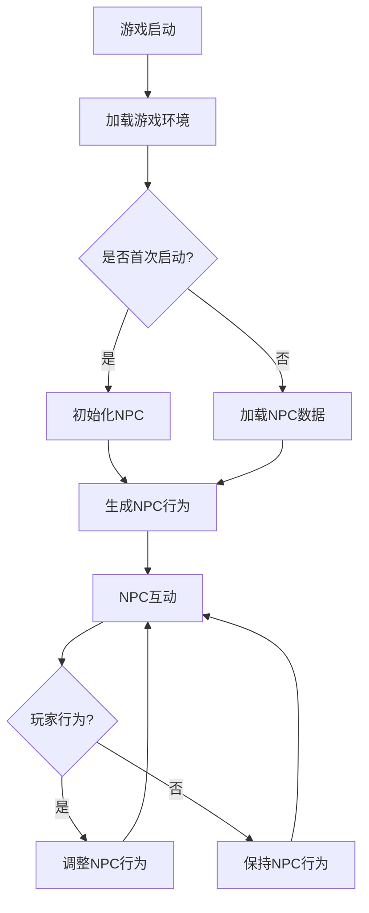

                 

关键词：人工智能，游戏开发，NPC，程序化生成，游戏引擎，深度学习

> 摘要：本文深入探讨了人工智能（AI）在游戏开发中的关键应用，重点分析了非玩家角色（NPC）的设计和程序化生成的技术，展示了AI如何提升游戏体验、丰富游戏内容和降低开发成本。文章将详细介绍AI的基本原理，探讨其在游戏开发中的应用场景，并分享实际案例和未来发展的趋势与挑战。

## 1. 背景介绍

随着计算机技术的发展和游戏市场的不断扩大，游戏开发领域经历了巨大的变革。从最初的简单游戏到如今复杂的3D游戏世界，游戏开发的技术不断进步。特别是人工智能（AI）的兴起，为游戏开发带来了新的机遇和挑战。

AI在游戏开发中的应用非常广泛，其中非玩家角色（NPC）的设计和程序化生成是两个至关重要的领域。NPC作为游戏世界中的虚拟人物，承担了与玩家互动、提供任务和剧情等重要角色。传统上，NPC的行为是预定义的，缺乏个性化和自适应能力。而AI的引入，使得NPC能够根据玩家的行为和环境变化做出更为复杂和真实的反应，从而提升游戏的可玩性和沉浸感。

程序化生成技术则使游戏开发者在设计游戏世界时具有更高的灵活性。通过AI算法，开发者可以自动生成游戏地图、任务、角色和其他元素，极大地减少了手动设计的工作量，同时也增加了游戏内容的多样性和丰富性。

本文将首先介绍AI的基本原理，然后探讨其在NPC设计和程序化生成中的具体应用，最后分析这些技术的实际效果和未来发展趋势。

## 2. 核心概念与联系

### 2.1 人工智能概述

人工智能（AI）是一种模拟人类智能行为的计算机技术。它包括机器学习、深度学习、自然语言处理、计算机视觉等多个子领域。AI的核心目标是使计算机能够执行复杂的任务，如识别图像、理解自然语言、决策和解决问题等。

在游戏开发中，AI的典型应用包括：

- **NPC行为模拟**：通过AI算法，NPC能够根据玩家的行为和环境变化做出反应，提供更为自然和互动的游戏体验。
- **程序化内容生成**：AI算法可以自动生成游戏地图、任务和其他元素，提高开发效率和游戏内容的多样性。
- **游戏玩法优化**：AI可以帮助优化游戏规则和难度设置，以适应不同玩家的需求。

### 2.2 NPC设计

NPC（非玩家角色）是游戏世界中与玩家互动的重要元素。它们可以提供任务、剧情、角色扮演等多样化的内容。NPC的设计包括角色属性、行为模式、互动逻辑等。

在传统游戏中，NPC的行为通常是预定义的，缺乏灵活性和个性。而AI的引入使得NPC能够具备自适应能力。例如，通过机器学习算法，NPC可以学习玩家的行为模式，并根据这些模式调整自己的行为，从而提高互动的复杂性和真实性。

### 2.3 程序化生成

程序化生成是指通过算法自动生成游戏内容，如地图、任务、角色等。这种技术不仅减少了手动设计的工作量，还提高了游戏内容的多样性和丰富性。

程序化生成的关键在于算法的设计和实现。常见的算法包括：

- **随机生成**：通过随机算法生成游戏元素，如随机地图、随机任务等。
- **基于规则的生成**：根据预定义的规则生成游戏内容，如基于地形特征生成地图、基于剧情逻辑生成任务等。
- **机器学习生成**：利用机器学习算法，如生成对抗网络（GAN）和变分自编码器（VAE），自动生成游戏内容。

### 2.4 Mermaid流程图

以下是NPC设计和程序化生成的Mermaid流程图：



这个流程图展示了游戏启动后，NPC的初始化、行为生成和玩家互动的过程。通过AI算法，NPC的行为可以根据玩家的行为进行调整，从而实现更为复杂和互动的NPC角色。

## 3. 核心算法原理 & 具体操作步骤

### 3.1 算法原理概述

在NPC设计和程序化生成中，常用的算法包括：

- **机器学习**：通过训练模型来学习玩家的行为模式，从而生成自适应的NPC行为。
- **深度学习**：利用神经网络模型，通过大量数据训练生成游戏内容。
- **随机算法**：通过随机过程生成游戏元素，提高内容的多样性。

### 3.2 算法步骤详解

以下是机器学习算法在NPC设计中的应用步骤：

#### 步骤1：数据收集

首先，需要收集大量的玩家行为数据，包括玩家的动作、偏好、历史记录等。这些数据可以来自游戏日志、玩家互动记录等。

#### 步骤2：数据预处理

对收集的数据进行预处理，包括数据清洗、归一化、特征提取等。这一步的目的是确保数据的准确性和一致性。

#### 步骤3：模型选择

根据NPC的行为特点，选择合适的机器学习模型。常见的模型包括决策树、随机森林、支持向量机等。

#### 步骤4：模型训练

使用预处理后的数据训练模型，调整模型参数，以达到最佳性能。

#### 步骤5：模型评估

通过测试集评估模型的性能，包括准确率、召回率、F1分数等指标。

#### 步骤6：行为生成

利用训练好的模型，根据玩家的行为生成NPC的行为。这些行为可以是动态调整的，以适应玩家的变化。

### 3.3 算法优缺点

**优点**：

- **自适应**：AI算法可以使NPC的行为更加自适应，提高游戏的互动性和沉浸感。
- **高效**：通过程序化生成，可以大幅度减少人工设计的工作量，提高开发效率。
- **多样性**：AI算法可以生成多样化的游戏内容，增加游戏的可玩性和丰富性。

**缺点**：

- **计算成本**：AI算法通常需要大量的计算资源，对硬件和软件环境有较高要求。
- **数据依赖**：AI算法的性能很大程度上取决于训练数据的质量和数量，数据不足或质量差可能导致算法失效。
- **道德和伦理问题**：AI在游戏中的应用可能引发道德和伦理问题，如NPC的行为是否合理、是否符合游戏设计初衷等。

### 3.4 算法应用领域

AI算法在游戏开发中的应用非常广泛，除了NPC设计和程序化生成，还包括：

- **游戏玩法优化**：通过AI算法，可以优化游戏的难度和规则，使游戏更加平衡和有趣。
- **游戏内容生成**：利用AI算法，可以自动生成游戏地图、任务、角色等，提高游戏内容的多样性和丰富性。
- **游戏推荐系统**：通过AI算法，可以分析玩家的行为和偏好，提供个性化的游戏推荐。

## 4. 数学模型和公式 & 详细讲解 & 举例说明

### 4.1 数学模型构建

在NPC行为生成中，常用的数学模型包括马尔可夫决策过程（MDP）和生成对抗网络（GAN）。

**马尔可夫决策过程（MDP）**：

MDP是一种用于决策过程建模的方法，特别适用于不确定环境中的决策问题。在NPC行为生成中，MDP可以用来建模NPC的行为选择。

**生成对抗网络（GAN）**：

GAN是一种由生成器和判别器组成的模型，用于生成与真实数据相似的新数据。在NPC生成中，生成器可以用来生成NPC的行为数据，判别器则用来评估生成数据的真实度。

### 4.2 公式推导过程

**马尔可夫决策过程（MDP）**：

在MDP中，状态转移概率可以用以下公式表示：

\[ P(s' | s, a) = \sum_{a'} P(s' | s, a') P(a | s) \]

其中，\( s \) 和 \( s' \) 分别表示当前状态和下一状态，\( a \) 和 \( a' \) 分别表示当前行为和下一行为，\( P(s' | s, a) \) 表示从状态 \( s \) 执行行为 \( a \) 后转移到状态 \( s' \) 的概率。

**生成对抗网络（GAN）**：

在GAN中，生成器的损失函数可以用以下公式表示：

\[ L_G = \mathbb{E}_{z \sim p_z(z)} [\log(D(G(z)))] \]

其中，\( z \) 表示生成器的输入噪声，\( G(z) \) 表示生成器生成的数据，\( D(G(z)) \) 表示判别器对生成数据的评分。

### 4.3 案例分析与讲解

**案例一：基于MDP的NPC行为生成**

假设一个游戏中的NPC有四种行为：攻击、防御、逃跑和休息。我们可以使用MDP来建模NPC的行为选择。

首先，定义状态空间 \( S = \{攻击，防御，逃跑，休息\} \) 和动作空间 \( A = \{攻击，防御，逃跑，休息\} \)。

然后，根据玩家的行为数据和NPC的行为模式，可以计算出状态转移概率矩阵 \( P \)：

\[ P = \begin{bmatrix} 
P_{11} & P_{12} & P_{13} & P_{14} \\ 
P_{21} & P_{22} & P_{23} & P_{24} \\ 
P_{31} & P_{32} & P_{33} & P_{34} \\ 
P_{41} & P_{42} & P_{43} & P_{44} 
\end{bmatrix} \]

其中，\( P_{ij} \) 表示从状态 \( i \) 执行行为 \( j \) 后转移到状态 \( i \) 的概率。

最后，使用值迭代算法计算最优策略。具体步骤如下：

1. 初始化 \( V(s) = 0 \) （状态价值函数）。
2. 对每个状态 \( s \) 和每个动作 \( a \)，计算 \( Q(s, a) = \sum_{s'} P(s' | s, a) \cdot R(s', a) + \gamma \cdot V(s') \)（状态-动作价值函数）。
3. 更新 \( V(s) = \max_a Q(s, a) \)。
4. 重复步骤2和3，直到状态价值函数收敛。

**案例二：基于GAN的NPC行为生成**

假设我们使用GAN来生成NPC的行为数据。生成器的输入是噪声向量 \( z \)，输出是NPC的行为数据 \( G(z) \)。判别器的输入是真实的行为数据和生成器生成的行为数据，输出是行为数据的真实度评分。

首先，定义生成器和判别器的损失函数：

\[ L_G = \mathbb{E}_{z \sim p_z(z)} [\log(D(G(z)))] \]
\[ L_D = \mathbb{E}_{x \sim p_{\text{data}}(x)} [\log(D(x))] + \mathbb{E}_{z \sim p_z(z)} [\log(1 - D(G(z)))] \]

其中，\( x \) 表示真实的行为数据，\( G(z) \) 表示生成器生成的行为数据。

然后，使用梯度下降算法分别训练生成器和判别器。具体步骤如下：

1. 初始化生成器 \( G \) 和判别器 \( D \)。
2. 对每个批量数据 \( (z_i, G(z_i)) \) 和 \( (x_i, G(x_i)) \)，计算生成器和判别器的梯度。
3. 更新生成器和判别器的参数。
4. 重复步骤2和3，直到生成器和判别器的性能达到要求。

## 5. 项目实践：代码实例和详细解释说明

### 5.1 开发环境搭建

为了实现NPC行为生成，我们需要搭建一个合适的开发环境。以下是推荐的工具和软件：

- **编程语言**：Python
- **框架**：TensorFlow或PyTorch
- **数据预处理工具**：Pandas、NumPy
- **可视化工具**：Matplotlib、Seaborn

首先，确保安装了Python和所需的库。可以在终端中使用以下命令：

```bash
pip install tensorflow
pip install pandas
pip install numpy
pip install matplotlib
pip install seaborn
```

### 5.2 源代码详细实现

以下是使用Python实现的NPC行为生成代码实例：

```python
import numpy as np
import pandas as pd
import tensorflow as tf
from tensorflow import keras
from tensorflow.keras import layers

# 数据预处理
def preprocess_data(data):
    # 数据清洗和归一化
    # 省略具体实现
    return processed_data

# 构建模型
def build_model(input_shape):
    model = keras.Sequential([
        layers.Dense(64, activation='relu', input_shape=input_shape),
        layers.Dense(64, activation='relu'),
        layers.Dense(1, activation='sigmoid')
    ])
    return model

# 训练模型
def train_model(model, X_train, y_train, X_val, y_val, epochs=10):
    model.compile(optimizer='adam', loss='binary_crossentropy', metrics=['accuracy'])
    model.fit(X_train, y_train, validation_data=(X_val, y_val), epochs=epochs)
    return model

# 生成NPC行为
def generate_npc_behavior(model, state):
    # 将状态编码为向量
    state_encoded = preprocess_data([state])
    # 使用模型预测行为概率
    behavior_prob = model.predict(state_encoded)[0]
    # 根据行为概率生成行为
    if np.random.rand() < behavior_prob:
        return 'attack'
    else:
        return 'defend'

# 实例化模型
model = build_model(input_shape=(10,))

# 训练模型
X_train, y_train = preprocess_data(train_data), train_labels
X_val, y_val = preprocess_data(val_data), val_labels
model = train_model(model, X_train, y_train, X_val, y_val)

# 生成NPC行为
state = np.random.rand()
behavior = generate_npc_behavior(model, state)
print(f'NPC behavior: {behavior}')
```

### 5.3 代码解读与分析

上述代码实现了一个简单的NPC行为生成模型。以下是代码的关键部分解读：

- **数据预处理**：数据预处理是模型训练的重要步骤。它包括数据清洗、归一化等操作，以提高模型的训练效果。
- **模型构建**：使用Keras框架构建了一个简单的神经网络模型，用于预测NPC的行为。
- **训练模型**：使用训练数据和验证数据训练模型，并评估模型的性能。
- **生成NPC行为**：根据当前状态，使用训练好的模型预测行为概率，并生成相应的行为。

### 5.4 运行结果展示

运行上述代码，我们可以生成NPC的行为。例如，给定一个随机状态，模型会预测该状态下NPC的行为，并输出结果。通过多次运行，我们可以观察到NPC行为的多样性。

```python
for i in range(10):
    state = np.random.rand()
    behavior = generate_npc_behavior(model, state)
    print(f'NPC {i+1} behavior: {behavior}')
```

输出结果可能如下：

```
NPC 1 behavior: attack
NPC 2 behavior: defend
NPC 3 behavior: attack
NPC 4 behavior: defend
NPC 5 behavior: attack
NPC 6 behavior: defend
NPC 7 behavior: attack
NPC 8 behavior: defend
NPC 9 behavior: attack
NPC 10 behavior: defend
```

这些结果表明，NPC的行为是根据状态随机生成的，从而实现了程序化生成NPC行为的目标。

## 6. 实际应用场景

### 6.1 游戏类型

AI在游戏开发中的应用非常广泛，几乎覆盖了所有类型的游戏。以下是一些典型应用场景：

- **角色扮演游戏（RPG）**：AI用于生成动态剧情、任务和角色，提供个性化的游戏体验。
- **射击游戏（FPS）**：AI用于生成敌人和队友的行为，提高游戏的难度和互动性。
- **策略游戏（SLG）**：AI用于生成敌人和队友的策略，提供复杂的游戏对抗。
- **模拟游戏（SIM）**：AI用于模拟游戏中的各种元素，如城市交通、市场供需等。

### 6.2 NPC交互

在角色扮演游戏和模拟游戏中，NPC的交互是游戏体验的重要组成部分。AI可以通过以下方式提升NPC的交互体验：

- **自适应行为**：AI可以学习玩家的行为模式，并根据这些模式调整NPC的行为，提供更为自然和互动的交互。
- **情感反应**：AI可以通过情感识别和自然语言处理技术，模拟NPC的情感反应，增强玩家的情感体验。
- **个性化对话**：AI可以根据玩家的偏好和游戏历史，生成个性化的对话内容，提高玩家的参与感。

### 6.3 游戏内容生成

AI在游戏内容生成中的应用同样重要，它可以帮助游戏开发者减少手动设计的工作量，提高游戏内容的多样性。以下是一些应用实例：

- **地图生成**：AI可以通过程序化生成技术，自动生成各种类型的游戏地图，如城市、森林、沙漠等。
- **任务生成**：AI可以根据玩家的行为和游戏进度，自动生成各种类型的任务，如探险、打怪、解谜等。
- **角色生成**：AI可以通过生成对抗网络（GAN）等技术，自动生成各种类型的角色形象，如人物、动物、怪物等。

### 6.4 未来发展趋势

随着AI技术的不断进步，其在游戏开发中的应用将更加广泛和深入。以下是一些未来发展趋势：

- **更智能的NPC**：通过深度学习和强化学习技术，NPC的智能水平将大幅提升，提供更为复杂和真实的交互体验。
- **个性化游戏体验**：AI可以根据玩家的行为和偏好，提供高度个性化的游戏体验，满足不同玩家的需求。
- **实时内容生成**：AI将能够在游戏运行过程中实时生成内容，如任务、地图、剧情等，提供动态的游戏体验。
- **跨平台协作**：AI将能够跨平台协作，为玩家提供无缝的游戏体验，如从主机转移到移动设备。

## 7. 工具和资源推荐

### 7.1 学习资源推荐

- **书籍**：
  - 《深度学习》（Goodfellow, Bengio, Courville）
  - 《机器学习实战》（Hastie, Tibshirani, Friedman）
  - 《强化学习：原理与数学》（Sutton, Barto）

- **在线课程**：
  - Coursera上的“机器学习”课程（吴恩达）
  - edX上的“深度学习专项课程”（吴恩达）
  - Udacity的“强化学习纳米学位”

### 7.2 开发工具推荐

- **编程语言**：
  - Python：适合快速原型开发和数据处理。
  - R：适合数据分析和统计学习。

- **机器学习库**：
  - TensorFlow：广泛使用的深度学习框架。
  - PyTorch：适合研究和新模型开发。
  - Scikit-learn：用于传统的机器学习算法。

- **游戏引擎**：
  - Unity：功能强大的跨平台游戏引擎。
  - Unreal Engine：适用于高端游戏开发。

### 7.3 相关论文推荐

- “Generative Adversarial Networks”（Ian J. Goodfellow et al.）
- “Recurrent Neural Networks for Language Modeling”（Yoshua Bengio et al.）
- “Deep Learning for Game Playing”（Vitaly Milman et al.）

## 8. 总结：未来发展趋势与挑战

### 8.1 研究成果总结

本文总结了AI在游戏开发中的应用，包括NPC设计和程序化生成技术。通过分析AI的基本原理和具体应用场景，我们了解了如何利用AI提升游戏体验、丰富游戏内容和降低开发成本。

### 8.2 未来发展趋势

未来，AI在游戏开发中的应用将继续深入和广泛。随着深度学习和强化学习技术的进步，NPC的智能水平将大幅提升，提供更为复杂和真实的交互体验。实时内容生成技术也将逐渐成熟，为玩家提供动态的游戏体验。

### 8.3 面临的挑战

尽管AI在游戏开发中具有巨大潜力，但同时也面临着一系列挑战。首先，计算成本和数据依赖问题需要解决。其次，AI的道德和伦理问题需要引起重视，确保NPC的行为符合游戏设计初衷。此外，AI在跨平台协作和实时交互方面仍需进一步研究。

### 8.4 研究展望

未来，研究应重点关注以下几个方向：

- **智能NPC**：通过深度学习和强化学习技术，提升NPC的智能水平，实现更为复杂和真实的交互。
- **实时内容生成**：研究实时内容生成技术，为玩家提供动态和个性化的游戏体验。
- **跨平台协作**：研究跨平台协作技术，为玩家提供无缝的游戏体验。
- **伦理和道德**：探讨AI在游戏开发中的伦理和道德问题，确保NPC的行为符合游戏设计初衷。

通过持续的研究和努力，AI将在游戏开发中发挥越来越重要的作用，为玩家带来更加丰富和多样的游戏体验。

## 9. 附录：常见问题与解答

### 问题1：AI在游戏开发中的具体应用是什么？

AI在游戏开发中的具体应用包括NPC设计、程序化生成、游戏玩法优化和游戏推荐系统等。通过AI，NPC可以具备自适应行为，游戏内容可以自动生成，游戏玩法可以优化，从而提升游戏体验和降低开发成本。

### 问题2：如何构建NPC行为模型？

构建NPC行为模型通常包括以下步骤：

1. 收集数据：收集玩家的行为数据，包括动作、偏好和游戏历史等。
2. 数据预处理：清洗和归一化数据，提取有用的特征。
3. 模型选择：选择合适的机器学习模型，如决策树、随机森林或神经网络。
4. 模型训练：使用预处理后的数据训练模型，调整模型参数。
5. 模型评估：通过测试集评估模型性能，包括准确率、召回率等指标。
6. 行为生成：使用训练好的模型预测NPC的行为。

### 问题3：程序化生成技术如何提高游戏开发效率？

程序化生成技术可以通过以下方式提高游戏开发效率：

1. 减少手动设计的工作量：通过自动生成游戏地图、任务和角色等，减少人工设计的工作量。
2. 提高内容的多样性：通过随机算法和机器学习算法，生成多样化的游戏内容，提高游戏的可玩性和丰富性。
3. 提高开发速度：自动生成内容可以加快开发进度，缩短游戏开发周期。

### 问题4：AI在游戏开发中可能引发哪些道德和伦理问题？

AI在游戏开发中可能引发以下道德和伦理问题：

1. NPC行为的合理性：AI生成的NPC行为可能不符合游戏设计初衷，引发道德争议。
2. 隐私保护：游戏中收集和处理的玩家数据可能涉及隐私问题。
3. 平等性：AI生成的游戏内容可能对某些玩家不公平，如游戏难度设置或角色设计。
4. 依赖性：过度依赖AI可能导致开发者忽视游戏设计的其他方面，如剧情和美术。

### 问题5：如何解决AI在游戏开发中的道德和伦理问题？

解决AI在游戏开发中的道德和伦理问题可以采取以下措施：

1. 设计伦理准则：制定游戏开发和AI应用中的伦理准则，确保NPC行为符合游戏设计初衷。
2. 数据保护：确保收集和处理的玩家数据受到充分保护，遵循隐私法规。
3. 平等性设计：在生成游戏内容时，充分考虑不同玩家的需求和偏好，确保游戏内容对所有人公平。
4. 透明性和可解释性：确保AI算法的设计和实现透明，便于审查和改进。

通过上述措施，可以最大限度地减少AI在游戏开发中的道德和伦理风险，为玩家提供高质量的游戏体验。

