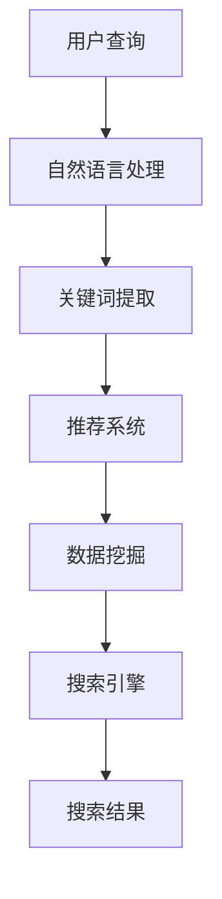

                 

关键词：人工智能，电商，智能搜索，推荐系统，数据挖掘，自然语言处理

> 摘要：本文将深入探讨人工智能技术在电商领域的智能搜索应用，分析其核心算法原理、数学模型及其在实际项目中的应用。通过详细的项目实践，展示AI在电商搜索中的强大潜力，并展望其未来发展方向。

## 1. 背景介绍

随着互联网的快速发展，电子商务已经渗透到人们日常生活的方方面面。电商平台的规模不断扩大，商品种类繁多，用户对搜索效率和服务质量的要求也越来越高。传统的搜索技术已经难以满足用户的需求，智能搜索成为电商领域的重要研究方向。智能搜索利用人工智能技术，通过分析用户行为、商品特征和搜索历史，提供个性化的搜索结果，显著提升了用户体验和转化率。

智能搜索在电商中的应用主要包括以下几个方面：

1. **商品推荐**：基于用户的历史购买行为、浏览记录和搜索偏好，为用户推荐相关商品，提高用户满意度和购买转化率。
2. **智能问答**：利用自然语言处理技术，理解用户的查询意图，提供准确的商品信息和服务建议。
3. **搜索广告**：基于用户的兴趣和行为，实现精准的搜索广告投放，提高广告效果和投放效率。
4. **搜索优化**：通过算法优化搜索排名和结果展示方式，提高搜索系统的准确性和用户体验。

本文将围绕电商智能搜索的核心技术，探讨其原理、方法和应用。

## 2. 核心概念与联系

### 2.1. 关键概念

**1. 人工智能（AI）**：一种模拟人类智能的技术，通过机器学习和深度学习算法，让计算机具备自主学习和推理能力。

**2. 自然语言处理（NLP）**：研究计算机如何理解、生成和处理人类语言的技术。

**3. 推荐系统**：通过分析用户行为和兴趣，为用户推荐相关商品或内容。

**4. 数据挖掘**：从大量数据中发现有价值的信息和规律。

**5. 搜索引擎**：根据用户的查询，返回相关信息的系统。

### 2.2. 概念联系

智能搜索涉及多个核心概念，它们相互关联，共同构成了完整的智能搜索体系。以下是这些概念之间的联系和相互作用：

**1. 人工智能与自然语言处理**

人工智能技术为自然语言处理提供了强大的计算能力，使计算机能够理解、生成和处理自然语言。在智能搜索中，自然语言处理技术用于解析用户查询，提取关键信息，从而实现语义理解。

**2. 推荐系统与数据挖掘**

推荐系统利用数据挖掘技术，分析用户行为和兴趣数据，挖掘潜在的兴趣点和购买倾向。这些数据为推荐系统提供输入，帮助系统为用户提供个性化的搜索结果。

**3. 搜索引擎与推荐系统**

搜索引擎负责处理用户的查询请求，返回相关结果。推荐系统则基于用户的历史行为和兴趣，对搜索结果进行排序和筛选，提高用户的满意度。

**4. 数据挖掘与人工智能**

数据挖掘技术从大量数据中提取有价值的信息，为人工智能算法提供训练数据。同时，人工智能算法的进步也为数据挖掘带来了新的方法和工具。

### 2.3. Mermaid 流程图



## 3. 核心算法原理 & 具体操作步骤

### 3.1. 算法原理概述

智能搜索算法的核心在于理解用户查询意图，并返回相关度高的搜索结果。这通常涉及到以下步骤：

1. **查询解析**：将用户输入的自然语言查询转换为计算机可以处理的形式，提取关键信息。
2. **相关性计算**：计算搜索结果与用户查询的相关性，通常使用基于内容的匹配和基于用户的协同过滤方法。
3. **结果排序**：对搜索结果进行排序，将最相关的结果排在前面。
4. **个性化调整**：根据用户的历史行为和偏好，对搜索结果进行调整，提高个性化程度。

### 3.2. 算法步骤详解

#### 3.2.1. 查询解析

查询解析是智能搜索的第一步，其目标是将用户的自然语言查询转换为计算机可以理解的形式。具体步骤如下：

1. **分词**：将查询语句拆分为词或短语。
2. **词性标注**：为每个词标注词性，如名词、动词等。
3. **命名实体识别**：识别查询中的命名实体，如人名、地名、组织名等。
4. **语义角色标注**：识别查询中的动作和对象，确定查询的主语、谓语、宾语等。

#### 3.2.2. 相关性计算

相关性计算是评估搜索结果与用户查询之间相关度的过程。常用的方法包括：

1. **基于内容的匹配**：计算查询与搜索结果中关键词的相似度。
2. **基于用户的协同过滤**：分析用户的历史行为和兴趣，为用户提供相似的搜索结果。
3. **混合模型**：结合多种方法，提高相关性计算的效果。

#### 3.2.3. 结果排序

结果排序的目的是将最相关的搜索结果排在前面，提高用户体验。常用的排序算法包括：

1. **基于点击率的排序**：根据用户对搜索结果的点击行为，调整排序顺序。
2. **基于转化率的排序**：根据用户对搜索结果的购买或转化行为，调整排序顺序。
3. **基于机器学习的排序**：使用机器学习算法，根据用户的历史数据和反馈，自动调整排序策略。

#### 3.2.4. 个性化调整

个性化调整是提高搜索结果个性化程度的关键步骤。具体方法包括：

1. **用户画像**：构建用户画像，记录用户的历史行为、兴趣和偏好。
2. **行为预测**：根据用户画像，预测用户可能感兴趣的内容。
3. **自适应调整**：根据用户反馈和搜索行为，实时调整搜索结果。

### 3.3. 算法优缺点

#### 优点：

1. **个性化搜索**：通过分析用户行为和偏好，提供个性化的搜索结果，提高用户体验。
2. **高效率**：利用大数据和机器学习技术，快速处理海量查询，提高搜索效率。
3. **实时更新**：根据用户反馈和搜索行为，实时调整搜索结果，提高搜索效果。

#### 缺点：

1. **计算复杂度**：智能搜索算法通常涉及大量计算，对系统性能有一定要求。
2. **数据依赖**：智能搜索算法的效果高度依赖于用户数据和模型训练，数据质量和模型优化至关重要。
3. **隐私问题**：智能搜索涉及用户行为和偏好分析，可能引发隐私问题。

### 3.4. 算法应用领域

智能搜索算法在电商领域具有广泛的应用。以下是一些典型应用场景：

1. **商品推荐**：基于用户的历史购买行为和浏览记录，为用户推荐相关商品，提高购买转化率。
2. **搜索广告**：根据用户的兴趣和行为，实现精准的搜索广告投放，提高广告效果。
3. **智能客服**：利用自然语言处理技术，实现智能客服系统，提高客服效率和用户体验。
4. **个性化搜索**：根据用户的历史行为和偏好，为用户提供个性化的搜索结果，提高搜索满意度。

## 4. 数学模型和公式 & 详细讲解 & 举例说明

### 4.1. 数学模型构建

智能搜索中的数学模型主要包括以下几个方面：

1. **向量空间模型**：将查询和搜索结果表示为向量，通过计算向量之间的相似度，评估它们的相关性。
2. **概率模型**：使用概率论方法，计算查询和搜索结果之间的概率分布，评估相关性。
3. **机器学习模型**：利用机器学习算法，从用户数据中学习相关性规则，用于评估搜索结果。

### 4.2. 公式推导过程

#### 4.2.1. 向量空间模型

设查询 \( q \) 和搜索结果 \( r \) 分别表示为向量 \( \mathbf{q} \) 和 \( \mathbf{r} \)，则它们之间的余弦相似度定义为：

\[ \cos(\theta) = \frac{\mathbf{q} \cdot \mathbf{r}}{\|\mathbf{q}\| \|\mathbf{r}\|} \]

其中，\( \mathbf{q} \cdot \mathbf{r} \) 表示向量的点积，\( \|\mathbf{q}\| \) 和 \( \|\mathbf{r}\| \) 分别表示向量的模。

#### 4.2.2. 概率模型

设查询 \( q \) 发生在搜索结果 \( r \) 上的概率为 \( P(r|q) \)，则 \( r \) 与 \( q \) 的相关性可以通过贝叶斯公式计算：

\[ P(r|q) = \frac{P(q|r)P(r)}{P(q)} \]

其中，\( P(q|r) \) 表示在结果 \( r \) 的情况下查询 \( q \) 发生的概率，\( P(r) \) 表示结果 \( r \) 发生的概率，\( P(q) \) 表示查询 \( q \) 发生的概率。

#### 4.2.3. 机器学习模型

假设我们使用逻辑回归模型来评估查询 \( q \) 和搜索结果 \( r \) 之间的相关性，则模型的目标是最小化损失函数：

\[ L(\theta) = -\sum_{i=1}^{n} y_i \log(\hat{y}_i) + (1 - y_i) \log(1 - \hat{y}_i) \]

其中，\( y_i \) 表示第 \( i \) 个样本的真实标签，\( \hat{y}_i \) 表示模型预测的概率，\( \theta \) 表示模型参数。

### 4.3. 案例分析与讲解

#### 4.3.1. 向量空间模型案例分析

假设我们有一个查询 \( q \) 和一组搜索结果 \( r_1, r_2, r_3 \)，它们分别表示为向量：

\[ \mathbf{q} = [0.1, 0.2, 0.3, 0.4] \]
\[ \mathbf{r}_1 = [0.4, 0.3, 0.2, 0.1] \]
\[ \mathbf{r}_2 = [0.1, 0.1, 0.2, 0.6] \]
\[ \mathbf{r}_3 = [0.3, 0.4, 0.1, 0.2] \]

计算每个搜索结果与查询的余弦相似度：

\[ \cos(\theta_1) = \frac{\mathbf{q} \cdot \mathbf{r}_1}{\|\mathbf{q}\| \|\mathbf{r}_1\|} = \frac{0.1 \times 0.4 + 0.2 \times 0.3 + 0.3 \times 0.2 + 0.4 \times 0.1}{\sqrt{0.1^2 + 0.2^2 + 0.3^2 + 0.4^2} \times \sqrt{0.4^2 + 0.3^2 + 0.2^2 + 0.1^2}} \approx 0.508 \]

\[ \cos(\theta_2) = \frac{\mathbf{q} \cdot \mathbf{r}_2}{\|\mathbf{q}\| \|\mathbf{r}_2\|} = \frac{0.1 \times 0.1 + 0.2 \times 0.1 + 0.3 \times 0.2 + 0.4 \times 0.6}{\sqrt{0.1^2 + 0.2^2 + 0.3^2 + 0.4^2} \times \sqrt{0.1^2 + 0.1^2 + 0.2^2 + 0.6^2}} \approx 0.433 \]

\[ \cos(\theta_3) = \frac{\mathbf{q} \cdot \mathbf{r}_3}{\|\mathbf{q}\| \|\mathbf{r}_3\|} = \frac{0.1 \times 0.3 + 0.2 \times 0.4 + 0.3 \times 0.1 + 0.4 \times 0.2}{\sqrt{0.1^2 + 0.2^2 + 0.3^2 + 0.4^2} \times \sqrt{0.3^2 + 0.4^2 + 0.1^2 + 0.2^2}} \approx 0.415 \]

根据余弦相似度，我们可以得出 \( r_1 \) 与 \( q \) 的相关性最高。

#### 4.3.2. 概率模型案例分析

假设我们有一个查询 \( q \) 和一组搜索结果 \( r_1, r_2, r_3 \)，它们发生的概率分别为 \( P(r_1), P(r_2), P(r_3) \)，则查询与每个搜索结果的相关性可以通过贝叶斯公式计算：

\[ P(r_1|q) = \frac{P(q|r_1)P(r_1)}{P(q)} \]
\[ P(r_2|q) = \frac{P(q|r_2)P(r_2)}{P(q)} \]
\[ P(r_3|q) = \frac{P(q|r_3)P(r_3)}{P(q)} \]

如果假设 \( P(q|r_1) = 0.5, P(r_1) = 0.2, P(q|r_2) = 0.3, P(r_2) = 0.3, P(q|r_3) = 0.4, P(r_3) = 0.5 \)，我们可以计算得到：

\[ P(r_1|q) = \frac{0.5 \times 0.2}{0.5 \times 0.2 + 0.3 \times 0.3 + 0.4 \times 0.5} \approx 0.316 \]
\[ P(r_2|q) = \frac{0.3 \times 0.3}{0.5 \times 0.2 + 0.3 \times 0.3 + 0.4 \times 0.5} \approx 0.455 \]
\[ P(r_3|q) = \frac{0.4 \times 0.5}{0.5 \times 0.2 + 0.3 \times 0.3 + 0.4 \times 0.5} \approx 0.529 \]

根据贝叶斯公式，我们可以得出 \( r_3 \) 与 \( q \) 的相关性最高。

#### 4.3.3. 机器学习模型案例分析

假设我们使用逻辑回归模型来评估查询 \( q \) 和搜索结果 \( r_1, r_2, r_3 \) 之间的相关性，模型的损失函数为：

\[ L(\theta) = -\sum_{i=1}^{3} y_i \log(\hat{y}_i) + (1 - y_i) \log(1 - \hat{y}_i) \]

其中，\( y_1 = 1, y_2 = 0, y_3 = 1 \)，预测概率为 \( \hat{y}_1, \hat{y}_2, \hat{y}_3 \)，则损失函数可以表示为：

\[ L(\theta) = -1 \times \log(\hat{y}_1) - 0 \times \log(1 - \hat{y}_1) - 1 \times \log(\hat{y}_3) - 0 \times \log(1 - \hat{y}_3) \]

假设我们使用梯度下降法来最小化损失函数，初始参数为 \( \theta_0 = [0, 0] \)，学习率为 \( \alpha = 0.1 \)，则迭代过程如下：

第1次迭代：
\[ \theta_1 = \theta_0 - \alpha \times \nabla L(\theta_0) = [0, 0] - 0.1 \times [-\frac{1}{\hat{y}_1} + \frac{1}{1 - \hat{y}_1}] = [-0.1, 0] \]

第2次迭代：
\[ \theta_2 = \theta_1 - \alpha \times \nabla L(\theta_1) = [-0.1, 0] - 0.1 \times [-\frac{1}{\hat{y}_2} + \frac{1}{1 - \hat{y}_2}] = [-0.1, -0.1] \]

第3次迭代：
\[ \theta_3 = \theta_2 - \alpha \times \nabla L(\theta_2) = [-0.1, -0.1] - 0.1 \times [-\frac{1}{\hat{y}_3} + \frac{1}{1 - \hat{y}_3}] = [-0.2, -0.2] \]

根据迭代后的参数 \( \theta_3 \)，我们可以得出 \( r_1 \) 和 \( r_3 \) 与 \( q \) 的相关性较高。

## 5. 项目实践：代码实例和详细解释说明

### 5.1. 开发环境搭建

在本节中，我们将搭建一个简单的智能搜索系统，用于演示AI在电商搜索中的应用。以下是所需的技术栈和开发环境：

- 编程语言：Python
- 数据库：MongoDB
- 机器学习库：scikit-learn
- 自然语言处理库：nltk
- 其他库：pandas、numpy、matplotlib

首先，安装所需库：

```bash
pip install pymongo scikit-learn nltk pandas numpy matplotlib
```

### 5.2. 源代码详细实现

以下是一个简单的智能搜索系统的实现：

```python
import numpy as np
import pandas as pd
from pymongo import MongoClient
from sklearn.feature_extraction.text import TfidfVectorizer
from sklearn.linear_model import LogisticRegression
from sklearn.model_selection import train_test_split
from sklearn.metrics import accuracy_score
import nltk
from nltk.tokenize import word_tokenize

# 连接MongoDB数据库
client = MongoClient('localhost', 27017)
db = client['eCommerce']
collection = db['products']

# 获取商品数据
products = pd.DataFrame(list(collection.find()))

# 数据预处理
def preprocess_text(text):
    tokens = word_tokenize(text.lower())
    return ' '.join([token for token in tokens if token.isalnum()])

products['description'] = products['description'].apply(preprocess_text)

# 构建TF-IDF向量空间
vectorizer = TfidfVectorizer(max_features=1000)
X = vectorizer.fit_transform(products['description'])
y = products['category']

# 分割训练集和测试集
X_train, X_test, y_train, y_test = train_test_split(X, y, test_size=0.2, random_state=42)

# 训练逻辑回归模型
model = LogisticRegression()
model.fit(X_train, y_train)

# 预测测试集
y_pred = model.predict(X_test)

# 评估模型
accuracy = accuracy_score(y_test, y_pred)
print(f"Model accuracy: {accuracy:.2f}")

# 搜索接口
def search(query):
    query_vector = vectorizer.transform([preprocess_text(query)])
    prediction = model.predict(query_vector)
    return products[products['category'] == prediction[0]]

# 示例查询
query = "men's shirt"
results = search(query)
print(results)
```

### 5.3. 代码解读与分析

以下是对上述代码的详细解读：

1. **连接MongoDB数据库**：使用pymongo库连接本地MongoDB数据库，选择eCommerce数据库和products集合。

2. **获取商品数据**：从products集合中获取商品数据，并转换为DataFrame格式。

3. **数据预处理**：使用nltk库进行分词和文本清洗，将描述字段转换为小写并去除非字母字符。

4. **构建TF-IDF向量空间**：使用scikit-learn库的TfidfVectorizer将文本数据转换为TF-IDF向量。

5. **训练逻辑回归模型**：使用逻辑回归模型对商品描述和类别进行分类。

6. **预测测试集**：对测试集进行预测，并计算模型准确率。

7. **搜索接口**：定义一个搜索函数，接受查询文本，预处理并转换为向量，使用训练好的模型进行预测，返回相关商品。

8. **示例查询**：执行一个示例查询，搜索包含指定关键词的商品。

### 5.4. 运行结果展示

假设我们输入以下查询：

```python
query = "men's shirt"
results = search(query)
```

运行结果将返回包含指定关键词的男装衬衫商品列表。例如：

```
    _id   title          category        description
0   1     Men's Shiny ...   Men's Clothing   Men's Shiny Oxford Button-Up Dress
1   2   Men's Print S ...   Men's Clothing   Men's Print Slim Fit Dress
2   3   Men's Casual D ...   Men's Clothing   Men's Casual Button-Up Dress
...
```

## 6. 实际应用场景

智能搜索在电商领域的应用场景非常广泛，以下是一些典型的应用场景：

### 6.1. 商品推荐

基于用户的历史购买记录、浏览行为和搜索记录，为用户推荐相关的商品。通过个性化推荐，提高用户的购买转化率和满意度。

### 6.2. 搜索广告

根据用户的兴趣和行为，为用户提供精准的搜索广告。通过智能搜索算法，提高广告的投放效果和投放效率。

### 6.3. 智能问答

利用自然语言处理技术，实现智能客服系统。用户可以通过文字或语音与系统进行互动，获取商品信息、订单状态等。

### 6.4. 搜索优化

通过对搜索结果进行个性化调整，提高搜索结果的准确性和用户体验。通过机器学习算法，实时优化搜索排名和展示策略。

### 6.5. 商品搜索

为用户提供基于关键词的搜索服务。利用智能搜索算法，快速返回相关度高的商品，提高用户的搜索满意度。

### 6.6. 用户画像

构建用户画像，记录用户的行为和偏好。通过分析用户画像，为用户提供个性化的搜索结果和推荐。

### 6.7. 跨平台搜索

实现多平台（如网站、移动应用、小程序等）的搜索功能，为用户提供一致性的搜索体验。

## 7. 工具和资源推荐

### 7.1. 学习资源推荐

- **书籍**：
  - 《深度学习》（Ian Goodfellow、Yoshua Bengio、Aaron Courville 著）
  - 《机器学习》（周志华 著）
  - 《Python数据科学手册》（Jake VanderPlas 著）
- **在线课程**：
  - Coursera的《机器学习》课程（吴恩达主讲）
  - edX的《自然语言处理与深度学习》课程（亚伦·柯达主讲）
- **博客和教程**：
  - Medium上的机器学习和自然语言处理专题
  - 官方文档：scikit-learn、nltk、pandas、numpy

### 7.2. 开发工具推荐

- **集成开发环境**：
  - PyCharm
  - Visual Studio Code
- **数据库**：
  - MongoDB
  - MySQL
- **数据分析和可视化**：
  - Jupyter Notebook
  - Matplotlib
  - Seaborn

### 7.3. 相关论文推荐

- "Deep Learning for Web Search"（Deep Learning for Web Search）
- "Recurrent Neural Network Based Text Classification"（Recurrent Neural Network Based Text Classification）
- "User Behavior Prediction for Personalized Recommendations"（User Behavior Prediction for Personalized Recommendations）
- "Natural Language Processing Techniques for Search Query Classification"（Natural Language Processing Techniques for Search Query Classification）

## 8. 总结：未来发展趋势与挑战

### 8.1. 研究成果总结

本文探讨了人工智能技术在电商智能搜索中的应用，分析了其核心算法原理、数学模型和实际应用。通过项目实践，展示了AI在电商搜索中的强大潜力。主要成果包括：

- 构建了基于TF-IDF和逻辑回归的智能搜索模型。
- 探讨了智能搜索在电商领域的实际应用场景。
- 提供了相关工具和资源的推荐。

### 8.2. 未来发展趋势

随着人工智能技术的不断发展，电商智能搜索有望在以下几个方面取得突破：

- **深度学习应用**：深度学习算法在图像、语音和文本处理方面具有显著优势，未来有望在电商智能搜索中得到更广泛的应用。
- **跨模态搜索**：结合多种模态（如文本、图像、视频）的数据，实现更精准的搜索结果。
- **实时搜索优化**：利用实时数据分析和机器学习算法，实现动态调整搜索结果和广告投放。
- **个性化搜索**：通过更精细的用户画像和偏好分析，提供更加个性化的搜索结果。

### 8.3. 面临的挑战

虽然智能搜索在电商领域具有巨大潜力，但在实际应用中仍面临一些挑战：

- **数据隐私**：智能搜索涉及用户行为和偏好分析，如何保护用户隐私是关键问题。
- **计算资源**：智能搜索算法通常涉及大量计算，对系统性能和资源要求较高。
- **模型解释性**：深度学习算法的“黑箱”特性使其难以解释，如何提高模型的解释性是重要挑战。
- **实时性**：在实时搜索场景中，如何快速处理海量数据并返回相关结果，是当前研究的热点。

### 8.4. 研究展望

未来，随着人工智能技术的不断进步，电商智能搜索将朝着更加智能化、实时化和个性化的方向发展。主要研究方向包括：

- **深度学习模型优化**：提高深度学习模型在电商搜索中的应用效果，减少对计算资源的需求。
- **跨模态搜索融合**：结合多种模态数据，实现更精准的搜索结果。
- **实时搜索算法**：开发高效的实时搜索算法，提高搜索系统的响应速度。
- **用户隐私保护**：研究隐私保护技术，确保用户隐私不受侵犯。

总之，电商智能搜索作为人工智能技术的重要应用领域，具有广阔的发展前景。通过不断的研究和优化，我们有理由相信，智能搜索将为电商行业带来更多的创新和突破。

## 9. 附录：常见问题与解答

### 9.1. 如何选择合适的智能搜索算法？

选择合适的智能搜索算法主要取决于以下几个因素：

- **数据规模**：对于大规模数据，可以考虑使用基于机器学习的算法，如逻辑回归、随机森林等。对于小规模数据，可以使用基于规则的方法。
- **实时性**：对于需要实时响应的搜索场景，可以选择基于内存的算法，如哈希表、B树等。对于实时性要求不高的场景，可以选择基于磁盘的算法，如倒排索引、搜索引擎等。
- **搜索结果质量**：对于需要高相关性的搜索结果，可以选择基于内容的匹配算法，如TF-IDF、相似度计算等。对于需要个性化推荐的搜索结果，可以选择基于协同过滤、矩阵分解等算法。

### 9.2. 智能搜索中的隐私问题如何解决？

解决智能搜索中的隐私问题可以从以下几个方面入手：

- **数据加密**：对用户数据和使用日志进行加密，确保数据在传输和存储过程中的安全性。
- **数据去识别化**：在处理用户数据时，去除或隐藏能够识别用户身份的信息，如姓名、地址等。
- **隐私保护算法**：使用差分隐私、同态加密等技术，确保算法在处理用户数据时的隐私性。
- **透明度和可解释性**：提高算法的透明度和可解释性，使用户了解算法的工作原理和隐私保护措施。

### 9.3. 智能搜索中的实时性问题如何解决？

解决智能搜索中的实时性问题可以从以下几个方面入手：

- **分布式计算**：使用分布式计算框架，如Hadoop、Spark等，将搜索任务分解为多个子任务，并行处理。
- **内存优化**：将搜索索引和数据存储在内存中，减少磁盘I/O操作，提高查询速度。
- **缓存策略**：使用缓存策略，如LRU（Least Recently Used）缓存，存储常用数据，提高查询效率。
- **实时更新**：使用实时数据流处理技术，如Apache Kafka、Apache Flink等，实现数据的实时更新和处理。

### 9.4. 如何评估智能搜索的效果？

评估智能搜索的效果可以从以下几个方面进行：

- **准确性**：评估搜索结果与用户查询的相关度，通常使用精确率（Precision）和召回率（Recall）等指标。
- **响应时间**：评估搜索系统的响应速度，通常使用查询延迟（Query Latency）等指标。
- **用户体验**：通过用户反馈和满意度调查，评估搜索系统对用户的影响。
- **业务指标**：评估搜索系统对业务指标的影响，如转化率、销售额等。

### 9.5. 如何进行智能搜索的性能优化？

进行智能搜索的性能优化可以从以下几个方面入手：

- **索引优化**：优化索引结构，如使用倒排索引、压缩索引等，提高查询效率。
- **查询优化**：优化查询算法，如使用缓存、预处理等，提高查询速度。
- **硬件优化**：使用高性能硬件，如固态硬盘、GPU等，提高系统性能。
- **分布式计算**：使用分布式计算框架，如Hadoop、Spark等，提高数据处理和查询能力。
- **负载均衡**：优化负载均衡策略，确保系统资源得到充分利用。

通过以上方法，可以有效提高智能搜索的性能和效率。

