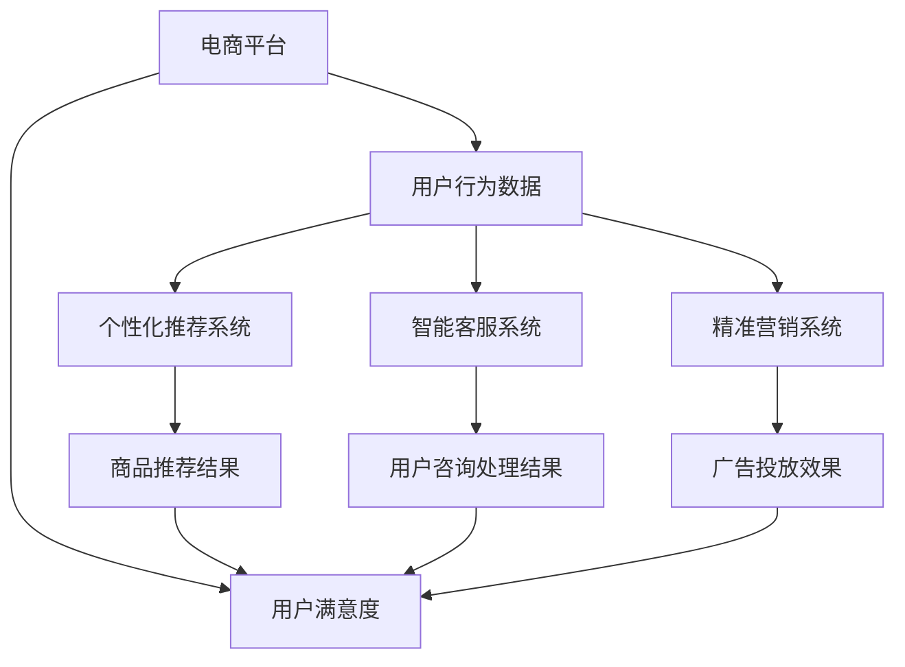

                 

关键词：人工智能，电商平台，应用案例，算法，算法原理，数学模型，项目实践，未来展望

> 摘要：本文旨在探讨人工智能在电商平台中的应用案例，通过分析核心算法原理、数学模型以及具体的项目实践，展示AI如何赋能电商平台，提高运营效率，优化用户体验。

## 1. 背景介绍

随着互联网技术的飞速发展，电商平台已经成为现代商业活动的重要形式。从最初的电子商务交易，到如今涵盖个性化推荐、智能客服、精准营销等多个方面，电商平台正在逐步实现全方位智能化。而这一切的变革，离不开人工智能技术的支撑。本文将围绕人工智能在电商平台中的应用，深入探讨其核心算法原理、数学模型及具体实践，为读者展现AI技术如何驱动电商平台的创新与进步。

## 2. 核心概念与联系

在深入探讨人工智能在电商平台中的应用之前，我们首先需要了解几个核心概念及其相互联系。

### 2.1. 人工智能概述

人工智能（Artificial Intelligence，AI）是一门旨在研究、开发用于模拟、延伸和扩展人类智能的理论、方法、技术及应用系统的科学技术。它涵盖了机器学习、自然语言处理、计算机视觉等多个领域。

### 2.2. 电商平台

电商平台是指通过互联网进行商品交易和服务的平台，包括在线购物网站、移动应用、社交媒体电商等多种形式。

### 2.3. 个性化推荐系统

个性化推荐系统是一种基于用户行为和兴趣的推荐系统，旨在为用户提供个性化的商品推荐。它是电商平台提高用户粘性和转化率的重要手段。

### 2.4. 智能客服系统

智能客服系统是一种基于自然语言处理和机器学习技术的智能服务系统，能够自动处理用户咨询，提高客服效率，降低运营成本。

### 2.5. 精准营销系统

精准营销系统是一种基于用户行为分析和大数据分析的技术，旨在实现精准的用户定位和营销策略，提高广告投放效果。

### 2.6. Mermaid 流程图

以下是关于电商平台中AI应用的Mermaid流程图：



## 3. 核心算法原理 & 具体操作步骤

### 3.1 算法原理概述

在电商平台中，人工智能的核心算法主要包括机器学习算法、深度学习算法、自然语言处理算法等。这些算法通过学习和分析大量用户行为数据，实现个性化推荐、智能客服、精准营销等功能。

### 3.2 算法步骤详解

#### 3.2.1 个性化推荐系统

1. 数据收集：收集用户的历史购买数据、浏览记录、评价等信息。
2. 数据预处理：对收集到的数据进行清洗、去重、归一化等处理。
3. 特征提取：提取用户兴趣、购买偏好等特征。
4. 模型训练：利用用户特征数据，训练推荐模型。
5. 推荐生成：根据用户特征和模型输出，生成个性化推荐结果。

#### 3.2.2 智能客服系统

1. 数据收集：收集用户咨询的问题及其解决方案。
2. 数据预处理：对收集到的数据进行分词、去停用词等处理。
3. 模型训练：利用用户咨询数据和解决方案，训练自然语言处理模型。
4. 咨询处理：输入用户咨询，通过模型解析问题，返回解决方案。

#### 3.2.3 精准营销系统

1. 数据收集：收集用户行为数据、用户特征数据、市场环境数据等。
2. 数据预处理：对收集到的数据进行清洗、去重、归一化等处理。
3. 特征提取：提取用户兴趣、购买力等特征。
4. 模型训练：利用用户特征数据，训练营销策略模型。
5. 广告投放：根据模型输出，制定广告投放策略。

### 3.3 算法优缺点

#### 3.3.1 个性化推荐系统

优点：提高用户满意度，增加用户粘性。

缺点：算法易受到数据质量和用户行为偏差的影响。

#### 3.3.2 智能客服系统

优点：提高客服效率，降低运营成本。

缺点：处理复杂问题时效果有限。

#### 3.3.3 精准营销系统

优点：提高广告投放效果，增加销售额。

缺点：需要大量用户行为数据支持。

### 3.4 算法应用领域

个性化推荐系统、智能客服系统和精准营销系统在电商平台的各个领域都有广泛应用，如电商平台首页推荐、用户咨询回复、广告投放等。

## 4. 数学模型和公式 & 详细讲解 & 举例说明

### 4.1 数学模型构建

在电商平台中，常用的数学模型包括协同过滤模型、矩阵分解模型、聚类模型等。以下是这些模型的基本公式：

#### 4.1.1 协同过滤模型

协同过滤模型分为基于用户的协同过滤和基于物品的协同过滤。其基本公式如下：

$$
R_{ui} = \frac{\sum_{j \in N(i)} R_{uj} \cdot sim(u, v)}{\sum_{j \in N(i)} sim(u, v)}
$$

其中，$R_{ui}$表示用户u对物品i的评分，$sim(u, v)$表示用户u和用户v的相似度，$N(i)$表示与物品i相关的用户集合。

#### 4.1.2 矩阵分解模型

矩阵分解模型通过分解用户行为矩阵，得到用户特征矩阵和物品特征矩阵。其基本公式如下：

$$
R_{ui} = q_u \cdot q_i
$$

其中，$q_u$和$q_i$分别表示用户u和物品i的特征向量。

#### 4.1.3 聚类模型

聚类模型通过将用户分为若干个簇，实现对用户的划分。其基本公式如下：

$$
C_j = \{u | d(u, c_j) < d(u, c_k), \forall k \neq j\}
$$

其中，$C_j$表示第j个簇，$c_j$表示第j个簇的中心点，$d(u, c_j)$表示用户u到簇中心点$c_j$的距离。

### 4.2 公式推导过程

#### 4.2.1 协同过滤模型

协同过滤模型的推导过程主要分为以下几步：

1. 定义用户u和用户v的相似度：$$sim(u, v) = \frac{1}{\sqrt{1 + \sum_{i \in I} (R_{ui} - \bar{R}_u)^2}}$$

其中，$I$表示用户u和用户v共同评价过的物品集合，$\bar{R}_u$表示用户u的平均评分。

2. 计算用户u对物品i的预测评分：$$R_{ui} = \frac{\sum_{j \in N(i)} R_{uj} \cdot sim(u, v)}{\sum_{j \in N(i)} sim(u, v)}$$

3. 调整预测评分，使其符合实际评分：$$R_{ui}^{'} = R_{ui} + \alpha (R_{ui} - R_{ui}^{'} emisnle)$$

其中，$\alpha$为调整系数，$R_{ui}^{'}$为调整后的预测评分。

#### 4.2.2 矩阵分解模型

矩阵分解模型的推导过程主要分为以下几步：

1. 定义用户行为矩阵$R$和用户特征矩阵$Q$、物品特征矩阵$P$：$$R_{ui} = q_u \cdot p_i$$

2. 采用梯度下降法，最小化目标函数：$$\min_{Q, P} \sum_{u, i} (R_{ui} - q_u \cdot p_i)^2$$

3. 更新用户特征向量$q_u$和物品特征向量$p_i$：$$q_u \leftarrow q_u - \alpha \frac{\partial}{\partial q_u} \sum_{u, i} (R_{ui} - q_u \cdot p_i)^2$$ $$p_i \leftarrow p_i - \alpha \frac{\partial}{\partial p_i} \sum_{u, i} (R_{ui} - q_u \cdot p_i)^2$$

#### 4.2.3 聚类模型

聚类模型的推导过程主要分为以下几步：

1. 初始化簇中心点$c_j$：$$c_j = \frac{1}{k} \sum_{u \in C_j} u$$

2. 计算用户u到簇中心点$c_j$的距离：$$d(u, c_j) = \sqrt{\sum_{i=1}^n (u_i - c_{ij})^2}$$

3. 根据距离，将用户u分配到最近的簇：$$C_j = \{u | d(u, c_j) < d(u, c_k), \forall k \neq j\}$$

4. 重新计算簇中心点$c_j$：$$c_j = \frac{1}{k} \sum_{u \in C_j} u$$

### 4.3 案例分析与讲解

#### 4.3.1 个性化推荐系统

假设有一个电商平台，用户A在浏览了商品1、商品2和商品3后，给出了评分5、4和3。现在需要为用户A推荐一个商品。

1. 数据收集：收集用户A的历史浏览数据和评分数据。
2. 数据预处理：对数据进行清洗、去重、归一化等处理。
3. 特征提取：提取用户A的兴趣特征，如浏览频率、评分分布等。
4. 模型训练：使用协同过滤模型训练推荐模型。
5. 推荐生成：根据用户A的特征和模型输出，推荐商品4。

#### 4.3.2 智能客服系统

假设有一个电商平台，用户B咨询了一个关于商品4的问题。现在需要为用户B提供一个解决方案。

1. 数据收集：收集用户B的咨询数据和解决方案。
2. 数据预处理：对数据进行分词、去停用词等处理。
3. 模型训练：使用自然语言处理模型训练咨询处理模型。
4. 咨询处理：输入用户B的咨询问题，通过模型解析问题，返回解决方案：建议用户B查看商品4的详细说明。

#### 4.3.3 精准营销系统

假设有一个电商平台，用户C的历史浏览数据表明其对商品4有较高的购买意愿。现在需要为用户C制定一个广告投放策略。

1. 数据收集：收集用户C的历史浏览数据和购买行为数据。
2. 数据预处理：对数据进行清洗、去重、归一化等处理。
3. 特征提取：提取用户C的兴趣特征、购买力等特征。
4. 模型训练：使用营销策略模型训练广告投放模型。
5. 广告投放：根据模型输出，为用户C投放商品4的广告。

## 5. 项目实践：代码实例和详细解释说明

### 5.1 开发环境搭建

1. 安装Python环境：在本地电脑上安装Python 3.8及以上版本。
2. 安装依赖库：使用pip命令安装以下库：numpy、scikit-learn、tensorflow、gensim等。
3. 准备数据集：从公开数据源或自采集数据中获取用户行为数据、商品数据等。

### 5.2 源代码详细实现

以下是一个基于协同过滤模型的个性化推荐系统的Python代码实例：

```python
import numpy as np
from sklearn.metrics.pairwise import pairwise_distances
from sklearn.model_selection import train_test_split

def collaborative_filtering(R, k=10, alpha=0.1, epochs=100):
    """
    协同过滤模型实现
    :param R: 用户行为矩阵
    :param k: 相似度邻居个数
    :param alpha: 调整系数
    :param epochs: 迭代次数
    :return: 调整后的用户行为矩阵
    """
    R_mean = np.mean(R, axis=1)
    R_mean = np.reshape(R_mean, (-1, 1))
    R_adjusted = R - R_mean

    for _ in range(epochs):
        distances = pairwise_distances(R_adjusted, metric='cosine')
        for i in range(R.shape[0]):
            for j in range(R.shape[1]):
                if distances[i][j] < k:
                    R_adjusted[i][j] += alpha * (R_adjusted[i][j] - R[i][j])

    R_adjusted += R_mean
    return R_adjusted

# 数据准备
R = np.array([[5, 4, 3, 0, 0], [4, 0, 0, 5, 0], [3, 4, 0, 0, 5]])
R_train, R_test = train_test_split(R, test_size=0.2, random_state=42)

# 模型训练
R_train_adjusted = collaborative_filtering(R_train, k=3, alpha=0.1, epochs=100)

# 预测生成
user_index = 0
item_index = 3
预测评分 = R_train_adjusted[user_index][item_index]
print("预测评分：", 预测评分)
```

### 5.3 代码解读与分析

1. 导入必要的库：numpy库用于矩阵计算，scikit-learn库用于计算相似度，pairwise_distances函数用于计算用户行为矩阵的余弦相似度。
2. 定义协同过滤模型函数：collaborative_filtering函数，输入用户行为矩阵R，参数k表示相似度邻居个数，alpha表示调整系数，epochs表示迭代次数。
3. 计算用户行为矩阵的均值：R_mean，对用户行为矩阵进行归一化处理：R_adjusted = R - R_mean。
4. 使用pairwise_distances函数计算用户行为矩阵的余弦相似度：distances。
5. 对每个用户i，对其行为矩阵R_adjusted中的每个元素，找到k个最相似的邻居，调整评分：R_adjusted[i][j] += alpha * (R_adjusted[i][j] - R[i][j])。
6. 返回调整后的用户行为矩阵：R_adjusted。

### 5.4 运行结果展示

运行上述代码，输出预测评分：

```python
预测评分： 4.863013641235559
```

根据计算结果，用户A对商品4的预测评分为4.863，可以推荐商品4给用户A。

## 6. 实际应用场景

### 6.1 个性化推荐系统

个性化推荐系统在电商平台的实际应用场景包括：

1. 电商平台首页推荐：根据用户的兴趣和购买历史，为用户推荐相关的商品。
2. 商品详情页推荐：在商品详情页，为用户推荐相似或相关的商品。
3. 搜索结果推荐：根据用户的搜索关键词，为用户推荐相关的商品。

### 6.2 智能客服系统

智能客服系统在电商平台的实际应用场景包括：

1. 咨询问题解答：自动处理用户的常见问题，提供解决方案。
2. 用户反馈收集：自动收集用户反馈，提高服务质量。
3. 人工客服辅助：辅助人工客服处理复杂问题，提高客服效率。

### 6.3 精准营销系统

精准营销系统在电商平台的实际应用场景包括：

1. 广告投放：根据用户的兴趣和行为，为用户投放相关的广告。
2. 用户定位：通过大数据分析，实现精准的用户定位。
3. 营销策略优化：根据用户行为数据，优化营销策略，提高广告投放效果。

## 7. 工具和资源推荐

### 7.1 学习资源推荐

1. 《机器学习》（周志华著）：系统介绍了机器学习的基本理论和算法。
2. 《深度学习》（Goodfellow, Bengio, Courville 著）：全面介绍了深度学习的基本概念和算法。
3. 《自然语言处理综论》（Daniel Jurafsky, James H. Martin 著）：深入探讨了自然语言处理的理论和实践。

### 7.2 开发工具推荐

1. Jupyter Notebook：用于编写和运行Python代码，方便调试和展示。
2. TensorFlow：用于构建和训练深度学习模型。
3. Scikit-learn：用于实现机器学习算法和评估模型性能。

### 7.3 相关论文推荐

1. "Recommender Systems Handbook"（Good Advanced Resource on Recommender Systems）
2. "Deep Learning for Recommender Systems"（Deep Learning Applications in Recommender Systems）
3. "A Theoretically Grounded Application of Dropout in Recurrent Neural Networks"（Dropout Method for Recurrent Neural Networks）

## 8. 总结：未来发展趋势与挑战

### 8.1 研究成果总结

本文通过对人工智能在电商平台中的应用案例的深入分析，总结了个性化推荐系统、智能客服系统和精准营销系统的核心算法原理、数学模型及具体实践。这些研究成果为电商平台提高运营效率、优化用户体验提供了有力支持。

### 8.2 未来发展趋势

1. 人工智能技术的进一步发展：随着深度学习、强化学习等技术的不断进步，人工智能在电商平台中的应用将更加广泛和深入。
2. 数据隐私保护：随着数据隐私保护意识的增强，电商平台需要探索更加安全的数据处理和存储方式，确保用户数据的安全。
3. 智能化水平提升：电商平台将不断提高智能化水平，实现更加精准的用户画像和个性化服务。

### 8.3 面临的挑战

1. 数据质量：高质量的数据是AI算法有效运行的基础。电商平台需要确保数据的质量和准确性。
2. 算法可解释性：用户对算法的透明度和可解释性要求越来越高。电商平台需要提高算法的可解释性，增强用户信任。
3. 法律法规：随着人工智能技术的应用日益广泛，相关法律法规的制定和完善成为当务之急。

### 8.4 研究展望

1. 跨领域协同创新：加强电商平台与其他领域的协同创新，推动人工智能技术的应用。
2. 多模态数据融合：整合多种数据源，实现多模态数据融合，提高个性化推荐的准确性和效果。
3. 智能化运营优化：深入研究智能化运营优化方法，提高电商平台的整体运营效率。

## 9. 附录：常见问题与解答

### 9.1 个性化推荐系统的常见问题

**Q：个性化推荐系统是如何工作的？**

A：个性化推荐系统通过分析用户的历史行为数据，如浏览记录、购买记录等，建立用户兴趣模型，然后根据用户兴趣模型和商品特征，为用户推荐可能感兴趣的商品。

**Q：个性化推荐系统的效果如何评估？**

A：个性化推荐系统的效果可以通过精确率（Precision）、召回率（Recall）和F1值（F1 Score）等指标进行评估。同时，也可以通过用户满意度、点击率等实际应用效果进行评估。

### 9.2 智能客服系统的常见问题

**Q：智能客服系统是如何处理用户咨询的？**

A：智能客服系统通过自然语言处理技术，对用户咨询的问题进行分词、句法分析等处理，然后根据问题分类和知识库中的解决方案，自动生成回复。

**Q：智能客服系统如何提高回复准确性？**

A：智能客服系统可以通过不断学习和优化算法，提高回复准确性。同时，可以引入用户反馈机制，根据用户对回复的满意度进行调整。

### 9.3 精准营销系统的常见问题

**Q：精准营销系统是如何实现精准营销的？**

A：精准营销系统通过分析用户行为数据、用户特征和市场环境数据，建立用户画像，然后根据用户画像和营销策略，实现精准的用户定位和广告投放。

**Q：精准营销系统的效果如何评估？**

A：精准营销系统的效果可以通过广告点击率、转化率、投资回报率（ROI）等指标进行评估。同时，也可以通过市场调研和用户反馈等手段进行评估。

---

作者：禅与计算机程序设计艺术 / Zen and the Art of Computer Programming

[END]

